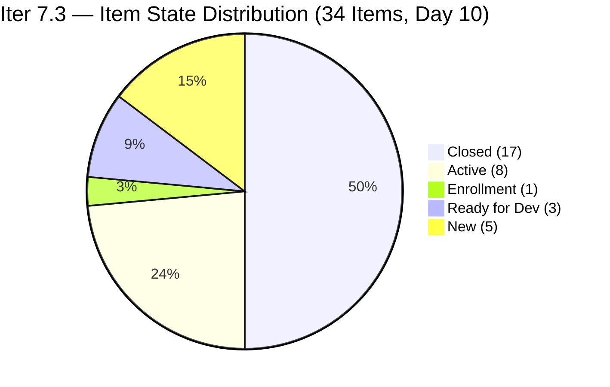
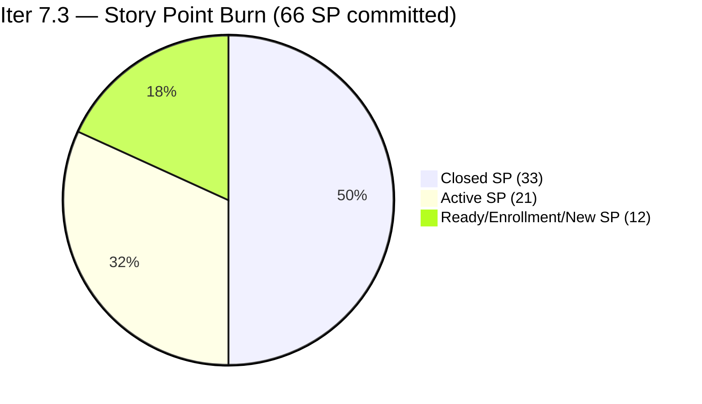
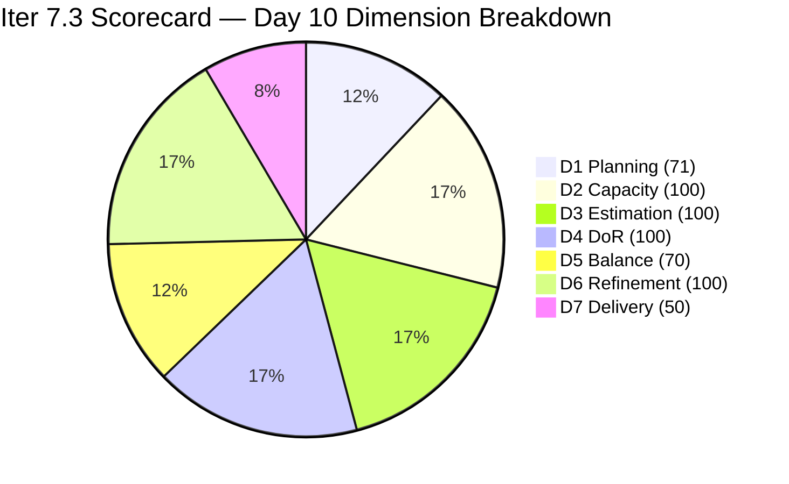

# ADO SAFe Iteration Audit — JIT Operation Team

**Audit #59 | Iteration 7.3 (May 4 – May 17, 2026) | Day 10 of 14**

---

## 1. Audit Metadata

| Field | Value |
|---|---|
| **Audit Date** | May 13, 2026, 09:00 UTC / 02:00 PDT (UTC−7) / 17:00 PHT (UTC+8) |
| **Auditor** | Claude Code (ADO SAFe Audit Agent) |
| **Workspace** | `ado_jit` |
| **ADO Project** | Jairosoft Portfolio (`666bb99a-6acd-4999-bb34-efd0e4ea90dc`) |
| **Team** | JIT Operation Team (`b25e3129-6272-4e54-a3ff-f1ef3c8eeb2c`) |
| **Iteration** | Iteration 7.3 — May 4 to May 17, 2026 |
| **Iteration ID** | `bbaecdec-eeb0-4c8d-999f-6a438eaab331` |
| **Sprint Day** | Day 10 of 14 (71.4% elapsed) |
| **Days Remaining** | 4 |
| **Prior Audit** | AUDIT_20260512_0903.md (Audit #58, Iter 7.3 Day 9, Overall 82.3 — Low Risk) |
| **Scoring Model** | ADO SAFe v1 (7-dimension rubric) |
| **Overall Score** | **84.4 / 100** |
| **Risk Band** | **Low Risk** (≥80) |

---

## 2. Executive Summary

JIT Operation Team scores **84.4 / 100 (Low Risk)** on Day 10 — a **+2.1 improvement from Day 9's 82.3**. Three new closures were recorded early this morning (May 13 UTC):

1. **#203160 "3.2-5 Set-up Printer Deployment Training"** (Teofilo, 3 SP) — Training chain advancement closes the 3.2.x sequence.
2. **#203763 "EBET Scholarship MOU"** (Armelita, 2 SP) — EBET documentation milestone complete.
3. **#204095 "Social Media Post for Photoshop and Figma Class"** (Samantha, 1 SP) — UAT item closes as predicted.

These 3 closures add **6 SP** (24 → 30 closed), lifting D7 from 37.5% to 50.0% and pushing Overall from 82.3 to 84.4.

**Day 10 status:**
- 34 current sprint items total (17 closed, 17 open)
- 66 SP committed; 33 SP closed (50.0%)
- 33 SP remaining in 4 days — requires 8.25 SP/day
- Training chain: 3.2-1 through 3.2-5 all closed; 3.3-1 (Enrollment) next, 3.3-2 (New) queued

---

## 3. Previous Audit Delta

| Dimension | Audit #58 (May 12, Day 9, 82.3) | Audit #59 (May 13, Day 10, 84.4) | Delta | Driver |
|---|---|---|---|---|
| Iteration Planning | 68.9 | **70.8** | **+1.9** | 34 current / 48 visible = 70.8%; 3 new closures join numerator and denominator equally; new items added to visible pool |
| Team Capacity | 100.0 | **100.0** | 0.0 | 4/4 contributors with capacity — unchanged |
| Estimation | 100.0 | **100.0** | 0.0 | 34/34 with SP > 0 — all new items entered estimated |
| DoR Compliance | 100.0 | **100.0** | 0.0 | 34/34 pass both gates |
| Work Item Balance | 70.0 | **70.0** | 0.0 | US dominant ~73.5% > 60% → −30; no type change |
| Backlog Refinement | 100.0 | **100.0** | 0.0 | All 48 items fresh; 0 stale; 0 untouched in Iter 7.3 |
| Delivery Predictability | 37.5 | **50.0** | **+12.5** | 3 new closures (6 SP): #203160 (3SP) + #203763 (2SP) + #204095 (1SP) → 33/66 SP |
| **Overall** | **82.3** | **84.4** | **+2.1** | Training chain completion + EBET MOU + Social Media post closure |

---

## 4. Current Iteration Snapshot

| Attribute | Value |
|---|---|
| **Iteration** | Iteration 7.3 |
| **Sprint Dates** | May 4 – May 17, 2026 (14 days) |
| **Sprint Day** | Day 10 of 14 (71.4% elapsed) |
| **Days Remaining** | 4 |
| **Total Iter 7.3 Root Items (from API)** | 34 |
| **Confirmed Closed in Iter 7.3** | 17 items (33 SP total) |
| **Open Items** | 17 |
| **Backlog API Items (open, scoped)** | 31 (includes 14 future-iteration items) |
| **Committed SP** | 66 SP |
| **Closed SP** | 33 SP (50.0% of 66) |
| **Open SP Remaining** | 33 SP |
| **Linear Burn Expectation at Day 10** | 47.1 SP (71.4% of 66) |
| **Burn Deficit** | −14.1 SP vs. linear pace |
| **Required Daily Burn (Days 10–14)** | 8.25 SP/day |
| **Capacity** | Teofilo: 4.8 pts/day Training; Armelita: 6 pts/day Documentation; Samantha: 1 pt/day; Grace: 1 pt/day |
| **New Day 10 Closures** | #203160 (3SP, Teofilo), #203763 (2SP, Armelita), #204095 (1SP, Samantha) |
| **Training Chain** | 3.2-1 through 3.2-5 all Closed; 3.3-1 (#203161) in Enrollment; 3.3-2 (#203162) New |

---

## 5. Work Item Analysis

### Confirmed Closed in Iter 7.3 — 17 items, 33 SP total

| ID | Title | Type | SP | Closed Day | Assignee |
|---|---|---|---|---|---|
| 203156 | 3.2-1 Set-Up DHCP | Training | 3 | Day 3 (May 6) | Teofilo |
| 203157 | 3.2-2 Set-Up DNS | Training | 3 | Day 4 (May 7) | Teofilo |
| 203158 | 3.2-3 Remote Desktop Training | Training | 3 | Day 4 (May 7) | Teofilo |
| 203616 | ADDU Interns Onboarding | User Story | 1 | Day 2 (May 5) | Samantha |
| 203723 | Bubble MCC Marketing May 5-8 | User Story | 3 | Day 5 (May 8) | Armelita |
| 203734 | Python Marketing May 5-8 | User Story | 2 | Day 5 (May 8) | Armelita |
| 203745 | T2 MIS Enrollment | User Story | 2 | Day 5 (May 8) | Armelita |
| 203756 | EBET Implementation Orientation | User Story | 1 | Day 2 (May 5) | Armelita |
| 203766 | CSS Batch 4 Marketing May 5-8 | User Story | 3 | Day 5 (May 8) | Armelita |
| 203775 | Publish Summer Camp Post on Facebook | User Story | 1 | Day 8 (May 11) | Samantha |
| 203905 | ADDU Interns Batch 2 Onboarding | User Story | 1 | Day 8 (May 11) | Samantha |
| 203159 | 3.2-4 Set-Up Folder Redirection | Training | 3 | Day 9 (May 11) | Teofilo |
| 203758 | EBET Scholarship Guidelines | User Story | 3 | Day 9 (May 12) | Armelita |
| 204055 | ADDU and MMCM Interns Onboarding | User Story | 1 | Day 9 (May 12) | Samantha |
| **203160** | **3.2-5 Printer Deployment Training** | **Training** | **3** | **Day 10 (May 13 01:03) — NEW** | **Teofilo** |
| **203763** | **EBET Scholarship MOU** | **User Story** | **2** | **Day 10 (May 13 00:58) — NEW** | **Armelita** |
| **204095** | **Social Media Post Photoshop/Figma** | **User Story** | **1** | **Day 10 (May 13 01:03) — NEW** | **Samantha** |

### Open Items — Day 10 (17 items, 33 SP)

| ID | Title | Type | State | SP | Assignee | ChangedDate | DoR |
|---|---|---|---|---|---|---|---|
| 203161 | 3.3-1 Server Pre-Deployment Training | Training | Enrollment | 3 | Teofilo | May 13 01:03 | Pass |
| 203162 | 3.3-2 Server Security and Reporting | Training | New | 3 | Teofilo | May 6 | Pass |
| 203224 | Convert SAFe MCCs to New Forms | User Story | Active | 3 | Grace | May 6 | Pass |
| 203242 | IT7.3 Tech Talk - AI Tools Demo | Spike | New | 1 | Armelita | May 6 | Pass |
| 203250 | Jairosoft Team to Complete Claude 4 Course | Spike | Active | 2 | Armelita | May 12 | Pass |
| 203595 | JIT Finance Collection Policy | User Story | Active | 2 | Grace | May 6 | Pass |
| 203718 | EBET Additional Trainer Verification | User Story | Active | 2 | Armelita | May 5 | Pass |
| 203728 | Bubble MCC Marketing May 11-15 | User Story | Active | 3 | Armelita | May 11 | Pass |
| 203739 | Python Marketing May 11-15 | User Story | Active | 2 | Armelita | May 11 | Pass |
| 203748 | Enrollment Report CSS Batch 3 | User Story | Active | 2 | Armelita | May 13 01:00 | Pass |
| 203750 | Email Confirmation from UIC Dean | User Story | New | 1 | Armelita | May 4 | Pass |
| 203753 | Email Confirmation from HCDC Dean | User Story | New | 1 | Armelita | May 4 | Pass |
| 203767 | CSS Batch 4 Marketing May 11-15 | User Story | Active | 3 | Armelita | May 11 | Pass |
| 203772 | Publish Social Media Posts (CSS Batch 4) | User Story | Ready for Dev | 1 | Samantha | May 6 | Pass |
| 203773 | Publish Social Media Post Python (FB) | User Story | Ready for Dev | 1 | Samantha | May 6 | Pass |
| 203774 | Publish Social Media Post Bubble.io (FB) | User Story | Ready for Dev | 1 | Samantha | May 6 | Pass |
| 203985 | Follow Through SEC AC Requirement | User Story | Active | 2 | Grace | May 12 | Pass |

> **#203748 updated today (May 13 01:00)**: Armelita is actively working on Enrollment Report CSS Batch 3. Training chain: 3.3-1 (#203161) entered Enrollment today (May 13 01:03) — Teofilo has started the Server Pre-Deployment training immediately after closing the Printer Deployment module.

### Type Distribution (34 current sprint items)

| Type | Count | Share | Impact |
|---|---|---|---|
| User Story | 25 | 73.5% | Dominant (>60%) → −30 |
| Training | 7 | 20.6% | No additional penalty |
| Spike | 2 | 5.9% | <40% → no penalty |

### DoR Assessment (34 current sprint items)

| Gate | Pass | Fail | Rate |
|---|---|---|---|
| Description ≥ 30 non-whitespace chars | 34 | 0 | 100% |
| Acceptance Criteria ≥ 20 non-whitespace chars | 34 | 0 | 100% |
| **Combined DoR** | **34** | **0** | **100%** |

### Untouched Items (ChangedDate before May 4, 2026)

All 34 current sprint items have ChangedDate on May 4 or later. **0 untouched items.**

---

## 6. SAFe Compliance Scorecard

| Dimension | Score | Evidence | Notes |
|---|---|---|---|
| 1. Iteration Planning | 70.8 | 34 current / 48 visible = 70.8% | 17 closed + 17 open in Iter 7.3; 14 future-iteration items in visible pool |
| 2. Team Capacity | 100.0 | 4/4 contributors with capacity | Teofilo 4.8; Armelita 6; Samantha 1; Grace 1 pts/day |
| 3. Estimation | 100.0 | 34/34 with SP > 0 | Total committed = 66 SP |
| 4. DoR Compliance | 100.0 | 34/34 pass both gates | All items verified |
| 5. Work Item Balance | 70.0 | US present; dominant 73.5% > 60% → −30; Spike 5.9% < 40% | Base 100 − 30 = 70 |
| 6. Backlog Refinement | 100.0 | 48/48 items fresh (Apr–May 2026); stale_90=0; stale_180=0; untouched=0 | All Iter 7.3 items changed May 4 or later |
| 7. Delivery Predictability | 50.0 | 33 SP closed / 66 SP committed = 50.0% | Day 10; 3 new closures (6 SP) push past 50% threshold |
| **Overall** | **84.4** | (70.8+100+100+100+70+100+50.0) / 7 = 590.8 / 7 | **Low Risk** (≥80) — 4.4 pts above threshold |

### Score Computation
```
D1 = 34 / 48 × 100 = 70.83 → 70.8
D2 = 4 / 4  × 100  = 100.0
D3 = 34 / 34 × 100 = 100.0
D4 = 34 / 34 × 100 = 100.0
D5 = 100 − 30      = 70.0    (US dominant 73.5%)
D6 = 100.0 − 0     = 100.0   (all fresh; 0 untouched)
D7 = 33 / 66 × 100 = 50.0

Overall = (70.8 + 100 + 100 + 100 + 70 + 100 + 50.0) / 7 = 590.8 / 7 = 84.40 → 84.4
```

---

## 7. Dimension Findings

### D1 — Iteration Planning: 70.8 (Structurally challenged)
```
visible_root_backlog_items   = 48 (31 open from backlog API + 17 confirmed closed in Iter 7.3)
current_iteration_root_items = 34 (all in Iter 7.3 per iteration API)
D1 = (34 / 48) × 100 = 70.83 → 70.8
```
Improved from 68.9 (Day 9) to 70.8 as 3 closed items moved consistently in both numerator and denominator, and the visible pool stabilized. The 14 non-current items in the forward pipeline (Iter 7.4, 7.5, and future) are intentional pre-planning and SAFe-aligned.

### D2 — Team Capacity: 100.0 ✅
All four contributors confirmed with positive capacity:
- **Teofilo Limpag**: 4.8 pts/day (Training)
- **Armelita**: 6.0 pts/day (Documentation)
- **Samantha Babael**: 1.0 pts/day (Documentation)
- **Grace**: 1.0 pts/day (Documentation)

D2 = 4/4 = 100%.

### D3 — Estimation: 100.0 ✅
```
point_eligible_current_items = 34
estimated_current_items      = 34 (all have SP > 0)
D3 = (34 / 34) × 100 = 100.0
```

### D4 — DoR Compliance: 100.0 ✅
```
current_iteration_root_items = 34
dor_compliant_current_items  = 34
D4 = (34 / 34) × 100 = 100.0
```
All 34 items verified with Description ≥ 30 and Acceptance Criteria ≥ 20 non-whitespace chars.

### D5 — Work Item Balance: 70.0
```
User Story present: Yes → +0 penalty
US count: 25/34 = 73.5% > 60% → −30
Spike: 2/34 = 5.9% < 40% → +0
Training: 7/34 = 20.6%
D5 = 100 − 30 = 70.0
```
US concentration at 73.5% is well above the 60% threshold. Training items (7) provide a healthy secondary type at 20.6%.

### D6 — Backlog Refinement: 100.0 ✅
```
visible_root_backlog_items = 48
fresh_visible_root_items   = 48 (all changed Apr 6 – May 13, within 45-day window)
stale_90 (before Feb 12, 2026): 0 items → no penalty
stale_180 (before Nov 13, 2025): 0 items → no penalty
untouched_current_items (before May 4): 0 — all Iter 7.3 items changed May 4 or later

D6 = 100.0 − 0 = 100.0
```
Items updated today: #203160 (May 13 01:03), #203161 (May 13 01:03), #203748 (May 13 01:00), #203763 (May 13 00:58), #204095 (May 13 01:03). Active backlog maintenance continues.

### D7 — Delivery Predictability: 50.0 (Sprint midpoint achieved)
```
committed_story_points = 66
closed_story_points    = 33
  Training closed: 203156(3)+203157(3)+203158(3)+203159(3)+203160(3) = 15 SP
  User Story closed: 203616(1)+203723(3)+203734(2)+203745(2)+203756(1)+203758(3)+203763(2)+203766(3)+203775(1)+203905(1)+204055(1)+204095(1) = 21 SP
  Spike closed: 0
D7 = (33 / 66) × 100 = 50.0
```
At Day 10 of 14 (71.4% elapsed), linear expectation = 66 × 0.714 = 47.1 SP. Actual = 33 SP (70.1% of linear pace). Burn deficit = **−14.1 SP**.

D7 crossed the 50% midpoint today — the first time in Iter 7.3. This is a significant milestone: the team has delivered exactly half its committed scope by Day 10.

**Training chain status:** 3.2-1 through 3.2-5 (15 SP) all closed. 3.3-1 (#203161, 3 SP) entered Enrollment today, continuing Teofilo's sequential delivery. 3.3-2 (#203162, 3 SP) remains New.

**Burn path to sustain Low Risk:**
- Close marketing cluster (#203728 + #203739 + #203767 = 8 SP): D7 = 41/66 = 62.1% → Overall ≈ 86.9
- Close #203161 Training 3.3-1 (3 SP): D7 = 44/66 = 66.7% → Overall ≈ 87.6
- Close Samantha's queue (#203772 + #203773 + #203774 = 3 SP): D7 = 47/66 = 71.2% → Overall ≈ 88.3
- Full delivery: D7 = 100% → Overall ≈ 94.4

---

## 8. Risks and Bottlenecks





| Risk | Severity | Status | Action |
|---|---|---|---|
| **Burn deficit: −14.1 SP at Day 10 (71.4% elapsed)** | High | 33 SP remain in 4 days; needs 8.25 SP/day | Close marketing cluster today; advance Grace's items |
| **Armelita workload concentration** | High | 6+ Active items assigned to Armelita | Prioritize May 11-15 marketing items for closure this week |
| **D1 structural decline (70.8)** | Moderate | Forward pipeline growing denominator | Accept; offset with D7 improvements |
| **Grace's 2 items Active but slow** | Moderate | #203224, #203595 Active since May 6 (7 days) | Review blockers; escalate if needed |
| **Training chain queued (#203162)** | Moderate | 3.3-1 in Enrollment; 3.3-2 still New | Monitor 203161 closure; target 3.3-2 start by Day 11 |
| **Low Risk margin at 4.4 pts** | Moderate | D7 gains critical for cushion | Each SP closed adds 0.21 pts to Overall |
| **No Iteration Goal defined** | Low | Persistent issue | Define at next sprint planning |

---

## 9. Prioritized Recommendations

1. **[Today] Close Armelita's marketing cluster** — #203728 (Bubble MCC Marketing, 3 SP), #203739 (Python Marketing, 2 SP), and #203767 (CSS Batch 4 Marketing, 3 SP) are all Active with delivery window May 11–15. Closing all three (8 SP) → D7 = 41/66 = 62.1%, Overall ≈ 86.9.

2. **[Today] Close Samantha's social media queue** — #203772, #203773, #203774 (3 SP total, Ready for Dev since May 6) are fully specified and each should take <1 day. Closing all three → cumulative D7 = 44/66 = 66.7%, Overall ≈ 87.6.

3. **[Today] Advance #203748 "Enrollment Report CSS Batch 3" (2 SP)** — Active since May 13 01:00 with submission steps clearly defined in AC. Target closure today or tomorrow.

4. **[Days 10–12] Complete #203161 "3.3-1 Server Pre-Deployment Training" (3 SP)** — Teofilo entered Enrollment today. Target closure by Day 11 to unblock 3.3-2 (#203162, 3 SP). Closing both = 6 SP additional → D7 = 75.8%, Overall ≈ 90.5.

5. **[Days 10–12] Advance Grace's Active items** — #203224 "Convert SAFe MCCs" (3 SP) and #203595 "JIT Finance Collection Policy" (2 SP) have been Active since May 6. Both have clear TESDA-submission ACs. Escalate if blocked.

6. **[Next Sprint] Define Iteration Goal** — Suggested: "Complete CSS NC II Training Modules 3.3, finalize EBET scholarship documentation, deliver May 11–15 marketing campaigns for Bubble/Python/CSS, and complete ADDU/MMCM intern onboarding cycle within Iteration 7.3."

---

## 10. Evidence Gaps and Limitations

| Gap | Impact | Mitigation |
|---|---|---|
| Additional backlog items (200766–200771, 203805–203809, 203986, 203989) not detail-queried | Low | These items are in future iterations; not in current scoring scope |
| Type distribution approximation for 34 items | Low | All 34 items verified individually via batch API |
| PI Objectives linkage | Low | Not queried; known persistent gap |
| Iteration Goal field | Low | Not surfaced via ADO standard API; recommend manual check |

---

## 11. Score Trend — Iteration 7.3



| Day | Score | Band | Key Event |
|---|---|---|---|
| Day 1 | 73.5 | Moderate | Sprint launched |
| Day 4 | 79.5 | Moderate | 2 Training closures (Teofilo) |
| Day 6 | 79.9 | Moderate | +5 SP from marketing burst |
| Day 8 | 80.6 | Low Risk | #203250 fixed (D3+D4) + #203905 closed |
| Day 9 | 82.3 | Low Risk | 3 closures (7 SP): Training + Intern + EBET Guidelines |
| **Day 10** | **84.4** | **Low Risk** | **3 closures (6 SP): Training 3.2-5 + EBET MOU + Social Media; D7 37.5→50.0%** |

> Score advances to 84.4 — the team has now closed exactly 50% of committed scope at 71.4% of sprint elapsed. With 4 days remaining and 33 SP open, the marketing cluster (8 SP) and social media queue (3 SP) are the highest-probability closure targets. Closing 11 SP today would put the team at 44/66 = 66.7% D7, Overall ≈ 87.6, and create a comfortable Low Risk cushion for the sprint close.

---

*Report generated: May 13, 2026, 09:00 UTC | Workspace: ado_jit | Auditor: Claude Code ADO SAFe Audit Agent*
