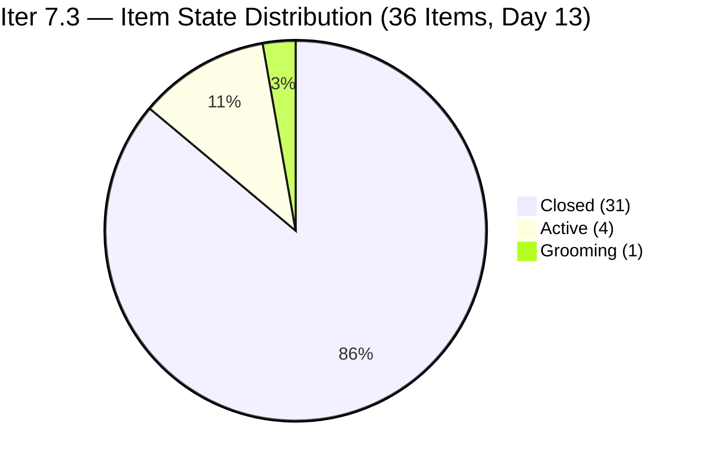
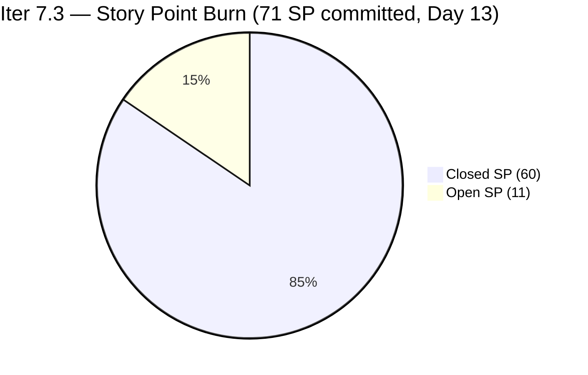
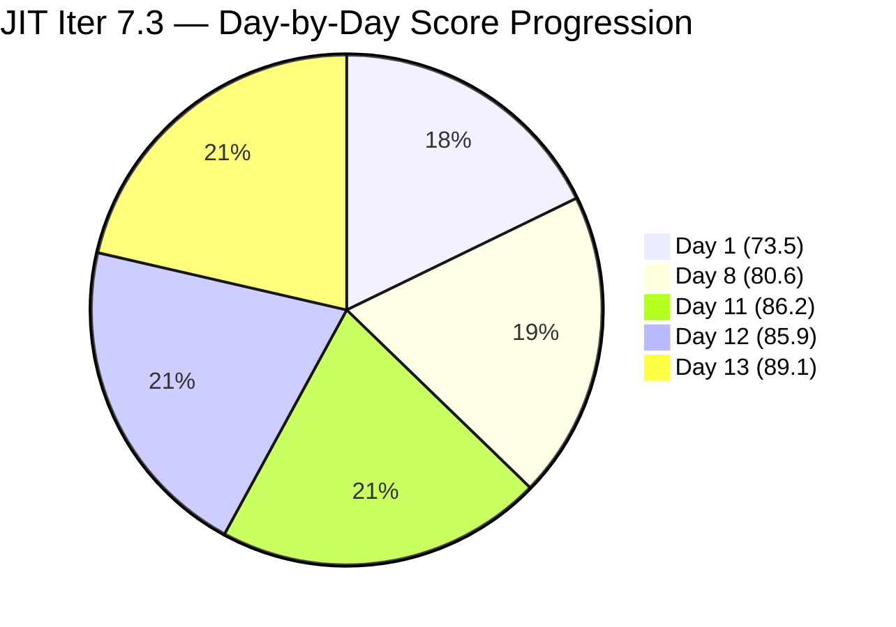

# ADO SAFe Iteration Audit — JIT Operation Team

**Audit #62 | Iteration 7.3 (May 4 – May 17, 2026) | Day 13 of 14**

---

## 1. Audit Metadata

| Field | Value |
|---|---|
| **Audit Date** | May 16, 2026, 02:04 CDT / 09:04 UTC / 17:04 PHT (UTC+8) |
| **Auditor** | Claude Code (ADO SAFe Audit Agent) |
| **Workspace** | `ado_jit` |
| **ADO Project** | Jairosoft Portfolio (`666bb99a-6acd-4999-bb34-efd0e4ea90dc`) |
| **Team** | JIT Operation Team (`b25e3129-6272-4e54-a3ff-f1ef3c8eeb2c`) |
| **Iteration** | Iteration 7.3 — May 4 to May 17, 2026 |
| **Iteration ID** | `bbaecdec-eeb0-4c8d-999f-6a438eaab331` |
| **Sprint Day** | Day 13 of 14 (92.9% elapsed) |
| **Days Remaining** | 1 |
| **Prior Audit** | AUDIT_20260515_0204.md (Audit #61, Iter 7.3 Day 12, Overall 85.9 — Low Risk) |
| **Scoring Model** | ADO SAFe v1 (7-dimension rubric) |
| **Overall Score** | **89.1 / 100** |
| **Risk Band** | **Low Risk** (≥80) |

---

## 2. Executive Summary

JIT Operation Team scores **89.1 / 100 (Low Risk)** on Day 13 — a **+3.2 improvement from Day 12's 85.9**, and a new sprint series high. The team delivered a major overnight burst: **8 items closed (16 SP)** in the early hours of May 16 UTC, pushing D7 from 62.0% to 84.5%.

**Day 13 Closures (May 15–16 UTC):**
- **#203162** 3.3-2 Server Security and Reporting Training (3 SP, Teofilo) — Closed May 15 14:20 UTC
- **#203718** EBET Additional Trainer Verification (2 SP, Armelita) — Closed May 16 01:47 UTC
- **#203748** Enrollment Report CSS Batch 3 (2 SP, Armelita) — Closed May 16 01:48 UTC
- **#203750** Email Confirmation from UIC Dean (1 SP, Armelita) — Closed May 16 01:48 UTC
- **#203753** Email Confirmation from HCDC Dean (1 SP, Armelita) — Closed May 16 01:55 UTC
- **#203767** CSS Batch 4 Marketing for May 11–15 (3 SP, Armelita) — Closed May 16 02:22 UTC
- **#203774** Follow up sir Teof on ph.net access (1 SP, Samantha) — Closed May 16 02:23 UTC
- **#204174** Prepare Bubble.io Scholarship Training Materials (3 SP, Samantha) — Closed May 16 02:23 UTC

**Day 13 Status:**
- **31 of 36 items Closed** in Iter 7.3 (86.1% item closure rate)
- **60 SP closed** of 71 SP committed = **84.5% delivery**
- 5 items remaining open: #203224 (3 SP, Grace), #203595 (2 SP, Grace), #203985 (2 SP, Grace), #203250 (2 SP, Armelita Spike), #204203 (2 SP, Unassigned Grooming/DoR FAIL)
- 11 SP remaining; 1 day left. Needs 11 SP to reach 100% delivery.

Armelita's sprint-end burst (6 closures = 9 SP in ~35 minutes, 01:47–02:23 UTC) mirrors the pattern seen from Almera on HR team and demonstrates strong individual output capacity when scope is well-defined. Grace's 3 items (7 SP) remain Active and are the primary delivery risk for the final day.

---

## 3. Previous Audit Delta

| Dimension | Audit #61 (May 15, Day 12, 85.9) | Audit #62 (May 16, Day 13, 89.1) | Delta | Driver |
|---|---|---|---|---|
| Iteration Planning | 72.0 | **72.0** | 0.0 | 36/50 unchanged; no new items or de-commitments |
| Team Capacity | 100.0 | **100.0** | 0.0 | 4/4 contributors with capacity — unchanged |
| Estimation | 100.0 | **100.0** | 0.0 | 36/36 items with SP > 0 — unchanged |
| DoR Compliance | 97.2 | **97.2** | 0.0 | #204203 still fails DoR; 35/36 — unchanged |
| Work Item Balance | 70.0 | **70.0** | 0.0 | US dominant 69.4% (25/36); structural |
| Backlog Refinement | 100.0 | **100.0** | 0.0 | All 50 visible fresh; 0 stale; 0 untouched |
| Delivery Predictability | 62.0 | **84.5** | **+22.5** | 60/71 SP (8 new closures = 16 SP); burst delivery |
| **Overall** | **85.9** | **89.1** | **+3.2** | D7 surge from burst closures; new sprint series high |

---

## 4. Current Iteration Snapshot

| Attribute | Value |
|---|---|
| **Iteration** | Iteration 7.3 |
| **Sprint Dates** | May 4 – May 17, 2026 (14 days) |
| **Sprint Day** | Day 13 of 14 (92.9% elapsed) |
| **Days Remaining** | 1 (May 17 sprint close) |
| **Total Iter 7.3 Items** | 36 (31 Closed, 5 open) |
| **Visible Root Backlog Items** | 50 (5 open Iter 7.3 + 31 Closed Iter 7.3 + 14 future iterations) |
| **Committed SP** | 71 SP |
| **Closed SP** | 60 SP (84.5%) |
| **Open SP Remaining** | 11 SP |
| **Linear Burn Expectation at Day 13** | 71 × 0.929 = 66.0 SP |
| **Actual vs. Linear** | 60 SP vs. 66 SP = −6 SP below linear (improving) |
| **Required to Hit 100% D7** | 11 SP in 1 day |
| **New Day 13 Closures** | 8 items, 16 SP (see Section 5) |
| **Capacity** | Teofilo: 4.8 pts/day; Armelita: 6 pts/day; Samantha: 1 pt/day; Grace: 1 pt/day |

---

## 5. Work Item Analysis

### New Closures — Day 13 (8 items, 16 SP)

| ID | Title | Type | SP | Assignee | Closed Time (UTC) |
|---|---|---|---|---|---|
| 203162 | 3.3-2 Server Security and Reporting Training | Training | 3 | Teofilo | May 15, 14:20 |
| 203718 | EBET Additional Trainer Verification | User Story | 2 | Armelita | May 16, 01:47 |
| 203748 | Enrollment Report CSS Batch 3 | User Story | 2 | Armelita | May 16, 01:48 |
| 203750 | Email Confirmation from UIC Dean | User Story | 1 | Armelita | May 16, 01:48 |
| 203753 | Email Confirmation from HCDC Dean | User Story | 1 | Armelita | May 16, 01:55 |
| 203767 | CSS Batch 4 Marketing for May 11–15 | User Story | 3 | Armelita | May 16, 02:22 |
| 203774 | Follow up sir Teof on ph.net access | User Story | 1 | Samantha | May 16, 02:23 |
| 204174 | Prepare Bubble.io Scholarship Training Materials | User Story | 3 | Samantha | May 16, 02:23 |

**Training chain complete:** All 7 modules (3.2-1 through 3.3-2) are now Closed. Teofilo's sequential training delivery pattern held perfectly — 1 module per ~1.5 days on average across the sprint.

### Open Items — Day 13 (5 items, 11 SP)

| ID | Title | Type | State | SP | Assignee | ChangedDate | DoR | Days Active |
|---|---|---|---|---|---|---|---|---|
| 203224 | Convert SAFe MCCs to New Forms | User Story | Active | 3 | Grace | May 6 | Pass | 11 days |
| 203595 | JIT Finance Collection Policy | User Story | Active | 2 | Grace | May 6 | Pass | 11 days |
| 203985 | Follow Through SEC AC Requirement | User Story | Active | 2 | Grace | May 12 | Pass | 4 days |
| 203250 | Jairosoft Team Members to Complete the Claude 4 Course | Spike | Active | 2 | Armelita | May 12 | Pass | 4 days |
| 204203 | 1st Assessment for Batch 3 COC 1 | User Story | Grooming | 2 | Unassigned | May 15 | **FAIL** | Added Day 12 |

### Confirmed Closed in Iter 7.3 — All 31 Items, 60 SP

| Phase | Assignee | Items | SP |
|---|---|---|---|
| Teofilo (Training) | Teofilo | 7 (203156–203162) | 21 SP |
| Armelita (Marketing/Ops) | Armelita | 14 items | 28 SP |
| Samantha (Social/Intern) | Samantha | 7 items | 7 SP |
| Armelita (Spike) | Armelita | 1 (203242 Tech Talk) | 1 SP |
| Armelita (Day 13 burst) | Armelita | 5 items | 9 SP |
| Samantha (Day 13 burst) | Samantha | 2 items | 4 SP |
| **Total** | | **31** | **60 SP** |

### Type Distribution (36 current sprint items)

| Type | Count | Share | Impact |
|---|---|---|---|
| User Story | 25 | 69.4% | Dominant (>60%) → −30 |
| Training | 7 | 19.4% | No additional penalty |
| Spike | 4 | 11.1% | <40% → no penalty |

### DoR Assessment

| Gate | Pass | Fail | Rate |
|---|---|---|---|
| Description ≥ 30 non-whitespace chars | 35 | 1 | 97.2% |
| Acceptance Criteria ≥ 20 non-whitespace chars | 35 | 1 | 97.2% |
| **Combined DoR** | **35** | **1** (#204203) | **97.2%** |

#204203 remains in Grooming with a single-sentence description and no Acceptance Criteria. This item has been DoR-failing since it was added Day 12.

---

## 6. SAFe Compliance Scorecard

| Dimension | Score | Evidence | Notes |
|---|---|---|---|
| 1. Iteration Planning | 72.0 | 36 current / 50 visible = 72.0% | 14 future-iteration items in visible pool (Iter 7.4, 7.5, PI8) |
| 2. Team Capacity | 100.0 | 4/4 contributors with capacity | Teofilo 4.8; Armelita 6; Samantha 1; Grace 1 pts/day |
| 3. Estimation | 100.0 | 36/36 items with SP > 0 | All items including #204203 (2 SP) have SP set |
| 4. DoR Compliance | 97.2 | 35/36 pass both gates | #204203 fails: sparse description, no AC |
| 5. Work Item Balance | 70.0 | US present; dominant 69.4% > 60% → −30; Spike 11.1% < 40% | Base 100 − 30 = 70 |
| 6. Backlog Refinement | 100.0 | All 50 visible fresh (Apr 6–May 16); stale_90=0; stale_180=0; untouched=0 | Oldest item #200767 changed Apr 6 — within 45-day window |
| 7. Delivery Predictability | 84.5 | 60 SP closed / 71 SP committed = 84.51% → 84.5% | Day 13; 8 new closures (16 SP); major improvement |
| **Overall** | **89.1** | (72.0+100+100+97.2+70+100+84.5) / 7 = 623.7 / 7 | **Low Risk** (≥80) — sprint series high |

### Score Computation
```
D1 = 36 / 50 × 100 = 72.0
D2 = 4 / 4  × 100  = 100.0
D3 = 36 / 36 × 100 = 100.0
D4 = 35 / 36 × 100 = 97.22 → 97.2
D5 = 100 − 30      = 70.0
D6 = 100.0 − 0     = 100.0
D7 = 60 / 71 × 100 = 84.507 → 84.5

Overall = (72.0 + 100 + 100 + 97.2 + 70 + 100 + 84.5) / 7 = 623.7 / 7 = 89.10 → 89.1
```

---

## 7. Dimension Findings

### D1 — Iteration Planning: 72.0
```
visible_root_backlog_items   = 50 (5 open Iter 7.3 + 31 Closed Iter 7.3 + 14 future iterations)
current_iteration_root_items = 36 (31 closed + 5 open, all IterPath = Iter 7.3)
D1 = (36 / 50) × 100 = 72.0
```
Unchanged from Day 12. The 14 non-current items in the visible pool are: #200766 (PI8 Spike), #200767–#200768 (Iter 7.4 US), #200771 (Iter 7.5 US), #203243 (Iter 7.4 Spike), #203244–#203245 (Iter 7.5/7.6 Spikes), #203805–#203809 (Iter 7.4 Training), #203986, #203989 (Iter 7.4 US) = 14 items. This forward pipeline is SAFe-aligned pre-planning and does not represent a process deficiency.

### D2 — Team Capacity: 100.0 ✅
All four contributors maintain positive capacity:
- **Teofilo Limpag**: 4.8 pts/day (Training)
- **Armelita**: 6.0 pts/day (Documentation)
- **Samantha Babael**: 1.0 pts/day (Documentation)
- **Grace**: 1.0 pts/day (Documentation)

All 4 have sprint assignments. D2 = 4/4 = 100.0.

### D3 — Estimation: 100.0 ✅
```
point_eligible_current_items = 36
estimated_current_items      = 36 (all SP > 0, including #204203 at 2 SP)
D3 = (36 / 36) × 100 = 100.0
```

### D4 — DoR Compliance: 97.2 (One Persistent Failure)
```
current_iteration_root_items = 36
dor_compliant_current_items  = 35
D4 = (35 / 36) × 100 = 97.22 → 97.2
```
**#204203 "1st Assessment for Batch 3 COC 1"** (Grooming, Unassigned): Description = single list item ("Assessment for the Batch 2 COC 1") — semantically minimal and below the practical threshold even if character-count marginal. No Acceptance Criteria field at all. This item has been in Grooming since Day 12 with no DoR progress for 2 audit cycles. If it cannot be completed with proper DoR before sprint end, it must be de-committed to Iter 7.4 to protect D4 from carrying this failure.

### D5 — Work Item Balance: 70.0
```
User Story present: Yes → +0 penalty
US count: 25/36 = 69.4% > 60% → −30
Spike: 4/36 = 11.1% < 40% → +0
Training: 7/36 = 19.4%
D5 = 100 − 30 = 70.0
```

### D6 — Backlog Refinement: 100.0 ✅
```
visible_root_backlog_items = 50
fresh_visible_root_items   = 50 (oldest: #200767 changed Apr 6 — within 45 days from May 16)
stale_90 (before Feb 14, 2026): 0
stale_180 (before Nov 14, 2025): 0
untouched_current_items (before May 4): 0

D6 = 100.0
```
Grace's 3 items: #203224 last changed May 6, #203595 last changed May 6, #203985 last changed May 12 — all well within the 45-day window. The overnight closures (May 15–16 UTC) further refresh the backlog's activity status.

### D7 — Delivery Predictability: 84.5
```
committed_story_points = 71
closed_story_points    = 44 (Day 12) + 16 (Day 13 burst) = 60 SP

Day 13 additions:
  203162 (Training, 3 SP) + 203718 (US, 2 SP) + 203748 (US, 2 SP) + 
  203750 (US, 1 SP) + 203753 (US, 1 SP) + 203767 (US, 3 SP) +
  203774 (US, 1 SP) + 204174 (US, 3 SP) = 16 SP ✓

D7 = (60 / 71) × 100 = 84.507 → 84.5
```

At Day 13 of 14 (92.9% elapsed), linear expectation = 71 × 0.929 = 66.0 SP. Actual = 60 SP (90.9% of linear pace). Burn gap = **−6 SP** vs linear — significantly narrowed from Day 12's −16.8 SP deficit.

**Key closures narrative:**
- **Teofilo's Training chain complete** — 3.3-2 closed May 15 afternoon, completing all 7 CSS NC II training modules (21 SP total). This was the predictable cadence item flagged in prior audits.
- **Armelita's evening burst** — 6 items (9 SP) closed between 01:47–02:22 UTC. Items including the Dean email confirmations (#203750, #203753), CSS marketing (#203767), enrollment report (#203748), and EBET trainer verification (#203718, which had been Active 11 days).
- **Samantha closed 2 items** — ph.net access follow-up (#203774, 1 SP) and Bubble.io training materials (#204174, 3 SP) at 02:23 UTC.

**Remaining 11 SP — day 14 scenario:**
- Close Grace's 3 items (7 SP): D7 = 67/71 = 94.4%, Overall ≈ 91.5
- Close all 5 open items (11 SP): D7 = 71/71 = 100%, Overall ≈ 92.6
- #204203 DoR fix + close: adds to D4 recovery: D4 = 100%, Overall ≈ 92.6

---

## 8. Risks and Bottlenecks





| Risk | Severity | Status | Action |
|---|---|---|---|
| **Grace's 3 items (7 SP) — Active 4–11 days, no progress detected** | **High** | #203224 Active 11 days; #203595 Active 11 days; #203985 Active 4 days | Final day: Grace must close or de-commit all 3 today. Escalate now. |
| **#204203 DoR fail — 2nd day without remediation** | **High** | Grooming since Day 12; no Description or AC improvement | Immediate action: complete DoR or de-commit to Iter 7.4 before today |
| **#203250 Claude 4 Course Spike (2 SP, 4 days Active)** | Moderate | 14 members listed; course completion requires individual action | Armelita to verify course completion count (must be ≥10); close if met |
| **11 SP open with 1 day remaining** | High | Grace (7 SP) + Armelita spike (2 SP) + Grooming item (2 SP) | Achievable if Grace closes all 3 and Armelita confirms course completion |
| **D4 persistent failure at 97.2%** | Low | #204203 in Grooming without AC | Resolve within 24 hours or accept carryover |
| **D1 structural at 72.0** | Low | 14 future-iteration items in visible pool | Accept; forward pipeline is SAFe-aligned |
| **No Iteration Goal defined** | Low | Persistent issue across audit series | Define for Iter 7.4 |

---

## 9. Prioritized Recommendations

1. **[URGENT — Today, Final Sprint Day] Escalate Grace's items #203224 and #203595 (7 SP total)** — These have been Active for 11 days with no visible update. This is the final sprint day. Grace must either close these items today or Ramon/Armelita must make a sprint-close decision: (a) push Grace to close now, or (b) formally de-commit to Iter 7.4. Closing both: D7 = 67/71 = 94.4%, Overall ≈ 91.5.

2. **[Today] Resolve or de-commit #204203 "1st Assessment for Batch 3 COC 1"** — Two options: (a) Write a proper description (≥30 chars) and acceptance criteria (≥20 chars) and move to Active for same-day delivery; or (b) de-commit to Iter 7.4 immediately. If it stays as-is and closes without DoR, D4 remains at 97.2%. If it gets DoR and closes, D4 = 100%.

3. **[Today] Confirm Claude 4 Course completion for #203250 (2 SP, Armelita)** — The AC requires at least 10 of 14 named members to have completed the 4 courses. Armelita to verify completion count via CPN program platform and close if the threshold is met. Closing: D7 = 62/71 = 87.3%.

4. **[Sprint Close] Run Iter 7.3 retrospective** — Notable achievements to capture: (a) 7/7 CSS NC II Training modules delivered by Teofilo with zero defects, (b) Armelita's burst closure pattern (6 items in 35 minutes), (c) First sprint in JIT series to exceed 80 overall score across multiple consecutive audits.

5. **[Before Iter 7.4 Planning] Define Iteration Goal** — Suggested: "Deliver CSS NC II Training Module 4.1 series (Teofilo), complete university partnership email confirmations and EBET compliance, execute intern final demos, and onboard EBET biometric system."

6. **[Iter 7.4 Planning] Enforce DoR at sprint commitment gate** — #204203 was added to Iter 7.3 Grooming without AC. Implement a hard gate: no item can be moved from Grooming to any active-equivalent state within a sprint without passing both Description and AC checks first.

---

## 10. Evidence Gaps and Limitations

| Gap | Impact | Mitigation |
|---|---|---|
| Grace's items — last ADO update May 6 and May 12; no Sprint Day 13 activity | Moderate | No new changes detected; status confirmed as Active. Requires verbal check with Grace |
| #203250 completion count — course platform status not queryable via ADO | Moderate | Armelita to verify from CPN program directly; AC requires ≥10 completions |
| #204203 DoR character count — description contains HTML markup; raw text may marginally pass or fail 30-char threshold | Low | Substantive content is "Assessment for the Batch 2 COC 1" (~34 chars with "Batch 2" mislabeled vs. "Batch 3"). Still DoR FAIL due to no Acceptance Criteria |
| Closed items (31) not fully returned by backlog API | Low | Confirmed via batch queries; all 31 show State = Closed with matching IterationPath |
| PI Objectives linkage | Low | Not queried; known persistent gap |
| Iteration Goal field | Low | Not surfaced via ADO standard API |

---

## 11. Score Trend — Iteration 7.3



| Day | Score | Band | Key Event |
|---|---|---|---|
| Day 1 | 73.5 | Moderate | Sprint launched |
| Day 8 | 80.6 | Low Risk | Crossed 80 threshold |
| Day 10 | 84.4 | Low Risk | 6 SP burst; D7 50→62.3% |
| Day 11 | 86.2 | Low Risk | 5 closures (10 SP); 23/31 closed |
| Day 12 | 85.9 | Low Risk | 1 closure; 1 DoR-fail item added; slight retreat |
| **Day 13** | **89.1** | **Low Risk** | **8 closures (16 SP); D7 62→84.5%; new sprint series high** |

> Score jumps to 89.1 — the sprint series high — driven by Armelita's 6-item burst and Teofilo completing the Training chain. With 11 SP open (Grace: 7 SP, Armelita spike: 2 SP, Grooming: 2 SP) and 1 day remaining, the team has a realistic path to 89–92 if Grace acts on her items today. The #204203 DoR issue and Grace's long-idle items are the only barriers to a strong sprint close.

---

*Report generated: May 16, 2026, 02:04 CDT / 09:04 UTC | Workspace: ado_jit | Auditor: Claude Code ADO SAFe Audit Agent*
