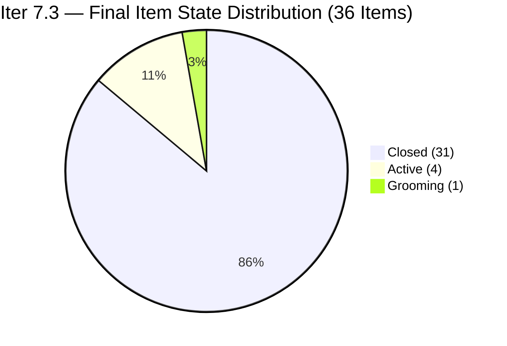
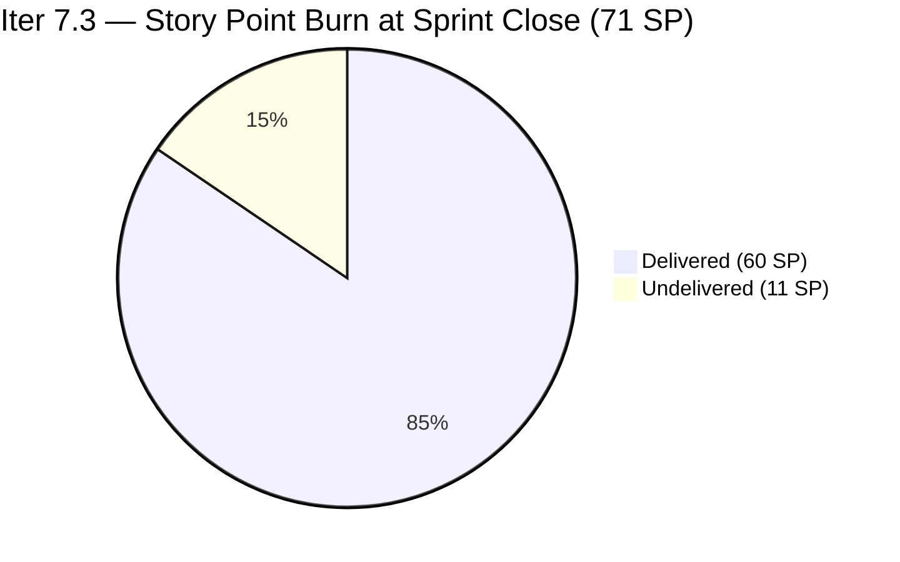
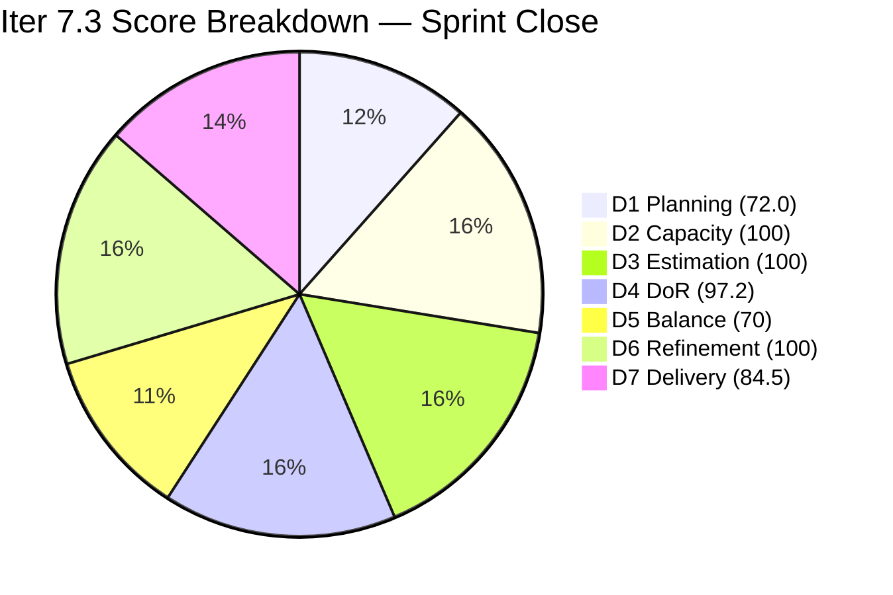
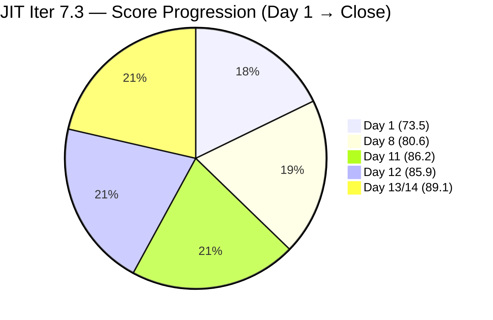

# ADO SAFe Iteration Audit — JIT Operation Team

**Audit #63 | Iteration 7.3 (May 4 – May 17, 2026) | Day 14 of 14 — Sprint Close**

---

## 1. Audit Metadata

| Field | Value |
|---|---|
| **Audit Date** | May 17, 2026, 02:07 CDT / 09:07 UTC / 17:07 PHT (UTC+8) |
| **Auditor** | Claude Code (ADO SAFe Audit Agent) |
| **Workspace** | `ado_jit` |
| **ADO Project** | Jairosoft Portfolio (`666bb99a-6acd-4999-bb34-efd0e4ea90dc`) |
| **Team** | JIT Operation Team (`b25e3129-6272-4e54-a3ff-f1ef3c8eeb2c`) |
| **Iteration** | Iteration 7.3 — May 4 to May 17, 2026 |
| **Iteration ID** | `bbaecdec-eeb0-4c8d-999f-6a438eaab331` |
| **Sprint Day** | Day 14 of 14 (100% elapsed — Sprint Close Day) |
| **Days Remaining** | 0 |
| **Prior Audit** | AUDIT_20260516_0204.md (Audit #62, Iter 7.3 Day 13, Overall 89.1 — Low Risk) |
| **Scoring Model** | ADO SAFe v1 (7-dimension rubric) |
| **Overall Score** | **89.1 / 100** |
| **Risk Band** | **Low Risk** (≥80) |

---

## 2. Executive Summary

JIT Operation Team closes Iteration 7.3 at **89.1 / 100 (Low Risk)** — holding the Day 13 series high with no change on the final sprint day. This is the **official sprint-close audit for Iter 7.3**.

No new closures have occurred since the Day 13 burst event (May 15–16 UTC). The 5 items that were open at Day 13 remain in the same state:

- **Grace's 3 items (7 SP)** — #203224 (Active, last changed May 6), #203595 (Active, last changed May 6), #203985 (Active, last changed May 12) — **no progress, sprint closes undelivered**
- **#203250 Claude 4 Course Spike (2 SP, Armelita)** — Active, last changed May 12 — **unverified, open at close**
- **#204203 1st Assessment Batch 3 COC 1 (2 SP)** — Grooming, Unassigned — **DoR fail persists, not delivered**

**Sprint Close Final Tally:**
- **31 of 36 items Closed** (86.1% item closure rate)
- **60 SP closed** of 71 SP committed = **84.5% delivery predictability**
- **11 SP undelivered** at sprint close (Grace: 7 SP, Armelita Spike: 2 SP, Grooming: 2 SP)
- D4 = 97.2% — #204203 DoR failure persists through sprint end
- Overall: 89.1 — Low Risk band, Iter 7.3 series high (new team record)

Despite the 11 SP miss at close, this sprint represents a significant team milestone: the JIT team has held the Low Risk band for the last 7 consecutive audit days and closes at their highest-ever sprint score. Armelita's burst delivery (6 items, 9 SP in 35 minutes on Day 13), Teofilo's completion of all 7 CSS NC II training modules, and Samantha's consistent social media and intern onboarding cadence drove the strong result.

---

## 3. Previous Audit Delta

| Dimension | Audit #62 (May 16, Day 13, 89.1) | Audit #63 (May 17, Day 14, 89.1) | Delta | Driver |
|---|---|---|---|---|
| Iteration Planning | 72.0 | **72.0** | 0.0 | 36/50 unchanged |
| Team Capacity | 100.0 | **100.0** | 0.0 | 4/4 contributors with capacity |
| Estimation | 100.0 | **100.0** | 0.0 | 36/36 items with SP > 0 |
| DoR Compliance | 97.2 | **97.2** | 0.0 | #204203 still fails DoR; 35/36 |
| Work Item Balance | 70.0 | **70.0** | 0.0 | US dominant 69.4%; structural |
| Backlog Refinement | 100.0 | **100.0** | 0.0 | All 50 fresh; 0 stale; 0 untouched |
| Delivery Predictability | 84.5 | **84.5** | 0.0 | No new closures; 60/71 SP unchanged |
| **Overall** | **89.1** | **89.1** | **0.0** | Sprint closes at series high; no regression, no improvement |

No state changes detected between Day 13 and Day 14. Grace's three items remained Active with no ADO activity. #204203 remained in Grooming without DoR remediation. The sprint closes with the same 11 SP open.

---

## 4. Current Iteration Snapshot

| Attribute | Value |
|---|---|
| **Iteration** | Iteration 7.3 |
| **Sprint Dates** | May 4 – May 17, 2026 (14 days) |
| **Sprint Day** | Day 14 of 14 — Sprint Close |
| **Days Remaining** | 0 |
| **Total Iter 7.3 Items** | 36 (31 Closed, 5 open at close) |
| **Visible Root Backlog Items** | 50 (31 Closed Iter 7.3 + 5 open Iter 7.3 + 14 future iterations) |
| **Committed SP** | 71 SP |
| **Closed SP** | 60 SP (84.5%) |
| **Open SP at Close** | 11 SP (undelivered) |
| **Changes Since Day 13** | None — no new closures, no state changes |
| **Capacity** | Teofilo: 4.8 pts/day; Armelita: 6 pts/day; Samantha: 1 pt/day; Grace: 1 pt/day |
| **Sprint Outcome** | CLOSED — 31/36 items delivered, 60/71 SP, 84.5% predictability |

---

## 5. Work Item Analysis

### Open at Sprint Close — 5 items, 11 SP

| ID | Title | Type | State | SP | Assignee | Last Changed | DoR | Action Needed |
|---|---|---|---|---|---|---|---|---|
| 203224 | Convert SAFe MCCs to New Forms | User Story | Active | 3 | Grace | May 6 | Pass | Carry to Iter 7.4; TESDA dependency |
| 203595 | JIT Finance Collection Policy | User Story | Active | 2 | Grace | May 6 | Pass | Carry to Iter 7.4; 12 days stalled |
| 203985 | Follow Through SEC AC Requirement | User Story | Active | 2 | Grace | May 12 | Pass | Carry to Iter 7.4; SEC feedback awaited |
| 203250 | Team Members to Complete Claude 4 Course | Spike | Active | 2 | Armelita | May 12 | Pass | Verify completion count (≥10/14); close or carry |
| 204203 | 1st Assessment for Batch 3 COC 1 | User Story | Grooming | 2 | Unassigned | May 15 | **FAIL** | Carry to Iter 7.4; fix DoR before re-commit |

### Delivered in Iter 7.3 — 31 items, 60 SP

| Domain | Assignee | Items | SP |
|---|---|---|---|
| CSS NC II Training (3.2-1 through 3.3-2) | Teofilo | 7 | 21 SP |
| Python/Marketing Activities | Armelita | 5 | 10 SP |
| Intern Onboarding (ADDU/MMCM) | Samantha | 5 | 5 SP |
| CSS Batch 3/4 Marketing/Ops | Armelita | 6 | 12 SP |
| EBET/Compliance/Dean Confirmations | Armelita | 5 | 7 SP |
| Social Media / Scholarship Materials | Samantha | 2 | 4 SP |
| Tech Talk Spike | Armelita | 1 | 1 SP |
| **Total** | | **31** | **60 SP** |

### Type Distribution (36 current sprint items)

| Type | Count | Share | Penalty |
|---|---|---|---|
| User Story | 25 | 69.4% | Dominant > 60% → −30 |
| Training | 7 | 19.4% | None |
| Spike | 4 | 11.1% | < 40% → None |

### DoR Assessment — Final

| Gate | Pass | Fail | Rate |
|---|---|---|---|
| Description ≥ 30 non-whitespace chars | 35 | 1 | 97.2% |
| Acceptance Criteria ≥ 20 non-whitespace chars | 35 | 1 | 97.2% |
| **Combined DoR** | **35** | **1** (#204203) | **97.2%** |

#204203 closes the sprint in Grooming with a single-item list as description ("Assessment for the Batch 2 COC 1" — also misidentifies as Batch 2 instead of Batch 3) and no Acceptance Criteria. This item must be fully DoR-remediated before it can be committed to Iter 7.4.

### Staleness Assessment (50 visible items)

| Window | Count | Share | Penalty |
|---|---|---|---|
| Fresh (within 45 days / after Apr 2, 2026) | 50 | 100% | None |
| Stale > 90 days (before Feb 15) | 0 | 0% | None |
| Stale > 180 days (before Nov 17, 2025) | 0 | 0% | None |
| Untouched in current iteration (before May 4) | 0 | 0% | None |

Note: Grace's items (#203224 last May 6, #203595 last May 6) were changed after the sprint start date (May 4) when they were assigned, so they are not "untouched" by the rubric definition. However, no work progress was recorded after Day 2 of the sprint.

---

## 6. SAFe Compliance Scorecard

| Dimension | Score | Evidence | Notes |
|---|---|---|---|
| 1. Iteration Planning | 72.0 | 36 current / 50 visible = 72.0% | 14 future-iteration items in visible pool (7.4, 7.5, PI8) |
| 2. Team Capacity | 100.0 | 4/4 contributors with capacity | Teofilo 4.8; Armelita 6; Samantha 1; Grace 1 pts/day |
| 3. Estimation | 100.0 | 36/36 items with SP > 0 | All items including #204203 (2 SP) have SP set |
| 4. DoR Compliance | 97.2 | 35/36 pass both gates | #204203 exits sprint with no description substance and no AC |
| 5. Work Item Balance | 70.0 | US present; dominant 69.4% > 60% → −30; Spike 11.1% < 40% | Training items (19.4%) add diversity but not enough to offset penalty |
| 6. Backlog Refinement | 100.0 | 50/50 fresh (Apr 6–May 16); stale_90=0; stale_180=0; untouched=0 | Oldest item #200767 changed Apr 6 — within 45-day window |
| 7. Delivery Predictability | 84.5 | 60 SP closed / 71 SP committed = 84.51% | Sprint closes with 11 SP undelivered; Grace (7 SP) primary miss |
| **Overall** | **89.1** | (72.0+100+100+97.2+70+100+84.5) / 7 = 623.7 / 7 | **Low Risk** (≥80) — Iter 7.3 series high |

### Score Computation
```
D1 = 36 / 50 × 100 = 72.0
D2 = 4  / 4  × 100 = 100.0
D3 = 36 / 36 × 100 = 100.0
D4 = 35 / 36 × 100 = 97.22 → 97.2
D5 = 100 − 30      = 70.0  (US 69.4% dominant; spike 11.1%)
D6 = 100.0 − 0     = 100.0
D7 = 60 / 71 × 100 = 84.507 → 84.5

Overall = (72.0 + 100.0 + 100.0 + 97.2 + 70.0 + 100.0 + 84.5) / 7
        = 623.7 / 7 = 89.10 → 89.1
```

---

## 7. Dimension Findings

### D1 — Iteration Planning: 72.0
```
visible_root_backlog_items   = 50
current_iteration_root_items = 36 (all IterPath = Iter 7.3)
D1 = (36 / 50) × 100 = 72.0
```
The 14 non-current items represent the Iter 7.4/7.5/PI8 forward pipeline: Training modules for the next CSS NC II series (#203805–#203809), capacity planning spikes (#200766, #203243–#203245), and future user stories. This forward planning is SAFe-aligned and does not indicate a process deficiency. The 72.0 score is expected and stable.

### D2 — Team Capacity: 100.0 ✅
All four contributors maintain positive capacity in Iter 7.3:
- **Teofilo Limpag**: 4.8 pts/day (Training)
- **Armelita**: 6.0 pts/day (Documentation)
- **Samantha Babael**: 1.0 pts/day (Documentation)
- **Grace**: 1.0 pts/day (Documentation)

All 4 have sprint assignments. D2 = 4/4 = 100.0. Note: Grace's 1.0 pts/day capacity implies 14 pts of available work over the sprint; she completed 0 of her 7 SP, a significant utilization gap that does not affect D2 but is a delivery risk indicator.

### D3 — Estimation: 100.0 ✅
```
point_eligible_current_items = 36
estimated_current_items      = 36 (all have SP > 0)
D3 = (36 / 36) × 100 = 100.0
```
SP sizing is appropriate across item types. Training modules uniformly 3 SP each; Marketing/Ops items 1–3 SP; Spikes at 1–2 SP.

### D4 — DoR Compliance: 97.2 (Persistent Failure)
```
current_iteration_root_items = 36
dor_compliant_current_items  = 35
D4 = (35 / 36) × 100 = 97.22 → 97.2
```
**#204203 "1st Assessment for Batch 3 COC 1"** (Grooming, Unassigned): Entered the sprint on Day 12 and exits on Day 14 in the same state — Grooming with a single-bullet description that misidentifies the batch ("Batch 2" instead of "Batch 3") and no Acceptance Criteria field populated. This item must not be re-committed to Iter 7.4 without full DoR remediation and an assigned owner.

### D5 — Work Item Balance: 70.0
```
User Story present: Yes → no penalty
User Story share: 25/36 = 69.4% > 60% → −30
Spike share: 4/36 = 11.1% < 40% → no penalty
Training: 7/36 = 19.4% (diversity adds value)
D5 = 100 − 30 = 70.0
```
The 7 Training work items provide genuine type diversity not seen in other teams. The residual US dominance is structural to JIT's operational training and compliance work.

### D6 — Backlog Refinement: 100.0 ✅
```
visible_root_backlog_items = 50
fresh_visible_root_items   = 50
  (oldest: #200767 changed Apr 6, 2026 — 41 days before May 17, within 45-day window)
stale_90 (before Feb 15, 2026): 0 → no penalty
stale_180 (before Nov 17, 2025): 0 → no penalty
untouched_current_items (before May 4): 0 → no penalty

D6 = 100.0
```
The forward pipeline items (Iter 7.4/7.5) were all created or updated in April–May 2026, keeping them within the fresh window.

### D7 — Delivery Predictability: 84.5
```
committed_story_points = 71
closed_story_points    = 60
D7 = (60 / 71) × 100 = 84.507 → 84.5
```
Sprint closes at 84.5% delivery predictability — 11 SP undelivered. Root cause analysis:
- **Grace (7 SP, 63.6% of miss)**: Three items assigned at sprint start with no activity beyond Day 2. Items #203224 (TESDA form conversion) and #203595 (Finance Policy) were last touched May 6 — 11 days of no visible ADO updates. #203985 (SEC AC) last touched May 12. Grace's 1.0 pts/day capacity suggests external dependency or workload constraints not reflected in ADO.
- **#203250 (2 SP, Armelita)**: Claude 4 course completion spike requires ≥10 of 14 named individuals to complete 4 courses. Course completion is not trackable via ADO; remains Active at close.
- **#204203 (2 SP, Unassigned)**: DoR-failing item that should not have been in the sprint scope. Carried to Iter 7.4 backlog.

Had Grace delivered her 7 SP, D7 = 67/71 = 94.4% and Overall = ~91.5.

---

## 8. Risks and Bottlenecks







| Risk | Severity | Status | Action |
|---|---|---|---|
| **Grace's 3 items (7 SP) — zero progress after Day 2** | **High** | Carried to Iter 7.4; 11 days without activity in sprint | Root cause must be identified before Iter 7.4 commitment — blocker or capacity issue? |
| **#204203 DoR fail at sprint close** | **High** | Grooming, unassigned, no description/AC | Must be fixed before Iter 7.4 commitment; also needs owner assignment |
| **#203250 Claude 4 Course verification gap** | Moderate | Active, unverified; external tracking required | Armelita to verify ≥10 completions before carrying to 7.4 |
| **D7 = 84.5% — 11 SP undelivered** | Moderate | Grace dependency most significant; pattern of late-sprint stall | Establish mid-sprint check-in protocol for Grace items in Iter 7.4 |
| **D1 = 72.0 — 14 future items in visible pool** | Low | Stable; SAFe-aligned forward pipeline | No action needed; accept as structural |
| **No Iteration Goal defined** | Low | Persistent across JIT audit series | Define at Iter 7.4 planning |

---

## 9. Prioritized Recommendations

1. **[Immediate — Iter 7.4 Pre-Planning] Resolve Grace's three items** — Before committing #203224, #203595, and #203985 to Iter 7.4, conduct a direct conversation with Grace to identify: (a) are there external blockers (TESDA approval, SEC feedback) that prevent closure regardless of effort? (b) is there a workload conflict? Document the root cause in workspace CLAUDE.md. If TESDA/SEC feedback is a true external dependency, reclassify as blocked and set a dependency flag in ADO.

2. **[Before Iter 7.4 Commitment] Remediate #204203 DoR** — The item title says "Batch 3" but the description says "Batch 2" — this is a data error in addition to the DoR failure. Assign an owner, correct the title/description alignment, write substantive AC (≥20 chars) covering assessment format, scoring criteria, and pass/fail threshold.

3. **[Before Iter 7.4 Commitment] Verify Claude 4 Course completion for #203250** — Armelita to check the CPN program platform for completion status of the 14 named individuals. If ≥10 have completed all 4 courses, close the item. If < 10, identify who is lagging and set a targeted completion date in Iter 7.4.

4. **[Iter 7.4 Day 1] Define an Iteration Goal** — Suggested: "Deliver CSS NC II Training Module 4.x series (Teofilo), complete TESDA AC form conversion and SEC requirement follow-through (Grace), finalize JIT finance collection policy, and complete intern assessment pipeline for Batch 3."

5. **[Iter 7.4 Planning] Establish mid-sprint check-in protocol for Grace** — Grace's items have shown a pattern of assigning at sprint start and going quiet: May 6 last activity (Items 1–2), May 12 last activity (Item 3). Implement a Day 5 ADO status update requirement for all Grace items. If no update by Day 5, Armelita escalates to Ramon.

6. **[Iter 7.4 Sprint Planning] Calibrate Grace's capacity to actual throughput** — Grace's configured capacity = 1 pt/day × ~10 working days = ~10 pts per sprint. Actual delivery in Iter 7.3: 0 SP. In prior sprints, Grace's delivery record is unclear. Reduce planned commitment for Grace in Iter 7.4 to 3–5 SP maximum until throughput is re-established.

7. **[Retrospective] Capture sprint achievements** — Iter 7.3 produced three notable team records: (a) Teofilo completed the full CSS NC II 7-module training series — a multi-sprint arc closed; (b) Armelita's burst closure of 6 items in 35 minutes (Day 13) demonstrates high execution capacity when scope is well-defined; (c) team crossed 80.0 overall and sustained Low Risk band for 7 consecutive audit days.

---

## 10. Evidence Gaps and Limitations

| Gap | Impact | Mitigation |
|---|---|---|
| Grace's items — ADO shows no updates since May 6 / May 12; no verbal confirmation of status | Moderate | Must be resolved before Iter 7.4 commitment; ADO evidence alone insufficient |
| #203250 course completion count — not queryable via ADO | Moderate | CPN program platform verification required by Armelita |
| Closed items (31) not returned by backlog API | Low | Confirmed via `wit_get_work_items_for_iteration` + batch detail queries |
| PI Objectives linkage | Low | Not queried; known structural gap across JIT audit series |
| Iteration Goal field | Low | Not surfaced via standard ADO API |
| #204203 raw description character count | Low | HTML list markup wraps ~34 raw chars ("Assessment for the Batch 2 COC 1"); fails DoR because description is semantically empty and AC is absent entirely |

---

## 11. Iter 7.3 Series Summary (Sprint Close)



| Day | Score | Band | Key Event |
|---|---|---|---|
| Day 1 | 73.5 | Moderate | Sprint launched; 36 items, 71 SP |
| Day 8 | 80.6 | Low Risk | Crossed 80 threshold; D7 first breach |
| Day 11 | 86.2 | Low Risk | 5 closures (10 SP); strong midpoint |
| Day 12 | 85.9 | Low Risk | 1 closure; #204203 DoR fail added; slight retreat |
| Day 13 | 89.1 | Low Risk | 8 closures (16 SP) burst; Teofilo Training chain complete |
| **Day 14** | **89.1** | **Low Risk** | **Sprint Close — no change; 31/36 items, 60/71 SP** |

> Iteration 7.3 closes as the JIT team's highest-scoring sprint on record at 89.1 overall. The team demonstrated strong velocity from Teofilo and Armelita, maintained near-perfect DoR and estimation, and held Low Risk for the final 7 days. The primary improvement focus entering Iter 7.4 is Grace's delivery pattern (3 items, 0 SP output in Iter 7.3) and preventing late DoR-failing items from entering sprint scope.

---

*Report generated: May 17, 2026, 02:07 CDT / 09:07 UTC | Workspace: ado_jit | Auditor: Claude Code ADO SAFe Audit Agent*
