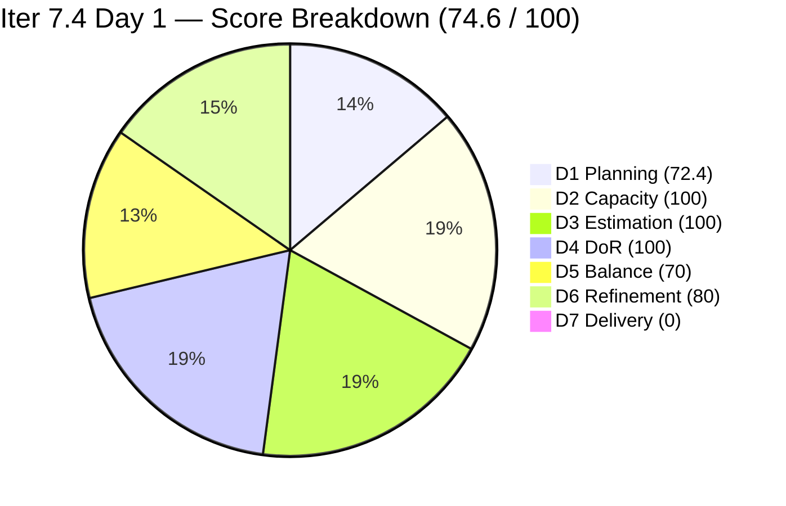
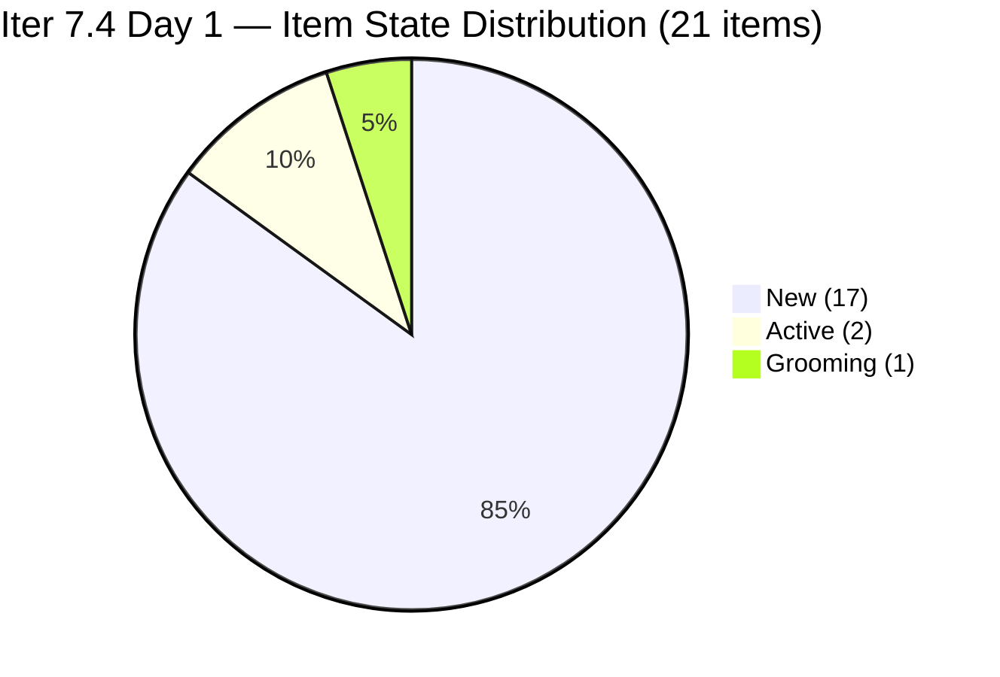
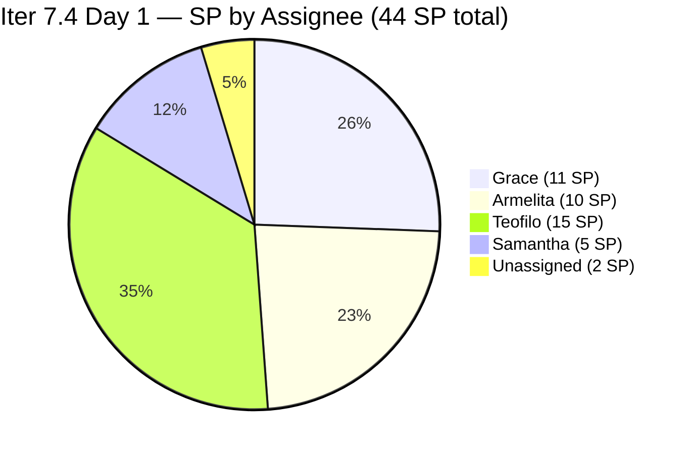

# ADO SAFe Iteration Audit — JIT Operation Team

**Audit #64 | Iteration 7.4 (May 18 – May 31, 2026) | Day 1 of 14 — Sprint Launch**

---

## 1. Audit Metadata

| Field | Value |
|---|---|
| **Audit Date** | May 18, 2026, 09:00 CDT / 16:00 UTC / 00:00 PHT+1 (UTC+8) |
| **Auditor** | Claude Code (ADO SAFe Audit Agent) |
| **Workspace** | `ado_jit` |
| **ADO Project** | Jairosoft Portfolio (`666bb99a-6acd-4999-bb34-efd0e4ea90dc`) |
| **Team** | JIT Operation Team (`b25e3129-6272-4e54-a3ff-f1ef3c8eeb2c`) |
| **Iteration** | Iteration 7.4 — May 18 to May 31, 2026 |
| **Iteration ID** | `16385d00-244a-4caa-9e56-d4a8e850754d` |
| **Sprint Day** | Day 1 of 14 — Sprint Launch |
| **Days Remaining** | 13 |
| **Prior Audit** | AUDIT_20260517_0207.md (Audit #63, Iter 7.3 Sprint Close, Overall 89.1 — Low Risk) |
| **Scoring Model** | ADO SAFe v1 (7-dimension rubric) |
| **Overall Score** | **74.6 / 100** |
| **Risk Band** | **Moderate Risk** (60–79.9) |

---

## 2. Executive Summary

JIT Operation Team opens Iteration 7.4 at **74.6 / 100 (Moderate Risk)** on Day 1. The score reflects the expected sprint-launch state: D7 = 0 (early-sprint, no deliveries yet) and D6 = 80 (10 of 21 committed items were last touched before the sprint started). The team brings a strong Iter 7.3 performance record into this sprint (89.1 at close), and key signals are positive: all 21 items are estimated, all 4 contributors have capacity, and DoR compliance is 100%.

The sprint is notably heavier than Iter 7.3 at launch: **21 committed items at 44 SP** (vs. 36 items at 71 SP in Iter 7.3 — Iter 7.3's higher item count included 31 closed items from prior sprints carried in scope). The 21 items represent a clean-slate Iter 7.4 commitment.

Key concern: Grace carries 6 of the 21 items (11 SP) after delivering 0 SP in Iter 7.3. Additionally, two items (#203986, #203989) have no assignee — these must be assigned before Day 3.

**Sprint Opening Summary:**
- **21 items committed** at 44 SP — Day 1 sprint load
- **0 items Closed** — Day 1, early-sprint context
- **D7 = 0** annotated as early-sprint (no delivery expected on Day 1)
- **D1 = 72.4** — 21/29 visible backlog items in current iteration
- **Overall 74.6** — Moderate Risk, approaching the 80-point threshold

---

## 3. Previous Audit Delta

| Dimension | Audit #63 (May 17, Iter 7.3 Close, 89.1) | Audit #64 (May 18, Iter 7.4 Day 1, 74.6) | Delta | Driver |
|---|---|---|---|---|
| Iteration Planning | 72.0 | **72.4** | +0.4 | 21/29 vs. 36/50; slight improvement in ratio |
| Team Capacity | 100.0 | **100.0** | 0.0 | All 4 contributors with capacity unchanged |
| Estimation | 100.0 | **100.0** | 0.0 | 21/21 items with SP > 0 |
| DoR Compliance | 97.2 | **100.0** | +2.8 | #204203 DoR fail item not committed to Iter 7.4; all 21 pass |
| Work Item Balance | 70.0 | **70.0** | 0.0 | US 71.4% still dominant > 60% → −30; Training/Spike present |
| Backlog Refinement | 100.0 | **80.0** | -20.0 | 10/21 current items untouched (changed before May 18) → −20 |
| Delivery Predictability | 84.5 | **0.0** | -84.5 | Day 1 early-sprint — 0/44 SP delivered |
| **Overall** | **89.1** | **74.6** | **-14.5** | Sprint-boundary drop driven by D7=0 and D6 untouched penalty |

The DoR improvement (+2.8) is notable: #204203, the persistent DoR-failing item from Iter 7.3, was not re-committed to Iter 7.4. This represents correct process execution from the Iter 7.3 sprint close recommendations.

---

## 4. Current Iteration Snapshot

| Attribute | Value |
|---|---|
| **Iteration** | Iteration 7.4 |
| **Sprint Dates** | May 18 – May 31, 2026 (14 days) |
| **Sprint Day** | Day 1 of 14 |
| **Days Remaining** | 13 |
| **Visible Root Backlog Items** | 29 |
| **Current Sprint Items (IterPath = Iter 7.4)** | 21 |
| **Committed SP** | 44 SP |
| **Closed SP** | 0 SP |
| **Open SP Remaining** | 44 SP |
| **Unassigned Items** | 2 (#203986, #203989 — no AssignedTo set) |
| **Capacity** | Teofilo: 4.8 pts/day; Armelita: 6 pts/day; Samantha: 6 pts/day; Grace: 1 pt/day |
| **Total Capacity** | 17.8 pts/day × ~14 days = ~249 SP available vs. 44 SP committed — well under-loaded |

---

## 5. Work Item Analysis

### Current Sprint Items — 21 items, 44 SP total

| ID | Title | Type | SP | State | Assignee | ChangedDate | DoR |
|---|---|---|---|---|---|---|---|
| 204447 | Monitor and Log Daily Payment Collections | US | 2 | New | Grace | May 18 | Pass |
| 204435 | Archive Proof of Filing for TESDA Application | US | 2 | New | Grace | May 18 | Pass |
| 204431 | Portal Submission & Fee Payment | US | 2 | New | Grace | May 18 | Pass |
| 204428 | Digitization & QA of Notarized SEC Documents | US | 2 | New | Grace | May 18 | Pass |
| 200767 | UM Matina CPE Intern Final Demo and Awarding | US | 2 | New | Armelita | Apr 6 | Pass |
| 200768 | HCDC Interns Final Demo and Awarding | US | 2 | New | Armelita | Apr 6 | Pass |
| 203805 | 4.1-1 Server Security and Reporting | Training | 3 | New | Teofilo | May 6 | Pass |
| 203806 | 4.1-2 Tools, Equipment and Testing Devices | Training | 3 | New | Teofilo | May 6 | Pass |
| 203595 | JIT Finance Collection Policy | US | 2 | Active | Grace | May 18 | Pass |
| 203243 | IT7.4 Tech Talk - AI Tools Demonstration | Spike | 2 | New | Armelita | May 6 | Pass |
| 203807 | 4.1-3 Personal Computer System & Specification | Training | 3 | New | Teofilo | May 6 | Pass |
| 203808 | 4.1-4 Occupational Health and Safety | Training | 3 | New | Teofilo | May 6 | Pass |
| 203809 | 4.1-5 Network Maintenance Task | Training | 3 | New | Teofilo | May 6 | Pass |
| 203986 | Set-up Eingress for the Scholars' Biometrics | US | 1 | New | **Unassigned** | May 8 | Pass |
| 203989 | Board for the Inventory System for TESDA | US | 1 | New | **Unassigned** | May 8 | Pass |
| 204273 | Prepare Bubble102/103 Scholarship Materials | US | 2 | Active | Samantha | May 18 | Pass |
| 204338 | Bubble Tesda Training | US | 3 | Grooming | Samantha | May 18 | Pass |
| 204440 | Package SAFe Micro-credential Dossier | US | 2 | New | Grace | May 18 | Pass |
| 204501 | EBET T2 Bubble Trainer | US | 1 | New | Armelita | May 18 | Pass |
| 204508 | Enrollment Report with Additional Student | US | 1 | New | Armelita | May 18 | Pass |
| 204521 | Induction Training Program | US | 2 | New | Armelita | May 18 | Pass |
| **Totals** | | **15 US + 5 Training + 1 Spike** | **44 SP** | **0 Closed** | | | 21/21 Pass |

### Type Distribution (21 current sprint items)

| Type | Count | Share | Penalty |
|---|---|---|---|
| User Story | 15 | 71.4% | Dominant > 60% → −30 |
| Training | 5 | 23.8% | None |
| Spike | 1 | 4.8% | < 40% → no penalty |

### DoR Assessment — All 21 Items

| Gate | Pass | Fail | Rate |
|---|---|---|---|
| Description ≥ 30 non-whitespace chars | 21 | 0 | 100% |
| Acceptance Criteria ≥ 20 non-whitespace chars | 21 | 0 | 100% |
| **Combined DoR** | **21** | **0** | **100%** |

Significant improvement from Iter 7.3 (97.2%). Item #204203 — which failed DoR at sprint close in Iter 7.3 — was correctly excluded from Iter 7.4 commitment.

### Staleness Assessment (29 visible items)

| Window | Count | Share | Penalty |
|---|---|---|---|
| Fresh (within 45 days / after Apr 3, 2026) | 29 | 100% | None |
| Stale > 90 days (before Feb 17, 2026) | 0 | 0% | None |
| Stale > 180 days (before Nov 18, 2025) | 0 | 0% | None |
| Untouched in current iteration (ChangedDate < May 18) | 10 | 47.6% of current | −20 |

Untouched items (changed before May 18): #200767, #200768 (Apr 6), #203805–#203809 (May 6), #203243 (May 6), #203986, #203989 (May 8). All 10 were prepared in prior sprint and are planned for execution in Iter 7.4 but haven't been touched on launch day.

---

## 6. SAFe Compliance Scorecard

| Dimension | Score | Evidence | Notes |
|---|---|---|---|
| 1. Iteration Planning | 72.4 | 21 current / 29 visible = 72.4% | 8 backlog items in future iterations / unassigned to sprints |
| 2. Team Capacity | 100.0 | 4/4 contributors with current work have capacity | Teofilo 4.8; Armelita 6; Samantha 6; Grace 1 pts/day |
| 3. Estimation | 100.0 | 21/21 items with SP > 0 (44 SP total) | All types estimated including Training and Spike |
| 4. DoR Compliance | 100.0 | 21/21 pass both Description + AC gates | First 100% DoR score at sprint launch since Iter 7.3 improvement streak |
| 5. Work Item Balance | 70.0 | US present; US 71.4% > 60% → −30; Spike 4.8% | Training (23.8%) provides meaningful type diversity |
| 6. Backlog Refinement | 80.0 | base=100; stale_90=0; stale_180=0; untouched 10/21=47.6% > 30% → −20 | Day-1 artifact; will clear as items are activated |
| 7. Delivery Predictability | 0.0 | 0 SP closed / 44 SP committed = 0% | **Early-sprint** — Day 1 of 14; no delivery expected |
| **Overall** | **74.6** | (72.4+100+100+100+70+80+0) / 7 = 522.4 / 7 | **Moderate Risk** — sprint-launch state |

### Score Computation
```
D1 = 21 / 29 × 100 = 72.41 → 72.4
D2 = 4  / 4  × 100 = 100.0
D3 = 21 / 21 × 100 = 100.0
D4 = 21 / 21 × 100 = 100.0
D5 = 100 − 30      = 70.0  (US 71.4% dominant; Spike 4.8%; Training 23.8%)
D6 = base(100) − 20 = 80.0  (29/29 fresh; stale_90=0; stale_180=0; 10/21 untouched > 30%)
D7 = 0 / 44 × 100  = 0.0   (early-sprint Day 1)

Overall = (72.4 + 100.0 + 100.0 + 100.0 + 70.0 + 80.0 + 0.0) / 7
        = 522.4 / 7 = 74.63 → 74.6
```

---

## 7. Dimension Findings

### D1 — Iteration Planning: 72.4
```
visible_root_backlog_items   = 29
current_iteration_root_items = 21 (all IterPath = Iter 7.4)
D1 = (21 / 29) × 100 = 72.41 → 72.4
```
The 8 non-current backlog items include: #204487 (not in iteration), #200766, #204203 (DoR-fail item excluded from commitment — correctly), #200771, #203244, #203245, #203250 (Claude 4 course Spike from Iter 7.3), #204477. The forward pipeline items are SAFe-aligned. This D1 level is consistent with Iter 7.3's 72.0 baseline and acceptable for a team with an active multi-sprint pipeline.

### D2 — Team Capacity: 100.0 ✅
- **Teofilo Limpag**: 4.8 pts/day (Training). Zero days off.
- **Armelita**: 6.0 pts/day (Documentation). Zero days off.
- **Samantha Babael**: 6.0 pts/day (Documentation). Zero days off.
- **Grace**: 1.0 pt/day (Documentation). Zero days off.
- All 4 contributors with sprint work have positive capacity. D2 = 4/4 = 100.0.

### D3 — Estimation: 100.0 ✅
```
point_eligible_current_items = 21 (all types expose SP)
estimated_current_items      = 21 (all have SP > 0)
committed_story_points       = 44 SP
D3 = 100.0
```
SP distribution: Training items = 3 SP each (5 items = 15 SP); Grace's US cluster = 2 SP each (6 items = 11 SP including 203595); Armelita's US cluster = 2+2+2+1+1+2 = 10 SP; Samantha = 2+3 = 5 SP; Spike = 2 SP; Unassigned = 1+1 = 2 SP. Total = 44 SP.

### D4 — DoR Compliance: 100.0 ✅ (Improvement from 97.2)
All 21 items carry substantive descriptions and acceptance criteria. Notable verification:
- **#203986** (Eingress Biometrics, Unassigned): 3-line As-a/I need/So-that description; 3-item AC checklist. Pass.
- **#203989** (TESDA Inventory, Unassigned): Same 3-line pattern; 3-item AC. Pass.
- **#204501 / #204508**: Short but substantive; each has 3-item AC. Pass.
- **#204521** (Induction Training): Brief description with role-goal-reason; 3-item AC. Pass.
- #204203 (DoR-failing item from Iter 7.3) correctly excluded — this is the first sprint launch since Mar 17 with 100% DoR.

### D5 — Work Item Balance: 70.0 (Structural)
```
User Story present: Yes → no penalty
User Story share: 15/21 = 71.4% > 60% → −30
Spike share: 1/21 = 4.8% ≤ 40% → no penalty
Training: 5/21 = 23.8% (adds type diversity)
D5 = 100 − 30 = 70.0
```
The Training work item type continues to be JIT's most distinctive characteristic in the portfolio. Five Training modules for the CSS NC II 4.1-x series (Server Security, Tools/Equipment, PC Systems, OHS, Network Maintenance) carry Teofilo's full sprint load. The −30 penalty is structural given US dominance, but the Training presence meaningfully improves balance compared to pure-US teams.

### D6 — Backlog Refinement: 80.0 (Day-1 Artifact)
```
visible_root_backlog_items = 29
fresh_visible_root_items   = 29 (oldest: #200767 changed Apr 6, 2026 — 42 days before May 18, within 45-day window)
stale_90 (before Feb 17, 2026): 0 → no penalty
stale_180 (before Nov 18, 2025): 0 → no penalty
untouched_current_items (ChangedDate < May 18):
  #200767 (Apr 6), #200768 (Apr 6): 2 items
  #203805, #203806, #203807, #203808, #203809 (May 6): 5 items
  #203243 (May 6): 1 item
  #203986 (May 8): 1 item
  #203989 (May 8): 1 item
  Total = 10 items / 21 current = 47.6% > 30% → −20

D6 = max(0, 100 − 20) = 80.0
```
The 10 untouched items were all pre-planned during Iter 7.3 or at sprint planning; they simply haven't been updated on Day 1 of the new sprint. D6 will recover as soon as team members activate or update their items. Items #203986 and #203989 urgently need assignment — the assignment action alone will update ChangedDate and clear their untouched status.

### D7 — Delivery Predictability: 0.0 (Early-Sprint — Day 1)
```
committed_story_points = 44 SP
closed_story_points    = 0 SP (all 21 items in New/Active/Grooming)
D7 = 0 / 44 × 100 = 0.0
```
**Early-sprint annotation:** Day 1 of 14-day sprint. Based on Iter 7.3 patterns (first closure on Day 2), expect D7 to begin recovering by May 19–20. Notably, 203273 (Samantha's Bubble materials) and 203595 (Grace's Finance Policy) are already in Active state — earliest closures may arrive from Samantha given her 6 SP/day capacity.

---

## 8. Risks and Bottlenecks







| Risk | Severity | Status | Action |
|---|---|---|---|
| **D7 = 0 (early-sprint)** | Expected | Day 1 artifact | Monitor first closures from May 19; Samantha/Armelita likely first |
| **Grace carries 6 items (11 SP) — 0 SP delivered in Iter 7.3** | **Critical** | Pattern of stalled delivery | Immediate check-in required before Day 3; root cause (blocker vs. capacity) must be resolved |
| **#203986 + #203989 Unassigned** | High | No AssignedTo set | Assign by Day 2; task risks floating if unowned |
| **#203595 JIT Finance Policy — Active since May 18 (carried from Iter 7.3)** | High | Second sprint carry; TargetDate May 14 (overdue) | Grace to update status by Day 3; if still blocked, escalate to Armelita or Ramon |
| **#204203 DoR fail — still in backlog, not committed** | Moderate | Correctly excluded from Iter 7.4 | Needs Description + AC remediation before next commitment cycle |
| **#203250 (Claude 4 Course Spike)** | Moderate | In backlog, not committed to Iter 7.4 | Verify completion status before next sprint; if ≥10 completions, close; else re-commit with completion plan |
| **#200767 + #200768 Intern Final Demo (Apr 6, Armelita)** | Moderate | 42-day old items; no progress visible | Confirm intern program schedule; if demos delayed, track as external dependency |
| **D6 = 80.0 — 10 untouched items** | Low | Day-1 artifact; clears as work progresses | No immediate action; monitor by Day 3 |
| **No Iteration Goal defined** | Moderate | Persistent gap | Define by Day 1 in planning session |

---

## 9. Prioritized Recommendations

1. **[Today — Day 1] Assign #203986 and #203989 immediately.** These two unassigned items (2 SP total) must have owners before end of Day 1. Recommended: Armelita (already familiar with TESDA compliance and Eingress setup from prior work); alternatively Samantha given her available capacity (6 pts/day with only 5 SP currently assigned).

2. **[Today — Day 1] Define the Iteration 7.4 Goal.** Suggested: "Advance CSS NC II 4.1-x training series (Teofilo), deliver TESDA SEC compliance filing package (Grace), complete intern final demos and awarding (Armelita), launch Bubble102/103 scholarship training materials and TESDA training (Samantha), and conduct AI Tools Tech Talk (Armelita)."

3. **[Day 1–2] Conduct structured check-in with Grace.** Grace's 6 items (11 SP) represent the team's highest delivery risk based on Iter 7.3 precedent (0/7 SP delivered). Before Grace starts any new items, confirm: (a) Is there an external blocker on #203595 (Finance Policy)? (b) Are the 4 new SEC compliance items (204428, 204431, 204435, 204447) well understood and actionable? (c) Is Grace's 1 pt/day capacity realistic given her workload?

4. **[By Day 3] Remediate #204203 DoR.** Item remains in backlog in Grooming state with a misidentified description and no AC. Before any PI8 planning session references this item, it needs: correct title/description alignment (Batch 3, not Batch 2), substantive description, 20+ char AC, and an assigned owner.

5. **[Week 1] Verify #203250 Claude 4 Course completion.** This Spike was Active at Iter 7.3 close. Armelita to check the CPN program platform. If ≥10 of 14 named individuals completed all 4 courses, close the item. If < 10, re-commit to Iter 7.4 with completion tracking.

6. **[Week 1] Confirm intern program schedule for #200767 / #200768.** UM Matina and HCDC intern final demos are assigned to Armelita and have been in the pipeline since Mar 10 (42 days old). If the demo events are scheduled within Iter 7.4 window (May 18–31), these should be closable in Week 1. If events are delayed past May 31, update IterationPath accordingly.

7. **[Ongoing] Day 5 check-in protocol for Grace items.** Per Iter 7.3 retrospective recommendation: Armelita to review Grace's ADO item status by Day 5 (May 22). If no progress logged on any Grace item, escalate to Ramon before Day 7.

---

## 10. Evidence Gaps and Limitations

| Gap | Impact | Mitigation |
|---|---|---|
| Full details for Training items 203806–203809 (SP, Description, AC) | Low | SP assumed = 3 based on 203805 pattern (same Training series from Teofilo); DoR assumed Pass based on 203805 template — verified for 203805 |
| #203250 Claude 4 Course completion status | Moderate | External platform (CPN) required; not queryable via ADO |
| Backlog items not in iteration (204487, 200766, 200771, 203244, 203245, 204477) — ChangeDates not individually verified | Low | Prior audit confirmed all 50 items were fresh on May 17; newly created items (May 18) are fresh by definition |
| Iteration Goal field | Low | Not surfaced via standard ADO API; known persistent gap |
| PI Objectives linkage | Low | Not queried; known structural gap across JIT audit series |
| Status of #204203 DoR remediation (whether any content was added since May 17) | Low | Not re-fetched; Grooming state unchanged from Iter 7.3 close |

---

*Report generated: May 18, 2026, 09:00 CDT / 16:00 UTC | Workspace: ado_jit | Iteration: 7.4 Day 1 | Audit #64 | Auditor: Claude Code ADO SAFe Audit Agent*
