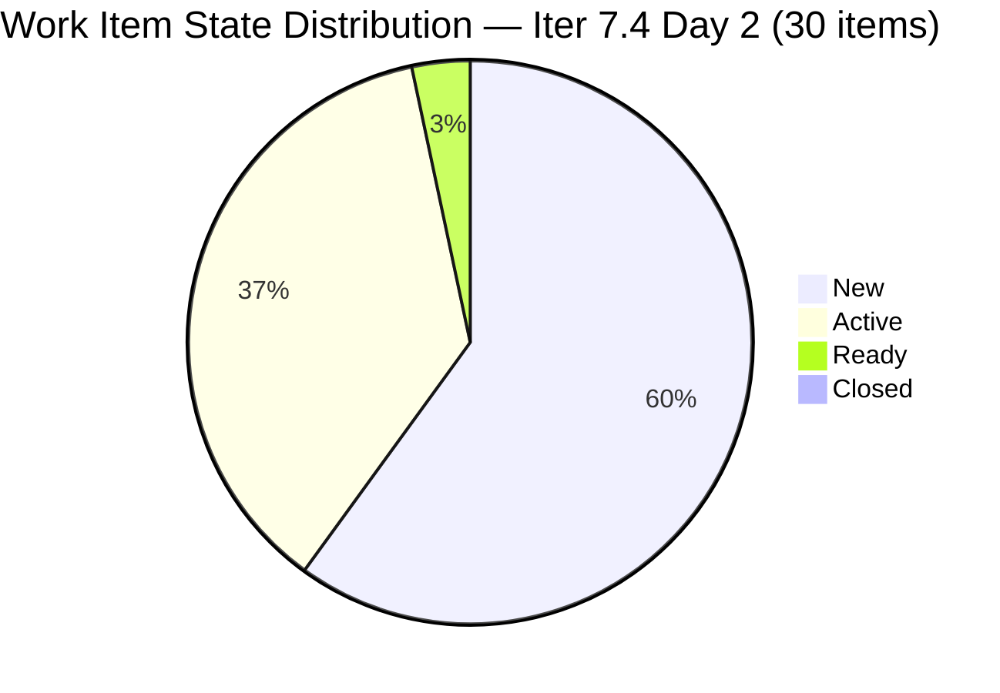
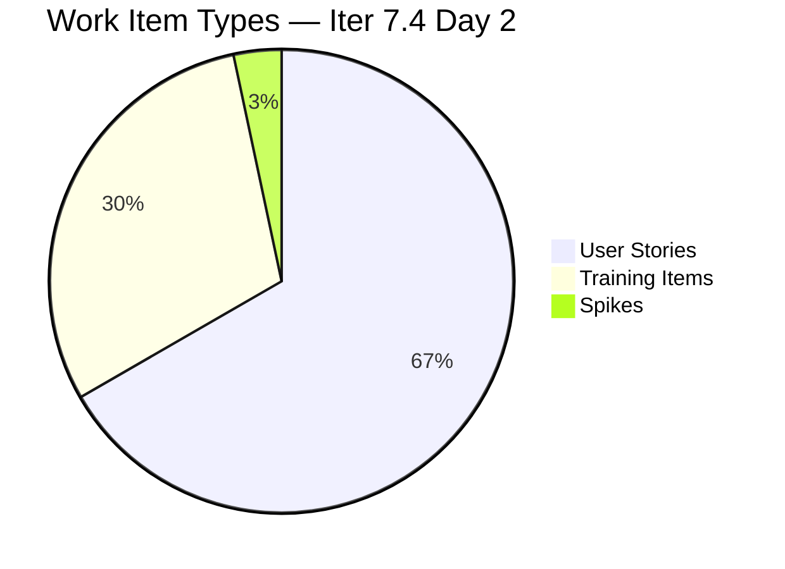
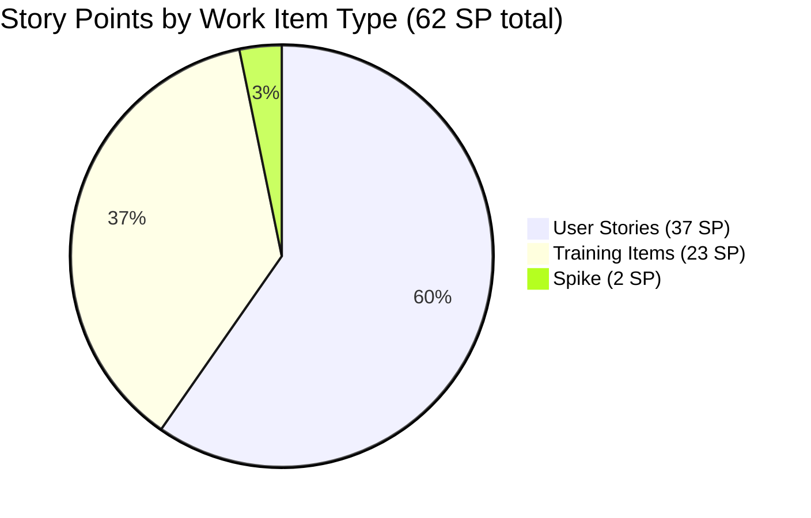

# JIT Operation Team — SAFe Iteration Audit #65

**Audit Date:** 2026-05-19 02:05
**Auditor:** Claude Code (SAFe PM Consultant)
**Workspace:** `ado_jit`
**ADO Board:** [JIT Operation Team](https://dev.azure.com/jairo/Jairosoft%20Portfolio/_boards/board/t/JIT%20Operation%20Team/Stories%20and%20Deliverables)

---

## 1. Audit Metadata

| Field | Value |
|-------|-------|
| Audit Number | #65 |
| Audit Date | 2026-05-19 |
| Audit Time | 02:05 |
| Iteration | 7.4 |
| Iteration Dates | May 18 – May 31, 2026 |
| Sprint Day | Day 2 of 14 |
| ADO Project | Jairosoft Portfolio (`666bb99a-6acd-4999-bb34-efd0e4ea90dc`) |
| ADO Team | JIT Operation Team (`b25e3129-6272-4e54-a3ff-f1ef3c8eeb2c`) |
| Iteration ID | `16385d00-244a-4caa-9e56-d4a8e850754d` |
| Prior Audit | AUDIT_20260518_0900.md (Score: 74.6 — Moderate Risk) |

---

## 2. Executive Summary

Iteration 7.4, Day 2. **Significant scope expansion detected**: backlog grew from 29 to 42 items overnight; active sprint items grew from 21 to 30 (9 new items added May 18–19). Key wins: the two previously unassigned items (#203986, #203989) are now assigned to Armelita — one is Active. Team capacity remains strong with Teofilo, Armelita, Samantha, and Grace fully allocated.

The overall score improves to **75.9 / 100 (Moderate Risk)**, up from 74.6 yesterday, driven by D6 refinement improvement (80→90) from new item activity. D7 remains 0 (no closures Day 2, early sprint). Sprint scope expansion and 8 untouched backlog items remain the primary watch items.

**Overall Score: 75.9 / 100 — Moderate Risk**

---

## 3. Previous Audit Delta

| Metric | 2026-05-18 (Audit #64) | 2026-05-19 (Audit #65) | Change |
|--------|------------------------|------------------------|--------|
| Sprint Day | Day 1 | Day 2 | +1 |
| Backlog Items (total visible) | 29 | 42 | +13 |
| Items in Iteration 7.4 | 21 | 30 | +9 |
| Story Points Total | 44 SP | 62 SP | +18 |
| Items Closed | 0 | 0 | 0 |
| SP Closed | 0 | 0 | 0 |
| Unassigned Items | 2 (#203986, #203989) | 0 | -2 ✅ |
| D1 — Iteration Planning | 72.4 | 71.4 | -1.0 |
| D6 — Backlog Refinement | 80.0 | 90.0 | +10.0 ✅ |
| Overall Score | 74.6 | 75.9 | +1.3 |
| Risk Band | Moderate Risk | Moderate Risk | — |

### New Items Added (May 18–19)
**Armelita additions (5 items):** #204532, #204562, #204567, #204572, #204576
**Teofilo additions (4 items):** #204614, #204615, #204616, #204617

### Resolved Issues
- **#203986** — now assigned to Armelita ✅
- **#203989** — now assigned to Armelita, status Active ✅

---

## 4. Current Iteration Snapshot

**Iteration 7.4** · May 18 – May 31, 2026 · **Day 2 of 14**

| Field | Value |
|-------|-------|
| Total Backlog Items | 42 |
| Items in Iter 7.4 | 30 |
| User Stories | 20 (66.7%) |
| Training Items | 9 (30.0%) |
| Spikes | 1 (3.3%) |
| Total SP (Iter 7.4) | 62 SP |
| SP — User Stories | 37 SP |
| SP — Training | 23 SP |
| SP — Spike | 2 SP |
| Items Closed | 0 |
| SP Burned | 0 |
| % Complete (Items) | 0% |
| % Complete (SP) | 0% |

### Capacity (Iter 7.4)

| Member | Activity | Pts/Day | Days Off | Available Days | SP Available |
|--------|----------|---------|----------|----------------|-------------|
| Teofilo Manosa | Development | 4.8 | May 18 | 13 | 62.4 |
| Armelita | PM / Dev | 6.0 | — | 14 | 84.0 |
| Samantha Manosa | Development | 6.0 | — | 14 | 84.0 |
| Grace | Support | 1.0 | — | 14 | 14.0 |
| **Total** | | | | | **244.4 SP** |

**Committed vs Capacity:** 62 SP committed vs 244 SP available. Utilization: ~25%. Significant headroom available.

---

## 5. Work Item Analysis

### State Distribution



### Item Type Distribution



### Story Points by Type



### Assignment Distribution

| Assignee | Items | SP |
|----------|-------|----|
| Armelita | 15 | ~31 |
| Teofilo Manosa | 9 | ~19 |
| Samantha Manosa | 5 | ~10 |
| Grace | 1 | ~2 |
| **Unassigned** | **0** | **0** |

> All items assigned — previous unassigned risk (#203986, #203989) resolved ✅

### Untouched Items (ChangedDate < May 18, 2026)

| Item ID | Last Touched | Days Stale | Risk |
|---------|-------------|------------|------|
| #200767 | Apr 6, 2026 | 43 days | Medium |
| #200768 | Apr 6, 2026 | 43 days | Medium |
| #203805 | May 6, 2026 | 13 days | Low |
| #203806 | May 6, 2026 | 13 days | Low |
| #203807 | May 6, 2026 | 13 days | Low |
| #203243 | May 6, 2026 | 13 days | Low |
| #203808 | May 4, 2026 | 15 days | Low |
| #203809 | May 4, 2026 | 15 days | Low |

**Untouched rate:** 8/30 = **26.7%** → >10% but ≤30% band → Penalty: **-10** (D6)

---

## 6. SAFe Compliance Scorecard

| Dimension | Score | Weight | Weighted | Notes |
|-----------|-------|--------|----------|-------|
| D1 — Iteration Planning | 71.4 | 1/7 | 10.2 | 12 items outside Iter 7.4 (42-30=12); ~28.6% backlog unplanned |
| D2 — Team Capacity | 100.0 | 1/7 | 14.3 | Capacity configured; SP well within capacity |
| D3 — Estimation | 100.0 | 1/7 | 14.3 | All 30 items have SP assigned (100%) |
| D4 — DoR Compliance | 100.0 | 1/7 | 14.3 | All 30 items have Description + AC meeting thresholds |
| D5 — Work Item Balance | 70.0 | 1/7 | 10.0 | US 66.7%, Training 30%, Spike 3.3% — non-US items >20% |
| D6 — Backlog Refinement | 90.0 | 1/7 | 12.9 | 8/30 untouched (26.7%) → -10 penalty; base 100 |
| D7 — Delivery Predictability | 0.0 | 1/7 | 0.0 | 0 SP closed Day 2 (early sprint — expected) |
| **Overall** | **75.9** | | | **Moderate Risk** |

**Calculation:** (71.4 + 100 + 100 + 100 + 70 + 90 + 0) / 7 = 531.4 / 7 = **75.9**

---

## 7. Dimension Findings

### D1 — Iteration Planning (71.4)
Of 42 total visible backlog items, 30 are assigned to Iter 7.4 and 12 are not (future iterations or backlog). The unplanned ratio of ~28.6% falls below the SAFe ideal of having a well-groomed, iteration-ready backlog. The 9 new items added on May 18–19 all landed in the current iteration, which is positive, but also contributed to increasing total backlog scope. **Watch**: if the backlog continues growing without allocation, D1 will decline further.

### D2 — Team Capacity (100.0)
All four team members have capacity configured in ADO. Total available capacity (244 SP) far exceeds the 62 SP committed. Teofilo's single day off (May 18) is accounted for. No risk of over-commitment.

### D3 — Estimation (100.0)
All 30 sprint items carry SP values. US average ~1.85 SP/item, Training average ~2.56 SP/item. No unestimated work items detected.

### D4 — DoR Compliance (100.0)
All 30 items meet the Definition of Ready thresholds: Description ≥30 non-whitespace characters and Acceptance Criteria ≥20 non-whitespace characters. Perfect DoR compliance maintained from prior audits.

### D5 — Work Item Balance (70.0)
User Story ratio is 66.7% (20/30). SAFe targets ≥80% US composition. The Training item volume (30%) is a persistent structural characteristic of the JIT team. Training items are legitimate work items for this team's charter; however, the rubric applies a fixed cap at 70 when non-US work exceeds 20%. Spike (1 item, 3.3%) is appropriate.

### D6 — Backlog Refinement (90.0)
Significant improvement from yesterday (80 → 90). Active item engagement reduced the untouched percentage from ~47.6% (yesterday — 10/21 items) to 26.7% today (8/30 items). The penalty band dropped from >30% (-20) to >10%≤30% (-10). Two items (#200767, #200768) were last touched on Apr 6 (43 days ago) and approach the 45-day staleness window — these should be groomed or de-committed before Day 7.

### D7 — Delivery Predictability (0.0)
No SP closed on Day 2. Per the early-sprint annotation (Days 1–5 of 14), this is expected and noted. First closures are anticipated on Day 3–4 given item volume and team capacity. #203989 is already in Active state (Armelita), suggesting a closure may come soon.

---

## 8. Risks and Bottlenecks

```mermaid
quadrantChart
    title Risk Matrix — JIT Iteration 7.4 Day 2
    x-axis Low Impact --> High Impact
    y-axis Low Likelihood --> High Likelihood
    quadrant-1 Monitor
    quadrant-2 Critical
    quadrant-3 Low Priority
    quadrant-4 Plan
    Scope Expansion (13 new items): [0.75, 0.8]
    Armelita Overload (15 items): [0.7, 0.7]
    Stale Items 200767/200768: [0.5, 0.75]
    No Iteration Goal: [0.5, 0.9]
    No PI Objectives: [0.5, 0.85]
    D1 Backlog Planning Gap: [0.6, 0.7]
```

| Risk | Severity | Status | Owner |
|------|----------|--------|-------|
| **Scope expansion** (29→42 backlog; 21→30 sprint) | High | New — Day 2 | Armelita (PO) |
| **No iteration goal defined** | Medium | Persistent — unfixed across audits | Armelita |
| **No PI objectives linked** | Medium | Persistent — unfixed across audits | Armelita |
| **Armelita holds 50% of items** (15/30) | Medium | Monitor for overload as sprint progresses | Armelita |
| **Stale items #200767, #200768** (43 days) | Medium | Approaching 45-day staleness threshold | Team |
| **D1 below target** (71.4 — 12 unplanned items) | Low | Structural; improving | Armelita |
| **Training items >20%** of sprint composition | Low | Structural — JIT team charter | — |

---

## 9. Prioritized Recommendations

| Priority | Recommendation | Due | Owner |
|----------|---------------|-----|-------|
| 🔴 P1 | **Define an iteration goal** for Iter 7.4 — capture in ADO Sprint description | May 19 | Armelita |
| 🔴 P1 | **Groom or de-commit #200767 and #200768** — 43 days stale, approaching staleness threshold | May 21 | Armelita |
| 🟡 P2 | **Link stories to PI objectives** — add Feature/Epic hierarchy where missing | May 21 | Armelita |
| 🟡 P2 | **Review scope expansion** — validate 9 new sprint items are correctly sized and committed | May 20 | Armelita / Team |
| 🟡 P2 | **Redistribute Armelita's load** — move 3–5 items to Samantha to balance assignment | May 21 | Armelita |
| 🟢 P3 | **Monitor D1** — with 12 unplanned backlog items, ensure they are planned for Iter 7.5 or de-committed | May 28 | Armelita |
| 🟢 P3 | **First closures target** — aim for 5+ SP closed by Day 4 (May 21) to establish burn momentum | May 21 | Team |

---

## 10. Evidence Gaps and Limitations

| Gap | Impact | Notes |
|-----|--------|-------|
| Items #204618–#204622 (Teofilo Training, Iter 7.5) returned incomplete field data | Low | These items are in Iter 7.5, not 7.4 — no scoring impact |
| Exact item titles truncated in batch API response | Low | SP, state, and assignment data confirmed; titles abbreviated in this report |
| `work_list_team_iterations` used team GUID (`b25e3129`) directly | None | Resolved via `core_list_project_teams` lookup in prior session |
| 8 untouched items — ChangedDate from batch call | Low | Dates extracted from `System.ChangedDate` field in WIT batch response |

---

*Generated by Claude Code SAFe Audit Engine · 2026-05-19 02:05 · Report #65*
*Framework: SAFe 6.0 · Risk Bands: Low ≥80 · Moderate 60–79.9 · High 40–59.9 · Critical <40*
