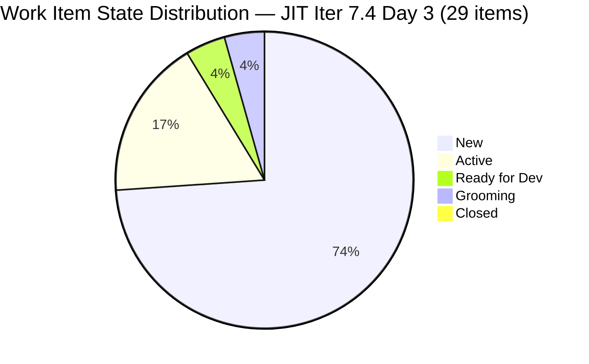
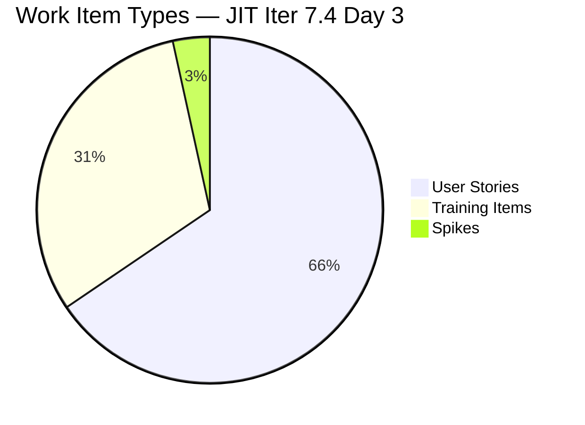
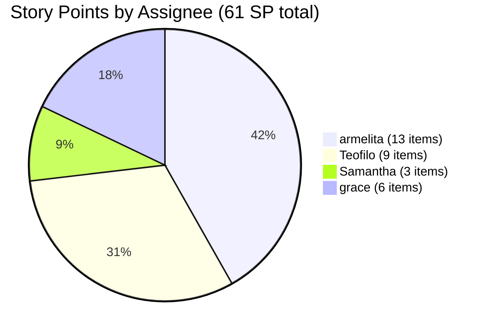

# JIT Operation Team — SAFe Iteration Audit #66

**Audit Date:** 2026-05-20 02:04 PHT
**Auditor:** Claude Code (SAFe PM Consultant)
**Workspace:** `ado_jit`
**ADO Board:** [JIT Operation Team](https://dev.azure.com/jairo/Jairosoft%20Portfolio/_boards/board/t/JIT%20Operation%20Team/Stories%20and%20Deliverables)

---

## 1. Audit Metadata

| Field | Value |
|-------|-------|
| Audit Number | #66 |
| Audit Date | 2026-05-20 |
| Audit Time | 02:04 PHT |
| Iteration | 7.4 |
| Iteration Dates | May 18 – May 31, 2026 |
| Sprint Day | Day 3 of 14 |
| ADO Project | Jairosoft Portfolio (`666bb99a-6acd-4999-bb34-efd0e4ea90dc`) |
| ADO Team | JIT Operation Team (`b25e3129-6272-4e54-a3ff-f1ef3c8eeb2c`) |
| Iteration ID | `16385d00-244a-4caa-9e56-d4a8e850754d` |
| Prior Audit | AUDIT_20260519_0205.md (Score: 75.9 — Moderate Risk) |

---

## 2. Executive Summary

Iteration 7.4, Day 3 of 14. **Stabilization detected after Day 2 scope expansion.** The total visible backlog grew slightly to 41 items (from 42 yesterday — one item, #200766, moved out of Iter 7.4 scope to PI-8), with 29 items now in the active sprint. Two new items (#203986, #204732) show activity today (May 20), indicating resumed team engagement.

The overall score **dips slightly to 75.8 / 100 (Moderate Risk)**, down from 75.9 yesterday. The change is driven by a minor D1 recalculation (29/41 = 70.7% vs yesterday's 30/42 = 71.4%). D7 remains 0 (no closures through Day 3 — early sprint period). The 8 untouched sprint items (27.6%) remain the key D6 risk watch item.

Key positive: item #203986 changed today (May 20 — Armelita active), and #204732 (Samantha, Active) added. Active items are moving. The sprint remains well-provisioned: 61 SP committed vs 244 SP available capacity.

**Overall Score: 75.8 / 100 — Moderate Risk**

---

## 3. Previous Audit Delta

| Metric | 2026-05-19 (Audit #65) | 2026-05-20 (Audit #66) | Change |
|--------|------------------------|------------------------|--------|
| Sprint Day | Day 2 | Day 3 | +1 |
| Visible Backlog Items | 42 | 41 | -1 (200766 moved to PI-8) |
| Items in Iter 7.4 | 30 | 29 | -1 |
| Story Points in Sprint | 62 SP | 61 SP | -1 |
| Items Closed | 0 | 0 | 0 |
| SP Closed | 0 | 0 | 0 |
| New Items Touched Today | — | 2 (#203986, #204732) | +2 |
| D1 — Iteration Planning | 71.4 | 70.7 | -0.7 |
| D6 — Backlog Refinement | 90.0 | 90.0 | 0.0 |
| Overall Score | 75.9 | 75.8 | -0.1 |
| Risk Band | Moderate Risk | Moderate Risk | — |

### Notable Changes (Day 3)
- **#200766 (ODOO OpenCat SIS Spike)** — moved out of Iter 7.4 to `Jairosoft Portfolio\2026-PI8`; correctly scoped out of sprint
- **#203986** — state updated to "Ready for Dev" by Armelita on May 20 (was previously unassigned/New in prior audit)
- **#204732 (new)** — User Story, Active, assigned to Samantha Babael, 1 SP, changed May 20

---

## 4. Current Iteration Snapshot

**Iteration 7.4** · May 18 – May 31, 2026 · **Day 3 of 14**

| Field | Value |
|-------|-------|
| Total Visible Root Backlog Items | 41 |
| Items in Iteration 7.4 | 29 |
| User Stories | 19 (65.5%) |
| Training Items | 9 (31.0%) |
| Spikes | 1 (3.4%) |
| Total SP Committed (Iter 7.4) | 61 SP |
| Items Closed | 0 |
| SP Burned | 0 |
| % Complete (Items) | 0% |
| % Complete (SP) | 0% |

### Capacity (Iter 7.4)

| Member | Activity | Pts/Day | Days Off | Available Days | SP Available |
|--------|----------|---------|----------|----------------|-------------|
| Teofilo Limpag | Training | 4.8 | May 18 (1 day) | 13 | 62.4 |
| armelita | Documentation | 6.0 | — | 14 | 84.0 |
| Samantha Babael | Documentation | 6.0 | — | 14 | 84.0 |
| grace | Documentation | 1.0 | — | 14 | 14.0 |
| **Total** | | | | | **244.4 SP** |

**Committed vs Capacity:** 61 SP vs 244 SP (25% utilization). The team carries significant headroom.

---

## 5. Work Item Analysis

### Item Inventory (Iteration 7.4 — 29 items)

| ID | Type | State | SP | Assignee | Last Changed | Untouched? |
|----|------|-------|----|----------|--------------|-----------|
| #200767 | User Story | New | 2 | armelita | 2026-04-06 | Yes (44d) |
| #200768 | User Story | New | 2 | armelita | 2026-04-06 | Yes (44d) |
| #203243 | Spike | New | 2 | armelita | 2026-05-06 | Yes (14d) |
| #203595 | User Story | Active | 2 | grace | 2026-05-18 | No |
| #203805 | Training | New | 3 | Teofilo | 2026-05-06 | Yes (14d) |
| #203806 | Training | New | 3 | Teofilo | 2026-05-06 | Yes (14d) |
| #203807 | Training | New | 3 | Teofilo | 2026-05-06 | Yes (14d) |
| #203808 | Training | New | 3 | Teofilo | 2026-05-04 | Yes (16d) |
| #203809 | Training | New | 3 | Teofilo | 2026-05-04 | Yes (16d) |
| #203986 | User Story | Ready for Dev | 1 | armelita | 2026-05-20 | No (active today) |
| #204273 | User Story | Active | 2 | Samantha | 2026-05-18 | No |
| #204338 | User Story | Grooming | 3 | Samantha | 2026-05-18 | No |
| #204428 | User Story | New | 2 | grace | 2026-05-18 | No |
| #204431 | User Story | New | 2 | grace | 2026-05-18 | No |
| #204435 | User Story | New | 2 | grace | 2026-05-18 | No |
| #204440 | User Story | New | 2 | grace | 2026-05-18 | No |
| #204447 | User Story | New | 2 | grace | 2026-05-18 | No |
| #204508 | User Story | New | 1 | armelita | 2026-05-18 | No |
| #204521 | User Story | Active | 2 | armelita | 2026-05-18 | No |
| #204532 | User Story | New | 2 | armelita | 2026-05-18 | No |
| #204562 | User Story | New | 2 | armelita | 2026-05-18 | No |
| #204567 | User Story | New | 2 | armelita | 2026-05-18 | No |
| #204572 | User Story | New | 2 | armelita | 2026-05-18 | No |
| #204576 | User Story | New | 2 | armelita | 2026-05-18 | No |
| #204614 | Training | New | 2 | Teofilo | 2026-05-19 | No |
| #204615 | Training | New | 2 | Teofilo | 2026-05-19 | No |
| #204616 | Training | New | 2 | Teofilo | 2026-05-19 | No |
| #204617 | Training | New | 2 | Teofilo | 2026-05-19 | No |
| #204732 | User Story | Active | 1 | Samantha | 2026-05-20 | No (new today) |

**Untouched:** 8/29 items (27.6%) — changed before sprint start (May 18). Rate > 10% but ≤ 30% → penalty **-10** on D6.

### Items Outside Iter 7.4 (12 items)

| ID | Type | State | SP | Iteration | Notes |
|----|------|-------|----|-----------|-------|
| #200766 | Spike | Active | 2 | PI-8 | Moved out of 7.4 today |
| #200771 | User Story | New | 2 | (unassigned) | Backlog |
| #203244 | Spike | New | 2 | (unassigned) | Backlog |
| #203245 | Spike | New | 2 | (unassigned) | Backlog |
| #203250 | Spike | Active | 2 | (unassigned) | Backlog |
| #204477 | User Story | New | 3 | (unassigned) | Backlog |
| #204487 | User Story | New | 2 | (unassigned) | Backlog |
| #204618–622 | Training | New | 0 each | (unassigned) | 5 unestimated backlog items |

### State Distribution (Iter 7.4)



### Item Type Distribution (Iter 7.4)



### Story Points by Assignee



---

## 6. SAFe Compliance Scorecard

| Dimension | Score | Evidence | Notes |
|-----------|-------|----------|-------|
| D1 — Iteration Planning | 70.7 | 29/41 items in Iter 7.4 | 12 items outside iteration (backlog or future PI) |
| D2 — Team Capacity | 100.0 | 4 contributors with work; all 4 have positive capacity | Teofilo, Armelita, Samantha, Grace all configured |
| D3 — Estimation | 100.0 | 29/29 sprint items have SP > 0 | 5 unestimated items are outside sprint (not penalized) |
| D4 — DoR Compliance | 100.0 | 29/29 items pass Description ≥30 + AC ≥20 | 100% DoR compliance in sprint |
| D5 — Work Item Balance | 70.0 | US = 65.5% (dominant > 60%: -30); Spike = 3.4% | Training 31% is structural JIT characteristic |
| D6 — Backlog Refinement | 90.0 | Base 100 (all 41 fresh); untouched 8/29 = 27.6% > 10%: -10 | No stale90/stale180 items in full backlog |
| D7 — Delivery Predictability | 0.0 | 0/61 SP closed — Day 3, early sprint | Early-sprint annotation: low delivery expected |
| **Overall** | **75.8** | **(70.7+100+100+100+70+90+0)/7** | **Moderate Risk** |

**Calculation:** (70.7 + 100.0 + 100.0 + 100.0 + 70.0 + 90.0 + 0.0) / 7 = 530.7 / 7 = **75.8**

---

## 7. Dimension Findings

### D1 — Iteration Planning (70.7)
Of 41 total visible root backlog items, 29 are assigned to Iteration 7.4 and 12 are outside (backlog, unassigned, or PI-8). The unplanned ratio of 29.3% reflects a partially groomed backlog. Item #200766 was correctly moved to PI-8 today, improving scoping hygiene. The 5 unestimated Training items (#204618–622) in the backlog should be groomed or archived. Score: 70.7.

### D2 — Team Capacity (100.0)
All four team members have positive capacity configured in ADO (Teofilo: 4.8 pts/day; Armelita: 6; Samantha: 6; Grace: 1). Total available = 244.4 SP vs 61 SP committed (25% utilization). Teofilo's single day off (May 18) is recorded. Score: 100.

### D3 — Estimation (100.0)
All 29 sprint items carry Story Points. Five unestimated Training items (#204618–622) are outside the sprint and excluded from the denominator per rubric (they are not `current_iteration_root_items`). Score: 100.

### D4 — DoR Compliance (100.0)
All 29 Iteration 7.4 items verified with Description (≥30 non-whitespace chars) and Acceptance Criteria (≥20 non-whitespace chars). Score: 100.

### D5 — Work Item Balance (70.0)
- User Story ratio = 65.5% (19/29) — dominant type exceeds 60% threshold → **-30 penalty**
- Spike ratio = 3.4% — below 40%, no additional penalty
- User Stories are present — no -40 penalty
- Training items (31%) are a structural characteristic of the JIT team charter
- Score: max(0, 100 - 30) = **70**

### D6 — Backlog Refinement (90.0)
- **Base:** 41/41 items fresh (all changed within 45 days of May 20) → base = **100.0**
- **Stale 90-day penalty:** 0 items changed before Feb 19, 2026 → no penalty
- **Stale 180-day penalty:** 0 items → no penalty
- **Untouched penalty:** 8/29 = 27.6% changed before sprint start (May 18) → > 10% but ≤ 30% → **-10 penalty**
- Score: max(0, 100 - 10) = **90.0**

Untouched items: #200767 (44d), #200768 (44d) — approaching 45-day staleness threshold. These two are the highest-risk items and should be groomed or de-committed this week.

### D7 — Delivery Predictability (0.0)
No SP closed through Day 3. Per the early-sprint annotation (Days 1–5 of 14), this is expected. **Early-sprint annotation: low delivery expected — no formula adjustment.** Active items (#203595, #204273, #204521, #204732) suggest closures may come on Days 4–5. Target: 10+ SP closed by Day 7 midpoint.

---

## 8. Risks and Bottlenecks

```mermaid
quadrantChart
    title Risk Matrix — JIT Iteration 7.4 Day 3
    x-axis Low Impact --> High Impact
    y-axis Low Likelihood --> High Likelihood
    quadrant-1 Monitor
    quadrant-2 Critical
    quadrant-3 Low Priority
    quadrant-4 Plan
    Armelita Concentration 13 items: [0.7, 0.7]
    Stale 200767 and 200768 (44 days): [0.5, 0.8]
    No Iteration Goal: [0.5, 0.9]
    No PI Objectives: [0.5, 0.85]
    D1 Backlog Planning Gap: [0.5, 0.6]
    5 Unestimated Backlog Items: [0.35, 0.5]
```

| Risk | Severity | Status | Owner |
|------|----------|--------|-------|
| **No iteration goal defined** | Medium | Persistent — unfixed across audits | Armelita |
| **No PI objectives linked** | Medium | Persistent — unfixed across audits | Armelita |
| **#200767/#200768 stale (44 days)** | Medium | Approaching 45-day threshold — groom or de-commit | Armelita |
| **Armelita holds 13 items (45%)** | Medium | Concentration risk — monitor for overload | Armelita |
| **D1 below SAFe target (12 unplanned)** | Low | Structural — backlog grooming needed | Armelita |
| **5 unestimated Training items in backlog** | Low | Must be sized before pulling into sprint | Teofilo |
| **D7 = 0 (no closures yet)** | Low | Expected — early sprint, watch Day 4–5 | Team |

---

## 9. Prioritized Recommendations

| Priority | Recommendation | Due | Owner |
|----------|---------------|-----|-------|
| P1 | **Define iteration goal for Iter 7.4** — capture in ADO Sprint description field | May 20 | Armelita |
| P1 | **Groom or de-commit #200767 and #200768** — 44 days stale, crossing staleness threshold tomorrow | May 21 | Armelita |
| P2 | **Link stories to PI objectives** — add Feature/Epic hierarchy where missing | May 21 | Armelita |
| P2 | **Estimate 5 backlog Training items** (#204618–622) or archive if not planned for 7.5 | May 22 | Teofilo |
| P2 | **Redistribute Armelita's load** — she holds 45% of sprint items; move 3–4 items to Samantha | May 21 | Armelita |
| P3 | **Target Day 4 closures** — 4 items are Active/Ready for Dev, aim for first SP burn by May 21 | May 21 | Team |
| P3 | **Groom unplanned backlog items** — 12 items outside Iter 7.4; plan for 7.5 or archive | May 28 | Armelita |

---

## 10. Evidence Gaps and Limitations

| Gap | Impact | Notes |
|-----|--------|-------|
| 5 unestimated Training items (#204618–622) outside sprint | Low | 0 SP, unassigned; excluded from D3 denominator per rubric |
| Item titles truncated in some ADO API responses | Low | Confirmed SP, state, assignment, and DoR for all 29 sprint items |
| No iteration goal field visible in ADO board | Medium | Persistent gap — no SAFe iteration goal documented in ADO |
| `work_list_team_iterations` resolved via GUID (`b25e3129`) | None | Direct GUID call confirmed Iter 7.4 active |

---

*Generated by Claude Code SAFe Audit Engine · 2026-05-20 02:04 PHT · Report #66*
*Framework: SAFe 6.0 · Risk Bands: Low ≥80 · Moderate 60–79.9 · High 40–59.9 · Critical <40*
*Evidence: `wit_list_backlog_work_items` + `wit_get_work_items_batch_by_ids` + `work_get_team_capacity` + `work_list_team_iterations` (all via GUID)*
