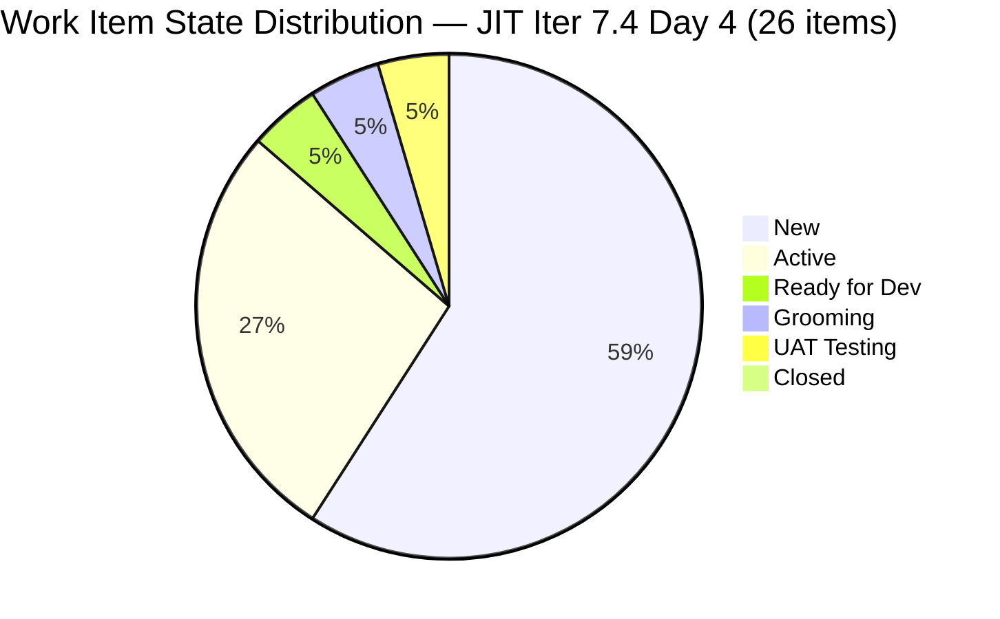
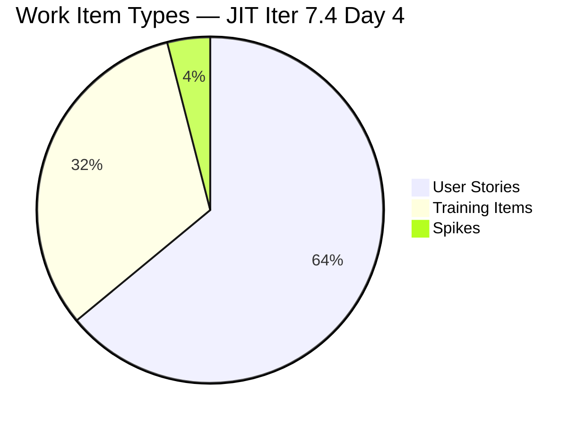
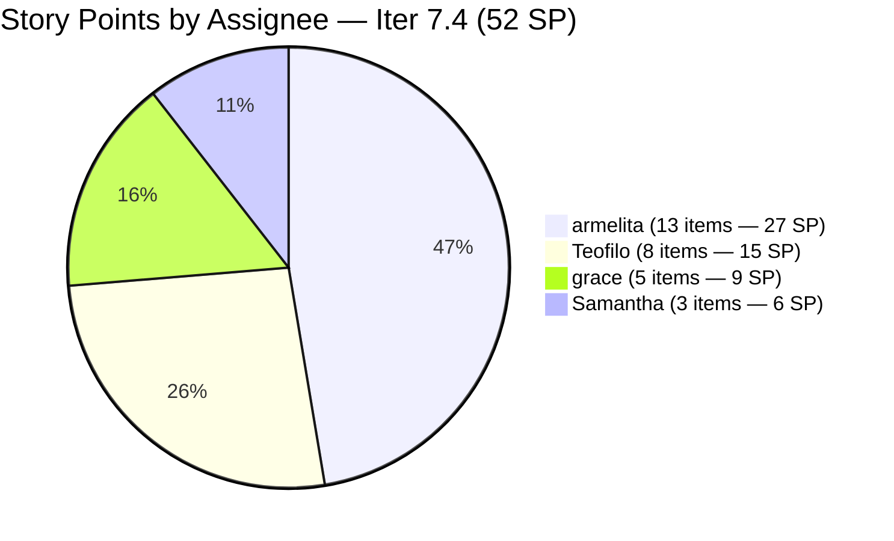
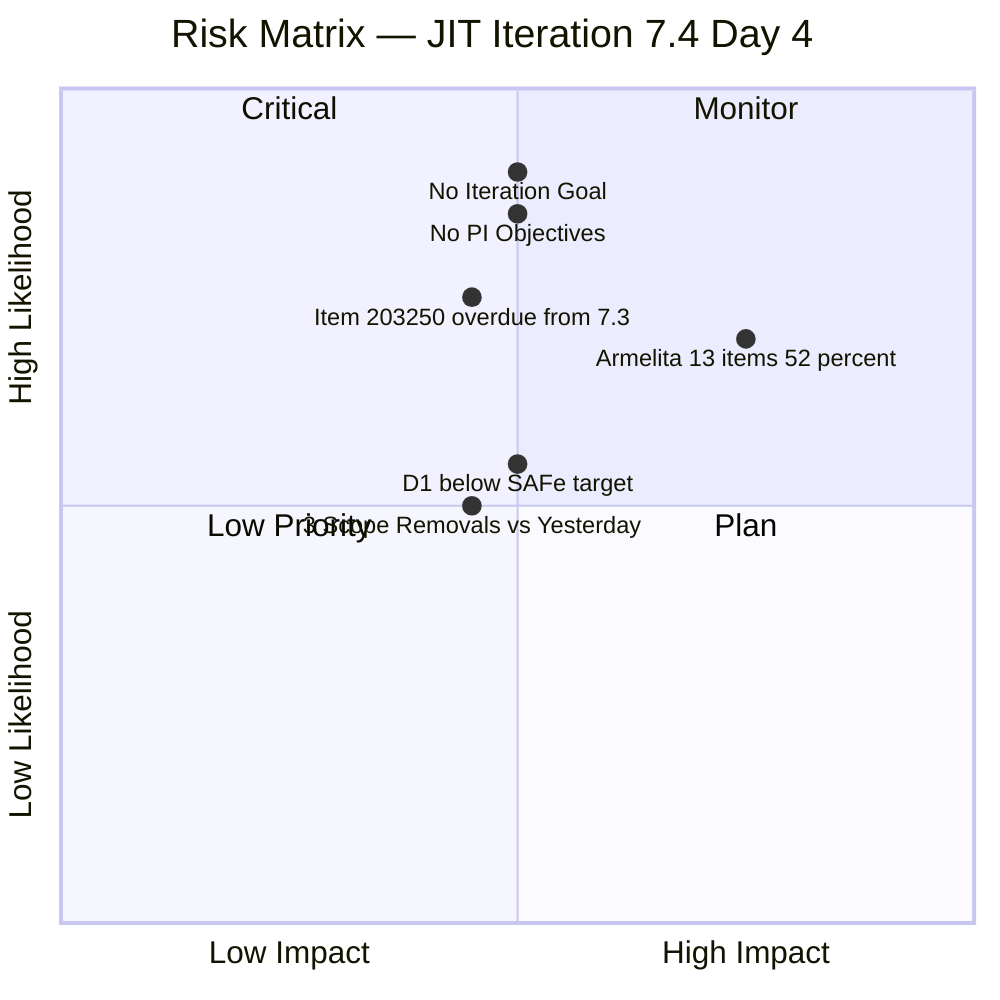

# JIT Operation Team — SAFe Iteration Audit #67

**Audit Date:** 2026-05-21 09:00 PHT
**Auditor:** Claude Code (SAFe PM Consultant)
**Workspace:** `ado_jit`
**ADO Board:** [JIT Operation Team](https://dev.azure.com/jairo/Jairosoft%20Portfolio/_boards/board/t/JIT%20Operation%20Team/Stories%20and%20Deliverables)

---

## 1. Audit Metadata

| Field | Value |
|-------|-------|
| Audit Number | #67 |
| Audit Date | 2026-05-21 |
| Audit Time | 09:00 PHT |
| Iteration | 7.4 |
| Iteration Dates | May 18 – May 31, 2026 |
| Sprint Day | Day 4 of 14 |
| ADO Project | Jairosoft Portfolio (`666bb99a-6acd-4999-bb34-efd0e4ea90dc`) |
| ADO Team | JIT Operation Team (`b25e3129-6272-4e54-a3ff-f1ef3c8eeb2c`) |
| Iteration ID | `16385d00-244a-4caa-9e56-d4a8e850754d` |
| Prior Audit | AUDIT_20260520_0204.md (Score: 75.8 — Moderate Risk) |

---

## 2. Executive Summary

Iteration 7.4, **Day 4 of 14**. **Meaningful sprint activity resumed overnight and this morning.** Four items recorded state changes or were touched today: #200767 and #200768 both moved to **Active** (Armelita, 06:23), #204562 moved to **Active** (Armelita, 06:38), and #204732 advanced to **UAT Testing** (Samantha, 00:17) — the sprint's first item approaching closure.

The total visible backlog is **38 items** (down from 41 in the prior audit — items #204428, #204431, and #203805 appear to have been removed from scope or are no longer visible in the Stories and Deliverables backlog). Items in Iteration 7.4 fell from 29 to **26**, reducing committed SP from 61 to **52 SP**.

The overall score **dips slightly to 75.5 / 100 (Moderate Risk)** from 75.8, driven primarily by the lower D1 ratio (26/38 = 68.4% vs 29/41 = 70.7%) from the backlog reduction. D6 holds at 90.0 with only 5/26 untouched items (19.2%). D7 remains 0 (no closures through Day 4, still within the early-sprint window). #204732 in UAT Testing is the leading indicator — a closure is imminent.

**Overall Score: 75.5 / 100 — Moderate Risk**

---

## 3. Previous Audit Delta

| Metric | 2026-05-20 (Audit #66) | 2026-05-21 (Audit #67) | Change |
|--------|------------------------|------------------------|--------|
| Sprint Day | Day 3 | Day 4 | +1 |
| Visible Backlog Items | 41 | 38 | -3 |
| Items in Iter 7.4 | 29 | 26 | -3 |
| Story Points Committed | 61 SP | 52 SP | -9 |
| Items Active | 4 | 7 | +3 |
| Items UAT Testing | 0 | 1 | +1 |
| Items Closed | 0 | 0 | 0 |
| SP Closed | 0 | 0 | 0 |
| D1 — Iteration Planning | 70.7 | 68.4 | -2.3 |
| Overall Score | 75.8 | 75.5 | -0.3 |
| Risk Band | Moderate Risk | Moderate Risk | — |

### Notable Changes (Day 4)

- **#200767 (UM Matina CPE Intern Final Demo)** — moved to **Active** by Armelita at 06:23 May 21. Previously flagged as potentially stale (last changed Apr 6), now actively engaged.
- **#200768 (HCDC Interns Final Demo)** — moved to **Active** by Armelita at 06:23 May 21. Same context — prior stale concern resolved by today's activity.
- **#204562 (EBET Training Scholarship Preparation)** — moved to **Active** by Armelita at 06:38 May 21.
- **#204732 (ADDU Intern Onboarding)** — advanced to **UAT Testing** by Samantha at 00:17 May 21. This is the most advanced item in the sprint; closure likely on Day 5.
- **Items #204428, #204431, #203805** — no longer returned by the backlog API. Likely removed from scope or moved to a different iteration. This explains the drop from 29 → 26 items and 61 → 52 SP.

---

## 4. Current Iteration Snapshot

**Iteration 7.4** · May 18 – May 31, 2026 · **Day 4 of 14**

| Field | Value |
|-------|-------|
| Total Visible Root Backlog Items | 38 |
| Items in Iteration 7.4 | 26 |
| User Stories | 16 (61.5%) |
| Training Items | 8 (30.8%) |
| Spikes | 1 (3.8%) |
| Unassigned Training (outside sprint) | 5 (in 7.5, 0 SP each) |
| Total SP Committed (Iter 7.4) | 52 SP |
| Items Active | 6 |
| Items UAT Testing | 1 (#204732) |
| Items Closed | 0 |
| SP Burned | 0 |
| % Complete (Items) | 0% |
| % Complete (SP) | 0% |

### Capacity (Iter 7.4)

| Member | Activity | Pts/Day | Days Off | Available Days | SP Available |
|--------|----------|---------|----------|----------------|-------------|
| Teofilo Limpag | Training | 4.8 | May 18 (ended) | 13 | 62.4 |
| armelita | Documentation | 6.0 | — | 14 | 84.0 |
| Samantha Babael | Documentation | 6.0 | — | 14 | 84.0 |
| grace | Documentation | 1.0 | — | 14 | 14.0 |
| **Total** | | | | | **244.4 SP** |

**Committed vs Capacity:** 52 SP vs 244 SP (21% utilization). Significant capacity headroom remains.

---

## 5. Work Item Analysis

### Item Inventory (Iteration 7.4 — 26 items)

| ID | Title (short) | Type | State | SP | Assignee | Last Changed | Untouched? |
|----|------|------|-------|----|----------|--------------|-----------|
| #200767 | UM Matina CPE Intern Final Demo | User Story | **Active** | 2 | armelita | **2026-05-21** | No (active today) |
| #200768 | HCDC Interns Final Demo | User Story | **Active** | 2 | armelita | **2026-05-21** | No (active today) |
| #203243 | AI Tools Demonstration Tech Talk | Spike | New | 2 | armelita | 2026-05-06 | Yes (15d) |
| #203595 | JIT Finance Collection Policy | User Story | Active | 2 | grace | 2026-05-18 | No |
| #203806 | 4.1-2 Tools, Equipment and Testing Devices | Training | New | 3 | Teofilo | 2026-05-06 | Yes (15d) |
| #203807 | 4.1-3 Personal Computer System and Specification | Training | New | 3 | Teofilo | 2026-05-06 | Yes (15d) |
| #203808 | 4.1-4 Occupational Health and Safety Procedures | Training | New | 3 | Teofilo | 2026-05-04 | Yes (17d) |
| #203809 | 4.1-5 Network Maintenance Task | Training | New | 3 | Teofilo | 2026-05-04 | Yes (17d) |
| #203986 | Set-up Eingress for Scholars' Biometrics | User Story | Ready for Dev | 1 | armelita | 2026-05-20 | No |
| #204273 | Prepare Bubble102/103 Scholarship Training Materials | User Story | Active | 2 | Samantha | 2026-05-18 | No |
| #204338 | Bubble Tesda Training | User Story | Grooming | 3 | Samantha | 2026-05-18 | No |
| #204435 | Archive Proof of Filing for TESDA Application | User Story | New | 2 | grace | 2026-05-18 | No |
| #204440 | Package SAFe Micro-credential Dossier | User Story | New | 2 | grace | 2026-05-18 | No |
| #204447 | Monitor and Log Daily Payment Collections | User Story | New | 2 | grace | 2026-05-18 | No |
| #204508 | Enrollment Report with Additional Student | User Story | New | 1 | armelita | 2026-05-18 | No |
| #204521 | Induction Training Program | User Story | Active | 2 | armelita | 2026-05-18 | No |
| #204532 | Review EBET AOU for the Implementation | User Story | New | 2 | armelita | 2026-05-18 | No |
| #204562 | EBET Training Scholarship Preparation | User Story | **Active** | 2 | armelita | **2026-05-21** | No (active today) |
| #204567 | Bubble TESDA Scholarship Training Proper | User Story | New | 2 | armelita | 2026-05-18 | No |
| #204572 | Report Submission | User Story | New | 2 | armelita | 2026-05-18 | No |
| #204576 | JIT Marketing/Processing Officer | User Story | New | 2 | armelita | 2026-05-18 | No |
| #204614 | 1.5-2 Conduct Test on the Installed Computer System | Training | New | 2 | Teofilo | 2026-05-19 | No |
| #204615 | 1.5-3 Document Testing Using Accomplishment Report | Training | New | 2 | Teofilo | 2026-05-19 | No |
| #204616 | 2.1-1 Network Design Training | Training | New | 2 | Teofilo | 2026-05-19 | No |
| #204617 | 2.1-2 Network Materials Training | Training | New | 2 | Teofilo | 2026-05-19 | No |
| #204732 | ADDU Intern Onboarding | User Story | **UAT Testing** | 1 | Samantha | **2026-05-21** | No |

**Untouched (changed before May 18):** 5/26 items — #203243 (May 6), #203806 (May 6), #203807 (May 6), #203808 (May 4), #203809 (May 4). Rate = 19.2% → >10% but ≤30% → **-10 penalty on D6**.

**Note:** #200767 and #200768 were previously flagged as approaching 45-day staleness (last changed Apr 6). Both were touched today (May 21) — no longer untouched and no longer at staleness risk.

### Items Outside Iter 7.4 (12 items)

| ID | Type | Iteration | Notes |
|----|------|-----------|-------|
| #200766 | Spike | PI-8 | ODOO OpenCat SIS — correctly scoped to PI-8 |
| #200771 | User Story | 7.5 | UM Digos Interns Final Demo |
| #203244 | Spike | 7.5 | IT7.5 Tech Talk |
| #203245 | Spike | 7.5 | IT7.6 Tech Talk |
| #203250 | Spike | 7.3 | Claude 4 course (overdue from 7.3) |
| #204477 | User Story | 7.5 | Bubble MCC Marketing June 1-5 |
| #204487 | User Story | 7.5 | Python Marketing Activities June 1-5 |
| #204618–622 | Training | 7.5 | 5 Training items, 0 SP each |

### State Distribution (Iter 7.4)

### Item Type Distribution (Iter 7.4)

### Story Points by Assignee (52 SP total)

---

## 6. SAFe Compliance Scorecard

| Dimension | Score | Evidence | Notes |
|-----------|-------|----------|-------|
| D1 — Iteration Planning | 68.4 | 26/38 items in Iter 7.4 | 12 items outside iteration (7.5, PI-8, 7.3) |
| D2 — Team Capacity | 100.0 | 4 contributors; all 4 have positive capacity configured | Teofilo, Armelita, Samantha, Grace |
| D3 — Estimation | 100.0 | 26/26 sprint items have SP > 0 | 5 unestimated Training items in 7.5 — outside sprint |
| D4 — DoR Compliance | 100.0 | 26/26 items pass Description ≥30 + AC ≥20 chars | 100% DoR compliance in sprint |
| D5 — Work Item Balance | 70.0 | US = 61.5% (dominant >60%: -30); Spike = 3.8% (<40%) | Training 30.8% is structural JIT characteristic |
| D6 — Backlog Refinement | 90.0 | Base 100 (38/38 fresh); untouched 5/26 = 19.2% >10%: -10 | No stale90/stale180 in full backlog |
| D7 — Delivery Predictability | 0.0 | 0/52 SP closed — Day 4, early-sprint window | Early-sprint annotation: low delivery expected |
| **Overall** | **75.5** | **(68.4+100+100+100+70+90+0) / 7** | **Moderate Risk** |

**Calculation:** (68.4 + 100.0 + 100.0 + 100.0 + 70.0 + 90.0 + 0.0) / 7 = 528.4 / 7 = **75.5**

---

## 7. Dimension Findings

### D1 — Iteration Planning (68.4)
Of 38 total visible root backlog items, 26 are assigned to Iteration 7.4 and 12 are outside (7.5, PI-8, 7.3). The sprint scope dropped from 29 to 26 items compared to yesterday — items #204428, #204431, and #203805 are no longer returned by the backlog API, likely removed or de-scoped. D1 = 26/38 = 68.4 — below the SAFe target of 80+. The unplanned backlog (12 items) represents scope for future iterations but should be groomed proactively. Item #203250 remains in Iteration 7.3 (overdue from prior sprint) and should be closed or moved. Score: 68.4.

### D2 — Team Capacity (100.0)
All four team members have positive capacity (Teofilo: 4.8 pts/day; Armelita: 6; Samantha: 6; Grace: 1). Total = 244.4 SP vs 52 SP committed (21% utilization). Score: 100.

### D3 — Estimation (100.0)
All 26 sprint items carry Story Points (1–3 SP each). Five unestimated Training items (#204618–622) are in Iteration 7.5 — excluded from denominator per rubric. Score: 100.

### D4 — DoR Compliance (100.0)
All 26 sprint items verified with Description (≥30 non-whitespace chars) and Acceptance Criteria (≥20 non-whitespace chars). Score: 100.

### D5 — Work Item Balance (70.0)
- User Story ratio = 61.5% (16/26) — dominant type exceeds 60% threshold → **-30 penalty**
- Spike ratio = 3.8% — below 40%, no additional penalty
- User Stories are present — no -40 penalty
- Training items (30.8%) are a structural characteristic of the JIT team
- Score: max(0, 100 - 30) = **70**

### D6 — Backlog Refinement (90.0)
- **Base:** 38/38 items changed within 45 days of May 21 — the oldest items (#203808, #203809) were last changed May 4 = 17 days ago → all fresh → base = **100.0**
- **Stale 90-day penalty:** 0 items changed before Feb 20 → no penalty
- **Stale 180-day penalty:** 0 items → no penalty
- **Untouched penalty:** 5/26 = 19.2% changed before sprint start (May 18) → >10% but ≤30% → **-10 penalty**
- Score: max(0, 100 - 10) = **90.0**

Note: #200767 and #200768 — previously approaching 45-day staleness (last changed Apr 6) — were both touched today (May 21) by Armelita. The prior audit's stale-watch risk has been resolved.

### D7 — Delivery Predictability (0.0)
0 SP closed through Day 4 of 14. Per the early-sprint annotation (Days 1–5), this is expected. **Early-sprint annotation: low delivery expected.** However, #204732 is in **UAT Testing** and may close on Day 5 (1 SP). Four additional items are Active — further closures likely by Day 7. Target: 10+ SP closed by Day 7 midpoint. Score: 0.

---

## 8. Risks and Bottlenecks

| Risk | Severity | Status | Owner |
|------|----------|--------|-------|
| **No iteration goal defined** | Medium | Persistent — unfixed across audits | Armelita |
| **No PI objectives linked** | Medium | Persistent — unfixed across audits | Armelita |
| **Armelita holds 13 items (52% of sprint SP)** | Medium | Concentration risk — active today, monitor for overload | Armelita |
| **#203250 stranded in Iteration 7.3** | Medium | Overdue from prior sprint; should be closed or moved | Armelita |
| **D1 below SAFe target (12 unplanned)** | Low | Structural — backlog grooming for 7.5 needed | Armelita |
| **3 items removed from sprint scope** | Low | #204428, #204431, #203805 removed; verify intent with team | Armelita |
| **D7 = 0 (no closures yet)** | Low | Expected — early sprint; #204732 in UAT is imminent | Team |

---

## 9. Prioritized Recommendations

| Priority | Recommendation | Due | Owner |
|----------|---------------|-----|-------|
| P1 | **Define iteration goal for Iter 7.4** — document in ADO Sprint description | May 21 | Armelita |
| P1 | **Close or reassign #203250** (overdue from 7.3) — resolve to current iteration or mark Done | May 21 | Armelita |
| P2 | **Link stories to PI objectives** — add Feature/Epic hierarchy where missing | May 22 | Armelita |
| P2 | **Target Day 5 closure of #204732** (UAT Testing, 1 SP, Samantha) — first SP burn of the sprint | May 22 | Samantha |
| P2 | **Redistribute Armelita's load** — she holds 52% of sprint SP (27 SP); move 3–4 items to Samantha | May 22 | Armelita |
| P3 | **Estimate 5 unassigned Training items in 7.5** (#204618–622) before grooming for next sprint | May 28 | Teofilo |
| P3 | **Investigate scope removal** — confirm intent behind removing #204428, #204431, #203805 from sprint | May 22 | Armelita |

---

## 10. Evidence Gaps and Limitations

| Gap | Impact | Notes |
|-----|--------|-------|
| Items #204428, #204431, #203805 no longer in backlog API | Medium | Previously in sprint; now absent — likely removed or moved; not confirmed by team |
| 5 unestimated Training items (#204618–622) in 7.5 | Low | 0 SP, unassigned; excluded from D3 denominator per rubric |
| No iteration goal field visible in ADO board | Medium | Persistent gap — SAFe iteration goal not documented in ADO |
| `work_list_team_iterations` confirmed via GUID (`16385d00`) | None | Iteration 7.4 confirmed current |

---

*Generated by Claude Code SAFe Audit Engine · 2026-05-21 09:00 PHT · Report #67*
*Framework: SAFe 6.0 · Risk Bands: Low ≥80 · Moderate 60–79.9 · High 40–59.9 · Critical <40*
*Evidence: `wit_list_backlog_work_items` (38 items) + `wit_get_work_items_batch_by_ids` + `work_get_team_capacity` + `work_list_team_iterations` (all via GUID)*
