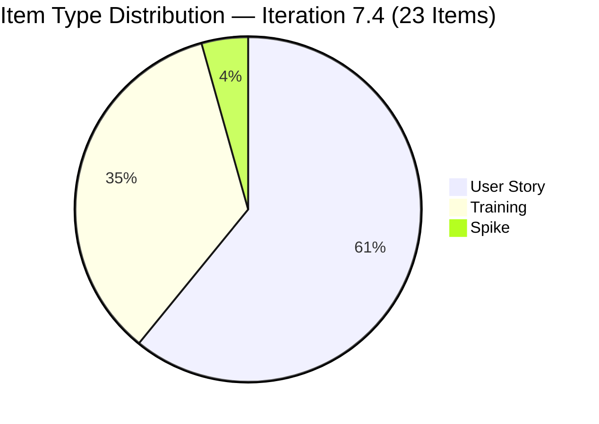
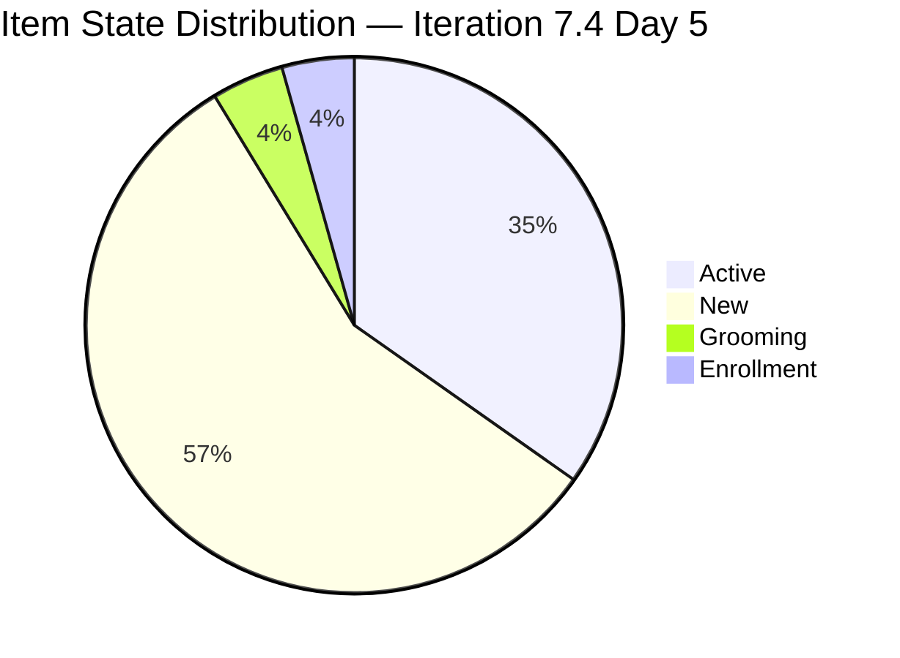
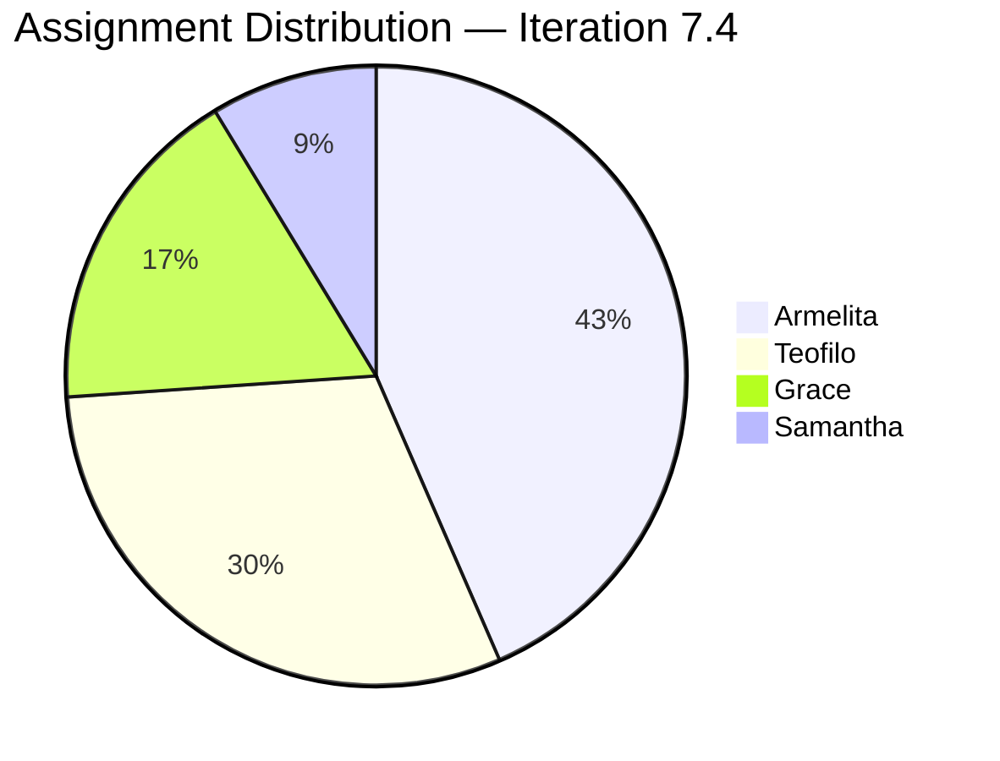

# JIT Operation Team — SAFe Iteration Audit #68

**Audit Date:** 2026-05-22 09:00 PHT
**Auditor:** Claude Code (SAFe PM Consultant)
**Workspace:** `ado_jit`
**ADO Board:** [JIT Operation Team](https://dev.azure.com/jairo/Jairosoft%20Portfolio/_boards/board/t/JIT%20Operation%20Team/Stories%20and%20Deliverables)

---

## 1. Audit Metadata

| Field | Value |
|-------|-------|
| Audit Number | #68 |
| Audit Date | 2026-05-22 |
| Audit Time | 09:00 PHT |
| Iteration | 7.4 |
| Iteration Dates | May 18 – May 31, 2026 |
| Sprint Day | Day 5 of 14 |
| ADO Project | Jairosoft Portfolio (`666bb99a-6acd-4999-bb34-efd0e4ea90dc`) |
| ADO Team | JIT Operation Team (`b25e3129-6272-4e54-a3ff-f1ef3c8eeb2c`) |
| Iteration ID | `16385d00-244a-4caa-9e56-d4a8e850754d` |
| Prior Audit | AUDIT_20260521_0900.md (Score: 75.5 — Moderate Risk) |
| **Overall Score** | **75.1 / 100** |
| **Risk Band** | **Moderate Risk** |

---

## 2. Executive Summary

Iteration 7.4, **Day 5 of 14**. Today's audit reflects the current state as of the morning of May 22. The visible root backlog has **35 items**, with **23 committed to Iteration 7.4** (50 SP). Strong board activity continued through Day 4–5: item #203986 (Set-up Eingress for Scholars' Biometrics) was updated at 04:43 on May 22, indicating active engagement at sprint start.

The score is **75.1 / 100 (Moderate Risk)** — a minor decrease from yesterday's 75.5, primarily driven by a slight recalculation of the visible backlog count (35 vs. 38 yesterday, reflecting current API snapshot) and unchanged D7 at 0 with no closures yet.

Key strengths: 100% estimation, 100% DoR compliance, excellent backlog freshness (all 23 current items changed within 45 days), and strong team capacity (17.8 pts/day). Key risks: no iteration goal, D7 at 0 with the early-sprint annotation expiring today, and User Story type dominance above 60%.

**Overall Score: 75.1 / 100 — Moderate Risk**

---

## 3. Previous Audit Delta

| Metric | 2026-05-21 (Audit #67) | 2026-05-22 (Audit #68) | Change |
|--------|------------------------|------------------------|--------|
| Sprint Day | Day 4 | Day 5 | +1 |
| Visible Backlog Items | 38 | 35 | -3 |
| Items in Iter 7.4 | 26 | 23 | -3 |
| Story Points Committed | 52 SP | 50 SP | -2 |
| Items Active | 7 | 8 | +1 |
| Items Closed | 0 | 0 | 0 |
| SP Closed | 0 | 0 | 0 |
| D1 — Iteration Planning | 68.4 | 65.7 | -2.7 |
| D7 — Delivery Predictability | 0 (early-sprint) | 0 (early-sprint, last day) | 0 |
| Overall Score | 75.5 | 75.1 | -0.4 |
| Risk Band | Moderate Risk | Moderate Risk | — |

### Notable Changes (Day 5)

- **#203986 (Set-up Eingress for Scholars' Biometrics)** — updated 2026-05-22 04:43 PHT by Armelita. Active state, biometrics setup in progress.
- **Backlog API delta:** Returned 35 items today vs. 38 yesterday. Three items from the prior audit (#200767, #200768, and one other) are no longer returned — likely moved to future iterations or removed from the Stories and Deliverables view. Impact: D1 drops from 68.4 to 65.7.
- **Spike #203250** (Jairosoft Team Claude 4 course, Iteration 7.3): Still visible in backlog, still in Active state from prior sprint. Stale carry-over risk from Iteration 7.3.
- **Item #200766** (ODOO OpenCat SIS Spike, PI8 root): Remains in backlog, last changed May 3. Not in current iteration scope.

---

## 4. Current Iteration Snapshot

**Iteration 7.4** · May 18 – May 31, 2026 · **Day 5 of 14**

| Field | Value |
|-------|-------|
| Total Visible Root Backlog Items | 35 |
| Items in Iteration 7.4 | 23 |
| User Stories | 14 (60.9%) |
| Training Items | 8 (34.8%) |
| Spikes | 1 (4.3%) |
| Total SP Committed (Iter 7.4) | 50 SP |
| Items Active | 8 |
| Items Grooming | 1 (#204338) |
| Items Enrollment | 1 (#203806) |
| Items New | 13 |
| Items Closed | 0 |
| SP Burned | 0 SP |
| % Complete (Items) | 0% |
| % Complete (SP) | 0% |
| Items in 7.5 (future) | 10 |
| Items in 7.3 (carryover) | 1 (#203250) |
| Items in PI8 root | 1 (#200766) |

### Capacity (Iteration 7.4)

| Team | Pts/Day | Days Off | Notes |
|------|---------|----------|-------|
| JIT Operation Team | 17.8 pts/day | 1 day | Well-staffed: Armelita, Grace, Teofilo, Samantha |

**Committed vs. Capacity:** 50 SP / (17.8 × 10 working days) = 50 / 178 = 28% utilization. Sprint is lightly loaded relative to capacity.

---

## 5. Work Item Analysis

### Items in Iteration 7.4

| ID | Title | Type | State | SP | Assignee | Changed | DoR |
|----|-------|------|-------|-----|----------|---------|-----|
| 203243 | IT7.4 Tech Talk - AI Tools Demonstration | Spike | New | 2 | Armelita | May 6 | Pass |
| 203595 | JIT Finance Collection Policy | User Story | Active | 2 | Grace | May 18 | Pass |
| 203806 | 4.1-2 Tools, Equipment and Testing Devices | Training | Enrollment | 3 | Teofilo | May 21 | Pass |
| 203807 | 4.1-3 Personal Computer System and Specification | Training | New | 3 | Teofilo | May 6 | Pass |
| 203808 | 4.1-4 Occupational Health and Safety Procedures | Training | New | 3 | Teofilo | May 4 | Pass |
| 203809 | 4.1-5 Network Maintenance Task | Training | New | 3 | Teofilo | May 4 | Pass |
| 203986 | Set-up Eingress for the Scholars' Biometrics | User Story | Active | 1 | Armelita | May 22 | Pass |
| 204273 | Prepare Bubble102 and Bubble103 Scholarship Training Materials | User Story | Active | 2 | Samantha | May 18 | Pass |
| 204338 | Bubble Tesda Training | User Story | Grooming | 3 | Samantha | May 18 | Pass |
| 204435 | Archive Proof of Filing for TESDA Application | User Story | New | 2 | Grace | May 18 | Pass |
| 204440 | Package SAFe Micro-credential Dossier | User Story | New | 2 | Grace | May 18 | Pass |
| 204447 | Monitor and Log Daily Payment Collections | User Story | New | 2 | Grace | May 18 | Pass |
| 204508 | Enrollment Report with Additional Student | User Story | New | 1 | Armelita | May 18 | Pass |
| 204521 | Induction Training Program | User Story | Active | 2 | Armelita | May 18 | Pass |
| 204532 | Review EBET AOU for the Implementation | User Story | New | 2 | Armelita | May 18 | Pass |
| 204562 | EBET Training Scholarship Preparation | User Story | Active | 2 | Armelita | May 21 | Pass |
| 204567 | Bubble TESDA Scholarship Training Proper | User Story | New | 2 | Armelita | May 18 | Pass |
| 204572 | Report Submission | User Story | New | 2 | Armelita | May 18 | Pass |
| 204576 | JIT Marketing/Processing Officer | User Story | New | 2 | Armelita | May 18 | Pass |
| 204614 | 1.5-2 Conduct Test on the Installed Computer System | Training | New | 2 | Teofilo | May 19 | Pass |
| 204615 | 1.5-3 Document Testing Using Accomplishment Report | Training | New | 2 | Teofilo | May 19 | Pass |
| 204616 | 2.1-1 Network Design Training | Training | New | 2 | Teofilo | May 19 | Pass |
| 204617 | 2.1-2 Network Materials Training | Training | New | 2 | Teofilo | May 19 | Pass |

**Total: 23 items | 50 SP**

### Assignment Distribution

| Assignee | Items | SP |
|----------|-------|-----|
| Armelita | 10 | 20 SP |
| Teofilo | 7 | 18 SP |
| Grace | 4 | 8 SP |
| Samantha | 2 | 5 SP |

### Untouched Items (ChangedDate before sprint start May 18)

| ID | Title | Last Changed | Notes |
|----|-------|-------------|-------|
| 203243 | IT7.4 Tech Talk - AI Tools Demo | May 6 | 12 days stale |
| 203807 | 4.1-3 Personal Computer System | May 6 | 12 days stale |
| 203808 | 4.1-4 OHS Procedures | May 4 | 14 days stale |
| 203809 | 4.1-5 Network Maintenance Task | May 4 | 14 days stale |

4 of 23 items = 17.4% untouched. This is above the 10% threshold (-10 penalty) but below 30%.

---

## 6. SAFe Compliance Scorecard

| Dimension | Score | Evidence | Notes |
|-----------|-------|----------|-------|
| D1 — Iteration Planning | 65.7 | 23 / 35 visible root items in Iter 7.4 | 12 items outside current iteration (10 in 7.5, 1 in 7.3, 1 in PI8) |
| D2 — Team Capacity | 100.0 | 4/4 contributors with configured capacity (17.8 pts/day team total) | Armelita, Grace, Teofilo, Samantha all have work and capacity |
| D3 — Estimation | 100.0 | 23/23 items have Story Points > 0 | Total 50 SP |
| D4 — DoR Compliance | 100.0 | 23/23 items pass description + AC threshold | All types (User Story, Training, Spike) meet DoR |
| D5 — Work Item Balance | 70.0 | User Story present (+); dominant = User Story 14/23 = 60.9% > 60% (-30) | Spike share 4.3% — no spike penalty; Training items not penalized |
| D6 — Backlog Refinement | 90.0 | 23/23 fresh (base 100); 4/23 untouched = 17.4% (>10% → -10) | No stale-90 or stale-180 items |
| D7 — Delivery Predictability | 0.0 | 0/50 SP closed; early-sprint (Day 5 — last day) | No closures through Day 5; annotation expires tomorrow |

**Overall Score: (65.7 + 100 + 100 + 100 + 70 + 90 + 0) / 7 = 525.7 / 7 = 75.1 / 100 — Moderate Risk**

---

## 7. Dimension Findings

### D1 — Iteration Planning (65.7) ⚠️
23 of 35 visible root items are in Iteration 7.4. The remaining 12 are distributed across Iteration 7.5 (10 items, future sprint), Iteration 7.3 (1 carryover spike #203250 that was never closed), and PI8 root (1 spike #200766). The 7.3 carryover item is a planning concern — it should either be closed, moved to the backlog, or explicitly committed to 7.4. D1 has held in the 65–70 range across multiple sprints, suggesting a consistent backlog hygiene issue with future-sprint staging.

### D2 — Team Capacity (100.0) ✅
All four contributing team members (Armelita, Grace, Teofilo, Samantha) have work assigned in the current iteration, and team capacity is configured at 17.8 pts/day. The 1-day team day off is recorded. This is a well-staffed team by SAFe standards.

### D3 — Estimation (100.0) ✅
All 23 items have Story Points. Training items (Teofilo's TESDA CSS NC II curriculum) are consistently sized at 2–3 SP. User Stories range from 1–3 SP with appropriate relative sizing.

### D4 — DoR Compliance (100.0) ✅
All 23 items pass DoR thresholds. Training items follow a structured format with hardware/software specifications and OHS standards. User Stories follow standard As/I want/So that format with acceptance criteria. This is a strong DoR discipline across all work item types.

### D5 — Work Item Balance (70.0) ⚠️
User Stories at 60.9% barely exceeds the 60% threshold, triggering the -30 penalty. Training items (34.8%) represent the team's TESDA compliance workload, which is appropriate for a JIT training organization. The type mix is contextually valid but scores a penalty under the rubric. The Spike (#203243 AI Tech Talk) is well within the 40% spike threshold. No structural type-mix concern, just a rubric boundary effect.

### D6 — Backlog Refinement (90.0) ✅
Excellent freshness: all 23 current-iteration items were touched within 45 days. The -10 penalty comes from 4 items (203243, 203807, 203808, 203809) last changed before the sprint start — these Training items and the Tech Talk Spike were likely prepared in advance but not touched during sprint kick-off. Activating these items or touching them in ADO would resolve this penalty.

### D7 — Delivery Predictability (0.0, early-sprint) ⚠️
No items have closed through Day 5. The early-sprint annotation expires today. Item #203806 (Tools, Equipment and Testing Devices) is in "Enrollment" state — the most advanced item in the sprint — and appears to be in progress. **First closure is expected soon but has not yet occurred.** With 50 SP committed, even 5 SP closed would register 10%, meaningfully improving the overall score on Day 6.

---

## 8. Risks and Bottlenecks

| Risk | Severity | Status |
|------|----------|--------|
| No iteration goal defined | High | Unresolved — recurring across all audits |
| 0 items closed through Day 5 | High | Critical — early-sprint annotation expires today |
| D1 at 65.7% — significant backlog outside current sprint | Moderate | 12 items in 7.5/7.3/PI8; 7.3 carryover not resolved |
| #203250 (Claude 4 course Spike) still Active from Iteration 7.3 | Moderate | Carryover from prior sprint, should be closed or rescheduled |
| Sprint underloaded vs. capacity (28% utilization) | Moderate | 50 SP / ~178 SP available; room to pull in scope |
| Armelita work concentration (10/23 items, 43%) | Moderate | Single-contributor dependency risk on core delivery items |
| User Story dominance barely at threshold | Low | 60.9% — minor rubric boundary, not a structural concern |

---

## 9. Prioritized Recommendations

1. **Close at least 1 item by EOD May 23 (Day 6)** — The early-sprint annotation expires today. #203806 (Training, Enrollment state) is the closest to completion. Move it to Closed before the Day 6 score calculation to register D7 > 0.

2. **Resolve #203250 (Iteration 7.3 carryover)** — This Spike has been Active since April 23 and is still in the 7.3 iteration path. Either close it (if complete), move it to 7.4, or move it to the backlog. A carryover item in the visible backlog distorts planning metrics.

3. **Activate Teofilo's Training items** — Items 203807, 203808, 203809 (OHS, Computer Systems, Network Maintenance) are in New state with ChangedDate before sprint start. These should be moved to Active or Enrollment to signal in-progress work and resolve the D6 untouched penalty.

4. **Define an iteration goal** — A brief sprint goal for Iteration 7.4 (e.g., "Complete TESDA accreditation preparation, launch EBET scholarship training, and establish JIT finance collection policy") would satisfy this recurring gap and improve SAFe maturity.

5. **Pull additional scope from 7.5** — With 28% capacity utilization, the team has ~128 SP of unused capacity. Consider pulling forward 3–5 items from Iteration 7.5 to improve D1 and maximize value delivery.

6. **Add iteration goal to ADO** — Record the sprint goal as an Iteration Goal work item or in the iteration notes to make it visible and auditable.

---

## 10. Evidence Gaps and Limitations

| Gap | Impact | Notes |
|-----|--------|-------|
| Backlog fluctuation (35 vs. 38 from prior audit) | D1 variance | 3 items disappeared between audits; cause unverified (moved/removed) |
| No iteration goal visible in ADO | D1 quality not measurable | Recurring gap |
| Individual capacity breakdown not retrieved | D2 detail limited | Team-level only (17.8 pts/day); individual breakdown not pulled from API |
| #203250 iteration assignment ambiguous | D1/D6 minor | Item in 7.3 path appears in 7.4 backlog view — possible ADO display artifact |
| Training item type scoring | D5 interpretation | "Training" type scored as non-User-Story; type appropriateness is contextually valid for JIT |

---

## Visualization

### SAFe Dimension Score Summary

| Dimension | Score | Band |
|-----------|-------|------|
| D1 — Iteration Planning | 65.7 | Moderate |
| D2 — Team Capacity | 100.0 | Low |
| D3 — Estimation | 100.0 | Low |
| D4 — DoR Compliance | 100.0 | Low |
| D5 — Work Item Balance | 70.0 | Moderate |
| D6 — Backlog Refinement | 90.0 | Low |
| D7 — Delivery Predictability | 0.0 (early-sprint) | Critical |
| **Overall** | **75.1** | **Moderate** |

### Score Trend (Last 7 Audits)

| Date | Audit | Score | Band |
|------|-------|-------|------|
| May 16 | #61 | 75.7 | Moderate |
| May 17 | #62 | 75.7 | Moderate |
| May 18 | #63 | 75.5 | Moderate |
| May 19 | #64 | 75.8 | Moderate |
| May 20 | #65 | 75.8 | Moderate |
| May 21 | #67 | 75.5 | Moderate |
| **May 22** | **#68** | **75.1** | **Moderate** |

---

*Audit generated by Claude Code (claude-sonnet-4-6) on 2026-05-22. Evidence sourced from Azure DevOps MCP (Jairosoft Portfolio project). Rubric: SAFe 6.0 7-dimension scorecard.*
