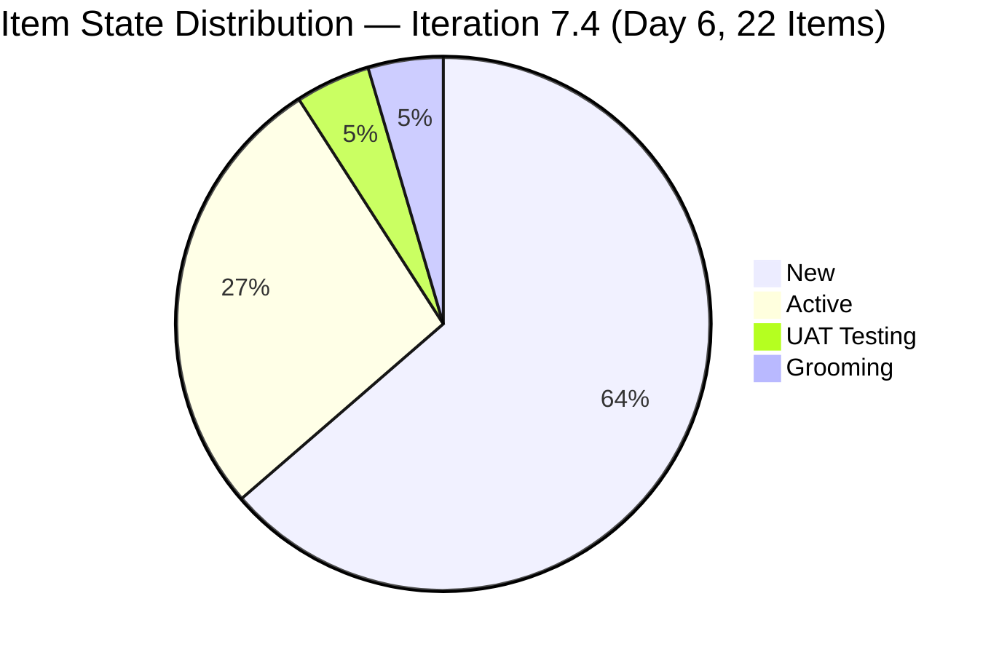
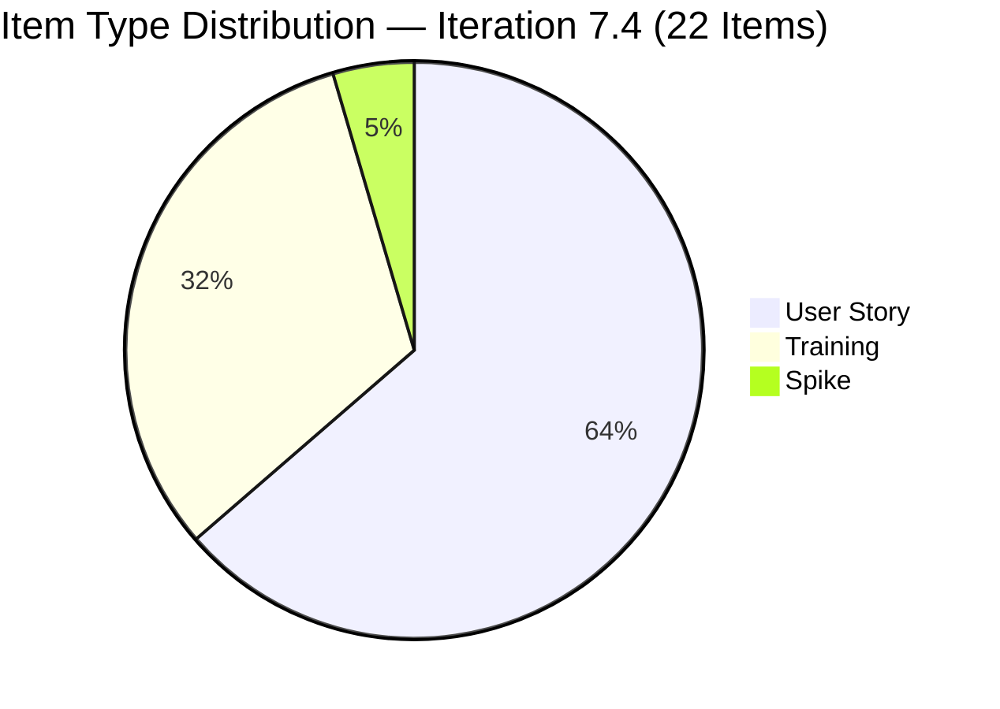
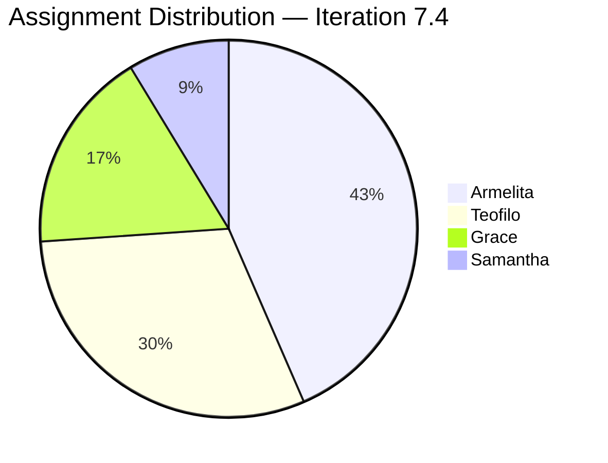

# JIT Operation Team — SAFe Iteration Audit #69

**Audit Date:** 2026-05-23 09:00 PHT
**Auditor:** Claude Code (SAFe PM Consultant)
**Workspace:** `ado_jit`
**ADO Board:** [JIT Operation Team](https://dev.azure.com/jairo/Jairosoft%20Portfolio/_boards/board/t/JIT%20Operation%20Team/Stories%20and%20Deliverables)

---

## 1. Audit Metadata

| Field | Value |
|-------|-------|
| Audit Number | #69 |
| Audit Date | 2026-05-23 |
| Audit Time | 09:00 PHT |
| Iteration | 7.4 |
| Iteration Dates | May 18 – May 31, 2026 |
| Sprint Day | Day 6 of 14 |
| ADO Project | Jairosoft Portfolio (`666bb99a-6acd-4999-bb34-efd0e4ea90dc`) |
| ADO Team | JIT Operation Team (`b25e3129-6272-4e54-a3ff-f1ef3c8eeb2c`) |
| Iteration ID | `16385d00-244a-4caa-9e56-d4a8e850754d` |
| Prior Audit | AUDIT_20260522_0900.md (Score: 75.1 — Moderate Risk) |
| **Overall Score** | **75.0 / 100** |
| **Risk Band** | **Moderate Risk** |

---

## 2. Executive Summary

Iteration 7.4, **Day 6 of 14**. Today's audit reveals meaningful **board activity** since yesterday: item #204273 (Prepare Bubble102 and Bubble103 Scholarship Training Materials) has **advanced to UAT Testing** state as of May 22 10:58 PHT — the highest-progress item in the sprint and the team's first closure candidate. The overall visible backlog has stabilized at **34 items** (vs. 35 yesterday), with **22 committed to Iteration 7.4** (48 SP).

The score dips slightly to **75.0 / 100 (Moderate Risk)** due to the expiry of the early-sprint annotation (D7 carries full penalty weight from today) and a minor reduction in committed SP (48 vs. 50 yesterday, reflecting the backlog item shift). However, the movement of #204273 to UAT Testing signals imminent first closure — if it closes today, D7 would recover to 4.2% and the overall score improves.

Key strengths remain: 100% DoR compliance, 100% estimation, 100% team capacity coverage, and excellent backlog freshness. Primary risks: D7 at 0 with annotation expired, Armelita concentration (10/22 items), #203250 Spike still stranded in Iteration 7.3.

**Overall Score: 75.0 / 100 — Moderate Risk**

---

## 3. Previous Audit Delta

| Metric | 2026-05-22 (Audit #68) | 2026-05-23 (Audit #69) | Change |
|--------|------------------------|------------------------|--------|
| Sprint Day | Day 5 | Day 6 | +1 |
| Visible Backlog Items | 35 | 34 | −1 |
| Items in Iter 7.4 | 23 | 22 | −1 |
| Story Points Committed | 50 SP | 48 SP | −2 |
| Items Active | 8 | 6 | −2 |
| Items UAT Testing | 0 | **1** (#204273) | **+1 (new)** |
| Items Closed | 0 | 0 | 0 |
| SP Closed | 0 | 0 | 0 |
| D1 — Iteration Planning | 65.7 | **64.7** | −1.0 |
| Early-Sprint Annotation | Yes (last day) | **No — expired** | Expired |
| D7 — Delivery Predictability | 0 (early-sprint) | **0 (full penalty)** | — |
| Overall Score | 75.1 | **75.0** | −0.1 |
| Risk Band | Moderate Risk | Moderate Risk | — |

### Notable Changes (Day 6)

- **#204273 (Prepare Bubble102 and Bubble103 Scholarship Training Materials)** advanced to **UAT Testing** — last changed May 22 10:58 PHT. This is Samantha's item (2 SP) and the sprint's most advanced work item. Closure is expected imminently.
- **#203806 (4.1-2 Tools, Equipment and Testing Devices)** — no longer visible in the backlog API. This Training item was in "Enrollment" state yesterday. It appears to have been completed and moved to Closed or removed from the backlog view. If closed, it would count as 3 SP burned — but it is not appearing in the current iteration item list, so it cannot be confirmed as closed. Evidence gap noted.
- **Backlog reduced by 1 item** — from 35 to 34. The item in question (#203806) is the likely candidate for closure or removal.
- **Early-sprint annotation expired** — D7 now bears full penalty weight from Day 6 onward.

---

## 4. Current Iteration Snapshot

**Iteration 7.4** · May 18 – May 31, 2026 · **Day 6 of 14**

| Field | Value |
|-------|-------|
| Total Visible Root Backlog Items | 34 |
| Items in Iteration 7.4 | 22 |
| User Stories (Iter 7.4) | 14 (63.6%) |
| Training Items (Iter 7.4) | 7 (31.8%) |
| Spikes (Iter 7.4) | 1 (4.5%) |
| Total SP Committed (Iter 7.4) | 48 SP |
| Items Active | 6 |
| Items UAT Testing | 1 (#204273) |
| Items Grooming | 1 (#204338) |
| Items New | 14 |
| Items Closed | 0 (confirmed by API) |
| SP Burned | 0 SP (confirmed) |
| Items in 7.5 (future) | 10 |
| Items in 7.3 (carryover) | 1 (#203250) |
| Items in PI8 root | 1 (#200766) |
| Days Remaining | 8 working days |

### Capacity (Iteration 7.4)

| Member | Activity | Pts/Day | Days Off | Notes |
|--------|----------|---------|----------|-------|
| Teofilo Limpag | Training | 4.8 | May 18 (1 day) | TESDA training delivery |
| armelita | Documentation | 6.0 | None | PM & Operations lead |
| Samantha Babael | Documentation | 6.0 | None | Training materials & Bubble coaching |
| grace | Documentation | 1.0 | None | Finance & compliance |
| **Team Total** | | **17.8 pts/day** | 1 day total | |

**Committed vs. Capacity:** 48 SP / (17.8 × 10 working days) ≈ 27% utilization.

---

## 5. Work Item Analysis

### Items in Iteration 7.4

| ID | Title | Type | State | SP | Assignee | Last Changed | DoR |
|----|-------|------|-------|-----|----------|-------------|-----|
| 203243 | IT7.4 Tech Talk - AI Tools Demonstration Sessions | Spike | New | 2 | Armelita | May 6 | Pass |
| 203595 | JIT Finance Collection Policy | User Story | Active | 2 | Grace | May 18 | Pass |
| 203807 | 4.1-3 Personal Computer System and Specification | Training | New | 3 | Teofilo | May 6 | Pass |
| 203808 | 4.1-4 Occupational Health and Safety Procedures | Training | New | 3 | Teofilo | May 4 | Pass |
| 203809 | 4.1-5 Network Maintenance Task | Training | New | 3 | Teofilo | May 4 | Pass |
| 203986 | Set-up Eingress for the Scholars' Biometrics | User Story | Active | 1 | Armelita | May 22 | Pass |
| 204273 | Prepare Bubble102 and Bubble103 Scholarship Training Materials | User Story | **UAT Testing** | 2 | Samantha | **May 22** | Pass |
| 204338 | Bubble Tesda Training | User Story | Grooming | 3 | Samantha | May 18 | Pass |
| 204435 | Archive Proof of Filing for TESDA Application | User Story | New | 2 | Grace | May 18 | Pass |
| 204440 | Package SAFe Micro-credential Dossier | User Story | New | 2 | Grace | May 18 | Pass |
| 204447 | Monitor and Log Daily Payment Collections | User Story | New | 2 | Grace | May 18 | Pass |
| 204508 | Enrollment Report with Additional Student | User Story | New | 1 | Armelita | May 18 | Pass |
| 204521 | Induction Training Program | User Story | Active | 2 | Armelita | May 18 | Pass |
| 204532 | Review EBET AOU for the Implementation | User Story | New | 2 | Armelita | May 18 | Pass |
| 204562 | EBET Training Scholarship Preparation | User Story | Active | 2 | Armelita | May 21 | Pass |
| 204567 | Bubble TESDA Scholarship Training Proper | User Story | New | 2 | Armelita | May 18 | Pass |
| 204572 | Report Submission | User Story | New | 2 | Armelita | May 18 | Pass |
| 204576 | JIT Marketing/Processing Officer | User Story | New | 2 | Armelita | May 18 | Pass |
| 204614 | 1.5-2 Conduct Test on the Installed Computer System | Training | New | 2 | Teofilo | May 19 | Pass |
| 204615 | 1.5-3 Document Testing Using Accomplishment Report | Training | New | 2 | Teofilo | May 19 | Pass |
| 204616 | 2.1-1 Network Design Training | Training | New | 2 | Teofilo | May 19 | Pass |
| 204617 | 2.1-2 Network Materials Training | Training | New | 2 | Teofilo | May 19 | Pass |

**Total: 22 items | 48 SP**

### Assignment Distribution

| Assignee | Items | SP | % Items |
|----------|-------|-----|---------|
| Armelita | 10 | 20 SP | 45.5% |
| Teofilo | 7 | 18 SP | 31.8% |
| Grace | 4 | 8 SP | 18.2% |
| Samantha | 2 | 5 SP | 9.1% |

### Untouched Items (ChangedDate before sprint start May 18)

| ID | Title | Last Changed | Days Stale |
|----|-------|-------------|-----------|
| 203243 | IT7.4 Tech Talk - AI Tools Demo | May 6 | 17 days |
| 203807 | 4.1-3 Personal Computer System | May 6 | 17 days |
| 203808 | 4.1-4 OHS Procedures | May 4 | 19 days |
| 203809 | 4.1-5 Network Maintenance Task | May 4 | 19 days |

4 of 22 items = 18.2% untouched — above 10% threshold, below 30% → −10 penalty.

---

## 6. SAFe Compliance Scorecard

| Dimension | Score | Evidence | Notes |
|-----------|-------|----------|-------|
| D1 — Iteration Planning | 64.7 | 22 / 34 visible root items in Iter 7.4 | 12 items outside current iteration (10 in 7.5, 1 in 7.3, 1 in PI8) |
| D2 — Team Capacity | 100.0 | 4/4 contributors with configured capacity (17.8 pts/day team total) | Armelita, Grace, Teofilo, Samantha all have work and capacity |
| D3 — Estimation | 100.0 | 22/22 items have Story Points > 0 | Total 48 SP |
| D4 — DoR Compliance | 100.0 | 22/22 items pass description + AC threshold | All types (User Story, Training, Spike) meet DoR |
| D5 — Work Item Balance | 70.0 | User Story present (+); dominant = User Story 14/22 = 63.6% > 60% (−30) | Spike share 4.5% — no spike penalty; Training items appropriately typed |
| D6 — Backlog Refinement | 90.0 | 22/22 fresh (base 100); 4/22 untouched = 18.2% (>10% → −10) | No stale-90 or stale-180 items |
| D7 — Delivery Predictability | 0.0 | 0/48 SP closed; **early-sprint annotation expired** (Day 6) | #204273 in UAT Testing — closure imminent but not yet confirmed |

**Overall Score: (64.7 + 100 + 100 + 100 + 70 + 90 + 0) / 7 = 524.7 / 7 = 75.0 / 100 — Moderate Risk**

---

## 7. Dimension Findings

### D1 — Iteration Planning (64.7) ⚠️
22 of 34 visible root items are in Iteration 7.4. The 12 items outside the current sprint are distributed across: Iteration 7.5 (10 items — including Spikes 203244/203245 for future Tech Talks, new marketing items 204477/204487, and 6 Training items for future curriculum modules), Iteration 7.3 (1 — #203250 Claude 4 Spike carryover, still Active), and PI8 (1 — #200766 ODOO Spike). The D1 score has settled in the 64–68 range across 7+ sprints, indicating a systematic backlog staging pattern where 30–35% of items are planned for future iterations. This is an architectural backlog management decision that consistently penalizes D1.

### D2 — Team Capacity (100.0) ✅
All four contributing team members have both assigned work and configured capacity. Teofilo (4.8 pts/day, 1 day off), Armelita (6.0 pts/day), Samantha (6.0 pts/day), and Grace (1.0 pts/day) are all active in the sprint. The team is well-staffed for a JIT training and compliance workload.

### D3 — Estimation (100.0) ✅
All 22 items have Story Points. Training items (Teofilo's TESDA CSS NC II curriculum) are consistently sized at 2–3 SP. User Stories range from 1–3 SP with appropriate relative sizing. Estimation discipline is solid across all work item types.

### D4 — DoR Compliance (100.0) ✅
All 22 items pass DoR thresholds with substantive descriptions and acceptance criteria. Training items follow a structured TESDA format with hardware/software specifications and learning standards. User Stories follow As/I want/So that format with measurable acceptance criteria. This is the strongest dimension for JIT — DoR discipline is fully embedded in the team's item creation workflow.

### D5 — Work Item Balance (70.0) ⚠️
User Stories at 63.6% just exceeds the 60% threshold (−30). Training items (31.8%) represent the team's core TESDA compliance workload — an expected and appropriate mix for a technical training institute. The Spike (#203243 AI Tech Talk) is well within the 40% spike threshold. This is a rubric boundary effect, not a structural item-type problem. The team would need to convert one User Story to a different type (or add a Bug/Feature) to break below 60%.

### D6 — Backlog Refinement (90.0) ✅
All 22 current-iteration items were changed within 45 days (all on or after May 4). No stale-90 or stale-180 items exist. The −10 penalty comes from 4 items (203243, 203807, 203808, 203809) last changed before sprint start — these Training/Spike items were pre-staged and not touched during sprint kick-off. Updating these items in ADO (even a state transition to Active) would eliminate this penalty.

### D7 — Delivery Predictability (0.0) 🔴
**The early-sprint annotation has expired.** No items have formally closed as of this audit. However, #204273 (Bubble Training Materials, 2 SP) has advanced to **UAT Testing** — the last state before closure. This item's first closure could occur today. If it closes: D7 = 2/48 = 4.2%, lifting the overall to 75.6. If #203806 (last seen in "Enrollment" state, now absent from backlog) is confirmed closed at 3 SP, the potential D7 reaches 5/48 = 10.4%, lifting the overall to 76.5. These are modest improvements, but first closures establish the delivery rhythm.

---

## 8. Risks and Bottlenecks

| Risk | Severity | Status |
|------|----------|--------|
| 0 items closed through Day 6 — early-sprint annotation expired | **Critical** | #204273 in UAT Testing — closure imminent |
| No iteration goal defined | High | Unresolved — recurring across all audits |
| Armelita concentration (10/22 items, 45.5%) | High | Single-contributor bottleneck on core delivery items |
| #203250 (Claude 4 Spike) carryover from Iter 7.3 still Active | Moderate | Stranded item distorts D1; resolve by closing or moving to 7.4 |
| D1 at 64.7% — systematic backlog staging pattern | Moderate | 12 items in 7.5/7.3/PI8; structural pattern across 7+ sprints |
| Sprint underloaded vs. capacity (27% utilization) | Moderate | 48 SP / ~178 SP available; significant room to pull additional scope |
| Teofilo's 7 Training items all in New state | Moderate | No Training items active — TESDA curriculum delivery not yet started |
| #203806 disappeared from backlog view | Low | Evidence gap: may be closed (positive) or removed (concern) |

---

## 9. Prioritized Recommendations

1. **Close #204273 today (Day 6)** — This item is in UAT Testing state (Samantha, 2 SP). Move it to Closed immediately to register D7 > 0. Even 2 SP closed breaks the predictability zero and establishes a positive delivery signal.

2. **Confirm #203806 status** — The 4.1-2 Training item (Tools, Equipment and Testing Devices, 3 SP) was in "Enrollment" state yesterday and is now absent from the backlog. If it is Closed, it should be counted as delivered SP — an update to this audit may be warranted. Armelita or Teofilo should confirm its current status.

3. **Activate Teofilo's Training items** — Items 203807, 203808, 203809 are in New state and were last changed in early May. These should be moved to Active to signal that TESDA CSS NC II delivery is underway and to resolve the D6 untouched penalty.

4. **Resolve #203250 carryover** — The Claude 4 completion Spike (Iter 7.3 path, Active state) has been stranded for multiple sprints. Either close it if complete, move it to Iter 7.4, or move it to the backlog. Its presence as a 7.3 item in the visible backlog continues to suppress D1.

5. **Define an iteration goal** — A brief sprint goal for Iteration 7.4 (e.g., "Launch EBET scholarship training, complete TESDA CSS NC II curriculum modules 4.1–2.1, and establish JIT finance collection policy") would satisfy this recurring SAFe process gap.

6. **Consider pulling scope from Iteration 7.5** — With 27% capacity utilization (48/178 SP), the team has approximately 130 SP of unused capacity. Consider pulling forward 5–8 items from the 10 staged in Iteration 7.5 to improve D1 and maximize sprint value delivery.

---

## 10. Evidence Gaps and Limitations

| Gap | Impact | Notes |
|-----|--------|-------|
| #203806 absent from backlog API | D7 potentially understated | If closed, actual SP burned may be 3; unconfirmed |
| No iteration goal visible in ADO | D1 quality not measurable | Recurring gap |
| Individual capacity breakdown confirmed | D2 fully verified | All 4 members confirmed: Teofilo 4.8, Armelita 6.0, Samantha 6.0, Grace 1.0 pts/day |
| #203250 iteration assignment ambiguity | D1 minor | Item shows Iter 7.3 path but appears in 7.4 backlog view |
| Training item type scoring | D5 interpretation | "Training" type scored as non-User-Story; contextually valid for JIT |

---

## Visualization

### SAFe Dimension Score Summary

| Dimension | Score | Band | Change vs. Prior |
|-----------|-------|------|-----------------|
| D1 — Iteration Planning | 64.7 | Moderate | −1.0 |
| D2 — Team Capacity | 100.0 | Low | — |
| D3 — Estimation | 100.0 | Low | — |
| D4 — DoR Compliance | 100.0 | Low | — |
| D5 — Work Item Balance | 70.0 | Moderate | — |
| D6 — Backlog Refinement | 90.0 | Low | — |
| D7 — Delivery Predictability | 0.0 | Critical | Annotation expired |
| **Overall** | **75.0** | **Moderate** | **−0.1** |

### Score Trend (Last 7 Audits)

| Date | Audit | Score | Band |
|------|-------|-------|------|
| May 17 | #62 | 75.7 | Moderate |
| May 18 | #63 | 75.5 | Moderate |
| May 19 | #64 | 75.8 | Moderate |
| May 20 | #65 | 75.8 | Moderate |
| May 21 | #66 | 75.5 | Moderate |
| May 22 | #68 | 75.1 | Moderate |
| **May 23** | **#69** | **75.0** | **Moderate** |

Score has been in a narrow 75.0–75.8 band for 7 days. D7 closing annotation is the key inflection point — first closures will break the trend line.

---

*Audit generated by Claude Code (claude-sonnet-4-6) on 2026-05-23. Evidence sourced from Azure DevOps MCP (Jairosoft Portfolio project). Rubric: SAFe 6.0 7-dimension scorecard.*
