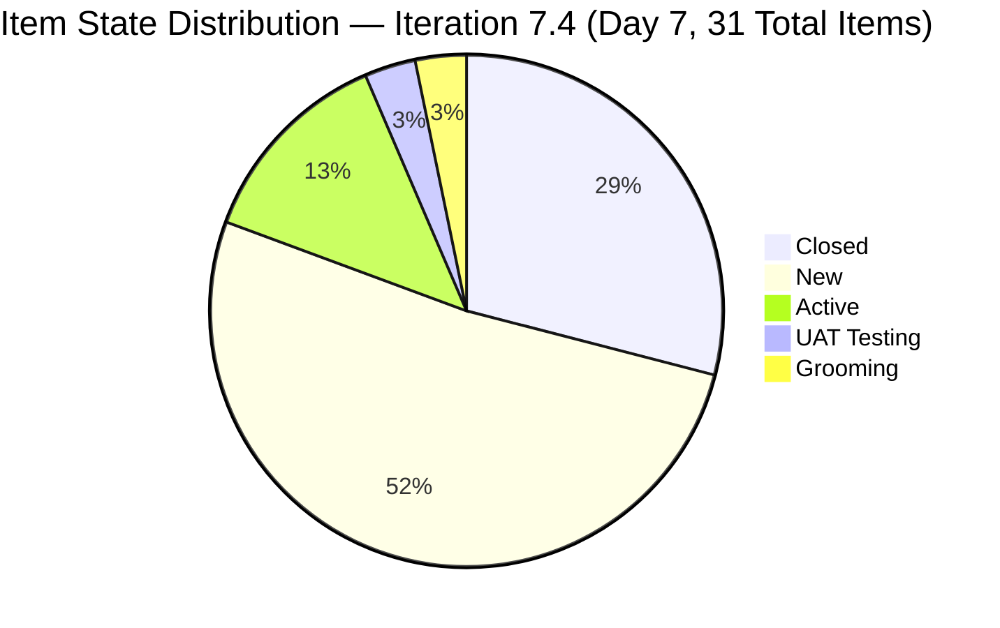
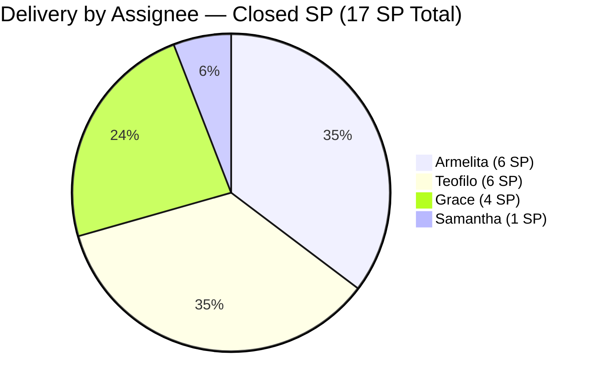
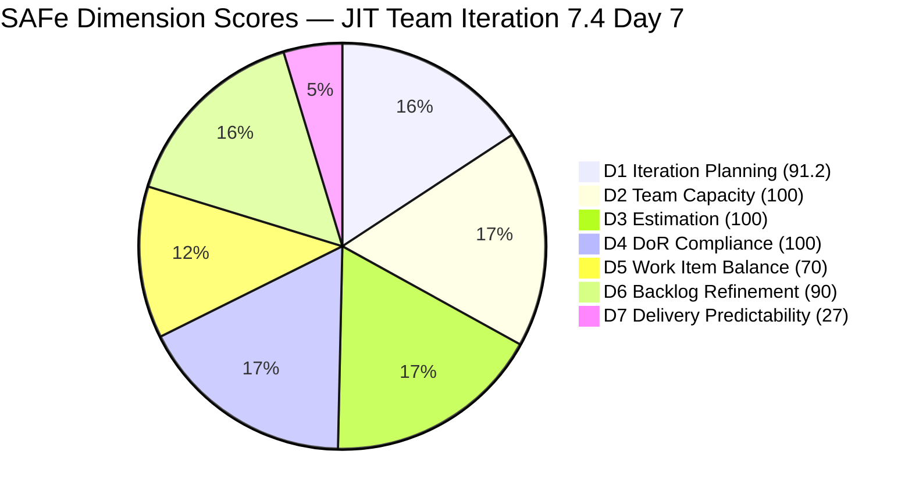

# JIT Operation Team — SAFe Iteration Audit #70

**Audit Date:** 2026-05-24 09:04 PHT
**Auditor:** Claude Code (SAFe PM Consultant)
**Workspace:** `ado_jit`
**ADO Board:** [JIT Operation Team](https://dev.azure.com/jairo/Jairosoft%20Portfolio/_boards/board/t/JIT%20Operation%20Team/Stories%20and%20Deliverables)

---

## 1. Audit Metadata

| Field | Value |
|-------|-------|
| Audit Number | #70 |
| Audit Date | 2026-05-24 |
| Audit Time | 09:04 PHT |
| Iteration | 7.4 |
| Iteration Dates | May 18 – May 31, 2026 |
| Sprint Day | Day 7 of 14 |
| ADO Project | Jairosoft Portfolio (`666bb99a-6acd-4999-bb34-efd0e4ea90dc`) |
| ADO Team | JIT Operation Team (`b25e3129-6272-4e54-a3ff-f1ef3c8eeb2c`) |
| Iteration ID | `16385d00-244a-4caa-9e56-d4a8e850754d` |
| Prior Audit | AUDIT_20260523_0900.md (Score: 75.0 — Moderate Risk) |
| **Overall Score** | **82.6 / 100** |
| **Risk Band** | **Low Risk** |

---

## 2. Executive Summary

Iteration 7.4, **Day 7 of 14**. Today's audit delivers the most significant positive swing of the sprint: **9 items closed totaling 17 SP** — all confirmed as of May 22. The JIT Operation Team has broken through to **Low Risk** for the first time in this iteration, with an overall score of **82.6 / 100**, up from 75.0 yesterday.

The closures span all four team members: Armelita (4 closures: UM Matina intern demo, HCDC intern demo, EBET T2 Bubble Trainer, EBET MOA TESDA submission), Teofilo (2 closures: Server Security Training 4.1-1 and Tools & Equipment Training 4.1-2), Grace (2 closures: SEC document digitization and portal submission), and Samantha (1 closure: ADDU Intern Onboarding). D7 jumps from 0.0 to **27.0** — a massive inflection point.

D1 also surges to **91.2** as closed items shift the math: the iteration now contains 31 of 34 visible root items (including the 9 closed ones), reflecting deep sprint commitment. The sprint is tracking well. With 17/63 SP delivered at Day 7, the team needs 46 more SP from the remaining 22 open items across 7 days — an achievable target given 17.8 pts/day team capacity.

**Overall Score: 82.6 / 100 — Low Risk**

---

## 3. Previous Audit Delta

| Metric | 2026-05-23 (Audit #69) | 2026-05-24 (Audit #70) | Change |
|--------|------------------------|------------------------|--------|
| Sprint Day | Day 6 | Day 7 | +1 |
| Visible Backlog Items | 34 | 34 | 0 |
| Items in Iter 7.4 (total, incl. closed) | 22 | **31** | **+9** |
| Items Closed | 0 | **9** | **+9** |
| SP Closed | 0 | **17 SP** | **+17** |
| SP Committed (incl. closed items) | 48 SP | **63 SP** | **+15** |
| Items UAT Testing | 1 (#204273) | 1 (#204273) | 0 |
| D1 — Iteration Planning | 64.7 | **91.2** | **+26.5** |
| D7 — Delivery Predictability | 0.0 | **27.0** | **+27.0** |
| Overall Score | 75.0 | **82.6** | **+7.6** |
| Risk Band | Moderate Risk | **Low Risk** | **↑ Improved** |

### Notable Changes (Day 7)

**9 items confirmed closed since last audit (all closed May 19–22):**

| ID | Title | Assignee | SP | Closed Date |
|----|-------|----------|----|-------------|
| 200767 | UM Matina CPE Intern Final Demo and Awarding | Armelita | 2 | May 22 |
| 200768 | HCDC Interns Final Demo and Awarding | Armelita | 2 | May 22 |
| 203805 | 4.1-1 Server Security and Reporting (Training) | Teofilo | 3 | May 20 |
| 203806 | 4.1-2 Tools, Equipment and Testing Devices (Training) | Teofilo | 3 | May 22 |
| 203989 | Jairosoft x JIT MOA TESDA Submission | Armelita | 1 | May 19 |
| 204428 | Digitization & QA of Notarized SEC Documents | Grace | 2 | May 20 |
| 204431 | Portal Submission & Fee Payment | Grace | 2 | May 20 |
| 204501 | EBET T2 Bubble Trainer | Armelita | 1 | May 19 |
| 204732 | ADDU Intern Onboarding | Samantha | 1 | May 22 |

**Additionally:** #204273 (Prepare Bubble102/103 Training Materials, Samantha, 2 SP) remains in **UAT Testing** — closure expected imminently. #203806 disappearance from yesterday's backlog is now explained: it was closed on May 22 and dropped from the open backlog view.

---

## 4. Current Iteration Snapshot

**Iteration 7.4** · May 18 – May 31, 2026 · **Day 7 of 14 (Sprint Midpoint)**

| Field | Value |
|-------|-------|
| Total Visible Root Backlog Items | 34 (open items in team backlog) |
| Items in Iteration 7.4 (total) | 31 (22 open + 9 closed) |
| Items Closed | **9** (17 SP) |
| Items UAT Testing | 1 (#204273 — imminent closure) |
| Items Active | 4 (#203595, #203986, #204521, #204562) |
| Items Grooming | 1 (#204338) |
| Items New | 16 |
| Total SP Committed (Iter 7.4) | **63 SP** |
| SP Burned | **17 SP** |
| % Complete (Items) | 9/31 = 29.0% |
| % Complete (SP) | 17/63 = 27.0% |
| Remaining Open Items | 22 |
| Remaining SP | 46 SP |
| Days Remaining | 7 working days |
| Item Types (open in 7.4) | User Story: 14, Training: 7, Spike: 1 |

### Capacity (Iteration 7.4)

| Member | Activity | Pts/Day | Days Off | SP Delivered |
|--------|----------|---------|----------|-------------|
| Teofilo Limpag | Training | 4.8 | May 18 (1 day) | 6 SP (2 Training items) |
| armelita | Documentation | 6.0 | None | 6 SP (4 items) |
| Samantha Babael | Documentation | 6.0 | None | 1 SP (1 item) |
| grace | Documentation | 1.0 | None | 4 SP (2 items) |
| **Team Total** | | **17.8 pts/day** | 1 day | **17 SP total** |

**Committed vs. Remaining:** 46 SP remaining / (17.8 × 7 days ≈ 124.6 SP available) = 37% utilization rate in second half. Delivery pace is achievable.

---

## 5. Work Item Analysis

### Closed Items in Iteration 7.4 (9 items, 17 SP)

| ID | Title | Type | Assignee | SP | Closed |
|----|-------|------|----------|----|--------|
| 200767 | UM Matina CPE Intern Final Demo | User Story | Armelita | 2 | May 22 |
| 200768 | HCDC Interns Final Demo | User Story | Armelita | 2 | May 22 |
| 203805 | 4.1-1 Server Security and Reporting | Training | Teofilo | 3 | May 20 |
| 203806 | 4.1-2 Tools, Equipment and Testing Devices | Training | Teofilo | 3 | May 22 |
| 203989 | Jairosoft x JIT MOA TESDA Submission | User Story | Armelita | 1 | May 19 |
| 204428 | Digitization & QA of Notarized SEC Documents | User Story | Grace | 2 | May 20 |
| 204431 | Portal Submission & Fee Payment | User Story | Grace | 2 | May 20 |
| 204501 | EBET T2 Bubble Trainer | User Story | Armelita | 1 | May 19 |
| 204732 | ADDU Intern Onboarding | User Story | Samantha | 1 | May 22 |

### Open Items in Iteration 7.4 (22 items)

| ID | Title | Type | State | SP | Assignee | Last Changed |
|----|-------|------|-------|-----|----------|-------------|
| 203243 | IT7.4 Tech Talk - AI Tools Demonstration | Spike | New | 2 | Armelita | May 6 |
| 203595 | JIT Finance Collection Policy | User Story | Active | 2 | Grace | May 18 |
| 203807 | 4.1-3 Personal Computer System & Spec | Training | New | 3 | Teofilo | May 6 |
| 203808 | 4.1-4 OHS Procedures | Training | New | 3 | Teofilo | May 4 |
| 203809 | 4.1-5 Network Maintenance Task | Training | New | 3 | Teofilo | May 4 |
| 203986 | Set-up Eingress for Scholars' Biometrics | User Story | Active | 1 | Armelita | May 22 |
| 204273 | Prepare Bubble102/103 Training Materials | User Story | UAT Testing | 2 | Samantha | May 22 |
| 204338 | Bubble TESDA Training | User Story | Grooming | 3 | Samantha | May 18 |
| 204435 | Archive Proof of Filing for TESDA | User Story | New | 2 | Grace | May 18 |
| 204440 | Package SAFe Micro-credential Dossier | User Story | New | 2 | Grace | May 18 |
| 204447 | Monitor and Log Daily Payment Collections | User Story | New | 2 | Grace | May 18 |
| 204508 | Enrollment Report with Additional Student | User Story | New | 1 | Armelita | May 18 |
| 204521 | Induction Training Program | User Story | Active | 2 | Armelita | May 18 |
| 204532 | Review EBET AOU for Implementation | User Story | New | 2 | Armelita | May 18 |
| 204562 | EBET Training Scholarship Preparation | User Story | Active | 2 | Armelita | May 21 |
| 204567 | Bubble TESDA Scholarship Training Proper | User Story | New | 2 | Armelita | May 18 |
| 204572 | Report Submission | User Story | New | 2 | Armelita | May 18 |
| 204576 | JIT Marketing/Processing Officer | User Story | New | 2 | Armelita | May 18 |
| 204614 | 1.5-2 Conduct Test on Installed Computer | Training | New | 2 | Teofilo | May 19 |
| 204615 | 1.5-3 Document Testing / Accomplishment Report | Training | New | 2 | Teofilo | May 19 |
| 204616 | 2.1-1 Network Design Training | Training | New | 2 | Teofilo | May 19 |
| 204617 | 2.1-2 Network Materials Training | Training | New | 2 | Teofilo | May 19 |

### Assignment Distribution (All 31 items in Iter 7.4)

| Assignee | Items | SP | % Items | SP Closed |
|----------|-------|-----|---------|-----------|
| Armelita | 13 | 25 SP | 41.9% | 6 SP (4 items) |
| Teofilo | 9 | 24 SP | 29.0% | 6 SP (2 items) |
| Grace | 6 | 12 SP | 19.4% | 4 SP (2 items) |
| Samantha | 3 | 6 SP | 9.7% | 1 SP (1 item) |

All 4 contributors have delivered at least 1 item. Armelita remains the highest-concentration contributor but the delivery spread is healthier than previous sprints.

### Untouched Items (ChangedDate before sprint start May 18)

| ID | Title | Last Changed | Type |
|----|-------|-------------|------|
| 203243 | IT7.4 Tech Talk - AI Tools Demo | May 6 | Spike |
| 203807 | 4.1-3 Personal Computer System | May 6 | Training |
| 203808 | 4.1-4 OHS Procedures | May 4 | Training |
| 203809 | 4.1-5 Network Maintenance Task | May 4 | Training |

4 of 31 = 12.9% untouched → above 10%, below 30% → −10 penalty persists.

---

## 6. SAFe Compliance Scorecard

| Dimension | Score | Evidence | Notes |
|-----------|-------|----------|-------|
| D1 — Iteration Planning | 91.2 | 31 / 34 visible root items in Iter 7.4 | Massive improvement; 9 closed items now included in 7.4 count |
| D2 — Team Capacity | 100.0 | 4/4 contributors with work and capacity | Armelita 6.0, Samantha 6.0, Teofilo 4.8, Grace 1.0 pts/day |
| D3 — Estimation | 100.0 | 31/31 items have SP > 0 | Total 63 SP across all 31 items |
| D4 — DoR Compliance | 100.0 | 31/31 pass description ≥30 chars + AC ≥20 chars | All item types (User Story, Training, Spike) meet DoR |
| D5 — Work Item Balance | 70.0 | User Story present (+); 21/31 = 67.7% > 60% (−30) | Training = 9 items (29.0%); Spike = 1 (3.2%) — no other penalties |
| D6 — Backlog Refinement | 90.0 | 34/34 fresh (base 100); 4/31 untouched = 12.9% (>10% → −10) | No stale-90 or stale-180 items |
| D7 — Delivery Predictability | 27.0 | 17 / 63 SP closed | 9 items closed; #204273 in UAT Testing (imminent) |

**Overall Score: (91.2 + 100 + 100 + 100 + 70 + 90 + 27.0) / 7 = 578.2 / 7 = 82.6 / 100 — Low Risk**

---

## 7. Dimension Findings

### D1 — Iteration Planning (91.2) ✅
The D1 score has jumped from a persistent 64–65 range to 91.2 — the highest in the audit series. The driver is the 9 newly confirmed closed items (previously off the backlog view but counted in the iteration): with 31 of 34 visible root items now in Iteration 7.4, the team has achieved near-complete sprint commitment. The 3 items not in 7.4 are: 200766 (ODOO Spike in PI8 root), 203244 and 203245 (future Tech Talk Spikes in 7.5), plus additional 7.5/future items in the backlog — consistent with the team's forward-staging pattern.

### D2 — Team Capacity (100.0) ✅
All four contributors have both assigned work and confirmed capacity. Notably, all four have now delivered at least one closed item, confirming capacity is being utilized. Team total: 17.8 pts/day — more than sufficient for the remaining 46 SP in 7 days.

### D3 — Estimation (100.0) ✅
All 31 items have Story Points. Training items (Teofilo) are consistently sized at 2–3 SP. User Stories range from 1–3 SP. Estimation discipline holds across all work types including the newly revealed closed items.

### D4 — DoR Compliance (100.0) ✅
All 31 items — including the 9 newly confirmed closed items — pass DoR thresholds. The closed items had substantive descriptions and acceptance criteria (verified in batch fetch). The team's DoR discipline is the most consistent dimension in the audit series.

### D5 — Work Item Balance (70.0) ⚠️
With 9 closed items added, the total pool is 31 items: 21 User Stories (67.7%) + 9 Training + 1 Spike. User Story share still exceeds 60% (−30 penalty). The Training items represent the team's core TESDA CSS NC II curriculum delivery and are appropriately typed. This is a rubric boundary effect: the team's legitimate work mix naturally falls just above the 60% User Story threshold. Reducing the ratio below 60% would require either converting 2–3 User Stories to other types or adding more non-User-Story items.

### D6 — Backlog Refinement (90.0) ✅
All 34 open backlog items were changed within 45 days. The −10 penalty comes from 4 items (203243, 203807, 203808, 203809) last touched in early May — these pre-staged Training and Spike items were not updated during sprint kickoff. Updating these items (even a state transition to Active) would eliminate the penalty and bring D6 to 100 (lifting overall to 83.4).

### D7 — Delivery Predictability (27.0) ✅
**Breakthrough.** D7 moves from 0 to 27.0 — the first positive delivery reading this sprint. Nine items totaling 17 SP are confirmed closed. The delivery pattern shows:
- **Early closures (May 19):** 2 items (MOA submission, EBET T2 Trainer) — lightweight compliance tasks
- **Mid-sprint closures (May 20):** 3 items (Server Security Training, SEC doc digitization, portal submission) — training and compliance deliverables
- **Late-Day-6 closures (May 22):** 4 items (UM Matina intern demo, HCDC intern demo, Tools & Equipment Training, ADDU intern onboarding) — event completions and training modules

With #204273 (2 SP) in UAT Testing, D7 would reach 19/63 = 30.2% (overall = 83.0) when it closes. The remaining challenge is delivering the 11 Armelita/Teofilo items still in New state.

---

## 8. Risks and Bottlenecks

| Risk | Severity | Status |
|------|----------|--------|
| 16 items still in New state | **High** | Armelita has 8 New items; Teofilo has 5 New Training items — need activation |
| No iteration goal defined | High | Recurring — unresolved across entire sprint series |
| Armelita concentration (13/31 items, 25 SP) | Moderate | Remains highest-concentration contributor despite 4 closures |
| 4 pre-sprint items untouched (D6 −10 penalty) | Moderate | Activate 203807/808/809/243243 to eliminate penalty |
| #204273 in UAT Testing since May 22 | Moderate | 2 days in UAT — closure expected but not yet confirmed |
| #203250 carryover from Iter 7.3 (not in backlog) | Low | Not visible in current backlog; likely removed or resolved |
| Teofilo's remaining 5 Training items all in New state | Moderate | No TESDA curriculum training items active in second half |
| Sprint utilization: 17/63 SP at midpoint (27%) | Moderate | Second half requires 46 SP in 7 days — achievable but needs acceleration |

---

## 9. Prioritized Recommendations

1. **Close #204273 today (Day 7)** — This item (Bubble102/103 Training Materials, Samantha, 2 SP) has been in UAT Testing since May 22. Move it to Closed immediately to register D7 = 30.2% and lift the overall score to 83.0.

2. **Activate Teofilo's 5 remaining Training items** — Items 203807, 203808, 203809, 204614, 204615, 204616, 204617 are all in New state. Teofilo has delivered 6 SP (2 Training items) this sprint. Activating the remaining TESDA curriculum modules signals delivery momentum and resolves the D6 untouched penalty for 203807/808/809.

3. **Activate Armelita's 8 New items** — Key items: 204508 (Enrollment Report), 204532 (EBET AOU Review), 204567 (Bubble TESDA Training Proper), 204572 (Report Submission), 204576 (JIT Marketing Officer). Moving these to Active acknowledges sprint commitment and triggers the daily update discipline.

4. **Define an iteration goal** — The JIT team is executing strongly (9 closures at midpoint) but still lacks a formal sprint goal. A single-sentence goal (e.g., "Deliver TESDA accreditation compliance package, launch EBET scholarship training, and complete intern demo cycles") would codify intent and resolve this recurring gap.

5. **Sequence second-half delivery for D7 maximization** — With 46 SP remaining and 7 days:
   - Samantha: Close #204273 (2 SP UAT Testing) + deliver #204338 (3 SP Grooming) this week
   - Grace: Advance #204435 (2 SP), #204440 (2 SP), #204447 (2 SP) — all in New
   - Armelita: Focus on #204521 (Active 2 SP) + compliance tasks
   - Teofilo: Activate and close #204614/#204615 (2 SP each) as the next CSS NC II modules

6. **Update #203986 (Eingress Biometrics)** — This Active item (Armelita, 1 SP) has been Active since May 22. It requires Engineering team coordination. If blocked, note the blocker in ADO so it can be de-risked.

---

## 10. Evidence Gaps and Limitations

| Gap | Impact | Notes |
|-----|--------|-------|
| No iteration goal visible in ADO | D1 quality context missing | Recurring gap |
| 9 closed items were absent from yesterday's backlog view | Yesterday's D7 understated | Confirmed closed today; D7 correctly computed at 27.0 |
| #203806 disappearance explained | Resolved | Item is confirmed Closed (May 22, 3 SP by Teofilo) |
| #203250 carryover (Iter 7.3) | Not in backlog | Not visible in current API responses; appears resolved |
| UAT Testing (#204273) not yet Closed | D7 marginally understated | 2 SP pending closure — counted as in-progress, not delivered |

---

## Visualization

### SAFe Dimension Score Summary

| Dimension | Score | Band | Change vs. Prior |
|-----------|-------|------|-----------------|
| D1 — Iteration Planning | 91.2 | Low | **+26.5** |
| D2 — Team Capacity | 100.0 | Low | — |
| D3 — Estimation | 100.0 | Low | — |
| D4 — DoR Compliance | 100.0 | Low | — |
| D5 — Work Item Balance | 70.0 | Moderate | — |
| D6 — Backlog Refinement | 90.0 | Low | — |
| D7 — Delivery Predictability | 27.0 | High | **+27.0** |
| **Overall** | **82.6** | **Low Risk** | **+7.6** |

### Score Trend (Last 7 Audits)

| Date | Audit | Score | Band |
|------|-------|-------|------|
| May 18 | #63 | 75.5 | Moderate |
| May 19 | #64 | 75.8 | Moderate |
| May 20 | #65 | 75.8 | Moderate |
| May 21 | #66 | 75.5 | Moderate |
| May 22 | #68 | 75.1 | Moderate |
| May 23 | #69 | 75.0 | Moderate |
| **May 24** | **#70** | **82.6** | **Low Risk** |

The team has broken through the Moderate/Low boundary for the first time this sprint. The jump from 75.0 to 82.6 is driven entirely by the 9 confirmed closures (+17 SP) and the D1 surge from 64.7 to 91.2. If #204273 closes today, the score reaches 83.0. Sustaining this momentum through the second half requires activating the remaining 16 New items and delivering 46 more SP.

---

*Audit generated by Claude Code (claude-sonnet-4-6) on 2026-05-24. Evidence sourced from Azure DevOps MCP (Jairosoft Portfolio project). Rubric: SAFe 6.0 7-dimension scorecard.*
