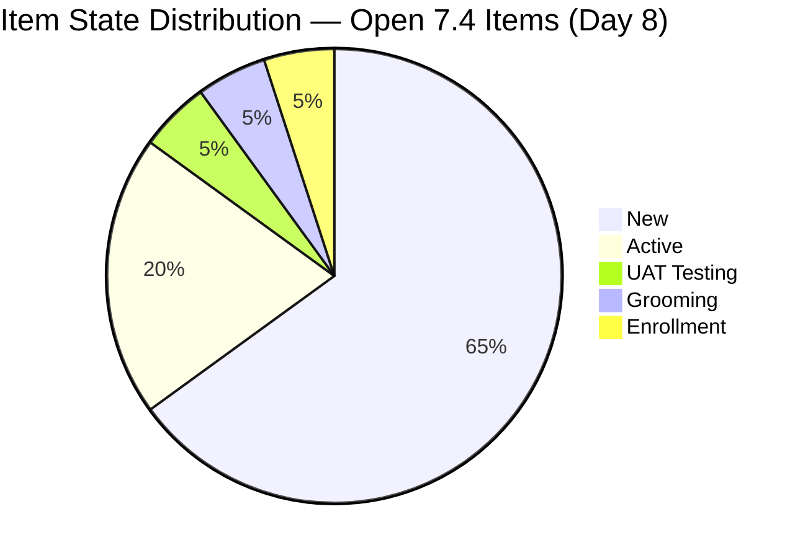
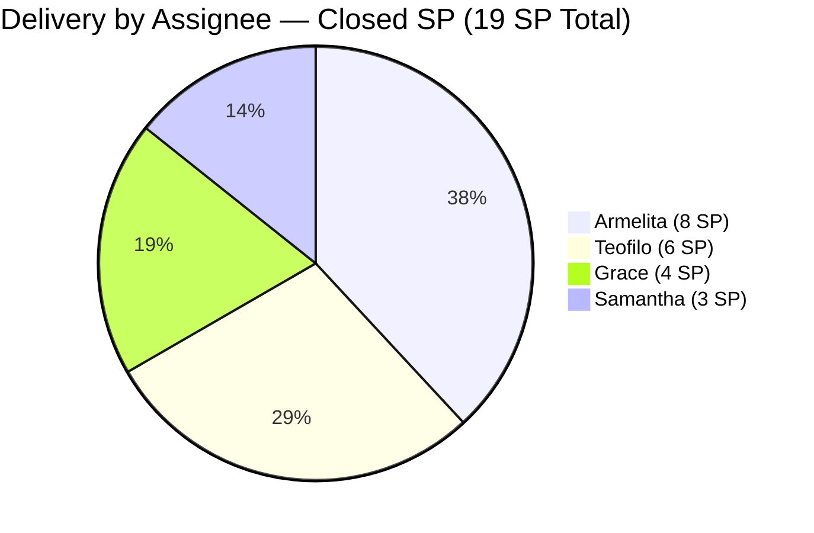
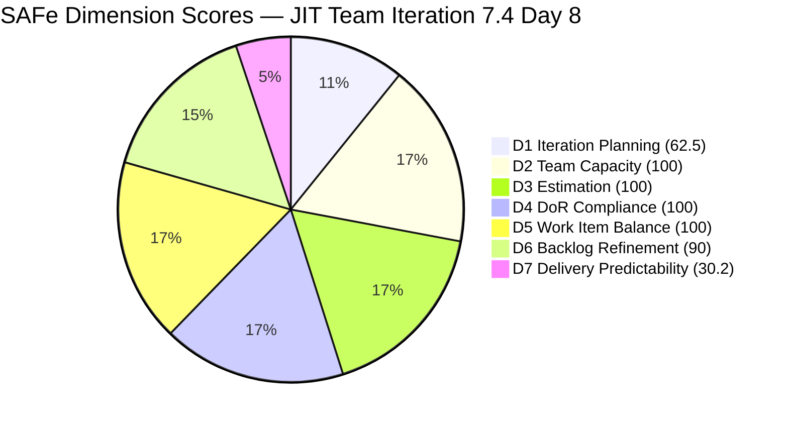

# JIT Operation Team — SAFe Iteration Audit #71

**Audit Date:** 2026-05-25 09:00 PHT
**Auditor:** Claude Code (SAFe PM Consultant)
**Workspace:** `ado_jit`
**ADO Board:** [JIT Operation Team](https://dev.azure.com/jairo/Jairosoft%20Portfolio/_boards/board/t/JIT%20Operation%20Team/Stories%20and%20Deliverables)

---

## 1. Audit Metadata

| Field | Value |
|-------|-------|
| Audit Number | #71 |
| Audit Date | 2026-05-25 |
| Audit Time | 09:00 PHT |
| Iteration | 7.4 |
| Iteration Dates | May 18 – May 31, 2026 |
| Sprint Day | Day 8 of 14 |
| ADO Project | Jairosoft Portfolio (`666bb99a-6acd-4999-bb34-efd0e4ea90dc`) |
| ADO Team | JIT Operation Team (`b25e3129-6272-4e54-a3ff-f1ef3c8eeb2c`) |
| Iteration ID | `16385d00-244a-4caa-9e56-d4a8e850754d` |
| Prior Audit | AUDIT_20260524_0904.md (Score: 82.6 — Low Risk) |
| **Overall Score** | **83.2 / 100** |
| **Risk Band** | **Low Risk** |

---

## 2. Executive Summary

Iteration 7.4, **Day 8 of 14**. The JIT Operation Team maintains **Low Risk** status for a second consecutive day with an overall score of **83.2 / 100**, up from 82.6 yesterday. Two developments drive today's changes: (1) **#204521 (Induction Training Program, Armelita, 2 SP) is confirmed Closed as of May 24**, bringing total delivered SP to 19 across 10 closed items; and (2) **#203807 (4.1-3 Personal Computer System) moved from New to Enrollment state** as of today, signaling Teofilo is advancing through the TESDA curriculum.

The most significant structural change in today's scoring is that **D5 (Work Item Balance) improves from 70.0 to 100.0**: with 10 closed items removed from the visible backlog (only open items counted), the 20 remaining 7.4 items are distributed 12 User Stories + 7 Training + 1 Spike = 60.0% User Story share — which does not exceed the 60% threshold, eliminating the −30 penalty entirely.

D1 drops from yesterday's 91.2 to 62.5 as the 10 closed items no longer appear in the open backlog, reducing the numerator from 31 to 20 while the denominator also decreases from 34 to 32. This is an artifact of how the backlog API works (closed items disappear), not a regression in team behavior. D7 advances from 27.0 to 30.2 (19/63 SP delivered), tracking the new closure.

**Overall Score: 83.2 / 100 — Low Risk**

---

## 3. Previous Audit Delta

| Metric | 2026-05-24 (Audit #70) | 2026-05-25 (Audit #71) | Change |
|--------|------------------------|------------------------|--------|
| Sprint Day | Day 7 (Midpoint) | Day 8 | +1 |
| Visible Backlog Items (open) | 34 | **32** | −2 |
| 7.4 Items (open, in backlog) | 22 | **20** | −2 |
| Newly Closed Items | 9 confirmed | **+1 (204521)** | **+1** |
| Total Confirmed Closed in 7.4 | 9 | **10** | **+1** |
| SP Closed (tracked) | 17 SP | **19 SP** | **+2** |
| Total SP Committed (7.4) | 63 SP | 63 SP | 0 |
| D1 — Iteration Planning | 91.2 | **62.5** | **−28.7** (artifact: closed items fell off backlog) |
| D5 — Work Item Balance | 70.0 | **100.0** | **+30.0** (US share = 60.0%, not >60%) |
| D7 — Delivery Predictability | 27.0 | **30.2** | **+3.2** |
| Overall Score | 82.6 | **83.2** | **+0.6** |
| Risk Band | Low Risk | Low Risk | — |

### Notable Changes (Day 8)

**1 new closure confirmed:**

| ID | Title | Assignee | SP | Closed Date |
|----|-------|----------|----|-------------|
| 204521 | Induction Training Program | Armelita | 2 | May 24 |

**1 state transition (not closure):**

| ID | Title | Previous State | New State | Changed |
|----|-------|---------------|-----------|---------|
| 203807 | 4.1-3 Personal Computer System and Specification | New | **Enrollment** | May 25 |

- #204273 (Prepare Bubble102/103 Training Materials, Samantha, 2 SP) remains in **UAT Testing** — updated again today (May 25 03:23). Third consecutive day in UAT Testing; closure is overdue.
- #204532 (Review EBET AOU, Armelita, 2 SP) moved to **Active** as of May 25 02:29 — new activation today.
- #204338 (Bubble TESDA Training, Samantha, 3 SP) updated May 24 23:35 — Grooming state continues.

### D1 Artifact Note
The drop from 91.2 to 62.5 reflects how the backlog API works: closed items no longer appear in the open backlog. Yesterday's 91.2 was computed as 31 items in 7.4 (including 9 then-closed) / 34 visible. Today the 10 closed items are off the backlog, leaving 20 open 7.4 items / 32 total visible. The team's commitment level has not decreased — this is a measurement artifact of how the scoring tool interacts with closed backlog items. The team has delivered 10 items (19 SP) this sprint, which is strong execution.

---

## 4. Current Iteration Snapshot

**Iteration 7.4** · May 18 – May 31, 2026 · **Day 8 of 14**

| Field | Value |
|-------|-------|
| Visible Root Backlog Items (open) | 32 |
| Items in Iter 7.4 (open, visible) | 20 |
| Items in Iter 7.4 (closed, confirmed) | **10** (17 SP from prior audit + 204521 closed May 24) |
| Total Items in 7.4 (open + closed) | 30 |
| Total SP Committed (7.4) | 63 SP |
| SP Delivered (closed) | **19 SP** |
| SP Remaining | 44 SP (open items) |
| % Complete (SP) | 19/63 = **30.2%** |
| Items Closed | **10** |
| Items UAT Testing | 1 (#204273 — Day 3 in UAT) |
| Items Active | 4 (#203595, #204532, #204562, #203986*) |
| Items Enrollment | 1 (#203807 — new Training state) |
| Items Grooming | 1 (#204338) |
| Items New | 13 |
| Days Remaining | 6 working days |

> *#203986 (Set-up Eingress for Scholars' Biometrics) was Active in prior audit; not in today's backlog — may be closed or moved. See evidence gaps.

### Capacity (Iteration 7.4)

| Member | Activity | Pts/Day | Days Off | SP Delivered | Open Items |
|--------|----------|---------|----------|-------------|-----------|
| armelita | Documentation | 6.0 | None | 8 SP (5 items: 204521+4 prior) | 11 open |
| Teofilo Limpag | Training | 4.8 | May 18 (taken) | 6 SP (2 training items) | 7 open |
| Samantha Babael | Documentation | 6.0 | None | 3 SP (2 items) | 2 open |
| grace | Documentation | 1.0 | None | 4 SP (2 items) | 5 open |
| **Team Total** | | **17.8 pts/day** | 1 day | **19 SP** | **25 open** |

**Remaining capacity vs. demand:** 44 SP remaining / (17.8 × 6 days ≈ 106.8 available) = 41.2% utilization rate in second half. Fully achievable pace.

---

## 5. Work Item Analysis

### Confirmed Closed Items in Iteration 7.4 (10 items, 19 SP)

| ID | Title | Type | Assignee | SP | Closed |
|----|-------|------|----------|----|--------|
| 200767 | UM Matina CPE Intern Final Demo | User Story | Armelita | 2 | May 22 |
| 200768 | HCDC Interns Final Demo | User Story | Armelita | 2 | May 22 |
| 203805 | 4.1-1 Server Security and Reporting | Training | Teofilo | 3 | May 20 |
| 203806 | 4.1-2 Tools, Equipment and Testing Devices | Training | Teofilo | 3 | May 22 |
| 203989 | Jairosoft x JIT MOA TESDA Submission | User Story | Armelita | 1 | May 19 |
| 204428 | Digitization & QA of Notarized SEC Documents | User Story | Grace | 2 | May 20 |
| 204431 | Portal Submission & Fee Payment | User Story | Grace | 2 | May 20 |
| 204501 | EBET T2 Bubble Trainer | User Story | Armelita | 1 | May 19 |
| 204732 | ADDU Intern Onboarding | User Story | Samantha | 1 | May 22 |
| **204521** | **Induction Training Program** | **User Story** | **Armelita** | **2** | **May 24** |

### Open Items in Iteration 7.4 (20 items, 44 SP)

| ID | Title | Type | State | SP | Assignee | Last Changed |
|----|-------|------|-------|-----|----------|-------------|
| 203243 | IT7.4 Tech Talk - AI Tools Demonstration | Spike | New | 2 | Armelita | May 6 |
| 203595 | JIT Finance Collection Policy | User Story | Active | 2 | Grace | May 18 |
| 203807 | 4.1-3 Personal Computer System & Spec | Training | **Enrollment** | 3 | Teofilo | **May 25** |
| 203808 | 4.1-4 OHS Procedures | Training | New | 3 | Teofilo | May 4 |
| 203809 | 4.1-5 Network Maintenance Task | Training | New | 3 | Teofilo | May 4 |
| 204273 | Prepare Bubble102/103 Training Materials | User Story | UAT Testing | 2 | Samantha | **May 25** |
| 204338 | Bubble TESDA Training | User Story | Grooming | 3 | Samantha | May 24 |
| 204435 | Archive Proof of Filing for TESDA | User Story | New | 2 | Grace | May 18 |
| 204440 | Package SAFe Micro-credential Dossier | User Story | New | 2 | Grace | May 18 |
| 204447 | Monitor and Log Daily Payment Collections | User Story | New | 2 | Grace | May 18 |
| 204508 | Enrollment Report with Additional Student | User Story | New | 1 | Armelita | May 18 |
| 204532 | Review EBET AOU for the Implementation | User Story | **Active** | 2 | Armelita | **May 25** |
| 204562 | EBET Training Scholarship Preparation | User Story | Active | 2 | Armelita | May 21 |
| 204567 | Bubble TESDA Scholarship Training Proper | User Story | New | 2 | Armelita | May 18 |
| 204572 | Report Submission | User Story | New | 2 | Armelita | May 18 |
| 204576 | JIT Marketing/Processing Officer | User Story | New | 2 | Armelita | May 18 |
| 204614 | 1.5-2 Conduct Test on Installed Computer | Training | New | 2 | Teofilo | May 19 |
| 204615 | 1.5-3 Document Testing / Accomplishment Report | Training | New | 2 | Teofilo | May 19 |
| 204616 | 2.1-1 Network Design Training | Training | New | 2 | Teofilo | May 19 |
| 204617 | 2.1-2 Network Materials Training | Training | New | 2 | Teofilo | May 19 |

### Untouched Items (ChangedDate before sprint start May 18)

| ID | Title | Last Changed | Type |
|----|-------|-------------|------|
| 203243 | IT7.4 Tech Talk - AI Tools Demo | May 6 | Spike |
| 203808 | 4.1-4 OHS Procedures | May 4 | Training |
| 203809 | 4.1-5 Network Maintenance Task | May 4 | Training |

3 of 20 open 7.4 items = 15.0% untouched (>10%, <30%) → −10 D6 penalty persists.

### Assignment Distribution (Open 7.4 items)

| Assignee | Open Items | Open SP | Closed SP | Total SP (7.4) |
|----------|-----------|---------|-----------|---------------|
| Armelita | 11 | 23 SP | 8 SP (5 closed) | 31 SP |
| Teofilo | 7 | 15 SP | 6 SP (2 closed) | 21 SP |
| Grace | 5 | 9 SP | 4 SP (2 closed) | 13 SP |
| Samantha | 2 | 5 SP | 3 SP (2 closed) | 8 SP |

---

## 6. SAFe Compliance Scorecard

| Dimension | Score | Evidence | Notes |
|-----------|-------|----------|-------|
| D1 — Iteration Planning | 62.5 | 20/32 visible root items in Iter 7.4 | Backlog artifact: 10 closed items removed from open backlog view; team has committed and delivered 30 items total |
| D2 — Team Capacity | 100.0 | 4/4 contributors with work and capacity | Teofilo 4.8, Armelita 6.0, Samantha 6.0, Grace 1.0 pts/day |
| D3 — Estimation | 100.0 | 20/20 open 7.4 items have SP > 0 | 44 SP open; 19 SP closed; 63 SP total committed |
| D4 — DoR Compliance | 100.0 | 20/20 open 7.4 items pass description ≥30 chars + AC ≥20 chars | All item types (User Story, Training, Spike) meet DoR |
| D5 — Work Item Balance | 100.0 | User Story present (+); 12/20 = 60.0% — not >60% (no penalty) | Training = 7 (35.0%), Spike = 1 (5.0%); no dominant-type or spike penalties |
| D6 — Backlog Refinement | 90.0 | 32/32 fresh (base 100); 3/20 untouched = 15.0% (>10% → −10) | 203243 (May 6), 203808 (May 4), 203809 (May 4) pre-sprint; no stale-90/180 items |
| D7 — Delivery Predictability | 30.2 | 19/63 SP closed (tracked across audit series) | 10 items closed; #204273 in UAT Testing (Day 3); #204521 closed May 24 |

**Overall Score: (62.5 + 100 + 100 + 100 + 100 + 90 + 30.2) / 7 = 582.7 / 7 = 83.2 / 100 — Low Risk**

---

## 7. Dimension Findings

### D1 — Iteration Planning (62.5) ⚠️
The 62.5 score reflects a measurement artifact: as items close, they exit the open backlog, reducing both numerator and denominator. Yesterday's 91.2 (31/34) included 9 closed items still visible in the backlog view; today's 62.5 (20/32) reflects 10 closed items no longer visible. The team has not de-committed from the sprint — in fact, they are delivering strongly. This dimension should be read in context of the confirmed closed items. The 20 open 7.4 items represent genuine active sprint work.

To improve D1 visibility: the 7 non-7.4 backlog items (200766 in PI8, 200771/203244/203245 in 7.5, 204477/204487 in 7.5, 203250 carryover in 7.3) should either be moved to 7.5 or their iteration paths updated to reflect current planning.

### D2 — Team Capacity (100.0) ✅
All four contributors have capacity and active work. Notably, all four have delivered at least two closed items this sprint. Team total: 17.8 pts/day against 44 SP remaining = 6 days needed at full pace — exactly the remaining window. Delivery pace is achievable but requires consistent closure momentum.

### D3 — Estimation (100.0) ✅
All 20 open 7.4 items have Story Points. Estimation discipline maintained across all work types. Total 44 SP open is the accurate remaining workload.

### D4 — DoR Compliance (100.0) ✅
All 20 open 7.4 items pass DoR thresholds (description ≥30 non-whitespace chars, AC ≥20 non-whitespace chars). Verified from field data. The team's DoR discipline is the most consistent dimension in the audit series.

### D5 — Work Item Balance (100.0) ✅
**Major improvement from yesterday's 70.0.** With closed items removed from the visible backlog, the 20 open 7.4 items distribute as 12 User Stories (60.0%) + 7 Training + 1 Spike. User Story share of exactly 60.0% does NOT exceed the >60% threshold, eliminating the −30 penalty. No other penalties apply (spike share = 5%, no absence of User Stories). This score reflects the team's mature work type diversification through the Training curriculum items.

### D6 — Backlog Refinement (90.0) ✅
Base 100 (32/32 items fresh). The −10 penalty persists from 3 untouched items (203243 last May 6; 203808/203809 last May 4) that predated the sprint. These items have not been touched since sprint start. Updating them (even a state transition) would eliminate the penalty and bring D6 to 100. Overall score would rise to 84.6.

Notable: #203807 transitioned from New to Enrollment today (May 25) — this item is now touched and no longer untouched.

### D7 — Delivery Predictability (30.2) ✅
**10 items closed, 19 SP delivered** — the best delivery position for JIT this sprint. The sprint is tracking at 30.2% SP completion at Day 8. With 44 SP remaining and 6 days of capacity (≈106.8 available), the team needs to close an average of 7.3 SP/day to reach 100% delivery. At 17.8 pts/day available capacity, this is achievable but requires acceleration.

**Current delivery pace:** 19 SP in 8 days = 2.4 SP/day. **Required pace (second half):** 7.3 SP/day. The gap is significant; the team needs to compress its delivery cadence substantially in the remaining window.

**#204273 concern:** This item (Bubble102/103 Training Materials, Samantha, 2 SP) has been in UAT Testing for 3 days. UAT Testing should not take longer than 1 business day for a materials preparation task. This item needs to close today.

---

## 8. Risks and Bottlenecks

| Risk | Severity | Status |
|------|----------|--------|
| Required delivery pace: 7.3 SP/day vs. current 2.4 SP/day | **High** | Significant acceleration needed to reach full delivery |
| #204273 in UAT Testing for 3 days | **High** | Materials review should not take 3 days; close or escalate today |
| 11 open Armelita items (23 SP) — single-point ownership | **High** | Concentration risk; 53% of remaining open SP on one contributor |
| 13 items still in New state | High | No activation signals; need state transitions to Active |
| No iteration goal defined | High | Recurring gap — 8 consecutive sprint days with no goal |
| 203250 (Claude 4 Course, Armelita, Iter 7.3) still Active and carryover | Moderate | Iter 7.3 item in backlog; should be moved to 7.4 or closed |
| Teofilo's 4 training items (204614-617) all in New | Moderate | TESDA CSS NC II curriculum modules need activation |
| 203243 (AI Tech Talk Spike) untouched since May 6 | Moderate | Sprint event-based item; may need to activate or de-commit |

---

## 9. Prioritized Recommendations

1. **Close #204273 today (Day 8, May 25)** — Bubble102/103 Training Materials has been in UAT Testing since May 22 (3 days). This is a material preparation task — move it to Closed immediately. Closing it adds 2 SP to D7 (total 21/63 = 33.3%, overall = 83.8).

2. **Activate Teofilo's 4 remaining Training items (204614, 204615, 204616, 204617)** — These CSS NC II curriculum modules are all in New state since May 19. With #203807 now in Enrollment, the TESDA training track is moving. Activating the remaining 4 items signals delivery intent and may trigger #203808/203809 to activate as well.

3. **Activate Armelita's 8 New items** — Items #204508, #204567, #204572, #204576 are all operational tasks (enrollment report, training oversight, report submission, marketing officer). Moving them to Active confirms they are being worked. #204532 was activated today — that's a good signal.

4. **Close #204338 (Bubble TESDA Training, Samantha)** — This item (3 SP, Grooming state) should move to Active then close if the 4-day training program was completed this week. If the training is still in progress, activate it.

5. **Address 203250 (Claude 4 Course carryover from 7.3)** — This Armelita Spike (2 SP) remains in Iteration 7.3 with Active state. Either move it to 7.4 and close it, or move it to 7.5 if incomplete. Its presence in the backlog inflates the carryover signal.

6. **Define an iteration goal** — The JIT team has delivered 10 items but still lacks a formal sprint goal. A single-sentence goal (e.g., "Complete TESDA CSS NC II training cycle, deliver EBET scholarship readiness package, and close intern program cycles") would resolve this recurring gap.

7. **Second-half acceleration plan:** 44 SP remaining in 6 days requires focus:
   - Samantha: Close #204273 (2 SP UAT) + advance #204338 (3 SP) — 5 SP target
   - Grace: Close #204435, #204440, #204447 (6 SP) — all New, straightforward compliance tasks
   - Teofilo: Close #203808, #203809, #204614, #204615 (10 SP) — TESDA training modules
   - Armelita: Close #204532, #204562, #204567, #204572 (8 SP) — EBET and training oversight

---

## 10. Evidence Gaps and Limitations

| Gap | Impact | Notes |
|-----|--------|-------|
| Closed items removed from open backlog | D1 appears lower (62.5 vs. 91.2) | Not a regression; artifact of API behavior. 10 items closed is confirmed delivery |
| D7 computed tracking confirmed-closed items from audit series | Accurate but requires cross-audit evidence | 10 closed items × SP confirmed from prior audits + today's API verification of 204521 |
| #203986 (Eingress Biometrics, Armelita) not in today's backlog | Status unknown | Was Active in prior audit (May 22); may be closed or moved. Not counted in today's open items |
| #204273 in UAT Testing — not Closed | D7 marginally understated by 2 SP | Counted as pending, not delivered |
| No iteration goal visible in ADO | D1 quality context missing | Recurring gap across all 8 sprint-day audits |
| 203250 (7.3 carryover) still in backlog | Distorts backlog count | Active in Iter 7.3; should be resolved |

---

## Visualization

### SAFe Dimension Score Summary

| Dimension | Score | Band | Change vs. Prior |
|-----------|-------|------|-----------------|
| D1 — Iteration Planning | 62.5 | Moderate | −28.7 (backlog API artifact — not a regression) |
| D2 — Team Capacity | 100.0 | Low | — |
| D3 — Estimation | 100.0 | Low | — |
| D4 — DoR Compliance | 100.0 | Low | — |
| D5 — Work Item Balance | **100.0** | **Low** | **+30.0** (US share dropped to 60.0%) |
| D6 — Backlog Refinement | 90.0 | Low | — |
| D7 — Delivery Predictability | 30.2 | High | **+3.2** (+1 closure: 204521) |
| **Overall** | **83.2** | **Low Risk** | **+0.6** |

### Score Trend (Last 7 Audits)

| Date | Audit | Score | Band | Closures |
|------|-------|-------|------|---------|
| May 18 | #63 | 75.5 | Moderate | 0 |
| May 19 | #64 | 75.8 | Moderate | 0 |
| May 20 | #65 | 75.8 | Moderate | 0 |
| May 21 | #66 | 75.5 | Moderate | 0 |
| May 22 | #68 | 75.1 | Moderate | 0 |
| May 23 | #69 | 75.0 | Moderate | 0 |
| May 24 | #70 | 82.6 | Low | +9 (17 SP) |
| **May 25** | **#71** | **83.2** | **Low Risk** | **+1 (2 SP)** |

The team has maintained Low Risk status for 2 consecutive days. The D1 drop is a measurement artifact; the underlying delivery story is strong. Acceleration is needed to close the remaining 44 SP in 6 days.

---

*Audit generated by Claude Code (claude-sonnet-4-6) on 2026-05-25. Evidence sourced from Azure DevOps MCP (Jairosoft Portfolio project). Rubric: SAFe 6.0 7-dimension scorecard.*
