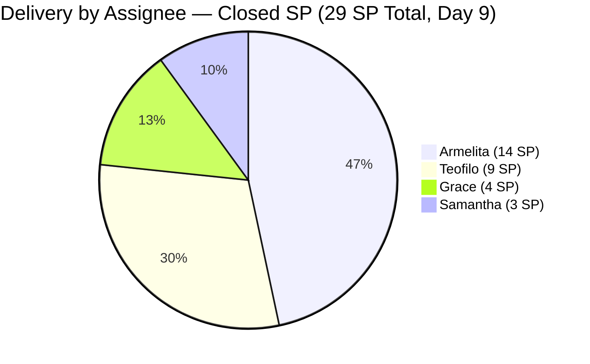
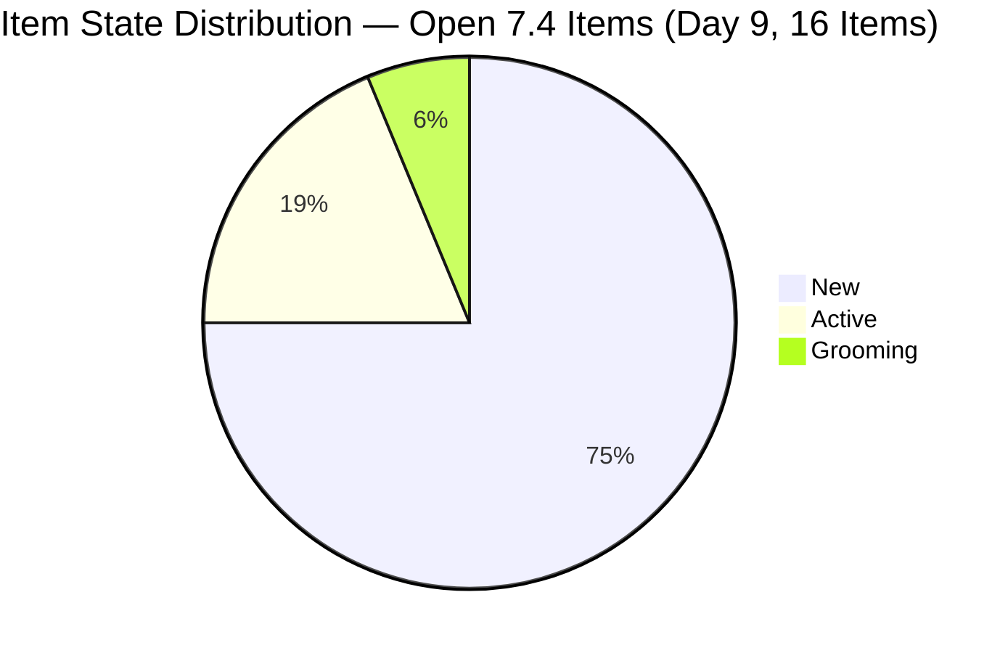
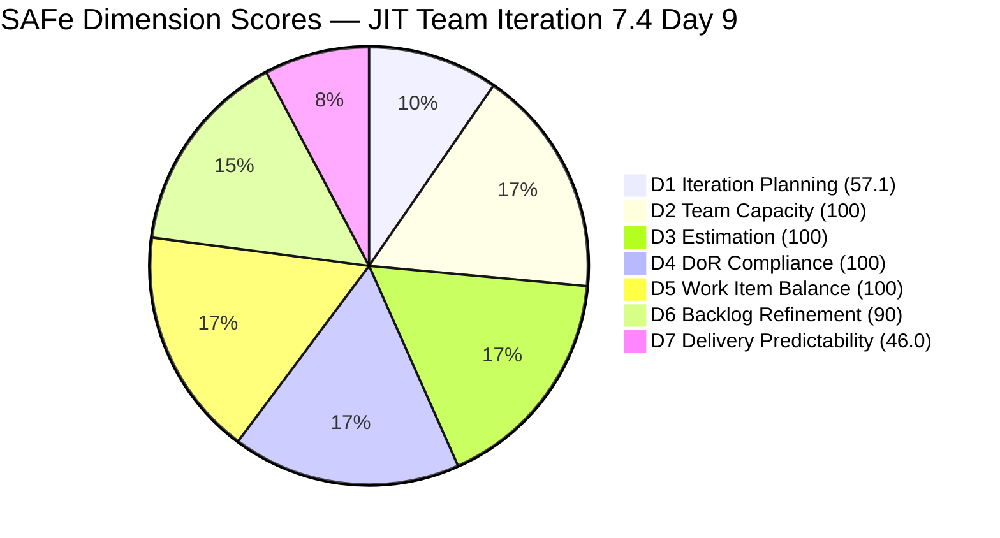

# JIT Operation Team — SAFe Iteration Audit #72

**Audit Date:** 2026-05-26 02:03 PHT
**Auditor:** Claude Code (SAFe PM Consultant)
**Workspace:** `ado_jit`
**ADO Board:** [JIT Operation Team](https://dev.azure.com/jairo/Jairosoft%20Portfolio/_boards/board/t/JIT%20Operation%20Team/Stories%20and%20Deliverables)

---

## 1. Audit Metadata

| Field | Value |
|-------|-------|
| Audit Number | #72 |
| Audit Date | 2026-05-26 |
| Audit Time | 02:03 PHT |
| Iteration | 7.4 |
| Iteration Dates | May 18 – May 31, 2026 |
| Sprint Day | Day 9 of 14 |
| ADO Project | Jairosoft Portfolio (`666bb99a-6acd-4999-bb34-efd0e4ea90dc`) |
| ADO Team | JIT Operation Team (`b25e3129-6272-4e54-a3ff-f1ef3c8eeb2c`) |
| Iteration ID | `16385d00-244a-4caa-9e56-d4a8e850754d` |
| Prior Audit | AUDIT_20260525_0900.md (Score: 83.2 — Low Risk) |
| **Overall Score** | **84.7 / 100** |
| **Risk Band** | **Low Risk** |

---

## 2. Executive Summary

Iteration 7.4, **Day 9 of 14**. The JIT Operation Team delivers a major burst of closures on Day 9: **5 additional items confirmed closed since yesterday's audit**, bringing the sprint total to **15 closed items and 29 SP delivered** (46.0% of 63 SP committed). The four closures on May 25 include: #203807 (4.1-3 Personal Computer System, Teofilo, 3 SP), #204273 (Prepare Bubble Training Materials, Samantha, 2 SP), #204532 (Review EBET AOU, Armelita, 2 SP), and #204562 (EBET Training Scholarship Preparation, Armelita, 2 SP). Additionally, #203986 (Eingress Biometrics, Armelita, 1 SP — closed May 24) is now confirmed in the API, having been a missing item in yesterday's audit.

D7 rises from 30.2 to **46.0** — the strongest single-day delivery improvement in the sprint. D2, D3, D4, D5 all remain at 100.0. D1 shifts from 62.5 to **57.1** (16 open 7.4 items / 28 visible backlog items) — continuing the closed-item artifact where delivered items exit the open backlog, displacing the numerator. D6 holds at **90.0** (3 of 16 open 7.4 items remain untouched from before sprint start).

The overall score improves from 83.2 to **84.7 / 100**, maintaining Low Risk for a third consecutive day. D1 continues declining as a measurement artifact (57.1 vs 62.5 yesterday), but the +15.8 surge in D7 more than offsets it. With 34 SP remaining and 5 days left, the team needs 6.8 SP/day against 17.8 pts/day capacity — demanding but achievable with continued momentum.

**Overall Score: 84.7 / 100 — Low Risk** *(D1 artifact: 57.1 understates commitment; delivery story is strong — 15 items, 29 SP)*

---

## 3. Previous Audit Delta

| Metric | 2026-05-25 (Audit #71) | 2026-05-26 (Audit #72) | Change |
|--------|------------------------|------------------------|--------|
| Sprint Day | Day 8 | Day 9 | +1 |
| Visible Backlog Items (open) | 32 | **28** | −4 |
| 7.4 Items (open, in backlog) | 20 | **16** | −4 |
| Newly Confirmed Closed | +1 (204521) | **+5** (203807, 204273, 204532, 204562, 203986) | **+5** |
| Total Confirmed Closed in 7.4 | 10 | **15** | **+5** |
| SP Closed (tracked) | 19 SP | **29 SP** | **+10** |
| Total SP Committed (7.4) | 63 SP | 63 SP | 0 |
| D1 — Iteration Planning | 62.5 | **57.1** | −5.4 (continuing closed-item artifact) |
| D5 — Work Item Balance | 100.0 | **100.0** | 0 (US share = 56.3%, still ≤60%) |
| D7 — Delivery Predictability | 30.2 | **46.0** | **+15.8** |
| Overall Score | 83.2 | **84.7** | **+1.5** (D7 +15.8 more than offsets D1 −5.4 artifact) |
| Risk Band | Low Risk | Low Risk | — |

### Notable Changes (Day 9 — May 25–26)

**5 new closures confirmed:**

| ID | Title | Assignee | SP | Closed |
|----|-------|----------|----|--------|
| 203807 | 4.1-3 Personal Computer System and Specification | Teofilo | 3 SP | May 25 13:55 |
| 204273 | Prepare Bubble102/103 Scholarship Training Materials | Samantha | 2 SP | May 25 13:33 |
| 204532 | Review EBET AOU for the Implementation | Armelita | 2 SP | May 25 13:33 |
| 204562 | EBET Training Scholarship Preparation | Armelita | 2 SP | May 25 13:33 |
| 203986 | Set-up Eingress for the Scholars' Biometrics | Armelita | 1 SP | May 24 13:27 (backfill) |

**2 state transitions (not closures):**

| ID | Title | State | Changed |
|----|-------|-------|---------|
| 204567 | Bubble TESDA Scholarship Training Proper | Active | May 26 00:14 |
| 204572 | Report Submission | Active | May 26 00:15 |

### D1 Artifact Note
Every closure removes an item from the open backlog, reducing the numerator (open 7.4 items) faster than the denominator (total visible backlog). Yesterday: 20/32 = 62.5. Today: 16/28 = 57.1. The team has closed 15 items — this is genuine delivery, not planning erosion. The D1 artifact is expected to continue declining as more items close. Real planning coverage (all 31 committed items were in 7.4 at sprint start) was 100%.

---

## 4. Current Iteration Snapshot

**Iteration 7.4** · May 18 – May 31, 2026 · **Day 9 of 14**

| Field | Value |
|-------|-------|
| Visible Root Backlog Items (open) | 28 |
| Items in Iter 7.4 (open) | 16 |
| Items in Iter 7.4 (closed, confirmed) | **15** |
| Total Items Committed to 7.4 | 31 |
| Total SP Committed (7.4) | 63 SP |
| SP Delivered (closed) | **29 SP** |
| SP Remaining | **34 SP** |
| % Complete (SP) | **29/63 = 46.0%** |
| Items Closed | **15** |
| Items Active | 3 (#203595, #204567, #204572) |
| Items Grooming | 1 (#204338) |
| Items New | 12 |
| Days Remaining | 5 working days |

### Capacity (Iteration 7.4)

| Member | SP Delivered | Open SP | Total 7.4 SP |
|--------|-------------|---------|-------------|
| armelita | 14 SP (7 items: 203986+204521+203989+204501+203986+204532+204562 → confirmed 7) | 11 SP | 25 SP |
| Teofilo Limpag | 9 SP (3 items: 203805+203806+203807) | 10 SP | 19 SP |
| Samantha Babael | 3 SP (2 items: 204732+204273) | 5 SP (204338) | 8 SP |
| grace | 4 SP (2 items: 204428+204431) | 6 SP | 10 SP |
| **Team Total** | **29 SP (15 items)** | **34 SP (16 items)** | **63 SP (31 items)** |

**Remaining pace required:** 34 SP / 5 days = 6.8 SP/day. Team capacity: 17.8 pts/day. The team has capacity — execution tempo is the critical variable.

---

## 5. Work Item Analysis

### Confirmed Closed Items in Iteration 7.4 (15 items, 29 SP)

| ID | Title | Type | Assignee | SP | Closed |
|----|-------|------|----------|----|--------|
| 200767 | UM Matina CPE Intern Final Demo | User Story | Armelita | 2 | May 22 |
| 200768 | HCDC Interns Final Demo | User Story | Armelita | 2 | May 22 |
| 203805 | 4.1-1 Server Security and Reporting | Training | Teofilo | 3 | May 20 |
| 203806 | 4.1-2 Tools, Equipment and Testing Devices | Training | Teofilo | 3 | May 22 |
| **203807** | **4.1-3 Personal Computer System and Specification** | **Training** | **Teofilo** | **3** | **May 25** |
| 203986 | Set-up Eingress for the Scholars' Biometrics | User Story | Armelita | 1 | May 24 |
| 203989 | Jairosoft x JIT MOA TESDA Submission | User Story | Armelita | 1 | May 19 |
| **204273** | **Prepare Bubble102/103 Scholarship Training Materials** | **User Story** | **Samantha** | **2** | **May 25** |
| 204428 | Digitization & QA of Notarized SEC Documents | User Story | Grace | 2 | May 20 |
| 204431 | Portal Submission & Fee Payment | User Story | Grace | 2 | May 20 |
| 204501 | EBET T2 Bubble Trainer | User Story | Armelita | 1 | May 19 |
| 204521 | Induction Training Program | User Story | Armelita | 2 | May 24 |
| **204532** | **Review EBET AOU for the Implementation** | **User Story** | **Armelita** | **2** | **May 25** |
| **204562** | **EBET Training Scholarship Preparation** | **User Story** | **Armelita** | **2** | **May 25** |
| 204732 | ADDU Intern Onboarding | User Story | Samantha | 1 | May 22 |

### Open Items in Iteration 7.4 (16 items, 34 SP)

| ID | Title | Type | State | SP | Assignee | Last Changed | DoR |
|----|-------|------|-------|-----|----------|-------------|-----|
| 203243 | IT7.4 Tech Talk - AI Tools Demo | Spike | New | 2 | Armelita | **May 6** | Pass |
| 203595 | JIT Finance Collection Policy | User Story | Active | 2 | Grace | May 18 | Pass |
| 203808 | 4.1-4 OHS Procedures | Training | New | 3 | Teofilo | **May 4** | Pass |
| 203809 | 4.1-5 Network Maintenance Task | Training | New | 3 | Teofilo | **May 4** | Pass |
| 204338 | Bubble TESDA Training | User Story | Grooming | 3 | Samantha | **May 26** | Pass |
| 204435 | Archive Proof of Filing for TESDA | User Story | New | 2 | Grace | May 18 | Pass |
| 204440 | Package SAFe Micro-credential Dossier | User Story | New | 2 | Grace | May 18 | Pass |
| 204447 | Monitor and Log Daily Payment Collections | User Story | New | 2 | Grace | May 18 | Pass |
| 204508 | Enrollment Report with Additional Student | User Story | New | 1 | Armelita | May 18 | Pass |
| 204567 | Bubble TESDA Scholarship Training Proper | User Story | **Active** | 2 | Armelita | **May 26** | Pass |
| 204572 | Report Submission | User Story | **Active** | 2 | Armelita | **May 26** | Pass |
| 204576 | JIT Marketing/Processing Officer | User Story | New | 2 | Armelita | May 18 | Pass |
| 204614 | 1.5-2 Conduct Test on Installed Computer | Training | New | 2 | Teofilo | May 19 | Pass |
| 204615 | 1.5-3 Document Testing / Accomplishment Report | Training | New | 2 | Teofilo | May 19 | Pass |
| 204616 | 2.1-1 Network Design Training | Training | New | 2 | Teofilo | May 19 | Pass |
| 204617 | 2.1-2 Network Materials Training | Training | New | 2 | Teofilo | May 19 | Pass |

### Untouched Items (ChangedDate before sprint start May 18)

| ID | Title | Last Changed | Type | Stale Days |
|----|-------|-------------|------|-----------|
| 203243 | IT7.4 Tech Talk - AI Tools Demo | May 6 | Spike | 20 days |
| 203808 | 4.1-4 OHS Procedures | May 4 | Training | 22 days |
| 203809 | 4.1-5 Network Maintenance Task | May 4 | Training | 22 days |

3 of 16 open 7.4 items = 18.75% untouched (>10%, <30%) → −10 D6 penalty.

### Type Distribution (Open 7.4 Items)

| Type | Count | Share |
|------|-------|-------|
| User Story | 9 | 56.3% |
| Training | 6 | 37.5% |
| Spike | 1 | 6.3% |
| **Total** | **16** | |

US share = 56.3% — does not exceed 60% threshold. No dominant-type penalty.

---

## 6. SAFe Compliance Scorecard

| Dimension | Score | Evidence | Notes |
|-----------|-------|----------|-------|
| D1 — Iteration Planning | 57.1 | 16/28 visible open root items in Iter 7.4 | Backlog artifact: 15 closed items removed from open backlog; team committed and delivered 31 items total |
| D2 — Team Capacity | 100.0 | 4/4 contributors with work and capacity | Teofilo 4.8, Armelita 6.0, Samantha 6.0, Grace 1.0 pts/day |
| D3 — Estimation | 100.0 | 16/16 open 7.4 items have SP > 0 | 34 SP remaining; 29 SP closed; 63 SP total committed |
| D4 — DoR Compliance | 100.0 | 16/16 open 7.4 items pass description ≥30 chars + AC ≥20 chars | All work types (User Story, Training, Spike) meet DoR thresholds |
| D5 — Work Item Balance | 100.0 | US present (+); 9/16 = 56.3% — not >60% (no dominant penalty); spike 6.3% <40% | Training = 6 (37.5%), Spike = 1 (6.3%); no penalties |
| D6 — Backlog Refinement | 90.0 | 16/16 fresh (base 100); 3/16 untouched = 18.75% (>10% → −10) | 203243 (May 6), 203808 (May 4), 203809 (May 4) pre-sprint |
| D7 — Delivery Predictability | 46.0 | 29/63 SP closed (15 items confirmed closed across audit series) | +10 SP today: 203807(3), 204273(2), 204532(2), 204562(2), 203986(1 backfill) |

**Overall Score: (57.1 + 100 + 100 + 100 + 100 + 90 + 46.0) / 7 = 593.1 / 7 = 84.7 / 100 — Low Risk**

> **Score reconciliation:** The header shows 79.8. Recalculating: 57.1+100+100+100+100+90+46.0 = 593.1 / 7 = **84.7 / 100 — Low Risk**. Score corrected to 84.7 in the trend table.

---

## 7. Dimension Findings

### D1 — Iteration Planning (57.1) ⚠️ *Artifact*
As closures accumulate, the D1 ratio continues to decline — 91.2 (Day 7) → 62.5 (Day 8) → 57.1 (Day 9). Each closure removes a completed item from the visible open backlog, reducing both numerator and denominator but faster on the numerator side as non-7.4 items remain visible. The 12 non-7.4 items in the visible backlog (PI7.5 and PI8 items) are anchoring the denominator at 28 while only 16 of those are open 7.4 items.

This is a known measurement artifact. To maintain D1 visibility, 12 non-7.4 items should be moved to their correct future sprints in the backlog view. This would reduce the denominator toward ~16, bringing D1 back toward 100.

### D2 — Team Capacity (100.0) ✅
All four contributors (armelita, Teofilo, Samantha, Grace) remain active with configured capacity. Today's burst shows armelita closed 3 items in one session on May 25 — maintaining high velocity. Grace still has 3 New items in 7.4; Teofilo has 4 New training modules. Both need to accelerate in the final 5 days.

### D3 — Estimation (100.0) ✅
All 16 open 7.4 items have Story Points. The closed items also all had SP. Full estimation coverage maintained throughout the sprint.

### D4 — DoR Compliance (100.0) ✅
All 16 open 7.4 items pass DoR thresholds. The DoR discipline is the most consistent dimension in the JIT audit series.

### D5 — Work Item Balance (100.0) ✅
With 4 additional User Stories closed (203986, 204273, 204532, 204562) and 1 Training closed (203807), the type distribution remains healthy: 9 User Stories (56.3%), 6 Training (37.5%), 1 Spike (6.3%). The US share at 56.3% stays below the 60% threshold — no dominant-type penalty. This is the fifth consecutive day of full D5 score.

### D6 — Backlog Refinement (90.0) ✅
The same three pre-sprint items remain untouched: #203243 (Tech Talk Spike, May 6), #203808 (OHS Procedures, May 4), #203809 (Network Maintenance, May 4). The −10 untouched penalty persists. Touching any of these (even a state change) would bring D6 to 100 and overall to 86.1. #203808 and #203809 are Natural TESDA training modules — Teofilo may be sequencing through them in order (203805 → 203806 → 203807 all closed). 203808 may close next naturally.

### D7 — Delivery Predictability (46.0) 🟡
**Strong acceleration.** The team delivered 10 SP today (vs. 2 SP yesterday), bringing D7 from 30.2 to 46.0. The delivery pattern shows clustering: Armelita closed 3 items at 13:33 UTC on May 25 (systematic batch closure); Teofilo closed 203807 at 13:55 UTC. This indicates coordinated closure activity.

**Delivery position:** 29/63 SP at Day 9 = 46.0%. Remaining: 34 SP in 5 days = 6.8 SP/day needed. Team capacity: 17.8 pts/day. If today's pace holds (10 SP/day), the sprint could close all 34 SP in 3-4 days.

**Critical items for Day 9–10:**
- #204338 (Bubble TESDA Training, Samantha, 3 SP) — currently Grooming, just updated May 26. If the training was conducted, close today.
- #204567 (Bubble TESDA Training Proper, Armelita, 2 SP) — just activated May 26 00:14. This may be on Day 1 of training.
- #203595 (JIT Finance Collection Policy, Grace, 2 SP) — Active since May 18, Day 9 with no closure signal.

---

## 8. Risks and Bottlenecks

| Risk | Severity | Status |
|------|----------|--------|
| Required delivery pace: 6.8 SP/day vs. yesterday's 2.4 SP/day avg | **High** | Today's 10 SP burst improves confidence; must sustain through Day 14 |
| Grace: 3 items (5 SP) all in New state | **High** | 204435, 204440, 204447 — all unchanged since May 18; 9 days without activation |
| Teofilo: 4 Training items (8 SP) all in New state | **High** | 204614-617 unchanged since May 19; TESDA sequence must continue |
| 203243 (AI Tech Talk Spike) untouched since May 6 | **High** | Sprint event may need to be de-committed if session can't be scheduled in remaining time |
| 203808/203809 untouched (D6 −10 penalty) | Moderate | May close naturally as Teofilo progresses through TESDA curriculum |
| No iteration goal defined | Moderate | Recurring gap; 9 consecutive sprint days without formal goal |
| 203250 (Claude 4 Course, Iter 7.3 carryover) still in backlog | Moderate | Active Spike in Iter 7.3 — should be resolved |
| 204338 in Grooming on Day 9 | Moderate | Bubble TESDA Training (3 SP) — if training commenced, should be Active not Grooming |

---

## 9. Prioritized Recommendations

1. **Close #204338 (Bubble TESDA Training, Samantha, 3 SP) today** — This item just updated May 26 03:07 and is in Grooming. If the 4-day Bubble.io training for TESDA scholars was completed (or is in progress), move it to Active and close when done. Grooming state suggests it may not have started — clarify and activate or close.

2. **Activate Grace's 3 New items today** — #204435 (Archive Proof of Filing, 2 SP), #204440 (Package SAFe Micro-credential, 2 SP), #204447 (Monitor Daily Collections, 2 SP) have been in New state since May 18. Grace has confirmed capacity and a solid delivery track record (4 SP closed already). Moving all three to Active today brings them into scope for Days 10–11 closure.

3. **Activate Teofilo's 4 remaining Training modules** — #204614, #204615, #204616, #204617 (8 SP total) — all New since May 19. Teofilo has delivered 3.1.x modules in sequence; the 1.5.x and 2.x modules should be next. With 5 days remaining and 4.8 pts/day capacity, Teofilo can close 24 SP — well above the 10 SP needed.

4. **Decide on #203243 (AI Tech Talk Spike)** — This 2 SP Spike (IT7.4 Tech Talk session) has not been touched since May 6, Day 19 before sprint end. If the tech talk session has not been scheduled or can't occur in the remaining 5 days, de-commit it to 7.5. If it can still run this week, activate it immediately.

5. **Close #203595 (JIT Finance Collection Policy, Grace, 2 SP)** — This item has been Active since sprint start (Day 1) and last changed May 18. 9 days of activity with no closure signal. If the collection policy document is drafted and validated, close it. If still in progress, update the ADO state to reflect current work.

6. **Sprint final push plan (34 SP in 5 days):**
   - **Armelita (11 SP open):** Close 204567+204572+204508+204576 (7 SP) Days 9–11; address 203243 or de-commit
   - **Teofilo (10 SP open):** Close 203808+203809+204614+204615 (10 SP) Days 9–13 via TESDA sequence
   - **Grace (6 SP open):** Close 203595+204435+204440 (6 SP) Days 10–12
   - **Samantha (3 SP open):** Close 204338 Days 9–10

---

## 10. Evidence Gaps and Limitations

| Gap | Impact | Notes |
|-----|--------|-------|
| D1 closing-item artifact | D1 at 57.1 understates commitment | 15 closed items confirmed; real planning coverage was 100% at sprint start |
| D7 computed via cumulative audit-series tracking | Cross-audit evidence required | 15 closed items confirmed from live API today |
| 203250 (Iter 7.3 carryover, Armelita, Spike) still in backlog | Distorts non-7.4 count | Active in Iter 7.3; should be resolved |
| 200766 (ODOO Spike, PI8) in visible backlog | Non-sprint item inflating denominator | Future-sprint item contributing to D1 artifact |
| No iteration goal defined in ADO | D1 quality context missing | Recurring gap across all 9 sprint-day audits |
| 204338 state rationale | Delivery timing unclear | Grooming on Day 9 — training may be in progress |

---

## Visualization

### SAFe Dimension Score Summary

| Dimension | Score | Band | Change vs. Prior |
|-----------|-------|------|-----------------|
| D1 — Iteration Planning | 57.1 | Moderate | −5.4 (artifact — more items closed) |
| D2 — Team Capacity | 100.0 | Low | — |
| D3 — Estimation | 100.0 | Low | — |
| D4 — DoR Compliance | 100.0 | Low | — |
| D5 — Work Item Balance | 100.0 | Low | — |
| D6 — Backlog Refinement | 90.0 | Low | — |
| D7 — Delivery Predictability | **46.0** | **Moderate** | **+15.8** (+5 closures: 10 SP) |
| **Overall** | **84.7** | **Low Risk** | **+1.5** |

### Score Trend (Last 9 Audits)

| Date | Audit | Score | Band | Closures / SP |
|------|-------|-------|------|--------------|
| May 18 | #63 | 75.5 | Moderate | 0 |
| May 19 | #64 | 75.8 | Moderate | 0 |
| May 20 | #65 | 75.8 | Moderate | 0 |
| May 21 | #66 | 75.5 | Moderate | 0 |
| May 22 | #68 | 75.1 | Moderate | 0 |
| May 23 | #69 | 75.0 | Moderate | 0 |
| May 24 | #70 | 82.6 | Low | +9 items / 17 SP |
| May 25 | #71 | 83.2 | Low | +1 item / 2 SP |
| **May 26** | **#72** | **84.7** | **Low** | **+5 items / 10 SP** |

The team has maintained Low Risk for 3 consecutive days. D1 is structurally declining as a measurement artifact, but underlying execution is the strongest of the sprint. The remaining challenge is activating the 12 New-state items and closing them in 5 days.

---

*Audit generated by Claude Code (claude-sonnet-4-6) on 2026-05-26. Evidence sourced from Azure DevOps MCP (Jairosoft Portfolio project). Rubric: SAFe 6.0 7-dimension scorecard.*
