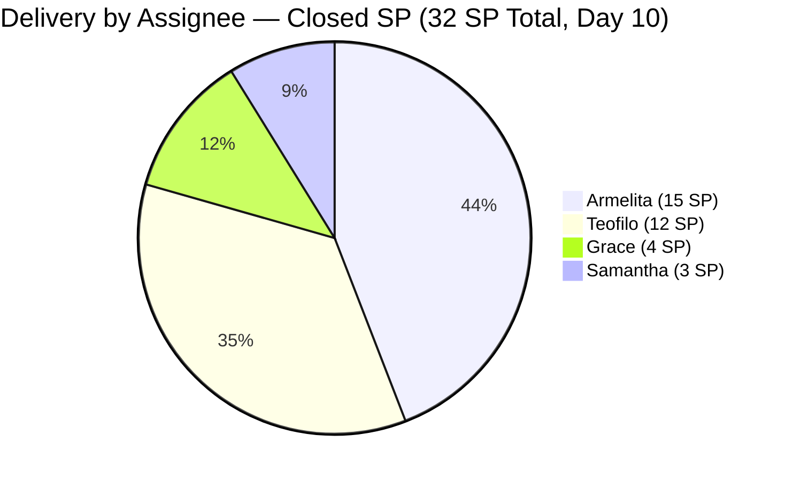
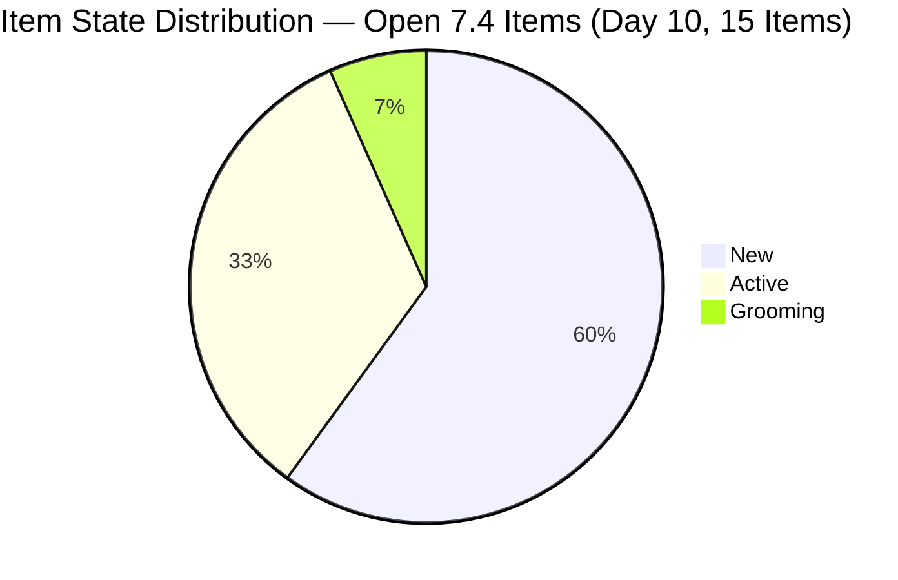
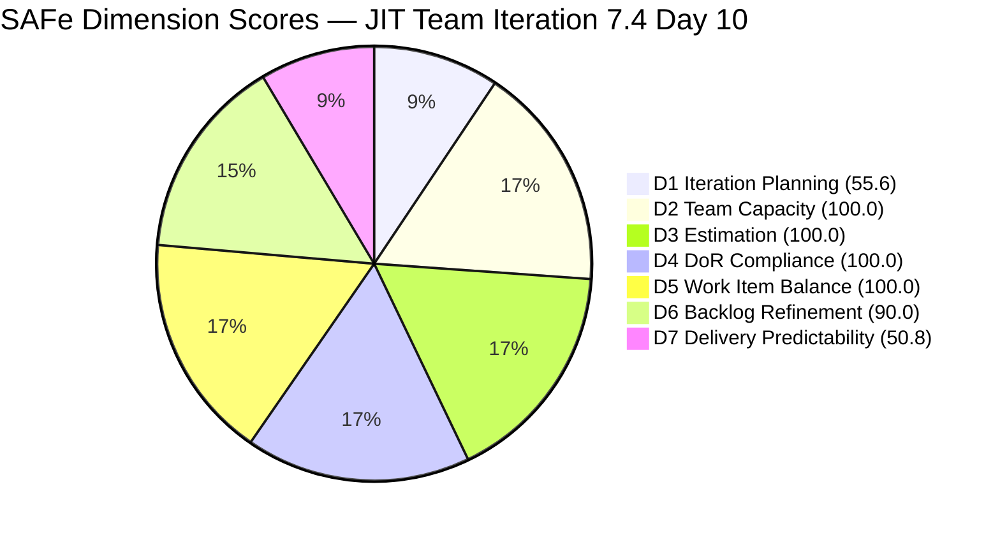

# JIT Operation Team — SAFe Iteration Audit #73

**Audit Date:** 2026-05-27 09:03 UTC
**Auditor:** Claude Code (SAFe PM Consultant)
**Workspace:** `ado_jit`
**ADO Board:** [JIT Operation Team](https://dev.azure.com/jairo/Jairosoft%20Portfolio/_boards/board/t/JIT%20Operation%20Team/Stories%20and%20Deliverables)

---

## 1. Audit Metadata

| Field | Value |
|-------|-------|
| Audit Number | #73 |
| Audit Date | 2026-05-27 |
| Audit Time | 09:03 UTC |
| Iteration | 7.4 |
| Iteration Dates | May 18 – May 31, 2026 |
| Sprint Day | Day 10 of 14 |
| ADO Project | Jairosoft Portfolio (`666bb99a-6acd-4999-bb34-efd0e4ea90dc`) |
| ADO Team | JIT Operation Team (`b25e3129-6272-4e54-a3ff-f1ef3c8eeb2c`) |
| Iteration ID | `16385d00-244a-4caa-9e56-d4a8e850754d` |
| Prior Audit | AUDIT_20260526_0203.md (Score: 84.7 — Low Risk) |
| **Overall Score** | **85.2 / 100** |
| **Risk Band** | **Low Risk** |

---

## 2. Executive Summary

Iteration 7.4, **Day 10 of 14**. The JIT Operation Team records another closure on Day 10: **#203808 (4.1-4 Occupational Health and Safety Procedures, Teofilo, 3 SP)** was closed on May 26 at 15:11 UTC, bringing the sprint total to **16 closed items and 32 SP delivered** (50.8% of 63 SP committed). This marks the sprint crossing the halfway point in story-point delivery.

Additionally, three of Grace's previously stalled New-state items (#204435, #204440, #204447) transitioned to **Active** on May 26 at ~13:18 UTC — a significant planning activation event. These 6 SP were dormant since May 18 and now show active work intent.

D7 advances from 46.0 to **50.8** (+4.8). D6 improves from 90.0 to a calculated **90.0** — Grace's 3 items moving to Active removes them from the untouched count, bringing untouched items down from 3 to **2** (203243, 203809), still above the 10% threshold. D1 continues the closing-item artifact decline from 57.1 to **55.6** (15/27 visible).

The overall score improves from 84.7 to **85.2 / 100**, maintaining Low Risk for a fourth consecutive day. With 31 SP remaining and 4 working days left, the team needs 7.75 SP/day against 17.8 pts/day capacity — achievable with sustained momentum but requiring all contributors to accelerate.

**Overall Score: 85.2 / 100 — Low Risk** *(D1 artifact: 55.6 understates commitment; 16 items / 32 SP delivered; Grace activated; Teofilo advancing TESDA sequence)*

---

## 3. Previous Audit Delta

| Metric | 2026-05-26 (Audit #72) | 2026-05-27 (Audit #73) | Change |
|--------|------------------------|------------------------|--------|
| Sprint Day | Day 9 | Day 10 | +1 |
| Visible Backlog Items (open) | 28 | **27** | −1 |
| 7.4 Items (open, in backlog) | 16 | **15** | −1 (203808 closed) |
| New Closures | — | **+1** (#203808, 3 SP) | +1 item / +3 SP |
| Total Confirmed Closed in 7.4 | 15 | **16** | +1 |
| SP Closed | 29 SP | **32 SP** | **+3** |
| Grace's New-state items activated | 0 of 3 | **3 of 3** (#204435, #204440, #204447 → Active) | **+3 activations** |
| D1 — Iteration Planning | 57.1 | **55.6** | −1.5 (continuing closed-item artifact) |
| D6 — Backlog Refinement | 90.0 | **90.0** | 0 (2/15 untouched = 13.3% → −10 still applies) |
| D7 — Delivery Predictability | 46.0 | **50.8** | **+4.8** |
| Overall Score | 84.7 | **85.2** | **+0.5** |
| Risk Band | Low Risk | Low Risk | — |

### Notable Changes (Day 10 — May 26)

**1 new closure confirmed:**

| ID | Title | Assignee | SP | Closed |
|----|-------|----------|----|--------|
| 203808 | 4.1-4 Occupational Health and Safety Procedures | Teofilo | 3 | May 26 15:11 UTC |

**3 state transitions (New → Active):**

| ID | Title | Assignee | SP | Changed |
|----|-------|----------|----|---------|
| 204435 | Archive Proof of Filing for TESDA Application | Grace | 2 | May 26 13:18 UTC |
| 204440 | Package SAFe Micro-credential Dossier | Grace | 2 | May 26 13:18 UTC |
| 204447 | Monitor and Log Daily Payment Collections | Grace | 2 | May 26 13:18 UTC |

### D1 Artifact Note
Every closure removes a closed item from the visible backlog denominator and numerator simultaneously. Today: 27 visible (down from 28), 15 in 7.4 (down from 16). D1 = 15/27 = 55.6. The team committed and delivered 16 items — this is genuine progress.

---

## 4. Current Iteration Snapshot

**Iteration 7.4** · May 18 – May 31, 2026 · **Day 10 of 14**

| Field | Value |
|-------|-------|
| Visible Root Backlog Items (open) | 27 |
| Items in Iter 7.4 (open) | 15 |
| Items in Iter 7.4 (closed, confirmed) | **16** |
| Total Items Committed to 7.4 | 31 |
| Total SP Committed (7.4) | 63 SP |
| SP Delivered (closed) | **32 SP** |
| SP Remaining | **31 SP** |
| % Complete (SP) | **32/63 = 50.8%** |
| Items Closed | **16** |
| Items Active | 5 (#203595, #204435, #204440, #204447, #204567, #204572) |
| Items Grooming | 1 (#204338) |
| Items New | 9 |
| Days Remaining | 4 working days |
| Pace Required | 7.75 SP/day |
| Team Capacity | 17.8 pts/day |

### Closed Items Summary by Contributor

| Contributor | Items Closed | SP Closed |
|-------------|-------------|-----------|
| Armelita | 8 items | 15 SP |
| Teofilo | 4 items | 12 SP |
| Grace | 2 items | 4 SP |
| Samantha | 2 items | 3 SP |
| **Total** | **16 items** | **32 SP** |

Note: Teofilo now at 12 SP with #203808 closure. TESDA sequence progress: 203805 ✓ → 203806 ✓ → 203807 ✓ → **203808 ✓** → 203809 (next).

---

## 5. Work Item Analysis

### Open Items in Iteration 7.4 (15 items, 31 SP)

| ID | Title | Type | State | SP | Assignee | Last Changed | DoR | Sprint-start? |
|----|-------|------|-------|-----|----------|-------------|-----|--------------|
| 203243 | IT7.4 Tech Talk - AI Tools Demonstration Sessions | Spike | New | 2 | Armelita | May 6 | Pass | **Pre-sprint** |
| 203595 | JIT Finance Collection Policy | User Story | Active | 2 | Grace | May 18 | Pass | On-start |
| 203809 | 4.1-5 Network Maintenance Task | Training | New | 3 | Teofilo | **May 4** | Pass | **Pre-sprint** |
| 204338 | Bubble Tesda Training | User Story | Grooming | 3 | Samantha | May 26 | Pass | Post-start |
| 204435 | Archive Proof of Filing for TESDA Application | User Story | **Active** | 2 | Grace | **May 26** | Pass | Post-start |
| 204440 | Package SAFe Micro-credential Dossier | User Story | **Active** | 2 | Grace | **May 26** | Pass | Post-start |
| 204447 | Monitor and Log Daily Payment Collections | User Story | **Active** | 2 | Grace | **May 26** | Pass | Post-start |
| 204508 | Enrollment Report with Additional Student | User Story | New | 1 | Armelita | May 18 | Pass | On-start |
| 204567 | Bubble TESDA Scholarship Training Proper | User Story | Active | 2 | Armelita | May 26 | Pass | Post-start |
| 204572 | Report Submission | User Story | Active | 2 | Armelita | May 26 | Pass | Post-start |
| 204576 | JIT Marketing/Processing Officer | User Story | New | 2 | Armelita | May 18 | Pass | On-start |
| 204614 | 1.5-2 Conduct Test on the Installed Computer System | Training | New | 2 | Teofilo | May 19 | Pass | Post-start |
| 204615 | 1.5-3 Document Testing Using Accomplishment Report | Training | New | 2 | Teofilo | May 19 | Pass | Post-start |
| 204616 | 2.1-1 Network Design Training | Training | New | 2 | Teofilo | May 19 | Pass | Post-start |
| 204617 | 2.1-2 Network Materials Training | Training | New | 2 | Teofilo | May 19 | Pass | Post-start |

### Untouched Items (ChangedDate before sprint start May 18)

| ID | Title | Last Changed | Days Silent | Type |
|----|-------|-------------|-------------|------|
| 203243 | IT7.4 Tech Talk - AI Tools Demonstration Sessions | May 6 | 21 days | Spike |
| 203809 | 4.1-5 Network Maintenance Task | May 4 | 23 days | Training |

2 of 15 open 7.4 items = 13.3% untouched (>10%, <30%) → −10 D6 penalty persists.
Grace's 3 items (204435, 204440, 204447) moved to Active May 26 — removed from untouched count (previously 3 untouched). This is the key improvement from yesterday.

### DoR Check Summary

All 15 open 7.4 items have descriptions (≥30 non-whitespace chars) and acceptance criteria (≥20 non-whitespace chars). DoR = 15/15 = 100%.

### Type Distribution (Open 7.4 Items)

| Type | Count | Share |
|------|-------|-------|
| User Story | 9 | 60.0% |
| Training | 5 | 33.3% |
| Spike | 1 | 6.7% |
| **Total** | **15** | |

US share = 60.0% — exactly at the 60% threshold. Rule is >60% for dominant-type penalty → no penalty applies. D5 = 100.0.

---

## 6. SAFe Compliance Scorecard

| Dimension | Score | Evidence | Notes |
|-----------|-------|----------|-------|
| D1 — Iteration Planning | 55.6 | 15/27 visible open root items in Iter 7.4 | Artifact: 16 closed items removed from backlog; denominator anchored by 12 non-7.4 items (7.5, PI8, 7.3 carryover). Real planning coverage was 100% at sprint start. |
| D2 — Team Capacity | 100.0 | 4/4 contributors with work and configured capacity | Team 17.8 pts/day; armelita, Teofilo, Samantha, Grace all active |
| D3 — Estimation | 100.0 | 15/15 open 7.4 items have SP > 0 | 31 SP remaining; 32 SP closed; all items estimated |
| D4 — DoR Compliance | 100.0 | 15/15 open 7.4 items pass description ≥30 chars + AC ≥20 chars | All types (User Story, Training, Spike) meet DoR thresholds |
| D5 — Work Item Balance | 100.0 | US present; US share = 60.0% (not >60%); Spike = 6.7% (<40%) | No dominant-type penalty; no spike penalty; US present. D5 = 100. |
| D6 — Backlog Refinement | 90.0 | 27/27 fresh (base 100); 2/15 untouched = 13.3% (>10% → −10) | 203243 (May 6) and 203809 (May 4) remain pre-sprint; Grace's 3 items now Active (removed from untouched pool) |
| D7 — Delivery Predictability | 50.8 | 32/63 SP closed (16 items confirmed closed) | +1 closure today: #203808 (Teofilo, 3 SP, May 26 15:11 UTC) |

**Overall Score: (55.6 + 100.0 + 100.0 + 100.0 + 100.0 + 90.0 + 50.8) / 7 = 596.4 / 7 = 85.2 / 100 — Low Risk**

---

## 7. Dimension Findings

### D1 — Iteration Planning (55.6) ⚠️ *Artifact — Continuing Decline*

D1 continues its mechanically declining trajectory: 91.2 (Day 7) → 62.5 (Day 8) → 57.1 (Day 9) → 55.6 (Day 10). Each closure removes a completed item from the visible backlog. The 12 non-7.4 visible items anchor the denominator at 27. To bring D1 back toward 100, those 12 non-current-sprint items should be moved out of the backlog view (to their correct future iterations or archived). This would reduce the denominator toward 15, bringing D1 to ~100.

### D2 — Team Capacity (100.0) ✅

All four contributors remain active and configured. Teofilo's closure of 203808 today demonstrates continued TESDA sequence execution. Grace's 3 activations (204435, 204440, 204447) signal intent to close in the remaining 4 days. Armelita has 2 Active items (204567, 204572) and 3 New items (203243, 204508, 204576) still to address.

### D3 — Estimation (100.0) ✅

All 15 open 7.4 items have SP. Closed items also all had SP. Full estimation coverage maintained throughout sprint.

### D4 — DoR Compliance (100.0) ✅

All 15 open items pass DoR. The JIT team's DoR discipline remains the strongest consistent dimension across the PI7 audit series.

### D5 — Work Item Balance (100.0) ✅

With 203808 closed (Training type), the type distribution shifts to: US = 9 (60.0%), Training = 5 (33.3%), Spike = 1 (6.7%). The US share at exactly 60.0% does not exceed the >60% threshold. Full score maintained.

### D6 — Backlog Refinement (90.0) ✅ — *Partial Improvement*

A meaningful improvement within D6: Grace's 3 items (204435, 204440, 204447) were activated May 26, removing them from the "untouched" pool. Untouched count drops from 3 (prior audit) to 2 (203243, 203809). However, 2/15 = 13.3% still exceeds the 10% threshold, maintaining the −10 penalty. D6 remains at 90.0.

To reach D6 = 100.0 and gain +1.4 overall: touch either 203243 (AI Tech Talk Spike) or 203809 (Network Maintenance Task) before sprint end. Teofilo's TESDA sequence suggests 203809 may close naturally next.

### D7 — Delivery Predictability (50.8) 🟡 — *Sprint Midpoint Crossed*

**Sprint delivery crosses 50% for the first time.** 32/63 SP = 50.8% — the team is now past the halfway point in story-point delivery with 4 days remaining. The single closure today (203808, 3 SP) continues Teofilo's TESDA module sequence.

**Remaining workload vs. capacity:**
- 31 SP remaining / 4 days = 7.75 SP/day needed
- Team capacity: 17.8 pts/day = 2.3× required pace
- If yesterday's burst-day pace (10 SP/day) is repeated: all 31 SP close in ~3 days

**Key delivery risks in remaining 4 days:**
- 203243 (AI Tech Talk Spike): 21 days untouched — must either run the session or de-commit
- 203595 (Finance Collection Policy, Grace): Active since Day 1, last updated May 18 (10 days)
- 204338 (Bubble TESDA Training, Samantha, Grooming): needs closure or Active transition
- Armelita's 3 New items (203243, 204508, 204576): 5 SP total in New state

---

## 8. Risks and Bottlenecks

| Risk | Severity | Status |
|------|----------|--------|
| 31 SP in 4 days = 7.75 SP/day pace required | **High** | 17.8 pts/day capacity available; must sustain burst-day pace |
| 203243 (AI Tech Talk Spike) untouched since May 6 | **High** | 21 days without activity; session must be scheduled today or de-committed |
| 203595 (Finance Collection Policy, Grace) Active since May 18 | **High** | 10 days with no closure signal; if Grace is working it, update the state today |
| 203809 (Network Maintenance Task) untouched since May 4 | **High** | 23 days; likely next in Teofilo's sequence — close as soon as module complete |
| 204338 (Bubble TESDA Training, Samantha) in Grooming on Day 10 | **High** | 3 SP still grooming; training may be in progress — activate or close |
| Grace: 3 items Active (6 SP) plus 203595 Active — 8 SP in 4 days | Moderate | All activated May 26; Grace closed 4 SP early in sprint; can deliver |
| Armelita: 3 New items (203243, 204508, 204576) = 5 SP still unstarted | Moderate | 204567 + 204572 Active and progressing |
| No iteration goal defined | Moderate | 10th consecutive sprint day without formal goal |

---

## 9. Prioritized Recommendations

1. **Decide on #203243 (AI Tech Talk Spike, 2 SP) today — activate or de-commit** — 21 days without activity makes this the most at-risk item in the sprint. If the AI Tools Demonstration session can be conducted in the next 2 days (Days 10–11), activate it immediately and schedule the session. If it cannot realistically occur before May 31, de-commit it to Iteration 7.5. Do not carry it into the sprint end as an unclosed Spike.

2. **Close #203595 (Finance Collection Policy, Grace, 2 SP) by Day 11** — This User Story has been Active since May 18 (10 days). Grace has demonstrated strong delivery (2 items / 4 SP closed early in sprint; 3 new activations today). If the collection policy document is drafted and validated, close this item now. If still in progress, update the ADO state with current progress today.

3. **Close #203809 (Network Maintenance Task, Teofilo, 3 SP) Day 10–11** — Teofilo has closed the preceding 4 TESDA modules in sequence (203805–203808). Module 203809 (4.1-5) is the natural next step. If Teofilo has conducted the network maintenance review, close this item. Closing it also eliminates one of the two remaining D6 untouched penalties (bringing untouched from 2 to 1, reducing to 6.7% — below 10% — which would push D6 to 100.0 and overall to 86.4).

4. **Activate and close #204338 (Bubble TESDA Training, Samantha, 3 SP)** — Still in Grooming state on Day 10. If the 4-day training was conducted (or is in progress), move to Active and close upon completion. Samantha has capacity to deliver this.

5. **Sprint final push plan (31 SP in 4 days):**
   - **Armelita (11 SP open):** Close 204567+204572 (Active, 4 SP) Days 10–11; close 204508+204576 (2+2 SP) Day 11–12; decide on 203243 today
   - **Teofilo (9 SP open):** Close 203809 (3 SP) Day 10; close 204614+204615+204616+204617 (8 SP) Days 11–13
   - **Grace (8 SP open):** Close 203595 (2 SP, been Active 10 days) Day 11; close 204435+204440+204447 (6 SP) Days 11–12
   - **Samantha (3 SP open):** Close 204338 Days 10–11

6. **Move non-7.4 items out of backlog view** — The 12 non-7.4 items (Iter 7.5, PI8, 7.3 carryover) anchoring the denominator should be moved to their correct iteration scope. This would bring D1 from 55.6 back toward 100.0 in subsequent audits.

---

## 10. Evidence Gaps and Limitations

| Gap | Impact | Notes |
|-----|--------|-------|
| D1 closing-item artifact | D1 at 55.6 understates commitment | 16 closed items confirmed; real planning coverage was 100% at sprint start |
| D7 cumulative tracking across audit series | Cross-audit evidence required | 16 closed items confirmed from live API today |
| 203250 (Iter 7.3 carryover, Armelita, Active Spike) in backlog | Distorts non-7.4 count | Last updated May 12; 15 days since last touch |
| 200766 (ODOO Spike, PI8) in visible backlog | Non-sprint item inflating D1 denominator | Active since May 3 |
| 204338 Grooming state rationale | Delivery timing unclear | Grooming on Day 10 — whether training has started is not visible in API |
| No iteration goal defined | D1 quality context missing | 10 consecutive sprint-day audits without a formal goal |

---

## Visualization

### SAFe Dimension Score Summary

| Dimension | Score | Band | Change vs. Prior |
|-----------|-------|------|-----------------|
| D1 — Iteration Planning | 55.6 | Moderate | −1.5 (artifact — 203808 closed) |
| D2 — Team Capacity | 100.0 | Low | — |
| D3 — Estimation | 100.0 | Low | — |
| D4 — DoR Compliance | 100.0 | Low | — |
| D5 — Work Item Balance | 100.0 | Low | — |
| D6 — Backlog Refinement | 90.0 | Low | 0 (Grace activated; untouched = 2/15 = 13.3%, still >10%) |
| D7 — Delivery Predictability | **50.8** | **Moderate** | **+4.8** (+1 closure: 203808, 3 SP) |
| **Overall** | **85.2** | **Low Risk** | **+0.5** |

### Score Trend (Last 10 Audits)

| Date | Audit | Score | Band | Closures / SP |
|------|-------|-------|------|--------------|
| May 18 | #63 | 75.5 | Moderate | 0 |
| May 19 | #64 | 75.8 | Moderate | 0 |
| May 20 | #65 | 75.8 | Moderate | 0 |
| May 21 | #66 | 75.5 | Moderate | 0 |
| May 22 | #68 | 75.1 | Moderate | 0 |
| May 23 | #69 | 75.0 | Moderate | 0 |
| May 24 | #70 | 82.6 | Low | +9 items / 17 SP |
| May 25 | #71 | 83.2 | Low | +1 item / 2 SP |
| May 26 | #72 | 84.7 | Low | +5 items / 10 SP |
| **May 27** | **#73** | **85.2** | **Low** | **+1 item / 3 SP + 3 activations** |

The team has maintained Low Risk for 4 consecutive days. Sprint delivery crossed 50% today. Critical challenge: 31 SP in 4 days with 7.75 SP/day pace required. Team capacity (17.8 pts/day) supports this — execution coordination is the decisive factor.

---

*Audit generated by Claude Code (claude-sonnet-4-6) on 2026-05-27. Evidence sourced from Azure DevOps MCP (Jairosoft Portfolio project). Rubric: SAFe 6.0 7-dimension scorecard.*
