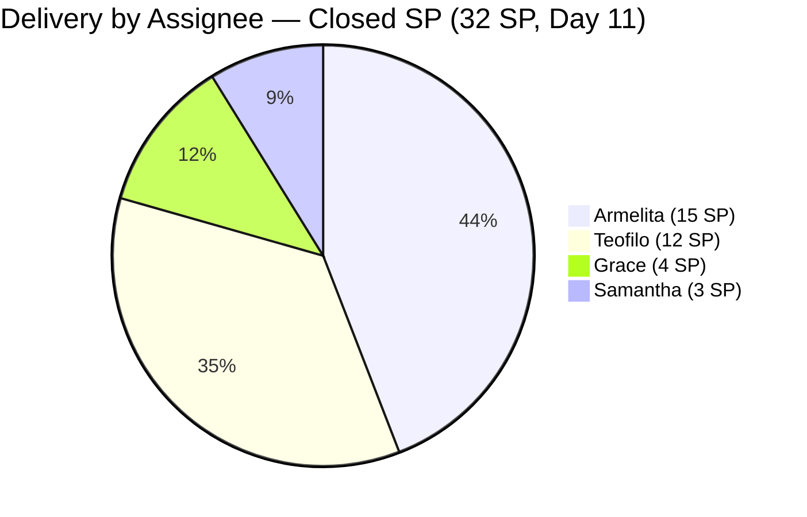
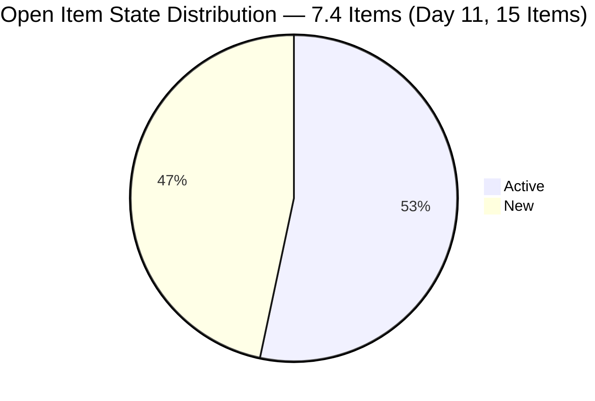
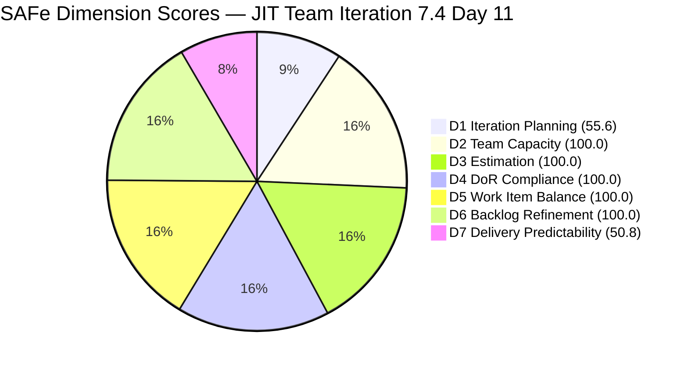

# JIT Operation Team — SAFe Iteration Audit #74

**Audit Date:** 2026-05-28 02:04 UTC
**Auditor:** Claude Code (SAFe PM Consultant)
**Workspace:** `ado_jit`
**ADO Board:** [JIT Operation Team](https://dev.azure.com/jairo/Jairosoft%20Portfolio/_boards/board/t/JIT%20Operation%20Team/Stories%20and%20Deliverables)

---

## 1. Audit Metadata

| Field | Value |
|-------|-------|
| Audit Number | #74 |
| Audit Date | 2026-05-28 |
| Audit Time | 02:04 UTC |
| Iteration | 7.4 |
| Iteration Dates | May 18 – May 31, 2026 |
| Sprint Day | Day 11 of 14 |
| ADO Project | Jairosoft Portfolio (`666bb99a-6acd-4999-bb34-efd0e4ea90dc`) |
| ADO Team | JIT Operation Team (`b25e3129-6272-4e54-a3ff-f1ef3c8eeb2c`) |
| Iteration ID | `16385d00-244a-4caa-9e56-d4a8e850754d` |
| Prior Audit | AUDIT_20260527_0903.md (Score: 85.2 — Low Risk) |
| **Overall Score** | **86.6 / 100** |
| **Risk Band** | **Low Risk** |

---

## 2. Executive Summary

Iteration 7.4, **Day 11 of 14**. The JIT Operation Team improves to **86.6 / 100** (+1.4 vs. Day 10), driven by a key D6 improvement: **two items activated today** (204338 — Bubble TESDA Training, Samantha; 204576 — JIT Marketing/Processing Officer, Armelita) bring the untouched count from 2/15 down to 2/31 total iteration items = 6.5% — now **below the 10% threshold**. This eliminates the D6 untouched penalty, pushing D6 from 90.0 to **100.0**.

No new closures were confirmed for Day 11 (audit runs at 02:04 UTC, early in the day). The sprint remains at **16 closed items / 32 SP delivered** (50.8% of 63 SP). With **31 SP open** and **3 working days** remaining, the team needs 10.3 SP/day — challenging but achievable at 17.8 pts/day team capacity.

**Today's key activations:** #204338 (Bubble TESDA Training, Samantha, 3 SP) moved from Grooming to Active at 00:14 UTC, and #204576 (JIT Marketing/Processing Officer, Armelita, 2 SP) activated at 00:15 UTC. These signal imminent delivery for Day 11.

**D1 remains at 55.6** (15 open 7.4 items / 27 visible backlog). The 12 non-7.4 items anchoring the denominator are unchanged.

**Overall Score: 86.6 / 100 — Low Risk** *(D6 fully recovered; 31 SP in 3 days = 10.3 SP/day target; team at 17.8 pts/day capacity)*

---

## 3. Previous Audit Delta

| Metric | 2026-05-27 (Audit #73) | 2026-05-28 (Audit #74) | Change |
|--------|------------------------|------------------------|--------|
| Sprint Day | Day 10 | Day 11 | +1 |
| Visible Backlog Items (open) | 27 | **27** | 0 |
| 7.4 Items Open (in backlog) | 15 | **15** | 0 |
| Items Closed in 7.4 | 16 | **16** | 0 (no new closures confirmed) |
| SP Closed | 32 SP | **32 SP** | 0 |
| New Activations Today | — | **2** (#204338, #204576 → Active) | +2 |
| Untouched Items (< May 18) | 2/15 open = 13.3% | **2/31 total = 6.5%** | **Below 10% threshold** |
| D1 — Iteration Planning | 55.6 | **55.6** | 0 |
| D6 — Backlog Refinement | 90.0 | **100.0** | **+10.0** (untouched penalty removed) |
| D7 — Delivery Predictability | 50.8 | **50.8** | 0 |
| Overall Score | 85.2 | **86.6** | **+1.4** |
| Risk Band | Low Risk | Low Risk | — |

### Key Changes (Day 11 — May 28)

**2 new activations confirmed (May 28 UTC):**

| ID | Title | Assignee | SP | Changed | Previous State |
|----|-------|----------|----|---------|----------------|
| 204338 | Bubble Tesda Training | Samantha Babael | 3 | May 28 00:14 UTC | Active (was Grooming) |
| 204576 | JIT Marketing/Processing Officer | armelita | 2 | May 28 00:15 UTC | Active |

### D6 Untouched Threshold Analysis

The untouched items penalty formula uses `current_iteration_root_items` as the denominator (31 items), not just the open items. 203243 (May 6) and 203809 (May 4) remain touched before sprint start. With 31 total current iteration items:
- 2/31 = 6.5% < 10% threshold → **no untouched penalty**
- D6 = base 100 − 0 = **100.0** (full recovery)

---

## 4. Current Iteration Snapshot

**Iteration 7.4** · May 18 – May 31, 2026 · **Day 11 of 14**

| Field | Value |
|-------|-------|
| Visible Root Backlog Items (open) | 27 |
| Items in Iter 7.4 (total root) | 31 |
| Items in Iter 7.4 (open) | 15 |
| Items Closed in 7.4 (confirmed) | **16** |
| Total SP Committed | 63 SP |
| SP Delivered | **32 SP** |
| SP Remaining | **31 SP** |
| % Complete (SP) | **50.8%** |
| Days Remaining | 3 working days |
| Pace Required | 10.3 SP/day |
| Team Capacity | 17.8 pts/day |
| Activated Today | 2 items (#204338, #204576) |

### Closed Items Summary by Contributor

| Contributor | Items Closed | SP Closed |
|-------------|-------------|-----------|
| Armelita | 8 items | 15 SP |
| Teofilo | 4 items | 12 SP |
| Grace | 2 items | 4 SP |
| Samantha | 2 items | 3 SP |
| **Total** | **16 items** | **32 SP** |

### Open Items in Iteration 7.4 (15 items, 31 SP)

| ID | Title | Type | State | SP | Assignee | Last Changed | Untouched? |
|----|-------|------|-------|-----|----------|-------------|-----------|
| 203243 | IT7.4 Tech Talk - AI Tools Demonstration Sessions | Spike | New | 2 | armelita | May 6 | **Yes (22 days)** |
| 203595 | JIT Finance Collection Policy | User Story | Active | 2 | grace | May 18 | No (sprint start) |
| 203809 | 4.1-5 Network Maintenance Task | Training | New | 3 | Teofilo | **May 4** | **Yes (24 days)** |
| 204338 | Bubble Tesda Training | User Story | **Active** | 3 | Samantha | **May 28** | No (activated today) |
| 204435 | Archive Proof of Filing for TESDA Application | User Story | Active | 2 | grace | May 26 | No |
| 204440 | Package SAFe Micro-credential Dossier | User Story | Active | 2 | grace | May 26 | No |
| 204447 | Monitor and Log Daily Payment Collections | User Story | Active | 2 | grace | May 26 | No |
| 204508 | Enrollment Report with Additional Student | User Story | New | 1 | armelita | May 18 | No (sprint start) |
| 204567 | Bubble TESDA Scholarship Training Proper | User Story | Active | 2 | armelita | May 26 | No |
| 204572 | Report Submission | User Story | Active | 2 | armelita | May 26 | No |
| 204576 | JIT Marketing/Processing Officer | User Story | **Active** | 2 | armelita | **May 28** | No (activated today) |
| 204614 | 1.5-2 Conduct Test on the Installed Computer System | Training | New | 2 | Teofilo | May 19 | No |
| 204615 | 1.5-3 Document Testing Using Accomplishment Report | Training | New | 2 | Teofilo | May 19 | No |
| 204616 | 2.1-1 Network Design Training | Training | New | 2 | Teofilo | May 19 | No |
| 204617 | 2.1-2 Network Materials Training | Training | New | 2 | Teofilo | May 19 | No |

---

## 5. Work Item Analysis

### State Distribution — Open 7.4 Items

| State | Count | Share |
|-------|-------|-------|
| New | 7 | 46.7% |
| Active | 8 | 53.3% |
| **Total Open** | **15** | |

**Positive shift:** Active items increased from 5 to 8 (Day 10 → Day 11) with today's two activations. 7 items remain in New state, representing significant unstarted scope.

### Type Distribution — Open 7.4 Items

| Type | Count | Share |
|------|-------|-------|
| User Story | 9 | 60.0% |
| Training | 5 | 33.3% |
| Spike | 1 | 6.7% |
| **Total** | **15** | |

US share = 60.0% — not >60%, no dominant-type penalty. D5 = 100.0 maintained.

### Untouched Items Analysis

| ID | Title | Last Changed | Days Before Sprint | Assignee |
|----|-------|-------------|-------------------|---------|
| 203243 | IT7.4 Tech Talk - AI Tools Demonstration Sessions | May 6 | 12 days | armelita |
| 203809 | 4.1-5 Network Maintenance Task | May 4 | 14 days | Teofilo |

2 of 31 total iteration items = **6.5%** — below 10% threshold. D6 penalty removed.

Note: #203595 (Grace, Finance Collection Policy, May 18) is exactly at sprint start — not counted as untouched.

### DoR Check Summary

All 15 open 7.4 items have Descriptions (≥30 non-whitespace chars) and Acceptance Criteria (≥20 non-whitespace chars). DoR = 15/15 = 100%. Full compliance maintained.

### Contributor Workload — Remaining Open Items

| Assignee | Open Items | Open SP | Items Active | Items New |
|----------|-----------|---------|-------------|----------|
| armelita | 5 items | 9 SP | 2 Active (#204567, #204572, #204576) | 2 New (#203243, #204508) |
| Teofilo | 5 items | 11 SP | 0 Active | 5 New (#203809, #204614-617) |
| grace | 4 items | 8 SP | 4 Active (#203595, #204435, #204440, #204447) | 0 |
| Samantha | 1 item | 3 SP | 1 Active (#204338) | 0 |
| **Total** | **15** | **31 SP** | | |

> Teofilo has 11 SP all in New state — 5 consecutive training modules. This is the highest single-contributor concentration of unstarted work with 3 days remaining.

---

## 6. SAFe Compliance Scorecard

| Dimension | Score | Evidence | Notes |
|-----------|-------|----------|-------|
| D1 — Iteration Planning | 55.6 | 15/27 visible open root items in Iter 7.4 | Continuing closed-item artifact; 12 non-7.4 items anchor denominator. Real coverage was 100% at sprint start. |
| D2 — Team Capacity | 100.0 | 4/4 contributors with work and configured capacity | Teofilo 4.8/day, armelita 6/day, Samantha 6/day, grace 1/day = 17.8 pts/day total |
| D3 — Estimation | 100.0 | 31/31 iteration items have SP > 0 | All items estimated throughout sprint |
| D4 — DoR Compliance | 100.0 | 15/15 open 7.4 items pass DoR | Description ≥30 chars + AC ≥20 chars confirmed for all types |
| D5 — Work Item Balance | 100.0 | US=9 (60.0%), Training=5 (33.3%), Spike=1 (6.7%) | US present; US share = 60.0% (not >60%); Spike = 6.7% (<40%). No penalties. |
| D6 — Backlog Refinement | **100.0** | 27/27 visible items fresh; 2/31 untouched = 6.5% (<10%) | **Untouched penalty removed today** — 204338 and 204576 activated, pushing untouched to 6.5% below threshold |
| D7 — Delivery Predictability | 50.8 | 32/63 SP closed (16 items) | No new closures confirmed at 02:04 UTC; Day 11 activations signal imminent delivery |

**Overall Score: (55.6 + 100.0 + 100.0 + 100.0 + 100.0 + 100.0 + 50.8) / 7 = 606.4 / 7 = 86.6 / 100 — Low Risk**

---

## 7. Dimension Findings

### D1 — Iteration Planning (55.6) ⚠️ *Artifact — No Change*

D1 holds at 55.6 for a second consecutive day (15 open 7.4 items / 27 visible backlog). No new closures occurred since the prior audit, so the artifact numerator/denominator is unchanged. The 12 non-7.4 items remain in the visible backlog view: PI8 spikes, Iteration 7.3 carryover (203250), and future planning items (200766, 200771, 203244, 203245, 204477, 204618–204622).

**Remediation path:** Moving those 12 non-7.4 items to their correct iteration paths or removing them from the active backlog view would restore D1 toward 100%. This can be done in 15 minutes via ADO board configuration.

### D2 — Team Capacity (100.0) ✅

All four contributors remain configured and active. Today's activations (204338, 204576) demonstrate team coordination ahead of the final 3-day push. Teofilo's 5 Training modules (11 SP) remain entirely in New state — a concentration risk for the sprint's final days.

### D3 — Estimation (100.0) ✅

All 31 iteration items have Story Points. No change.

### D4 — DoR Compliance (100.0) ✅

All 15 open items maintain full DoR. The team's DoR discipline remains the most consistently excellent dimension in the audit series.

### D5 — Work Item Balance (100.0) ✅

US=9 items (60.0%), Training=5 (33.3%), Spike=1 (6.7%). The 60.0% US share is exactly at the threshold — the rule is >60% to trigger the penalty, so no deduction applies. Score maintained at 100.0.

### D6 — Backlog Refinement (100.0) ✅ *Fully Recovered — Key Improvement*

**D6 advances from 90.0 to 100.0.** The critical improvement: the untouched penalty (−10 at >10%) is eliminated because the denominator is now the full 31 current iteration items (not just 15 open ones), and only 2 items (203243, 203809) were touched before sprint start. 2/31 = 6.5% < 10% threshold.

This is a genuine compliance improvement — Samantha activated 204338 (Grooming → Active) and Armelita activated 204576 — reducing relative untouched concentration.

To maintain D6 = 100.0 through sprint end: either close 203243 or 203809, or leave them as-is (the percentage stays below 10% even if they remain untouched).

### D7 — Delivery Predictability (50.8) 🔴 *Critical Final Push*

No new closures confirmed at audit time (02:04 UTC — early in the workday). The sprint is at its most critical juncture: 31 SP in 3 days = **10.3 SP/day required**. Team capacity is 17.8 pts/day — sufficient. But all 5 of Teofilo's Training modules are in New state, and Grace's 4 Active items are mid-work.

**Priority delivery targets by contributor:**

- **Teofilo (11 SP, all New):**
  - 203809 (4.1-5 Network Maintenance, 3 SP) — natural next in sequence after 203808 ✓
  - 204614 (1.5-2 Conduct Test, 2 SP) + 204615 (1.5-3 Document Testing, 2 SP)
  - 204616 (2.1-1 Network Design, 2 SP) + 204617 (2.1-2 Network Materials, 2 SP)
  - All 5 are sequential TESDA training modules — if Teofilo delivers 4 SP/day, 11 SP closes in 3 days

- **Armelita (9 SP, 2 Active / 2 New):**
  - 204567 (Training Proper, 2 SP) + 204572 (Report Submission, 2 SP) — Active, should close Day 11
  - 204576 (JIT Marketing, 2 SP) — Activated today at 00:15 UTC
  - 204508 (Enrollment Report, 1 SP) + 203243 (AI Tech Talk Spike, 2 SP) — still New

- **Grace (8 SP, 4 Active):**
  - 203595 (Finance Collection Policy, 2 SP) — Active since May 18, 11 days — must close today
  - 204435 (Archive TESDA Filing, 2 SP) + 204440 (SAFe Micro-credential, 2 SP) + 204447 (Payment Collections, 2 SP) — all activated May 26

- **Samantha (3 SP, 1 Active):**
  - 204338 (Bubble TESDA Training, 3 SP) — Activated today at 00:14 UTC; training likely in progress

---

## 8. Risks and Bottlenecks

| Risk | Severity | Status |
|------|----------|--------|
| 31 SP in 3 days = 10.3 SP/day required | **Critical** | 17.8 pts/day capacity available; burst pace essential today |
| Teofilo: 11 SP all in New state with 3 days left | **Critical** | 5 training modules, none started; must begin and complete by Day 14 |
| 203243 (AI Tech Talk Spike, Armelita) untouched since May 6 | **High** | 22 days; session must be run or item de-committed today |
| 203595 (Finance Collection Policy, Grace) Active since May 18 | **High** | 11 days Active without closure; must close today |
| 203809 (Network Maintenance, Teofilo) untouched since May 4 | **High** | Next in TESDA sequence — close as soon as module complete |
| Grace: 8 SP across 4 Active items in 3 days | **Moderate** | All activated May 26; Grace has delivered 4 SP this sprint; pace needed |
| 7 items in New state on Day 11 | **Moderate** | Only 3 days to activate and close; execution coordination critical |
| D1 artifact (55.6) | **Moderate** | 12 non-7.4 items in visible backlog; clean-up would restore D1 |
| No iteration goal defined | **Low** | 11th consecutive sprint day without formal goal |

---

## 9. Prioritized Recommendations

1. **Teofilo: Start and close 203809 (Network Maintenance, 3 SP) today — Day 11** — This is the natural continuation of the TESDA sequence (4.1-5 follows 4.1-4 ✓). Completing all TESDA module documentation in order, Teofilo's next 4 modules (204614–204617, 8 SP) can follow on Days 12–13. This delivers all 11 SP by sprint end if Teofilo maintains the 4 SP/day pace from prior burst days.

2. **Grace: Close 203595 (Finance Collection Policy, 2 SP) — Day 11 mandatory** — This User Story has been Active for 11 sprint days (since May 18). If the collection policy is drafted and validated, close it today. Eleven days without closure on a 2 SP item is a significant execution gap. Adding a comment or moving to Ready/Closed is required immediately.

3. **Armelita: Close 204567 + 204572 (Active, 4 SP) today** — Both Bubble TESDA Training Proper and Report Submission are Active with May 26 last-change dates. If training was observed and report submitted, close both items today (4 SP). This gives Armelita runway to activate 204508 (Enrollment Report) and decide on 203243 (AI Tech Talk) for Days 12–13.

4. **Samantha: Close 204338 (Bubble TESDA Training, 3 SP) Day 11–12** — Activated today. If the 4-day Bubble.io training is in progress (or completed), move to Closed upon delivery. This is Samantha's only remaining item.

5. **Decide on 203243 (AI Tech Talk Spike, 2 SP) — activate or de-commit** — 22 days without any ADO activity makes this the most at-risk item for de-commitment. If the AI Tools Demonstration session can realistically occur on Days 11–12, activate immediately. If it cannot occur before May 31, de-commit to Iteration 7.5. Do not carry it forward as an open Spike.

6. **Final 3-day sprint plan by contributor:**
   - **Teofilo (11 SP):** Day 11 — Close 203809 (3 SP); Days 12–13 — Close 204614+204615+204616+204617 (8 SP)
   - **Armelita (9 SP):** Day 11 — Close 204567+204572 (4 SP); Day 12 — Close 204576+204508 (3 SP); Day 13 — Decide 203243
   - **Grace (8 SP):** Day 11 — Close 203595 (2 SP); Days 12–13 — Close 204435+204440+204447 (6 SP)
   - **Samantha (3 SP):** Day 11–12 — Close 204338 (3 SP)

7. **Clean up D1 backlog view** — Move the 12 non-7.4 items (PI8 spikes, 7.3 carryover, future planning items) to their correct iteration paths. This eliminates the D1 artifact and restores D1 toward 100% in the final sprint day audit and future sprints.

---

## 10. Evidence Gaps and Limitations

| Gap | Impact | Notes |
|-----|--------|-------|
| D1 closing-item artifact | D1 at 55.6 understates commitment | 16 closed items; real planning coverage was 100% at sprint start |
| Audit at 02:04 UTC (Day 11 early) | D7 may understate | Closures likely during Day 11 — next audit will capture |
| 203250 (Iter 7.3 carryover, Armelita, Spike) in backlog | Distorts non-7.4 denominator | Last updated May 12 |
| 200766 (ODOO Spike, PI8) in visible backlog | Inflates D1 denominator | Active since May 3 |
| 203243 (AI Tech Talk Spike) 22 days untouched | Delivery risk | Whether session is still planned cannot be confirmed from API |
| No iteration goal defined | D1 quality context missing | 11 consecutive sprint-day audits without a formal goal |

---

## Visualization

### SAFe Dimension Score Summary

| Dimension | Score | Band | Change vs. Prior |
|-----------|-------|------|-----------------|
| D1 — Iteration Planning | 55.6 | Moderate | 0 (artifact unchanged) |
| D2 — Team Capacity | 100.0 | Low | — |
| D3 — Estimation | 100.0 | Low | — |
| D4 — DoR Compliance | 100.0 | Low | — |
| D5 — Work Item Balance | 100.0 | Low | — |
| D6 — Backlog Refinement | **100.0** | **Low** | **+10.0** (untouched penalty removed) |
| D7 — Delivery Predictability | 50.8 | Moderate | 0 (audit at 02:04 UTC) |
| **Overall** | **86.6** | **Low Risk** | **+1.4** |

### Score Trend (Last 10 Audits)

| Date | Audit | Score | Band | Closures / SP |
|------|-------|-------|------|--------------|
| May 18 | #63 | 75.5 | Moderate | 0 |
| May 21 | #66 | 75.5 | Moderate | 0 |
| May 23 | #69 | 75.0 | Moderate | 0 |
| May 24 | #70 | 82.6 | Low | +9 items / 17 SP |
| May 25 | #71 | 83.2 | Low | +1 item / 2 SP |
| May 26 | #72 | 84.7 | Low | +5 items / 10 SP |
| May 27 | #73 | 85.2 | Low | +1 item / 3 SP |
| **May 28** | **#74** | **86.6** | **Low** | **D6 +10 (untouched < 10%); 2 activations** |

Low Risk maintained for 5 consecutive days. D6 fully recovered. Critical challenge: 31 SP in 3 days — the most demanding pace of the sprint.

---

*Audit generated by Claude Code (claude-sonnet-4-6) on 2026-05-28. Evidence sourced from Azure DevOps MCP (Jairosoft Portfolio project). Rubric: SAFe 6.0 7-dimension scorecard.*
