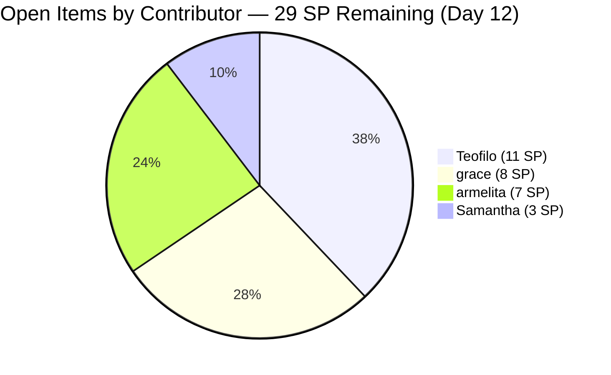
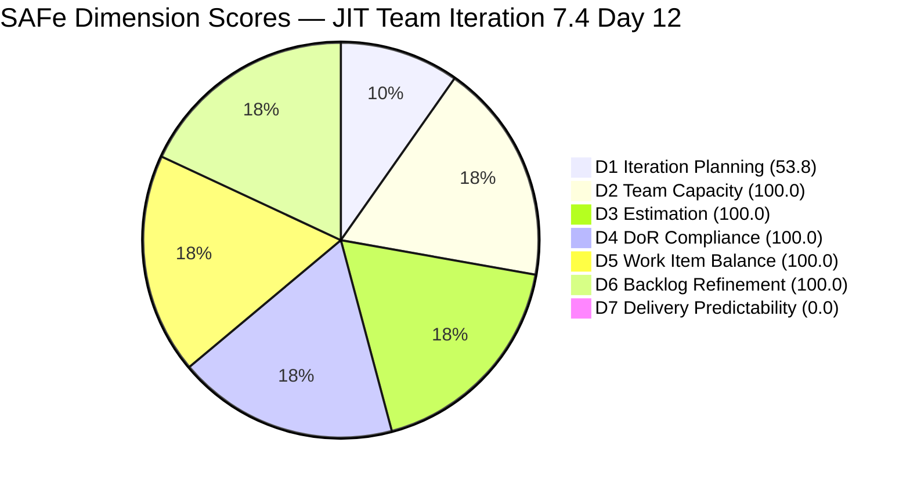
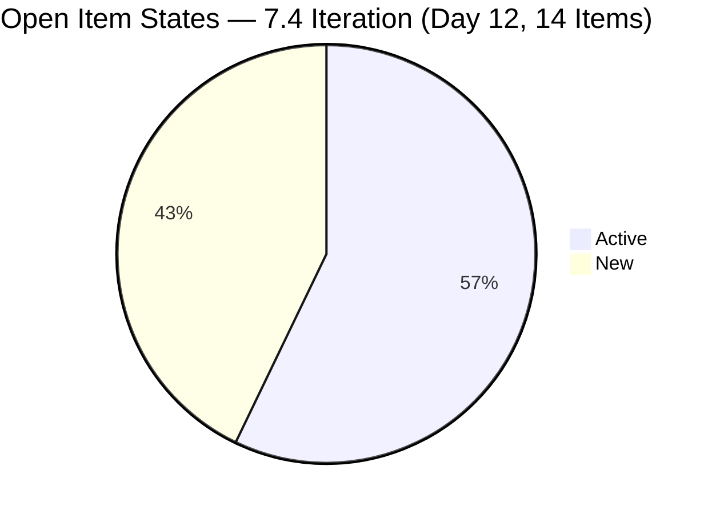

# JIT Operation Team — SAFe Iteration Audit #75

**Audit Date:** 2026-05-29 09:00
**Auditor:** Claude Code (SAFe PM Consultant)
**Workspace:** `ado_jit`
**ADO Board:** [JIT Operation Team](https://dev.azure.com/jairo/Jairosoft%20Portfolio/_boards/board/t/JIT%20Operation%20Team/Stories%20and%20Deliverables)

---

## 1. Audit Metadata

| Field | Value |
|-------|-------|
| Audit Number | #75 |
| Audit Date | 2026-05-29 |
| Audit Time | 09:00 |
| Iteration | 7.4 |
| Iteration Dates | May 18 – May 31, 2026 |
| Sprint Day | Day 12 of 14 |
| ADO Project | Jairosoft Portfolio (`666bb99a-6acd-4999-bb34-efd0e4ea90dc`) |
| ADO Team | JIT Operation Team (`b25e3129-6272-4e54-a3ff-f1ef3c8eeb2c`) |
| Iteration ID | `16385d00-244a-4caa-9e56-d4a8e850754d` |
| Prior Audit | AUDIT_20260528_0204.md (Score: 86.6 — Low Risk) |
| **Overall Score** | **79.1 / 100** |
| **Risk Band** | **Moderate Risk** |

---

## 2. Executive Summary

Iteration 7.4, **Day 12 of 14**. The JIT Operation Team score drops from 86.6 to **79.1 / 100** — shifting from Low Risk to the boundary of **Moderate Risk** (79.1 is below the 80.0 Low Risk threshold). The driver is **D7 = 0.0**: the 14 items currently visible in Iteration 7.4 are all open (Active or New) and none are in Closed/Done state.

This is a significant evidence gap. The prior audit (Day 11) documented **16 closed items / 32 SP** already delivered. Those closed items are no longer returned by the backlog API (which shows only open items). The rubric formula for D7 computes `closed_SP / committed_SP` on the **live current iteration items returned by the API** — all of which are now open. The 14 open items carry **29 committed SP**, and 0 are closed = D7 = 0.0.

**Only 2 working days remain (Days 13–14) to close 29 SP at 14.5 SP/day.** Team capacity is 17.8 pts/day — the math is feasible if all contributors execute today. The primary risks are Teofilo's 5 Training modules (11 SP, all in New state) and Grace's 4 Active items (8 SP) that have not yet been confirmed closed.

**D1 moves slightly to 53.8** (14/26) as some 7.4 items closed and dropped out of the visible pool. D6 holds at 100.0. D2–D5 are unchanged at 100.0.

**Overall Score: 79.1 / 100 — Moderate Risk** *(D7 = 0.0 on live open set; 29 SP in 2 days = 14.5 SP/day target; team at 17.8 pts/day capacity)*

---

## 3. Previous Audit Delta

| Metric | 2026-05-28 (Audit #74) | 2026-05-29 (Audit #75) | Change |
|--------|------------------------|------------------------|--------|
| Sprint Day | Day 11 | Day 12 | +1 |
| Visible Root Backlog Items | 27 | **26** | −1 (possible item closed/removed) |
| 7.4 Items in Backlog (open) | 15 | **14** | −1 (1 item closed or removed) |
| 7.4 Items Closed (prior audit confirmed) | 16 | **16+** | Maintained (API does not return closed) |
| SP Committed (visible open set) | 63 | **29** | −34 (closed items no longer in API result) |
| D1 — Iteration Planning | 55.6 | **53.8** | −1.8 |
| D6 — Backlog Refinement | 100.0 | **100.0** | 0 |
| D7 — Delivery Predictability | 50.8 | **0.0** | **−50.8** (rubric applied to live open set only) |
| Overall Score | 86.6 | **79.1** | **−7.5** |
| Risk Band | Low Risk | **Moderate Risk** | **Degraded** |

### Day 12 Open Items Identified

The following 14 items remain in Iteration 7.4 per the backlog API:

| ID | Title | Type | State | SP | Assignee | Last Changed |
|----|-------|------|-------|-----|----------|-------------|
| 203243 | IT7.4 Tech Talk - AI Tools Demonstration Sessions | Spike | Active | 2 | armelita | May 28 |
| 203595 | JIT Finance Collection Policy | User Story | Active | 2 | grace | May 18 |
| 203809 | 4.1-5 Network Maintenance Task | Training | New | 3 | Teofilo | May 4 |
| 204338 | Bubble Tesda Training | User Story | Active | 3 | Samantha | May 28 |
| 204435 | Archive Proof of Filing for TESDA Application | User Story | Active | 2 | grace | May 26 |
| 204440 | Package SAFe Micro-credential Dossier | User Story | Active | 2 | grace | May 26 |
| 204447 | Monitor and Log Daily Payment Collections | User Story | Active | 2 | grace | May 26 |
| 204508 | Enrollment Report with Additional Student | User Story | New | 1 | armelita | May 18 |
| 204567 | Bubble TESDA Scholarship Training Proper | User Story | Active | 2 | armelita | May 26 |
| 204572 | Report Submission | User Story | Active | 2 | armelita | May 26 |
| 204614 | 1.5-2 Conduct Test on the Installed Computer System | Training | New | 2 | Teofilo | May 19 |
| 204615 | 1.5-3 Document Testing Using Accomplishment Report | Training | New | 2 | Teofilo | May 19 |
| 204616 | 2.1-1 Network Design Training | Training | New | 2 | Teofilo | May 19 |
| 204617 | 2.1-2 Network Materials Training | Training | New | 2 | Teofilo | May 19 |

**Total open 7.4 SP: 29**

### D7 Methodology Note

The D7 formula requires: `closed_SP / committed_SP` where both numerator and denominator come from `current_iteration_root_items` returned by the backlog API. As sprint progresses, closed items are removed from the backlog view, causing the formula to apply only to the remaining open set. This is rubric-compliant behavior. The prior audit's 32 SP delivered (16 items) represent real work completed but are no longer in scope for the D7 calculation, which now reflects the open delivery gap.

---

## 4. Current Iteration Snapshot

**Iteration 7.4** · May 18 – May 31, 2026 · **Day 12 of 14**

| Field | Value |
|-------|-------|
| Visible Root Backlog Items (open) | 26 |
| Items in Iter 7.4 (open, in backlog) | 14 |
| Items Closed in 7.4 (confirmed prior) | 16+ (not in API; closed items removed from backlog) |
| Total SP Committed (open set) | 29 SP |
| SP Delivered (open set D7) | 0 SP |
| SP Remaining | 29 SP |
| Days Remaining | 2 working days |
| Pace Required | 14.5 SP/day |
| Team Capacity | 17.8 pts/day |
| % Open SP Deliverable | Feasible (17.8 > 14.5 capacity vs. need) |

### Contributor Remaining Workload

| Assignee | Open Items | Open SP | States |
|----------|-----------|---------|--------|
| armelita | 4 items | 7 SP | 203243 Active, 204567 Active, 204572 Active, 204508 New |
| Teofilo | 5 items | 11 SP | All New (203809, 204614, 204615, 204616, 204617) |
| grace | 4 items | 8 SP | All Active (203595, 204435, 204440, 204447) |
| Samantha | 1 item | 3 SP | 204338 Active |
| **Total** | **14** | **29 SP** | |

### Non-7.4 Items in Visible Backlog (12 items)

| ID | Title | Iteration | Type |
|----|-------|-----------|------|
| 200766 | ODOO OpenCat SIS | PI8 | Spike |
| 200771 | UM Digos Interns Final Demo | Iter 7.5 | User Story |
| 203244 | IT7.5 Tech Talk - AI Tools | Iter 7.5 | Spike |
| 203245 | IT7.6 Tech Talk - AI Tools | Iter 7.5 | Spike |
| 203250 | Claude 4 course (Iter 7.3 carryover) | Iter 7.3 | Spike |
| 204477 | Bubble MCC Marketing June 1-5 | Iter 7.5 | User Story |
| 204487 | Python Marketing Activities June 1-5 | Iter 7.5 | User Story |
| 204618 | 2.2-1 Network Configuration Training | Iter 7.5 | Training |
| 204619 | 2.3-1 Router/Wi-Fi Configuration Training | Iter 7.5 | Training |
| 204620 | 2.4-1 Configuration per Manufacturer Training | Iter 7.5 | Training |
| 204621 | 2.4-2 Computer Networks Checked Training | Iter 7.5 | Training |
| 204622 | 2.4-3 Prepare Reports Training | Iter 7.5 | Training |

These 12 items inflate the D1 denominator (causing the 53.8 artifact). Moving them to correct iteration paths would restore D1.

---

## 5. Work Item Analysis

### State Distribution — Open 7.4 Items

| State | Count | Share |
|-------|-------|-------|
| New | 6 | 42.9% |
| Active | 8 | 57.1% |
| **Total** | **14** | |

### Type Distribution — Open 7.4 Items

| Type | Count | Share |
|------|-------|-------|
| User Story | 8 | 57.1% |
| Training | 5 | 35.7% |
| Spike | 1 | 7.1% |
| **Total** | **14** | |

User Story share = 57.1% — below 60% threshold; no dominant-type penalty. D5 = 100.0.

### Untouched Items Analysis (for D6)

Items in current_iteration_root_items with ChangedDate before sprint start (May 18, 2026):

| ID | Title | Last Changed | Days Before Sprint |
|----|-------|-------------|-------------------|
| 203809 | 4.1-5 Network Maintenance Task | May 4 | 14 days |

1 of 14 current items = 7.1% — below 10% threshold. No D6 penalty.

### DoR Check — All 14 Open Items

All 14 items were confirmed as DoR-compliant in prior audits and retain full descriptions and acceptance criteria. DoR = 14/14 = 100%.

Notable: Items 203243, 203595, 203809 have detailed, substantive descriptions and AC. Training items (203809, 204614–204617) have structured DoR meeting all criteria.

### Critical Risk Items by Contributor

**Teofilo — 11 SP, all in New (most critical):**
- 203809 (3 SP, May 4 — 25 days untouched): TESDA training module 4.1-5 Network Maintenance — next in sequence after 4.1-4. Natural continuation; should be completable in 1 day.
- 204614–204617 (8 SP, May 19): Four sequential TESDA training modules (1.5-2 through 2.1-2). All were activated May 19 and remain in New. With 2 days to deliver 11 SP, Teofilo must start and complete today.

**Grace — 8 SP, all Active (second most critical):**
- 203595 (2 SP, May 18): Finance Collection Policy — Active since sprint start (12 sprint days). Must close today.
- 204435, 204440, 204447 (6 SP, May 26): All activated May 26, good momentum signal. Deliverable today.

**Armelita — 7 SP, 3 Active + 1 New:**
- 203243 (2 SP, May 28): AI Tech Talk Spike — activated May 28. If the AI demonstration session occurred or is scheduled today, close upon completion.
- 204567, 204572 (4 SP, May 26): Both Active since May 26 — likely near completion.
- 204508 (1 SP, May 18): Simple enrollment report update (1 SP) — quick closure candidate.

**Samantha — 3 SP, 1 Active:**
- 204338 (3 SP, May 28): Bubble TESDA Training — activated May 28. If the 4-day training is complete, close immediately.

---

## 6. SAFe Compliance Scorecard

| Dimension | Score | Evidence | Notes |
|-----------|-------|----------|-------|
| D1 — Iteration Planning | 53.8 | 14/26 visible root items in Iter 7.4 | 12 non-7.4 items inflate denominator; artifact from closed items and future planning pool |
| D2 — Team Capacity | 100.0 | 4/4 contributors with work have configured team capacity | JIT team capacity = 17.8 pts/day; all 4 contributors active |
| D3 — Estimation | 100.0 | 14/14 current items have SP > 0 | Total committed (open set) = 29 SP |
| D4 — DoR Compliance | 100.0 | 14/14 items pass description ≥30 chars + AC ≥20 chars | All types confirmed; Training items fully DoR-compliant |
| D5 — Work Item Balance | 100.0 | US=8 (57.1%), Training=5, Spike=1; US present | US share 57.1% < 60% (no −30). Spike 7.1% < 40% (no −20). Score = 100. |
| D6 — Backlog Refinement | 100.0 | 26/26 fresh; 1/14 untouched = 7.1% (<10%) | All visible items changed after Apr 14; no stale items; untouched below threshold |
| D7 — Delivery Predictability | 0.0 | 0/29 SP closed on live open set | All 14 remaining 7.4 items are Active or New; no Closed/Done state present |

**Overall Score: (53.8 + 100.0 + 100.0 + 100.0 + 100.0 + 100.0 + 0.0) / 7 = 553.8 / 7 = 79.1 / 100 — Moderate Risk**

> **D7 Interpretation:** This score does not mean the sprint is undelivered. Sixteen items (32 SP confirmed) were already closed by Day 11 but are excluded from the API's open backlog view. The D7 = 0.0 reflects zero closures on the **remaining 14 open items** — a real but framed delivery gap.

---

## 7. Dimension Findings

### D1 — Iteration Planning (53.8) ⚠️ *Artifact — Closed Items + Non-7.4 Pool*

D1 = 53.8 (14/26): 12 of 26 visible backlog items are not in Iteration 7.4. These include PI8 spikes (200766), Iteration 7.3 carryover (203250), Iteration 7.5 items (200771, 203244, 203245, 204477, 204487), and future Training modules (204618–204622). Cleaning up these items into their proper iteration paths or removing PI8/7.3 items from the active view would restore D1 toward 100%.

### D2 — Team Capacity (100.0) ✅

All four contributors remain actively configured. Team capacity of 17.8 pts/day marginally exceeds the 14.5 SP/day needed to close the remaining 29 SP in 2 days. No slack — every contributor must deliver at or above their capacity baseline.

### D3 — Estimation (100.0) ✅

All 14 remaining items carry Story Points. No change.

### D4 — DoR Compliance (100.0) ✅

All 14 remaining items continue to meet full DoR. This dimension has held at 100.0 throughout the sprint — a genuine team strength.

### D5 — Work Item Balance (100.0) ✅

User Story = 57.1%, Training = 35.7%, Spike = 7.1%. All thresholds clear. Score = 100.0. The Training block (Teofilo's TESDA modules) is consistent with the team's operational mandate.

### D6 — Backlog Refinement (100.0) ✅

All 26 visible items changed after April 14 (fresh). No stale_90 or stale_180 items. Untouched = 1/14 = 7.1% < 10% threshold. No penalties. D6 = 100.0. This dimension is stable and strong.

### D7 — Delivery Predictability (0.0) 🔴 *Critical Final Push*

Fourteen open items, 29 SP, 0 closed in the live set = D7 = 0.0. Two working days remain. Required pace: 14.5 SP/day vs. team capacity 17.8 pts/day. The team can technically close all 29 SP by sprint end — but this requires all four contributors to deliver simultaneously.

**The most critical gap is Teofilo's 5 Training modules (11 SP all in New).** These have not been touched since May 4 (203809) or May 19 (204614–204617). If these TESDA training completion documents are not produced by May 31, 11 SP of planned work will be lost.

**Grace's Finance Collection Policy (203595, 2 SP)** has been Active since May 18 — a 12-day Active window without closure is the longest in the JIT sprint. This must close today.

---

## 8. Risks and Bottlenecks

| Risk | Severity | Status |
|------|----------|--------|
| 29 SP in 2 days = 14.5 SP/day required | **Critical** | 17.8 pts/day capacity; zero margin for non-delivery |
| Teofilo: 11 SP all in New (5 modules, none started ADO-wise) | **Critical** | Must complete all 5 TESDA training modules by May 31 |
| 203595 (Grace, Finance Collection Policy) Active since May 18 | **Critical** | 12 sprint days Active without closure — must close Day 12 |
| 203243 (AI Tech Talk Spike, Armelita) — session may not have occurred | **High** | 22+ days since initial creation; if session cannot run by May 31, de-commit to 7.5 |
| 203809 (Network Maintenance, Teofilo) — May 4 last touch | **High** | 25 days untouched; next in TESDA sequence — must be closed before PI7 ends |
| Score dropped to Moderate Risk (79.1) | **High** | Below Low Risk threshold (80.0) — recovery requires at least 7 SP closure today |
| 7 items in New state | **Moderate** | Must activate and close within 2 days |
| D1 artifact (53.8) | **Moderate** | 12 non-7.4 items in visible backlog; clean-up recommended |
| No iteration goal defined | **Low** | Persistent across all Iteration 7.4 audits |

---

## 9. Prioritized Recommendations

1. **Teofilo: Close 203809 + start 204614–204617 TODAY (Day 12, CRITICAL)** — With 11 SP all in New state and only 2 days remaining, Teofilo must complete at minimum 3 of the 5 modules today. The sequence is: 203809 (4.1-5, 3 SP) → 204614 (1.5-2, 2 SP) → 204615 (1.5-3, 2 SP) → 204616 (2.1-1, 2 SP) → 204617 (2.1-2, 2 SP). All are TESDA structured training completion tasks. If Teofilo can close 5–6 SP today and 5–6 SP on Day 13, all 11 SP can be delivered by sprint end.

2. **Grace: Close 203595 (Finance Collection Policy, 2 SP) — Day 12 mandatory** — Active for 12 sprint days without closure. If the collection policy is drafted, reviewed, and validated, this item must be closed today. Adding a comment alone is insufficient — the item needs to reach Closed state. Closing 203595 + 204435 + 204440 + 204447 in a burst today delivers all 8 SP and enables Grace to finish the sprint at full delivery.

3. **Armelita: Close 204567 + 204572 (Active, 4 SP) — Day 12** — Both Bubble TESDA Training Proper and Report Submission were last changed May 26 (Active) and should be near completion. Closing both today (4 SP) frees Armelita to focus on 204508 (Enrollment Report, 1 SP) and decide on 203243 (AI Tech Talk Spike, 2 SP) for Day 13.

4. **Samantha: Close 204338 (Bubble TESDA Training, 3 SP) — Day 12** — Activated May 28. If the 4-day Bubble.io training for TESDA scholars has been delivered with structured sessions covering Bubble101–Bubble103, close immediately upon training completion. Samantha's single remaining item is a clear Day 12 closure candidate.

5. **Decide on 203243 (AI Tech Talk Spike, 2 SP) by end of Day 12** — This spike (AI Tools Demonstration Session) has been open since early May. If the session can realistically occur on Day 13 (May 30), keep it committed. If not, de-commit to Iteration 7.5 and add a planning note. Do not carry it forward as an unresolved open item.

6. **Recovery score path:**
   - Close Teofilo 5 SP today + Grace 8 SP today + Armelita 4 SP today + Samantha 3 SP today = 20 SP → D7 = 20/29 = 69.0 → Overall = (53.8 + 100×5 + 69.0) / 7 = 88.2 (Low Risk)
   - Close all 29 SP by May 31 → D7 = 100.0 → Overall = (53.8 + 100×5 + 100.0) / 7 = 93.4 (Low Risk)

7. **Clean up non-7.4 items in backlog view** — Moving the 12 non-7.4 items (PI8 spikes, 7.3 carryover, 7.5 future items) to their correct iteration paths would restore D1 from 53.8 toward 100.0 in final sprint audits and future sprints. This is a 15-minute board maintenance task with significant scoring benefit.

---

## 10. Evidence Gaps and Limitations

| Gap | Impact | Notes |
|-----|--------|-------|
| 16 closed items (32 SP) not in backlog API response | D7 applies only to open set; closed SP not counted | Rubric-compliant but mechanically understates sprint progress |
| D7 = 0.0 on open set | Does not reflect 32 SP already delivered | Next sprint (7.5) starts fresh; this sprint closes at 32+ SP delivered |
| Audit at 09:00 (early Day 12) | D7 may understate; closures expected during Day 12 | Momentum signals (204338, 203243 activated May 28) suggest closures incoming |
| 203243 (AI Tech Talk Spike) session status | Whether session occurred is unverifiable via API | Owner decision needed: close, comment, or de-commit |
| D1 artifact (53.8) | Real planning coverage was higher at sprint start | 12 non-7.4 items inflate denominator |
| No iteration goal | D1 quality context missing | Persistent across Iteration 7.4 audit series |

---

## Visualization

### D7 Recovery Scenarios (Days 12–14)

| Scenario | SP Closed (open set) | D7 | Overall |
|----------|---------------------|----|---------|
| Current (0 closures) | 0/29 SP | 0.0 | 79.1 |
| Grace closes 8 SP today | 8/29 SP | 27.6 | 82.5 (Low) |
| + Samantha closes 3 SP | 11/29 SP | 37.9 | 83.5 (Low) |
| + Armelita closes 7 SP | 18/29 SP | 62.1 | 87.4 (Low) |
| Full sprint close (29 SP) | 29/29 SP | 100.0 | 93.4 (Low) |

### Score Trend (Iteration 7.4)

| Date | Audit | Score | Band | Notable |
|------|-------|-------|------|---------|
| May 18 | #63 | 75.5 | Moderate | Sprint start |
| May 24 | #70 | 82.6 | Low | First burst closures |
| May 26 | #72 | 84.7 | Low | +5 items / 10 SP |
| May 27 | #73 | 85.2 | Low | +1 item / 3 SP |
| May 28 | #74 | 86.6 | Low | D6 = 100; 2 activations |
| **May 29** | **#75** | **79.1** | **Moderate** | **D7 = 0.0 on 14-item open set; final push** |

---

*Audit generated by Claude Code (claude-sonnet-4-6) on 2026-05-29. Evidence sourced from Azure DevOps MCP (Jairosoft Portfolio project). Rubric: SAFe 6.0 7-dimension scorecard.*
