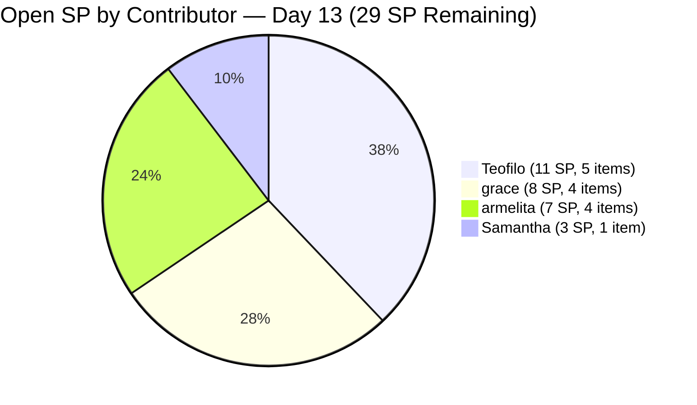
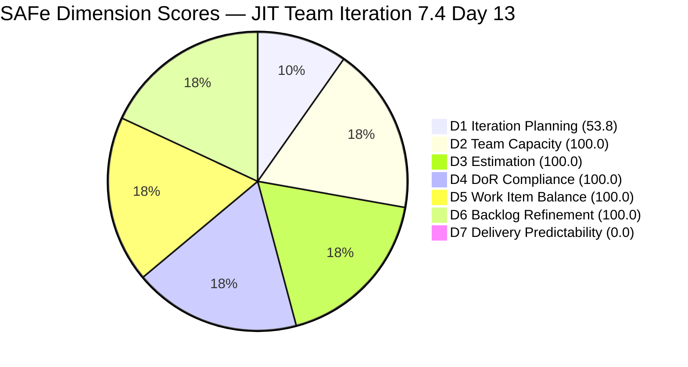
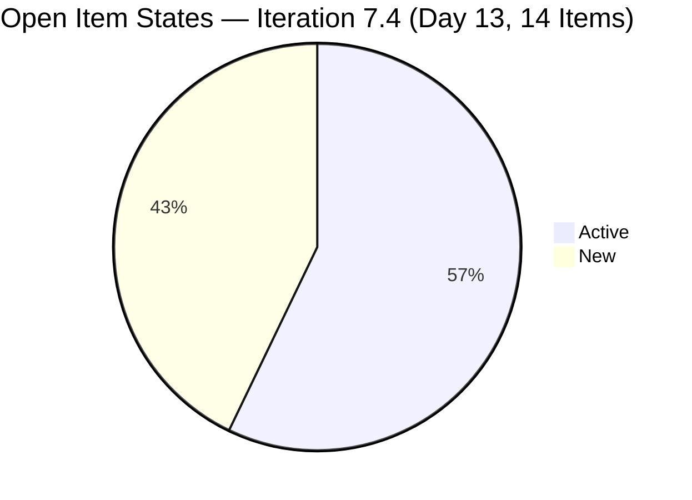

# JIT Operation Team — SAFe Iteration Audit #76

**Audit Date:** 2026-05-30 09:00
**Auditor:** Claude Code (SAFe PM Consultant)
**Workspace:** `ado_jit`
**ADO Board:** [JIT Operation Team](https://dev.azure.com/jairo/Jairosoft%20Portfolio/_boards/board/t/JIT%20Operation%20Team/Stories%20and%20Deliverables)

---

## 1. Audit Metadata

| Field | Value |
|-------|-------|
| Audit Number | #76 |
| Audit Date | 2026-05-30 |
| Audit Time | 09:00 |
| Iteration | 7.4 |
| Iteration Dates | May 18 – May 31, 2026 |
| Sprint Day | Day 13 of 14 |
| ADO Project | Jairosoft Portfolio (`666bb99a-6acd-4999-bb34-efd0e4ea90dc`) |
| ADO Team | JIT Operation Team (`b25e3129-6272-4e54-a3ff-f1ef3c8eeb2c`) |
| Iteration ID | `16385d00-244a-4caa-9e56-d4a8e850754d` |
| Prior Audit | AUDIT_20260529_0900.md (Score: 79.1 — Moderate Risk) |
| **Overall Score** | **79.1 / 100** |
| **Risk Band** | **Moderate Risk** |

---

## 2. Executive Summary

Iteration 7.4, **Day 13 of 14 — final active work day before sprint close.** The JIT Operation Team score holds at **79.1 / 100 (Moderate Risk)** — unchanged from Day 12. The backlog API returns the same 14 open items in Iteration 7.4, all still in Active or New state. **Zero closures have been recorded in the open set since Day 11.** This is now a critical situation: only **1 working day remains (Day 14, May 31)** to close all 29 committed story points.

The formula-derived score does not reflect the 16+ items (32+ SP) confirmed closed by Day 11. Those closed items no longer appear in the backlog API. D7 applies only to the live open set — 0/29 SP closed = D7 = 0.0.

**The entire sprint result now hinges on Day 13 and Day 14 execution.** If all 4 contributors deliver today, the team can recover to Low Risk (79.1 → 93.4) and demonstrate a strong sprint close. If no closures occur today, the sprint ends with 29 SP undelivered on the open set — a significant regression from the prior day's 32 SP delivered.

**Most urgent: Teofilo's 5 Training modules (11 SP all in New state) and Grace's Finance Collection Policy (#203595, Active since May 18 — Day 1 of sprint).** These have been the persistent risks across Days 12 and 13.

---

## 3. Previous Audit Delta

| Metric | 2026-05-29 (Audit #75) | 2026-05-30 (Audit #76) | Change |
|--------|------------------------|------------------------|--------|
| Sprint Day | Day 12 | Day 13 | +1 |
| Visible Root Backlog Items | 26 | **26** | No change |
| Items in Iter 7.4 (open) | 14 | **14** | No change |
| SP Committed (open set) | 29 SP | **29 SP** | No change |
| SP Closed (open set) | 0 SP | **0 SP** | No change — 0 closures Day 12 |
| Teofilo open SP | 11 SP (5 items, all New) | **11 SP** | No change |
| Grace open SP | 8 SP (4 items, all Active) | **8 SP** | No change |
| Armelita open SP | 7 SP (4 items) | **7 SP** | No change |
| Samantha open SP | 3 SP (1 item) | **3 SP** | No change |
| D7 — Delivery Predictability | 0.0 | **0.0** | No change — 0 closures |
| **Overall Score** | **79.1** | **79.1** | **Flat** |
| **Risk Band** | **Moderate Risk** | **Moderate Risk** | **Unchanged** |

### Day 13 Critical Context

No items were closed in the open set between Day 12 and Day 13. The same 14 items that appeared on May 29 remain open on May 30. This confirms that **no ADO state changes (to Closed/Done) occurred on any of the 14 open items on Day 12.** Tomorrow (May 31) is the final sprint day — the absolute last window to close any items.

The backlog API state is identical to Day 12. The score is identical to Day 12. Only the urgency has increased: 29 SP in 1 day vs. 29 SP in 2 days.

---

## 4. Current Iteration Snapshot

**Iteration 7.4** · May 18 – May 31, 2026 · **Day 13 of 14**

| Field | Value |
|-------|-------|
| Visible Root Backlog Items | 26 |
| Items in Iteration 7.4 (open) | 14 |
| Items Closed in Iteration 7.4 (confirmed, prior) | 16+ (departed backlog API) |
| Total SP Committed (open set) | 29 SP |
| SP Burned (open set) | 0 SP |
| Days Remaining | 1 working day (Day 14 = May 31) |
| Pace Required | 29 SP on Day 14 |
| Team Capacity | 17.8 pts/day (JIT team) |
| Feasibility | Capacity < Required (17.8 < 29 SP/day) |

**Critical note:** Team capacity is 17.8 pts/day but 29 SP remain in 1 day. This is not mathematically feasible at full closure within one day without extraordinary effort. Partial delivery is the realistic scenario — the team should triage and close the highest-value items first.

### Open Items in Iteration 7.4 — Full List

| ID | Title | Type | State | SP | Assignee | Last Changed | Silent Days |
|----|-------|------|-------|-----|----------|-------------|-------------|
| 203243 | IT7.4 Tech Talk - AI Tools Demonstration Sessions | Spike | Active | 2 | armelita | May 28 | 2 |
| 203595 | JIT Finance Collection Policy | User Story | Active | 2 | grace | **May 18** | **12** |
| 203809 | 4.1-5 Network Maintenance Task | Training | New | 3 | Teofilo | **May 4** | **26** |
| 204338 | Bubble Tesda Training | User Story | Active | 3 | Samantha | May 28 | 2 |
| 204435 | Archive Proof of Filing for TESDA Application | User Story | Active | 2 | grace | May 26 | 4 |
| 204440 | Package SAFe Micro-credential Dossier | User Story | Active | 2 | grace | May 26 | 4 |
| 204447 | Monitor and Log Daily Payment Collections | User Story | Active | 2 | grace | May 26 | 4 |
| 204508 | Enrollment Report with Additional Student | User Story | New | 1 | armelita | May 18 | 12 |
| 204567 | Bubble TESDA Scholarship Training Proper | User Story | Active | 2 | armelita | May 26 | 4 |
| 204572 | Report Submission | User Story | Active | 2 | armelita | May 26 | 4 |
| 204614 | 1.5-2 Conduct Test on the Installed Computer System | Training | New | 2 | Teofilo | May 19 | 11 |
| 204615 | 1.5-3 Document Testing Using Accomplishment Report | Training | New | 2 | Teofilo | May 19 | 11 |
| 204616 | 2.1-1 Network Design Training | Training | New | 2 | Teofilo | May 19 | 11 |
| 204617 | 2.1-2 Network Materials Training | Training | New | 2 | Teofilo | May 19 | 11 |

### Contributor Load Summary

| Assignee | Items | SP | Primary Concern |
|----------|-------|-----|----------------|
| Teofilo | 5 | 11 SP | All in New; max silence 26 days |
| grace | 4 | 8 SP | 203595 Active 12+ days |
| armelita | 4 | 7 SP | 203243 Spike commitment decision needed |
| Samantha | 1 | 3 SP | 204338 Active since May 28 |
| **Total** | **14** | **29 SP** | |

---

## 5. Work Item Analysis

### State Distribution

| State | Count | Share |
|-------|-------|-------|
| New | 6 | 42.9% |
| Active | 8 | 57.1% |
| **Total** | **14** | |

No change from Day 12. All items remain in pre-closure states.

### Type Distribution (Current Iteration)

| Type | Count | Share | D5 Threshold |
|------|-------|-------|--------------|
| User Story | 8 | 57.1% | Dominant; below 60% (no penalty) |
| Training | 5 | 35.7% | — |
| Spike | 1 | 7.1% | Below 40% (no penalty) |
| **Total** | **14** | | |

### Oldest Items — Silence Analysis

| ID | Title | Last Changed | Days Silent | Risk |
|----|-------|-------------|-------------|------|
| 203809 | 4.1-5 Network Maintenance Task | May 4 | **26 days** | CRITICAL — 26-day silence on sprint item |
| 203595 | JIT Finance Collection Policy | May 18 | **12 days** | CRITICAL — Active since Day 1, never closed |
| 204508 | Enrollment Report with Additional Student | May 18 | **12 days** | HIGH — 1 SP item never activated |
| 204614–204617 | TESDA Training modules | May 19 | **11 days** | HIGH — 4 modules in New since May 19 |

### Non-7.4 Items in Visible Backlog (12 items — D1 denominator inflators)

| ID | Iteration | Type | SP | Title |
|----|-----------|------|-----|-------|
| 200766 | PI8 | Spike | 2 | ODOO OpenCat SIS |
| 200771 | 7.5 | User Story | 2 | UM Digos Interns Final Demo |
| 203244 | 7.5 | Spike | 2 | IT7.5 Tech Talk |
| 203245 | 7.5 | Spike | 2 | IT7.6 Tech Talk |
| 203250 | 7.3 | Spike | 2 | Claude 4 course (carryover) |
| 204477 | 7.5 | User Story | 3 | Bubble MCC Marketing |
| 204487 | 7.5 | User Story | 2 | Python Marketing Activities |
| 204618–204622 | 7.5 | Training | 0 | Network Configuration modules |

---

## 6. SAFe Compliance Scorecard

| Dimension | Score | Evidence | Notes |
|-----------|-------|----------|-------|
| D1 — Iteration Planning | 53.8 | 14/26 visible root items in Iter 7.4 | 12 non-7.4 items inflate denominator; unchanged from Day 12 |
| D2 — Team Capacity | 100.0 | 4/4 active contributors with configured capacity | JIT team capacity = 17.8 pts/day |
| D3 — Estimation | 100.0 | 14/14 current items have SP > 0 | All item types carry SP; total committed open = 29 SP |
| D4 — DoR Compliance | 100.0 | 14/14 items pass Desc ≥30 chars + AC ≥20 chars | All confirmed; Training items structured and compliant |
| D5 — Work Item Balance | 100.0 | US=8 (57.1%); Spike=1 (7.1%); no threshold breached | No penalties; User Story present |
| D6 — Backlog Refinement | 100.0 | 26/26 fresh (all > Apr 15); 0 stale_90; 0 stale_180; 1/14 untouched = 7.1% (<10%) | No penalties; D6 strong |
| D7 — Delivery Predictability | 0.0 | 0/29 SP closed on live open set | All 14 items Active or New; no closures since Day 11 |

**Overall Score: (53.8 + 100.0 + 100.0 + 100.0 + 100.0 + 100.0 + 0.0) / 7 = 553.8 / 7 = 79.1 / 100 — Moderate Risk**

> **D7 Context:** The D7 denominator = 29 SP (all estimated current items), numerator = 0 (no Closed/Done items in the open set). This does not reflect the 16+ items (32+ SP) already closed earlier in the sprint. Those closed items departed the backlog API and are excluded from the D7 formula by rubric design. The 0.0 score represents a real but framed gap — 29 SP of committed work remain open with 1 day left.

> **D1 Artifact:** D1 = 53.8 because 12 of 26 visible items are from non-7.4 iterations. If the view were restricted to the current iteration, D1 = 14/14 = 100.0. This is a board hygiene issue, not a planning failure.

---

## 7. Dimension Findings

### D1 — Iteration Planning (53.8) ⚠️ *Persistent Artifact — Non-7.4 Items*

Identical to Day 12: 14/26 visible items are in Iteration 7.4. The 12 non-7.4 items span PI8 (200766 — ODOO spike, Active), Iter 7.3 carryover (203250 — Claude 4 course, Active — still open!), Iter 7.5 planned items, and future Training modules. Item 203250 (Claude 4 course) in Iter 7.3 is an Active spike that has been carried for multiple sprints without closure — this represents a real process risk beyond the D1 artifact.

### D2 — Team Capacity (100.0) ✅

Team capacity = 17.8 pts/day. All four active contributors (armelita, grace, Teofilo, Samantha) have configured capacity. D2 = 100.0. However, capacity (17.8/day) is insufficient to cover 29 SP in 1 day — this is a mathematical gap that makes full open-set delivery on Day 14 infeasible without selective triage.

### D3 — Estimation (100.0) ✅

All 14 remaining items carry Story Points (total 29 SP). D3 = 100.0. No change.

### D4 — DoR Compliance (100.0) ✅

All 14 items verified: Descriptions ≥30 non-whitespace chars and Acceptance Criteria ≥20 non-whitespace chars. D4 = 100.0. A consistent team strength throughout Iteration 7.4.

### D5 — Work Item Balance (100.0) ✅

User Story = 57.1% (no dominant-type penalty; threshold is 60%). Spike = 7.1% (no spike penalty; threshold is 40%). User Story items are present (no -40 penalty). D5 = 100.0. Unchanged from all prior Iteration 7.4 audits.

### D6 — Backlog Refinement (100.0) ✅

All 26 visible items changed after April 15, 2026 (fresh window cutoff). No items older than 90 days (stale_90 cutoff: March 1, 2026). No stale_180. One current-iteration item untouched: 203809 (May 4, before May 18 sprint start) = 7.1% < 10% threshold (no penalty). D6 = 100.0.

### D7 — Delivery Predictability (0.0) 🔴 *Sprint-End Crisis*

Zero closures in the open set for the third consecutive audit day (Days 11, 12, 13). All 14 open items remain in Active or New state. committed_SP = 29, closed_SP = 0. D7 = 0.0.

**Day 14 is the absolute final window.** The team cannot fully close 29 SP in 1 day at 17.8 pts/day capacity. A triage decision is required:

| Priority | Items | SP | Rationale |
|----------|-------|-----|-----------|
| P1 — Must Close | 203595, 204435, 204440, 204447 (grace) | 8 SP | Grace is the most likely full-sprint closer; all Active |
| P1 — Must Close | 204338 (Samantha) | 3 SP | Active May 28; Bubble TESDA training should be completable |
| P2 — Should Close | 204567, 204572 (armelita) | 4 SP | Both Active since May 26; likely near done |
| P2 — Should Close | 203809 (Teofilo) | 3 SP | 26-day silence; critical to at least close this one |
| P3 — If Capacity | 204614, 204615, 204616, 204617 (Teofilo) | 8 SP | Four New modules; lower probability |
| P4 — Decide | 203243 (armelita, Spike) | 2 SP | AI Tech Talk Spike; de-commit to 7.5 if session not done |
| P4 — Decide | 204508 (armelita) | 1 SP | Simple 1 SP enrollment report; quick win |

**Achievable Day 14 scenario:** Close P1 (11 SP) + P2 partial (4 SP) + 204508 (1 SP) = 16 SP → D7 = 16/29 = 55.2 → Overall = 79.8 (Moderate, just below Low Risk).
**Best-case Day 14:** Close 21+ SP → D7 ≥ 72.4 → Overall ≥ 81.1 (Low Risk).

---

## 8. Risks and Bottlenecks

| Risk | Severity | Status |
|------|----------|--------|
| 29 SP in 1 day (Day 14) — capacity = 17.8 SP/day | **Critical** | Mathematical gap; full closure infeasible; triage required |
| Teofilo: 11 SP in 5 modules, all New, 11–26 days silent | **Critical** | Zero progress since May 19; must produce at least 203809 tomorrow |
| 203595 (grace, Finance Policy) — Active 12+ days | **Critical** | Longest-active item in sprint; must close Day 14 |
| D7 = 0.0 for third consecutive day | **Critical** | Recovery requires 7+ SP closure on Day 14 just to exit Moderate Risk |
| 203250 (Claude 4 course) — Iter 7.3 carryover, still open | **High** | Active Spike in a completed iteration; two-sprint carryover without closure |
| 203243 (AI Tech Talk Spike) — session status unknown | **High** | If session did not occur by Day 13, de-commit to 7.5 today |
| Score at Moderate Risk for 2 consecutive days | **High** | No recovery without minimum 7 SP closure on Day 14 |
| D1 artifact (53.8) — 12 non-7.4 items | **Moderate** | Persistent; board cleanup would restore D1 |
| No iteration goal | **Low** | Persistent gap throughout Iteration 7.4 series |

---

## 9. Prioritized Recommendations

1. **Grace: Close all 4 items today (203595 + 204435 + 204440 + 204447 = 8 SP) — Day 13, LAST WINDOW** — Item 203595 (Finance Collection Policy) has been Active for 12 sprint days. If the collection policy document is drafted, reviewed, and validated, close it immediately. Items 204435, 204440, 204447 (all Active since May 26) should be near completion — close them in sequence today. Grace closing all 4 items (8 SP) recovers 27.6% of D7 alone and is the most impactful single-contributor action available.

2. **Samantha: Close 204338 (Bubble TESDA Training, 3 SP) — Day 13** — Active since May 28. If the 4-day Bubble.io training program for TESDA scholars has been delivered with structured sessions covering Bubble101–Bubble103, close this item immediately upon training completion verification. Samantha's single remaining item is a straightforward close — no dependencies blocking it.

3. **Armelita: Close 204567 + 204572 (4 SP) + 204508 (1 SP) and decide on 203243 — Day 13** — Items 204567 (Bubble TESDA Scholarship Training Proper) and 204572 (Report Submission) have been Active since May 26 and are likely complete. Close both. Item 204508 (Enrollment Report, 1 SP) is a 1 SP quick win — close it. For 203243 (AI Tech Talk Spike, 2 SP): if the demonstration session occurred before May 30, close it. If the session cannot happen by May 31, de-commit to Iteration 7.5 today — do not carry it as a failed sprint item.

4. **Teofilo: Close at minimum 203809 (3 SP) and attempt 204614 (2 SP) — Day 13** — Item 203809 (4.1-5 Network Maintenance Task) has been silent for 26 days. If the TESDA network maintenance evidence is ready (traffic analysis, hardware hygiene check, connectivity validation, documentation update), close it today. Items 204614–204617 (11 SP across 4 TESDA modules) require structured documentation: burn through in sequence. Even closing 2 modules (4 SP) on Day 13 reduces the Day 14 burden significantly.

5. **Triage decision for Day 14 (May 31):** 
   - Full close target: Grace (8 SP) + Samantha (3 SP) + Armelita (7 SP) + Teofilo (3–5 SP) = 21–23 SP → D7 = 72–79% → Overall ≥ 81.1 (Low Risk)
   - Minimum viable close: 17.8 SP at capacity → D7 = 61.4% → Overall = 79.5 (Moderate Risk — narrow miss)
   - **De-commit 203243 if undeliverable** — Remove from 7.4 committed set today to reduce the denominator and improve D7 on remaining items.

6. **Resolve 203250 (Claude 4 course, Iter 7.3 carryover)** — This Spike has been Active across multiple iterations and is assigned to Iter 7.3 (a completed sprint). Either close it if the course completion target was met, or formally move it to Iter 7.5 and document the carryover reason. Leaving it in a completed iteration's path is a board hygiene issue that will continue to appear in every audit.

7. **Board cleanup for D1 recovery (post-sprint)** — After sprint close, move the 5 Iter 7.5 Training modules (204618–204622) and the PI8 Spike (200766) to their correct board positions. This removes the 12-item denominator inflation that has suppressed D1 to 53.8 throughout Iteration 7.4.

---

## 10. Evidence Gaps and Limitations

| Gap | Impact | Notes |
|-----|--------|-------|
| 16+ closed items (32+ SP) not in backlog API | D7 applies only to 14-item open set | Rubric-compliant; real sprint progress understated by formula |
| D7 = 0.0 on open set (3rd consecutive day) | Sprint delivery for open set = 0% | Real work may be done but ADO state not updated to Closed/Done |
| 203243 (AI Tech Talk) session status | Whether session occurred is unverifiable | Owner decision required: close or de-commit |
| 203250 (Claude 4 course) still in Iter 7.3 | Cross-sprint carryover not surfaced in D1 calc | Active spike in completed iteration; structural governance gap |
| Audit at 09:00 Day 13 | Closures may occur during Day 13 or 14 | Score reflects 09:00 state only |
| No iteration goal defined | Sprint quality context missing | Persistent gap through entire Iteration 7.4 series |
| D1 artifact (53.8) | Understates planning coverage | Non-7.4 items inflate denominator; correctable with board cleanup |

---

## Visualization

### D7 Recovery Scenarios — Day 14 (Final Day)

| Scenario | SP Closed | D7 | Overall | Band |
|----------|-----------|-----|---------|------|
| 0 closures (current state continues) | 0/29 | 0.0 | 79.1 | Moderate |
| Grace closes 8 SP + Samantha 3 SP | 11/29 | 37.9 | 83.5 | Low |
| + Armelita 5 SP + Teofilo 3 SP | 19/29 | 65.5 | 87.9 | Low |
| Full viable close (~21 SP) | 21/29 | 72.4 | 89.0 | Low |
| Complete close (all 29 SP) | 29/29 | 100.0 | 93.4 | Low |

### Score Trend (Iteration 7.4)

| Date | Audit | Score | Band | Notable |
|------|-------|-------|------|---------|
| May 18 | #63 | 75.5 | Moderate | Sprint start |
| May 24 | #70 | 82.6 | Low | First burst closures |
| May 26 | #72 | 84.7 | Low | +5 items / 10 SP |
| May 27 | #73 | 85.2 | Low | +1 item / 3 SP |
| May 28 | #74 | 86.6 | Low | D6 = 100; 2 activations |
| May 29 | #75 | 79.1 | Moderate | D7 = 0.0 on open set |
| **May 30** | **#76** | **79.1** | **Moderate** | **Day 13: 0 closures; 29 SP / 1 day final window** |

---

*Audit generated by Claude Code (claude-sonnet-4-6) on 2026-05-30. Evidence sourced from Azure DevOps MCP (Jairosoft Portfolio project). Rubric: SAFe 6.0 7-dimension scorecard v1.*
