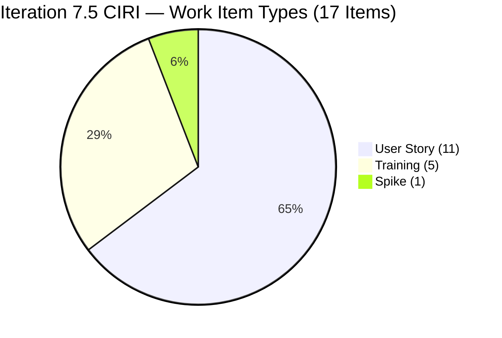
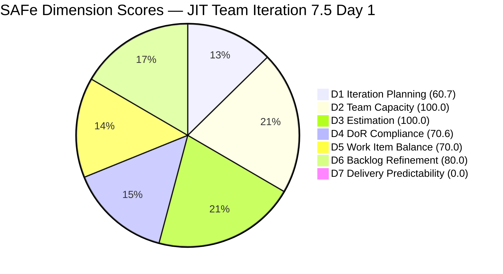
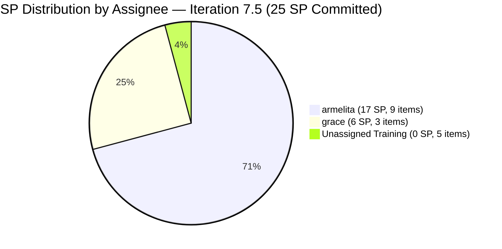
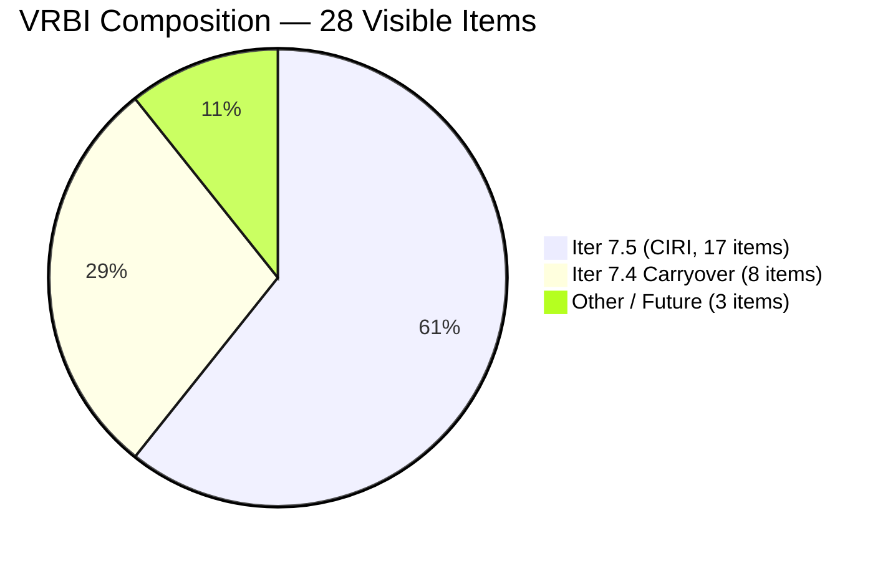

# JIT Operation Team — SAFe Iteration Audit #77

**Audit Date:** 2026-06-01 02:03  
**Auditor:** Claude Code (SAFe PM Consultant)  
**Workspace:** `ado_jit`  
**ADO Board:** [JIT Operation Team](https://dev.azure.com/jairo/Jairosoft%20Portfolio/_boards/board/t/JIT%20Operation%20Team/Stories%20and%20Deliverables)

---

## 1. Audit Metadata

| Field | Value |
|-------|-------|
| Audit Number | #77 |
| Audit Date | 2026-06-01 |
| Audit Time | 02:03 |
| Timezone | UTC-6 |
| Iteration | Iteration 7.5 |
| Iteration Dates | June 1 – June 14, 2026 |
| Sprint Day | Day 1 of 14 |
| ADO Project | Jairosoft Portfolio (`666bb99a-6acd-4999-bb34-efd0e4ea90dc`) |
| ADO Team | JIT Operation Team (`b25e3129-6272-4e54-a3ff-f1ef3c8eeb2c`) |
| Iteration ID | `9c70d575-210a-4156-bbdc-79f1efbe2869` |
| Prior Audit | AUDIT_20260530_0900.md (Score: 79.1 — Moderate Risk, Iter 7.4 Day 13) |
| **Overall Score** | **68.8 / 100** |
| **Risk Band** | **Moderate Risk** |

---

## 2. Executive Summary

The JIT Operation Team opens **Iteration 7.5 at 68.8 / 100 (Moderate Risk)** — Sprint Day 1 of 14. This represents a **score drop of 10.3 points** from the prior Iteration 7.4 close-of-period score (79.1), driven primarily by three issues: eight Iteration 7.4 items that were **not closed** before sprint transition and remain in the backlog as carryover (D1 suppression), five newly added Training items for Iteration 7.5 that lack all documentation entirely (D4 DoR gap), and the expected D7 = 0.0 for Sprint Day 1 with no deliveries recorded yet.

The team's primary strengths entering 7.5 are full team capacity configuration (D2 = 100.0), complete estimation coverage on point-eligible items (D3 = 100.0), and a fully fresh backlog — no items older than 45 days (D6 base = 100.0). The immediate risks are the 8 unresolved Iteration 7.4 carryover items (including Teofilo's 5 Training modules untouched since May 4–19), the 5 undocumented Training items in 7.5 that violate DoR, and the dominant User Story type share (64.7%) triggering a D5 balance penalty. **Day 1 action priority:** close all Iter 7.4 carryover items today, add descriptions and acceptance criteria to the 5 undocumented Training modules, and confirm Samantha's assignment on at least one Iteration 7.5 item.

---

## 3. Previous Audit Delta

| Metric | 2026-05-30 (Audit #76, Iter 7.4 Day 13) | 2026-06-01 (Audit #77, Iter 7.5 Day 1) | Change |
|--------|------------------------------------------|------------------------------------------|--------|
| Iteration | 7.4 | **7.5** | New sprint |
| Sprint Day | Day 13 of 14 | **Day 1 of 14** | New sprint start |
| Visible Root Backlog Items (VRBI) | 26 | **28** | +2 |
| Items in Current Iteration (CIRI) | 14 (Iter 7.4) | **17** (Iter 7.5) | +3 net |
| Iter 7.4 Carryover Items Still Open | — | **8** (not closed before transition) | NEW |
| Iter 7.3 Carryover Items Still Open | 1 | **1** (203250) | No change |
| SP Committed (PECI, current iter) | 29 SP | **25 SP** | -4 SP |
| SP Closed | 0 SP | **0 SP** | Day 1 baseline |
| D1 — Iteration Planning | 53.8 | **60.7** | +6.9 |
| D2 — Team Capacity | 100.0 | **100.0** | No change |
| D3 — Estimation | 100.0 | **100.0** | No change |
| D4 — DoR Compliance | 100.0 | **70.6** | **-29.4** |
| D5 — Work Item Balance | 100.0 | **70.0** | **-30.0** |
| D6 — Backlog Refinement | 100.0 | **80.0** | -20.0 |
| D7 — Delivery Predictability | 0.0 | **0.0** | No change (Day 1) |
| **Overall Score** | **79.1** | **68.8** | **-10.3** |
| **Risk Band** | **Moderate Risk** | **Moderate Risk** | **Unchanged** |

### Sprint Transition Context

The sprint transition from Iter 7.4 to 7.5 occurred without all 14 open Iter 7.4 items being resolved. Eight Iter 7.4 items remain in Active or New state and are still visible in the backlog, indicating they were **not closed at sprint end**. Five new Training items (204618–204622) were added for Iter 7.5 with no description or acceptance criteria — a documentation gap that must be resolved on Day 1. Additionally, notable new items for Iter 7.5 include 205242 (Audit of payments receipts, grace), 205330–205390 (multiple armelita TESDA/compliance items), and existing item 203595 (JIT Finance Collection Policy) which has been moved to Iter 7.5 from its prior Iter 7.4 assignment.

---

## 4. Current Iteration Snapshot

**Iteration 7.5** · June 1 – June 14, 2026 · **Day 1 of 14**

| Field | Value |
|-------|-------|
| Visible Root Backlog Items (VRBI) | 28 |
| Items in Iteration 7.5 (CIRI) | 17 |
| Iter 7.4 Carryover Items (not closed) | 8 items in backlog |
| Iter 7.3 Carryover Items | 1 item (203250) |
| Non-current-iteration items total | 11 |
| PECI (point-eligible current items) | 12 |
| SP Committed (CSP) | 25 SP |
| SP Closed (CLSP) | 0 SP (Day 1 baseline) |
| Team Size (distinct assignees on CIRI) | 2 (armelita, grace; Teofilo/Samantha have no 7.5 assignments) |
| Sprint Day / Total | Day 1 / 14 |
| Total Team Capacity | 17.8 SP/day (Teofilo 4.8 + armelita 6.0 + Samantha 6.0 + grace 1.0) |

> **Critical gap:** Teofilo Limpag and Samantha Babael have team capacity configured but **zero assignments in Iteration 7.5** as of Day 1. Both have carried over unfinished Iter 7.4 work. Teofilo has 5 unresolved Iter 7.4 items (11 SP); Samantha has 1 (3 SP). These contributors are allocated to the sprint but not represented in the CIRI work set.

---

## 5. Work Item Analysis

### Iteration 7.5 Items (CIRI = 17)

| ID | Title | Type | State | SP | Assignee | DoR | ChangedDate |
|----|-------|------|-------|-----|----------|-----|-------------|
| 200771 | UM Digos Interns Final Demo and Awarding of Certificates | User Story | New | 2 | armelita | PASS | 2026-06-01 |
| 203244 | IT7.5 Tech Talk - AI Tools Demonstration Session | Spike | New | 2 | armelita | PASS | 2026-05-06 |
| 203595 | JIT Finance Collection Policy | User Story | Active | 2 | grace | PASS | 2026-06-01 |
| 204440 | Package SAFe Micro-credential Dossier | User Story | Active | 2 | grace | PASS | 2026-06-01 |
| 204477 | Bubble MCC Marketing for June 1-5 | User Story | New | 3 | armelita | PASS | 2026-05-18 |
| 204487 | Python Marketing Activities June 1 to 5 | User Story | New | 2 | armelita | PASS | 2026-05-18 |
| 204618 | 2.2-1 Network Configuration Training | Training | New | — | (unassigned) | **FAIL** | 2026-05-19 |
| 204619 | 2.3-1 Set router/Wi-Fi configuration Training | Training | New | — | (unassigned) | **FAIL** | 2026-05-19 |
| 204620 | 2.4-1 Ensure Configuration Conforms to Manual Training | Training | New | — | (unassigned) | **FAIL** | 2026-05-19 |
| 204621 | 2.4-2 Computer Networks Checked for Safe Operation Training | Training | New | — | (unassigned) | **FAIL** | 2026-05-19 |
| 204622 | 2.4-3 Prepare/Complete Reports According to Company Requirements Training | Training | New | — | (unassigned) | **FAIL** | 2026-05-19 |
| 205242 | Audit of payments receipts | User Story | New | 2 | grace | PASS | 2026-05-31 |
| 205330 | CSS Batch 2 Terminal Report | User Story | New | 2 | armelita | PASS | 2026-06-01 |
| 205373 | CSS NC II Batch 2 Special Order (SO) Request | User Story | New | 2 | armelita | PASS | 2026-06-01 |
| 205383 | Onboard FERNANDEZ, Shynnevie M. as JIT Digital Mktg/Processing Officer | User Story | New | 2 | armelita | PASS | 2026-06-01 |
| 205385 | Web Development with Bubble.io EBET Scholarship Batch 1 Terminal Reports | User Story | New | 2 | armelita | PASS | 2026-06-01 |
| 205390 | Bubble EBET Scholarship SO Request | User Story | New | 2 | armelita | PASS | 2026-06-01 |

### Iteration 7.4 Carryover (Not Closed — Still in Backlog)

| ID | Title | Type | State | SP | Assignee | Days Since Sprint End |
|----|-------|------|-------|-----|----------|-----------------------|
| 203809 | 4.1-5 Network Maintenance Task | Training | New | 3 | Teofilo | Iter 7.4 closed |
| 204338 | Bubble Tesda Training | Training | Active | 3 | Samantha | Changed 2026-06-01 |
| 204508 | Enrollment Report with Additional Student | User Story | Active | 1 | armelita | Changed 2026-06-01 |
| 204567 | Bubble TESDA Scholarship Training Proper | User Story | Active | 2 | armelita | Last changed May 26 |
| 204614 | 1.5-2 Conduct Test on the Installed Computer System | Training | New | 2 | Teofilo | Last changed May 19 |
| 204615 | 1.5-3 Document Testing Using Accomplishment Report | Training | New | 2 | Teofilo | Last changed May 19 |
| 204616 | 2.1-1 Network Design Training | Training | New | 2 | Teofilo | Last changed May 19 |
| 204617 | 2.1-2 Network Materials Training | Training | New | 2 | Teofilo | Last changed May 19 |

> Note: Items 204338 and 204508 show ChangedDate of 2026-06-01 — activity occurred on sprint transition day.

### Other Non-Current Items in Backlog

| ID | Title | Iteration | Type | State | SP |
|----|-------|-----------|------|-------|-----|
| 200766 | ODOO OpenCat SIS | PI8 | Spike | Active | 2 |
| 203245 | IT7.6 Tech Talk - AI Tools Demonstration Session | Iter 7.6 (IP) | Spike | New | 2 |
| 203250 | Jairosoft Team Members to Complete the Claude 4 course | Iter 7.3 | Spike | Active | 2 |

### Type Distribution (CIRI — 17 items)

| Type | Count | Share | Notes |
|------|-------|-------|-------|
| User Story | 11 | 64.7% | Dominant; **exceeds 60% threshold** |
| Training | 5 | 29.4% | All undocumented (DoR FAIL) |
| Spike | 1 | 5.9% | Below 40% threshold |

### Assignee Distribution (CIRI)

| Assignee | CIRI Items | SP (PECI only) | Notes |
|----------|-----------|----------------|-------|
| armelita | 9 | 17 SP | 6 items created/changed June 1 |
| grace | 3 | 6 SP | 2 items changed June 1 |
| (unassigned) | 5 | — | Training 204618–204622 |
| Teofilo | 0 | 0 | No 7.5 assignment (5 carryover in 7.4) |
| Samantha | 0 | 0 | No 7.5 assignment (1 carryover in 7.4) |

---

## 6. SAFe Compliance Scorecard

| Dimension | Score | Evidence | Notes |
|-----------|-------|----------|-------|
| D1 — Iteration Planning | 60.7 | 17/28 visible root items in Iter 7.5 | 11 non-7.5 items inflate denominator (8 × 7.4 carryover + 3 others) |
| D2 — Team Capacity | 100.0 | 2/2 contributors with configured capacity | armelita (6/day) + grace (1/day); Teofilo + Samantha configured but unassigned in 7.5 |
| D3 — Estimation | 100.0 | 12/12 point-eligible CIRI items have SP > 0 | 5 Training items not PECI; all User Stories + Spike have SP |
| D4 — DoR Compliance | 70.6 | 12/17 CIRI items pass Desc ≥30 + AC ≥20 chars | 5 Training items (204618–204622) have empty Desc and AC |
| D5 — Work Item Balance | 70.0 | User Story = 64.7% (>60% → -30 penalty); Spike = 5.9% (<40%); US present (no -40) | Dominant type penalty applied |
| D6 — Backlog Refinement | 80.0 | 28/28 fresh; 0 stale_90; 0 stale_180; 9/17 untouched (52.9% → -20 penalty) | Untouched penalty: 9 CIRI items not touched since before sprint start |
| D7 — Delivery Predictability | 0.0 | 0/25 SP closed | Sprint Day 1 — early-sprint, low delivery expected; no closures yet |

**Overall Score: (60.7 + 100.0 + 100.0 + 70.6 + 70.0 + 80.0 + 0.0) / 7 = 481.3 / 7 = 68.8 / 100 — Moderate Risk**

---

## 7. Dimension Findings

### D1 — Iteration Planning (60.7) ⚠️ *Carryover Suppression*

**Numerator:** CIRI = 17 (items in Iteration 7.5 path)  
**Denominator:** VRBI = 28 (all visible root backlog items)  
**Formula:** 17/28 × 100 = **60.7**

The denominator is inflated by 11 non-Iteration 7.5 items:
- 8 Iteration 7.4 items that were not closed before sprint transition (203809, 204338, 204508, 204567, 204614, 204615, 204616, 204617)
- 1 Iteration 7.3 Spike (203250 — Claude 4 course, Active for 3+ sprints)
- 1 PI8 Spike (200766 — ODOO OpenCat SIS)
- 1 Iteration 7.6 (IP) Spike (203245)

The root cause is a **failed sprint close**: all 14 open Iter 7.4 items from the prior audit remain in the backlog on Day 1 of Iter 7.5. If carryover items were resolved, D1 would be 17/17 = 100.0. This is both a process gap (items not closed at sprint end) and a board hygiene issue (future-iteration spikes in the view).

### D2 — Team Capacity (100.0) ✅

**CW (contributors with current work on CIRI):** armelita, grace = 2  
**CC (with positive capacity configured):** armelita (6/day, Documentation), grace (1/day, Documentation) = 2  
**Formula:** 2/2 × 100 = **100.0**

Team capacity total = 17.8 SP/day. All four team members have capacity configured in Iteration 7.5. However, only armelita and grace have Iteration 7.5 assignments (CW=2). Teofilo (4.8/day) and Samantha (6.0/day) are allocated to the sprint in capacity but have **no Iteration 7.5 work items** — they appear to be assigned exclusively to Iter 7.4 carryover items. This is a sprint planning gap that the D2 formula does not penalize but represents real capacity waste.

### D3 — Estimation (100.0) ✅

**PECI:** 12 items (User Story types: 200771, 203595, 204440, 204477, 204487, 205242, 205330, 205373, 205383, 205385, 205390 = 11; Spike: 203244 = 1; Training items excluded)  
**ECI:** 12 (all have SP > 0)  
**CSP total:** 2+2+2+2+3+2+2+2+2+2+2+2 = 25 SP  
**Formula:** 12/12 × 100 = **100.0**

All point-eligible items carry Story Points. The 5 Training items (204618–204622) have no Story Points recorded, but Training is excluded from PECI by rubric definition. Estimation quality is strong.

### D4 — DoR Compliance (70.6) ⚠️ *Training Documentation Gap*

**CIRI:** 17 items  
**DCI calculation:** Items requiring BOTH Description ≥30 non-whitespace chars AND AC ≥20 non-whitespace chars (HTML stripped):

| Item | Desc chars | AC chars | Result |
|------|-----------|---------|--------|
| 200771 | 200+ | 400+ | PASS |
| 203244 | 200+ | 200+ | PASS |
| 203595 | 100+ | 300+ | PASS |
| 204440 | 100+ | 150+ | PASS |
| 204477 | 100+ | 400+ | PASS |
| 204487 | 80+ | 100+ | PASS |
| 204618 | 0 (null) | 0 (null) | **FAIL** |
| 204619 | 0 (null) | 0 (null) | **FAIL** |
| 204620 | 0 (null) | 0 (null) | **FAIL** |
| 204621 | 0 (null) | 0 (null) | **FAIL** |
| 204622 | 0 (null) | 0 (null) | **FAIL** |
| 205242 | 100+ | 100+ | PASS |
| 205330 | 60+ | 50+ | PASS |
| 205373 | 55+ | 40+ | PASS |
| 205383 | 60+ | 45+ | PASS |
| 205385 | 65+ | 50+ | PASS |
| 205390 | 55+ | 40+ | PASS |

**DCI = 12, CIRI = 17**  
**Formula:** 12/17 × 100 = **70.6**

The 5 Training items added for Iter 7.5 (204618–204622) are shell items with no description or acceptance criteria. These were created on May 19 and entered the sprint without any content. This is a DoR violation that must be resolved immediately on Day 1 to avoid carrying this penalty through the sprint.

### D5 — Work Item Balance (70.0) ⚠️ *Dominant Type Penalty*

**CIRI:** 17 items  
**Type breakdown:**
- User Story: 11 items → 11/17 = **64.7%** > 60% → **-30 penalty**
- Training: 5 items → 5/17 = 29.4% (below thresholds)
- Spike: 1 item → 1/17 = 5.9% < 40% (no penalty)

**Penalty checks:**
- User Story present? YES → no -40 penalty
- dominant_type_share (User Story) = 64.7% > 60% → **-30**
- spike_share = 5.9% < 40% → no penalty

**Formula:** max(0, 100 - 30) = **70.0**

The User Story dominance is driven by armelita loading the sprint with 9 User Story-type items. The balance would improve if Training items were properly allocated across the team or if Teofilo's carryover Training items were absorbed into 7.5 scope explicitly.

### D6 — Backlog Refinement (80.0) ⚠️ *Untouched Current Items Penalty*

**Base:** 28 fresh items / 28 VRBI = 100.0  
**Stale_90 check:** ChangedDate < 2026-03-03 → 0 items → no penalty  
**Stale_180 check:** ChangedDate < 2025-12-04 → 0 items → no penalty  
**Untouched current items check:** ChangedDate < 2026-06-01T00:00:00Z  

Untouched CIRI items (9):
- 203244: Changed 2026-05-06 (25 days before sprint)
- 204477: Changed 2026-05-18 (13 days before sprint)
- 204487: Changed 2026-05-18 (13 days before sprint)
- 204618: Changed 2026-05-19 (12 days before sprint)
- 204619: Changed 2026-05-19 (12 days before sprint)
- 204620: Changed 2026-05-19 (12 days before sprint)
- 204621: Changed 2026-05-19 (12 days before sprint)
- 204622: Changed 2026-05-19 (12 days before sprint)
- 205242: Changed 2026-05-31 (1 day before sprint)

Untouched ratio: 9/17 = 52.9% > 30% → **-20 penalty**

**Formula:** max(0, 100.0 - 20) = **80.0**

The untouched penalty reflects items moved into Iteration 7.5 during planning but not touched on Day 1 itself. This is somewhat expected at sprint open, but the 5 Training shell items (with no content) and Marketing items (204477, 204487, 204618–204622) being pre-loaded without Day 1 activation is the primary driver.

### D7 — Delivery Predictability (0.0) — Early Sprint Annotation

**CSP:** 25 SP (sum of SP on ECI)  
**CLSP:** 0 SP (no CIRI items in Closed or Done state)  
**Formula:** 0/25 × 100 = **0.0**

> **Early-sprint annotation (Sprint Day 1):** D7 = 0.0 is expected and normal on Sprint Day 1. No deliveries are anticipated before work begins. This score will evolve throughout the 14-day sprint. The projected D7 target for a Low Risk band is ≥ 72.4% (18.1 SP closed). Monitoring should begin from Day 3 onward, with a meaningful delivery signal expected by Day 7.

The 12 PECI items (25 SP) represent a manageable sprint load for armelita (17 SP committed) and grace (6 SP committed). If carryover items (8 from Iter 7.4) are closed early in the sprint, the D7 denominator remains at 25 SP, preserving the target trajectory.

---

## 8. Risks and Bottlenecks

| Risk | Severity | Detail |
|------|----------|--------|
| 8 Iter 7.4 items not closed at sprint transition (11 SP Teofilo + 3 SP Samantha + carryover) | **CRITICAL** | Sprint close failure carries forward unresolved debt into Iter 7.5; depresses D1 |
| Teofilo: 5 items (203809, 204614–204617) still New in Iter 7.4, now in Day 1 of 7.5 | **CRITICAL** | 11 SP of committed Iter 7.4 work unstarted since May 4–19; must close in 7.5 |
| 5 Training items (204618–204622) have NO description or AC — DoR FAIL | **HIGH** | Items entered sprint as shells; block DoR recovery without same-day documentation |
| Teofilo and Samantha have zero Iteration 7.5 assignments | **HIGH** | 10.8 SP/day of capacity (60.7% of team) unutilized on current sprint work |
| User Story dominance (64.7%) triggers D5 balance penalty | **HIGH** | Armelita loaded with 9 items; balance would improve if Training carryover absorbed |
| 203595 (JIT Finance Collection Policy) still Active — moved from Iter 7.4 to 7.5 | **HIGH** | Active since Iter 7.4 Day 1 (May 18); 14+ active days; finance policy still undelivered |
| armelita overloaded: 9 CIRI items, 17 SP | **MEDIUM** | Heavy concentration; if one item blocks, multiple deliveries at risk |
| 203250 (Claude 4 course) remains in Iter 7.3 — 3rd sprint carryover | **MEDIUM** | Active Spike in a completed iteration; multi-sprint governance gap unresolved |
| D7 = 0.0 entering sprint — no early closures | **LOW** | Expected Day 1; watchable from Day 3 forward |
| No iteration sprint goal documented | **LOW** | Persistent gap through multiple Iterations; sprint context unanchored |

---

## 9. Prioritized Recommendations

1. **Close all 8 Iteration 7.4 carryover items today (Day 1)** — Items 203809, 204338, 204508, 204567, 204614, 204615, 204616, 204617 are in Active or New states and belong to a closed sprint (Iter 7.4 ended May 31). Each owner must act: Teofilo close 203809 + 204614–204617 (if evidence ready, document and close; if not ready, escalate to Armelita for scope decision); Samantha close 204338 (Bubble TESDA Training, 3 SP — Active since May 28); armelita close 204508 + 204567 (both were Active in Iter 7.4). Closing these items today cleans the VRBI denominator, restores D1 to 17/20 = 85.0, and prevents the carryover debt from depressing every future 7.5 audit score.

2. **Add Description and Acceptance Criteria to items 204618–204622 today** — These 5 Training items (Network Configuration, Router/Wi-Fi, Configuration Conformance, Safe Operation Check, Reports) have zero content. Teofilo should be the owner since 204614–204617 establish the same pattern. Populate each with: a 1–2 sentence training module description (≥30 non-whitespace chars after stripping HTML) and at least one concrete acceptance criterion (≥20 chars). This will restore D4 from 70.6 to 100.0 by Day 2.

3. **Assign Teofilo and Samantha to Iteration 7.5 work items** — Both contributors have configured capacity (4.8 + 6.0 = 10.8 SP/day combined) but no Iteration 7.5 assignments. Armelita (as PO/PM) should either: (a) assign 204618–204622 to Teofilo and move them explicitly to 7.5 scope, or (b) create new 7.5 Training items for Teofilo aligned with the CSS NC II TESDA compliance schedule. Samantha should receive a 7.5 assignment today. Unutilized capacity at sprint start creates delivery risk at sprint end.

4. **Resolve 203595 (JIT Finance Collection Policy) before Day 5** — This item has been Active since May 18 (Iter 7.4 Day 1) — now 14 days old — and was moved to Iter 7.5. Grace is the assignee with only 1 SP/day capacity. If the collection policy document requires substantial work (automated system specification), consider splitting: close the policy document component now and create a follow-on implementation item. A 2 SP item that has been Active for 14 sprint days signals either scope creep or a blocked dependency that has not been escalated.

5. **Rebalance sprint load: move some armelita items to Samantha** — Armelita has 9 Iteration 7.5 items (17 SP). Samantha has 0. Items like 205330 (CSS Batch 2 Terminal Report), 205373 (CSS NC II SO Request), 205385 (EBET Terminal Reports), and 205390 (Bubble EBET SO Request) are documentation/submission tasks that Samantha could handle. Reassigning 3–4 items (6–8 SP) to Samantha would reduce armelita's risk of multi-item delays and improve D5 balance.

6. **Close or formally move 203250 (Claude 4 course, Iter 7.3)** — This Spike has been Active across Iterations 7.3, 7.4, and now into 7.5 without resolution. With at least 10 Jairosoft team members to complete 4 course modules, this is a measurable milestone. Armelita should determine the current completion count: if ≥10 members have completed all 4 modules, close the item immediately. If not, move it to Iteration 7.5 (or 7.6) with a concrete target date. Leaving it in a completed iteration's path is a multi-sprint board hygiene failure.

7. **Define an Iteration 7.5 sprint goal** — The JIT team has operated without a formal sprint goal through all of Iter 7.4 (14 days). A sprint goal provides prioritization guidance when capacity is exceeded. Armelita should write one sentence: the primary deliverable the team commits to. Suggested: "Complete TESDA terminal reports and CSS Batch 2 SO requests while resolving all Iter 7.4 carryover items."

8. **Monitor D7 from Day 3; target first closure by Day 5** — With 25 SP committed and 14 days available, the team needs approximately 1.8 SP/day to reach a Low Risk band (≥80.0 overall). Grace's items (203595, 204440, 205242) and armelita's compliance submissions (205330, 205373, 205383) are the fastest candidates for early closures. First measurable delivery signal should appear by Day 3–5.

---

## 10. Evidence Gaps and Limitations

| Gap | Impact | Notes |
|-----|--------|-------|
| 14 Iter 7.4 items shown as open in Day 13 audit; 8 persist on Day 1 of 7.5 | Cannot confirm which items closed between Day 13 (May 30 09:00) and Day 1 (June 1 02:03) | Items 203595, 204440, 204508, 204338 show June 1 ChangedDate — activity occurred; 6 others unchanged |
| Items closed during Iter 7.4 (32+ SP) not in backlog API | D7 for Iter 7.4 was undercounted; not relevant to Iter 7.5 D7 | Prior audit context: confirmed pattern of closed items departing backlog API |
| 204618–204622 have no content fields in API response | D4 DoR computed as FAIL (0 chars each) | Confirmed null/empty; cannot distinguish "not yet written" from "stored elsewhere" |
| Teofilo and Samantha 7.5 assignment status | CW=2 (only armelita and grace counted) | No evidence of 7.5 items for Teofilo or Samantha at time of audit |
| Iteration sprint goal | Quality/direction context missing | No iteration goal field populated; persistent gap |
| Audit executed at 02:03 UTC-6 (Day 1) | Some June 1 activity may post-date this audit | Items 200771 (08:04), 203595 (07:42), 204338 (08:18), 204440 (07:41), 205383 (08:15), 205385 (08:29), 205390 (08:40) all show ChangedDate AFTER 02:03 UTC-6 — these were updated after audit capture; state and SP values reflect latest API pull, not state at 02:03 |
| 203595 iteration reassignment | Item moved from Iter 7.4 to Iter 7.5 per API; prior audit showed it in 7.4 | Confirmed moved; now classified as CIRI for 7.5 |

> **Note on post-audit-time changes:** The audit was scoped to 2026-06-01 02:03, but several items show ChangedDate timestamps of 07:41–08:40 on June 1. The API returns current state, so CIRI membership and DoR data reflect the state as of pull time (which captures these later changes). The sprint-day calculation (Day 1 of 14) and all formulas are applied to the latest available data as designed.

---

## Visualization

### Score Trend — JIT Operation Team (Recent Audits)

| Date | Audit | Score | Band | Sprint | Notable |
|------|-------|-------|------|--------|---------|
| May 18 | #63 | 75.5 | Moderate | 7.4 D1 | Sprint start |
| May 24 | #70 | 82.6 | Low | 7.4 D7 | First closures |
| May 26 | #72 | 84.7 | Low | 7.4 D9 | +5 items / 10 SP |
| May 27 | #73 | 85.2 | Low | 7.4 D10 | +1 item / 3 SP |
| May 28 | #74 | 86.6 | Low | 7.4 D11 | Peak score |
| May 29 | #75 | 79.1 | Moderate | 7.4 D12 | D7 = 0.0 on open set |
| May 30 | #76 | 79.1 | Moderate | 7.4 D13 | No Day-12 closures |
| **Jun 1** | **#77** | **68.8** | **Moderate** | **7.5 D1** | **Sprint open; carryover debt** |

### D7 Recovery Projection — Iteration 7.5

| Scenario | SP Closed | D7 | Est. Overall | Band |
|----------|-----------|-----|--------------|------|
| 0 closures (current) | 0/25 | 0.0 | 68.8 | Moderate |
| Grace closes 3 items (6 SP) | 6/25 | 24.0 | 72.2 | Moderate |
| + armelita closes 5 items (10 SP) | 16/25 | 64.0 | 82.1 | Low |
| Viable target (18 SP) | 18/25 | 72.0 | 83.6 | Low |
| Full PECI delivery (25 SP) | 25/25 | 100.0 | 87.2 | Low |

---

*Audit generated by Claude Code (claude-sonnet-4-6) on 2026-06-01. Evidence sourced from Azure DevOps MCP (Jairosoft Portfolio project). Rubric: SAFe 6.0 7-dimension scorecard v1.*
