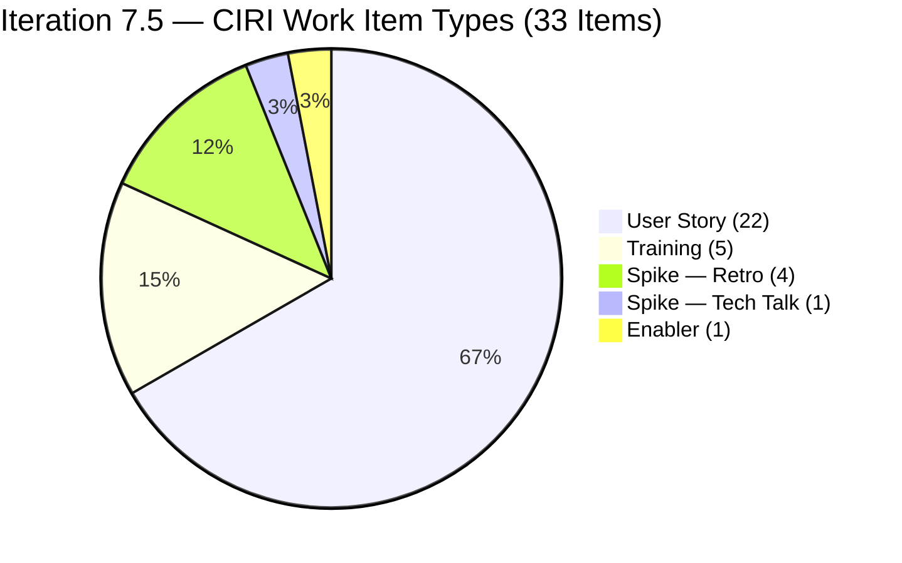
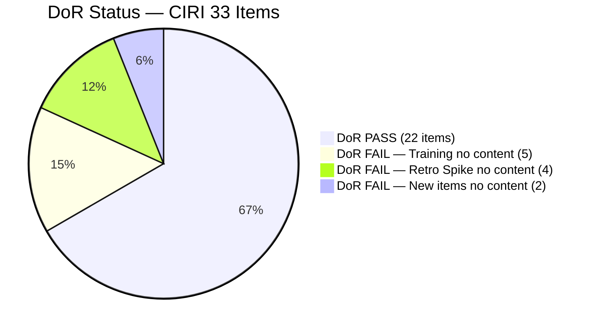
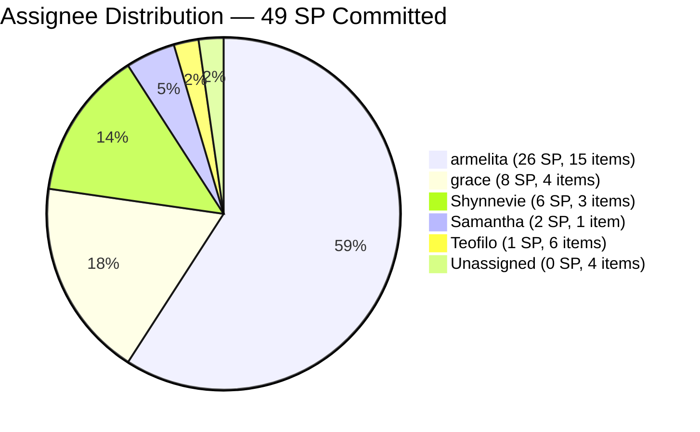
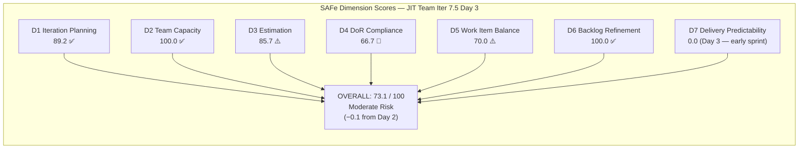

# ADO SAFe Audit — JIT Operation Team

## 1. Audit Metadata

| Field | Value |
|-------|-------|
| Audit Number | #79 |
| Audit Date | 2026-06-03 |
| Audit Time | 02:07 UTC |
| Timezone | UTC |
| Iteration | Iteration 7.5 |
| Iteration Dates | 2026-06-01 – 2026-06-14 |
| Sprint Day | Day 3 of 14 |
| ADO Project | Jairosoft Portfolio (`666bb99a-6acd-4999-bb34-efd0e4ea90dc`) |
| ADO Team | JIT Operation Team (`b25e3129-6272-4e54-a3ff-f1ef3c8eeb2c`) |
| Iteration ID | `9c70d575-210a-4156-bbdc-79f1efbe2869` |
| Iteration Path | `Jairosoft Portfolio\2026-PI7\Iteration 7.5` |
| Workspace | `ado_jit` |
| Prior Audit | AUDIT_20260602_0907.md (Score: 73.2 — Moderate Risk, Day 2) |
| **Overall Score** | **73.1 / 100** |
| **Risk Band** | **Moderate Risk** |

---

## 2. Executive Summary

Iteration 7.5 is on **Day 3 of 14** and the JIT Operation Team scores **73.1 / 100 (Moderate Risk)** — effectively flat from Day 2's 73.2 (a change of −0.1). The sprint expanded significantly overnight: **3 new items added** (205577, 205683, 205687) and a new item type appeared (Enabler: 205658 — Batch 2 Results, assigned to Teofilo). VRBI grew from 34 to **37 items** and CIRI from 30 to **33 items**.

The most notable development is **Teofilo Limpag now has Iter 7.5 assignments** — the 5 Training shell items (204618–204622) are now assigned to him, and a new Enabler (205658) was created for him today. The Day-2 concern about Teofilo's unallocated 4.8 SP/day capacity is partially addressed, though the Training items still lack Description and Acceptance Criteria.

**Score drivers today:**
- D1 improves slightly to **89.2** (33/37 vs 30/34 = same ratio) — actually 33/37 = 89.2 vs 30/34 = 88.2, essentially the same
- D3 drops marginally to **85.7** (24/28 vs 21/25 — new Enabler added to PECI with SP)
- D4 drops to **66.7** (22/33 vs 21/30 — 3 new items: 205687 no Desc/AC, 205577 and 205683 pass DoR, but 205658 Enabler fails)
- D6 holds at **100.0** (no staleness)
- D7 remains **0.0** (Day 3, no closures yet)

**Critical open gaps:** 5 Training items (204618–204622) remain completely undocumented; 4 Retro Spikes (205538–205541) still unassigned and unestimated; new items 205687 and 205658 also lack DoR content. D4 at 66.7 is the primary drag on the score.

---

## 3. Previous Audit Delta

| Metric | Audit #78 (2026-06-02, Day 2) | Audit #79 (2026-06-03, Day 3) | Change |
|--------|-------------------------------|-------------------------------|--------|
| Sprint Day | Day 2 of 14 | **Day 3 of 14** | +1 day |
| VRBI | 34 | **37** | **+3** |
| CIRI | 30 | **33** | **+3** |
| New Items Added | — | **205577, 205683, 205687, 205658** | +4 new items (205383 removed) |
| Training items assigned to Teofilo | 0 | **5** (204618–204622 now assigned to Teofilo) | +5 |
| Items Closed | 0 | **0** | No change |
| SP Committed (CSP) | 44 SP | **49 SP** | **+5 SP** |
| DoR Compliant (DCI) | 21 | **22** | +1 |
| D1 — Iteration Planning | 88.2 | **89.2** | +1.0 |
| D2 — Team Capacity | 100.0 | **100.0** | No change |
| D3 — Estimation | 84.0 | **85.7** | +1.7 |
| D4 — DoR Compliance | 70.0 | **66.7** | **−3.3** |
| D5 — Work Item Balance | 70.0 | **70.0** | No change |
| D6 — Backlog Refinement | 100.0 | **100.0** | No change |
| D7 — Delivery Predictability | 0.0 | **0.0** | No change (Day 3) |
| **Overall Score** | **73.2 (Moderate Risk)** | **73.1 (Moderate Risk)** | **−0.1** |
| **Risk Band** | **Moderate Risk** | **Moderate Risk** | Unchanged |

### Day 2 → Day 3 Transition Notes

Three new user-facing items were added by Shynnevie Fernandez and grace on June 3 morning:
- **205577** (Bubble.IO TESDA Scholarship Batch 2 — Final List, Shynnevie, Active, 3 SP, DoR PASS)
- **205683** (BATCH 1 Requirements Compilation EBET Scholarship, Shynnevie, Active, 1 SP, DoR PASS)
- **205687** (Jairosoft 1st Graduation June 2026, grace, New, 2 SP, DoR FAIL — no Desc/AC)

A new Enabler item was created for Teofilo:
- **205658** (Batch 2 Results, Teofilo, New, 1 SP, DoR FAIL — no Desc/AC)

Item **205383** (Onboard Shynnevie Fernandez — previously Active, armelita, 2 SP) no longer appears in the VRBI backlog, indicating it was closed or moved. If closed, this represents the first sprint completion though it is not reflected in CLSP (item not in CIRI for this audit as it is not in VRBI).

The Training shell items (204618–204622) are now assigned to Teofilo Limpag — a positive governance improvement. Their content (Desc, AC) still needs to be written.

---

## 4. Current Iteration Snapshot

**Iteration 7.5** · 2026-06-01 – 2026-06-14 · **Day 3 of 14**

| Field | Value |
|-------|-------|
| Visible Root Backlog Items (VRBI) | 37 |
| Items in Iteration 7.5 (CIRI) | 33 |
| Non-CIRI VRBI items | 4 (200766 PI8, 203245 Iter 7.6 IP, 203250 Iter 7.3, 204338 Iter 7.4) |
| PECI (User Story + Spike + Enabler) | 28 |
| ECI (PECI with SP > 0) | 24 |
| SP Committed (CSP) | 49 SP |
| SP Closed (CLSP) | 0 SP |
| DoR Compliant Items (DCI) | 22 / 33 |
| Distinct Assignees on CIRI | 5 (armelita, grace, Samantha, Shynnevie, Teofilo) |
| Team Capacity (configured) | 23.8 SP/day (Shynnevie 6, Teofilo 4.8, armelita 6, Samantha 6, grace 1) |
| Items in Active State | 7 (203595, 204440, 205385, 205507, 205574, 205577, 205683) |
| Sprint Day / Total | Day 3 / 14 |

---

## 5. Work Item Analysis

### CIRI Items — Iteration 7.5 (33 root-level items)

| ID | Title | Type | State | SP | Assignee | DoR | ChangedDate |
|----|-------|------|-------|----|----------|-----|-------------|
| 200771 | UM Digos Interns Final Demo and Awarding | User Story | New | 2 | armelita | PASS | 2026-06-01 |
| 203244 | IT7.5 Tech Talk — AI Tools Demonstration | Spike | New | 2 | armelita | PASS | 2026-06-02 |
| 203595 | JIT Finance Collection Policy | User Story | Active | 2 | grace | PASS | 2026-06-01 |
| 204440 | Package SAFe Micro-credential Dossier | User Story | Active | 2 | grace | PASS | 2026-06-02 |
| 204477 | Bubble MCC Marketing for June 1–5 | User Story | New | 3 | armelita | PASS | 2026-06-02 |
| 204487 | Python Marketing Activities June 1 to 5 | User Story | New | 2 | armelita | PASS | 2026-05-18 |
| 204618 | 2.2-1 Network Configuration Training | Training | New | — | Teofilo | **FAIL** | 2026-06-03 |
| 204619 | 2.3-1 Set Router/Wi-Fi Configuration Training | Training | Marketing | — | Teofilo | **FAIL** | 2026-06-03 |
| 204620 | 2.4-1 Ensure Config Conforms to Manual Training | Training | New | — | Teofilo | **FAIL** | 2026-06-03 |
| 204621 | 2.4-2 Computer Networks Checked Training | Training | Marketing | — | Teofilo | **FAIL** | 2026-06-03 |
| 204622 | 2.4-3 Prepare Reports Training | Training | New | — | Teofilo | **FAIL** | 2026-06-03 |
| 205242 | Audit of payments receipts | User Story | New | 2 | grace | PASS | 2026-06-02 |
| 205330 | CSS Batch 2 Terminal Report | User Story | New | 2 | armelita | PASS | 2026-06-02 |
| 205373 | CSS NC II Batch 2 Special Order (SO) Request | User Story | New | 2 | armelita | PASS | 2026-06-02 |
| 205385 | EBET Scholarship Batch 1 Terminal Reports | User Story | Active | 2 | armelita | PASS | 2026-06-02 |
| 205390 | Bubble EBET Scholarship SO Request | User Story | New | 2 | armelita | PASS | 2026-06-02 |
| 205394 | Bubble EBET Scholarship Batch 1 Billing | User Story | New | 2 | armelita | PASS | 2026-06-02 |
| 205396 | Bubble EBET Scholarship Batch 1 Payroll | User Story | New | 2 | armelita | PASS | 2026-06-02 |
| 205399 | Bubble EBET Scholarship Batch 2 | User Story | New | 2 | armelita | PASS | 2026-06-02 |
| 205401 | Request for Bubble EBET Scholarship Batch 2 TIP | User Story | New | 2 | armelita | PASS | 2026-06-02 |
| 205403 | Bubble EBET Scholarship Batch 2 TIP | User Story | New | 2 | armelita | PASS | 2026-06-02 |
| 205405 | Bubble EBET Scholarship Batch 2 Training Enrollment Report | User Story | New | 2 | armelita | PASS | 2026-06-02 |
| 205411 | NEMSU Interview and Onboarding | User Story | New | 1 | armelita | PASS | 2026-06-02 |
| 205507 | Compile Bubble Training Records | User Story | Active | 2 | Samantha | PASS | 2026-06-02 |
| 205538 | [Retro] Increase number of training hours | Spike | New | — | (unassigned) | **FAIL** | 2026-06-02 |
| 205539 | [Retro] Create material for workflows | Spike | New | — | (unassigned) | **FAIL** | 2026-06-02 |
| 205540 | [Retro] Review training material instructions | Spike | New | — | (unassigned) | **FAIL** | 2026-06-02 |
| 205541 | [Retro] eLMS crash | Spike | New | — | (unassigned) | **FAIL** | 2026-06-02 |
| 205574 | Bubble EBET Scholarship Reels | User Story | Active | 2 | Shynnevie | PASS | 2026-06-02 |
| 205577 | Bubble.IO TESDA Scholarship Batch 2 — Final List | User Story | Active | 3 | Shynnevie | PASS | 2026-06-03 |
| 205658 | Batch 2 Results | Enabler | New | 1 | Teofilo | **FAIL** | 2026-06-03 |
| 205683 | BATCH 1 — Requirements Compilation EBET Scholarship | User Story | Active | 1 | Shynnevie | PASS | 2026-06-03 |
| 205687 | Jairosoft 1st Graduation June 2026 | User Story | New | 2 | grace | **FAIL** | 2026-06-03 |

### Non-CIRI VRBI Items

| ID | Title | Iteration | Type | State | Assignee |
|----|-------|-----------|------|-------|---------|
| 200766 | ODOO OpenCat SIS | PI8 | Spike | Active | armelita |
| 203245 | IT7.6 Tech Talk | Iter 7.6 IP | Spike | New | armelita |
| 203250 | Jairosoft Team Members to Complete Claude 4 Course | Iter 7.3 | Spike | Active | armelita |
| 204338 | Bubble Tesda Training | Iter 7.4 | Training | Training | Samantha |

### Item Type Distribution (CIRI = 33)

| Type | Count | Share | Notes |
|------|-------|-------|-------|
| User Story | 22 | 66.7% | Dominant; > 60% threshold → −30 penalty |
| Training | 5 | 15.2% | All assigned to Teofilo; all DoR FAIL |
| Spike | 5 | 15.2% | 1 tech talk (SP) + 4 Retro (no SP, DoR FAIL) |
| Enabler | 1 | 3.0% | #205658 Batch 2 Results — no Desc/AC |

### Assignee Distribution (CIRI)

| Assignee | CIRI Items | CIRI SP | Active Items | Notes |
|----------|-----------|---------|--------------|-------|
| armelita | 15 | 26 SP | 1 (205385) | 11 EBET/TESDA items; still heavily loaded |
| grace | 4 | 8 SP | 1 (203595) | 205687 (graduation) lacks DoR |
| Samantha Babael | 1 | 2 SP | 1 (205507) | Stable |
| Shynnevie Fernandez | 3 | 6 SP | 3 (205574, 205577, 205683) | Newest items — all Active |
| Teofilo Limpag | 6 | 1 SP | 0 | 5 Training (no content) + 1 Enabler (no content); 0 Active items |
| Unassigned | 4 | 0 SP | 0 | 4 Retro Spikes |

---

## 6. SAFe Compliance Scorecard

| Dimension | Score | Evidence | Notes |
|-----------|-------|----------|-------|
| D1 — Iteration Planning | **89.2** | CIRI 33 / VRBI 37 | +1.0 from Day 2; 4 non-CIRI items: PI8, Iter 7.6, Iter 7.3, Iter 7.4 |
| D2 — Team Capacity | **100.0** | CC 5 / CW 5 | All 5 contributors (armelita, grace, Samantha, Shynnevie, Teofilo) have positive capacity |
| D3 — Estimation | **85.7** | ECI 24 / PECI 28 | 4 Retro Spikes (no SP) depress score; Training items not PECI; new Enabler 205658 has 1 SP (counted) |
| D4 — DoR Compliance | **66.7** | DCI 22 / CIRI 33 | 11 failing: 5 Training + 4 Retro Spikes + 205687 (no Desc/AC) + 205658 (no Desc/AC) |
| D5 — Work Item Balance | **70.0** | US = 66.7% (>60% → −30); Spike 15.2% (<40%); US present (no −40) | User Story dominance structural |
| D6 — Backlog Refinement | **100.0** | 37/37 fresh; 0 stale; untouched 1/33 (3.0% ≤ 10%) | 204487 still untouched (May 18) but ratio below 10% threshold |
| D7 — Delivery Predictability | **0.0** | CLSP 0 / CSP 49 | Day 3 — early sprint; 7 Active items; first closures expected Day 3–4 |

**Overall = (89.2 + 100.0 + 85.7 + 66.7 + 70.0 + 100.0 + 0.0) / 7 = 511.6 / 7 = 73.1 / 100 — Moderate Risk**

---

## 7. Dimension Findings

### D1 — Iteration Planning (89.2) ✅

- VRBI = 37 (backlog API, 37 root-level items)
- CIRI = 33 (IterationPath = Iter 7.5; non-CIRI: 200766 PI8, 203245 Iter 7.6, 203250 Iter 7.3, 204338 Iter 7.4)
- Formula: 33/37 × 100 = **89.2**
- Slight improvement from Day 2 (88.2). If 204338 (Samantha's TESDA carryover) were resolved or moved to 7.5, and 203250 (Claude 4 course, Iter 7.3) were closed, D1 would reach 33/35 = 94.3.

### D2 — Team Capacity (100.0) ✅

- CW = 5: armelita, grace, Samantha, Shynnevie, Teofilo (all have CIRI items)
- CC = 5: All have positive capacity — Shynnevie 6, Teofilo 4.8, armelita 6, Samantha 6, grace 1 (total 23.8 SP/day)
- Formula: 5/5 × 100 = **100.0**
- Teofilo now has 6 CIRI items (5 Training + 1 Enabler) — his capacity utilization is now visible in the iteration. However, his 6 items have no SP (Training items don't expose SP; Enabler has 1 SP), meaning his 4.8 SP/day capacity is backed by only 1 estimable story point, creating a velocity gap.

### D3 — Estimation (85.7) ⚠️

- PECI = 28 (22 User Story + 5 Spike + 1 Enabler; Training items excluded)
- ECI = 24: All 22 User Stories have SP; Spike 203244 = 2 SP; Enabler 205658 = 1 SP; Retro Spikes 205538–205541 = no SP
- CSP = 49 SP total
- Unestimated PECI: 4 Retro Spikes (205538–205541)
- Formula: 24/28 × 100 = **85.7**
- Marginal improvement from Day 2 (84.0) because the Enabler 205658 has 1 SP (adds to ECI without adding to unestimated). Assigning even 1 SP to each Retro Spike would restore D3 to 28/28 = 100.0.

### D4 — DoR Compliance (66.7) ⚠️ Deteriorating

- CIRI = 33; DCI = 22
- PASS (22): All 20 User Stories except #205687 + tech talk Spike #203244 + (21 total pass = 22 with 203244)
- FAIL (11):
  - Training 204618–204622: No Desc, No AC (5 items, Teofilo — assigned but not yet documented)
  - Retro Spikes 205538–205541: No Desc, No AC (4 items, unassigned)
  - Enabler 205658: No Desc, No AC (1 item, Teofilo — created today)
  - User Story 205687 (Jairosoft 1st Graduation): No Desc, No AC (1 item, grace — created today without content)
- Formula: 22/33 × 100 = **66.7**
- D4 dropped from 70.0 (Day 2) to 66.7 today as 2 new undocumented items were added (205687, 205658) while only 2 new passing items (205577, 205683) joined. Full remediation (11 items documented) would push D4 to 100.0, adding +4.8 points to the overall score.

### D5 — Work Item Balance (70.0) ⚠️ Structural

- CIRI = 33; User Story = 22 (66.7%) > 60% → −30; Spike = 5 (15.2%) < 40% → no −20; US present → no −40
- Formula: max(0, 100 − 30) = **70.0**
- Structural penalty unchanged. With 33 CIRI items, User Stories would need to drop to ≤ 19 (57.6%) to eliminate the dominant-type penalty — unlikely given the team's work profile.

### D6 — Backlog Refinement (100.0) ✅

- VRBI = 37; fresh (ChangedDate ≥ 2026-04-19) = 37 → base = 100.0
- Stale_90 (< 2026-03-04): 0; Stale_180 (< 2025-12-04): 0
- Untouched CIRI (ChangedDate < 2026-06-01): 204487 (May 18) = 1 item; 1/33 = 3.0% ≤ 10% → no penalty
- Formula: max(0, 100.0) = **100.0**
- Full backlog activity maintained. New items created June 3 ensure all but 204487 are freshly touched.

### D7 — Delivery Predictability (0.0) — Early Sprint

- CSP = 49 SP (ECI = 24 items: 22 US + 1 Spike + 1 Enabler)
- CLSP = 0 SP (no CIRI items in Closed or Done state)
- Formula: 0/49 × 100 = **0.0**
- **Early-sprint annotation (Day 3 of 14):** D7 = 0.0 remains expected. Seven CIRI items are in Active state (203595, 204440, 205385, 205507, 205574, 205577, 205683) representing 12 SP. If these close by Day 5, D7 = 12/49 = 24.5. Achieving Low Risk requires overall ≥ 80.0, implying D7 needs to reach approximately 67.7 (33 SP closed) with D1–D6 remaining at current values.
- Sprint load at 49 SP is the highest of Iteration 7.5 to date. Given team capacity of 23.8 SP/day over 11 remaining days (261.8 SP-days theoretical), 49 SP should be achievable if all items are properly sequenced.

---

## 8. Risks and Bottlenecks

| Risk | Severity | Status | Detail |
|------|----------|--------|--------|
| 11 CIRI items have no Desc or AC (D4 = 66.7) | **CRITICAL** | Worsening day-over-day | 5 Training (Teofilo) + 4 Retro Spikes (unassigned) + 205687 (grace) + 205658 (Teofilo); resolution today restores D4 to 100.0 |
| 4 Retro Spikes unassigned, unestimated, undocumented | **HIGH** | Day 3 without owner | 205538–205541 remain with no SP, no assignee, no content; 3rd consecutive day |
| Teofilo's 6 CIRI items all lack Desc/AC | **HIGH** | New governance gap | 5 Training + 1 Enabler assigned today with zero documentation; 4.8 SP/day capacity needs work items with proper content |
| 205687 (Graduation, grace) added without DoR | **HIGH** | New today | Created today without Desc or AC; should be documented before next audit |
| 204338 (TESDA Training, Iter 7.4, Samantha) still unresolved | **HIGH** | Persistent | In "Training" custom state, Iter 7.4 path — not in CIRI; Samantha's carryover obligation |
| 203250 (Claude 4 course, Iter 7.3) still Active | **MEDIUM** | 4th sprint carryover | Multi-sprint governance failure; armelita should close or move to Iter 7.5 |
| armelita: 15 CIRI items (26 SP) — ownership concentration | **MEDIUM** | Persistent | 45% of CIRI items; 7 EBET series + 3 CSS/marketing = structural bottleneck |
| D7 = 0.0 entering Day 3 — no deliveries | **MODERATE** | Expected through Day 4 | 7 Active items = 12 SP available for early closure |
| 49 SP total commitment vs. 11 days remaining | **LOW** | Monitor | Achievable but tight; armelita holds 26 SP and would need ~2.4 SP/day average to clear her share |

---

## 9. Prioritized Recommendations

1. **Document all 11 DoR-failing items today (Day 3, CRITICAL)** — Resolution restores D4 from 66.7 to 100.0, adding +4.8 points to the overall score and pushing toward 78.0 (still Moderate but approaching Low Risk threshold).
   - *Teofilo*: Write Desc + AC for 204618–204622 (Network/WiFi/Configuration Training) and 205658 (Batch 2 Results). Each Training Desc should cover the training objective (≥ 30 chars); each AC should define "done" for the training session (≥ 20 chars). Teofilo has domain knowledge for these items.
   - *armelita or grace*: Write Desc + AC for 205538–205541 (Retro Spikes). These represent retrospective improvement actions — the Desc should state the investigation goal; the AC should define what "improvement" looks like and how it will be measured.
   - *grace*: Write Desc + AC for 205687 (Jairosoft 1st Graduation June 2026). Describe the graduation ceremony deliverable and define what "done" means (venue, attendees, certificates issued, etc.).

2. **Assign and estimate the 4 Retro Spikes (Day 3, CRITICAL)** — 205538–205541 remain unassigned for the 3rd consecutive day. Assign an owner from the team (armelita for 205539/205540 — training quality, Teofilo for 205541 — eLMS crash, armelita for 205538 — training hours). Assign 1 SP each. Completing this restores D3 from 85.7 to 100.0, adding +2.0 points.

3. **Close 205507 (Compile Bubble Records, Samantha) and 205574 (Reels, Shynnevie) by Day 4 (HIGH)** — Both items are Active and are well-scoped. 205507 should be closeable given Samantha has been working on it since Day 2. 205574 (reels) is a content creation deliverable. Closing both (4 SP) starts D7 recovery: D7 = 4/49 = 8.2; overall ≈ 74.2.

4. **Resolve or move 204338 (Bubble TESDA Training, Iter 7.4) — Day 3 (HIGH)** — Samantha's carryover item has been in "Training" state in a completed iteration path for 4+ audits. It should be: (a) Closed if training is complete, (b) Moved to Iter 7.5 so it becomes CIRI and is properly tracked, or (c) Cancelled if no longer applicable. Any path eliminates a D1 drag item.

5. **Define and assign Teofilo's sprint story points explicitly (MODERATE)** — Teofilo has 4.8 SP/day capacity but only 1 estimable SP (Enabler 205658) in his CIRI items. Training items don't expose SP, meaning his velocity is essentially invisible to the rubric. Create at least one additional estimable item (User Story or Enabler) for Teofilo's CIRI work to properly represent his contribution.

6. **Prioritize armelita's Active item 205385 (EBET Batch 1 Terminal Reports) for early closure (MODERATE)** — This is the most mature EBET item (Active since Day 2). Closing it (2 SP) shows TESDA compliance delivery progress. The terminal report submission is a high-value milestone for the EBET Scholarship program.

7. **Define a sprint goal for Iteration 7.5 (MODERATE)** — Suggested: *"Deliver EBET Scholarship Batch 1 & 2 compliance documentation, complete TESDA terminal reports, onboard Shynnevie fully, and resolve all retrospective action spikes — all within PI7 Iteration 7.5."*

---

## 10. Evidence Gaps and Limitations

| Gap | Impact | Notes |
|-----|--------|-------|
| 205383 (Onboard Shynnevie, 2 SP) dropped from VRBI | Cannot confirm if Closed | If closed, represents the first sprint delivery (2 SP); not in CIRI so not counted in CLSP. Prior audit listed as Active; likely closed between Jun 2 and Jun 3 |
| 204338 in "Training" custom state (Iter 7.4) | Cannot map to standard lifecycle | "Training" is custom ADO state; item remains in non-standard path; excluded from CIRI |
| Training items (204618–204622) have no SP | PECI excludes Training type | Training type does not expose Story Points in this ADO configuration; Teofilo's 4.8 SP/day capacity has minimal estimable SP coverage |
| Retro Spikes unassigned for 3 days | D3 and D4 both penalized | 205538–205541 still unowned; no action since creation on June 2 |
| 203595 (JIT Finance Policy) Active since May 18 | Extended Active duration | 16+ active days on a 2 SP item; possible blocker not documented in ADO |
| 203250 (Claude 4 course, Iter 7.3) | Multi-sprint carryover | 4th sprint in Active state; governance gap |
| Sprint goal absent | Not scored; process concern | No sprint goal for 4th consecutive iteration |
| 49 SP committed — highest to date | D7 recovery projection affected | Higher SP denominator means more closures needed to reach Low Risk threshold |

---

## Visualizations

### Score Trend — JIT Operation Team (Iteration 7.5)

| Date | Audit | Score | Band | Sprint Day | Notable |
|------|-------|-------|------|-----------|---------|
| Jun 1 | #77 | 68.8 | Moderate | Day 1 | Sprint open; carryover debt; D1=60.7 |
| Jun 2 | #78 | 73.2 | Moderate | Day 2 | Sprint replanned; +13 items; Shynnevie onboarded |
| **Jun 3** | **#79** | **73.1** | **Moderate** | **Day 3** | **+3 items; Teofilo assigned; D4 drops** |

### D7 Recovery Projection — Iteration 7.5 (49 SP Committed)

| Scenario | SP Closed | D7 | Est. Overall | Band |
|----------|-----------|-----|--------------|------|
| 0 closures (current, Day 3) | 0/49 | 0.0 | 73.1 | Moderate |
| 2 Active items close (4 SP) | 4/49 | 8.2 | 74.2 | Moderate |
| 4 Active items close (8 SP) | 8/49 | 16.3 | 75.5 | Moderate |
| Mid-sprint target (25 SP) | 25/49 | 51.0 | 80.4 | Low |
| Viable Low Risk target (33 SP) | 33/49 | 67.3 | 82.8 | Low |
| Full PECI delivery (49 SP) | 49/49 | 100.0 | 87.9 | Low |

> Note: D7 projections assume D1–D6 remain constant. Resolving all DoR gaps (D4 → 100.0) and estimating Retro Spikes (D3 → 100.0) would add approximately +6.8 points base, moving the Low Risk threshold to approximately 26 SP closed.

---

*Audit #79 generated by Claude Code (claude-sonnet-4-6) on 2026-06-03 02:07 UTC. Evidence sourced from Azure DevOps MCP (Jairosoft Portfolio project, team b25e3129-6272-4e54-a3ff-f1ef3c8eeb2c). Rubric: SAFe 6.0 7-dimension scorecard v1. Iteration 7.5 is Day 3 of 14. Score: 73.1 / 100 (Moderate Risk). Priority actions: document 11 DoR-failing items, assign and estimate Retro Spikes, begin first closures from 7 Active items.*
