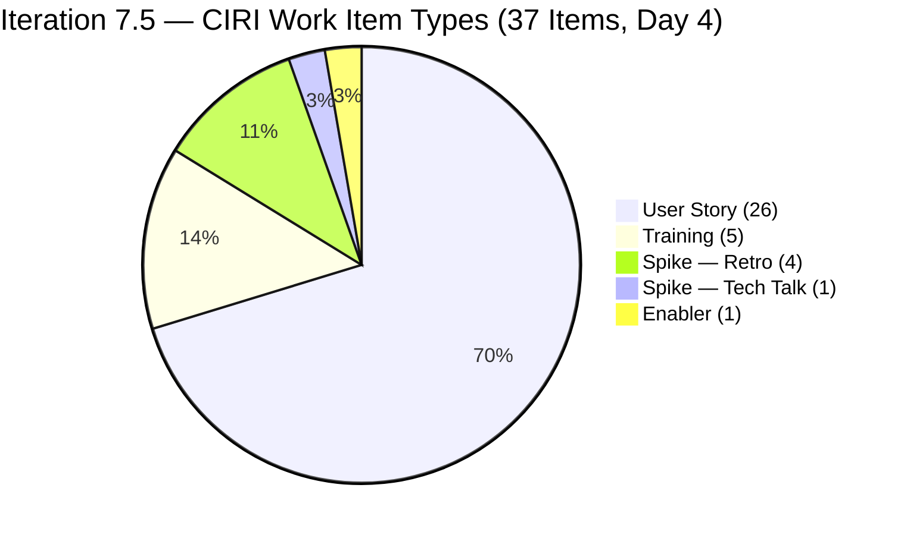
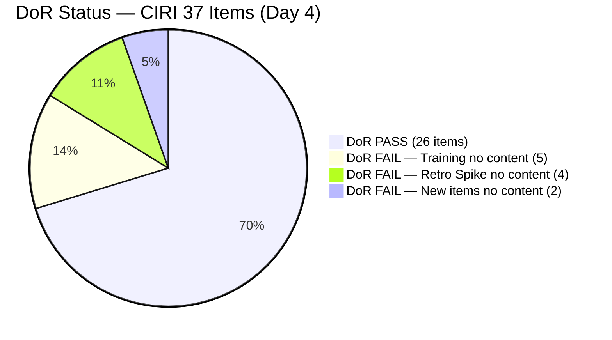
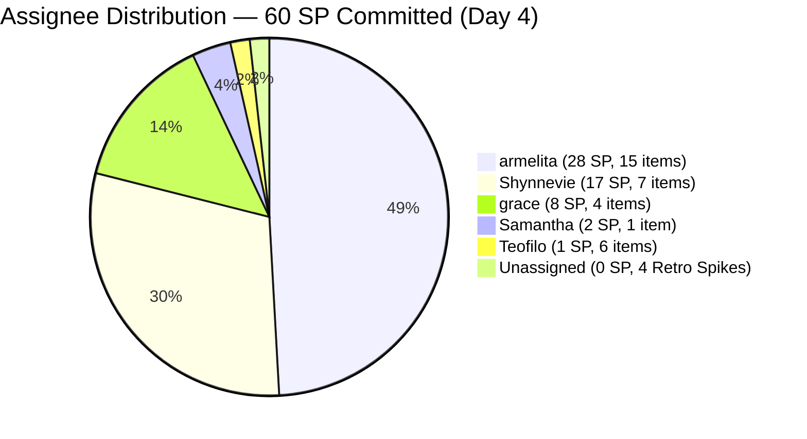
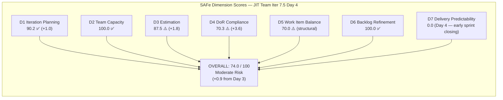

# ADO SAFe Audit — JIT Operation Team

## 1. Audit Metadata

| Field | Value |
|-------|-------|
| Audit Number | #80 |
| Audit Date | 2026-06-04 |
| Audit Time | 00:04 UTC |
| Timezone | UTC |
| Iteration | Iteration 7.5 |
| Iteration Dates | 2026-06-01 – 2026-06-14 |
| Sprint Day | Day 4 of 14 |
| ADO Project | Jairosoft Portfolio (`666bb99a-6acd-4999-bb34-efd0e4ea90dc`) |
| ADO Team | JIT Operation Team (`b25e3129-6272-4e54-a3ff-f1ef3c8eeb2c`) |
| Iteration ID | `9c70d575-210a-4156-bbdc-79f1efbe2869` |
| Iteration Path | `Jairosoft Portfolio\2026-PI7\Iteration 7.5` |
| Workspace | `ado_jit` |
| Prior Audit | AUDIT_20260603_0207.md (Score: 73.1 — Moderate Risk, Day 3) |
| **Overall Score** | **74.0 / 100** |
| **Risk Band** | **Moderate Risk** |

---

## 2. Executive Summary

Iteration 7.5 is on **Day 4 of 14** and the JIT Operation Team improves to **74.0 / 100 (Moderate Risk)** — up **+0.9 points** from Day 3's 73.1. The sprint continued its expansion overnight: **4 more items added by Shynnevie Fernandez** (205692, 205699, 205701, 205703), all with Descriptions and Acceptance Criteria that pass DoR. VRBI grew from 37 to **41 items** and CIRI from 33 to **37 items**.

The primary gain comes from **D4 (DoR Compliance) improving from 66.7 to 70.3** as 4 new passing items joined without any new failing items being added. D3 (Estimation) also ticked up marginally to **87.5** (28 estimated of 32 eligible). **D7 remains at 0.0** — no sprint deliveries have been recorded yet on Day 4, which becomes an increasing concern as Days 1–5 of the early-sprint window draw to a close.

The critical unresolved gaps are unchanged for the fourth consecutive day: **11 items still lack Desc/AC** (5 Training + 4 Retro Spikes + #205687 + #205658). Also notable: two Training items (204618, 204621) show ChangedDate of 2026-06-04, suggesting Teofilo touched them this morning but did not add DoR content. The Low Risk threshold remains attainable if DoR gaps are resolved and first deliveries occur today.

---

## 3. Previous Audit Delta

| Metric | Audit #79 (2026-06-03, Day 3) | Audit #80 (2026-06-04, Day 4) | Change |
|--------|-------------------------------|-------------------------------|--------|
| Sprint Day | Day 3 of 14 | **Day 4 of 14** | +1 day |
| VRBI | 37 | **41** | **+4** |
| CIRI | 33 | **37** | **+4** |
| New Items Added | — | **205692, 205699, 205701, 205703** (Shynnevie) | +4 new items |
| Items Closed | 0 | **0** | No change |
| SP Committed (CSP) | 49 SP | **60 SP** | **+11 SP** |
| DoR Compliant (DCI) | 22 | **26** | +4 |
| DoR Failing | 11 | **11** | No change (11 still fail) |
| Training items touched Jun 4 | 0 | **2** (204618, 204621 — ChangedDate Jun 4) | Activity noted, no DoR content |
| D1 — Iteration Planning | 89.2 | **90.2** | +1.0 |
| D2 — Team Capacity | 100.0 | **100.0** | No change |
| D3 — Estimation | 85.7 | **87.5** | +1.8 |
| D4 — DoR Compliance | 66.7 | **70.3** | **+3.6** |
| D5 — Work Item Balance | 70.0 | **70.0** | No change |
| D6 — Backlog Refinement | 100.0 | **100.0** | No change |
| D7 — Delivery Predictability | 0.0 | **0.0** | No change (Day 4) |
| **Overall Score** | **73.1 (Moderate Risk)** | **74.0 (Moderate Risk)** | **+0.9** |
| **Risk Band** | **Moderate Risk** | **Moderate Risk** | Unchanged |

### Day 3 → Day 4 Transition Notes

Shynnevie Fernandez added four new User Stories on June 3 afternoon/evening — all in Iter 7.5 with proper Desc and AC:
- **205692** (BATCH 2 BUBBLE.IO EBET — Preparation for Induction Training, Shynnevie, New, 3 SP, DoR PASS)
- **205699** (Batch 2 BUBBLE EBET — Prepare Training Material, Shynnevie, New, 3 SP, DoR PASS)
- **205701** (BATCH 2 BUBBLE.IO EBET — ITP Template Reels, Shynnevie, New, 3 SP, DoR PASS)
- **205703** (BATCH 2 BUBBLE.IO EBET — ID for the Scholar, Shynnevie, New, 2 SP, DoR PASS)

Teofilo updated Training items 204618 (ChangedDate 2026-06-04T02:44) and 204621 (ChangedDate 2026-06-04T02:47) — but no Description or Acceptance Criteria were added in these updates. The items remain DoR-failing.

Item **205394** (Bubble EBET Scholarship Batch 1 Billing) moved to **Active** state (ChangedDate 2026-06-04T01:07) — armelita is progressing on billing work.

---

## 4. Current Iteration Snapshot

**Iteration 7.5** · 2026-06-01 – 2026-06-14 · **Day 4 of 14** · 10 days remaining

| Field | Value |
|-------|-------|
| Visible Root Backlog Items (VRBI) | 41 |
| Items in Iteration 7.5 (CIRI) | 37 |
| Non-CIRI VRBI items | 4 (200766 PI8, 203245 Iter 7.6 IP, 203250 Iter 7.3, 204338 Iter 7.4) |
| PECI (User Story + Spike + Enabler) | 32 |
| ECI (PECI with SP > 0) | 28 |
| SP Committed (CSP) | 60 SP |
| SP Closed (CLSP) | 0 SP |
| DoR Compliant Items (DCI) | 26 / 37 |
| DoR Failing Items | 11 (5 Training + 4 Retro Spikes + #205687 + #205658) |
| Distinct Assignees on CIRI | 5 (armelita, grace, Samantha, Shynnevie, Teofilo) |
| Team Capacity (configured) | 23.8 SP/day total |
| Items in Active State | 8 (203595, 204440, 204618, 205385, 205394, 205507, 205574, 205577, 205683) |
| Sprint Day / Total | Day 4 / 14 |

---

## 5. Work Item Analysis

### CIRI Items — Iteration 7.5 (37 root-level items)

| ID | Title | Type | State | SP | Assignee | DoR | ChangedDate |
|----|-------|------|-------|----|----------|-----|-------------|
| 200771 | UM Digos Interns Final Demo and Awarding | User Story | New | 2 | armelita | PASS | 2026-06-01 |
| 203244 | IT7.5 Tech Talk — AI Tools Demonstration | Spike | New | 2 | armelita | PASS | 2026-06-02 |
| 203595 | JIT Finance Collection Policy | User Story | Active | 2 | grace | PASS | 2026-06-01 |
| 204440 | Package SAFe Micro-credential Dossier | User Story | Active | 2 | grace | PASS | 2026-06-02 |
| 204477 | Bubble MCC Marketing for June 1–5 | User Story | New | 3 | armelita | PASS | 2026-06-02 |
| 204487 | Python Marketing Activities June 1 to 5 | User Story | New | 2 | armelita | PASS | 2026-05-18 |
| 204618 | 2.2-1 Network Configuration Training | Training | Active | — | Teofilo | **FAIL** | 2026-06-04 |
| 204619 | 2.3-1 Set Router/Wi-Fi Configuration Training | Training | New | — | Teofilo | **FAIL** | 2026-06-04 |
| 204620 | 2.4-1 Ensure Config Conforms to Manual Training | Training | New | — | Teofilo | **FAIL** | 2026-06-03 |
| 204621 | 2.4-2 Computer Networks Checked Training | Training | New | — | Teofilo | **FAIL** | 2026-06-04 |
| 204622 | 2.4-3 Prepare Reports Training | Training | New | — | Teofilo | **FAIL** | 2026-06-03 |
| 205242 | Audit of payments receipts | User Story | New | 2 | grace | PASS | 2026-06-02 |
| 205330 | CSS Batch 2 Terminal Report | User Story | New | 2 | armelita | PASS | 2026-06-02 |
| 205373 | CSS NC II Batch 2 Special Order (SO) Request | User Story | New | 2 | armelita | PASS | 2026-06-02 |
| 205385 | EBET Scholarship Batch 1 Terminal Reports | User Story | Active | 2 | armelita | PASS | 2026-06-04 |
| 205390 | Bubble EBET Scholarship SO Request | User Story | New | 2 | armelita | PASS | 2026-06-02 |
| 205394 | Bubble EBET Scholarship Batch 1 Billing | User Story | **Active** | 2 | armelita | PASS | 2026-06-04 |
| 205396 | Bubble EBET Scholarship Batch 1 Payroll | User Story | New | 2 | armelita | PASS | 2026-06-02 |
| 205399 | Bubble EBET Scholarship Batch 2 | User Story | New | 2 | armelita | PASS | 2026-06-02 |
| 205401 | Request for Bubble EBET Scholarship Batch 2 TIP | User Story | New | 2 | armelita | PASS | 2026-06-02 |
| 205403 | Bubble EBET Scholarship Batch 2 TIP | User Story | New | 2 | armelita | PASS | 2026-06-02 |
| 205405 | Bubble EBET Scholarship Batch 2 Training Enrollment Report | User Story | New | 2 | armelita | PASS | 2026-06-02 |
| 205411 | NEMSU Interview and Onboarding | User Story | New | 1 | armelita | PASS | 2026-06-02 |
| 205507 | Compile Bubble Training Records | User Story | Active | 2 | Samantha | PASS | 2026-06-02 |
| 205538 | [Retro] Increase number of training hours | Spike | New | — | (unassigned) | **FAIL** | 2026-06-02 |
| 205539 | [Retro] Create material for workflows | Spike | New | — | (unassigned) | **FAIL** | 2026-06-02 |
| 205540 | [Retro] Review training material instructions | Spike | New | — | (unassigned) | **FAIL** | 2026-06-02 |
| 205541 | [Retro] eLMS crash | Spike | New | — | (unassigned) | **FAIL** | 2026-06-02 |
| 205574 | Bubble EBET Scholarship Reels | User Story | Active | 2 | Shynnevie | PASS | 2026-06-02 |
| 205577 | Bubble.IO TESDA Scholarship Batch 2 — Final List | User Story | Active | 3 | Shynnevie | PASS | 2026-06-03 |
| 205658 | Batch 2 Results | Enabler | New | 1 | Teofilo | **FAIL** | 2026-06-03 |
| 205683 | BATCH 1 — Requirements Compilation EBET Scholarship | User Story | Active | 1 | Shynnevie | PASS | 2026-06-03 |
| 205687 | Jairosoft 1st Graduation June 2026 | User Story | New | 2 | grace | **FAIL** | 2026-06-03 |
| 205692 | BATCH 2 BUBBLE.IO EBET — Preparation for Induction Training | User Story | New | 3 | Shynnevie | PASS | 2026-06-03 |
| 205699 | Batch 2 — BUBBLE EBET — Prepare Training Material | User Story | New | 3 | Shynnevie | PASS | 2026-06-03 |
| 205701 | BATCH 2 — BUBBLE.IO EBET — ITP Template Reels | User Story | New | 3 | Shynnevie | PASS | 2026-06-03 |
| 205703 | BATCH 2 — BUBBLE.IO EBET — ID for the Scholar | User Story | New | 2 | Shynnevie | PASS | 2026-06-03 |

### Non-CIRI VRBI Items

| ID | Title | Iteration | Type | State | Assignee |
|----|-------|-----------|------|-------|---------|
| 200766 | ODOO OpenCat SIS | PI8 | Spike | Active | armelita |
| 203245 | IT7.6 Tech Talk | Iter 7.6 IP | Spike | New | armelita |
| 203250 | Jairosoft Team Members to Complete Claude 4 Course | Iter 7.3 | Spike | Active | armelita |
| 204338 | Bubble Tesda Training | Iter 7.4 | Training | Training | Samantha |

### Item Type Distribution (CIRI = 37)

| Type | Count | Share | DoR Status |
|------|-------|-------|-----------|
| User Story | 26 | 70.3% | 22 PASS, 1 FAIL (#205687) |
| Training | 5 | 13.5% | All 5 FAIL (no Desc/AC) |
| Spike | 5 | 13.5% | 1 PASS (#203244), 4 FAIL (Retro) |
| Enabler | 1 | 2.7% | 1 FAIL (#205658, no Desc/AC) |

### Assignee Distribution (CIRI = 37)

| Assignee | CIRI Items | CIRI SP | Active Items | DoR Failing | Notes |
|----------|-----------|---------|--------------|-------------|-------|
| armelita | 15 | 28 SP | 3 (205385, 205394, Active) | 0 | 15 items; 205394 now Active |
| grace | 4 | 8 SP | 1 (203595) | 1 (#205687) | Graduation item still lacks DoR |
| Samantha Babael | 1 | 2 SP | 1 (205507) | 0 | Stable |
| Shynnevie Fernandez | 7 | 17 SP | 3 (205574, 205577, 205683) | 0 | +4 new items today; all DoR PASS |
| Teofilo Limpag | 6 | 1 SP | 1 (204618) | 6 (5 Training + 1 Enabler) | Touched 2 training items Jun 4 (no DoR content added) |
| Unassigned | 4 | 0 SP | 0 | 4 (Retro Spikes) | 4th day unassigned |

---

## 6. SAFe Compliance Scorecard

| Dimension | Score | Evidence | Notes |
|-----------|-------|----------|-------|
| D1 — Iteration Planning | **90.2** | CIRI 37 / VRBI 41 | +1.0 from Day 3; 4 non-CIRI items: PI8, Iter 7.6 IP, Iter 7.3, Iter 7.4 |
| D2 — Team Capacity | **100.0** | CC 5 / CW 5 | All 5 contributors have positive capacity configured |
| D3 — Estimation | **87.5** | ECI 28 / PECI 32 | 4 Retro Spikes (no SP) = 4 unestimated; Training excluded; 4 new US have SP |
| D4 — DoR Compliance | **70.3** | DCI 26 / CIRI 37 | 11 failing: 5 Training + 4 Retro Spikes + #205687 + #205658; 4 new items all PASS |
| D5 — Work Item Balance | **70.0** | US = 70.3% (>60% → −30); Spike = 13.5% (<40%); US present (no −40) | Structural; US dominance growing |
| D6 — Backlog Refinement | **100.0** | 41/41 fresh; 0 stale; untouched 1/37 (2.7% ≤ 10%) | 204487 (May 18) still untouched; ratio stays below 10% threshold |
| D7 — Delivery Predictability | **0.0** | CLSP 0 / CSP 60 | Day 4 — no closures; 8 Active items = 14 SP available; end of early-sprint window tomorrow |

**Overall = (90.2 + 100.0 + 87.5 + 70.3 + 70.0 + 100.0 + 0.0) / 7 = 518.0 / 7 = 74.0 / 100 — Moderate Risk**

---

## 7. Dimension Findings

### D1 — Iteration Planning (90.2) ✅

- VRBI = 41; CIRI = 37
- Non-CIRI: 200766 (PI8), 203245 (Iter 7.6 IP), 203250 (Iter 7.3), 204338 (Iter 7.4)
- Formula: 37/41 × 100 = **90.2**
- Steady improvement: Day 1=60.7 → Day 2=88.2 → Day 3=89.2 → Day 4=90.2. Sprint is now well-planned with 90%+ of visible backlog in the current iteration.
- Resolving 203250 (Iter 7.3 carryover, armelita) would move D1 to 37/40 = 92.5. Resolving 204338 (Iter 7.4, Samantha) would add another point.

### D2 — Team Capacity (100.0) ✅

- CW = 5: armelita, grace, Samantha, Shynnevie, Teofilo (all have CIRI items)
- CC = 5: Shynnevie 6 hrs/day, Teofilo 4.8 hrs/day, armelita 6 hrs/day, Samantha 6 hrs/day, grace 1 hr/day
- Formula: 5/5 × 100 = **100.0**
- Note: Teofilo's 6 CIRI items have only 1 SP total (Enabler #205658). His 4.8 hrs/day capacity is theoretically backed by almost no estimable points — his Training items are excluded from PECI.

### D3 — Estimation (87.5) ⚠️

- PECI = 32 (26 User Story + 5 Spike + 1 Enabler; Training excluded)
- ECI = 28: All 26 US have SP; Spike #203244 = 2 SP; Enabler #205658 = 1 SP; Retro Spikes #205538–205541 = 0 SP
- CSP = 60 SP (4 new items add 11 SP: 3+3+3+2)
- Unestimated PECI: 4 Retro Spikes
- Formula: 28/32 × 100 = **87.5**
- Assigning 1 SP each to the 4 Retro Spikes would push D3 to 32/32 = 100.0, adding +1.8 points to overall.

### D4 — DoR Compliance (70.3) ⚠️

- CIRI = 37; DCI = 26; Failing = 11
- PASS (26): 25 User Stories except #205687 + Spike #203244 = 26
- FAIL (11):
  - Training 204618–204622: No Desc, No AC (5 items, Teofilo — touched Jun 4 but no content added)
  - Retro Spikes 205538–205541: No Desc, No AC (4 items, unassigned — 4th consecutive day)
  - Enabler 205658: No Desc, No AC (1 item, Teofilo)
  - User Story 205687 (Graduation, grace): No Desc, No AC (1 item — created Jun 3 without content)
- Formula: 26/37 × 100 = **70.3**
- Improvement from Day 3 (66.7) because 4 new passing items joined. Full remediation of 11 failing items → DCI = 37/37 = 100.0 (+4.2 points to overall).
- **Warning:** Teofilo touched Training items 204618 and 204621 at 02:44 and 02:47 UTC on Jun 4 but made no changes to Description or Acceptance Criteria fields. This suggests awareness of the items but no DoR action yet.

### D5 — Work Item Balance (70.0) ⚠️ Structural

- CIRI = 37; User Story = 26 (70.3%) > 60% → −30; Spike = 5 (13.5%) < 40% → no −20; US present → no −40
- Formula: max(0, 100 − 30) = **70.0**
- US share increased from 66.7% to 70.3% as Shynnevie added 4 User Stories. The dominant-type penalty continues to apply.

### D6 — Backlog Refinement (100.0) ✅

- VRBI = 41; fresh (ChangedDate ≥ 2026-04-20) = 41 → base = 100.0
  - 200766 changed 2026-05-03 (within 45 days of Jun 4) ✓
  - 204487 changed 2026-05-18 ✓
  - All other items changed Jun 1–4
- Stale_90 (< 2026-03-06): 0; Stale_180 (< 2025-12-07): 0
- Untouched CIRI (ChangedDate < 2026-06-01): only 204487 (2026-05-18) = 1/37 = 2.7% ≤ 10% → no penalty
- Formula: max(0, 100.0) = **100.0**

### D7 — Delivery Predictability (0.0) — Early Sprint, Escalating Urgency

- CSP = 60 SP; CLSP = 0 SP
- Formula: 0/60 × 100 = **0.0**
- **Early-sprint annotation (Day 4 of 14):** Day 4 is still within the Days 1–5 early-sprint window — however this is the last full day before the window closes. Day 5 (June 5) is the final early-sprint day.
- **8 Active items represent 14 SP** available for imminent closure: 203595, 204440, 204618, 205385, 205394, 205507, 205574, 205577, 205683.
- Achieving Low Risk (overall ≥ 80.0) with current D1–D6 values requires D7 ≥ 67.7 (i.e., ~41 SP closed of 60). This is a stretch target but achievable across 10 remaining sprint days with consistent daily delivery.

---

## 8. Risks and Bottlenecks

| Risk | Severity | Status | Detail |
|------|----------|--------|--------|
| 11 CIRI items lack Desc or AC (D4 = 70.3) | **CRITICAL** | 4th consecutive day unresolved | 5 Training (Teofilo) + 4 Retro Spikes (unassigned) + #205687 (grace) + #205658 (Teofilo); Teofilo touched 2 items Jun 4 but added no content |
| 4 Retro Spikes unassigned for 4 days | **CRITICAL** | 4th day without owner | 205538–205541 remain with no SP, no assignee, no content — actionable retrospective items decaying |
| D7 = 0.0 entering Day 4 — no deliveries yet | **HIGH** | Early-sprint window closing | Day 5 (June 5) closes early-sprint annotation; 8 Active items = 14 SP; first closure overdue |
| 205687 (Graduation, grace) no Desc/AC since Jun 3 | **HIGH** | 2nd day without content | 2 SP graduation story with zero documentation |
| 205658 (Batch 2 Results, Teofilo) no Desc/AC | **HIGH** | 2nd day without content | 1 SP Enabler assigned Jun 3 still undocumented |
| 204338 (TESDA Training, Iter 7.4, Samantha) unresolved | **HIGH** | Persistent multi-sprint | 5th sprint in non-standard state; Samantha's carryover obligation remains |
| armelita: 15 CIRI items (28 SP) — ownership concentration | **MEDIUM** | Growing | 40.5% of CIRI; 11 EBET/TESDA/CSS series items; 3 now Active; risk of sequencing bottleneck |
| Teofilo: 6 items, 1 SP, 4.8 SP/day capacity | **MEDIUM** | Governance gap | 5 Training (excluded from PECI) + 1 Enabler = effectively invisible velocity; his capacity is allocated but output unmeasurable by rubric |
| 203250 (Claude 4 course, Iter 7.3, armelita) | **LOW** | 5th sprint Active | Multi-sprint carryover; needs close or move |
| CSP = 60 SP — highest sprint load ever | **LOW** | Monitor | Up from 49 (Day 3); team capacity 23.8 SP/day × 10 remaining days = 238 SP-days theoretical; 60 SP is achievable but requires consistent delivery |

---

## 9. Prioritized Recommendations

1. **Document all 11 DoR-failing items TODAY (Day 4, CRITICAL)** — Day 5 closes the early-sprint window. Resolving all 11 pushes D4 from 70.3 → 100.0 (+4.2 points). Combined with Retro Spike estimation (+1.8 points D3), total gain = **+6.0 points**, moving the team from 74.0 to **~80.0 (Low Risk threshold)** even before any closures.
   - **Teofilo** (6 items): Write Desc + AC for 204618–204622 (Network/WiFi Training modules) and 205658 (Batch 2 Results). Each Training Desc should describe the training module objective (≥ 30 non-whitespace chars); each AC should define "training session completed" criteria (≥ 20 chars). Teofilo already touched 204618 and 204621 this morning — the next step is adding field content.
   - **grace** (1 item): Write Desc + AC for 205687 (Jairosoft 1st Graduation June 2026). Describe the graduation ceremony and define completion (venue confirmed, attendees notified, certificates issued, ceremony conducted).
   - **armelita or Teofilo** (4 Retro Spikes): Write Desc + AC for 205538–205541. Assign: 205538 → armelita (training hours), 205539 → armelita (workflow materials), 205540 → armelita (training material review), 205541 → Teofilo (eLMS crash). Assign 1 SP each.

2. **Deliver first closures today (Day 4, CRITICAL)** — Day 5 ends the early-sprint annotation window. The 8 Active items (14 SP) are the delivery candidates:
   - **205507** (Compile Bubble Training Records, Samantha, 2 SP) — Active since Day 2; most mature item; should close today.
   - **205574** (Bubble EBET Reels, Shynnevie, 2 SP) — Active creative task; reels creation should be done.
   - **205683** (BATCH 1 Requirements Compilation, Shynnevie, 1 SP) — Active short task (scan + upload to GDrive); should close quickly.
   - Closing these 3 items (5 SP): D7 = 5/60 = 8.3; Overall ≈ 75.2. Combined with DoR resolution: Overall ≈ 81.2 (Low Risk).

3. **Assign and estimate the 4 Retro Spikes (Day 4, CRITICAL)** — 205538–205541 are entering their 4th day without an owner. See Recommendation 1 for ownership assignments. Assign 1 SP each → D3 = 32/32 = 100.0.

4. **Resolve 204338 (Iter 7.4 carryover, Samantha) — Day 4–5 (HIGH)** — Now in its 5th sprint in "Training" state in Iter 7.4. Samantha should: (a) confirm training is complete and close it, (b) move to Iter 7.5 if still ongoing, or (c) cancel if no longer applicable. Any action removes a D1 drag item.

5. **Define a sprint goal for Iteration 7.5 (Day 4, MODERATE)** — Suggested: *"Deliver TESDA compliance documentation (EBET Batch 1 & 2, CSS terminal reports and SO requests), complete Bubble training records and reels, execute Interns Final Demo, and resolve all retrospective action spikes — within PI7 Iteration 7.5."*

6. **Monitor armelita's Active items for sequencing** — armelita now has 3 Active items (205385, 205394, 205507-excluded). The EBET Batch 1 sequence (Terminal Reports → SO Request → Billing → Payroll) should be executed in order. 205394 (Billing) is now Active alongside 205385 (Terminal Reports) — confirm that the terminal report prerequisite is not blocking billing.

---

## 10. Evidence Gaps and Limitations

| Gap | Impact | Notes |
|-----|--------|-------|
| Training items exclude SP | PECI understates coverage | Training type in ADO does not expose Story Points; Teofilo's 5 Training items (4.8 SP/day capacity) are invisible to D3 |
| 204338 in "Training" custom state | Non-standard lifecycle | Iter 7.4 path; excluded from CIRI; Samantha carryover obligation |
| Retro Spikes unassigned for 4 days | D3 and D4 both penalized | 205538–205541 still unowned |
| 203595 (JIT Finance Policy) Active since May 18 | Extended Active duration | 17+ active days on a 2 SP item; possible dependency on system/policy approval |
| 203250 (Claude 4 course, Iter 7.3) | Multi-sprint carryover | 5th sprint Active |
| Sprint goal absent | Governance quality concern | No sprint goal for 4th consecutive iteration |
| Teofilo touched 204618/204621 Jun 4 with no DoR content | Awareness gap | Items opened/viewed but Description and AC fields not updated |
| CSP at 60 SP — scoring baseline sensitive | D7 denominator effect | Higher SP makes D7 recovery harder; threshold for Low Risk = ~41 SP closed |

---

## Visualizations

### Score Trend — JIT Operation Team (Iteration 7.5)

| Date | Audit | Score | Band | Sprint Day | Notable |
|------|-------|-------|------|-----------|---------|
| Jun 1 | #77 | 68.8 | Moderate | Day 1 | Sprint open; D1=60.7 |
| Jun 2 | #78 | 73.2 | Moderate | Day 2 | +13 items; Shynnevie onboarded |
| Jun 3 | #79 | 73.1 | Moderate | Day 3 | +3 items; Teofilo assigned; D4 drops |
| **Jun 4** | **#80** | **74.0** | **Moderate** | **Day 4** | **+4 Shynnevie items (all DoR PASS); D4 recovers to 70.3** |

### D7 Recovery Projection — Iteration 7.5 (60 SP Committed, 10 days remaining)

| Scenario | SP Closed | D7 | Base Overall | With DoR Fix (D4=100) | Band |
|----------|-----------|----|--------------|----------------------|------|
| 0 closures (current, Day 4) | 0/60 | 0.0 | 74.0 | ~80.0 | Moderate / Low |
| 3 items close (5 SP) | 5/60 | 8.3 | 75.2 | ~81.2 | Moderate / Low |
| 5 items close (10 SP) | 10/60 | 16.7 | 76.4 | ~82.4 | Moderate / Low |
| Mid-sprint (30 SP) | 30/60 | 50.0 | 82.0 | ~88.0 | Low |
| Low Risk base target (41 SP) | 41/60 | 68.3 | 80.0 | ~86.0 | Low |
| Full PECI delivery (60 SP) | 60/60 | 100.0 | 88.6 | ~94.6 | Low |

> DoR fix alone (D4 70.3→100 + D3 87.5→100) adds ~6.0 points. With full DoR fix, Low Risk requires only ~20 SP closed (D7 ≥ 33.3).

---

*Audit #80 generated by Claude Code (claude-sonnet-4-6) on 2026-06-04 00:04 UTC. Evidence sourced from Azure DevOps MCP (Jairosoft Portfolio project, team b25e3129-6272-4e54-a3ff-f1ef3c8eeb2c, Iteration 7.5 ID 9c70d575-210a-4156-bbdc-79f1efbe2869). Rubric: SAFe 6.0 7-dimension scorecard v1. Iteration 7.5 is Day 4 of 14. Score: 74.0 / 100 (Moderate Risk, +0.9 from Day 3). Priority: document 11 DoR-failing items (unlocks +4.2 points), assign/estimate Retro Spikes (+1.8 points), deliver first closures today before early-sprint window closes.*
