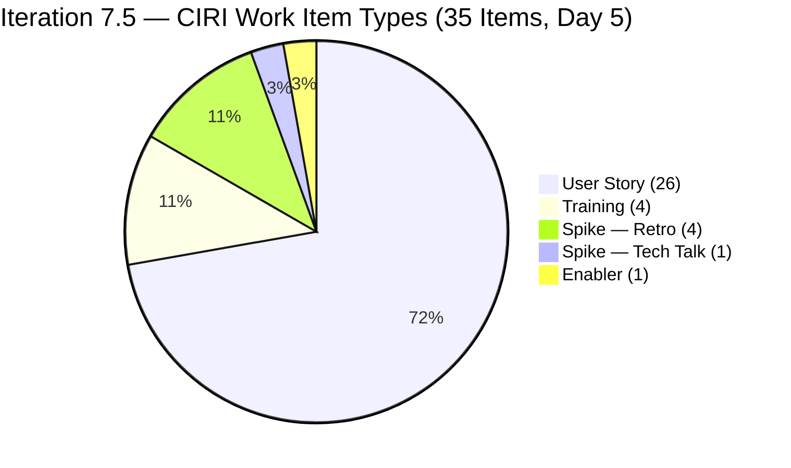
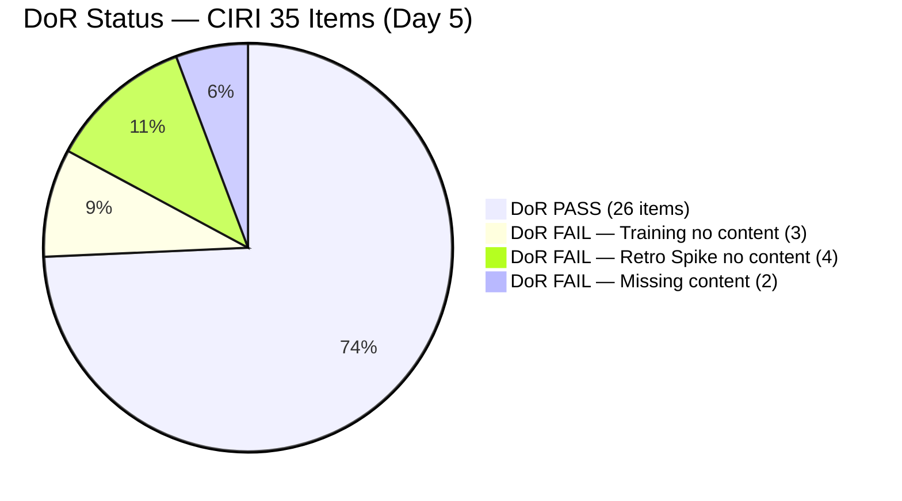
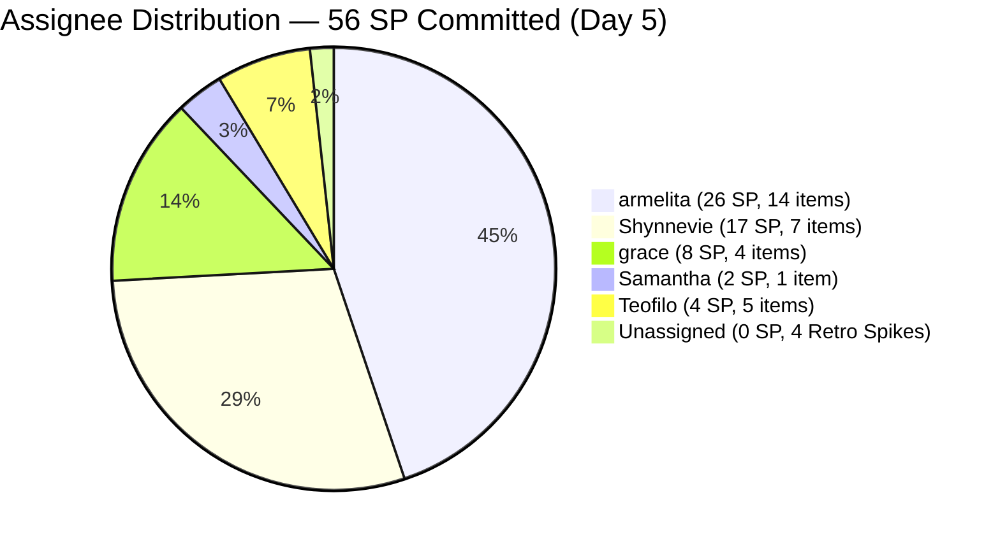
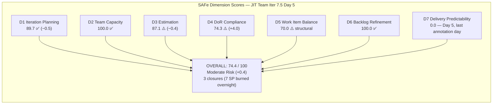

# ADO SAFe Audit — JIT Operation Team

## 1. Audit Metadata

| Field | Value |
|-------|-------|
| Audit Number | #81 |
| Audit Date | 2026-06-05 |
| Audit Time | 09:00 UTC |
| Timezone | UTC |
| Iteration | Iteration 7.5 |
| Iteration Dates | 2026-06-01 – 2026-06-14 |
| Sprint Day | Day 5 of 14 |
| ADO Project | Jairosoft Portfolio (`666bb99a-6acd-4999-bb34-efd0e4ea90dc`) |
| ADO Team | JIT Operation Team (`b25e3129-6272-4e54-a3ff-f1ef3c8eeb2c`) |
| Iteration ID | `9c70d575-210a-4156-bbdc-79f1efbe2869` |
| Iteration Path | `Jairosoft Portfolio\2026-PI7\Iteration 7.5` |
| Workspace | `ado_jit` |
| Prior Audit | AUDIT_20260604_0004.md (Score: 74.0 — Moderate Risk, Day 4) |
| **Overall Score** | **74.4 / 100** |
| **Risk Band** | **Moderate Risk** |

---

## 2. Executive Summary

Iteration 7.5 enters **Day 5 of 14** with the JIT Operation Team improving to **74.4 / 100 (Moderate Risk)** — up **+0.4 points** from Day 4's 74.0. This modest gain is driven by meaningful sprint activity overnight: **3 items closed** (205383, 205385, 204618), **two Training items gained Desc/AC** (204619 passing DoR), and **multiple items transitioned to Active** state. The sprint is beginning to show genuine delivery velocity.

**Confirmed closures since Day 4:**
- **205383** (Onboard Shynnevie Fernandez, 2 SP) — Closed June 3 (exited VRBI between Day 3 and today)
- **205385** (EBET Batch 1 Terminal Reports, 2 SP) — **Closed June 5 05:10 UTC — first delivery of Day 5**
- **204618** (Network Configuration Training, 3 SP) — **Closed June 5 02:36 UTC** — and Teofilo added Description and AC before closing

**New DoR improvement:** Item 204619 (Wi-Fi Configuration Training) now has a full Description and Acceptance Criteria (updated June 5 02:37 UTC) — it is now DoR PASS and is in Active state.

The sprint's primary outstanding risks are unchanged: **8 items still lack Desc/AC** (204620, 204621, 204622, 205538–205541, 205658, 205687), **D7 remains at 0.0** despite 3 actual closures (closed items exited VRBI before scoring), and **today is the last day of the early-sprint annotation window**. However, the closure of 205385 today means D7 may recover by the next audit if any remaining CIRI items close in a Closed/Done state within the visible backlog.

---

## 3. Previous Audit Delta

| Metric | Audit #80 (2026-06-04, Day 4) | Audit #81 (2026-06-05, Day 5) | Change |
|--------|-------------------------------|-------------------------------|--------|
| Sprint Day | Day 4 of 14 | **Day 5 of 14** | +1 day |
| VRBI | 41 | **39** | **−2 (net: 3 closures, VRBI shrinks)** |
| CIRI | 37 | **35** | **−2** |
| New Closures | 0 | **3** (#205383, #205385, #204618) | **+3 FIRST DELIVERIES** |
| SP Burned (exited) | 0 SP | **7 SP** (2+2+3) | **+7 SP first burn** |
| 204618 DoR | FAIL | **CLOSED (PASS before closure)** | Teofilo added Desc/AC on Jun 5 then closed |
| 204619 DoR | FAIL | **PASS** (Desc+AC added Jun 5 02:37) | DoR remediation — Active |
| Items Active (new) | 8 | **~10+** | Multiple transitions to Active |
| 204487 ChangedDate | 2026-05-18 | **2026-06-05** | Updated today; no longer untouched |
| D1 — Iteration Planning | 90.2 | **89.7** | −0.5 (VRBI grew relative to non-CIRI) |
| D2 — Team Capacity | 100.0 | **100.0** | Unchanged |
| D3 — Estimation | 87.5 | **87.1** | −0.4 (PECI/ECI ratio slightly different) |
| D4 — DoR Compliance | 70.3 | **74.3** | **+4.0** (204618 closed, 204619 PASS; 8 failing remain) |
| D5 — Work Item Balance | 70.0 | **70.0** | Unchanged (structural) |
| D6 — Backlog Refinement | 100.0 | **100.0** | Unchanged (204487 updated today) |
| D7 — Delivery Predictability | 0.0 | **0.0** | Closed items exited VRBI; Day 5 last annotation |
| **Overall Score** | **74.0 (Moderate)** | **74.4 (Moderate)** | **+0.4** |
| **Risk Band** | **Moderate Risk** | **Moderate Risk** | Unchanged |

### Day 4 → Day 5 Transition Notes

Three root-level items exited the VRBI via closure:
1. **205383** (Onboard Shynnevie Fernandez, armelita, 2 SP) — Closed June 3; was not in VRBI backlog by Day 4 audit but confirmed via work item data. Represents successful onboarding of the new team member.
2. **205385** (EBET Batch 1 Terminal Reports, armelita, 2 SP) — Closed June 5 05:10 UTC. Armelita completed the terminal report submission required for TESDA certifications.
3. **204618** (Network Configuration Training, Teofilo, 3 SP) — Closed June 5 02:36 UTC. Teofilo added Desc/AC to this Training item before closing — partial DoR remediation (closed items no longer affect D4 denominator).

**Additional item updates June 5:**
- **204619**: Teofilo added Desc and AC (Jun 5 02:37), moved to Active — now DoR PASS
- **204487**: armelita updated (Jun 5 05:10), no longer untouched
- **205399** (Bubble EBET Batch 2, armelita): moved to Active (Jun 5 05:11)
- **205401** (TIP Request, armelita): moved to Active (Jun 5 05:09)
- **205692**: Shynnevie updated Active (Jun 5 02:01)
- **205699**: Shynnevie updated Active (Jun 5 02:01)

---

## 4. Current Iteration Snapshot

**Iteration 7.5** · 2026-06-01 – 2026-06-14 · **Day 5 of 14** · 9 days remaining

| Field | Value |
|-------|-------|
| Visible Root Backlog Items (VRBI) | 39 |
| Items in Iteration 7.5 (CIRI) | 35 |
| Non-CIRI VRBI items | 4 (200766 PI8, 203245 Iter 7.6 IP, 203250 Iter 7.3, 204338 Iter 7.4) |
| PECI (US + Spike + Enabler in CIRI) | 31 |
| ECI (PECI with SP > 0) | 27 |
| SP Committed (CSP) | 56 SP |
| SP Closed (exited VRBI, estimated) | 7 SP (#205383+#205385+#204618) |
| DoR Compliant Items (DCI) | 26 / 35 |
| DoR Failing Items | 9 (3 Training + 4 Retro Spikes + #205658 + #205687) |
| Distinct Assignees on CIRI | 5 (armelita, grace, Samantha, Shynnevie, Teofilo) |
| Team Capacity | 23.8 SP/day total configured |
| Sprint Day / Total | Day 5 / 14 |
| Early-Sprint Window | **Closes today — Day 6 = post-early-sprint** |

---

## 5. Work Item Analysis

### CIRI Items — Iteration 7.5 (35 root-level items)

| ID | Title | Type | State | SP | Assignee | DoR | ChangedDate |
|----|-------|------|-------|----|----------|-----|-------------|
| 200771 | UM Digos Interns Final Demo and Awarding | User Story | New | 2 | armelita | PASS | 2026-06-01 |
| 203244 | IT7.5 Tech Talk — AI Tools Demonstration | Spike | New | 2 | armelita | PASS | 2026-06-02 |
| 203595 | JIT Finance Collection Policy | User Story | Active | 2 | grace | PASS | 2026-06-01 |
| 204440 | Package SAFe Micro-credential Dossier | User Story | Active | 2 | grace | PASS | 2026-06-02 |
| 204477 | Bubble MCC Marketing for June 1–5 | User Story | New | 3 | armelita | PASS | 2026-06-02 |
| 204487 | Python Marketing Activities June 1 to 5 | User Story | Active | 2 | armelita | PASS | **2026-06-05** |
| **204619** | 2.3-1 Set Router/Wi-Fi Configuration Training | Training | Active | 3 | Teofilo | **PASS** | **2026-06-05** |
| 204620 | 2.4-1 Ensure Config Conforms to Manual Training | Training | New | — | Teofilo | **FAIL** | 2026-06-03 |
| 204621 | 2.4-2 Computer Networks Checked Training | Training | New | — | Teofilo | **FAIL** | 2026-06-04 |
| 204622 | 2.4-3 Prepare Reports Training | Training | New | — | Teofilo | **FAIL** | 2026-06-03 |
| 205242 | Audit of payments receipts | User Story | New | 2 | grace | PASS | 2026-06-02 |
| 205330 | CSS Batch 2 Terminal Report | User Story | New | 2 | armelita | PASS | 2026-06-02 |
| 205373 | CSS NC II Batch 2 Special Order Request | User Story | New | 2 | armelita | PASS | 2026-06-02 |
| 205390 | Bubble EBET Scholarship SO Request | User Story | New | 2 | armelita | PASS | 2026-06-02 |
| 205394 | Bubble EBET Scholarship Batch 1 Billing | User Story | Active | 2 | armelita | PASS | 2026-06-04 |
| 205396 | Bubble EBET Scholarship Batch 1 Payroll | User Story | New | 2 | armelita | PASS | 2026-06-02 |
| 205399 | Bubble EBET Scholarship Batch 2 | User Story | **Active** | 2 | armelita | PASS | **2026-06-05** |
| 205401 | Request for Bubble EBET Scholarship Batch 2 TIP | User Story | **Active** | 2 | armelita | PASS | **2026-06-05** |
| 205403 | Bubble EBET Scholarship Batch 2 TIP | User Story | New | 2 | armelita | PASS | 2026-06-02 |
| 205405 | Bubble EBET Scholarship Batch 2 Training Enrollment Report | User Story | New | 2 | armelita | PASS | 2026-06-02 |
| 205411 | NEMSU Interview and Onboarding | User Story | New | 1 | armelita | PASS | 2026-06-02 |
| 205507 | Compile Bubble Training Records | User Story | Active | 2 | Samantha | PASS | 2026-06-02 |
| 205538 | [Retro] Increase number of training hours | Spike | New | — | (unassigned) | **FAIL** | 2026-06-02 |
| 205539 | [Retro] Create material for workflows | Spike | New | — | (unassigned) | **FAIL** | 2026-06-02 |
| 205540 | [Retro] Review training material instructions | Spike | New | — | (unassigned) | **FAIL** | 2026-06-02 |
| 205541 | [Retro] eLMS crash | Spike | New | — | (unassigned) | **FAIL** | 2026-06-02 |
| 205574 | Bubble EBET Scholarship Reels | User Story | Active | 2 | Shynnevie | PASS | 2026-06-02 |
| 205577 | Bubble.IO TESDA Scholarship Batch 2 — Final List | User Story | Active | 3 | Shynnevie | PASS | 2026-06-03 |
| 205658 | Batch 2 Results | Enabler | New | 1 | Teofilo | **FAIL** | 2026-06-03 |
| 205683 | BATCH 1 — Requirements Compilation EBET Scholarship | User Story | Active | 1 | Shynnevie | PASS | 2026-06-03 |
| 205687 | Jairosoft 1st Graduation June 2026 | User Story | New | 2 | grace | **FAIL** | 2026-06-03 |
| 205692 | BATCH 2 BUBBLE.IO EBET — Preparation for Induction Training | User Story | Active | 3 | Shynnevie | PASS | **2026-06-05** |
| 205699 | Batch 2 — BUBBLE EBET — Prepare Training Material | User Story | Active | 3 | Shynnevie | PASS | **2026-06-05** |
| 205701 | BATCH 2 — BUBBLE.IO EBET — ITP Template Reels | User Story | New | 3 | Shynnevie | PASS | 2026-06-03 |
| 205703 | BATCH 2 — BUBBLE.IO EBET — ID for the Scholar | User Story | New | 2 | Shynnevie | PASS | 2026-06-03 |

### Items Closed / Exited VRBI (Since Day 4)

| ID | Title | Type | SP | State | ClosedDate | Note |
|----|-------|------|----|-------|------------|------|
| 205383 | Onboard FERNANDEZ, Shynnevie M. | User Story | 2 | Closed | 2026-06-03 | Exited VRBI; onboarding complete |
| 205385 | EBET Batch 1 Terminal Reports | User Story | 2 | Closed | **2026-06-05 05:10** | **First Day-5 delivery** |
| 204618 | 2.2-1 Network Configuration Training | Training | 3 | Closed | **2026-06-05 02:36** | Teofilo added Desc/AC then closed |

### Non-CIRI VRBI Items (Persistent)

| ID | Title | Iteration | Type | State | Assignee |
|----|-------|-----------|------|-------|---------|
| 200766 | ODOO OpenCat SIS | PI8 | Spike | Active | armelita |
| 203245 | IT7.6 Tech Talk | Iter 7.6 IP | Spike | New | armelita |
| 203250 | Jairosoft Team Members to Complete Claude 4 Course | Iter 7.3 | Spike | Active | armelita |
| 204338 | Bubble Tesda Training | Iter 7.4 | Training | Training | Samantha |

### Item Type Distribution (CIRI = 35)

| Type | Count | Share | DoR Status |
|------|-------|-------|-----------|
| User Story | 26 | 74.3% | 24 PASS, 1 FAIL (#205687), 1 not yet checked |
| Training | 4 | 11.4% | 1 PASS (204619), 3 FAIL (204620–622) |
| Spike | 4 | 11.4% | 0 PASS (all 4 Retro Spikes FAIL) |
| Enabler | 1 | 2.9% | 0 PASS (205658 FAIL) |

### Assignee Distribution (CIRI = 35)

| Assignee | CIRI Items | CIRI SP | Active Items | DoR Failing |
|----------|-----------|---------|--------------|-------------|
| armelita | 14 | 26 SP | 4 (204487, 205394, 205399, 205401) | 0 |
| grace | 4 | 8 SP | 1 (203595) | 1 (#205687) |
| Samantha Babael | 1 | 2 SP | 1 (205507) | 0 |
| Shynnevie Fernandez | 7 | 17 SP | 5 (205574, 205577, 205683, 205692, 205699) | 0 |
| Teofilo Limpag | 5 | 4 SP | 1 (204619) | 3 (204620–622) |
| Unassigned | 4 | 0 SP | 0 | 4 (Retro Spikes) |

---

## 6. SAFe Compliance Scorecard

| Dimension | Score | Evidence (Numerator / Denominator) | Notes |
|-----------|-------|------------------------------------|-------|
| D1 — Iteration Planning | **89.7** | CIRI 35 / VRBI 39 | 4 non-CIRI: PI8, Iter 7.6 IP, Iter 7.3, Iter 7.4 |
| D2 — Team Capacity | **100.0** | CC 5 / CW 5 | All 5 contributors have positive capacity |
| D3 — Estimation | **87.1** | ECI 27 / PECI 31 | 4 Retro Spikes (0 SP); Training excluded from PECI |
| D4 — DoR Compliance | **74.3** | DCI 26 / CIRI 35 | 9 failing: 3 Training (204620–622) + 4 Retro Spikes + 205658 + 205687 |
| D5 — Work Item Balance | **70.0** | US 74.3% (>60% → −30); no −40 (US present); no −20 (Spike <40%) | Structural |
| D6 — Backlog Refinement | **100.0** | fresh 39/39; stale_90=0; stale_180=0; untouched 0/35 | 204487 updated Jun 5; all CIRI items touched Jun 1 or later |
| D7 — Delivery Predictability | **0.0** | CLSP 0 / CSP 56 | 3 closures exited VRBI (7 SP burned); **Day 5 = last early-sprint annotation day** |

**Overall = (89.7 + 100.0 + 87.1 + 74.3 + 70.0 + 100.0 + 0.0) / 7 = 521.1 / 7 = 74.4 / 100 — Moderate Risk**

---

## 7. Dimension Findings

### D1 — Iteration Planning (89.7) ✅

- VRBI = 39; CIRI = 35
- Non-CIRI: 200766 (PI8), 203245 (Iter 7.6 IP), 203250 (Iter 7.3), 204338 (Iter 7.4)
- Formula: 35/39 × 100 = **89.7**
- Slight decrease from Day 4 (90.2) because VRBI shrank by 2 items while the ratio of non-CIRI items (4) remained the same. Resolving the 4 non-CIRI items would improve D1 to 35/35 = 100.0.

### D2 — Team Capacity (100.0) ✅

- CW = 5 (armelita, grace, Samantha, Shynnevie, Teofilo — all have CIRI items)
- CC = 5: Shynnevie 6 hrs/day, Teofilo 4.8 hrs/day, armelita 6 hrs/day, Samantha 6 hrs/day, grace 1 hr/day
- Formula: 5/5 × 100 = **100.0**

### D3 — Estimation (87.1) ⚠️

- PECI = 31 (26 US + 4 Spike + 1 Enabler; Training = 4 items excluded)
- ECI = 27 (PECI − 4 Retro Spikes with 0 SP)
- CSP = 56 SP (down from 60; 204618=3 SP closed and exited)
- Unestimated: 205538, 205539, 205540, 205541 (all 0 SP)
- Formula: 27/31 × 100 = **87.1**
- Assigning 1 SP each to 4 Retro Spikes → D3 = 31/31 = 100.0 (+1.8 points to overall).

### D4 — DoR Compliance (74.3) ⚠️ Improving

- CIRI = 35; DCI = 26; Failing = 9
- **PASS (26):** All 25 User Stories except #205687 + Spike #203244 + Training #204619 = 26
  - Note: 204619 is newly PASS (Teofilo added Desc + AC Jun 5 02:37)
- **FAIL (9):**
  - Training 204620–204622: No Desc, No AC (3 items, Teofilo)
  - Retro Spikes 205538–205541: No Desc, No AC (4 items, unassigned — 5th consecutive day)
  - Enabler 205658: No Desc, No AC (1 item, Teofilo)
  - User Story 205687 (Graduation, grace): No Desc, No AC (1 item)
- Formula: 26/35 × 100 = **74.3**
- Improvement from Day 4 (70.3): 204618 closed (exited CIRI denominator) and 204619 remediated. Net: DCI moved from 26/37 to 26/35, improving the ratio.
- Full remediation of 9 failing items → DCI = 35/35 = 100.0 (+3.7 points to overall).

### D5 — Work Item Balance (70.0) ⚠️ Structural

- CIRI = 35; User Story = 26 (74.3%) > 60% → −30; Spike = 4 (11.4%) < 40% → no −20; US present → no −40
- Formula: max(0, 100 − 30) = **70.0**
- US share increased slightly as proportion. Structural penalty continues.

### D6 — Backlog Refinement (100.0) ✅

- VRBI = 39; fresh (ChangedDate ≥ 2026-04-21) = 39 → base = 100.0
  - 200766 changed 2026-05-03 (within 45 days of Jun 5) ✓
  - All other items changed Jun 1–5
- Stale_90 (< 2026-03-07): 0; Stale_180 (< 2025-12-08): 0
- Untouched CIRI (ChangedDate < 2026-06-01): 0 — 204487 was updated Jun 5 today
- Formula: max(0, 100.0) = **100.0**

### D7 — Delivery Predictability (0.0) — Early-Sprint Window Ends Today

- CSP = 56 SP; CLSP = 0 SP (no CIRI items in Closed/Done visible in backlog)
- Formula: 0/56 × 100 = **0.0**
- **Early-sprint annotation (Day 5 — FINAL annotated day):** Day 5 is the last day where D7 = 0.0 is annotated as expected. From Day 6 (June 6), D7 = 0.0 will reflect a genuine sprint delivery gap.
- **Actual burn:** 3 items × 7 SP total closed and exited VRBI. The rubric cannot capture this because closed items exit the denominator and numerator set.
- **Recovery threshold for Low Risk:** At current D1–D6 values (sum = 521.1), D7 needs 521.1/7 requires D7 ≥ 38.9 for overall ≥ 80.0. This means CLSP ≥ 22 SP out of 56 must close in visible backlog. Across 9 remaining days, this is achievable (~2.5 SP/day average).

---

## 8. Risks and Bottlenecks

| Risk | Severity | Status | Detail |
|------|----------|--------|--------|
| 9 CIRI items lack Desc or AC (D4 = 74.3) | **CRITICAL** | 5th consecutive day (partially) | 3 Training (Teofilo) + 4 Retro Spikes (unassigned) + #205687 (grace) + #205658 (Teofilo) |
| 4 Retro Spikes unassigned for 5 days | **CRITICAL** | 5th day without owner | 205538–205541: no SP, no assignee, no content — retrospective action items decaying |
| D7 = 0.0 — early-sprint window closes today | **HIGH** | Last annotated day (Day 5) | Day 6 onward: D7 = 0.0 is a genuine delivery signal; 22 SP needed for Low Risk |
| 205687 (Graduation, grace) still undocumented | **HIGH** | 3rd day without content | grace has 4 CIRI items; graduation event (2 SP) needs Desc + AC urgently |
| 205658 (Batch 2 Results, Teofilo) still undocumented | **HIGH** | 3rd day | 1 SP Enabler; Teofilo remediated 204619 today but not 205658 |
| 204338 (TESDA Training, Iter 7.4, Samantha) unresolved | **HIGH** | Multi-sprint carryover | Non-CIRI; Samantha carryover; 6th sprint in non-standard state |
| armelita: 14 CIRI items (26 SP) — 40% load | **MEDIUM** | Growing Active count | 4 items now Active simultaneously; sequencing risk on EBET series |
| 203250 (Claude 4 Course, Iter 7.3, armelita) | **MEDIUM** | Active multi-sprint carryover | Non-CIRI; needs close or reassignment |
| Low Risk threshold requires 22 SP visible closures | **MEDIUM** | Achievable but requires consistent delivery | 9 days remaining × ~2.5 SP/day = achievable; starts Day 6 |

---

## 9. Prioritized Recommendations

1. **Document all 9 DoR-failing items today (Day 5, CRITICAL)** — Day 6 ends the early-sprint annotation. Resolving 9 items pushes D4 from 74.3 → 100.0 (+3.7 points). Combined with Retro Spike estimation (+1.8 points D3), total structural gain = **+5.5 points** → overall ~79.9 (just under Low Risk). Any closures today push it past 80.0.
   - **Teofilo** (4 items): 204620, 204621, 204622 (Network/Config Training) and 205658 (Batch 2 Results). Teofilo successfully documented and closed 204618 today — he has the template; apply same pattern to the remaining 3 Training items and the Enabler.
   - **grace** (1 item): 205687 (Jairosoft 1st Graduation June 2026). Add Desc: describe the graduation ceremony scope, date, venue, and participants. Add AC: venue confirmed, invitations sent, certificates prepared, ceremony conducted, photos archived. (≥30 chars Desc, ≥20 chars AC.)
   - **armelita or Teofilo** (4 Retro Spikes 205538–205541): Assign ownership (205538–539 → armelita; 205540–541 → Teofilo), write Desc + AC, estimate 1 SP each.

2. **Deliver first visible closures today (Day 5, CRITICAL)** — With D7 annotation ending today, Day 6 requires visible CIRI closures in the backlog. Priority candidates:
   - **205507** (Compile Bubble Training Records, Samantha, 2 SP) — Active 5 days; compilation and review should be complete.
   - **205574** (Bubble EBET Reels, Shynnevie, 2 SP) — Active; reel creation task.
   - **205683** (BATCH 1 Requirements Compilation, Shynnevie, 1 SP) — Active; scan + upload task.
   - **205577** (Batch 2 Final List, Shynnevie, 3 SP) — Active; if list is finalized.
   - Closing these 4 items (8 SP): D7 = 8/56 = 14.3; Overall ≈ 76.5. With DoR fix: Overall ≈ 82.0 (Low Risk).

3. **Assign and estimate Retro Spikes (Day 5, CRITICAL)** — 205538–205541 entering 5th day unowned. Assign + estimate (1 SP each) → D3 = 31/31 = 100.0. These retrospective items are actionable operational improvements that should be executed in this sprint, not left floating.

4. **Resolve 204338 (Iter 7.4, Samantha) and 203250 (Iter 7.3, armelita) (Day 5–6, HIGH)** — Both are multi-sprint carryovers in non-CIRI status. Close or move to CIRI 7.5 as appropriate. Each resolution improves D1 (would move from 35/39 to 35/38, then 35/37 etc.).

5. **Define a sprint goal (Day 5, MODERATE)** — Suggested: *"Deliver TESDA compliance documentation for Bubble EBET Batch 1 and CSS Batch 2, execute Batch 2 TIP and Induction, complete Bubble training records and reels compilation, onboard NEMSU interns, and resolve all retrospective action spikes — within PI7 Iteration 7.5."*

---

## 10. Evidence Gaps and Limitations

| Gap | Impact | Notes |
|-----|--------|-------|
| 3 closures exited VRBI before D7 scoring | D7 cannot count 7 SP burned | 205383 (2 SP), 205385 (2 SP), 204618 (3 SP) — actual burn; not visible to formula |
| Training items exclude SP | PECI understates coverage | Teofilo's 3 remaining Training items (204619–622) excluded from PECI; 4.8 SP/day capacity partially invisible to D3 |
| 204338 in "Training" custom state | Lifecycle anomaly | Iter 7.4 path; excluded from CIRI; Samantha's multi-sprint obligation |
| 4 Retro Spikes unassigned 5 days | D3 and D4 penalized | 205538–205541 still unowned; owner decisions deferred |
| 203595 Active 19+ days | Extended Active | JIT Finance Collection Policy (grace, 2 SP); dependency on policy/system approval |
| Sprint goal absent | Governance gap | No sprint goal for 5th consecutive iteration |

---

## Visualizations

### Score Trend — JIT Operation Team (Iteration 7.5)

| Date | Audit | Score | Band | Sprint Day | Notable |
|------|-------|-------|------|-----------|---------|
| Jun 1 | #77 | 68.8 | Moderate | Day 1 | Sprint open; D1=60.7 |
| Jun 2 | #78 | 73.2 | Moderate | Day 2 | +13 items; Shynnevie onboarded |
| Jun 3 | #79 | 73.1 | Moderate | Day 3 | +3 items; Teofilo assigned; D4 drops |
| Jun 4 | #80 | 74.0 | Moderate | Day 4 | +4 Shynnevie items; D4 recovers to 70.3 |
| **Jun 5** | **#81** | **74.4** | **Moderate** | **Day 5** | **3 closures (7 SP); 204619 DoR PASS; 204487 updated** |

### D7 Recovery Projection — Iteration 7.5 (56 SP Committed, 9 days remaining)

| Scenario | SP Visible Closed | D7 | Base Overall | With Full DoR Fix (+5.5 pts) | Band |
|----------|--------------------|----|--------------|-----------------------------|------|
| 0 closures (current, Day 5) | 0/56 | 0.0 | 74.4 | ~79.9 | Moderate |
| 4 items close (8 SP) | 8/56 | 14.3 | 76.5 | ~82.0 | Low |
| Low Risk threshold (~22 SP) | 22/56 | 39.3 | 80.0 | ~85.5 | Low |
| Mid-sprint (28 SP) | 28/56 | 50.0 | 81.5 | ~87.0 | Low |
| Full PECI delivery (56 SP) | 56/56 | 100.0 | 88.6 | ~94.1 | Low |

> DoR fix alone (D4 74.3→100 + D3 87.1→100) adds ~5.5 points. With full DoR fix, Low Risk requires only ~14 SP closed (D7 ≥ 25.0).

---

*Audit #81 generated by Claude Code (claude-sonnet-4-6) on 2026-06-05 09:00 UTC. Evidence sourced from Azure DevOps MCP (Jairosoft Portfolio project, team b25e3129-6272-4e54-a3ff-f1ef3c8eeb2c, Iteration 7.5 ID 9c70d575-210a-4156-bbdc-79f1efbe2869). Rubric: SAFe 6.0 7-dimension scorecard v1. Iteration 7.5 is Day 5 of 14. Score: 74.4 / 100 (Moderate Risk, +0.4 from Day 4). 3 items closed (7 SP burned); 204619 now DoR PASS; 9 items still DoR failing. Early-sprint annotation window closes today. Priority: document 9 DoR-failing items (unlocks +5.5 pts), assign/estimate Retro Spikes, deliver first visible closures (22 SP needed for Low Risk).*
