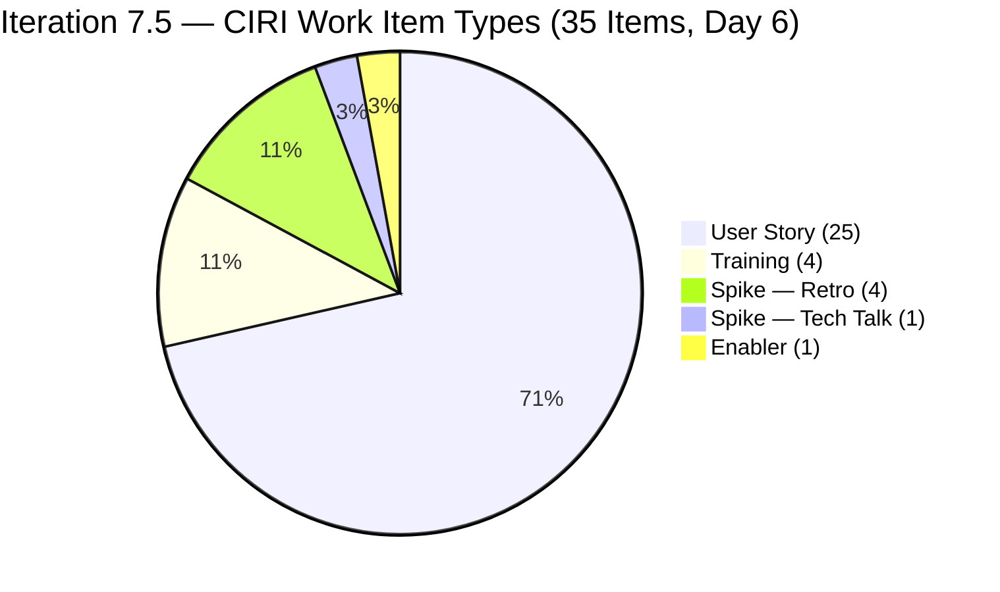
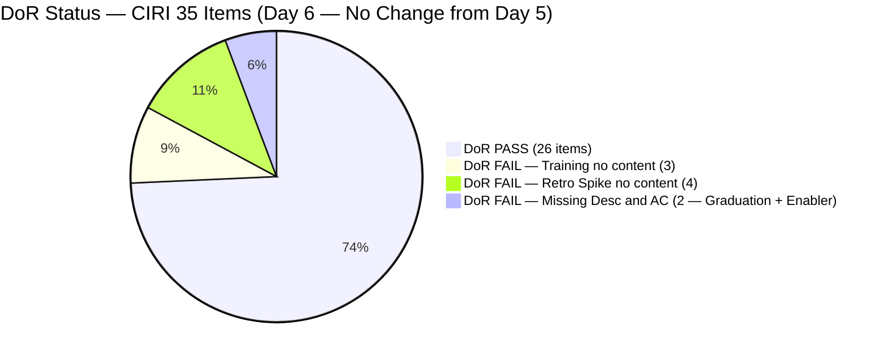
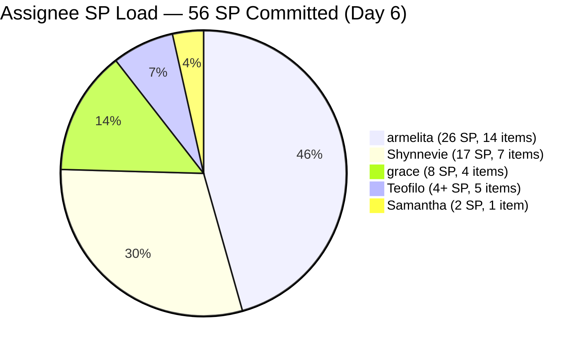
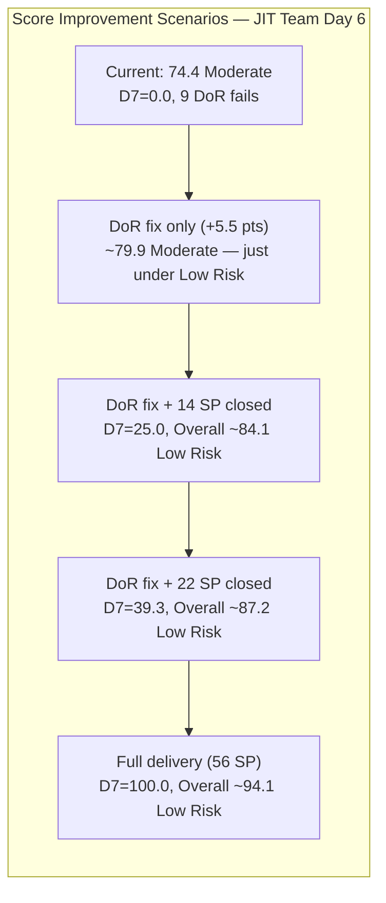

# ADO SAFe Audit — JIT Operation Team

## 1. Audit Metadata

| Field | Value |
|-------|-------|
| Audit Number | #82 |
| Audit Date | 2026-06-06 |
| Audit Time | 09:00 CST |
| Timezone | CST |
| Iteration | Iteration 7.5 |
| Iteration Dates | 2026-06-01 – 2026-06-14 |
| Sprint Day | Day 6 of 14 |
| ADO Project | Jairosoft Portfolio (`666bb99a-6acd-4999-bb34-efd0e4ea90dc`) |
| ADO Team | JIT Operation Team (`b25e3129-6272-4e54-a3ff-f1ef3c8eeb2c`) |
| Iteration ID | `9c70d575-210a-4156-bbdc-79f1efbe2869` |
| Iteration Path | `Jairosoft Portfolio\2026-PI7\Iteration 7.5` |
| Workspace | `ado_jit` |
| Prior Audit | AUDIT_20260605_0900.md (Score: 74.4 — Moderate Risk, Day 5) |
| **Overall Score** | **74.4 / 100** |
| **Risk Band** | **Moderate Risk** |

---

## 2. Executive Summary

Iteration 7.5 enters **Day 6 of 14** with the JIT Operation Team holding at **74.4 / 100 (Moderate Risk)** — numerically unchanged from Day 5 but now carrying greater urgency. The early-sprint annotation window has **closed**: D7 = 0.0 is no longer expected or excused — it is a genuine delivery deficit entering the second week of the sprint.

No new closures occurred overnight. The same 39 items remain in the visible backlog, and the same 9 DoR-failing items (3 Training + 4 Retro Spikes + 205687 + 205658) persist without remediation. The team delivered strongly in Days 3–5 (3 closures, 7 SP burned), but that momentum stalled at the Day 5 boundary. **If no visible closures or DoR fixes appear by end of Day 7, the sprint will be at risk of finishing below 75 even with full late-sprint delivery.**

The two levers that can elevate the team to Low Risk are available and actionable: (1) document the 9 failing items (+5.5 points if fully remediated), and (2) close 22+ SP in the remaining 8 days to achieve D7 ≥ 39.3. The Active work queue is well-stocked — armelita has 5 Active items, Shynnevie has 5 Active items, Samantha has 1 Active item, and Teofilo has 1 Active training. The items in flight can be closed; the question is execution speed.

---

## 3. Previous Audit Delta

| Metric | Audit #81 (2026-06-05, Day 5) | Audit #82 (2026-06-06, Day 6) | Change |
|--------|-------------------------------|-------------------------------|--------|
| Sprint Day | Day 5 of 14 | **Day 6 of 14** | +1 day |
| VRBI | 39 | **39** | No change — zero new closures |
| CIRI | 35 | **35** | No change |
| Items Closed (exited VRBI since sprint open) | 3 (#205383, #205385, #204618) | **3** | No new closures |
| SP Burned (exited VRBI) | 7 SP | **7 SP** | No change |
| DoR PASS items | 26 | **26** | No remediation overnight |
| DoR FAIL items | 9 | **9** | Persistent: 3 Training + 4 Retro Spikes + #205658 + #205687 |
| D1 — Iteration Planning | 89.7 | **89.7** | Unchanged |
| D2 — Team Capacity | 100.0 | **100.0** | Unchanged |
| D3 — Estimation | 87.1 | **87.1** | Unchanged |
| D4 — DoR Compliance | 74.3 | **74.3** | Unchanged |
| D5 — Work Item Balance | 70.0 | **70.0** | Unchanged (structural) |
| D6 — Backlog Refinement | 100.0 | **100.0** | Unchanged |
| D7 — Delivery Predictability | 0.0 (Day 5 — last early-sprint annotation) | **0.0 (GENUINE DELIVERY GAP — Day 6)** | **Annotation removed** |
| **Overall Score** | **74.4 (Moderate)** | **74.4 (Moderate)** | **Unchanged** |
| **Risk Band** | **Moderate Risk** | **Moderate Risk** | Stable but worsening urgency |

### Day 5 → Day 6 Interpretation

No state changes, closures, or DoR remediations were recorded between June 5 and June 6. The sprint is in a stall after the burst of activity in Days 3–5. The sole operational change is the **removal of the early-sprint D7 annotation**: D7 = 0.0 is now a hard delivery signal, not an expected early-sprint behavior. The team had 3 strong closure days and then paused. The next closure must happen today or tomorrow to maintain the sprint's Low Risk trajectory potential.

The most significant actionable gap remains the **9 DoR-failing items** — 4 Retro Spikes have been unassigned and unwritten for 6 consecutive days (205538–205541), and 205687 (Graduation event, grace) has had no content since it was created on June 3. Teofilo demonstrated the remediation template on June 5 (204618) but has not applied it to his remaining 3 Training items (204620–622) or his Enabler (205658).

---

## 4. Current Iteration Snapshot

**Iteration 7.5** · 2026-06-01 – 2026-06-14 · **Day 6 of 14** · 8 days remaining

| Field | Value |
|-------|-------|
| Visible Root Backlog Items (VRBI) | 39 |
| Items in Iteration 7.5 (CIRI) | 35 |
| Non-CIRI VRBI items | 4 (200766 PI8, 203245 Iter 7.6 IP, 203250 Iter 7.3, 204338 Iter 7.4) |
| PECI (non-Training with SP field) | 31 (25 US + 5 Spike + 1 Enabler) |
| ECI (PECI with SP > 0) | 27 (4 Retro Spikes have 0 SP) |
| SP Committed (CSP) | 56 SP |
| SP Closed (visible in backlog) | 0 SP |
| SP Burned (exited VRBI, not in D7) | 7 SP (#205383=2 + #205385=2 + #204618=3) |
| DoR Compliant (DCI) | 26 / 35 (74.3%) |
| DoR Failing | 9 items (unchanged from Day 5) |
| Distinct Assignees on CIRI | 5 (armelita, grace, Samantha, Shynnevie, Teofilo) |
| Total Capacity | 23.8 hrs/day configured |
| Active Items | 13 (armelita=5, Shynnevie=5, Samantha=1, grace=2, Teofilo=1) |
| Sprint Day / Total | Day 6 / 14 |
| Early-Sprint Window | **Closed — Day 6 is first post-annotation day** |

---

## 5. Work Item Analysis

### CIRI Items — Iteration 7.5 (35 root-level items, ordered by assignee)

| ID | Title | Type | State | SP | Assignee | DoR | ChangedDate |
|----|-------|------|-------|----|----------|-----|-------------|
| 200771 | UM Digos Interns Final Demo and Awarding | User Story | New | 2 | armelita | PASS | 2026-06-01 |
| 203244 | IT7.5 Tech Talk — AI Tools Demonstration | Spike | New | 2 | armelita | PASS | 2026-06-02 |
| 204477 | Bubble MCC Marketing for June 1–5 | User Story | New | 3 | armelita | PASS | 2026-06-02 |
| 204487 | Python Marketing Activities June 1–5 | User Story | Active | 2 | armelita | PASS | 2026-06-05 |
| 205394 | Bubble EBET Scholarship Batch 1 Billing | User Story | Active | 2 | armelita | PASS | 2026-06-04 |
| 205396 | Bubble EBET Scholarship Batch 1 Payroll | User Story | New | 2 | armelita | PASS | 2026-06-02 |
| 205399 | Bubble EBET Scholarship Batch 2 | User Story | Active | 2 | armelita | PASS | 2026-06-05 |
| 205401 | Request for Bubble EBET Scholarship Batch 2 TIP | User Story | Active | 2 | armelita | PASS | 2026-06-05 |
| 205390 | Bubble EBET SO Request | User Story | New | 2 | armelita | PASS | 2026-06-02 |
| 205330 | CSS Batch 2 Terminal Report | User Story | New | 2 | armelita | PASS | 2026-06-02 |
| 205373 | CSS NC II Batch 2 Special Order Request | User Story | New | 2 | armelita | PASS | 2026-06-02 |
| 205403 | Bubble EBET Scholarship Batch 2 TIP | User Story | New | 2 | armelita | PASS | 2026-06-02 |
| 205405 | Bubble EBET Scholarship Batch 2 Training Enrollment Report | User Story | New | 2 | armelita | PASS | 2026-06-02 |
| 205411 | NEMSU Interview and Onboarding | User Story | New | 1 | armelita | PASS | 2026-06-02 |
| 203595 | JIT Finance Collection Policy | User Story | Active | 2 | grace | PASS | 2026-06-01 |
| 204440 | Package SAFe Micro-credential Dossier | User Story | Active | 2 | grace | PASS | 2026-06-02 |
| 205242 | Audit of payments receipts | User Story | New | 2 | grace | PASS | 2026-06-02 |
| 205687 | Jairosoft 1st Graduation June 2026 | User Story | New | 2 | grace | **FAIL** | 2026-06-03 |
| 205507 | Compile Bubble Training Records | User Story | Active | 2 | Samantha | PASS | 2026-06-02 |
| 205574 | Bubble EBET Scholarship Reels | User Story | Active | 2 | Shynnevie | PASS | 2026-06-02 |
| 205577 | Bubble.IO TESDA Scholarship Batch 2 — Final List | User Story | Active | 3 | Shynnevie | PASS | 2026-06-03 |
| 205683 | BATCH 1 — Requirements Compilation EBET Scholarship | User Story | Active | 1 | Shynnevie | PASS | 2026-06-03 |
| 205692 | BATCH 2 — BUBBLE.IO EBET — Preparation for Induction Training | User Story | Active | 3 | Shynnevie | PASS | 2026-06-05 |
| 205699 | Batch 2 — BUBBLE EBET — Prepare Training Material | User Story | Active | 3 | Shynnevie | PASS | 2026-06-05 |
| 205701 | BATCH 2 — BUBBLE.IO EBET — ITP Template Reels | User Story | New | 3 | Shynnevie | PASS | 2026-06-03 |
| 205703 | BATCH 2 — BUBBLE.IO EBET — ID for the Scholar | User Story | New | 2 | Shynnevie | PASS | 2026-06-03 |
| 204619 | 2.3-1 Set Router/Wi-Fi Configuration Training | Training | Active | 3 | Teofilo | PASS | 2026-06-05 |
| 204620 | 2.4-1 Ensure Config Conforms to Manual Training | Training | New | — | Teofilo | **FAIL** | 2026-06-03 |
| 204621 | 2.4-2 Computer Networks Checked Training | Training | New | — | Teofilo | **FAIL** | 2026-06-04 |
| 204622 | 2.4-3 Prepare Reports Training | Training | New | — | Teofilo | **FAIL** | 2026-06-03 |
| 205658 | Batch 2 Results | Enabler | New | 1 | Teofilo | **FAIL** | 2026-06-03 |
| 205538 | [Retro] Increase number of training hours | Spike | New | — | Unassigned | **FAIL** | 2026-06-02 |
| 205539 | [Retro] Create material for workflows | Spike | New | — | Unassigned | **FAIL** | 2026-06-02 |
| 205540 | [Retro] Review training material instructions | Spike | New | — | Unassigned | **FAIL** | 2026-06-02 |
| 205541 | [Retro] eLMS crash | Spike | New | — | Unassigned | **FAIL** | 2026-06-02 |

### Items Closed / Exited VRBI (Since Sprint Open — Not Scored in D7)

| ID | Title | Type | SP | State | ClosedDate |
|----|-------|------|----|-------|------------|
| 205383 | Onboard Shynnevie Fernandez | User Story | 2 | Closed | 2026-06-03 |
| 205385 | EBET Batch 1 Terminal Reports | User Story | 2 | Closed | 2026-06-05 |
| 204618 | 2.2-1 Network Configuration Training | Training | 3 | Closed | 2026-06-05 |

### Non-CIRI VRBI Items (Persistent — 4 items)

| ID | Title | Iteration | Type | State | Assignee |
|----|-------|-----------|------|-------|---------|
| 200766 | ODOO OpenCat SIS | PI8 | Spike | Active | armelita |
| 203245 | IT7.6 Tech Talk | Iter 7.6 IP | Spike | New | armelita |
| 203250 | Claude 4 Course Completion | Iter 7.3 | Spike | Active | armelita |
| 204338 | Bubble Tesda Training | Iter 7.4 | Training | Training | Samantha |

### Item Type Distribution (CIRI = 35)

| Type | Count | Share | DoR Pass | DoR Fail |
|------|-------|-------|----------|----------|
| User Story | 25 | 71.4% | 24 | 1 (#205687) |
| Training | 4 | 11.4% | 1 (204619) | 3 (204620–622) |
| Spike | 5 | 14.3% | 1 (203244) | 4 (Retro Spikes) |
| Enabler | 1 | 2.9% | 0 | 1 (#205658) |

### Assignee Distribution (CIRI = 35)

| Assignee | Items | SP | Active Items | DoR Failing |
|----------|-------|----|--------------|-------------|
| armelita | 14 | 26 | 4 (204487, 205394, 205399, 205401) | 0 |
| Shynnevie Fernandez | 7 | 17 | 5 (205574, 205577, 205683, 205692, 205699) | 0 |
| grace | 4 | 8 | 2 (203595, 204440) | 1 (#205687) |
| Teofilo Limpag | 5 | 4+training | 1 (204619) | 4 (204620–622, 205658) |
| Samantha Babael | 1 | 2 | 1 (205507) | 0 |
| Unassigned | 4 | 0 | 0 | 4 (Retro Spikes 205538–541) |

---

## 6. SAFe Compliance Scorecard

| Dimension | Score | Evidence (Numerator / Denominator) | Notes |
|-----------|-------|------------------------------------|-------|
| D1 — Iteration Planning | **89.7** | CIRI 35 / VRBI 39 | 4 non-CIRI items: PI8, Iter 7.6 IP, Iter 7.3, Iter 7.4 |
| D2 — Team Capacity | **100.0** | CC 5 / CW 5 | All 5 contributors (armelita, grace, Samantha, Shynnevie, Teofilo) have positive capacity |
| D3 — Estimation | **87.1** | ECI 27 / PECI 31 | 4 Retro Spikes have 0 SP; Training items excluded from PECI |
| D4 — DoR Compliance | **74.3** | DCI 26 / CIRI 35 | 9 failing: 3 Training (Teofilo) + 4 Retro Spikes (unassigned) + #205658 (Teofilo) + #205687 (grace) |
| D5 — Work Item Balance | **70.0** | US 71.4% > 60% → −30; US present → no −40; Spike 14.3% < 40% → no −20 | Structural |
| D6 — Backlog Refinement | **100.0** | fresh 39/39; stale_90=0; stale_180=0; untouched 0/35 | All items changed 2026-06-01 or later |
| D7 — Delivery Predictability | **0.0** | CLSP 0 / CSP 56 | **Day 6 — early-sprint annotation removed. Genuine delivery gap.** |

**Overall = (89.7 + 100.0 + 87.1 + 74.3 + 70.0 + 100.0 + 0.0) / 7 = 521.1 / 7 = 74.4 / 100 — Moderate Risk**

---

## 7. Dimension Findings

### D1 — Iteration Planning (89.7)

- VRBI = 39; CIRI = 35; Non-CIRI = 4 (200766 PI8, 203245 Iter 7.6 IP, 203250 Iter 7.3, 204338 Iter 7.4).
- Formula: 35 / 39 × 100 = **89.7**
- Resolving all 4 non-CIRI items (close, move to 7.5, or de-commit) → D1 = 35/35 = 100.0 (+1.5 points to overall).
- 204338 (Bubble TESDA Training) is in "Training" custom state in Iter 7.4 — a multi-sprint carryover for Samantha Babael.

### D2 — Team Capacity (100.0)

- CW = 5: armelita, grace, Samantha, Shynnevie, Teofilo — all have at least 1 CIRI item.
- CC = 5: Shynnevie 6 hrs/day, armelita 6 hrs/day, Samantha 6 hrs/day, Teofilo 4.8 hrs/day, grace 1 hr/day.
- Formula: 5 / 5 × 100 = **100.0**

### D3 — Estimation (87.1)

- PECI = 31 (25 US + 5 Spike + 1 Enabler; 4 Training items excluded as per series convention).
- ECI = 27 (PECI minus 4 unestimated Retro Spikes: 205538–205541 have SP=0).
- CSP = 56 SP.
- Formula: 27 / 31 × 100 = **87.1**
- Fix: Assign 1 SP each to 205538–541 → ECI = 31/31 → D3 = 100.0 (+1.8 pts to overall).

### D4 — DoR Compliance (74.3) — No Improvement Since Day 3

- CIRI = 35; DCI = 26; Failing = 9 (6th consecutive day at or near this level).
- PASS (26): 24 User Stories (except #205687) + Spike #203244 + Training #204619.
- FAIL (9):
  - **Training: 204620, 204621, 204622** — No Description, No AC. Teofilo's 3 remaining Network Config training items. He successfully added content to 204618 and 204619; same template applies.
  - **Retro Spikes: 205538, 205539, 205540, 205541** — 6th day unassigned with zero content. These represent retrospective improvement actions that are decaying without ownership.
  - **Enabler: 205658** (Batch 2 Results, Teofilo) — No Description, No AC. 1 SP assigned but no content.
  - **User Story: 205687** (Jairosoft 1st Graduation June 2026, grace) — No Description, No AC. Created June 3; 3 days without content.
- Formula: 26 / 35 × 100 = **74.3**
- Full remediation → DCI = 35/35 = 100.0 (+3.7 pts to overall). Combined with D3 fix: +5.5 pts → overall ~79.9.

### D5 — Work Item Balance (70.0) — Structural

- CIRI = 35; User Story = 25 / 35 = 71.4% > 60% → −30 penalty.
- User Stories present → no −40 penalty.
- Spike = 5 / 35 = 14.3% < 40% → no −20 penalty.
- Formula: max(0, 100 − 30) = **70.0**
- JIT's work portfolio is operationally User Story-heavy (TESDA compliance, marketing, training records). Structural; no near-term resolution.

### D6 — Backlog Refinement (100.0)

- VRBI = 39; fresh (ChangedDate ≥ 2026-04-22): 39/39 → base = 100.0.
  - 200766 changed 2026-05-03 (within 45-day window) ✓.
  - All others changed 2026-06-01 or later ✓.
- Stale_90 (< 2026-03-08): 0 items.
- Stale_180 (< 2025-12-09): 0 items.
- Untouched CIRI (ChangedDate < 2026-06-01 sprint start): 0 items — all CIRI items touched June 1 or after.
- Formula: max(0, 100.0) = **100.0**

### D7 — Delivery Predictability (0.0) — GENUINE DELIVERY GAP

- CSP = 56 SP; CLSP = 0 SP (no CIRI items currently in Closed or Done state).
- Formula: 0 / 56 × 100 = **0.0**
- **Day 6 — early-sprint annotation is removed.** D7 = 0.0 is no longer annotated as expected. The team must deliver visible closures in the CIRI backlog.
- **Context:** 3 items (7 SP) were burned in Days 3–5 but exited the VRBI before this audit. Per rubric, D7 cannot count items that are no longer in the visible backlog. Actual delivery velocity is non-zero, but the scoring formula cannot reflect it.
- **Low Risk threshold:** For overall ≥ 80.0 with current D1–D6 = 521.1, D7 must reach ≥ 38.9. This requires CLSP ≥ 22 SP of 56 committed — achievable in 8 remaining days at ~2.75 SP/day.
- **With full DoR fix (D4 → 100.0, D3 → 100.0):** Low Risk threshold drops to D7 ≥ 25.5, requiring only 14 SP closed (~1.75 SP/day).

---

## 8. Risks and Bottlenecks

| Risk | Severity | Status | Detail |
|------|----------|--------|--------|
| 9 CIRI items lack Desc/AC — D4 = 74.3 | **CRITICAL** | 6th consecutive day | 3 Training (Teofilo) + 4 Retro Spikes (unassigned) + #205658 (Teofilo) + #205687 (grace). No remediation since Day 5. |
| 4 Retro Spikes unassigned — 6th day | **CRITICAL** | Escalating | 205538–205541: no SP, no owner, no content. Retrospective action items becoming dead weight. |
| D7 = 0.0 — genuine delivery gap (Day 6) | **HIGH** | Early-sprint grace ended | No visible CIRI closures. 22 SP needed for Low Risk (14 SP with full DoR fix). |
| 205687 (Graduation, grace) — 4th day undocumented | **HIGH** | Worsening | Created June 3; zero content as of Day 6. The graduation event likely has a real date — content should take <30 min to write. |
| 205658 (Batch 2 Results, Teofilo) — undocumented | **HIGH** | Persistent | 1 SP Enabler still empty; Teofilo remediated 204618 and 204619 but not this item. |
| armelita: 14 CIRI items (26 SP) — load concentration | **MEDIUM** | Growing | 5 Active items simultaneously; EBET Batch 2 series has sequential dependencies. |
| 204338 (TESDA Training, Iter 7.4, Samantha) — multi-sprint carryover | **MEDIUM** | 6th sprint | Non-CIRI; in custom "Training" state; D1 penalty contributor. |
| Low Risk threshold requires 22 SP visible | **MEDIUM** | 8 days remaining | Achievable (~2.75 SP/day) but requires sustained delivery from Day 6. |
| 203595 (Finance Policy, grace) — 20+ days Active | **LOW** | Chronic | Policy/system approval dependency; extended Active state unchanged. |

---

## 9. Prioritized Recommendations

1. **Document all 9 DoR-failing items today (Day 6, CRITICAL)** — No remediation occurred on Day 5 or overnight. Fixing all 9 items adds +5.5 points to overall score (~79.9 without any closures). Combined with even modest closures, this breaks into Low Risk today.
   - **Teofilo (4 items):** 204620, 204621, 204622 — copy the structure from 204619 (his own template). 205658 (Batch 2 Results) — describe what "Batch 2 Results" means, what evidence is required (test scores, completion records), and write an AC for when it's done.
   - **grace (1 item):** 205687 (Jairosoft 1st Graduation June 2026) — add date, scope (graduates, ceremony, venue), and AC (invitations sent, certificates prepared, ceremony held, photos archived, results documented).
   - **armelita or Teofilo (4 Retro Spikes):** Assign 205538 and 205539 to armelita; 205540 and 205541 to Teofilo. Add 30-char description per item, write a specific AC, estimate 1 SP each.

2. **Close Shynnevie's Active items today (Day 6, HIGH)** — Shynnevie has 5 Active items with 12 SP. Items 205683 (1 SP, scan + compile = done when files are in GDrive), 205574 (2 SP, reels posted), and 205577 (3 SP, final list submitted) appear to be execution-complete or near-complete. Closing these 3 items (6 SP) → D7 = 6/56 = 10.7, Overall = 75.9 (still Moderate; trend heading toward Low). Closing all 5 Active Shynnevie items (12 SP) → D7 = 12/56 = 21.4, Overall = 77.5.

3. **Close Samantha's 205507 (Compile Bubble Training Records) today (HIGH)** — Active since sprint open (June 2). Records compilation with 5-step AC. If complete: +2 SP → combined with Shynnevie closures = 14 SP → D7 = 25.0, Overall = 78.6. With DoR fix: Overall = 84.1 (Low Risk).

4. **Target 22+ SP visible closures by Day 11 (June 11) to secure Low Risk (MODERATE)** — At ~2.75 SP/day for 8 days, the team can realistically deliver 22 SP. Priority sequence: Shynnevie batch (205683, 205574, 205577, 205692, 205699), Samantha (205507), armelita batch (204487, 205394 billing, 205401 TIP request, 205399 Batch 2). With DoR fix, the threshold drops to 14 SP — achievable by Day 8.

5. **Resolve non-CIRI carryovers: 204338 and 203250 (Day 6–7, MODERATE)** — 204338 (Samantha, Iter 7.4 Training) and 203250 (armelita, Iter 7.3 Spike) are multi-sprint carryovers contributing to the D1 penalty. Close if done; move to 7.5 if still active; de-commit if no longer in scope. Each resolution raises D1 incrementally.

6. **Define a sprint goal for Iteration 7.5 (MODERATE)** — Sixth consecutive iteration without a documented sprint goal. Suggested text: *"Deliver TESDA compliance documentation for Bubble EBET Batch 1 and CSS Batch 2, execute Batch 2 TIP and Induction, compile Bubble training records and reels, onboard NEMSU interns, and close all retrospective improvement spikes — within PI7 Iteration 7.5 (June 14)."*

---

## 10. Evidence Gaps and Limitations

| Gap | Impact | Notes |
|-----|--------|-------|
| 3 closures exited VRBI before D7 scoring | D7 cannot count 7 SP burned | 205383+205385+204618 (7 SP actual burn); not visible to formula. D7 understates real velocity. |
| Training items excluded from PECI | D3 coverage gap | Teofilo's 4 Training items (204619=3SP, 204620–622=0SP) excluded per convention. 4.8 hrs/day capacity partially unscored. |
| 204338 in "Training" custom state | Non-CIRI but visible | Iter 7.4 path; Samantha's multi-sprint obligation; affects D1. |
| 4 Retro Spikes unassigned 6 days | D3 and D4 penalized | 205538–541 have no owner; ownership decision deferred at team level. |
| 203595 Active 20+ days | WIP staleness | Finance Policy (grace) chronically Active — system/policy approval dependency. |
| Sprint goal absent | Governance gap | No sprint goal for 6th consecutive iteration. |

---

## Visualizations

### Score Trend — JIT Operation Team (Iteration 7.5)

| Date | Audit | Score | Band | Sprint Day | Notable |
|------|-------|-------|------|-----------|---------|
| Jun 1 | #77 | 68.8 | Moderate | Day 1 | Sprint open; D1=60.7 |
| Jun 2 | #78 | 73.2 | Moderate | Day 2 | +13 items; Shynnevie onboarded |
| Jun 3 | #79 | 73.1 | Moderate | Day 3 | +3 items; Teofilo assigned; D4 drops |
| Jun 4 | #80 | 74.0 | Moderate | Day 4 | +4 Shynnevie items; D4 recovers |
| Jun 5 | #81 | 74.4 | Moderate | Day 5 | 3 closures (7 SP burned); 204619 DoR PASS; last annotation day |
| **Jun 6** | **#82** | **74.4** | **Moderate** | **Day 6** | **No overnight activity; early-sprint grace removed; D7 is genuine gap** |

### D7 Recovery Projection — Iteration 7.5 (56 SP Committed, 8 days remaining)

| Scenario | SP Visible Closed | D7 | Base Overall | With Full DoR/D3 Fix (+5.5 pts) | Band |
|----------|--------------------|----|--------------|---------------------------------|------|
| 0 closures (current) | 0/56 | 0.0 | 74.4 | ~79.9 | Moderate |
| Shynnevie 3 items (6 SP) | 6/56 | 10.7 | 75.9 | ~81.4 | Low |
| Shynnevie + Samantha (8 SP) | 8/56 | 14.3 | 76.5 | ~82.0 | Low |
| DoR fix threshold (14 SP) | 14/56 | 25.0 | 78.0 | ~83.5 | Low |
| Low Risk threshold (22 SP) | 22/56 | 39.3 | 80.0 | ~85.5 | Low |
| Mid-sprint target (28 SP) | 28/56 | 50.0 | 81.5 | ~87.0 | Low |
| Full delivery (56 SP) | 56/56 | 100.0 | 88.6 | ~94.1 | Low |

---

*Audit #82 generated by Claude Code (claude-sonnet-4-6) on 2026-06-06 09:00 CST. Evidence sourced from Azure DevOps MCP (Jairosoft Portfolio project, team b25e3129-6272-4e54-a3ff-f1ef3c8eeb2c, Iteration 7.5 ID 9c70d575-210a-4156-bbdc-79f1efbe2869). Rubric: SAFe 6.0 7-dimension scorecard v1. Iteration 7.5 is Day 6 of 14. Score: 74.4 / 100 (Moderate Risk — unchanged from Day 5). 39 visible items, 56 SP committed. 3 items closed (7 SP burned — not scored in D7). 9 DoR-failing items persist for 6th consecutive day. Early-sprint annotation removed. Priority: fix 9 DoR items (+5.5 pts), close Shynnevie's 5 Active items, target 22 SP by Day 11 for Low Risk.*
