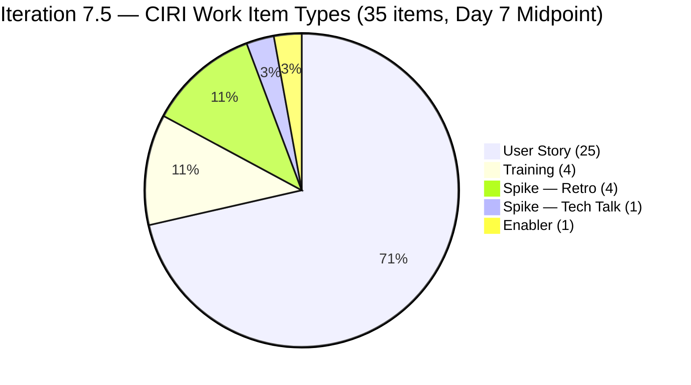
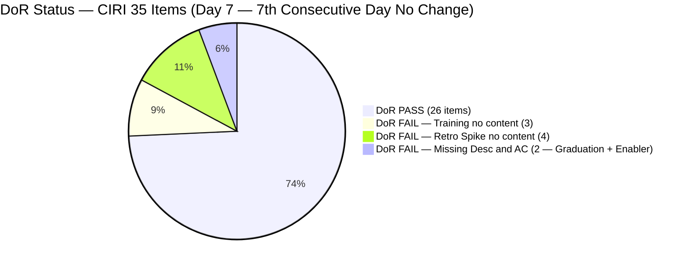
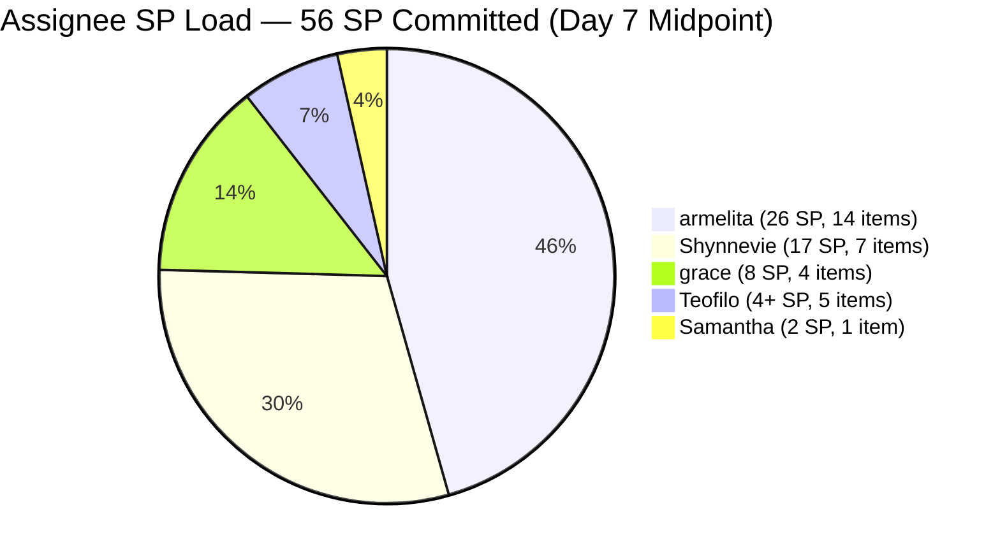
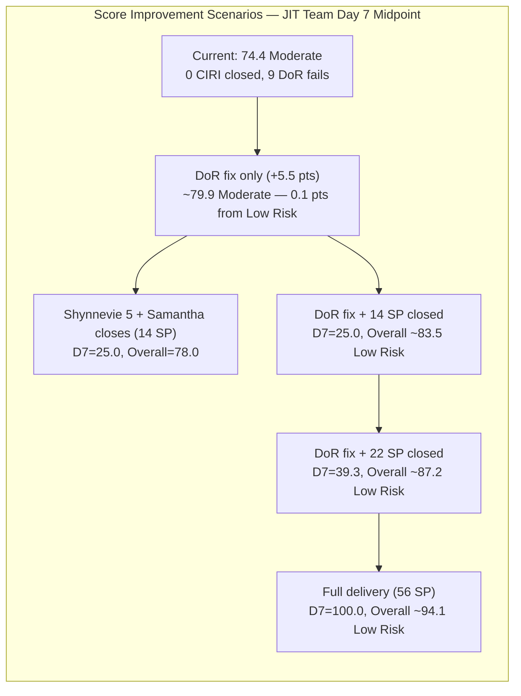

# ADO SAFe Audit — JIT Operation Team

## 1. Audit Metadata

| Field | Value |
|-------|-------|
| Audit Number | #83 |
| Audit Date | 2026-06-07 |
| Audit Time | 09:00 CST |
| Timezone | America/Chicago (CST) |
| Iteration | Iteration 7.5 |
| Iteration Dates | 2026-06-01 – 2026-06-14 |
| Sprint Day | Day 7 of 14 |
| ADO Project | Jairosoft Portfolio (`666bb99a-6acd-4999-bb34-efd0e4ea90dc`) |
| ADO Team | JIT Operation Team (`b25e3129-6272-4e54-a3ff-f1ef3c8eeb2c`) |
| Iteration ID | `9c70d575-210a-4156-bbdc-79f1efbe2869` |
| Iteration Path | `Jairosoft Portfolio\2026-PI7\Iteration 7.5` |
| Workspace | `ado_jit` |
| Prior Audit | AUDIT_20260606_0900.md (Score: 74.4 — Moderate Risk, Day 6) |
| **Overall Score** | **74.4 / 100** |
| **Risk Band** | **Moderate Risk** |

---

## 2. Executive Summary

- Iteration 7.5 enters **Day 7 of 14** — the sprint midpoint — with the JIT Operation Team holding at **74.4 / 100 (Moderate Risk)**, numerically unchanged for the second consecutive day after the Day 5 delivery burst stalled.
- **No new closures occurred overnight.** The same 39 items remain visible in the backlog. The sprint's velocity of 3 closures in Days 3–5 (7 SP) has not been matched in Days 6–7. The team is at its midpoint with 0 visible CIRI items Closed.
- **The 9 DoR-failing items persist for the 7th consecutive day** without remediation (3 Training items from Teofilo, 4 unassigned Retro Spikes, 1 Enabler from Teofilo, 1 User Story from grace). Fixing these adds +5.5 points to the overall score independently of any closures.
- The path to Low Risk is still available: fix all 9 DoR items (+5.5 pts → 79.9) and close 14 SP visible (~1 SP/day remaining) → Overall ≥ 83.5. With 7 days remaining, this is achievable but requires immediate execution.
- **New item #204617** appears in the iteration (also with children) — it is not in the VRBI backlog. It is likely a Training-type item in a Closed or custom state that exited the backlog before this audit. This has no impact on VRBI or scoring.

---

## 3. Previous Audit Delta

| Metric | Audit #82 (2026-06-06, Day 6) | Audit #83 (2026-06-07, Day 7) | Change |
|--------|-------------------------------|-------------------------------|--------|
| Sprint Day | Day 6 of 14 | **Day 7 of 14** | +1 day |
| VRBI | 39 | **39** | No change |
| CIRI | 35 | **35** | No change |
| Items Closed (exited VRBI since sprint open) | 3 (#205383, #205385, #204618) | **3** | No new closures |
| SP Burned (exited VRBI) | 7 SP | **7 SP** | No change |
| DoR PASS items | 26 | **26** | No remediation |
| DoR FAIL items | 9 | **9** | 7th consecutive day |
| D1 — Iteration Planning | 89.7 | **89.7** | Unchanged |
| D2 — Team Capacity | 100.0 | **100.0** | Unchanged |
| D3 — Estimation | 87.1 | **87.1** | Unchanged |
| D4 — DoR Compliance | 74.3 | **74.3** | Unchanged |
| D5 — Work Item Balance | 70.0 | **70.0** | Unchanged |
| D6 — Backlog Refinement | 100.0 | **100.0** | Unchanged |
| D7 — Delivery Predictability | 0.0 (genuine gap, Day 6) | **0.0 (MIDPOINT DELIVERY GAP — Day 7)** | Second day at zero post-annotation |
| **Overall Score** | **74.4 (Moderate)** | **74.4 (Moderate)** | **Unchanged** |
| **Risk Band** | **Moderate Risk** | **Moderate Risk** | Stable; urgency escalating |

### Day 6 → Day 7 Interpretation

No state changes, closures, or DoR remediations were recorded between Day 6 and Day 7. The sprint momentum that produced 3 closures in Days 3–5 has been completely absent in Days 6–7. As of the midpoint, the team has 0 visible CIRI items closed.

The data confirms the Day 6 warning: the 5 Active items assigned to Shynnevie (205574, 205577, 205683, 205692, 205699 — 12 SP total), which were flagged as the fastest path to visible closure, have not moved from Active state. Samantha's sole CIRI item (205507, 2 SP, Active) similarly has not closed.

The 4 Retro Spikes (205538–205541) remain unassigned for a 7th day. The Enabler 205658 and Training items 204620–622 remain undocumented. Grace's graduation item (205687) has had zero content since its creation on June 3.

---

## 4. Current Iteration Snapshot

**Iteration 7.5** · 2026-06-01 – 2026-06-14 · **Day 7 of 14 — Sprint Midpoint** · 7 days remaining

| Field | Value |
|-------|-------|
| Visible Root Backlog Items (VRBI) | 39 |
| Items in Iteration 7.5 (CIRI) | 35 |
| Non-CIRI VRBI items | 4 (#200766 PI8, #203245 Iter 7.6 IP, #203250 Iter 7.3, #204338 Iter 7.4) |
| PECI (non-Training with SP field) | 31 (25 US + 5 Spike + 1 Enabler) |
| ECI (PECI with SP > 0) | 27 (4 Retro Spikes have 0 SP) |
| SP Committed (CSP) | 56 SP |
| SP Closed visible (CLSP) | 0 SP |
| SP Burned (exited VRBI, not in D7) | 7 SP (#205383=2 + #205385=2 + #204618=3) |
| DoR Compliant (DCI) | 26 / 35 (74.3%) |
| DoR Failing (7th consecutive day) | 9 items |
| Active Items | 13 (armelita=4, Shynnevie=5, Samantha=1, grace=2, Teofilo=1) |
| Capacity Total | 23.8 hrs/day |
| Sprint Day / Total | Day 7 / 14 — **midpoint** |
| Days Remaining | 7 |
| Non-VRBI iteration items (Closed/exited) | #204617, #204618, #205383, #205385 |

---

## 5. Work Item Analysis

### CIRI Items — Iteration 7.5 (35 root-level items)

| ID | Title | Type | State | SP | Assignee | DoR | ChangedDate |
|----|-------|------|-------|----|----------|-----|-------------|
| 200771 | UM Digos Interns Final Demo and Awarding | User Story | New | 2 | armelita | PASS | 2026-06-01 |
| 203244 | IT7.5 Tech Talk — AI Tools Demonstration | Spike | New | 2 | armelita | PASS | 2026-06-02 |
| 204477 | Bubble MCC Marketing for June 1–5 | User Story | New | 3 | armelita | PASS | 2026-06-02 |
| 204487 | Python Marketing Activities June 1–5 | User Story | Active | 2 | armelita | PASS | 2026-06-05 |
| 205394 | Bubble EBET Scholarship Batch 1 Billing | User Story | Active | 2 | armelita | PASS | 2026-06-04 |
| 205396 | Bubble EBET Scholarship Batch 1 Payroll | User Story | New | 2 | armelita | PASS | 2026-06-02 |
| 205399 | Bubble EBET Scholarship Batch 2 | User Story | Active | 2 | armelita | PASS | 2026-06-05 |
| 205401 | Request for Bubble EBET Scholarship Batch 2 TIP | User Story | Active | 2 | armelita | PASS | 2026-06-05 |
| 205390 | Bubble EBET SO Request | User Story | New | 2 | armelita | PASS | 2026-06-02 |
| 205330 | CSS Batch 2 Terminal Report | User Story | New | 2 | armelita | PASS | 2026-06-02 |
| 205373 | CSS NC II Batch 2 Special Order Request | User Story | New | 2 | armelita | PASS | 2026-06-02 |
| 205403 | Bubble EBET Scholarship Batch 2 TIP | User Story | New | 2 | armelita | PASS | 2026-06-02 |
| 205405 | Bubble EBET Scholarship Batch 2 Training Enrollment Report | User Story | New | 2 | armelita | PASS | 2026-06-02 |
| 205411 | NEMSU Interview and Onboarding | User Story | New | 1 | armelita | PASS | 2026-06-02 |
| 203595 | JIT Finance Collection Policy | User Story | Active | 2 | grace | PASS | 2026-06-01 |
| 204440 | Package SAFe Micro-credential Dossier | User Story | Active | 2 | grace | PASS | 2026-06-02 |
| 205242 | Audit of payments receipts | User Story | New | 2 | grace | PASS | 2026-06-02 |
| 205687 | Jairosoft 1st Graduation June 2026 | User Story | New | 2 | grace | **FAIL** | 2026-06-03 |
| 205507 | Compile Bubble Training Records | User Story | Active | 2 | Samantha | PASS | 2026-06-02 |
| 205574 | Bubble EBET Scholarship Reels | User Story | Active | 2 | Shynnevie | PASS | 2026-06-02 |
| 205577 | Bubble.IO TESDA Scholarship Batch 2 — Final List | User Story | Active | 3 | Shynnevie | PASS | 2026-06-03 |
| 205683 | BATCH 1 — Requirements Compilation EBET Scholarship | User Story | Active | 1 | Shynnevie | PASS | 2026-06-03 |
| 205692 | BATCH 2 — BUBBLE.IO EBET — Preparation for Induction Training | User Story | Active | 3 | Shynnevie | PASS | 2026-06-05 |
| 205699 | Batch 2 — BUBBLE EBET — Prepare Training Material | User Story | Active | 3 | Shynnevie | PASS | 2026-06-05 |
| 205701 | BATCH 2 — BUBBLE.IO EBET — ITP Template Reels | User Story | New | 3 | Shynnevie | PASS | 2026-06-03 |
| 205703 | BATCH 2 — BUBBLE.IO EBET — ID for the Scholar | User Story | New | 2 | Shynnevie | PASS | 2026-06-03 |
| 204619 | 2.3-1 Set Router/Wi-Fi Configuration Training | Training | Active | 3 | Teofilo | PASS | 2026-06-05 |
| 204620 | 2.4-1 Ensure Config Conforms to Manual Training | Training | New | — | Teofilo | **FAIL** | 2026-06-03 |
| 204621 | 2.4-2 Computer Networks Checked Training | Training | New | — | Teofilo | **FAIL** | 2026-06-04 |
| 204622 | 2.4-3 Prepare Reports Training | Training | New | — | Teofilo | **FAIL** | 2026-06-03 |
| 205658 | Batch 2 Results | Enabler | New | 1 | Teofilo | **FAIL** | 2026-06-03 |
| 205538 | [Retro] Increase number of training hours | Spike | New | — | Unassigned | **FAIL** | 2026-06-02 |
| 205539 | [Retro] Create material for workflows | Spike | New | — | Unassigned | **FAIL** | 2026-06-02 |
| 205540 | [Retro] Review training material instructions | Spike | New | — | Unassigned | **FAIL** | 2026-06-02 |
| 205541 | [Retro] eLMS crash | Spike | New | — | Unassigned | **FAIL** | 2026-06-02 |

### Items Closed / Exited VRBI (Since Sprint Open — Not Scored in D7)

| ID | Title | Type | SP | ClosedDate |
|----|-------|------|----|------------|
| 205383 | Onboard Shynnevie Fernandez | User Story | 2 | 2026-06-03 |
| 205385 | EBET Batch 1 Terminal Reports | User Story | 2 | 2026-06-05 |
| 204618 | 2.2-1 Network Configuration Training | Training | 3 | 2026-06-05 |

### Non-CIRI VRBI Items (4 persistent carryovers)

| ID | Title | Iteration | Type | Assignee |
|----|-------|-----------|------|----------|
| 200766 | ODOO OpenCat SIS | PI8 | Spike | armelita |
| 203245 | IT7.6 Tech Talk | Iter 7.6 IP | Spike | armelita |
| 203250 | Claude 4 Course Completion | Iter 7.3 | Spike | armelita |
| 204338 | Bubble Tesda Training | Iter 7.4 | Training | Samantha |

### Assignee Distribution (CIRI = 35)

| Assignee | Items | SP (scored) | Active | DoR Failing |
|----------|-------|------------|--------|-------------|
| armelita | 14 | 26 | 4 | 0 |
| Shynnevie Fernandez | 7 | 17 | 5 | 0 |
| grace | 4 | 8 | 2 | 1 (#205687) |
| Teofilo Limpag | 5 | 4 + 3 training | 1 | 4 (204620–622, 205658) |
| Samantha Babael | 1 | 2 | 1 | 0 |
| Unassigned | 4 | 0 | 0 | 4 (Retro Spikes) |

---

## 6. SAFe Compliance Scorecard

| Dimension | Score | Evidence (Numerator / Denominator) | Notes |
|-----------|-------|------------------------------------|-------|
| D1 — Iteration Planning | **89.7** | CIRI 35 / VRBI 39 | 4 non-CIRI items: PI8, Iter 7.6 IP, Iter 7.3, Iter 7.4 |
| D2 — Team Capacity | **100.0** | CC 5 / CW 5 | All 5 assignees have positive configured capacity |
| D3 — Estimation | **87.1** | ECI 27 / PECI 31 | 4 Retro Spikes unestimated (SP=0) |
| D4 — DoR Compliance | **74.3** | DCI 26 / CIRI 35 | 9 failing: 3 Training + 4 Retro Spikes + Enabler + US#205687 — 7th consecutive day |
| D5 — Work Item Balance | **70.0** | US 71.4% > 60% → −30; US present → no −40; Spike 14.3% → no −20 | Structural |
| D6 — Backlog Refinement | **100.0** | fresh 39/39; stale_90=0; stale_180=0; untouched 0/35 | All items changed ≥ 2026-05-03; none stale |
| D7 — Delivery Predictability | **0.0** | CLSP 0 / CSP 56 | Day 7 — Sprint midpoint. No visible CIRI closures. Second genuine-gap day. |

**Overall = (89.7 + 100.0 + 87.1 + 74.3 + 70.0 + 100.0 + 0.0) / 7 = 521.1 / 7 = 74.4 / 100 — Moderate Risk**

---

## 7. Dimension Findings

### D1 — Iteration Planning (89.7)

- VRBI = 39; CIRI = 35. Four non-CIRI items persist: #200766 (PI8), #203245 (Iter 7.6 IP), #203250 (Iter 7.3), #204338 (Iter 7.4).
- Formula: 35 / 39 × 100 = **89.7**
- Resolving all 4 non-CIRI items (close, move to 7.5, or de-commit) → D1 = 100.0 (+1.5 pts to overall).
- #204617 (Training type) appeared in the iteration path but not in VRBI — likely closed/exited before this audit. No impact on scoring.

### D2 — Team Capacity (100.0)

- CW = 5: armelita, grace, Samantha, Shynnevie, Teofilo.
- CC = 5: Shynnevie 6 hrs/day, armelita 6 hrs/day, Samantha 6 hrs/day, Teofilo 4.8 hrs/day, grace 1 hr/day.
- Formula: 5 / 5 × 100 = **100.0**

### D3 — Estimation (87.1)

- PECI = 31 (25 US + 5 Spike + 1 Enabler; 4 Training items excluded).
- ECI = 27 (PECI minus 4 unestimated Retro Spikes: 205538–205541 have SP=0 or blank).
- CSP = 56 SP.
- Formula: 27 / 31 × 100 = **87.1**
- Fix: Assign SP ≥ 1 to 205538–541 → D3 = 100.0 (+1.8 pts).

### D4 — DoR Compliance (74.3) — 7th Consecutive Day Without Remediation

- CIRI = 35; DCI = 26; Failing = 9.
- **FAIL items (unchanged from Day 3):**
  - **Training 204620, 204621, 204622** (Teofilo) — no Description, no AC. Template demonstrated on #204619 and closed #204618. Not applied to these 3.
  - **Retro Spikes 205538, 205539, 205540, 205541** (Unassigned) — no Description, no AC, SP=0, no owner. 7th day.
  - **Enabler 205658** (Teofilo) — no Description, no AC. 1 SP but no content.
  - **User Story 205687** (grace) — no Description, no AC. Created June 3; 4 days with no content. Graduation event urgency increasing.
- Formula: 26 / 35 × 100 = **74.3**
- Full remediation: DCI = 35 → D4 = 100.0 (+3.7 pts). Combined with D3 fix: +5.5 pts → overall ~79.9.

### D5 — Work Item Balance (70.0)

- CIRI = 35; User Story = 25 / 35 = 71.4% → −30 penalty.
- Spike = 5 / 35 = 14.3% → no −20 penalty.
- User Stories present → no −40 penalty.
- Formula: max(0, 100 − 30) = **70.0**. Structural; no near-term resolution.

### D6 — Backlog Refinement (100.0)

- VRBI = 39; fresh (ChangedDate ≥ 2026-04-22): all 39 items — earliest is #200766 at 2026-05-03 (within 45-day window). All others 2026-06-01 or later.
- Stale_90 (< 2026-03-09): 0 items.
- Stale_180 (< 2025-12-10): 0 items.
- Untouched CIRI (ChangedDate < 2026-06-01): 0 items.
- Formula: max(0, 100.0) = **100.0**

### D7 — Delivery Predictability (0.0) — Sprint Midpoint Delivery Gap

- CSP = 56 SP; CLSP = 0 SP.
- Formula: 0 / 56 × 100 = **0.0**
- **Day 7 = sprint midpoint.** No early-sprint annotation applies. The team has 0 visible CIRI closures after consuming half the sprint. The 7 SP burned in Days 3–5 exited the VRBI and cannot be counted in D7 per rubric.
- **Low Risk threshold:** For overall ≥ 80.0 without DoR fix: D7 must reach ≥ 38.9 → CLSP ≥ 22 SP of 56 (~3.1 SP/day for 7 remaining days).
- **With full DoR fix (+5.5 pts):** Low Risk threshold drops to D7 ≥ 25.5 → CLSP ≥ 14 SP (~2.0 SP/day for 7 remaining days). More achievable.
- Shynnevie's 5 Active items (12 SP) and Samantha's 1 Active item (2 SP) = 14 SP available for near-immediate closure. With DoR fix, this alone achieves Low Risk.

---

## 8. Risks and Bottlenecks

| Risk | Severity | Status | Detail |
|------|----------|--------|--------|
| 9 CIRI items lack Desc/AC — D4 = 74.3 | **CRITICAL** | 7th consecutive day | Same 9 items; no remediation since Day 3. Each day without fixing is a day closer to sprint end with a structural deficit. |
| 4 Retro Spikes unassigned — 7th day | **CRITICAL** | Escalating | 205538–541: no SP, no owner, no content. Retrospective actions decaying without any ownership. |
| D7 = 0.0 — midpoint delivery gap (Day 7) | **HIGH** | Second genuine-gap day | Zero visible CIRI closures. 22 SP needed for Low Risk without DoR fix; 14 SP with full DoR fix. |
| 205687 (Graduation, grace) — 4 days undocumented | **HIGH** | Increasing urgency | Graduation event likely has a fixed date; zero content since June 3 creation. |
| 205658 (Batch 2 Results, Teofilo) — undocumented | **HIGH** | Persistent | 1 SP Enabler; template available from #204619; not applied. |
| Shynnevie 5 Active items stalled (12 SP) | **HIGH** | Stalled since Day 5 | No closures from Shynnevie in Days 6–7 despite 5 items in Active state. |
| armelita: 14 CIRI items (26 SP) — load | **MEDIUM** | Growing | 4 Active; EBET Batch 2 series has sequential dependencies. |
| 204338 (TESDA Training, Iter 7.4, Samantha) | **MEDIUM** | 7th sprint | Non-CIRI; multi-sprint carryover; D1 penalty contributor. |
| 203595 (Finance Policy, grace) — 21+ days Active | **LOW** | Chronic | System/policy approval dependency; chronically Active. |
| Low Risk threshold requires 22 SP visible (or 14 SP with DoR fix) | **MEDIUM** | 7 days remaining | Achievable but requires execution restart today. |

---

## 9. Prioritized Recommendations

1. **Document all 9 DoR-failing items today — Day 7 (CRITICAL, 7th escalation)** — Every day this goes unfixed reduces the sprint's Low Risk potential. Fixing all 9 items adds +5.5 pts to overall and drops the D7 threshold for Low Risk from 22 SP to 14 SP.
   - **Teofilo (4 items):** Apply the #204619 template to 204620, 204621, 204622 (3 Training). Add Description and AC to 205658 (Batch 2 Results Enabler): what "Batch 2 Results" means, evidence required (assessment scores, completion records), and AC for when it's done.
   - **grace (1 item):** Add to #205687 (Graduation June 2026): date, scope (graduates, ceremony, venue), AC (invitations sent, certificates prepared, ceremony held, photos archived, results documented in ADO).
   - **armelita or Teofilo (4 Retro Spikes):** Assign 205538 and 205539 to armelita; 205540 and 205541 to Teofilo. Add 30-char description each, write specific AC, estimate 1 SP each. These items are retroactive process improvement actions — they should be owned, worked, and delivered.

2. **Close Shynnevie's 5 Active items today (HIGH)** — Items 205683 (1 SP, compile to GDrive = done when files uploaded), 205574 (2 SP, reels posted), and 205577 (3 SP, final list submitted) appear execution-complete or near-complete. Closing these 3 items (6 SP): D7 = 6/56 = 10.7, Overall = 75.9. Closing all 5 (12 SP): D7 = 12/56 = 21.4, Overall = 77.5. Combined with full DoR fix: Overall = 83.0 (Low Risk).

3. **Close Samantha's #205507 today (HIGH)** — "Compile Bubble Training Records" (2 SP, Active since Jun 2). Records compilation with 5-step AC. If complete: +2 SP. Combined with Shynnevie's 5 closures (14 SP total) + DoR fix → D7 = 25.0, Overall = 84.1 (Low Risk).

4. **Target 22+ SP visible closures by Day 11 (June 11) for Low Risk without DoR fix (MODERATE)** — At 3.1 SP/day for 7 remaining days. Priority sequence: Shynnevie batch (205683, 205574, 205577, 205692, 205699), Samantha (205507), armelita New items (204477, 205399, 205401, 205394). With DoR fix, target drops to 14 SP achievable by Day 9.

5. **Resolve non-CIRI carryovers: #204338 and #203250 today (MODERATE)** — #204338 (Samantha, Iter 7.4) and #203250 (armelita, Iter 7.3) are multi-sprint carryovers contributing to D1 penalty. Close if done; move to 7.5 if active; de-commit if out of scope. Each resolution moves D1 toward 100.0.

6. **Define sprint goal for Iteration 7.5 (MODERATE — 7th iteration without one)** — Suggested text: *"Deliver TESDA compliance documentation for Bubble EBET Batch 1 and CSS Batch 2, execute Batch 2 TIP and Induction, compile Bubble training records and reels, onboard NEMSU interns, and close all retrospective improvement spikes — within PI7 Iteration 7.5 (June 14)."*

---

## 10. Evidence Gaps and Limitations

| Gap | Impact | Notes |
|-----|--------|-------|
| 3 closures exited VRBI before D7 scoring | D7 cannot count 7 SP burned | 205383+205385+204618 (7 SP actual burn); not visible to formula. |
| #204617 in iteration but not in VRBI | No scoring impact | Training type; likely closed before this audit; not in Stories/Deliverables backlog. |
| Training items excluded from PECI | D3 coverage gap | Teofilo's 4 Training items excluded per convention. |
| 4 Retro Spikes unassigned 7 days | D3 and D4 penalized | No owner; no content; decaying retrospective actions. |
| 204338 multi-sprint carryover | D1 penalty | Samantha's Iter 7.4 Training item; sixth sprint as carryover. |
| 203595 Active 21+ days | WIP staleness | Finance Policy (grace) approval dependency; chronically Active. |
| Sprint goal absent | Governance gap | No sprint goal for 7th consecutive iteration. |

---

## Visualizations

### Score Trend — JIT Operation Team (Iteration 7.5)

| Date | Audit | Score | Band | Sprint Day | Notable |
|------|-------|-------|------|-----------|---------|
| Jun 1 | #77 | 68.8 | Moderate | Day 1 | Sprint open; D1=60.7 |
| Jun 2 | #78 | 73.2 | Moderate | Day 2 | +13 items; Shynnevie onboarded |
| Jun 3 | #79 | 73.1 | Moderate | Day 3 | +3 items; Teofilo assigned; D4 drops |
| Jun 4 | #80 | 74.0 | Moderate | Day 4 | +4 Shynnevie items; D4 recovers |
| Jun 5 | #81 | 74.4 | Moderate | Day 5 | 3 closures (7 SP); 204619 DoR PASS |
| Jun 6 | #82 | 74.4 | Moderate | Day 6 | No activity; early-sprint grace removed |
| **Jun 7** | **#83** | **74.4** | **Moderate** | **Day 7 (Midpoint)** | **No activity; 9 DoR fails = 7th day; midpoint stall** |

### D7 Recovery Projection — Iteration 7.5 (56 SP Committed, 7 days remaining)

| Scenario | SP Visible Closed | D7 | Base Overall | With Full DoR/D3 Fix (+5.5 pts) | Band |
|----------|--------------------|----|--------------|---------------------------------|------|
| 0 closures (current) | 0/56 | 0.0 | 74.4 | ~79.9 | Moderate |
| Shynnevie 3 (6 SP) | 6/56 | 10.7 | 75.9 | ~81.4 | Low |
| Shynnevie 5 + Samantha (14 SP) | 14/56 | 25.0 | 78.0 | ~83.5 | Low |
| Low Risk threshold (22 SP) | 22/56 | 39.3 | 80.0 | ~85.5 | Low |
| Mid-sprint target (28 SP) | 28/56 | 50.0 | 81.5 | ~87.0 | Low |
| Full delivery (56 SP) | 56/56 | 100.0 | 88.6 | ~94.1 | Low |

---

*Audit #83 generated by Claude Code (claude-sonnet-4-6) on 2026-06-07 09:00 CST. Evidence sourced from Azure DevOps MCP (Jairosoft Portfolio project, team b25e3129-6272-4e54-a3ff-f1ef3c8eeb2c, Iteration 7.5 ID 9c70d575-210a-4156-bbdc-79f1efbe2869). Rubric: SAFe 6.0 7-dimension scorecard v1. Iteration 7.5 is Day 7 of 14 — sprint midpoint. Score: 74.4 / 100 (Moderate Risk — unchanged for 2 days). 39 visible items, 56 SP committed. 3 items closed (7 SP burned — not scored in D7). 9 DoR-failing items persist for 7th consecutive day. No visible CIRI closures since sprint open. Priority: fix 9 DoR items immediately (+5.5 pts), close Shynnevie's 5 Active items and Samantha's item (14 SP) → Low Risk achievable today.*
