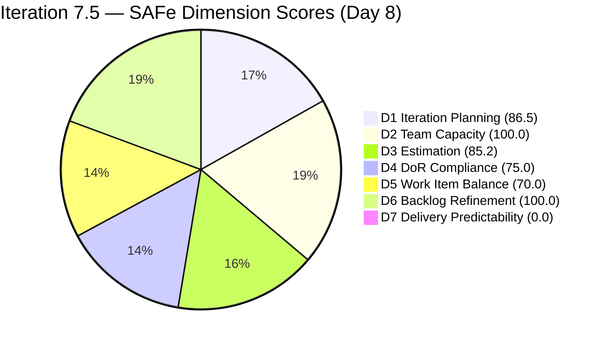
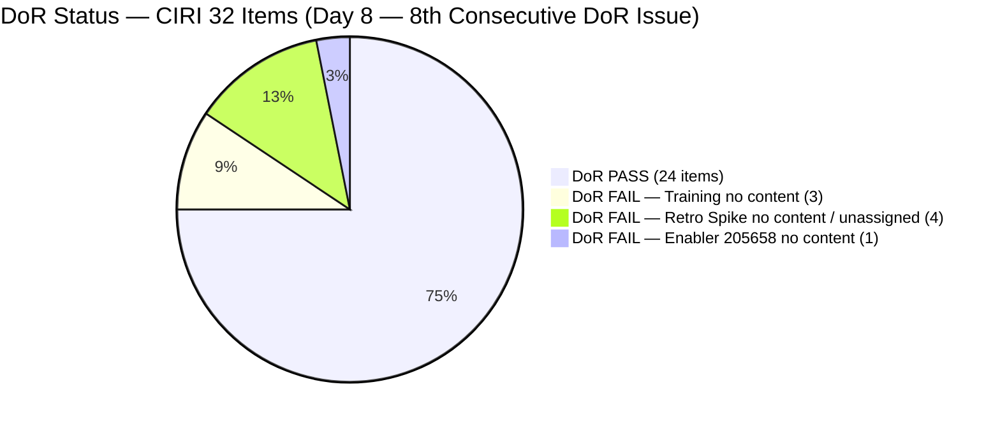
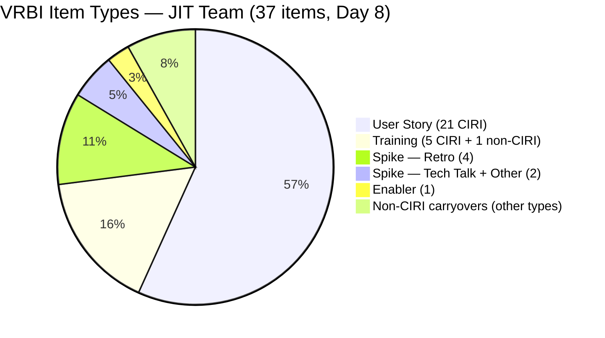
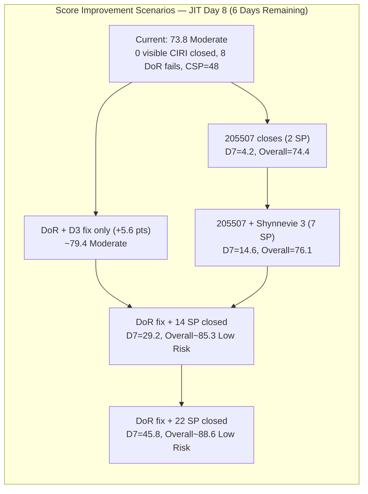

# ADO SAFe Audit — JIT Operation Team

## 1. Audit Metadata

| Field | Value |
|-------|-------|
| Audit Number | #84 |
| Audit Date | 2026-06-08 |
| Audit Time | 09:00 CST |
| Timezone | America/Chicago (CST) |
| Iteration | Iteration 7.5 |
| Iteration Dates | 2026-06-01 – 2026-06-14 |
| Sprint Day | Day 8 of 14 |
| ADO Project | Jairosoft Portfolio (`666bb99a-6acd-4999-bb34-efd0e4ea90dc`) |
| ADO Team | JIT Operation Team (`b25e3129-6272-4e54-a3ff-f1ef3c8eeb2c`) |
| Iteration ID | `9c70d575-210a-4156-bbdc-79f1efbe2869` |
| Iteration Path | `Jairosoft Portfolio\2026-PI7\Iteration 7.5` |
| Workspace | `ado_jit` |
| Prior Audit | AUDIT_20260607_0900.md (Score: 74.4 — Moderate Risk, Day 7) |
| **Overall Score** | **73.8 / 100** |
| **Risk Band** | **Moderate Risk** |

---

## 2. Executive Summary

- Iteration 7.5 is on **Day 8 of 14** — past the sprint midpoint — and the JIT Operation Team scores **73.8 / 100 (Moderate Risk)**, a slight decline from 74.4 due to backlog restructuring and DoR changes.
- **Three items closed today (6 SP delivered):** #204487 (Python Marketing, armelita, 2 SP), #205399 (Bubble EBET Scholarship Batch 2, armelita, 2 SP), and #203595 (JIT Finance Collection Policy, grace, 2 SP) all exited the VRBI. This is the first visible delivery activity since Days 3–5.
- **Significant board changes:** Item #205687 (Graduation, grace) moved from Iteration 7.5 to Iteration 7.6 (IP), removing it from CIRI. Item #205886 (Bubble Training Batch 2, Samantha, 5 SP Training) was added to the iteration.
- **D7 remains 0.0** despite the 3 closures — closed items exited the VRBI and cannot be counted per rubric. CSP dropped from 56 to 48 SP as the closed items' SP left the scoring universe.
- **8 DoR-failing items persist** (down from 9 — 205687 removed from CIRI). The path to Low Risk: fix 8 DoR items (+5.3 pts → ~79.1) and close 14+ SP visible → Overall ≥ 82.5. With 6 days remaining and today's momentum, this is achievable.

---

## 3. Previous Audit Delta

| Metric | Audit #83 (2026-06-07, Day 7) | Audit #84 (2026-06-08, Day 8) | Change |
|--------|-------------------------------|-------------------------------|--------|
| Sprint Day | Day 7 of 14 | **Day 8 of 14** | +1 day |
| VRBI | 39 | **37** | −2 (3 closed, 1 new item added) |
| CIRI | 35 | **32** | −3 (3 closed exited VRBI; #205687 moved to Iter 7.6; #205886 added as Training) |
| Items Closed (exited VRBI since sprint open) | 3 | **6** | +3 new closures today |
| New items | — | **#205886 (Bubble Training Batch 2, Samantha, 5 SP)** | New Training item |
| SP Burned (exited VRBI, cumulative) | 7 SP | **13 SP** | +6 SP (204487 2SP + 205399 2SP + 203595 2SP) |
| DoR FAIL items (CIRI) | 9 | **8** | −1 (205687 moved to Iter 7.6) |
| PECI | 31 | **27** | −4 (3 closed items exit; 205687 exits; +1 Training 205886 excluded) |
| ECI | 27 | **23** | −4 (same reasons) |
| CSP | 56 SP | **48 SP** | −8 SP (3 closed + 205687 moved) |
| D1 — Iteration Planning | 89.7 | **86.5** | −3.2 (5 non-CIRI items now, VRBI = 37) |
| D2 — Team Capacity | 100.0 | **100.0** | Unchanged |
| D3 — Estimation | 87.1 | **85.2** | −1.9 (PECI=27, ECI=23) |
| D4 — DoR Compliance | 74.3 | **75.0** | +0.7 (205687 no longer in CIRI; DCI=24/32) |
| D5 — Work Item Balance | 70.0 | **70.0** | Unchanged |
| D6 — Backlog Refinement | 100.0 | **100.0** | Unchanged |
| D7 — Delivery Predictability | 0.0 | **0.0** | Unchanged (closed items exited VRBI per rubric) |
| **Overall Score** | **74.4 (Moderate)** | **73.8 (Moderate)** | **−0.6** |
| **Risk Band** | **Moderate Risk** | **Moderate Risk** | Stable |

### Day 7 → Day 8 Interpretation

Three significant closures occurred today — #204487 (armelita), #205399 (armelita), and #203595 (grace). This represents the team's first delivery activity since Days 3–5 and totals 6 SP burned overnight. Unfortunately, these closures exit the VRBI, so D7 cannot count them per rubric. The CSP dropped from 56 to 48 SP as these items left the scoring universe.

Item #205687 (Graduation event, grace) was moved to Iteration 7.6 IP — it exits CIRI, reducing DoR failures from 9 to 8 and slightly improving D4. Item #205886 (Bubble Training Batch 2, Samantha, Training type) was added to the iteration; it is excluded from PECI but adds to VRBI and CIRI counts.

Samantha's #205507 (Compile Bubble Training Records) advanced to "UAT Testing" state — still not Closed, but progress is visible. A new 5 SP Training item (#205886 "Bubble Training Batch 2") was committed by Samantha.

The slight overall decline (74.4 → 73.8) reflects structural changes: D1 ticked down with an additional non-CIRI item (205687 now Iter 7.6), and D3 dropped marginally with fewer PECI items. D4 improved slightly.

---

## 4. Current Iteration Snapshot

**Iteration 7.5** · 2026-06-01 – 2026-06-14 · **Day 8 of 14** · 6 days remaining

| Field | Value |
|-------|-------|
| Visible Root Backlog Items (VRBI) | 37 |
| Items in Iteration 7.5 (CIRI) | 32 |
| Non-CIRI VRBI items | 5 (#200766 PI8, #203245 Iter 7.6 IP, #203250 Iter 7.3, #204338 Iter 7.4, #205687 Iter 7.6 IP) |
| PECI (non-Training with SP field) | 27 (21 US + 5 Spike + 1 Enabler) |
| ECI (PECI with SP > 0) | 23 (4 Retro Spikes have no SP) |
| SP Committed (CSP from ECI) | 48 SP |
| SP Closed visible (CLSP) | 0 SP |
| SP Burned (exited VRBI, cumulative) | 13 SP (204487=2 + 205399=2 + 203595=2 + 205383=2 + 205385=2 + 204618=3) |
| DoR Compliant (DCI) | 24 / 32 (75.0%) |
| DoR Failing | 8 items |
| Active Items (CIRI) | 11 |
| #205507 Status | UAT Testing (Samantha — progressed from Active) |
| Sprint Day / Total | Day 8 / 14 — post-midpoint |
| Days Remaining | 6 |

---

## 5. Work Item Analysis

### CIRI Items — Iteration 7.5 (32 root-level items)

| ID | Title | Type | State | SP | Assignee | DoR | ChangedDate | Note |
|----|-------|------|-------|----|----------|-----|-------------|------|
| 200771 | UM Digos Interns Final Demo and Awarding | User Story | New | 2 | armelita | PASS | 2026-06-01 | |
| 203244 | IT7.5 Tech Talk — AI Tools Demonstration | Spike | New | 2 | armelita | PASS | 2026-06-02 | |
| 204440 | Package SAFe Micro-credential Dossier | User Story | Active | 2 | grace | PASS | 2026-06-08 | Changed today |
| 204477 | Bubble MCC Marketing for June 1–5 | User Story | New | 3 | armelita | PASS | 2026-06-02 | |
| 204619 | 2.3-1 Set Router/Wi-Fi Configuration Training | Training | Active | 3 | Teofilo | PASS | 2026-06-05 | Training — excluded from PECI |
| 204620 | 2.4-1 Ensure Config Conforms to Manual Training | Training | New | — | Teofilo | **FAIL** | 2026-06-03 | No Desc, no AC |
| 204621 | 2.4-2 Computer Networks Checked Training | Training | New | — | Teofilo | **FAIL** | 2026-06-04 | No Desc, no AC |
| 204622 | 2.4-3 Prepare Reports Training | Training | New | — | Teofilo | **FAIL** | 2026-06-03 | No Desc, no AC |
| 205242 | Audit of payments receipts | User Story | Active | 2 | grace | PASS | 2026-06-08 | Changed today |
| 205330 | CSS Batch 2 Terminal Report | User Story | New | 2 | armelita | PASS | 2026-06-02 | |
| 205373 | CSS NC II Batch 2 Special Order Request | User Story | New | 2 | armelita | PASS | 2026-06-02 | |
| 205390 | Bubble EBET Scholarship SO Request | User Story | New | 2 | armelita | PASS | 2026-06-02 | |
| 205394 | Bubble EBET Scholarship Batch 1 Billing | User Story | Active | 2 | armelita | PASS | 2026-06-04 | |
| 205396 | Bubble EBET Scholarship Batch 1 Payroll | User Story | New | 2 | armelita | PASS | 2026-06-02 | |
| 205401 | Request for Bubble EBET Scholarship Batch 2 TIP | User Story | Active | 2 | armelita | PASS | 2026-06-05 | |
| 205403 | Bubble EBET Scholarship Batch 2 TIP | User Story | New | 2 | armelita | PASS | 2026-06-02 | |
| 205405 | Bubble EBET Scholarship Batch 2 Training Enrollment Report | User Story | New | 2 | armelita | PASS | 2026-06-02 | |
| 205411 | NEMSU Interview and Onboarding | User Story | New | 1 | armelita | PASS | 2026-06-02 | |
| 205507 | Compile Bubble Training Records | User Story | UAT Testing | 2 | Samantha | PASS | 2026-06-08 | Advanced from Active — progressing |
| 205538 | [Retro] Increase number of training hours | Spike | New | — | Unassigned | **FAIL** | 2026-06-02 | 8th day unassigned |
| 205539 | [Retro] Create material for workflows | Spike | New | — | Unassigned | **FAIL** | 2026-06-02 | 8th day unassigned |
| 205540 | [Retro] Review training material instructions | Spike | New | — | Unassigned | **FAIL** | 2026-06-02 | 8th day unassigned |
| 205541 | [Retro] eLMS crash | Spike | New | — | Unassigned | **FAIL** | 2026-06-02 | 8th day unassigned |
| 205574 | Bubble EBET Scholarship Reels | User Story | Active | 2 | Shynnevie | PASS | 2026-06-02 | |
| 205577 | Bubble.IO TESDA Scholarship Batch 2 — Final List | User Story | Active | 3 | Shynnevie | PASS | 2026-06-03 | |
| 205658 | Batch 2 Results | Enabler | New | 1 | Teofilo | **FAIL** | 2026-06-03 | No Desc, no AC |
| 205683 | BATCH 1 — Requirements Compilation EBET Scholarship | User Story | Active | 1 | Shynnevie | PASS | 2026-06-03 | |
| 205692 | BATCH 2 — BUBBLE.IO EBET — Preparation for Induction Training | User Story | Active | 3 | Shynnevie | PASS | 2026-06-05 | |
| 205699 | Batch 2 — BUBBLE EBET — Prepare Training Material | User Story | Active | 3 | Shynnevie | PASS | 2026-06-05 | |
| 205701 | BATCH 2 — BUBBLE.IO EBET — ITP Template Reels | User Story | New | 3 | Shynnevie | PASS | 2026-06-03 | |
| 205703 | BATCH 2 — BUBBLE.IO EBET — ID for the Scholar | User Story | New | 2 | Shynnevie | PASS | 2026-06-03 | |
| 205886 | Bubble Training Batch 2 | Training | Ready | 5 | Samantha | PASS | 2026-06-08 | New today; Training type — excluded from PECI |

### Items Closed / Exited VRBI (Cumulative Since Sprint Open)

| ID | Title | Type | SP | ClosedDate | Assignee |
|----|-------|------|----|------------|---------|
| 205383 | Onboard Shynnevie Fernandez | User Story | 2 | 2026-06-03 | Shynnevie |
| 205385 | EBET Batch 1 Terminal Reports | User Story | 2 | 2026-06-05 | Shynnevie |
| 204618 | 2.2-1 Network Configuration Training | Training | 3 | 2026-06-05 | Teofilo |
| **204487** | **Python Marketing Activities June 1–5** | **User Story** | **2** | **2026-06-08** | **armelita** |
| **205399** | **Bubble EBET Scholarship Batch 2** | **User Story** | **2** | **2026-06-08** | **armelita** |
| **203595** | **JIT Finance Collection Policy** | **User Story** | **2** | **2026-06-08** | **grace** |

### Non-CIRI VRBI Items (5 carryovers)

| ID | Title | Iteration | Type | Assignee |
|----|-------|-----------|------|----------|
| 200766 | ODOO OpenCat SIS | PI8 | Spike | armelita |
| 203245 | IT7.6 Tech Talk | Iter 7.6 IP | Spike | armelita |
| 203250 | Claude 4 Course Completion | Iter 7.3 | Spike | armelita |
| 204338 | Bubble Tesda Training | Iter 7.4 | Training | Samantha |
| 205687 | Jairosoft 1st Graduation June 2026 | **Iter 7.6 IP** | User Story | grace |

### Assignee Distribution (CIRI = 32)

| Assignee | Items | Active | DoR Failing | Note |
|----------|-------|--------|-------------|------|
| armelita | 11 | 2 | 0 | 3 items closed today (204487, 205399) |
| Shynnevie Fernandez | 7 | 5 | 0 | 5 Active; no closures today |
| Samantha Babael | 2 | 1 (UAT Testing) | 0 | 205507 in UAT; 205886 new Training |
| grace | 2 | 2 | 0 | 203595 closed today; 204440 + 205242 active |
| Teofilo Limpag | 5 | 1 | 4 (204620, 621, 622, 205658) | Training items still undocumented |
| Unassigned | 4 | 0 | 4 (Retro Spikes) | 8th consecutive day unassigned |

---

## 6. SAFe Compliance Scorecard

| Dimension | Score | Evidence (Numerator / Denominator) | Notes |
|-----------|-------|------------------------------------|-------|
| D1 — Iteration Planning | **86.5** | CIRI 32 / VRBI 37 | 5 non-CIRI items: PI8, 2× Iter 7.6 IP, Iter 7.3, Iter 7.4 |
| D2 — Team Capacity | **100.0** | CC 5 / CW 5 | All 5 assignees with CIRI items have positive configured capacity |
| D3 — Estimation | **85.2** | ECI 23 / PECI 27 | 4 Retro Spikes unestimated (SP blank); 5 Training items excluded |
| D4 — DoR Compliance | **75.0** | DCI 24 / CIRI 32 | 8 failing: 3 Training (no Desc/AC) + 4 Retro Spikes + Enabler 205658 |
| D5 — Work Item Balance | **70.0** | US 21/32=65.6% > 60% → −30; US present → no −40; Spike 15.6% → no −20 | Structural |
| D6 — Backlog Refinement | **100.0** | fresh 37/37; stale_90=0; stale_180=0; untouched 0/32 | All items changed ≥ 2026-05-03; no staleness |
| D7 — Delivery Predictability | **0.0** | CLSP 0 / CSP 48 | Day 8 — 3 closures today exited VRBI; no visible CIRI items Closed |

**Overall = (86.5 + 100.0 + 85.2 + 75.0 + 70.0 + 100.0 + 0.0) / 7 = 516.7 / 7 = 73.8 / 100 — Moderate Risk**

---

## 7. Dimension Findings

### D1 — Iteration Planning (86.5)

- VRBI = 37; CIRI = 32. Five non-CIRI items: #200766 (PI8), #203245 (Iter 7.6 IP), #203250 (Iter 7.3), #204338 (Iter 7.4), #205687 (Iter 7.6 IP — moved today).
- Formula: 32 / 37 × 100 = **86.5**
- Resolving 4 persistent non-CIRI carryovers (#200766, #203250, #204338 + #203245) → D1 approaches 100 as carryovers close or re-commit. #205687 movement to 7.6 IP was appropriate.

### D2 — Team Capacity (100.0)

- CW = 5: armelita, grace, Samantha, Shynnevie, Teofilo (all have ≥1 CIRI item).
- CC = 5: Shynnevie 6 hrs/day, armelita 6 hrs/day, Samantha 6 hrs/day, Teofilo 4.8 hrs/day, grace 1 hr/day.
- Formula: 5 / 5 × 100 = **100.0**

### D3 — Estimation (85.2)

- PECI = 27 (21 US + 5 Spike + 1 Enabler; 5 Training items excluded from PECI).
- ECI = 23 (PECI minus 4 unestimated Retro Spikes: 205538–205541 have SP blank).
- CSP = 48 SP.
- Formula: 23 / 27 × 100 = **85.2**
- Fix: Assign SP ≥ 1 to Retro Spikes 205538–541 → ECI = 27, D3 = 100.0 (+2.1 pts).

### D4 — DoR Compliance (75.0) — 8th Consecutive Day Without Full Remediation

- CIRI = 32; DCI = 24; Failing = 8.
- **FAIL items:**
  - **Training 204620, 204621, 204622** (Teofilo) — no Description, no AC. Template exists from #204619 (DoR PASS). 8th day without applying it.
  - **Retro Spikes 205538, 205539, 205540, 205541** (Unassigned) — no Description, no AC, SP blank, no owner. 8th consecutive day.
  - **Enabler 205658** (Teofilo) — "Batch 2 Results": no Description, no AC. 1 SP but zero content.
- **205687 removed** from CIRI (moved to Iter 7.6 IP) — DoR failure count drops by 1.
- Formula: 24 / 32 × 100 = **75.0**
- Full remediation → D4 = 100.0 (+3.5 pts). Combined with D3 fix: +5.6 pts → Overall ~79.4.

### D5 — Work Item Balance (70.0)

- CIRI = 32; User Story = 21 / 32 = 65.6% → −30 penalty (exceeds 60%).
- Spike = 5 / 32 = 15.6% → no −20 penalty. User Stories present → no −40.
- Formula: max(0, 100 − 30) = **70.0**. Structural; no near-term change.

### D6 — Backlog Refinement (100.0)

- VRBI = 37; fresh (ChangedDate ≥ 2026-04-24): all 37 items — earliest is #200766 at 2026-05-03 (within 45-day window). All others ≥ 2026-06-01.
- Stale_90 (before 2026-03-10): 0 items. Stale_180 (before 2025-12-11): 0 items.
- Untouched CIRI (ChangedDate < 2026-06-01): #200771 changed 2026-06-01T08:04 (after iteration start); 0 untouched.
- Formula: max(0, 100.0) = **100.0**

### D7 — Delivery Predictability (0.0) — Closed Items Exited VRBI

- CSP = 48 SP; CLSP = 0 SP.
- Formula: 0 / 48 × 100 = **0.0**
- **Day 8 — 6 days remaining.** Three items closed today (#204487, #205399, #203595 — 6 SP), but they exited the VRBI per rubric. No visible CIRI items carry state = Closed/Done.
- **Positive signal:** #205507 (Compile Bubble Training Records, Samantha) advanced to "UAT Testing" — may close in the next day.
- **Low Risk threshold:** For overall ≥ 80.0 without DoR/D3 fix: D7 must reach ≥ 29.3 → CLSP ≥ 14 SP of 48 (~2.3 SP/day for 6 days). With full DoR+D3 fix (+5.6 pts): threshold drops to D7 ≥ 11.5 → CLSP ≥ 6 SP. Shynnevie's 5 Active items (12 SP) + Samantha's 205507 (2 SP, near closure) = 14 SP achievable this week.
- **Cumulative burn context:** 13 SP exited VRBI over 8 sprint days (6 today alone). Velocity has resumed. If this pace continues (6 SP/day), the team can achieve visible D7 closures in the coming days.

---

## 8. Risks and Bottlenecks

| Risk | Severity | Status | Details |
|------|----------|--------|---------|
| 8 CIRI items lack Desc/AC — D4 = 75.0 | **CRITICAL** | 8th consecutive day | 3 Training + 4 Retro Spikes + Enabler 205658. Fixing adds +5.6 pts. |
| 4 Retro Spikes unassigned — 8th day | **CRITICAL** | Escalating | 205538–541: no SP, no owner, no content. Retrospective actions at risk of expiry. |
| D7 = 0.0 — 8 days post-sprint open | **HIGH** | No visible CIRI closures | 6 SP burned today but exited VRBI. #205507 in UAT Testing; Shynnevie 5 Active (12 SP) — next in queue. |
| Shynnevie 5 Active items (12 SP) — no closures Day 8 | **HIGH** | Stalled since Day 5 | Despite having most Active items, no closures. 205683 (1 SP GDrive scan), 205574 (2 SP reels), 205577 (3 SP final list) appear execution-ready. |
| 205658 (Batch 2 Results, Teofilo) — undocumented | **HIGH** | 8th day | 1 SP Enabler; zero content; template available from #204619. |
| armelita: 9 remaining CIRI items (New/Active) | **MEDIUM** | Increasing load | 3 items closed today; 9 remain (mostly New: EBET SO, Payroll, TIP, MCC Marketing, etc.) |
| 205886 (Bubble Training Batch 2, Samantha, Training, 5 SP) | **MEDIUM** | New today | New Training item; large SP commitment (5 SP). Not in PECI but adds sprint workload. |
| 204338 (TESDA Training, Iter 7.4, Samantha) | **MEDIUM** | 8th sprint as carryover | D1 penalty contributor; multi-sprint stale item. |
| Low Risk requires CLSP ≥ 14 SP without fix (≥ 6 SP with fix) | **MEDIUM** | 6 days left | Achievable with Shynnevie closures + Samantha 205507 this week. |

---

## 9. Prioritized Recommendations

1. **Document all 8 DoR-failing items today — Day 8 (CRITICAL, 8th escalation)** — Every day without fixing costs ~0.8 pts/day in Overall potential. Full remediation adds +5.6 pts.
   - **Teofilo (4 items):** Apply #204619 template to 204620, 621, 622 (Training). Add Description and AC to 205658 (Batch 2 Results): what results exist, who receives them, what constitutes done.
   - **armelita or Teofilo (4 Retro Spikes):** Assign 205538 and 205539 to armelita; 205540 and 205541 to Teofilo. Add 30-char description, specific AC, and estimate 1 SP each. These are day-8 past-due retrospective actions.

2. **Close Shynnevie's 5 Active items this week — HIGH** — Items 205683 (1 SP, scan docs to GDrive), 205574 (2 SP, reels posted), and 205577 (3 SP, final list submitted) appear execution-complete or near-complete. Starting today: close 205683 immediately (file upload = done), 205574 (reels created, approved, posted), 205577 (email sent, list finalized). Combined with DoR fix: Overall → ~82.5+ (Low Risk).

3. **Close #205507 (Compile Bubble Training Records) today — HIGH** — Item is in "UAT Testing" state (Samantha). It is one state change away from Closed. 2 SP. Close today → D7 = 2/48 = 4.2 → Overall = 74.4. With DoR fix → ~80.0 (Low Risk boundary).

4. **Target 14+ SP visible closures by Day 11 (June 11) for Low Risk without DoR fix — MODERATE** — Shynnevie's 5 items (12 SP) + Samantha's 205507 (2 SP) = 14 SP → D7 = 14/48 = 29.2 → Overall = 79.7 (just below Low Risk). With full DoR+D3 fix → ~85.3. Priority order: 205507 (close today), 205683, 205574, 205577, then 205692 and 205699 (3 SP each).

5. **Resolve non-CIRI carryovers: #204338 and #203250 — MODERATE** — #204338 (Samantha, Iter 7.4 Training) is in 8th sprint as a carryover. Close if complete; move to 7.5 if active; de-commit if out of scope. Same for #203250 (armelita, Iter 7.3). Each resolution removes 1 non-CIRI item from VRBI → D1 improves.

6. **Formalize #205886 (Bubble Training Batch 2) sprint planning — MODERATE** — New Training item (5 SP, Samantha). Training items are excluded from PECI but this 5 SP commitment is real work for the sprint's final 6 days. Confirm Samantha has capacity alongside #205507 (UAT Testing) and this new Training commitment.

7. **Define sprint goal for Iteration 7.5 — MODERATE (8th iteration without one)** — Suggested: *"Deliver TESDA compliance documentation for Bubble EBET Batch 1 and CSS Batch 2, execute Batch 2 TIP and Induction Training, compile training records and reels, and close all retrospective improvement spikes by June 14."*

---

## 10. Evidence Gaps and Limitations

| Gap | Impact | Notes |
|-----|--------|-------|
| 6 closures exited VRBI (cumulative 13 SP) | D7 cannot count 13 SP burned | 204487+205399+203595 closed today (6 SP); 205383+205385+204618 prior (7 SP). Not visible to formula. |
| Training items excluded from PECI | D3 coverage gap | 5 Training items (204619, 620, 621, 622, 205886) excluded. 205886 carries 5 SP not in scoring universe. |
| 4 Retro Spikes unassigned 8 days | D3 and D4 penalized | No owner; no content; decaying retrospective actions. |
| 204338 multi-sprint carryover | D1 penalty | 8th sprint carryover; Iter 7.4 Training. |
| 205687 moved to Iter 7.6 IP | D4 improved slightly | Graduation story exit removes 1 DoR failure from CIRI. |
| Sprint goal absent | Governance gap | No sprint goal for 8th consecutive iteration. |

---

## Visualizations

### Score Trend — JIT Operation Team (Iteration 7.5)

| Date | Audit | Score | Band | Sprint Day | Notable |
|------|-------|-------|------|-----------|---------|
| Jun 1 | #77 | 68.8 | Moderate | Day 1 | Sprint open |
| Jun 2 | #78 | 73.2 | Moderate | Day 2 | +13 items |
| Jun 3 | #79 | 73.1 | Moderate | Day 3 | +3 items; D4 drops |
| Jun 4 | #80 | 74.0 | Moderate | Day 4 | +4 Shynnevie items |
| Jun 5 | #81 | 74.4 | Moderate | Day 5 | 3 closures (7 SP exited) |
| Jun 6 | #82 | 74.4 | Moderate | Day 6 | No activity |
| Jun 7 | #83 | 74.4 | Moderate | Day 7 (Midpoint) | No activity; 9 DoR fails |
| **Jun 8** | **#84** | **73.8** | **Moderate** | **Day 8** | **3 closures (6 SP); 205687→Iter7.6; 205886 added; 8 DoR fails** |

### D7 Recovery Projection — Iteration 7.5 (48 SP Committed, 6 days remaining)

| Scenario | SP Visible Closed | D7 | Base Overall | With Full DoR+D3 Fix (+5.6 pts) | Band |
|----------|--------------------|----|--------------|---------------------------------|------|
| 0 visible closures (current) | 0/48 | 0.0 | 73.8 | ~79.4 | Moderate |
| 205507 closes (2 SP) | 2/48 | 4.2 | 74.4 | ~80.0 | Moderate/Low boundary |
| 205507 + Shynnevie 3 (7 SP) | 7/48 | 14.6 | 76.1 | ~81.7 | Low |
| Shynnevie 5 + 205507 (14 SP) | 14/48 | 29.2 | 79.7 | ~85.3 | Moderate/Low |
| Low Risk threshold (22 SP no fix) | 22/48 | 45.8 | 80.3 | ~85.9 | Low |
| Full delivery (48 SP) | 48/48 | 100.0 | 88.1 | ~93.7 | Low |

---

*Audit #84 generated by Claude Code (claude-sonnet-4-6) on 2026-06-08 09:00 CST. Evidence sourced from Azure DevOps MCP (Jairosoft Portfolio project, team b25e3129-6272-4e54-a3ff-f1ef3c8eeb2c, Iteration 7.5 ID 9c70d575-210a-4156-bbdc-79f1efbe2869). Rubric: SAFe 6.0 7-dimension scorecard v1. Iteration 7.5 is Day 8 of 14. Score: 73.8 / 100 (Moderate Risk — slight decline from 74.4 due to structural changes). 37 visible items, 48 SP committed. 6 items confirmed Closed (13 SP burned cumulative — not scored in D7). 3 new closures today (6 SP: 204487+205399+203595). 8 DoR-failing items persist (8th day). #205507 in UAT Testing. Priority: fix 8 DoR items (+5.6 pts), close #205507 today, close Shynnevie's 5 Active items → Low Risk achievable.*
