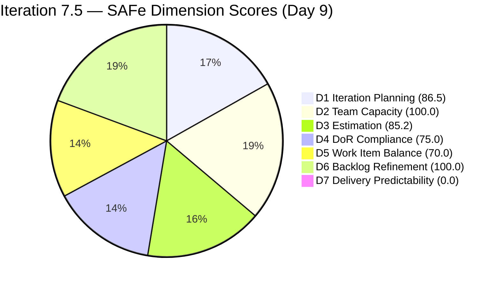
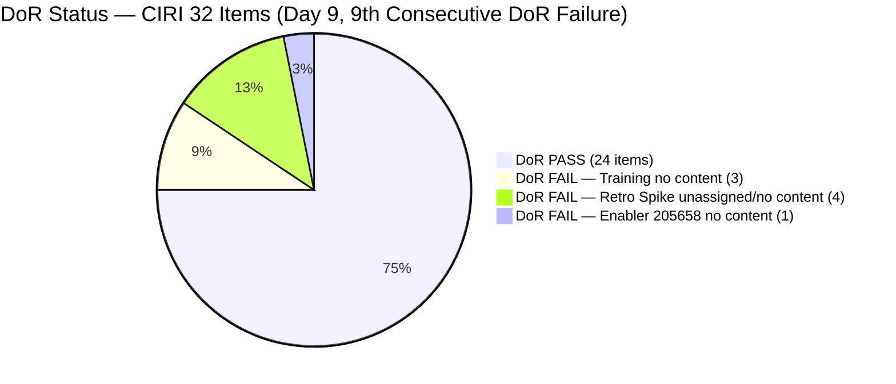
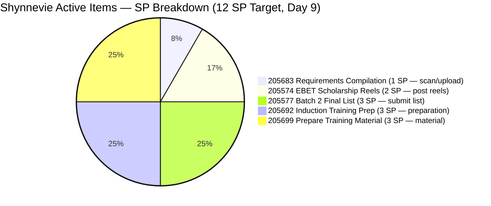
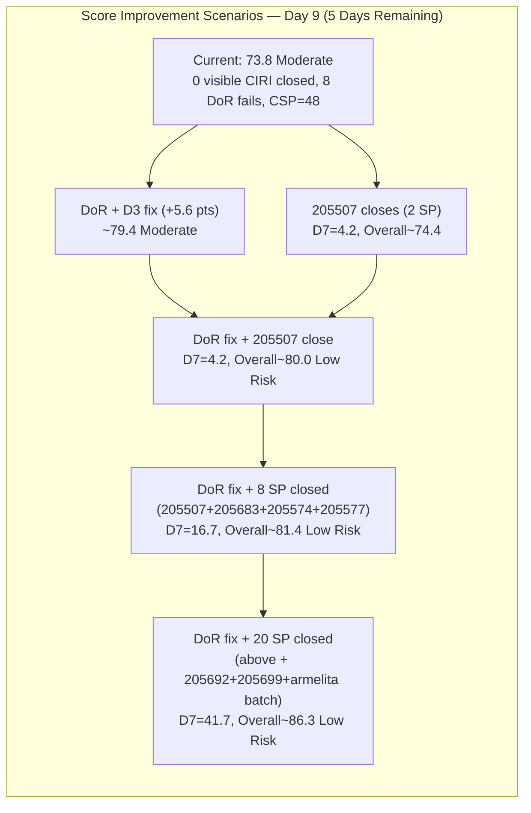

# ADO SAFe Audit — JIT Operation Team

## 1. Audit Metadata

| Field | Value |
|-------|-------|
| Audit Number | #85 |
| Audit Date | 2026-06-09 |
| Audit Time | 02:04 CST |
| Timezone | America/Chicago (CST) |
| Iteration | Iteration 7.5 |
| Iteration Dates | 2026-06-01 – 2026-06-14 |
| Sprint Day | Day 9 of 14 |
| ADO Project | Jairosoft Portfolio (`666bb99a-6acd-4999-bb34-efd0e4ea90dc`) |
| ADO Team | JIT Operation Team (`b25e3129-6272-4e54-a3ff-f1ef3c8eeb2c`) |
| Iteration ID | `9c70d575-210a-4156-bbdc-79f1efbe2869` |
| Iteration Path | `Jairosoft Portfolio\2026-PI7\Iteration 7.5` |
| Workspace | `ado_jit` |
| Prior Audit | AUDIT_20260608_0900.md (Score: 73.8 — Moderate Risk, Day 8) |
| **Overall Score** | **73.8 / 100** |
| **Risk Band** | **Moderate Risk** |

---

## 2. Executive Summary

- Iteration 7.5 is on **Day 9 of 14** — 64% of the sprint elapsed, 5 days remain. The JIT Operation Team holds at **73.8 / 100 (Moderate Risk)**, unchanged from Day 8. No new state transitions were observed overnight between Day 8 and Day 9.
- **No new closures detected.** The three items closed on Day 8 (#204487, #205399, #203595 — 6 SP) continue as the most recent closures. Item #205507 (Compile Bubble Training Records, Samantha, UAT Testing) has not advanced to Closed.
- **8 DoR-failing items persist** for the 9th consecutive day — 3 Teofilo Training items (204620, 621, 622), 4 unassigned Retro Spikes (205538–541), and Enabler 205658. Full remediation adds +5.6 pts to Overall (→ ~79.4).
- **Shynnevie's 5 Active items (12 SP) remain open** — 205574, 205577, 205683, 205692, 205699 — unchanged from Day 5. With 5 days remaining, closing these items is the primary path to D7 improvement.
- **Low Risk path:** DoR + D3 fix (+5.6 pts) plus closing #205507 (2 SP) + Shynnevie's 3 near-ready items (6 SP) = D7 ≥ 17% → Overall ~82.2. Achievable today.

---

## 3. Previous Audit Delta

| Metric | Audit #84 (2026-06-08, Day 8) | Audit #85 (2026-06-09, Day 9) | Change |
|--------|-------------------------------|-------------------------------|--------|
| Sprint Day | Day 8 of 14 | **Day 9 of 14** | +1 day |
| VRBI | 37 | **37** | No change |
| CIRI | 32 | **32** | No change |
| Items Closed (exited VRBI, cumulative) | 6 | **6** | No new closures |
| SP Burned (exited VRBI, cumulative) | 13 SP | **13 SP** | No change |
| #205507 Status | UAT Testing | **UAT Testing** | Not yet Closed |
| Shynnevie Active items | 5 | **5** | No closures |
| DoR FAIL items | 8 | **8** | No remediation |
| D1 — Iteration Planning | 86.5 | **86.5** | Unchanged |
| D2 — Team Capacity | 100.0 | **100.0** | Unchanged |
| D3 — Estimation | 85.2 | **85.2** | Unchanged |
| D4 — DoR Compliance | 75.0 | **75.0** | Unchanged |
| D5 — Work Item Balance | 70.0 | **70.0** | Unchanged |
| D6 — Backlog Refinement | 100.0 | **100.0** | Unchanged |
| D7 — Delivery Predictability | 0.0 | **0.0** | No new visible closures |
| **Overall Score** | **73.8 (Moderate)** | **73.8 (Moderate)** | **Unchanged** |

### Day 8 → Day 9 Interpretation

No ADO changes were detected between Day 8 (June 8) and Day 9 (June 9). All item states confirmed unchanged via direct API queries: #205507 remains "UAT Testing" (unchanged since June 8), Shynnevie's 5 items remain "Active" (unchanged since Days 2–5), the 4 Retro Spikes remain "New" and unassigned (9 days), Teofilo's 3 Training items remain "New" with no description. The board has been completely static since the Day 8 burst of activity (3 closures by armelita and grace on June 8).

The Day 8 burst demonstrated the team can deliver when focused. However, 5 days remain and the next closest items to closure — #205507 (UAT Testing) and Shynnevie's items — have not advanced.

---

## 4. Current Iteration Snapshot

**Iteration 7.5** · 2026-06-01 – 2026-06-14 · **Day 9 of 14** · 5 days remaining

| Field | Value |
|-------|-------|
| Visible Root Backlog Items (VRBI) | 37 |
| Items in Iteration 7.5 (CIRI) | 32 |
| Non-CIRI VRBI items | 5 (#200766 PI8, #203245 Iter 7.6 IP, #203250 Iter 7.3, #204338 Iter 7.4, #205687 Iter 7.6 IP) |
| PECI (non-Training with SP field) | 27 (21 US + 5 Spike + 1 Enabler) |
| ECI (PECI with SP > 0) | 23 (4 Retro Spikes have SP blank) |
| SP Committed (CSP from ECI) | 48 SP |
| SP Closed Visible (CLSP) | 0 SP |
| SP Burned (exited VRBI, cumulative) | 13 SP (6 items since Day 3) |
| DoR Compliant (DCI) | 24 / 32 (75.0%) |
| DoR Failing | 8 items (9th consecutive day) |
| #205507 Status | UAT Testing (Samantha — unchanged from Day 8) |
| Shynnevie Active Items | 5 (205574, 205577, 205683, 205692, 205699 — all Active, unchanged) |
| Days Remaining | 5 |

---

## 5. Work Item Analysis

### CIRI Items — Iteration 7.5 (32 root-level items)

| ID | Title | Type | State | SP | Assignee | DoR | ChangedDate | Note |
|----|-------|------|-------|----|----------|-----|-------------|------|
| 200771 | UM Digos Interns Final Demo and Awarding | User Story | New | 2 | armelita | PASS | 2026-06-01 | |
| 203244 | IT7.5 Tech Talk — AI Tools Demonstration | Spike | New | 2 | armelita | PASS | 2026-06-02 | |
| 204440 | Package SAFe Micro-credential Dossier | User Story | Active | 2 | grace | PASS | 2026-06-08 | Changed Day 8 |
| 204477 | Bubble MCC Marketing for June 1–5 | User Story | New | 3 | armelita | PASS | 2026-06-02 | |
| 204619 | 2.3-1 Set Router/Wi-Fi Configuration Training | Training | Active | 3 | Teofilo | PASS | 2026-06-05 | Training — excluded from PECI |
| 204620 | 2.4-1 Ensure Config Conforms to Manual Training | Training | New | — | Teofilo | **FAIL** | 2026-06-03 | No Desc, no AC — 9th day |
| 204621 | 2.4-2 Computer Networks Checked Training | Training | New | — | Teofilo | **FAIL** | 2026-06-04 | No Desc, no AC — 9th day |
| 204622 | 2.4-3 Prepare Reports Training | Training | New | — | Teofilo | **FAIL** | 2026-06-03 | No Desc, no AC — 9th day |
| 205242 | Audit of payments receipts | User Story | Active | 2 | grace | PASS | 2026-06-08 | Changed Day 8 |
| 205330 | CSS Batch 2 Terminal Report | User Story | New | 2 | armelita | PASS | 2026-06-02 | |
| 205373 | CSS NC II Batch 2 Special Order Request | User Story | New | 2 | armelita | PASS | 2026-06-02 | |
| 205390 | Bubble EBET Scholarship SO Request | User Story | New | 2 | armelita | PASS | 2026-06-02 | |
| 205394 | Bubble EBET Scholarship Batch 1 Billing | User Story | Active | 2 | armelita | PASS | 2026-06-04 | |
| 205396 | Bubble EBET Scholarship Batch 1 Payroll | User Story | New | 2 | armelita | PASS | 2026-06-02 | |
| 205401 | Request for Bubble EBET Scholarship Batch 2 TIP | User Story | Active | 2 | armelita | PASS | 2026-06-05 | |
| 205403 | Bubble EBET Scholarship Batch 2 TIP | User Story | New | 2 | armelita | PASS | 2026-06-02 | |
| 205405 | Bubble EBET Scholarship Batch 2 Training Enrollment Report | User Story | New | 2 | armelita | PASS | 2026-06-02 | |
| 205411 | NEMSU Interview and Onboarding | User Story | New | 1 | armelita | PASS | 2026-06-02 | |
| 205507 | Compile Bubble Training Records | User Story | UAT Testing | 2 | Samantha | PASS | 2026-06-08 | UAT Testing — unchanged Day 8→9; 1 step from Closed |
| 205538 | [Retro] Increase number of training hours | Spike | New | — | Unassigned | **FAIL** | 2026-06-02 | No content, no owner — 9th day |
| 205539 | [Retro] Create material for workflows | Spike | New | — | Unassigned | **FAIL** | 2026-06-02 | No content, no owner — 9th day |
| 205540 | [Retro] Review training material instructions | Spike | New | — | Unassigned | **FAIL** | 2026-06-02 | No content, no owner — 9th day |
| 205541 | [Retro] eLMS crash | Spike | New | — | Unassigned | **FAIL** | 2026-06-02 | No content, no owner — 9th day |
| 205574 | Bubble EBET Scholarship Reels | User Story | Active | 2 | Shynnevie | PASS | 2026-06-02 | Active — 9 days; content-complete; awaiting final approval/post |
| 205577 | Bubble.IO TESDA Scholarship Batch 2 — Final List | User Story | Active | 3 | Shynnevie | PASS | 2026-06-03 | Active — 7 days; email confirmation and list submission pending |
| 205658 | Batch 2 Results | Enabler | New | 1 | Teofilo | **FAIL** | 2026-06-03 | No Desc, no AC — 9th day |
| 205683 | BATCH 1 — Requirements Compilation EBET Scholarship | User Story | Active | 1 | Shynnevie | PASS | 2026-06-03 | Active — 7 days; scan/upload to GDrive (low effort) |
| 205692 | BATCH 2 — BUBBLE.IO EBET — Preparation for Induction Training | User Story | Active | 3 | Shynnevie | PASS | 2026-06-05 | Active — 5 days |
| 205699 | Batch 2 — BUBBLE EBET — Prepare Training Material | User Story | Active | 3 | Shynnevie | PASS | 2026-06-05 | Active — 5 days |
| 205701 | BATCH 2 — BUBBLE.IO EBET — ITP Template Reels | User Story | New | 3 | Shynnevie | PASS | 2026-06-03 | |
| 205703 | BATCH 2 — BUBBLE.IO EBET — ID for the Scholar | User Story | New | 2 | Shynnevie | PASS | 2026-06-03 | |
| 205886 | Bubble Training Batch 2 | Training | Ready | 5 | Samantha | PASS | 2026-06-08 | Training type — excluded from PECI; 5 SP real workload for Samantha |

### Items Closed / Exited VRBI (Cumulative Since Sprint Open)

| ID | Title | Type | SP | ClosedDate | Assignee |
|----|-------|------|----|------------|---------|
| 205383 | Onboard Shynnevie Fernandez | User Story | 2 | 2026-06-03 | Shynnevie |
| 205385 | EBET Batch 1 Terminal Reports | User Story | 2 | 2026-06-05 | Shynnevie |
| 204618 | 2.2-1 Network Configuration Training | Training | 3 | 2026-06-05 | Teofilo |
| 204487 | Python Marketing Activities June 1–5 | User Story | 2 | 2026-06-08 | armelita |
| 205399 | Bubble EBET Scholarship Batch 2 | User Story | 2 | 2026-06-08 | armelita |
| 203595 | JIT Finance Collection Policy | User Story | 2 | 2026-06-08 | grace |

**Cumulative burn: 13 SP across 6 items — none visible in current VRBI**

### Non-CIRI VRBI Items (5 carryovers)

| ID | Title | Iteration | Type | Assignee |
|----|-------|-----------|------|----------|
| 200766 | ODOO OpenCat SIS | PI8 | Spike | armelita |
| 203245 | IT7.6 Tech Talk | Iter 7.6 IP | Spike | armelita |
| 203250 | Claude 4 Course Completion | Iter 7.3 | Spike | armelita |
| 204338 | Bubble Tesda Training | Iter 7.4 | Training | Samantha |
| 205687 | Jairosoft 1st Graduation June 2026 | **Iter 7.6 IP** | User Story | grace |

### Assignee Distribution (CIRI = 32, Day 9)

| Assignee | Items | Active/UAT | DoR Failing | Note |
|----------|-------|-----------|-------------|------|
| armelita | 11 | 2 Active | 0 | 3 items closed Day 8; 9 remain (mostly New) |
| Shynnevie Fernandez | 7 | 5 Active | 0 | Primary D7 unlock; 5 Active items (12 SP); no closures since Day 3 |
| Samantha Babael | 2 | 1 UAT Testing | 0 | #205507 UAT Testing; #205886 Training Ready |
| grace | 2 | 2 Active | 0 | 1 item closed Day 8; 2 Active remain |
| Teofilo Limpag | 5 | 1 Active | 4 | Training 204620–622 + Enabler 205658 undocumented |
| Unassigned | 4 | 0 | 4 (Retro Spikes) | 9th consecutive day unassigned |

---

## 6. SAFe Compliance Scorecard

| Dimension | Score | Evidence (Numerator / Denominator) | Notes |
|-----------|-------|------------------------------------|-------|
| D1 — Iteration Planning | **86.5** | CIRI 32 / VRBI 37 | 5 non-CIRI items (PI8, 2× Iter 7.6 IP, Iter 7.3, Iter 7.4) |
| D2 — Team Capacity | **100.0** | CC 5 / CW 5 | All 5 assignees with CIRI items have positive configured capacity |
| D3 — Estimation | **85.2** | ECI 23 / PECI 27 | 4 Retro Spikes unestimated; 5 Training items excluded from PECI |
| D4 — DoR Compliance | **75.0** | DCI 24 / CIRI 32 | 8 failing: 3 Training + 4 Retro Spikes + 1 Enabler (9th day) |
| D5 — Work Item Balance | **70.0** | US 21/32 = 65.6% > 60% → −30; US present → no −40; Spike 15.6% → no −20 | Structural |
| D6 — Backlog Refinement | **100.0** | fresh 37/37; stale_90=0; stale_180=0; untouched 0/32 | All items changed ≥ 2026-05-03 |
| D7 — Delivery Predictability | **0.0** | CLSP 0 / CSP 48 | Day 9 — no visible CIRI closures; #205507 in UAT Testing |

**Overall = (86.5 + 100.0 + 85.2 + 75.0 + 70.0 + 100.0 + 0.0) / 7 = 516.7 / 7 = 73.8 / 100 — Moderate Risk**

---

## 7. Dimension Findings

### D1 — Iteration Planning (86.5)

- VRBI = 37; CIRI = 32. Five non-CIRI items: #200766 (PI8), #203245 (Iter 7.6 IP), #203250 (Iter 7.3), #204338 (Iter 7.4), #205687 (Iter 7.6 IP — confirmed).
- Formula: 32 / 37 × 100 = **86.5**
- #204338 (Samantha, Iter 7.4) and #203250 (armelita, Iter 7.3) are the oldest multi-sprint carryovers. Each closed or recommitted removes D1 drag.

### D2 — Team Capacity (100.0)

- CW = 5: armelita (6 hrs/day), Shynnevie (6 hrs/day), Samantha (6 hrs/day), Teofilo (4.8 hrs/day), grace (1 hr/day).
- CC = 5: All five have positive activity-based capacity configured.
- Formula: 5 / 5 × 100 = **100.0**

### D3 — Estimation (85.2)

- PECI = 27 (21 US + 5 Spike + 1 Enabler; 5 Training items excluded).
- ECI = 23 (PECI minus 4 unestimated Retro Spikes 205538–541 with SP blank).
- CSP = 48 SP.
- Formula: 23 / 27 × 100 = **85.2**
- Fix: Assign SP ≥ 1 to Retro Spikes 205538–541 → ECI = 27, D3 = 100.0 (+2.1 pts Overall).

### D4 — DoR Compliance (75.0) — 9th Consecutive Day Without Full Remediation

- CIRI = 32; DCI = 24; Failing = 8.
- **FAIL items (unchanged from Day 8):**
  - **Training 204620, 204621, 204622** (Teofilo): no Description, no AC. Template available from #204619 (DoR PASS). 9th day without applying it.
  - **Retro Spikes 205538, 205539, 205540, 205541** (Unassigned): no Description, no AC, SP blank, no owner. 9th day.
  - **Enabler 205658** (Teofilo): "Batch 2 Results" — no Description, no AC, 1 SP but zero content. 9th day.
- Formula: 24 / 32 × 100 = **75.0**
- Full remediation → D4 = 100.0 (+3.5 pts Overall). Combined with D3 fix: +5.6 pts → Overall ~79.4.

### D5 — Work Item Balance (70.0)

- CIRI = 32; User Story = 21/32 = 65.6% > 60% → −30 penalty.
- Spike 5/32 = 15.6% → no −20. User Stories present → no −40.
- Formula: max(0, 100 − 30) = **70.0**. Structural.

### D6 — Backlog Refinement (100.0)

- VRBI = 37; all 37 items have ChangedDate ≥ 2026-05-03 (earliest: #200766, 2026-05-03) — within the 45-day freshness window from 2026-04-24.
- Stale_90 (before 2026-03-10): 0. Stale_180 (before 2025-12-11): 0.
- Untouched CIRI (ChangedDate < 2026-06-01): 0 items.
- Formula: max(0, 100.0) = **100.0**

### D7 — Delivery Predictability (0.0) — Day 9, No Overnight Closures

- CSP = 48 SP; CLSP = 0 SP.
- Formula: 0 / 48 × 100 = **0.0**
- Day 9 — 5 days remaining. No state transitions occurred between Day 8 and Day 9. The Day 8 momentum (3 closures, 6 SP) did not carry into Day 9.
- **Key items to close:** #205507 (Samantha, UAT Testing, 2 SP — one step from Closed), #205683 (Shynnevie, Active, 1 SP — scan/upload), #205574 (Shynnevie, Active, 2 SP — reels), #205577 (Shynnevie, Active, 3 SP — final list).
- **Low Risk threshold (no DoR fix):** CLSP ≥ 22 SP (D7 ≥ 45.8 → Overall ≥ 80.0). Achievable only if Shynnevie closes all 5 items (12 SP) + Samantha #205507 (2 SP) + additional armelita/grace items.
- **Low Risk threshold (with DoR+D3 fix, +5.6 pts):** CLSP ≥ 8 SP (D7 ≥ 16.7 → Overall ≥ 80.0). Highly achievable: #205507 (2) + #205683 (1) + #205577 (3) + #205574 (2) = 8 SP.

---

## 8. Risks and Bottlenecks

| Risk | Severity | Status | Details |
|------|----------|--------|---------|
| 8 CIRI items lack Desc/AC — D4 = 75.0 (9th day) | **CRITICAL** | Escalating | 3 Training + 4 Retro Spikes + 1 Enabler. Full fix +5.6 pts Overall. |
| 4 Retro Spikes unassigned — 9th day | **CRITICAL** | Decaying retrospective actions | 205538–541: no SP, no owner, no content. Retro accountability at risk of complete loss. |
| D7 = 0.0 — Day 9, no visible closures since Day 8 burst | **HIGH** | No new closures overnight | Day 8 delivered 3 items (6 SP); Day 9 static. Next in queue: #205507 (UAT Testing). |
| Shynnevie 5 Active items (12 SP) stalled | **HIGH** | Active since Days 2–5 | 205683 (1 SP, scan), 205574 (2 SP, reels), 205577 (3 SP, final list) appear completable today. |
| #205507 stuck in UAT Testing | **HIGH** | 2nd consecutive day | Samantha's item is one state change from Closed. 2 SP. No progress Day 8→9. |
| armelita: 9 CIRI items remaining (New/Active) | **MEDIUM** | High workload | 3 items closed Day 8; 9 remain. Mostly New state. 5 days to close. |
| #205886 (Bubble Training Batch 2, Samantha, 5 SP, Training) | **MEDIUM** | Ongoing | New Training item added Day 8. Not in PECI but 5 SP real work with 5 days left. |
| Low Risk requires ≥22 SP without DoR fix (≥8 SP with fix) | **MEDIUM** | 5 days remain | With DoR fix: achievable via #205507 + 3 Shynnevie items. |
| 204338 (Samantha, Iter 7.4) multi-sprint carryover | **MEDIUM** | 9th sprint as carryover | D1 drag; must be closed, recommitted, or de-committed. |

---

## 9. Prioritized Recommendations

1. **Document all 8 DoR-failing items today — CRITICAL (9th escalation):** Each additional day costs ~0.8 pts/day in lost potential. Full remediation = +5.6 pts → Overall ~79.4, then D7 closures push to Low Risk.
   - **Teofilo (4 items):** Copy template from #204619 to 204620, 621, 622 (Training): describe training module content, specify completion criteria. Add content to #205658 (Batch 2 Results): what results, format, recipient.
   - **Assign Retro Spikes (4 items):** Assign 205538 (training hours) and 205539 (workflow materials) to armelita. Assign 205540 (material instructions) and 205541 (eLMS crash) to Teofilo. Add 1-sentence description and specific AC to each. Add SP = 1 each.

2. **Close #205507 (Compile Bubble Training Records) today — HIGH:** Samantha's item is in UAT Testing — one approval/state change from Closed. 2 SP. This has been in UAT Testing for 24 hours. If the records are compiled and the reviewer has seen them, close it. Combined with DoR fix: Overall → ~80.0 (Low Risk boundary).

3. **Close Shynnevie's 3 near-ready items today (Days 9–10) — HIGH:**
   - **#205683** (BATCH 1 Requirements Compilation, 1 SP): Scan Commitment Undertaking + Registration Form → upload to GDrive folder → mark Closed. Estimated time: 30 minutes.
   - **#205574** (Bubble EBET Reels, 2 SP): Reels created, caption written, approval obtained, posted to Jairosoft FB Page. If content is ready, post and close.
   - **#205577** (Bubble.IO TESDA Batch 2 Final List, 3 SP): Email to trainees, receive confirmation, add to final list, submit. If confirmations are received, finalize and close.
   - Closing these 3 items (6 SP) + #205507 (2 SP) + DoR fix: D7 = 8/48 = 16.7 → Overall = 74.4 + 5.6 → ~80.0.

4. **Target Shynnevie's 2 remaining Active items (Days 10–12) — HIGH:**
   - **#205692** (BATCH 2 Preparation for Induction Training, 3 SP) and **#205699** (Prepare Training Material, 3 SP): Both Active since Day 5. Combined 6 SP.

5. **Resolve multi-sprint carryovers #203250 and #204338 — MODERATE:**
   - **#204338** (Samantha, Iter 7.4, Training): 9th sprint as carryover. Close if complete; recommit to 7.5 if active work is happening; de-commit to IP if blocked.
   - **#203250** (armelita, Iter 7.3): Same resolution needed. Each resolution removes 1 non-CIRI item → D1 improves from 86.5 toward 100.0.

6. **Define sprint goal for Iteration 7.5 — MODERATE (9th iteration without one):** Suggested: *"Deliver TESDA compliance documentation for Bubble EBET Batches 1 and 2, complete training records compilation, finalize graduation event planning, and close all retrospective improvement actions by June 14."*

---

## 10. Evidence Gaps and Limitations

| Gap | Impact | Notes |
|-----|--------|-------|
| 6 closures exited VRBI (13 SP cumulative) | D7 cannot count 13 SP burned | 204487+205399+203595 closed Day 8 (6 SP); 205383+205385+204618 prior (7 SP). Not visible to formula. |
| Training items excluded from PECI | D3 coverage gap | 5 Training items (204619, 620, 621, 622, 205886) excluded. #205886 carries 5 SP not in scoring universe. |
| 4 Retro Spikes unassigned 9 days | D3 and D4 penalized | No owner; no content; retrospective actions at high risk of expiry. |
| 204338 multi-sprint carryover | D1 penalty | 9th sprint carryover; Iter 7.4 Training. |
| Sprint goal absent | Governance gap | 9th consecutive iteration without sprint goal. |
| Day 8→9 static board | Delivery gap | Day 8 had 3 closures (6 SP); Day 9 produced zero transitions despite #205507 being 1 step from Closed. |

---

## Visualizations

### Score Trend — JIT Operation Team (Iteration 7.5)

| Date | Audit | Score | Band | Sprint Day | Notable |
|------|-------|-------|------|-----------|---------|
| Jun 1 | #77 | 68.8 | Moderate | Day 1 | Sprint open |
| Jun 2 | #78 | 73.2 | Moderate | Day 2 | +13 items |
| Jun 3 | #79 | 73.1 | Moderate | Day 3 | +3 items; D4 drops |
| Jun 4 | #80 | 74.0 | Moderate | Day 4 | +4 Shynnevie items |
| Jun 5 | #81 | 74.4 | Moderate | Day 5 | 3 closures (7 SP exited) |
| Jun 6 | #82 | 74.4 | Moderate | Day 6 | No activity |
| Jun 7 | #83 | 74.4 | Moderate | Day 7 | No activity; 9 DoR fails |
| Jun 8 | #84 | 73.8 | Moderate | Day 8 | 3 closures (6 SP); structural changes; 8 DoR fails |
| **Jun 9** | **#85** | **73.8** | **Moderate** | **Day 9** | **No new closures; #205507 UAT Testing; 5 days remain** |

### D7 Recovery Projection — Iteration 7.5 (48 SP, 5 Days Remaining)

| Scenario | SP Visible Closed | D7 | Base Overall | With Full DoR+D3 Fix (+5.6 pts) | Band |
|----------|--------------------|----|--------------|---------------------------------|------|
| Current (0 closures) | 0/48 | 0.0 | 73.8 | ~79.4 | Moderate |
| 205507 closes (2 SP) | 2/48 | 4.2 | 74.4 | ~80.0 | Low (with fix) |
| 205507 + 205683 (3 SP) | 3/48 | 6.3 | 74.7 | ~80.3 | Low (with fix) |
| 205507 + 3 Shynnevie (8 SP) | 8/48 | 16.7 | 76.2 | ~81.8 | Low (with fix) |
| All 5 Shynnevie + 205507 (14 SP) | 14/48 | 29.2 | 79.7 | ~85.3 | Moderate / Low |
| Low Risk no fix threshold | 22/48 | 45.8 | 80.3 | — | Low |
| Full delivery (48 SP) | 48/48 | 100.0 | 88.1 | ~93.7 | Low |

---

*Audit #85 generated by Claude Code (claude-sonnet-4-6) on 2026-06-09 02:04 CST. Evidence sourced from Azure DevOps MCP (Jairosoft Portfolio project `666bb99a-6acd-4999-bb34-efd0e4ea90dc`, team `b25e3129-6272-4e54-a3ff-f1ef3c8eeb2c`, Iteration 7.5 ID `9c70d575-210a-4156-bbdc-79f1efbe2869`). Rubric: SAFe 6.0 7-dimension scorecard v1. Iteration 7.5 is Day 9 of 14 (64% elapsed); 5 days remain. Score: 73.8 / 100 (Moderate Risk — unchanged from Day 8). 37 visible items, 48 SP committed. 6 items confirmed Closed (13 SP burned, not scored in D7). 8 DoR-failing items persist (9th day). #205507 in UAT Testing (not yet Closed). Priority: fix 8 DoR items (+5.6 pts), close #205507 today, batch-close Shynnevie's 3 near-ready items → Low Risk achievable.*
