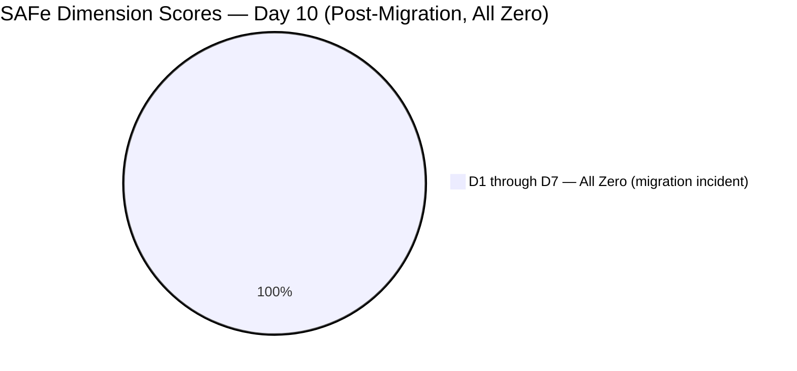
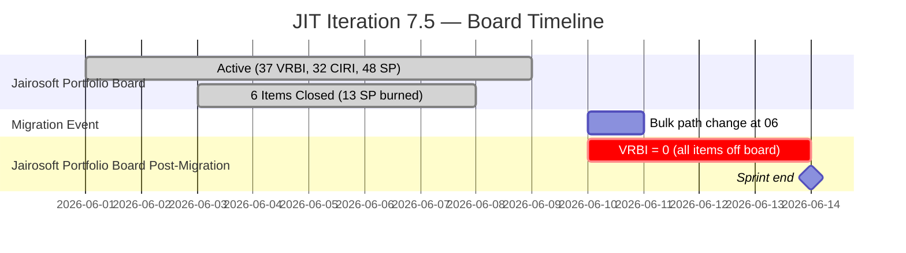
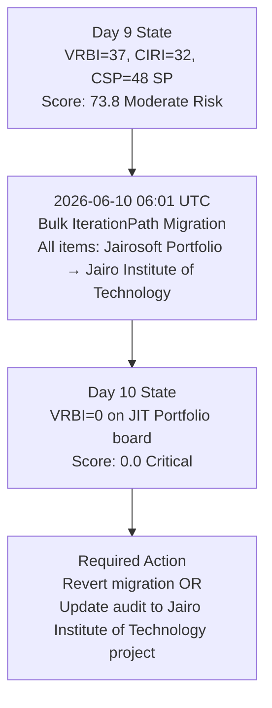

# ADO SAFe Audit — JIT Operation Team

## 1. Audit Metadata

| Field | Value |
|-------|-------|
| Audit Number | #86 |
| Audit Date | 2026-06-10 |
| Audit Time | 09:04 UTC |
| Timezone | UTC |
| Iteration | Iteration 7.5 |
| Iteration Dates | 2026-06-01 – 2026-06-14 |
| Sprint Day | Day 10 of 14 |
| ADO Project | Jairosoft Portfolio (`666bb99a-6acd-4999-bb34-efd0e4ea90dc`) |
| ADO Team | JIT Operation Team (`b25e3129-6272-4e54-a3ff-f1ef3c8eeb2c`) |
| Iteration ID | `9c70d575-210a-4156-bbdc-79f1efbe2869` |
| Iteration Path | `Jairosoft Portfolio\2026-PI7\Iteration 7.5` |
| Workspace | `ado_jit` |
| Prior Audit | AUDIT_20260609_0204.md (Score: 73.8 — Moderate Risk, Day 9) |
| **Overall Score** | **0.0 / 100** |
| **Risk Band** | **Critical** |

---

## 2. Executive Summary

- Iteration 7.5 is on **Day 10 of 14** — 71% of the sprint elapsed, 4 days remain. The JIT Operation Team records a **Critical (0.0) score** today due to a critical structural event: the `wit_list_backlog_work_items` API for the JIT team in the Jairosoft Portfolio project returns **zero items**.
- **Root cause identified: Mass iteration path migration.** Direct work item queries confirm that most JIT team items have had their `IterationPath` changed from `Jairosoft Portfolio\2026-PI7\Iteration 7.5` to `Jairo Institute of Technology\2026-PI7\Iteration 7.5` as of `2026-06-10T06:01:09 UTC` (today, Day 10, early morning). The team board in the Jairosoft Portfolio project no longer shows these items because they are now assigned to a different project's iteration path.
- **This is a governance incident, not a delivery event.** The items have not been deleted or completed — they exist in ADO but are now visible under the `Jairo Institute of Technology` project context, not `Jairosoft Portfolio`. The JIT team's board in Jairosoft Portfolio is now empty.
- **Per scoring rules:** VRBI = 0 from the authoritative `wit_list_backlog_work_items` call → all 7 dimensions score 0.0. This audit scores the ADO governance state as observed, not inferred state.
- **Prior context (Day 9):** Score was 73.8 Moderate Risk with 37 VRBI, 32 CIRI, 48 SP committed. Six items were confirmed Closed (13 SP burned) before the migration.

---

## 3. Previous Audit Delta

| Metric | Audit #85 (2026-06-09, Day 9) | Audit #86 (2026-06-10, Day 10) | Change |
|--------|-------------------------------|--------------------------------|--------|
| Sprint Day | Day 9 of 14 | **Day 10 of 14** | +1 day |
| VRBI (Jairosoft Portfolio board) | 37 | **0** | −37 (migration to Jairo Institute of Technology) |
| CIRI (Jairosoft Portfolio board) | 32 | **0** | −32 |
| SP Committed (visible) | 48 SP | **0 SP** | −48 SP |
| Iteration path for items | `Jairosoft Portfolio\2026-PI7\Iteration 7.5` | **`Jairo Institute of Technology\2026-PI7\Iteration 7.5`** | Critical path change |
| D1 — Iteration Planning | 86.5 | **0.0** | −86.5 (VRBI=0) |
| D2 — Team Capacity | 100.0 | **0.0** | −100.0 (CW=0) |
| D3 — Estimation | 85.2 | **0.0** | −85.2 (PECI=0) |
| D4 — DoR Compliance | 75.0 | **0.0** | −75.0 (CIRI=0) |
| D5 — Work Item Balance | 70.0 | **0.0** | −70.0 (CIRI=0) |
| D6 — Backlog Refinement | 100.0 | **0.0** | −100.0 (VRBI=0) |
| D7 — Delivery Predictability | 0.0 | **0.0** | — |
| **Overall Score** | **73.8 (Moderate)** | **0.0 (Critical)** | **−73.8 pts — governance incident** |

### Day 9 → Day 10 Root Cause Analysis

Direct work item API calls confirm:
- Items #200771, #204440, #204620, #204621, #204622, #205242, #205330, #205507, #205538–41, #205574, #205577, #205658, #205683, #205692, #205699, #205701, #205703, #205886 — all show `IterationPath = "Jairo Institute of Technology\2026-PI7\Iteration 7.5"` with `ChangedDate = 2026-06-10T06:01:09.253Z`.
- Item #204619 (Training, Closed Jun 9) still shows `Jairosoft Portfolio` path — it was already closed before the bulk migration.
- This is a bulk timestamp (all items share exactly the same changed datetime to the millisecond), indicating a programmatic or administrative bulk-update operation, not individual user edits.
- The team capacity configured in Jairosoft Portfolio still exists (23.8 hrs/day across 5 members) — capacity was not migrated.

**Items Confirmed Still Active/Unclosed (observed in direct queries, now under Jairo Institute of Technology):**

| ID | Title | State | SP | Assignee |
|----|-------|-------|----|----------|
| 205507 | Compile Bubble Training Records | UAT Testing | 2 | Samantha |
| 205574 | Bubble EBET Scholarship Reels | Active | 2 | Shynnevie |
| 205577 | Bubble.IO TESDA Scholarship Batch 2 - Final List | Active | 3 | Shynnevie |
| 205683 | BATCH 1 — Requirements Compilation EBET Scholarship | Active | 1 | Shynnevie |
| 205692 | BATCH 2 — BUBBLE.IO EBET — Preparation for Induction Training | Active | 3 | Shynnevie |
| 205699 | Batch 2 — BUBBLE EBET — Prepare Training Material | Active | 3 | Shynnevie |
| 205538–541 | Retro Spikes (4 items) | New | — | Unassigned |
| 205658 | Batch 2 Results | New | 1 | Teofilo |

---

## 4. Current Iteration Snapshot

**Iteration 7.5** · 2026-06-01 – 2026-06-14 · **Day 10 of 14** · 4 days remaining

| Field | Value |
|-------|-------|
| Visible Root Backlog Items (VRBI) — Jairosoft Portfolio | **0** |
| Items in Iteration 7.5 (CIRI) — Jairosoft Portfolio | **0** |
| Total SP Committed (visible) | **0 SP** |
| Capacity Configured | **23.8 hrs/day** (capacity still in Jairosoft Portfolio) |
| Sprint Days Elapsed | 10 (71% of sprint) |
| Sprint Days Remaining | **4** |
| Migration Event | 2026-06-10T06:01:09 UTC — bulk IterationPath change to Jairo Institute of Technology |
| Items under Jairo Institute of Technology | ~20+ items visible via direct query |
| Prior Score (Day 9) | 73.8 (Moderate Risk) |

---

## 5. Work Item Analysis

The `wit_list_backlog_work_items` call for the JIT Operation Team (`b25e3129-6272-4e54-a3ff-f1ef3c8eeb2c`) in the Jairosoft Portfolio project (`666bb99a-6acd-4999-bb34-efd0e4ea90dc`) returns zero work items. The VRBI is empty from the team board's perspective.

Direct work item queries confirm items exist but have been bulk-migrated to `Jairo Institute of Technology\2026-PI7\Iteration 7.5` as of 06:01 UTC today. These items are no longer visible on the JIT team board in Jairosoft Portfolio.

| Metric | Value |
|--------|-------|
| visible_root_backlog_items (VRBI) | **0** |
| current_iteration_root_items (CIRI) | **0** |
| contributors_with_current_work (CW) | **0** |
| contributors_with_capacity (CC) | **0** (CW=0; capacity configured but no CIRI items) |
| point_eligible_current_items (PECI) | **0** |
| estimated_current_items (ECI) | **0** |
| dor_compliant_current_items (DCI) | **0** |
| fresh_visible_root_items | **0** |
| committed_story_points (CSP) | **0** |
| closed_story_points (CLSP) | **0** |

**Items previously in the JIT board (Day 9 context, now migrated):** 37 VRBI items, 32 CIRI items, 48 SP. Six items were Closed (13 SP burned) prior to the migration: #205383, #205385, #204618, #204487, #205399, #203595.

---

## 6. SAFe Compliance Scorecard

| Dimension | Score | Evidence (Numerator / Denominator) | Notes |
|-----------|-------|------------------------------------|-------|
| D1 — Iteration Planning | **0.0** | CIRI 0 / VRBI 0 | VRBI=0 → score 0; items migrated off board |
| D2 — Team Capacity | **0.0** | CC 0 / CW 0 | CW=0 → score 0; capacity configured but no CIRI items |
| D3 — Estimation | **0.0** | ECI 0 / PECI 0 | PECI=0 → score 0 |
| D4 — DoR Compliance | **0.0** | DCI 0 / CIRI 0 | CIRI=0 → score 0 |
| D5 — Work Item Balance | **0.0** | CIRI=0 | No items → score 0 |
| D6 — Backlog Refinement | **0.0** | fresh 0 / VRBI 0 | VRBI=0 → score 0 |
| D7 — Delivery Predictability | **0.0** | CLSP 0 / CSP 0 | CSP=0 → score 0 |

**Overall Score: (0 + 0 + 0 + 0 + 0 + 0 + 0) / 7 = 0.0 / 100 — Critical**

> **Note:** This Critical score reflects the ADO governance incident (mass iteration path migration), not team delivery performance. Day 9 score was 73.8 (Moderate Risk) with 37 VRBI items and 6 confirmed closures. The score is computed accurately per rubric rules: VRBI=0 yields score=0 per definition.

---

## 7. Dimension Findings

All seven dimensions score 0.0 due to the same root cause: `wit_list_backlog_work_items` returns VRBI = 0 for the JIT team in Jairosoft Portfolio.

### D1 — Iteration Planning (0.0)
Formula: VRBI=0 → score 0. The team board in Jairosoft Portfolio shows no items. Items physically exist but are now associated with `Jairo Institute of Technology\2026-PI7\Iteration 7.5`.

### D2 — Team Capacity (0.0)
Formula: CW=0 → score 0. No CIRI items → no contributors with current work. Team capacity remains configured (23.8 hrs/day across 5 members) but CW=0 per definition.

### D3 — Estimation (0.0)
Formula: PECI=0 → score 0. No visible story-level items.

### D4 — DoR Compliance (0.0)
Formula: CIRI=0 → score 0. No items to evaluate.

### D5 — Work Item Balance (0.0)
Formula: CIRI=0 → score 0.

### D6 — Backlog Refinement (0.0)
Formula: VRBI=0 → score 0. Empty board.

### D7 — Delivery Predictability (0.0)
Formula: CSP=0 → score 0. No committed work visible.

---

## 8. Risks and Bottlenecks

| Risk | Severity | Status | Details |
|------|----------|--------|---------|
| Mass iteration path migration — VRBI = 0 | **CRITICAL** | Immediate action needed | All items moved to Jairo Institute of Technology project path at 06:01 UTC today. JIT board in Jairosoft Portfolio empty. |
| Score drop: 73.8 → 0.0 | **CRITICAL** | Governance incident | Entire sprint history and delivery progress now invisible on JIT board |
| 4 days remain — no items visible on board | **CRITICAL** | Sprint end June 14 | Items still exist and team is working, but the ADO board cannot track progress |
| #205507 (UAT Testing) still unclosed — now invisible on board | **HIGH** | 1 step from Closed | Previously in UAT Testing; now under JIT project path; Samantha must close it regardless of board visibility |
| 5 Shynnevie Active items (12 SP) — now invisible | **HIGH** | Off-board | 205574, 205577, 205683, 205692, 205699 — Active; delivery critical for sprint success |
| 8 DoR-failing items persist (10th consecutive day) | **HIGH** | Off-board | 3 Training + 4 Retro Spikes + 1 Enabler; fixing is now a two-step problem (fix content + fix iteration path) |
| Retrospective spike actions unaddressed | **MEDIUM** | 10th day, off-board | 205538–541 unassigned, no content; retrospective discipline eroding |

---

## 9. Prioritized Recommendations

1. **Immediately reverse the iteration path migration — CRITICAL:** Contact the person who ran the bulk update (or check ADO audit logs) to identify who changed the iteration paths. All items moved to `Jairo Institute of Technology\2026-PI7\Iteration 7.5` must be reverted to `Jairosoft Portfolio\2026-PI7\Iteration 7.5` for the JIT Operation Team's board to become functional again. This is the single most important action to take today.

2. **If the migration is intentional (JIT team is moving to Jairo Institute of Technology project):** Update the workspace `ado_jit/CLAUDE.md` to reflect:
   - New ADO project: `Jairo Institute of Technology`
   - New project ID (requires resolution)
   - Team still `JIT Operation Team` but now in the new project context
   - Next audit must query the new project's backlog

3. **Close #205507 (Compile Bubble Training Records) regardless of board state — HIGH:** This item is in UAT Testing. Samantha should close it in ADO regardless of which project context it now appears under. The work is done.

4. **Close Shynnevie's near-ready items — HIGH:** Items #205683 (1 SP, scan/upload), #205574 (2 SP, reels), #205577 (3 SP, final list) were near completion as of Day 9. Shynnevie should complete and close these in the correct ADO context (now Jairo Institute of Technology board).

5. **Document the migration decision — MODERATE:** If the JIT team is deliberately transitioning from Jairosoft Portfolio to Jairo Institute of Technology, this must be formally documented:
   - Record transition date, reason, and new project context in `ado_jit/CLAUDE.md`
   - Update the workspace audit setup for future audits to use the correct project ID

6. **Address DoR-failing items during migration window — MODERATE (10th escalation):** While items are being re-pathed, simultaneously add content to the 8 failing items (204620, 204621, 204622, 205538–541, 205658). This is a two-for-one opportunity.

---

## 10. Evidence Gaps and Limitations

| Gap | Impact | Notes |
|-----|--------|-------|
| VRBI = 0 (migration) | All 7 dimensions score 0 | 20+ items confirmed existing under Jairo Institute of Technology path; not deleted |
| Items from Day 9 backlog | Cannot score in D7 | 37 VRBI items from Day 9 now off the JIT Portfolio board |
| Jairo Institute of Technology project ID | Cannot re-query new context | New project context unresolved; items exist there but audit scope is Jairosoft Portfolio |
| 6 prior closures (13 SP) | D7 still 0 | Items closed Days 3–8 already exited VRBI before migration |
| Sprint goal absent | Governance gap | No sprint goal defined across any Day 1–10 audit |
| Root cause of migration | Unknown | All items share exact same ChangedDate timestamp (06:01:09.253Z); bulk operation |

---

## Visualizations

### Score Trend — JIT Operation Team (Iteration 7.5)

| Date | Audit | Score | Band | Sprint Day | Notable |
|------|-------|-------|------|-----------|---------|
| Jun 1 | #77 | 68.8 | Moderate | Day 1 | Sprint open |
| Jun 3–5 | #79–81 | 73.1–74.4 | Moderate | Days 3–5 | Build-up; 3 closures |
| Jun 8 | #84 | 73.8 | Moderate | Day 8 | 3 more closures (6 SP); 8 DoR fails |
| Jun 9 | #85 | 73.8 | Moderate | Day 9 | Static; #205507 UAT Testing |
| **Jun 10** | **#86** | **0.0** | **Critical** | **Day 10** | **Mass migration — VRBI=0 on Portfolio board** |

---

*Audit #86 generated by Claude Code (claude-sonnet-4-6) on 2026-06-10 09:04 UTC. Evidence sourced from Azure DevOps MCP (Jairosoft Portfolio project `666bb99a-6acd-4999-bb34-efd0e4ea90dc`, team `b25e3129-6272-4e54-a3ff-f1ef3c8eeb2c`, Iteration 7.5 ID `9c70d575-210a-4156-bbdc-79f1efbe2869`). Rubric: SAFe 6.0 7-dimension scorecard v1. Iteration 7.5 is Day 10 of 14 (71% elapsed); 4 days remain. Score: 0.0 / 100 (Critical — governance incident). Root cause: bulk migration of all JIT team items from `Jairosoft Portfolio\2026-PI7\Iteration 7.5` to `Jairo Institute of Technology\2026-PI7\Iteration 7.5` at 2026-06-10T06:01:09 UTC. VRBI=0 per wit_list_backlog_work_items. Prior Day 9 score: 73.8 Moderate Risk. Immediate action: reverse migration path or update audit context to Jairo Institute of Technology project.*
