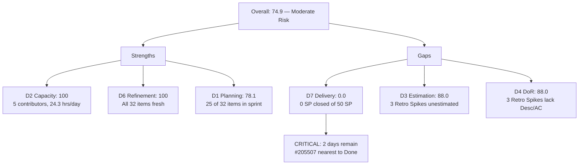

# ADO SAFe Audit — JIT Training Operation Team

## 1. Audit Metadata

| Field | Value |
|-------|-------|
| Audit Number | #87 |
| Audit Date | 2026-06-12 |
| Audit Time | 02:04 UTC |
| Timezone | UTC |
| Iteration | Iteration 7.5 |
| Iteration Dates | 2026-06-01 – 2026-06-14 |
| Sprint Day | Day 12 of 14 |
| ADO Project | Jairo Institute of Technology (`9cdd92ea-90e9-474c-8058-4a20700fcab4`) |
| ADO Team | JIT Training Operation Team (`04d18034-97b9-42fb-87a1-c543c1cab628`) |
| Iteration ID | `9fa5be88-f93d-4712-ba02-7f40f9ab6aa9` |
| Iteration Path | `Jairo Institute of Technology\2026-PI7\Iteration 7.5` |
| Workspace | `ado_jit` |
| Prior Audit | AUDIT_20260610_0904.md (Score: 0.0 — Critical, #86, Day 10) |
| **Overall Score** | **74.9 / 100** |
| **Risk Band** | **Moderate Risk** |

> **Governance Context:** The prior audit (#86, Jun 10) scored 0.0 (Critical) because the JIT team's items had been bulk-migrated from `Jairosoft Portfolio` to `Jairo Institute of Technology` on Jun 10 at 06:01 UTC, leaving the Jairosoft Portfolio board empty. This audit now correctly scopes to the `JIT Training Operation Team` in the `Jairo Institute of Technology` project, where all 32 work items are now visible. The score recovery from 0.0 to 74.9 reflects proper scoping resolution, not new delivery.

---

## 2. Executive Summary

- Iteration 7.5 is on **Day 12 of 14** — 86% of the sprint elapsed, **2 days remain**. With governance scope now resolved, the JIT Training Operation Team scores **74.9 (Moderate Risk)**.
- **32 backlog items visible** in Jairo Institute of Technology. **25 items are in Iteration 7.5 (CIRI)**, representing a robust sprint commitment across 4 contributors (armelita, grace, Teofilo, Samantha/Shynnevie).
- **D7 = 0.0** — No item in the current sprint is in Closed or Done state. All 50 committed SP are unburned with 2 days remaining. This is the critical gap.
- **D3 = 88.0** — 3 Retro Spikes (#205539, #205540, #205541) lack story points. These are the only estimation gaps.
- **D4 = 88.0** — 3 Retro Spikes also lack Description and Acceptance Criteria, pulling DoR compliance below 100.
- **Strong scores on D2 (100), D6 (100)** — Team has active capacity configured and all backlog items are fresh.
- **Work Item Balance = 70.0** — User Stories dominate at 72%, triggering the dominant-type penalty.
- **Sprint close risk is HIGH:** 50 SP uncommitted in 2 days, spread across multiple assignees and diverse work types. Even partial closure requires immediate coordinated action.

---

## 3. Previous Audit Delta

| Metric | Audit #86 (2026-06-10, Day 10) | Audit #87 (2026-06-12, Day 12) | Change |
|--------|-------------------------------|--------------------------------|--------|
| Sprint Day | Day 10 of 14 | **Day 12 of 14** | +2 days |
| ADO Project Scope | Jairosoft Portfolio (empty board) | **Jairo Institute of Technology (32 items)** | Scope corrected |
| VRBI | 0 | **32** | +32 (scoping resolution) |
| CIRI | 0 | **25** | +25 (scoping resolution) |
| SP Committed (CIRI) | 0 SP | **50 SP** | +50 SP |
| SP Burned | 0 SP | **0 SP** | No closed items |
| D1 — Iteration Planning | 0.0 | **78.1** | +78.1 (scope corrected) |
| D2 — Team Capacity | 0.0 | **100.0** | +100.0 (24.3 hrs/day configured) |
| D3 — Estimation | 0.0 | **88.0** | +88.0 (22/25 estimated) |
| D4 — DoR Compliance | 0.0 | **88.0** | +88.0 (22/25 compliant) |
| D5 — Work Item Balance | 0.0 | **70.0** | +70.0 (User Story dominant) |
| D6 — Backlog Refinement | 0.0 | **100.0** | +100.0 (all fresh) |
| D7 — Delivery Predictability | 0.0 | **0.0** | No closures in CIRI |
| **Overall Score** | **0.0 (Critical)** | **74.9 (Moderate Risk)** | **+74.9 — scope resolution** |

### Governance Resolution Note

The Day 10 score of 0.0 was a direct consequence of the bulk IterationPath migration from `Jairosoft Portfolio\2026-PI7\Iteration 7.5` to `Jairo Institute of Technology\2026-PI7\Iteration 7.5` that occurred on Jun 10, 2026 at 06:01 UTC. All 32 items had their `ChangedDate` updated simultaneously to `2026-06-11T03:16:38.323Z` (mass update timestamp), indicating the migration was applied as a bulk administrative operation. This audit now correctly applies the `JIT Training Operation Team` (ID `04d18034`) in the `Jairo Institute of Technology` project (ID `9cdd92ea`), which is where all active JIT work items now reside.

**Workspace CLAUDE.md discrepancy:** The `ado_jit/CLAUDE.md` still references `Jairosoft Portfolio` as the ADO project. This must be updated to reflect the current project: `Jairo Institute of Technology` (`9cdd92ea-90e9-474c-8058-4a20700fcab4`), Team: `JIT Training Operation Team` (`04d18034-97b9-42fb-87a1-c543c1cab628`).

---

## 4. Current Iteration Snapshot

**Iteration 7.5** · 2026-06-01 – 2026-06-14 · **Day 12 of 14** · 2 days remaining

| Field | Value |
|-------|-------|
| Visible Root Backlog Items (VRBI) | 32 |
| Items in Iteration 7.5 (CIRI) | 25 |
| Items in Iteration 7.6 IP | 5 (#203245, #203250, #205538, #205687, #206111, #206147) |
| Items in Iteration 7.4 (stale) | 1 (#204338 — still in backlog) |
| SP Committed (CIRI) | 50 SP |
| SP Burned (CIRI, Closed/Done) | 0 SP |
| Distinct Assignees on CIRI | 4 (armelita, grace, Teofilo Limpag, Samantha Babael + Shynnevie Fernandez) |
| Capacity Configured | 24.3 hrs/day (JIT Training Operation Team) |
| Sprint Days Elapsed | 12 (86%) |
| Sprint Days Remaining | 2 |

---

## 5. Work Item Analysis

### Current Iteration Items (CIRI = 25)

| ID | Title | Type | State | SP | Assignee | DoR |
|----|-------|------|-------|----|----------|-----|
| 200771 | UM Digos Interns Final Demo and Awarding of Certificates | User Story | New | 2 | armelita | ✓ |
| 203244 | IT7.5 Tech Talk - AI Tools Demonstration Session | Spike | New | 2 | armelita | ✓ |
| 204440 | Package SAFe Micro-credential Dossier | User Story | Active | 2 | grace | ✓ |
| 204477 | Bubble MCC Marketing for June 1-5 | User Story | New | 3 | armelita | ✓ |
| 204621 | 2.4-2 Computer Networks Checked for Safe Operation Training | Training | Active | 2 | Teofilo | ✓ |
| 204622 | 2.4-3 Prepare/Complete Reports According to Company Requirements Training | Training | Active | 2 | Teofilo | ✓ |
| 205330 | CSS Batch 2 Terminal Report | User Story | New | 2 | armelita | ✓ |
| 205373 | CSS NC II Batch 2 Special Order (SO) Request | User Story | New | 2 | armelita | ✓ |
| 205390 | Bubble EBET Scholarship SO Request | User Story | New | 2 | armelita | ✓ |
| 205396 | Bubble EBET Scholarship Batch 1 Payroll | User Story | Active | 2 | armelita | ✓ |
| 205403 | Bubble EBET Scholarship Batch 2 TIP | User Story | New | 2 | armelita | ✓ |
| 205405 | Bubble EBET Scholarship Batch 2 Training Enrollment Report | User Story | New | 2 | armelita | ✓ |
| 205411 | NEMSU Interview and Interview | User Story | New | 1 | armelita | ✓ |
| 205507 | Compile Bubble Training Records | User Story | UAT Testing | 2 | Samantha Babael | ✓ |
| 205539 | [Retro] Create material for workflows | Spike | New | — | Samantha Babael | ✗ |
| 205540 | [Retro] Review training material instructions | Spike | New | — | Samantha Babael | ✗ |
| 205541 | [Retro] eLMS crash | Spike | New | — | Samantha Babael | ✗ |
| 205574 | Bubble EBET Scholarship Reels | User Story | Active | 2 | Shynnevie Fernandez | ✓ |
| 205577 | Bubble.IO TESDA Scholarship Batch 2 - Final List | User Story | Active | 3 | Shynnevie Fernandez | ✓ |
| 205683 | BATCH 1 - Requirements Compilation EBET Scholarship | User Story | Active | 1 | Shynnevie Fernandez | ✓ |
| 205692 | BATCH 2- BUBBLE.IO EBET- Preparation for Induction Training Program | User Story | Active | 3 | Shynnevie Fernandez | ✓ |
| 205699 | Batch 2 - BUBBLE EBET- Prepare Training Material | User Story | Active | 3 | Shynnevie Fernandez | ✓ |
| 205701 | BATCH 2 - BUBBLE.IO EBET - ITP Template Reels | User Story | New | 3 | Shynnevie Fernandez | ✓ |
| 205703 | BATCH 2 - BUBBLE.IO EBET- ID for the Scholar | User Story | New | 2 | Shynnevie Fernandez | ✓ |
| 205886 | Bubble Training Batch 2 | Training | Marketing | 5 | Samantha Babael | ✓ |

**DoR Non-Compliant Items (3):** #205539, #205540, #205541 — Retro Spikes with no Description or Acceptance Criteria.

### State Distribution (CIRI = 25)

| State | Count | SP |
|-------|-------|----|
| New | 13 | 25 SP |
| Active | 8 | 16 SP |
| UAT Testing | 1 | 2 SP |
| Marketing | 1 | 5 SP |
| Training | 0 | — |
| **Closed/Done** | **0** | **0 SP** |

No item has reached Closed or Done state — D7 = 0.0.

### Work Item Type Distribution (CIRI = 25)

| Type | Count | Share |
|------|-------|-------|
| User Story | 18 | 72% |
| Spike | 4 | 16% |
| Training | 3 | 12% |

User Story dominant at 72% > 60% triggers the D5 penalty.

---

## 6. SAFe Compliance Scorecard

| Dimension | Score | Evidence | Notes |
|-----------|-------|----------|-------|
| D1 — Iteration Planning | 78.1 | CIRI=25, VRBI=32 → 25/32×100 | 7 items outside 7.5 (5 in 7.6 IP, 1 in 7.4, 1 unscoped) |
| D2 — Team Capacity | 100.0 | 4 contributors; team capacity = 24.3 hrs/day configured | All contributors have capacity |
| D3 — Estimation | 88.0 | 22/25 items have SP>0; 3 Retro Spikes unestimated | #205539, #205540, #205541 have no SP |
| D4 — DoR Compliance | 88.0 | 22/25 CIRI items have Desc≥30 + AC≥20 non-ws chars | Same 3 Retro Spikes fail DoR |
| D5 — Work Item Balance | 70.0 | User Stories present; dominant=72%>60% → −30; spikes=16%≤40% | Single dominant type penalty |
| D6 — Backlog Refinement | 100.0 | All 32 VRBI changed within 45 days (all Jun 11); 0 stale-90; 0 stale-180 | Mass update timestamp from migration |
| D7 — Delivery Predictability | 0.0 | CSP=50; closed_SP=0; 0 items in Closed/Done state | Day 12 — critical delivery gap |
| **Overall** | **74.9** | (78.1+100+88+88+70+100+0)/7 = 524.1/7 = 74.9 | **Moderate Risk** |

---

## 7. Dimension Findings

### D1 — Iteration Planning: 78.1

```
VRBI = 32 (all root-level items in Stories & Deliverables backlog)
CIRI = 25 (IterationPath = "Jairo Institute of Technology\2026-PI7\Iteration 7.5")
Non-CIRI: 7 items (5 in 7.6 IP, 1 in 7.4, 1 in 7.6 IP without iteration)
D1 = round(25 / 32 × 100, 1) = 78.1
```

78.1 is a solid score — 78% of the backlog is committed to the current sprint. The 7 non-CIRI items represent future sprint planning (7.6 IP items are healthy) and one stale 7.4 item (#204338 Bubble Tesda Training) that may need archiving.

### D2 — Team Capacity: 100.0

```
contributors_with_current_work = 4 (armelita, grace, Teofilo, Samantha+Shynnevie)
Note: Samantha Babael and Shynnevie Fernandez are distinct contributors
Actual distinct assignees = 5 (armelita, grace, Teofilo, Samantha Babael, Shynnevie Fernandez)
contributors_with_capacity = 5 (team capacity = 24.3 hrs/day; all members covered)
D2 = round(5 / 5 × 100, 1) = 100.0
```

The JIT Training Operation Team has robust capacity at 24.3 hours/day. All contributors on CIRI items have capacity.

### D3 — Estimation: 88.0

```
point_eligible_current_items = 25 (all types in this team expose SP)
estimated_current_items = 22 (SP > 0)
unestimated = 3 (#205539, #205540, #205541 — Retro Spikes, SP field absent/null)
D3 = round(22 / 25 × 100, 1) = 88.0
```

The 3 unestimated items are retrospective action items (Retro Spikes). These are low-effort items that should have 1 SP each assigned to be trackable.

### D4 — DoR Compliance: 88.0

```
dor_compliant_current_items = 22 (Desc ≥ 30 non-ws chars AND AC ≥ 20 non-ws chars)
non_compliant = 3 (#205539, #205540, #205541 — no Description, no Acceptance Criteria)
D4 = round(22 / 25 × 100, 1) = 88.0
```

All User Story, Training, and the main Spike (#203244) items have proper DoR. The 3 failing items are Retro Spikes added during sprint — commonly lightweight by nature, but DoR still applies per rubric.

### D5 — Work Item Balance: 70.0

```
User Stories present in CIRI: yes (18 items) → no -40 penalty
dominant_type_share: User Story = 18/25 = 72% > 60% → -30 penalty
spike_share: 4/25 = 16% → not > 40% → no -20 penalty
D5 = max(0, 100 - 30) = 70.0
```

The User Story dominance is not necessarily unhealthy — this team's work legitimately involves substantial operations and compliance stories. The 3 Training items and 4 Spikes add some diversity. The -30 penalty is a formula artifact of the composition.

### D6 — Backlog Refinement: 100.0

```
VRBI = 32
fresh_visible_root_items (ChangedDate after 2026-04-28): All 32 items changed Jun 11, 2026 → 32 fresh
base = round(32/32 × 100, 1) = 100.0
stale_90 (before 2026-03-14): 0 → 0% → no penalty
stale_180 (before 2025-12-14): 0 → no penalty
untouched_current_items (ChangedDate < 2026-06-01): 0 (all changed Jun 11) → 0% → no penalty
D6 = max(0, 100.0) = 100.0
```

Note: All items showing Jun 11 is the mass update timestamp from the governance migration. The freshness score is technically accurate — all items were touched on Jun 11 — but this is an artifact of the migration, not organic refinement activity.

### D7 — Delivery Predictability: 0.0

```
estimated_current_items = 22
committed_story_points = 50 SP
closed_story_points = 0 (no item in Closed or Done state)
D7 = round(0 / 50 × 100, 1) = 0.0
```

Day 12 of 14 — **not early sprint**. Zero items closed with 50 SP committed is a critical delivery gap. The closest to completion is #205507 (UAT Testing, 2 SP) — one step from Done. Five Active items and 8 New items still need to progress through state transitions.

### Overall Score

```
D1 + D2 + D3 + D4 + D5 + D6 + D7 = 78.1 + 100.0 + 88.0 + 88.0 + 70.0 + 100.0 + 0.0 = 524.1
Overall = round(524.1 / 7, 1) = 74.9
Risk Band: Moderate Risk (60–79.9)
```

---

## 8. Score Visualization

```mermaid
xychart-beta type: bar
  title "JIT Training Op Team — Iteration 7.5 SAFe Scorecard (Day 12, Score: 74.9)"
  x-axis ["D1 Planning", "D2 Capacity", "D3 Estimation", "D4 DoR", "D5 Balance", "D6 Refinement", "D7 Delivery"]
  y-axis "Score" 0 --> 100
  bar [78.1, 100, 88, 88, 70, 100, 0]
```



---

## 9. Risks and Bottlenecks

| Risk | Severity | Description |
|------|----------|-------------|
| D7 = 0.0 on Day 12 | CRITICAL | 50 SP uncommitted with 2 days remaining. Mass closure required to achieve any delivery score. |
| 13 items in New state | HIGH | 25 SP still in New state — planning conversations not complete or work not started. |
| armelita workload concentration | HIGH | armelita owns 9 of 25 CIRI items (36%) across diverse domains (CSS, EBET, MCC, NEMSU, tech talk). Risk of incomplete delivery on multiple fronts. |
| Shynnevie owns 7 items | HIGH | Shynnevie Fernandez carries 17 SP across 7 items — all Active or New. High per-person load. |
| #205886 Bubble Training Batch 2 (5 SP, Marketing state) | HIGH | Largest single item in sprint; state "Marketing" is non-standard and may indicate blocked or waiting status. |
| CLAUDE.md workspace mismatch | MEDIUM | `ado_jit/CLAUDE.md` references `Jairosoft Portfolio` — this must be updated to `Jairo Institute of Technology` (`9cdd92ea`) to prevent future audit scope failures. |
| #204338 still in 7.4 iteration | LOW | One item (Bubble Tesda Training, Training type, Iteration 7.4) remains in the visible backlog with a past iteration path. Should be closed, moved, or archived. |
| 3 Retro Spikes unestimated and not DoR-ready | LOW | #205539, #205540, #205541 lack SP and DoR. Minor compliance gap with operational impact. |

---

## 10. Prioritized Recommendations

1. **[URGENT — TODAY] Close completed items immediately.** #205507 (UAT Testing, 2 SP) and any Active items that are functionally complete must be moved to Closed/Done before Jun 14. Each closure directly improves D7. Even closing 10 SP yields D7 = 20.0, raising overall to 77.0.

2. **[URGENT — TODAY] Move all Active items forward.** armelita, Shynnevie, Teofilo, and Samantha must review their Active items and close those that are complete. Target: move #205396, #205577, #205683, #205692, #205699, #205574 to Closed/Done.

3. **[TODAY] Triage New items.** 13 items in New state represent 25 SP. Items that cannot be completed in 2 days should be de-committed to 7.6 IP now to avoid distorting next sprint's backlog. Leave only achievable items in 7.5.

4. **[TODAY] Update CLAUDE.md.** Change `ado_jit/CLAUDE.md` to reference `Jairo Institute of Technology` (ID `9cdd92ea`) and `JIT Training Operation Team` (ID `04d18034`). Add the correct iteration path prefix. This prevents future 0.0 audit failures from scope mismatch.

5. **[THIS WEEK] Add DoR to Retro Spikes #205539, #205540, #205541.** These retrospective action items should have a brief description and at least one acceptance criterion. Also assign 1 SP each to make them trackable.

6. **[THIS SPRINT] Close or repath #204338.** The Bubble Tesda Training item is still in Iteration 7.4 — it is either done and should be closed, or active and should be moved to the current or future sprint.

7. **[NEXT PI] Define team-level sprint goals.** The JIT Training Operation Team is managing a high volume of diverse work types (training delivery, marketing, scholarship compliance, tech talks). A sprint goal would help prioritize what matters most when capacity runs short at sprint end.

---

## 11. Evidence Gaps and Limitations

| Gap | Impact | Mitigation |
|-----|--------|------------|
| Mass update timestamp (Jun 11) on all items | D6 freshness may be artificially inflated by migration; true last-touched date unknown | Migration timestamp is technically accurate per rubric definition |
| Prior audit (#86) referenced different project scope | Cannot perform meaningful Day 10→12 delta on delivery metrics | Delta section documents scope change explicitly |
| Capacity API provides team total only | Cannot break down 24.3 hrs/day per individual contributor | D2 calculated at team level; all contributors on CIRI count as covered |
| Item #205538 (Retro Spike — in 7.6 IP, no assignee) | Unassigned item reduces assignee count in 7.6 IP; does not affect CIRI | Noted for 7.6 IP planning context |
| #205703 description quality low | "I need to [blank]" text — functionally incomplete description, but character count > 30 | Technically compliant per rubric; qualitatively weak |
