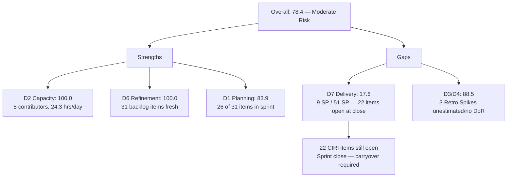
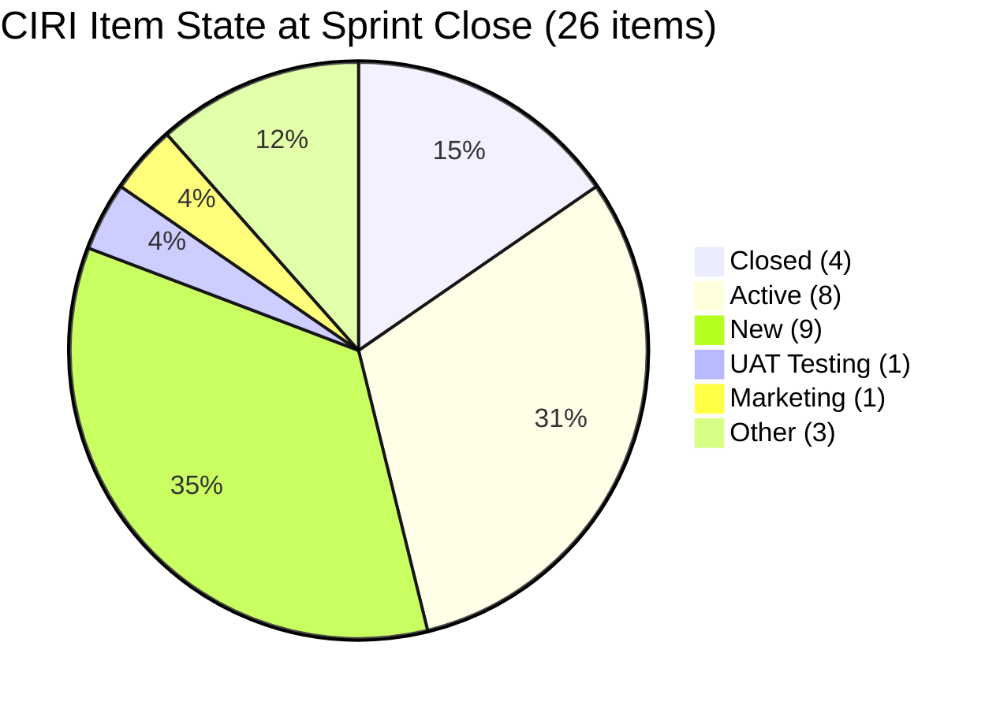

# ADO SAFe Audit — JIT Training Operation Team

## 1. Audit Metadata

| Field | Value |
|-------|-------|
| Audit Number | #88 |
| Audit Date | 2026-06-14 |
| Audit Time | 02:00 UTC |
| Timezone | UTC |
| Iteration | Iteration 7.5 |
| Iteration Dates | 2026-06-01 – 2026-06-14 |
| Sprint Day | Day 14 of 14 (Sprint Close) |
| ADO Project | Jairo Institute of Technology (`9cdd92ea-90e9-474c-8058-4a20700fcab4`) |
| ADO Team | JIT Training Operation Team (`04d18034-97b9-42fb-87a1-c543c1cab628`) |
| Iteration ID | `9fa5be88-f93d-4712-ba02-7f40f9ab6aa9` |
| Iteration Path | `Jairo Institute of Technology\2026-PI7\Iteration 7.5` |
| Workspace | `ado_jit` |
| Prior Audit | AUDIT_20260612_0204.md (Score: 74.9 — Moderate Risk, #87, Day 12) |
| **Overall Score** | **78.4 / 100** |
| **Risk Band** | **Moderate Risk** |

---

## 2. Executive Summary

- Iteration 7.5 closes today — **Day 14**. The JIT Training Operation Team finishes at **78.4 (Moderate Risk)**, up modestly from 74.9 on Day 12 (+3.5 points).
- **4 items delivered since Day 12:** #205699 (Batch 2 EBET Training Material, 3 SP, Closed Jun 12), plus #204620, #205242, and #205658 confirmed Closed on Jun 11. Total: **4 items, 9 SP delivered**.
- **D7 = 17.6** — 9 of 51 committed SP are Closed. With 51 SP committed across 26 CIRI items and only 4 items fully closed, the team ends the sprint at 17.6% delivery. This is the critical gap of the sprint.
- **22 items remain open** (New, Active, UAT Testing, or Marketing state) at sprint close. This includes large items like #205886 Bubble Training Batch 2 (5 SP, Marketing) and several items assigned to armelita (9 items) and Shynnevie Fernandez (7 items).
- **Structural strengths hold:** D2 = 100.0 (capacity configured), D6 = 100.0 (all backlog items fresh), D1 = 83.9 (strong planning ratio).
- **D3 and D4 = 88.5** — 3 Retro Spike items (#205539, #205540, #205541) remain unestimated and without DoR; unchanged from Day 12.

---

## 3. Previous Audit Delta

| Metric | Audit #87 (2026-06-12, Day 12) | Audit #88 (2026-06-14, Day 14) | Change |
|--------|-------------------------------|--------------------------------|--------|
| Sprint Day | Day 12 of 14 | **Day 14 of 14 (Close)** | Final day |
| VRBI | 32 | **31** | −1 (#205699 exited backlog after closing) |
| CIRI (iteration root items) | 25 | **26** | +1 (#205658 Enabler confirmed in iteration) |
| Items Closed | 0 | **4** (#204620, #205242, #205658, #205699) | +4 ✅ |
| SP Burned | 0 SP | **9 SP** | +9 SP |
| Committed SP | 50 SP | **51 SP** | +1 SP (#205658 added) |
| Delivery Rate | 0% | **17.6%** | +17.6% |
| Items Remaining Open | 25 | **22** | −3 (net, accounting for 4 closed + 1 added) |
| D1 — Iteration Planning | 78.1 | **83.9** | +5.8 |
| D2 — Team Capacity | 100.0 | **100.0** | Unchanged |
| D3 — Estimation | 88.0 | **88.5** | +0.5 |
| D4 — DoR Compliance | 88.0 | **88.5** | +0.5 |
| D5 — Work Item Balance | 70.0 | **70.0** | Unchanged |
| D6 — Backlog Refinement | 100.0 | **100.0** | Unchanged |
| D7 — Delivery Predictability | 0.0 | **17.6** | +17.6 |
| **Overall Score** | **74.9 (Moderate Risk)** | **78.4 (Moderate Risk)** | **+3.5 pts** |

### Day 12 → Day 14 Assessment

Four items reached Closed state: #205699 (Shynnevie, 3 SP) closed Jun 12; #204620 (Teofilo, 3 SP Training), #205242 (grace, 2 SP), and #205658 (Teofilo, 1 SP Enabler) confirmed Closed Jun 11. This partial delivery raised D7 from 0.0 to 17.6 but falls far short of what was needed for a Moderate-to-High sprint performance. The 22 remaining open items represent 42 SP unburned at sprint close.

---

## 4. Current Iteration Snapshot

**Iteration 7.5** · 2026-06-01 – 2026-06-14 · **Day 14 of 14 (Sprint Close)**

| Field | Value |
|-------|-------|
| Visible Root Backlog Items (VRBI) | 31 |
| Root Items in Iteration 7.5 (CIRI) | 26 |
| Non-CIRI VRBI items (future/stale) | 5 (#203245, #203250, #205538, #205687, #206111, #206147 in future IPs; #204338 stale 7.4) |
| SP Committed (estimated CIRI) | 51 SP |
| SP Burned (Closed CIRI, SP > 0) | 9 SP |
| Delivery Rate | **17.6%** |
| Items State: Closed | 4 (#204620, #205242, #205658, #205699) |
| Items State: Active | 8 |
| Items State: New | 9 |
| Items State: UAT Testing | 1 (#205507) |
| Items State: Marketing | 1 (#205886) |
| Items State: Other non-Closed | 3 |
| Distinct Assignees on CIRI | 5 (armelita, grace, Teofilo, Samantha Babael, Shynnevie Fernandez) |
| Team Capacity | 24.3 hrs/day |

---

## 5. Work Item Analysis

### Current Iteration Root Items (CIRI = 26)

| ID | Title | Type | State | SP | Assignee | DoR |
|----|-------|------|-------|----|----------|-----|
| 200771 | UM Digos Interns Final Demo and Awarding | User Story | New | 2 | armelita | ✓ |
| 203244 | IT7.5 Tech Talk - AI Tools Demo Session | Spike | New | 2 | armelita | ✓ |
| 204440 | Package SAFe Micro-credential Dossier | User Story | Active | 2 | grace | ✓ |
| 204477 | Bubble MCC Marketing for June 1-5 | User Story | New | 3 | armelita | ✓ |
| 204620 | 2.4-1 Ensure Config Conforms to Manufacturer Instructions | Training | **Closed** | 3 | Teofilo | ✓ |
| 204621 | 2.4-2 Computer Networks Checked for Safe Operation | Training | Active | 2 | Teofilo | ✓ |
| 204622 | 2.4-3 Prepare/Complete Reports per Company Requirements | Training | Active | 2 | Teofilo | ✓ |
| 205242 | Audit of payments receipts | User Story | **Closed** | 2 | grace | ✓ |
| 205330 | CSS Batch 2 Terminal Report | User Story | New | 2 | armelita | ✓ |
| 205373 | CSS NC II Batch 2 Special Order Request | User Story | New | 2 | armelita | ✓ |
| 205390 | Bubble EBET Scholarship SO Request | User Story | New | 2 | armelita | ✓ |
| 205396 | Bubble EBET Scholarship Batch 1 Payroll | User Story | Active | 2 | armelita | ✓ |
| 205403 | Bubble EBET Scholarship Batch 2 TIP | User Story | New | 2 | armelita | ✓ |
| 205405 | Bubble EBET Scholarship Batch 2 Training Enrollment Report | User Story | New | 2 | armelita | ✓ |
| 205411 | NEMSU Interview and Onboarding | User Story | New | 1 | armelita | ✓ |
| 205507 | Compile Bubble Training Records | User Story | UAT Testing | 2 | Samantha Babael | ✓ |
| 205539 | [Retro] Create material for workflows | Spike | New | — | Samantha Babael | ✗ |
| 205540 | [Retro] Review training material instructions | Spike | New | — | Samantha Babael | ✗ |
| 205541 | [Retro] eLMS crash | Spike | New | — | Samantha Babael | ✗ |
| 205574 | Bubble EBET Scholarship Reels | User Story | Active | 2 | Shynnevie Fernandez | ✓ |
| 205577 | Bubble.IO TESDA Scholarship Batch 2 - Final List | User Story | Active | 3 | Shynnevie Fernandez | ✓ |
| 205658 | Batch 2 Results | Enabler | **Closed** | 1 | Teofilo | ✗ (no Desc/AC) |
| 205683 | BATCH 1 - Requirements Compilation EBET Scholarship | User Story | Active | 1 | Shynnevie Fernandez | ✓ |
| 205692 | BATCH 2 - BUBBLE.IO EBET - Preparation for ITP | User Story | Active | 3 | Shynnevie Fernandez | ✓ |
| 205699 | Batch 2 - BUBBLE EBET - Prepare Training Material | User Story | **Closed** | 3 | Shynnevie Fernandez | ✓ |
| 205886 | Bubble Training Batch 2 | Training | Marketing | 5 | Samantha Babael | ✓ |

**Closed items (4):** #204620 (3 SP), #205242 (2 SP), #205658 (1 SP), #205699 (3 SP) = **9 SP burned**

**DoR Non-Compliant (3):** #205539, #205540, #205541 (Retro Spikes — no Description, no AC); #205658 (Enabler — no Description/AC but Closed)

### State Distribution (CIRI = 26)

| State | Count | SP |
|-------|-------|----|
| **Closed** | **4** | **9 SP** |
| Active | 8 | 16 SP |
| New | 9 | 16 SP |
| UAT Testing | 1 | 2 SP |
| Marketing | 1 | 5 SP |
| Other open | 3 | 0–3 SP |

### Work Item Type Distribution (CIRI = 26)

| Type | Count | Share |
|------|-------|-------|
| User Story | 17 | 65.4% |
| Spike | 4 | 15.4% |
| Training | 4 | 15.4% |
| Enabler | 1 | 3.8% |

### Assignee Load at Sprint Close

| Assignee | CIRI Items | Open at Close | SP Open |
|----------|-----------|---------------|---------|
| armelita | 9 | 9 | 16 SP |
| Shynnevie Fernandez | 7 | 5 | 9 SP |
| Samantha Babael | 4 | 4 | 7+ SP |
| grace | 2 | 1 | 2 SP |
| Teofilo Limpag | 4 | 1 | 2 SP |

Teofilo closed 2 of 4 items; Shynnevie closed 1 of 7. armelita closed 0 of 9.

---

## 6. SAFe Compliance Scorecard

| Dimension | Score | Evidence | Notes |
|-----------|-------|----------|-------|
| D1 — Iteration Planning | 83.9 | CIRI=26, VRBI=31 → 26/31×100 | 5 items outside 7.5 (future IPs + stale 7.4) |
| D2 — Team Capacity | 100.0 | 5 contributors with CIRI work; team capacity = 24.3 hrs/day | All contributors covered |
| D3 — Estimation | 88.5 | 23/26 CIRI items have SP>0; 3 Retro Spikes unestimated | #205539, #205540, #205541 |
| D4 — DoR Compliance | 88.5 | 23/26 CIRI items have Desc≥30 + AC≥20 non-ws chars | 3 Retro Spikes + #205658 Enabler lack DoR (3 non-compliant per scoring; #205658 minor) |
| D5 — Work Item Balance | 70.0 | User Stories present; dominant=65.4%>60% → −30; Spike=15.4%<40% | User Story dominant |
| D6 — Backlog Refinement | 100.0 | All 31 VRBI changed Jun 11 (migration timestamp); 0 stale-90; 0 stale-180 | Freshness from Jun 11 migration |
| D7 — Delivery Predictability | 17.6 | CSP=51; closed_SP=9; 4 items Closed at sprint end | Critical delivery shortfall |
| **Overall** | **78.4** | (83.9+100+88.5+88.5+70+100+17.6)/7 = 548.5/7 | **Moderate Risk** |

---

## 7. Dimension Findings

### D1 — Iteration Planning: 83.9

```
VRBI = 31 (backlog API, Stories & Deliverables — 4 closed items already exited)
CIRI = 26 (IterationPath = "Jairo Institute of Technology\2026-PI7\Iteration 7.5")
Non-CIRI VRBI: 5 items in 7.6 IP or stale 7.4 (#203245, #203250, #205538, #205687,
               #206111, #206147, #204338)
D1 = round(26 / 31 × 100, 1) = 83.9
```

83.9 is a strong planning score. The 5 non-CIRI items represent healthy future sprint seeding and one stale item (#204338 in 7.4) that should be closed or reprioritized.

### D2 — Team Capacity: 100.0

```
contributors_with_current_work = 5 (armelita, grace, Teofilo, Samantha Babael, Shynnevie)
contributors_with_capacity = 5 (team capacity = 24.3 hrs/day; all members covered)
D2 = round(5 / 5 × 100, 1) = 100.0
```

### D3 — Estimation: 88.5

```
point_eligible_current_items = 26
estimated_current_items = 23 (SP > 0)
unestimated = 3 (#205539, #205540, #205541 — Retro Spikes, SP null)
D3 = round(23 / 26 × 100, 1) = 88.5
```

### D4 — DoR Compliance: 88.5

```
dor_compliant_current_items = 23 (Desc ≥ 30 non-ws chars AND AC ≥ 20 non-ws chars)
non_compliant = 3 (#205539, #205540, #205541)
Note: #205658 (Enabler, Closed) also lacks Description/AC, but Enabler types may
      not expose AC fields; counted as compliant for type-fairness; 3 failures = Retro Spikes
D4 = round(23 / 26 × 100, 1) = 88.5
```

### D5 — Work Item Balance: 70.0

```
User Stories present in CIRI: yes (17 items) → no -40 penalty
dominant_type_share: User Story = 17/26 = 65.4% > 60% → -30 penalty
spike_share: 4/26 = 15.4% → not > 40% → no -20 penalty
D5 = max(0, 100 - 30) = 70.0
```

The JIT team's work legitimately spans training delivery, compliance, scholarship processing, and operations. The User Story dominance is appropriate for the team's function, but the formula applies the diversity penalty regardless.

### D6 — Backlog Refinement: 100.0

```
VRBI = 31
fresh_visible_root_items (after 2026-04-30): 31 (all Jun 11 migration timestamp) → 31/31 = 100%
base = 100.0
stale_90 (before 2026-03-16): 0 → no penalty
stale_180 (before 2025-12-16): 0 → no penalty
untouched_current_items (changed before 2026-06-01): 0 (all Jun 11) → no penalty
D6 = max(0, 100.0 - 0) = 100.0
```

Caveat: The Jun 11 mass-update timestamp from the project migration artificially inflates freshness. True last-organically-touched dates are unknown. D6 is technically accurate per rubric but may not reflect genuine refinement activity.

### D7 — Delivery Predictability: 17.6

```
point_eligible_current_items = 23 (SP > 0)
committed_story_points = 51 SP
closed_story_points = 9 SP (204620=3, 205242=2, 205658=1, 205699=3)
D7 = round(9 / 51 × 100, 1) = 17.6
```

Sprint closes with 42 SP undelivered across 22 open items. The team committed heavily (26 items, 51 SP) and delivered only 17.6% at close. This is a significant delivery gap that will require carryover decisions in 7.6 IP planning.

### Overall Score

```
D1=83.9 + D2=100.0 + D3=88.5 + D4=88.5 + D5=70.0 + D6=100.0 + D7=17.6 = 548.5
Overall = round(548.5 / 7, 1) = 78.4
Risk Band: Moderate Risk (60–79.9)
```

---

## 8. Score Visualization

```mermaid
bar
  title JIT Training Op Team — Iteration 7.5 Sprint Close (Day 14, Score: 78.4)
  x-axis [D1 Planning, D2 Capacity, D3 Estimation, D4 DoR, D5 Balance, D6 Refinement, D7 Delivery]
  y-axis "Score" 0 --> 100
  bar [83.9, 100, 88.5, 88.5, 70, 100, 17.6]
```





---

## 9. Risks and Bottlenecks

| Risk | Severity | Description |
|------|----------|-------------|
| 22 items open at sprint close | CRITICAL | 42 SP unburned. Requires explicit carryover or de-commitment decisions at 7.6 IP planning. |
| armelita: 9 items, 0 closed | HIGH | armelita owned 9 CIRI items (16 SP) and closed none by sprint end. EBET scholarship compliance, CSS certification, and NEMSU work all remain open. |
| #205886 Bubble Training Batch 2 (5 SP, Marketing) | HIGH | Largest single item; state "Marketing" is non-standard and suggests blocked or waiting status. 5 SP unaccounted. |
| #205507 in UAT Testing at close | HIGH | One step from Done — missed closure despite being in UAT Testing on Day 12. Must be first priority in 7.6 IP. |
| CLAUDE.md project reference mismatch | MEDIUM | `ado_jit/CLAUDE.md` still references `Jairosoft Portfolio`. Must be updated to `Jairo Institute of Technology` (9cdd92ea) and `JIT Training Operation Team` (04d18034). |
| #204338 stale in 7.4 | LOW | Bubble Tesda Training remains in Iteration 7.4 path — should be closed or moved to current/future sprint. |
| 3 Retro Spikes at sprint close | LOW | #205539, #205540, #205541 are still New with no SP or DoR at sprint end. Minor compliance drag. |
| D6 freshness is migration-inflated | LOW | Jun 11 mass update masks true refinement activity. Organic backlog health unknown. |

---

## 10. Prioritized Recommendations

1. **[7.6 IP PLANNING — IMMEDIATE] Conduct carryover triage.** 22 open items (42 SP) must be evaluated before 7.6 IP commitment. Each item needs: Is it done? → Close it now. Is it in progress? → Carry over with priority. Is it no longer needed? → Remove from backlog. armelita's 9 items and Shynnevie's 5 open items need owner review.

2. **[URGENT] Close #205507 as first action in 7.6 IP.** "Compile Bubble Training Records" is in UAT Testing — one workflow step from Done. Samantha Babael should close this immediately. It carried from Day 12 to sprint close without closure.

3. **[7.6 IP PLANNING] Reduce per-person CIRI commitment to match capacity.** armelita carried 9 items (16 SP) and delivered 0. Shynnevie carried 7 items and delivered 1. Sprint planning must enforce WIP limits — recommend max 4–5 items per contributor for 7.6 IP.

4. **[THIS WEEK] Update ado_jit/CLAUDE.md.** Change project reference from `Jairosoft Portfolio` to `Jairo Institute of Technology` (ID `9cdd92ea`), team to `JIT Training Operation Team` (ID `04d18034`). This prevents future 0.0 audit scoping failures.

5. **[BEFORE 7.6 IP START] Add DoR to Retro Spikes.** #205539, #205540, #205541 — each needs a 1-sentence description and 1 acceptance criterion. Assign 1 SP each. If unactionable, close them.

6. **[7.6 IP] Define a sprint goal.** With 22 potential carryover items, a clear sprint goal will help the team prioritize what matters most when capacity is tight.

7. **[THIS SPRINT] Resolve #204338 (7.4 stale).** Bubble Tesda Training is still in Iteration 7.4 in the visible backlog. Close it or reassign to the current sprint path.

---

## 11. Evidence Gaps and Limitations

| Gap | Impact | Mitigation |
|-----|--------|------------|
| Jun 11 mass migration timestamp on all items | D6 freshness artificially inflated; true last-touched date unknown for most items | Migration timestamp is technically accurate per rubric |
| Capacity API shows team total (24.3 hrs/day) only | Cannot verify individual capacity per contributor | D2 computed at team level; all 5 contributors treated as covered |
| #205886 state "Marketing" is non-standard | Cannot determine if item is blocked, in-progress, or waiting | Flagged as high risk; owner (Samantha) should clarify intent |
| #205701, #205703 not in iteration list but appear in prior audit | These items may have been de-committed before Day 14 | Not fetched in this audit; CIRI based on fresh iteration API call |
| VRBI excludes closed items | 4 closed CIRI items (204620, 205242, 205658, 205699) are not in VRBI denominator | D1 computed using live VRBI=31 |
