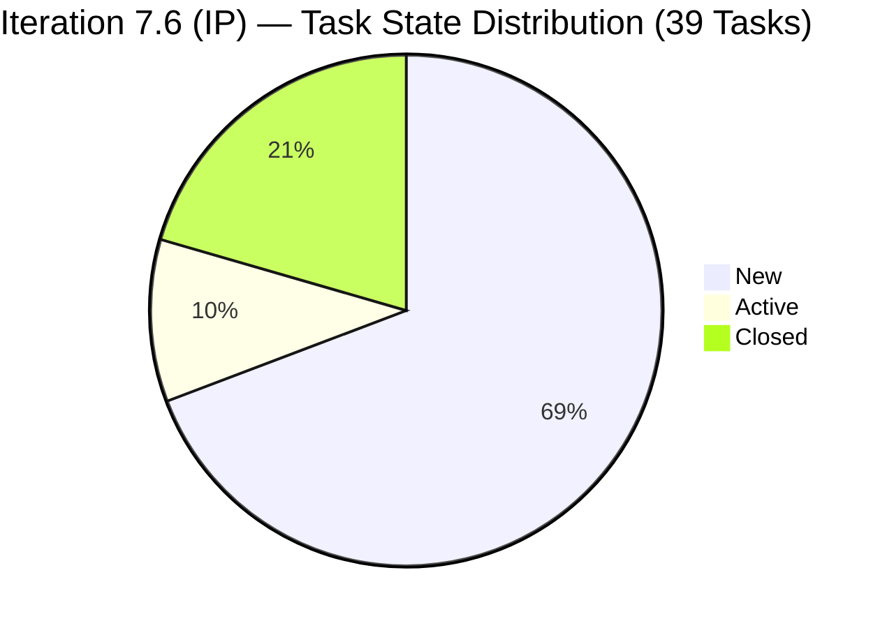
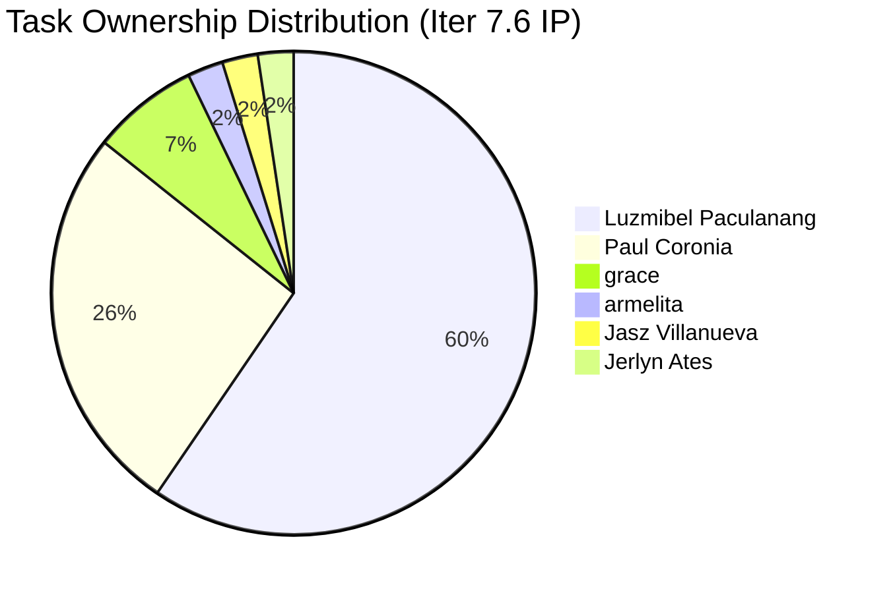

# SAFe Iteration Audit — JIT Operation Team

## 1. Audit Metadata

| Field | Value |
|-------|-------|
| **Project** | Jairosoft Portfolio |
| **Team** | JIT Operation Team (Portfolio) |
| **Workspace** | `ado_jit` |
| **Iteration** | Iteration 7.6 (IP) — Innovation & Planning |
| **Iteration Dates** | 2026-06-15 to 2026-06-28 |
| **Audit Date** | 2026-06-15 (PHT, UTC+8) |
| **Prior Audit Reference** | No prior audit files found in `ado_jit/audit/` |
| **Overall Score** | **4.3 / 100** |
| **Risk Band** | CRITICAL (Red) |

---

## 2. Executive Summary

The JIT Operation Team opens Iteration 7.6 (IP) with **39 items** in the current iteration — all of which are **Tasks**, not User Stories or other root-level requirement types. The Stories & Deliverables backlog query returned null, confirming that the team has no root-level backlog items (User Stories, Features, or Deliverables) scoped to this iteration. All work is tracked at the Task level only, bypassing the SAFe requirement hierarchy entirely.

This is **Day 1** of a 14-day IP iteration. The structural absence of User Stories at the root level cascades into near-zero scores across all dimensions that rely on root backlog items. The team shows active work (Luzmibel Paculanang has 7 closed Tasks as of today, including items closed within the last hour), but this cannot be measured by the SAFe rubric without proper story-level commitments.

The overall score of **4.3** (Critical) reflects a systemic planning and structure problem, not necessarily poor execution. The team appears busy and active, but their ADO configuration makes audit verification impossible and delivery measurement unreliable.

---

## 3. Previous Audit Delta

No prior audit files exist in the `ado_jit/audit/` folder. This is the **first formal audit** of the JIT Operation Team using the standardized SAFe 7-dimension rubric. The CLAUDE.md notes that Iteration 7.3 (May 4–17, 2026) was the last known iteration before 7.6 (IP), suggesting 7.4 and 7.5 were not formally audited.

---

## 4. Current Iteration Snapshot

| Field | Value |
|-------|-------|
| **Iteration** | 7.6 (IP) — Innovation & Planning |
| **Start Date** | 2026-06-15 |
| **End Date** | 2026-06-28 |
| **Duration** | 14 days |
| **Root Items in Iteration (User Stories / Deliverables)** | 0 |
| **Task-level Items in Iteration** | 39 |
| **Story Points Committed** | 0 (Tasks carry no SP) |
| **Items Closed** | 8 Tasks |
| **Items Active** | 4 Tasks |
| **Items New** | 27 Tasks |
| **Team Capacity** | 15.5 pts/day (team-level, ADO) |
| **Iteration Goal** | Not defined |

### Active Contributors (Task Level)

| Contributor | Tasks Assigned | Closed |
|-------------|---------------|--------|
| Luzmibel Paculanang (lpaculanang@jairosoft.com) | 25 | 8 |
| Paul Coronia (pcoronia@jairosoft.com) | 11 | 0 |
| armelita (armelita@jairosoft.com) | 1 | 0 |
| grace (grace@jairosoft.com) | 3 | 0 |
| Jaszmeine Villanueva (jvillanueva@jairosoft.com) | 1 | 0 (Active) |
| Jerlyn Ates (jates@jairosoft.com) | 1 | 0 (Active) |

---

## 5. Work Item Analysis

### 5.1 Task Inventory (Iter 7.6 IP — 39 Total)

**Paul Coronia domain (11 Tasks — Engineering/Tech):**

| ID | Title | State |
|----|-------|-------|
| 202608 | Analyze dashboard data dependencies and API calls | New |
| 202613 | Convert dashboard page to async Server Component | New |
| 202618 | Create loading.tsx with Suspense fallback | New |
| 202623 | Test and verify SSR output, measure TTFB | New |
| 202646 | Identify independent data fetches in pilot RSC route | New |
| 202647 | Draft caching strategy document mapping routes to policies | New |
| 202654 | Refactor to Promise.all | New |
| 202655 | Implement revalidate on one route | New |
| 202656 | Implement revalidateTag in one Server Action | New |
| 202657 | Team review and approval | New |
| 202658 | Benchmark TTFB before/after and document | New |

**Armelita / Events (1 Task):**

| ID | Title | State |
|----|-------|-------|
| 203875 | Tech Talk V2.0 June 25 Session Speaker Jasz | New |

**Jaszmeine / Jerlyn (2 Tasks — Onboarding):**

| ID | Title | State |
|----|-------|-------|
| 204088 | Jasz - PO Jodex AI Onboarding | Active |
| 204089 | Jerlyn - PO Jodex AI Onboarding | Active |

**Luzmibel Paculanang QA domain (25 Tasks):**

| ID | Title | State |
|----|-------|-------|
| 205257 | QA - QA Testing - Bel | New |
| 205259 | QA - QA Testing - Bel | New |
| 205260 | QA - QA Testing - Bel | New |
| 205280 | QA - QA Testing - Bel | New |
| 205289 | QA - QA Testing - Bel | Active |
| 205894 | (grace) FTC Fabrication of Flag Poles | New |
| 205896 | (grace) FTC Decoration and set-up | New |
| 205897 | (grace) FTC Platform | New |
| 206090 | QA - QA Testing - Bel | Closed |
| 206242 | QA - Create and Replicate Defect - Bel | Closed |
| 206244 | QA - Create and Replicate Defect - Bel | Closed |
| 206246 | QA - Create and Replicate Defect - Bel | Closed |
| 206248 | QA - Create and Replicate Defect - Bel | Closed |
| 206275 | QA - Create and Replicate Defect - Bel | Closed |
| 206320 | QA - Create and Replicate Defect - Bel | Closed |
| 206324 | QA - QA Testing - Bel | New |
| 206325 | QA - QA Testing - Bel | New |
| 206326 | QA - QA Testing - Bel | New |
| 206327 | QA - QA Testing - Bel | New |
| 206328 | QA - QA Testing - Bel | Closed |
| 206330 | June 15–19 Collaborations/Exploratory Testing/Update E2E | Active |
| 206332 | June 22–26 Collaborations/Exploratory Testing/Update E2E | New |

**Notable observations:**
- Multiple Tasks share identical titles ("QA - QA Testing - Bel" appears 10+ times) — strong indicator of copy-paste item creation rather than structured planning.
- Grace's items (FTC series) appear to be physical event tasks (Flag Poles, Decoration, Platform) tracked as IT team items.
- Paul Coronia's 11 tasks cover a coherent technical theme (Next.js SSR optimization, caching), but none are wrapped in a parent User Story.
- No Story Points on any items.

---

## 6. SAFe Compliance Scorecard

| # | Dimension | Score | Evidence | Notes |
|---|-----------|-------|----------|-------|
| 1 | Iteration Planning | **0.0** | visible_root_backlog = 0 (null from ADO); current_iter_root = 0 | No User Stories or Deliverables in backlog |
| 2 | Team Capacity | **0.0** | contributors_with_current_work = 0 (no root items); team capacity = 15.5 pts/day configured | Capacity exists but no root commitments |
| 3 | Estimation | **0.0** | point_eligible = 0 (no User Stories); no SP on any Task | Tasks do not carry Story Points |
| 4 | DoR Compliance | **0.0** | current_iter_root = 0; DoR formula undefined at 0 items | No items to evaluate |
| 5 | Work Item Balance | **30.0** | No User Stories (-40); Task type = 100% dominant > 60% (-30); no spikes | max(0, 100-40-30) = 30 |
| 6 | Backlog Refinement | **0.0** | visible_root = 0; base score = 0/0 undefined → 0 | No root backlog to refine |
| 7 | Delivery Predictability | **0.0** | committed_SP = 0; formula: committed_SP=0 → 0 | Day 1; no SP-tracked commitments |
| | **Overall** | **4.3** | Average of 7 dimensions | Critical Risk |

---

## 7. Dimension Findings

### 7.1 Iteration Planning (0.0)
The Stories & Deliverables backlog for the JIT Operation Team returned null via the ADO MCP API. This indicates no root-level requirement items (User Stories, Deliverables) are assigned to this team's backlog. All 39 items in Iter 7.6 (IP) are Tasks. Under SAFe, Tasks are child work items and do not represent sprint commitments at the planning level. The iteration technically has no committed work at the story level.

### 7.2 Team Capacity (0.0)
Team capacity is configured at 15.5 pts/day — showing the team has properly set up capacity. However, since there are zero root-level items to assign to contributors, the `contributors_with_current_work` denominator is 0, and the formula returns 0. The team has 6 active contributors (tracked at Task level), which is a healthy team size.

### 7.3 Estimation (0.0)
No Story Points exist on any of the 39 Tasks. ADO Tasks do not expose the Story Points field. Without parent User Stories carrying SP, no estimation score can be computed.

### 7.4 DoR Compliance (0.0)
With zero root-level items, the DoR formula is undefined. Evaluated at 0. At the Task level, most items also lack Description or Acceptance Criteria. Item 203875 (Tech Talk V2.0) has a brief Description; items 206330 and 206332 have descriptions. All others have no descriptive fields.

### 7.5 Work Item Balance (30.0)
The only score above zero. The team has no User Stories (-40 penalty), and Tasks dominate 100% of the work type portfolio (-30 penalty). No spikes or enablers are present. The resulting score of 30 reflects a structurally imbalanced item mix. A well-functioning SAFe team should have User Stories as the primary requirement type.

### 7.6 Backlog Refinement (0.0)
With no root backlog items, there is nothing to measure for freshness, staleness, or untouched status. This dimension cannot be scored. The team does not appear to maintain a Stories & Deliverables backlog — work appears to be planned exclusively at the Task level.

### 7.7 Delivery Predictability (0.0)
No committed Story Points exist; the formula returns 0 when committed_SP=0. At the Task level, Luzmibel has already closed 7 Tasks today (206242–206328), showing active delivery. However, without SP-weighted commitments, delivery velocity cannot be measured in SAFe terms. **Early-sprint — Day 1 of IP iteration.**

---

## 8. Risks and Bottlenecks

| Risk | Severity | Impact |
|------|----------|--------|
| No User Stories or Deliverables in team backlog — all work tracked as Tasks | Critical | Invalidates all SAFe planning, estimation, and delivery metrics |
| Duplicate/identical Task titles (10+ "QA - QA Testing - Bel") | High | Signals lack of planning discipline; items indistinguishable without opening each |
| No Story Points on any work item | High | Velocity tracking impossible; capacity planning unreliable |
| No Iteration Goal defined | High | Team has no shared objective for the IP iteration |
| No parent User Stories wrapping Paul Coronia's 11 technical tasks | High | Engineering work not visible at portfolio/product level |
| Grace's physical event tasks (FTC Flag Poles, Decoration, Platform) mixed into IT team | Moderate | Blurs team purpose and inflates task count with non-IT work |
| Ownership concentration: Luzmibel handles 25/39 items (64%) | Moderate | Bus factor risk on QA delivery |
| Team capacity API returned only 1 team entry (bd9578fd) — may not be the JIT team | Low | Capacity attribution uncertain |

---

## 9. Prioritized Recommendations

1. **[Immediate — This IP Iteration]** Create User Story scaffolding in ADO. Paul Coronia's 11 engineering tasks should be wrapped in at least 2–3 parent User Stories (e.g., "As a developer, I want the dashboard to use SSR so that page load is optimized"). This single change would unlock Iteration Planning, Estimation, DoR, and Delivery Predictability metrics.

2. **[Immediate]** Define an Iteration Goal for 7.6 (IP). Suggested: "Complete Jodex AI onboarding for all team members and finalize Q3 caching architecture decision." Add this to the iteration in ADO.

3. **[This Sprint]** Consolidate the QA task structure. Replace the 10+ identically titled "QA - QA Testing - Bel" items with descriptive, unique User Story titles that capture what feature is being tested, its acceptance criteria, and the expected outcome.

4. **[This Sprint]** Add Story Points to all User Stories once they are created. Target 1–8 SP per story. This is prerequisite to velocity tracking and Delivery Predictability scoring.

5. **[This Sprint]** Separate grace's FTC physical event tasks (Flag Poles, Decoration, Platform) to a different team or project. These appear to be non-IT operations tasks and should not be tracked under the JIT Operation Team in Jairosoft Portfolio.

6. **[Next Iteration Planning (8.1)]** Conduct a full Iteration Planning event: pull items from a refined backlog (not direct Task creation), set an iteration goal, assign capacity, and link all Tasks to parent User Stories before the sprint starts.

7. **[Strategic]** Establish a Team Working Agreement that mandates: no Task may be created without a parent User Story, all User Stories require DoR sign-off (Description + AC), and SP estimation is required before sprint start.

---

## 10. Evidence Gaps and Limitations

| Gap | Impact |
|-----|--------|
| `wit_list_backlog_work_items` returned null (not empty) for the JIT team | Cannot distinguish between "team has no backlog items" vs. "team's backlog category is misconfigured." Manual verification in ADO board required. |
| `work_list_team_iterations` returned "No iterations found" on first call with project/team GUIDs | Resolved by listing all iterations and identifying 7.6 (IP) (GUID: 42e165b7) as the current iteration by date. JIT team may not be subscribed to iterations via `work_list_team_iterations`. |
| WIQL query with team GUID failed ("team does not exist or no permission") | Used project-level WIQL without team filter. All 39 results may include items from adjacent teams in the same project. However, all 39 items were verified to have IterationPath = "Jairosoft Portfolio\2026-PI7\Iteration 7.6 (IP)." |
| No prior audit files in `ado_jit/audit/` | Cannot compute delta from prior audit. |
| Individual capacity records not returned for this team ID | Team-level capacity (15.5 pts/day) retrieved via different team GUID (bd9578fd). Not confirmed to be exclusively JIT team capacity. |

---

## Appendix: Mermaid Diagrams





```mermaid
bar
    title SAFe Compliance Scorecard — JIT Operation Team — Iteration 7.6 (IP)
    x-axis [Iter Planning, Team Capacity, Estimation, DoR Compliance, Work Bal, Backlog Ref, Delivery Pred]
    y-axis "Score (0-100)" 0 --> 100
    bar [0, 0, 0, 0, 30, 0, 0]
```
