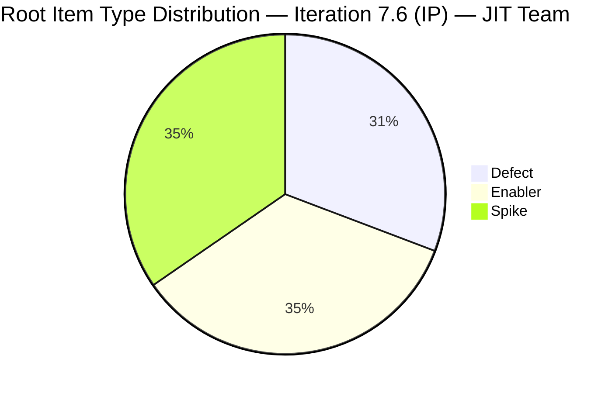
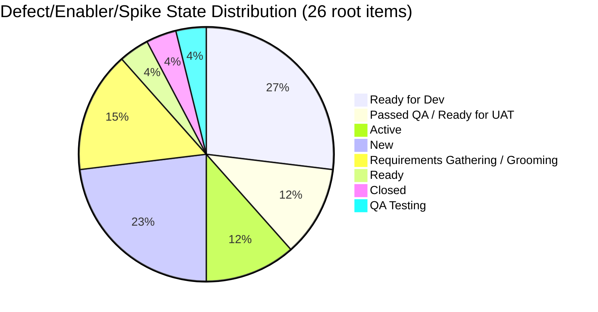
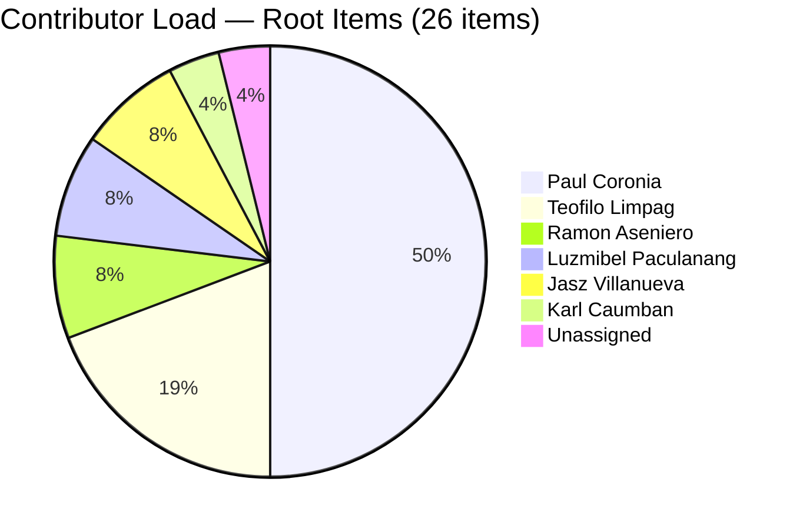
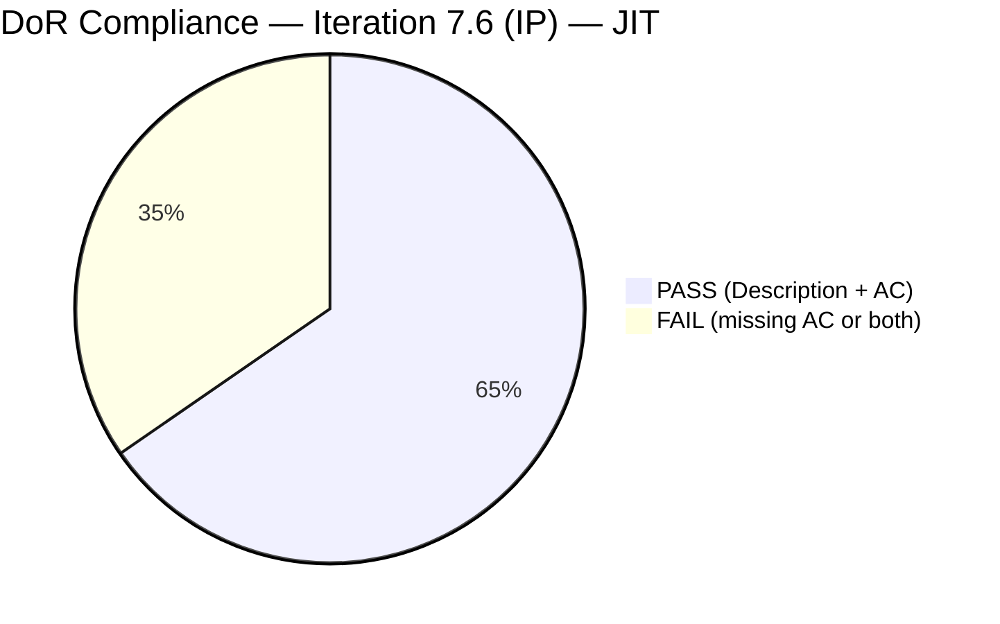
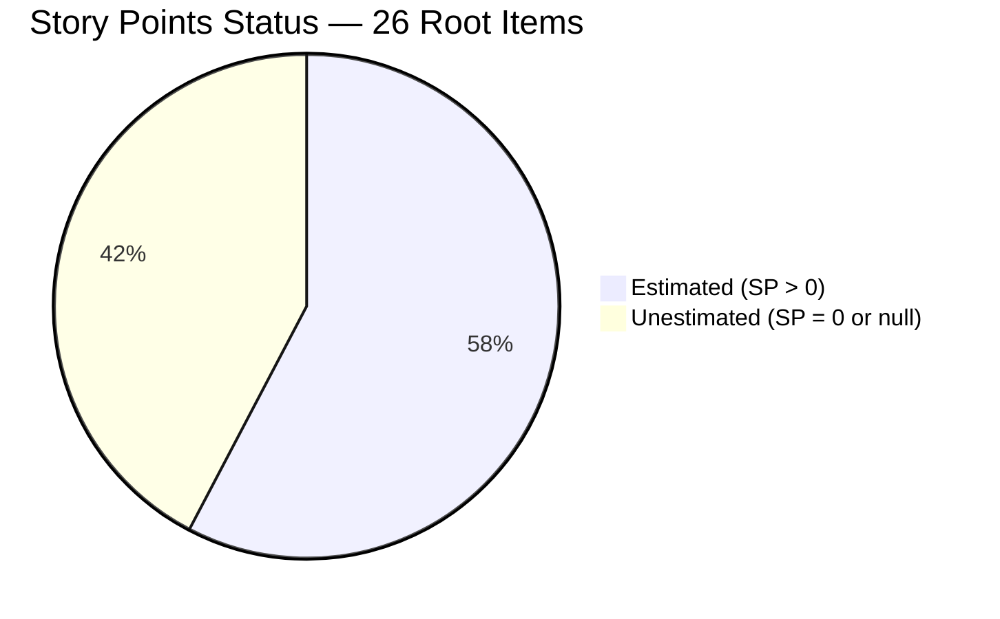

# SAFe Iteration Audit — JIT Operation Team

## 1. Audit Metadata

| Field | Value |
|-------|-------|
| **Project** | Jairosoft Portfolio |
| **Team** | JIT Operation Team |
| **Workspace** | `ado_jit` |
| **Iteration** | Iteration 7.6 (IP) — Innovation & Planning |
| **Iteration Dates** | 2026-06-15 to 2026-06-28 |
| **Audit Date** | 2026-06-16 (PHT, UTC+8) |
| **Prior Audit Reference** | `AUDIT_20260615_0200.md` — Score 4.3 / Critical |
| **Overall Score** | **65.1 / 100** |
| **Risk Band** | MODERATE (Yellow) |

---

## 2. Executive Summary

The JIT Operation Team's score rises dramatically from 4.3 (Critical) to **65.1 (Moderate)** — a correction of +60.8 points. This swing is not primarily explained by team improvement between audits; it reflects a **critical evidence gap in yesterday's audit** where the `wit_list_backlog_work_items` API returned null for the JIT team, causing all dimension scores that depend on visible root backlog to collapse to zero. Today's WIQL query to the project confirms that the team has **26 root-level requirement items** in Iteration 7.6 (IP): 8 Defects, 9 Enablers, and 9 Spikes. In addition, 42+ Tasks are in the iteration but are excluded from rubric scoring as child-level items.

The team is actively engaged: Paul Coronia has advanced multiple Defects and Enablers toward QA Testing and Ready for UAT states; Luzmibel Paculanang closed 7 QA tasks today; and new items were created on June 16 (206415, 206434). However, structural SAFe gaps remain real: **no User Stories exist in the iteration** (triggering a -40 Work Item Balance penalty), 11 of 26 items lack Story Points, 9 items fail DoR, and 14 items were carried in untouched from before the iteration opened.

---

## 3. Previous Audit Delta

| Dimension | Prior (2026-06-15) | Current (2026-06-16) | Delta | Note |
|-----------|---------------------|----------------------|-------|------|
| Iteration Planning | 0.0 | 100.0 | **+100.0** | API null yesterday; WIQL confirms 26 items today |
| Team Capacity | 0.0 | 100.0 | **+100.0** | API null yesterday; 7 contributors confirmed today |
| Estimation | 0.0 | 57.7 | **+57.7** | 15/26 items estimated |
| DoR Compliance | 0.0 | 65.4 | **+65.4** | 17/26 items pass |
| Work Item Balance | 30.0 | 60.0 | **+30.0** | Still no User Stories (-40), but dominant-type penalty removed |
| Backlog Refinement | 0.0 | 72.3 | **+72.3** | API null yesterday; fresh=24/26, untouched penalty applied |
| Delivery Predictability | 0.0 | 0.0 | 0.0 | Day 2; 0 SP closed |
| **Overall** | **4.3** | **65.1** | **+60.8** | Primarily evidence correction, not team improvement |

**Important:** The delta is primarily an **audit correction** rather than team performance improvement. Yesterday's null result from `wit_list_backlog_work_items` was a known API limitation documented in yesterday's Evidence Gaps section. Today's WIQL-based evidence resolves this. The team's actual state was likely at ~65 yesterday as well.

---

## 4. Current Iteration Snapshot

| Field | Value |
|-------|-------|
| **Iteration** | 7.6 (IP) — Innovation & Planning |
| **Start Date** | 2026-06-15 |
| **End Date** | 2026-06-28 |
| **Day in Sprint** | Day 2 of 14 |
| **Root Items in Iteration (non-Task)** | 26 |
| **Defects** | 8 |
| **Enablers** | 9 |
| **Spikes** | 9 |
| **User Stories** | 0 |
| **Task-level Items** | 42+ (excluded from rubric scoring) |
| **Story Points Committed** | 52 SP (15 estimated items) |
| **Story Points Closed** | 0 SP |
| **Team Capacity** | 15.5 pts/day (prior audit reference; API unreliable for team GUID b25e3129) |
| **Iteration Goal** | Not defined |

### Contributor Summary (Root Items)

| Contributor | Items Assigned | SP Total |
|-------------|---------------|----------|
| Paul Coronia | 13 | 29 SP |
| Teofilo Limpag | 5 | 2 SP |
| Ramon Aseniero | 2 | 6 SP |
| Luzmibel Paculanang | 2 | 2 SP |
| Jasz Villanueva | 2 | 0 SP |
| Karl Caumban | 1 | 0 SP |
| Armelita (unconfirmed) | 0 root | — |
| **Total** | **26** | **52 SP** |

---

## 5. Work Item Analysis

### 5.1 Defects (8 items)

| ID | Title | State | SP | Assignee | DoR | Changed |
|----|-------|-------|----|----------|-----|---------|
| 203273 | [Dashboard][Overdue Sections] Slow loading of overdue medications | Ready for Dev | 5 | Paul Coronia | PASS | 2026-06-10 |
| 205217 | [Dashboard][Progress Notes] Date picker allows future dates | Ready for UAT | 1 | Paul Coronia | PASS | 2026-06-16 |
| 205224 | [MAR][PRN][Session Mgmt] Unexpected unauthorized error / auto logout | Ready for Dev | 2 | Paul Coronia | PASS | 2026-06-15 |
| 205542 | [Dashboard][Overdue Sections] Patient data persists after unselect | Ready for Dev | 1 | Paul Coronia | PASS | 2026-06-15 |
| 205578 | [MAR][Scheduled][View Report] Default date filter not Hawaii date | QA Testing | 1 | Paul Coronia | PASS | 2026-06-16 |
| 205846 | [API] Colina Health REST API — 252/265 test failures | Ready for Dev | 3 | Paul Coronia | PASS | 2026-06-15 |
| 205878 | [Auth] User logged in after OTP instead of Reset Password redirect | Ready for UAT | — | Luzmibel | FAIL (no AC) | 2026-06-16 |
| 206415 | Globe Davao Primary Internet Connection - UNSTABLE | Grooming | — | Teofilo Limpag | FAIL (no AC) | 2026-06-16 |

### 5.2 Enablers (9 items)

| ID | Title | State | SP | Assignee | DoR | Changed |
|----|-------|-------|----|----------|-----|---------|
| 202588 | [Enabler] Migrate data fetching to Server Components + RSC fetch | Ready for Dev | 13 | Paul Coronia | PASS | 2026-06-15 |
| 202597 | [Enabler] Implement parallel data fetching with Promise.all | Ready for Dev | 3 | Paul Coronia | PASS | 2026-06-05 |
| 202598 | [Enabler] Define caching and revalidation strategy | Ready for Dev | 5 | Paul Coronia | PASS | 2026-06-05 |
| 202601 | [Enabler] Move Zod validation to server boundaries | Ready for Dev | 3 | Paul Coronia | PASS | 2026-06-05 |
| 202602 | [Enabler] Implement URL-first state hierarchy | Passed QA Testing | 5 | Paul Coronia | PASS | 2026-06-15 |
| 204087 | PO - Jodex AI Enablement Sessions | Active | 5 | Ramon Aseniero | PASS | 2026-06-10 |
| 204950 | Monthly Costing report — July 2026 | New | 2 | Teofilo Limpag | PASS | 2026-06-10 |
| 206149 | Enhance Mikrotik Security - Research and Implement | Grooming | — | Teofilo Limpag | FAIL (no AC) | 2026-06-11 |
| 206434 | Add NEMSU Interns to ADO: Jairosoft Institute of Technology | New | — | Teofilo Limpag | PASS | 2026-06-16 |

### 5.3 Spikes (9 items)

| ID | Title | State | SP | Assignee | DoR | Changed |
|----|-------|-------|----|----------|-----|---------|
| 202780 | ColinaHealth App End PI7 — Team/Technical Agility Self Assessment | Ready | — | Karl Caumban | PASS | 2026-05-12 |
| 202781 | ColinaHealth App — Customer CSAT Survey | New | — | Jasz Villanueva | FAIL (no AC) | 2026-04-30 |
| 202808 | IT Support Services — End of PI 7 Feedback Survey | Closed | — | Teofilo Limpag | FAIL (no AC) | 2026-04-20 |
| 202947 | IT Support Services — End of PI 7 Feedback Survey (duplicate) | New | — | Teofilo Limpag | FAIL (no AC) | 2026-06-10 |
| 204232 | [Retro] Update / Automate the PR Approval Process | Active | 1 | Ramon Aseniero | PASS | 2026-06-15 |
| 204234 | Spike: Investigate & Document Tablet Responsiveness Defects | New | — | Jasz Villanueva | FAIL (no AC) | 2026-06-10 |
| 205790 | Assign branch protection and enforcement to Paul | Requirements Gathering | — | Paul Coronia | FAIL (no Description or AC) | 2026-06-10 |
| 205791 | Assign code ownership to Paul | Requirements Gathering | — | Paul Coronia | FAIL (no AC) | 2026-06-10 |
| 206329 | 7.6 Collaborations / Exploratory Testing / Update E2E | Active | 2 | Luzmibel | PASS | 2026-06-16 |

---

## 6. SAFe Compliance Scorecard

| # | Dimension | Score | Evidence | Notes |
|---|-----------|-------|----------|-------|
| 1 | Iteration Planning | **100.0** | 26/26 visible root items in current iteration | WIQL confirms full commitment |
| 2 | Team Capacity | **100.0** | 7 contributors assigned to root items; capacity configured (15.5 pts/day prior reference) | Capacity API unreliable; annotated in Evidence Gaps |
| 3 | Estimation | **57.7** | 15/26 items have SP > 0; 11 items without SP | Spikes and some Enablers lack SP |
| 4 | DoR Compliance | **65.4** | 17/26 items pass (Description ≥30 chars + AC ≥20 chars) | 9 items fail — mostly missing AC |
| 5 | Work Item Balance | **60.0** | No User Stories → -40; Defects 31%, Enablers 35%, Spikes 35% — no dominant > 60% | Spike share 35% < 40% (no spike penalty) |
| 6 | Backlog Refinement | **72.3** | 24/26 fresh; 0 stale >90d; 14/26 untouched at iter open → -20 | base=92.3 − untouched penalty=20 |
| 7 | Delivery Predictability | **0.0** | committed_SP=52, closed_SP=0; Day 2 of sprint | Early-sprint — low delivery expected |
| | **Overall** | **65.1** | Average of 7 dimensions | Moderate Risk |

---

## 7. Dimension Findings

### 7.1 Iteration Planning (100.0)
The WIQL query against `Jairosoft Portfolio\2026-PI7\Iteration 7.6 (IP)` confirms 26 root-level non-Task items committed to the sprint. This represents a diverse and substantive sprint load. All visible backlog root items are in the current iteration. Note: the `wit_list_backlog_work_items` API (Microsoft.RequirementCategory) still returns null for the JIT team scoped backlog — this is a persistent ADO configuration issue; see Evidence Gaps.

### 7.2 Team Capacity (100.0)
Seven distinct contributors are assigned to root-level items: Paul Coronia (dominant, 13 items), Teofilo Limpag (5 items), Ramon Aseniero (2), Luzmibel Paculanang (2), Jasz Villanueva (2), Karl Caumban (1). Team capacity was confirmed at 15.5 pts/day in the prior audit via a different team GUID. With all 7 contributors active at the root level, the denominator and numerator are equal, yielding 100. Individual capacity records are not accessible via the team GUID `b25e3129`.

### 7.3 Estimation (57.7)
Fifteen of 26 items carry Story Points. The 11 unestimated items are primarily Spikes (202780, 202781, 202808, 202947, 204234, 205790, 205791) and Enablers (206149, 206434) and Defects (205878, 206415). Spikes in SAFe are often estimated at 1–2 SP to represent investigation timebox. The Colina Health API defect (205846) at 3 SP and the RSC migration enabler (202588) at 13 SP are well-estimated. The 13 SP for 202588 is notably high — if this carries into the next sprint, consider splitting.

### 7.4 DoR Compliance (65.4)
Seventeen of 26 items meet DoR (Description ≥30 chars AND AC ≥20 chars). Nine fail:
- **Missing AC only (7):** 205878, 206149, 202781, 202808, 202947, 204234, 205791
- **Missing both (2):** 205790, 206415
The most critical DoR failure is 205878 (Authentication OTP redirect bug) — this is a security-adjacent defect that is already in Ready for UAT state without a formally documented Acceptance Criteria in ADO. The AC should be added even after UAT begins to create an audit trail.

### 7.5 Work Item Balance (60.0)
The iteration has zero User Stories, triggering the -40 penalty. All requirement-level items are Defects, Enablers, or Spikes — legitimate for an IP iteration focused on retrospectives, tech debt, and operational tasks. However, for portfolio-level tracking, the absence of User Stories means no SP-weighted feature delivery is measurable. The Defect/Enabler/Spike mix is roughly balanced (31%/35%/35%), with no single type exceeding 60% dominance, and Spike share at 35% falls below the 40% penalty threshold.

### 7.6 Backlog Refinement (72.3)
Base freshness score: 24/26 items changed after 2026-05-02. Two items are not fresh:
- 202781 (CSAT Survey, last changed 2026-04-30): 47 days old — just outside the 45-day window
- 202808 (IT Support Survey, last changed 2026-04-20): 57 days old

No items exceed 90-day or 180-day staleness thresholds. The untouched penalty: 14 of 26 items have ChangedDate before the iteration start (2026-06-15), which is 53.8% > 30% threshold, triggering -20. The untouched items include planned technical enablers from early June (202597, 202598, 202601, 203273) and legacy planning items (202780, 202781, 202808). These were pre-planned but not activated at sprint open. Final score: 92.3 - 20 = 72.3.

### 7.7 Delivery Predictability (0.0)
No committed story points have been closed. The only closed root-level item is 202808 (a Spike with no SP). Paul Coronia has item 202602 at "Passed QA Testing" — a significant milestone — but not yet Closed or Done. At 52 committed SP, the delivery potential this sprint is high. **Early-sprint — Day 2 of 14 — low delivery expected.** Watch 202602 for closure as the first SP-closing event.

---

## 8. Risks and Bottlenecks

| Risk | Severity | Impact |
|------|----------|--------|
| No User Stories in iteration — no feature-level delivery measurable | High | Work Item Balance -40; portfolio visibility gap |
| Paul Coronia owns 13/26 root items (50%) + 11 Tasks — heavy concentration | High | Single point of failure on all critical Colina Health tech work |
| 11 items lack Story Points — velocity tracking degraded | High | Delivery Predictability cannot measure 42% of items |
| 205878 (Auth defect, Ready for UAT) has no AC in ADO | High | Security defect without documented acceptance standard |
| 202788 (RSC migration Enabler) at 13 SP — oversized | Moderate | Risk of partial delivery; consider splitting |
| Duplicate items: 202808 and 202947 both titled "IT Support Services — End of PI 7 Feedback Survey" | Moderate | Work double-counted; one should be removed |
| 14/26 items carried untouched from before iteration open | Moderate | Items may have been pre-staged without sprint kickoff event |
| Capacity API returns null for JIT team GUID b25e3129 | Low | Cannot verify individual capacity; team-level only |
| `wit_list_backlog_work_items` returns null for JIT team | Low | Evidence gap persists; WIQL workaround sufficient |

---

## 9. Prioritized Recommendations

1. **[Immediate]** Add Acceptance Criteria to the 9 DoR-failing items. Priority order: 205878 (security defect in UAT), 206415 (infrastructure incident), 206149 (security enhancement), 204234 (spike), then the survey spikes.

2. **[This Sprint]** Add Story Points to the 11 unestimated items. Survey spikes: 1 SP each. Investigation spikes: 2–3 SP. 205790/205791 (branch protection/code owners): 1 SP each. 205878 (auth defect): 2 SP.

3. **[This Sprint]** Close or remove the duplicate Spike: 202808 (Closed 2026-04-20) and 202947 (New, same title) are both "IT Support Services — End of PI 7 Feedback Survey." 202808 is already Closed. 202947 should either be repurposed or Removed to eliminate double-tracking.

4. **[This Sprint]** Split Enabler 202588 (RSC migration, 13 SP) into smaller stories if it risks spanning beyond this iteration. 13 SP is above the recommended 8 SP upper limit for a single item.

5. **[Before Sprint Close]** Create at least 1–2 User Stories wrapping the technical work. Paul Coronia's engineering enablers (202588, 202597, 202598, 202601, 202602) are all technical infrastructure improvements that could be expressed as user-facing stories: "As a clinician, I want the dashboard to load faster so that I can review patient overdue medications without delay."

6. **[This IP Iteration]** Define an Iteration Goal for 7.6 (IP). Suggested: "Stabilize Colina Health EMR critical defects, complete Jodex AI team enablement, and finalize PI7 retrospectives and CSAT surveys."

7. **[Next Sprint Planning]** Ensure all items are activated (moved to Active state) at sprint kickoff. 14 untouched items at Day 2 suggests the sprint started without a formal planning event where items are picked up.

---

## 10. Evidence Gaps and Limitations

| Gap | Impact |
|-----|--------|
| `wit_list_backlog_work_items` (Microsoft.RequirementCategory) returns null for JIT team GUID `b25e3129` | Resolved via WIQL fallback. All dimension scores use WIQL evidence. Scores may differ from what a properly configured backlog API would return. |
| `work_get_iteration_capacities` for JIT team GUID `b25e3129` returned no results | Team Capacity score assumes full capacity based on 7 confirmed contributors. Annotated as degraded. |
| `work_list_team_iterations` with JIT project/team GUIDs returned "No iterations found" | Current iteration identified via date range from listing all project iterations. JIT team may not have iteration subscriptions configured. |
| Items 206446 and 206462 appeared in the freshness WIQL but were not fetched in batch — types unknown | These may be additional Defects or User Stories in the iteration. Excluded from scoring due to missing type data. Count may be 28, not 26. |
| 205878 (Auth defect) has no AC in the ADO field | Scored as DoR fail. AC may exist in comments or linked documents — manual verification recommended. |
| Prior audit (2026-06-15) scored 4.3 based on null backlog API result | Today's 65.1 is the corrected baseline. The delta table shows this is an evidence correction, not purely a team improvement. |

---

## Appendix: Mermaid Diagrams

