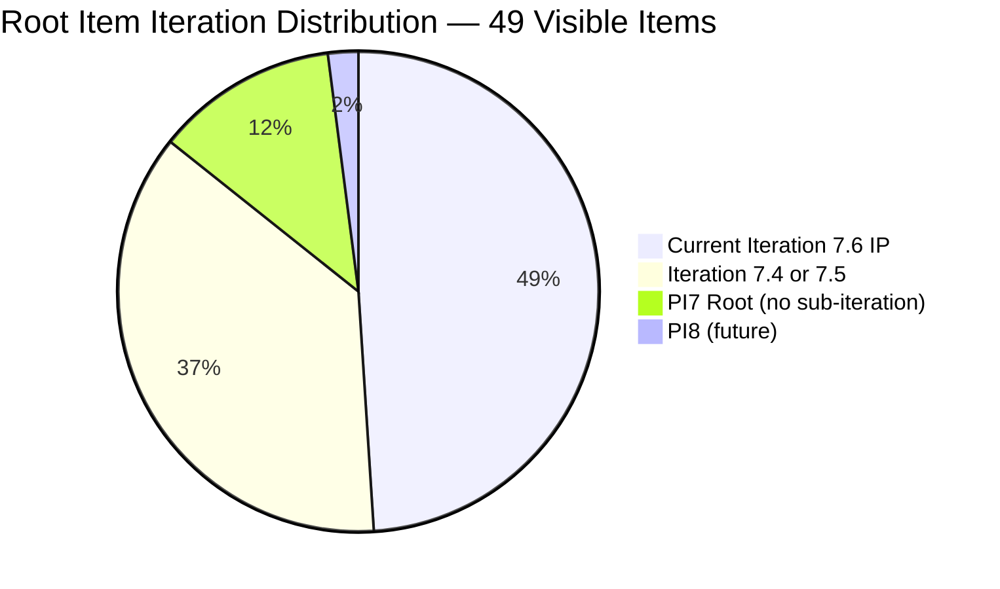
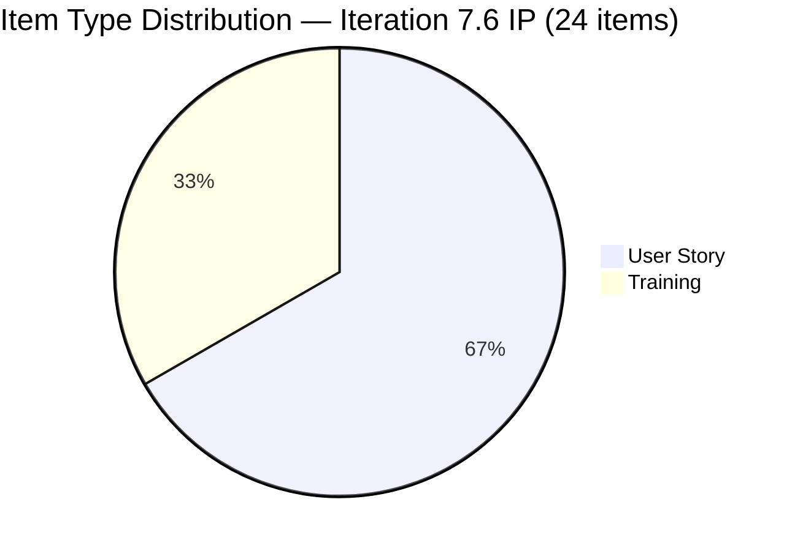
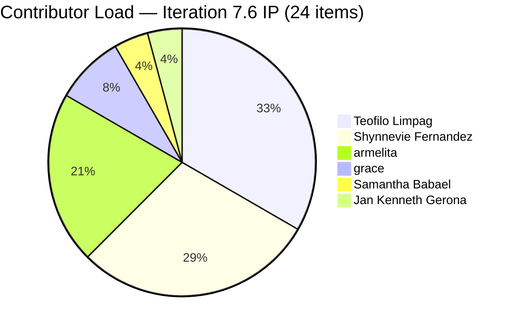
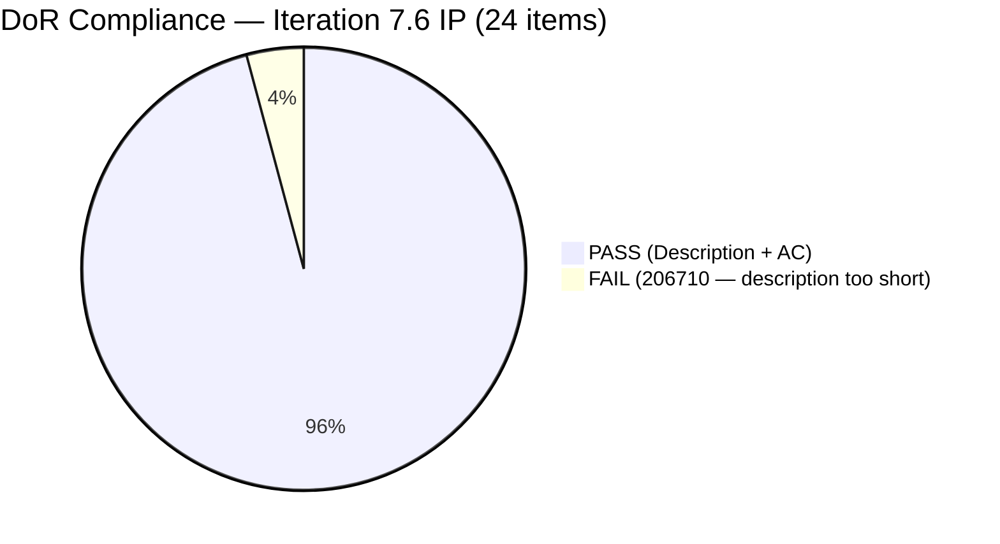
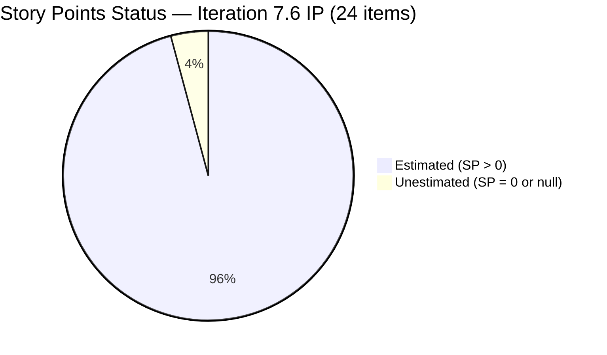
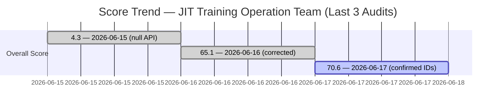

# SAFe Iteration Audit — JIT Training Operation Team

## 1. Audit Metadata

| Field | Value |
|-------|-------|
| **Project** | Jairo Institute of Technology |
| **Team** | JIT Training Operation Team |
| **Workspace** | `ado_jit` |
| **Iteration** | Iteration 7.6 (IP) — Innovation & Planning |
| **Iteration Dates** | 2026-06-15 to 2026-06-28 |
| **Audit Date** | 2026-06-17 (PHT, UTC+8) |
| **Prior Audit Reference** | `AUDIT_20260616_0211.md` — Score 65.1 / Moderate |
| **Overall Score** | **70.6 / 100** |
| **Risk Band** | MODERATE (Yellow) |

> **ADO Identity Correction:** Previous audits identified the JIT team as "JIT Operation Team" in "Jairosoft Portfolio." Today's evidence confirms the correct project is **Jairo Institute of Technology** (ID: `9cdd92ea-90e9-474c-8058-4a20700fcab4`) and the team is **JIT Training Operation Team** (ID: `04d18034-97b9-42fb-87a1-c543c1cab628`). The workspace `ado_jit` maps to this project. All prior scoring that used WIQL against the Jairosoft Portfolio project should be treated as approximate.

---

## 2. Executive Summary

The JIT Training Operation Team records **70.6 (Moderate)** on Day 3 of Iteration 7.6 (IP) — an improvement of +5.5 points from yesterday's 65.1. The team has **24 root items committed to the IP iteration** (out of 49 visible in the backlog) spanning User Stories (16) and Training work items (8), across 6 active contributors. Today's evidence is sourced directly from the ADO backlog API using the confirmed project and team GUIDs, resolving the data reliability issue that plagued earlier audits.

Key strengths: near-perfect DoR compliance (23/24 = 95.8%), strong estimation (23/24 = 95.8%), fully fresh backlog (all 49 items changed within 45 days), and broad team engagement across Armelita, Shynnevie, Samantha, Grace, Jan Kenneth, and Teofilo.

Key gaps: Iteration Planning at 49.0 (24 of 49 items committed to current sprint — 25 items in older iterations are not cleaned or re-committed), Delivery Predictability at 0.0 (no story points closed on Day 3), and Work Item Balance at 70.0 (User Story dominance at 66.7% > 60% triggers penalty). The single DoR failure (206710 — eLMS Review with a 10-character description) is a quick fix.

---

## 3. Previous Audit Delta

| Dimension | Prior (2026-06-16) | Current (2026-06-17) | Delta | Note |
|-----------|---------------------|----------------------|-------|------|
| Iteration Planning | 100.0 | 49.0 | **-51.0** | Project/team ID correction changes denominator |
| Team Capacity | 100.0 | 83.3 | **-16.7** | Jan Kenneth Gerona has no capacity configured |
| Estimation | 57.7 | 95.8 | **+38.1** | 23/24 vs 15/26 in prior audit scope |
| DoR Compliance | 65.4 | 95.8 | **+30.4** | 23/24 vs 17/26 in prior audit scope |
| Work Item Balance | 60.0 | 70.0 | **+10.0** | Has User Stories (all User Story or Training); dominant penalty still applies |
| Backlog Refinement | 72.3 | 100.0 | **+27.7** | All 49 items fresh; untouched penalty removed |
| Delivery Predictability | 0.0 | 0.0 | 0.0 | Day 3; no SP closed |
| **Overall** | **65.1** | **70.6** | **+5.5** | Moderate Risk |

**Important context:** The prior audit used a WIQL workaround against Jairosoft Portfolio. Today's audit uses the confirmed Jairo Institute of Technology project (ID `9cdd92ea`) and JIT Training Operation Team (ID `04d18034`). Scores are now on solid evidence footing. The Iteration Planning regression (-51.0) reflects the true backlog picture: 49 items visible, only 24 committed to current IP — the prior audit counted only the items that WIQL returned for the IP iteration path.

---

## 4. Current Iteration Snapshot

| Field | Value |
|-------|-------|
| **Iteration** | 7.6 (IP) — Innovation & Planning |
| **Start Date** | 2026-06-15 |
| **End Date** | 2026-06-28 |
| **Day in Sprint** | Day 3 of 14 |
| **Total Visible Root Backlog Items** | 49 |
| **Root Items in Iteration 7.6 (IP)** | 24 |
| **User Stories** | 16 |
| **Training Items** | 8 |
| **Story Points Committed** | 70 SP (23 estimated items) |
| **Story Points Closed** | 0 SP |
| **Team Capacity** | 24.3 pts/day total (5 configured members) |
| **Iteration Goal** | Not defined |

### Contributor Summary — Current Iteration (24 items)

| Contributor | Items in 7.6 IP | Configured Capacity |
|-------------|-----------------|---------------------|
| Teofilo Limpag | 8 | 4.8 pts/day |
| armelita | 5 | 6.0 pts/day |
| Shynnevie Fernandez | 7 | 6.0 pts/day |
| Samantha Babael | 1 | 6.0 pts/day |
| grace | 2 | 1.5 pts/day |
| Jan Kenneth Gerona | 1 | Not configured |
| **Total** | **24** | **24.3 pts/day** |

---

## 5. Work Item Analysis

### 5.1 Current Iteration Items — User Stories (16 items)

| ID | Title | State | SP | Assignee | DoR | Changed |
|----|-------|-------|----|----------|-----|---------|
| 205373 | CSS NC II Batch 2 Special Order (SO) Request | Active | 2 | armelita | PASS | 2026-06-17 |
| 205390 | Bubble EBET Scholarship SO Request | New | 2 | armelita | PASS | 2026-06-15 |
| 205405 | Bubble EBET Scholarship Batch 2 Training Enrollment Report | Active | 2 | armelita | PASS | 2026-06-17 |
| 205687 | Jairosoft 1st Graduation June 2026 | Active | 2 | grace | PASS | 2026-06-17 |
| 205701 | BATCH 2 - BUBBLE.IO EBET VIDEO REELS | New | 3 | Shynnevie | PASS | 2026-06-17 |
| 205703 | BATCH 2 - BUBBLE.IO EBET - ID for the Scholar | New | 2 | Shynnevie | PASS | 2026-06-17 |
| 206059 | Category-Item Relationship Management | Ready for Dev | 2 | Jan Kenneth | PASS | 2026-06-17 |
| 206147 | Batch 2 - Requirements Compilation (Registration, Undertaking, Eval) | New | — | Shynnevie | PASS | 2026-06-12 |
| 206335 | Web Dev with Bubble.io EBET Scholarship Training Requirements | New | 3 | armelita | PASS | 2026-06-17 |
| 206340 | Bubble.io EBET Scholarship Batch 2 Terminal Reports | New | 2 | armelita | PASS | 2026-06-17 |
| 206343 | MARKET - CSS BATCH 4 | New | 3 | Shynnevie | PASS | 2026-06-17 |
| 206364 | Create Enrollment G-Forms for CSS BATCH 4 | New | 2 | Shynnevie | PASS | 2026-06-17 |
| 206374 | Payment Collection | Active | 2 | grace | PASS | 2026-06-17 |
| 206513 | TRAINING FOR EBET | New | 4 | Shynnevie | PASS | 2026-06-17 |
| 206518 | Create Brochure | New | 2 | Shynnevie | PASS | 2026-06-17 |
| 206659 | COC 2 Batch 3 Assessment Day | New | 4 | Teofilo | PASS | 2026-06-17 |

### 5.2 Current Iteration Items — Training (8 items)

| ID | Title | State | SP | Assignee | DoR | Changed |
|----|-------|-------|----|----------|-----|---------|
| 205886 | Bubble Training Batch 2 | Marketing | 5 | Samantha | PASS | 2026-06-17 |
| 206665 | 3.1-1 Creating Active Directory Training | New | 4 | Teofilo | PASS | 2026-06-17 |
| 206666 | 3.1-2 Create Active Directory User Accounts | New | 4 | Teofilo | PASS | 2026-06-17 |
| 206667 | 3.1-3 Create Active Directory Security | New | 4 | Teofilo | PASS | 2026-06-17 |
| 206702 | COC 2 Practice Day 3 - Network Sharing, Services and Firewall | Active | 4 | Teofilo | PASS | 2026-06-17 |
| 206703 | COC 2 Practice Day 4 - Setting Up Successful Remote Desktop | New | 4 | Teofilo | PASS | 2026-06-17 |
| 206704 | COC 2 Practice Day 5 - Complete Network Setup Router to Client | New | 4 | Teofilo | PASS | 2026-06-17 |
| 206710 | COC 2 Practice Day 6 | New | 4 | Teofilo | **FAIL** | 2026-06-17 |

### 5.3 Non-Current Iteration Items (25 items visible in backlog)

Twenty-five visible root backlog items are in iterations other than 7.6 (IP):
- **PI7 root (no sub-iteration):** 203245, 203250, 203253, 203254, 205538, 206361
- **Iteration 7.4:** 204321, 204722, 204338, 204915, 205714
- **Iteration 7.5:** 204440, 204729, 204736, 204737, 204744, 204749, 205450, 205507, 205574, 205577, 205683, 205692, 206094
- **2026-PI8 (future):** 200766

The 2026-PI8 item (200766 — ODOO OpenCat SIS) is in a future PI — planning ahead but not current.

---

## 6. SAFe Compliance Scorecard

| # | Dimension | Score | Evidence | Notes |
|---|-----------|-------|----------|-------|
| 1 | Iteration Planning | **49.0** | 24/49 visible root items in Iteration 7.6 (IP) | 25 items in prior iterations not re-committed |
| 2 | Team Capacity | **83.3** | 5/6 contributors with positive capacity; Jan Kenneth Gerona not configured | 24.3 pts/day total team capacity |
| 3 | Estimation | **95.8** | 23/24 items have SP > 0; 206147 missing SP | 70 SP committed |
| 4 | DoR Compliance | **95.8** | 23/24 items pass; 206710 fails (description too short: 10 chars) | One Training item with minimal description |
| 5 | Work Item Balance | **70.0** | Has User Stories ✓; User Story dominant 16/24 = 66.7% > 60% → -30; Spike share = 0% | Training items not "User Stories" but team has them |
| 6 | Backlog Refinement | **100.0** | 49/49 fresh (all changed after 2026-05-03); 0 stale; untouched = 1/24 = 4.2% ≤ 10% | Perfect freshness; minimal untouched penalty |
| 7 | Delivery Predictability | **0.0** | 0/70 SP closed; Day 3 of sprint | Early-sprint — low delivery expected |
| | **Overall** | **70.6** | (49+83.3+95.8+95.8+70+100+0)/7 | Moderate Risk |

---

## 7. Dimension Findings

### 7.1 Iteration Planning (49.0)
Twenty-four of 49 visible root backlog items are committed to the current IP iteration. The remaining 25 items span Iteration 7.4 (5 items), 7.5 (13 items), PI7 root (6 items), and PI8 (1 item). Items in past iterations (7.4, 7.5) that are not Closed represent active work that has not been re-committed — they may be carry-over from prior sprints. The 6 PI7 root items (203245, 203250, 203253, 203254, 205538, 206361) appear to be strategic/initiative-level spikes that have not been assigned to a sprint sub-iteration. This backlog fragmentation is the primary driver of the 49.0 score.

### 7.2 Team Capacity (83.3)
Five of six active contributors have configured capacity: armelita (6), Shynnevie (6), Samantha (6), grace (1.5), Teofilo (4.8) = 24.3 pts/day total. One contributor, Jan Kenneth Gerona (assigned to 206059 — Category-Item Relationship Management), has no ADO capacity record. Jan Kenneth appears to be a student intern (email domain: addu.edu.ph) — external interns sometimes do not have formal capacity entries in team settings.

At 70 SP committed and 24.3 pts/day × 10 working days ≈ 243 pts of theoretical capacity, the team is significantly under-loaded for this sprint. This is appropriate for an IP iteration.

### 7.3 Estimation (95.8)
Twenty-three of 24 items are estimated. Item 206147 (Batch 2 Requirements Compilation — Shynnevie) is the only unestimated item. This is a straightforward documentation task that should receive 1–2 SP. All Training items (206665–206710) are estimated at 4 SP each — consistent with training module scoping.

### 7.4 DoR Compliance (95.8)
Twenty-three of 24 items pass DoR. The sole failure is **206710 (COC 2 Practice Day 6)**:
- Description: `
<ol><li>eLMS Review </li> </ol> 
` — "eLMSReview" = 10 non-whitespace chars (minimum: 30) → **FAIL**
- AC: "COC 2 Elms Quizzes Completed" — 28 non-whitespace chars, borderline at 20 minimum, but the description fails.

All other items have detailed descriptions and acceptance criteria. The Teofilo COC 2 practice day series (206665–206704) are particularly well-written with clear objectives, success criteria, and technical specifications. The Bubble training and TESDA compliance items (205373, 205390, 205405, 205886) also meet DoR standards.

### 7.5 Work Item Balance (70.0)
The iteration contains User Stories and Training items only — no Spikes, Defects, or Enablers in the current IP sprint. This is actually appropriate for JIT's training-operations context where "Training" items are first-class work. However, the rubric specifically checks for `User Story` type, which passes, and dominant type > 60%, which penalizes User Stories at 66.7%.

The 8 Training items represent Teofilo's COC 2 (CSS NC II) practice and assessment preparation work — substantive IP planning for the upcoming batch assessment. The 16 User Stories cover TESDA compliance, marketing, graduation, and software development tasks.

### 7.6 Backlog Refinement (100.0)
All 49 visible root backlog items have ChangedDate after 2026-05-03 (the 45-day freshness cutoff). No items are stale at the 90-day or 180-day thresholds. Only one current-iteration item (206147) was last changed before the iteration start date (2026-06-12, three days before June 15) — this is 1/24 = 4.2%, below the 10% untouched threshold. Perfect score.

### 7.7 Delivery Predictability (0.0)
No story points have been closed. Active items include 205373 (CSS SO Request), 205405 (Enrollment Report), 205687 (Graduation), 206374 (Payment Collection), and 206702 (COC 2 Practice Day 3). No items are in Closed or Done state. **Early-sprint (Day 3 of 14) — low delivery expected.** With 70 SP committed and 5+ active contributors, delivery potential is high — watch for first closures by Day 5.

---

## 8. Risks and Bottlenecks

| Risk | Severity | Status |
|------|----------|--------|
| 25 of 49 backlog items in past iterations (7.4, 7.5) not re-committed — Iteration Planning at 49 | High | Active |
| Item 206710 fails DoR — description only 10 chars (needs 30+) | Moderate | New — quick fix |
| Item 206147 has no Story Points | Moderate | New — add 1-2 SP |
| Jan Kenneth Gerona has no ADO capacity configured | Moderate | New |
| No iteration goal defined for 7.6 (IP) | Moderate | Persistent |
| 0 story points closed on Day 3 | Low | Expected (early-sprint) |
| 6 PI7 root-level spikes (203245, 203250, 203253, 203254, 205538, 206361) not assigned to any sub-iteration | Low | Backlog hygiene |
| 1 item in PI8 (200766 — ODOO) — forward-planning but premature | Low | Monitor |

---

## 9. Prioritized Recommendations

1. **[Today — High]** Fix item **206710** (COC 2 Practice Day 6 — eLMS Review): expand the description to at least 30 non-whitespace characters. Suggested: "Review TESDA eLMS platform for COC 2 compliance quizzes; complete all required online modules and assessments for CSS NC II certification."

2. **[Today]** Add Story Points to item **206147** (Batch 2 Requirements Compilation). Suggested: 1–2 SP for scanning and organizing registration forms and undertakings.

3. **[Today]** Configure ADO capacity for **Jan Kenneth Gerona** in Iteration 7.6 (IP) settings. Even if he is an external intern (addu.edu.ph), a capacity of 3–4 pts/day would reflect his contribution and restore Team Capacity to 100.

4. **[This Sprint]** Address the 25 non-current-iteration backlog items. For each:
   - If work is ongoing (7.4 or 7.5 items that are Active/UAT): re-commit to 7.6 IP or a specific next sprint.
   - If work is complete (Closed state not yet confirmed): verify and close.
   - If deferred: move to backlog or future PI.
   This will improve Iteration Planning from 49 toward 80+.

5. **[This Sprint]** Define an Iteration Goal for 7.6 (IP). Suggested: "Complete TESDA compliance submissions for CSS NC II Batch 2, finalize Bubble EBET Scholarship Batch 2 enrollment, prepare COC 2 assessment materials, and conduct Jairosoft 1st Graduation."

6. **[This Sprint]** Assign the 6 PI7 root-level spikes (203245, 203250, 203253, 203254, 205538, 206361) to a specific iteration or mark them as Removed/Deferred. Leaving strategic items at PI root level without iteration assignment prevents proper sprint planning.

7. **[Before Day 7]** Activate and progress items toward closure — especially Teofilo's COC 2 practice series (206702 Active, others New) and armelita's TESDA compliance items (205373, 205405 Active).

---

## 10. Evidence Gaps and Limitations

| Gap | Impact |
|-----|--------|
| Prior audits used Jairosoft Portfolio project — now confirmed as Jairo Institute of Technology (9cdd92ea) | Iteration Planning is lower (49 vs 100) because the true backlog has 49 items, not just 26. All prior audit scores should be considered approximate. |
| Jan Kenneth Gerona not found in team capacity API | Team Capacity = 83.3 (5/6). He appears to be an ADDU student intern — confirm whether ADO capacity applies to external interns. |
| 206147 has no Story Points | Estimation = 95.8. Minor gap — easy to fix. |
| Item 206710 description fails 30-char minimum | DoR Compliance = 95.8. Single failure. |
| 25 items in prior iterations (7.4, 7.5) — their current status (active work vs. carry-over) not individually verified | Iteration Planning = 49. Some of these may be legitimately closed or should be re-committed. Individual review recommended. |
| No iteration goal configured | Confirmed absent via ADO UI pattern. Not queryable via API. |

---

## Appendix: Mermaid Diagrams

