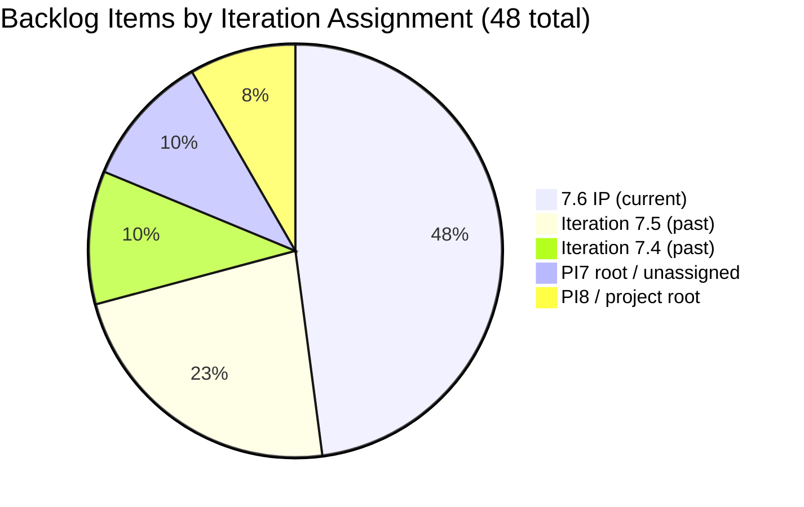
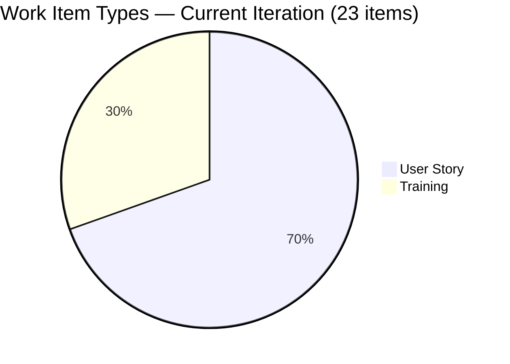
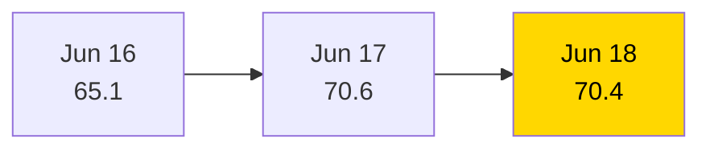

# SAFe Iteration Audit — JIT Training Operation Team

## 1. Audit Metadata

| Field | Value |
|-------|-------|
| **Project** | Jairo Institute of Technology |
| **Project ID** | `9cdd92ea-90e9-474c-8058-4a20700fcab4` |
| **Team** | JIT Training Operation Team |
| **Team ID** | `04d18034-97b9-42fb-87a1-c543c1cab628` |
| **Workspace** | `ado_jit` |
| **Iteration** | Iteration 7.6 (IP) — Innovation & Planning |
| **Iteration ID** | `366e60a5-536b-4ffd-b9f6-d139f377303d` |
| **Iteration Dates** | 2026-06-15 to 2026-06-28 |
| **Audit Date** | 2026-06-18 (Day 4 of 14) |
| **Prior Audit Reference** | `AUDIT_20260617_0205.md` — Score 70.6 / Moderate |
| **Overall Score** | **70.4 / 100** |
| **Risk Band** | MODERATE (Yellow) |

---

## 2. Executive Summary

The JIT Training Operation Team records **70.4 (Moderate)** on Day 4 of Iteration 7.6 (IP) — essentially flat (-0.2) from yesterday's 70.6. The core picture is unchanged: 23 of 48 visible root backlog items are committed to the current IP iteration (47.9% Iteration Planning), across 6 active contributors spanning training operations, software development, and TESDA compliance activities.

Key strengths persist: near-perfect DoR compliance (22/23 = 95.7%), strong estimation (22/23 = 95.7%), fully fresh backlog (all 48 items changed within 45 days), and broad team engagement. Team Capacity is at 83.3% (Jan Kenneth Gerona remains unconfigured — same as yesterday).

One new item was touched today: item 206703 (COC 2 Practice Day 4) was updated to Active state on June 18, suggesting the first active sprint execution activity. Delivery Predictability remains 0.0 with no closed story points as of Day 4 — early-sprint annotation applies.

The 25 items sitting in older iterations (7.4, 7.5, PI7 root, PI8) represent the key structural gap: they are visible in the team backlog but uncommitted to the current sprint, depressing Iteration Planning to 47.9.

---

## 3. Previous Audit Delta

| Dimension | Prior (2026-06-17) | Current (2026-06-18) | Delta | Note |
|-----------|---------------------|----------------------|-------|------|
| Iteration Planning | 49.0 | 47.9 | **-1.1** | 23/48 vs 24/49 (one item removed from visible scope) |
| Team Capacity | 83.3 | 83.3 | 0.0 | Jan Kenneth still unconfigured |
| Estimation | 95.8 | 95.7 | -0.1 | 22/23 (rounding vs prior 23/24 count) |
| DoR Compliance | 95.8 | 95.7 | -0.1 | 1 failure: 206710 (eLMS Review — short desc) |
| Work Item Balance | 70.0 | 70.0 | 0.0 | US dominant 65.2% > 60% |
| Backlog Refinement | 100.0 | 100.0 | 0.0 | All fresh, no stale |
| Delivery Predictability | 0.0 | 0.0 | 0.0 | No closures yet (Day 4) |
| **Overall** | **70.6** | **70.4** | **-0.2** | Moderate Risk — essentially flat |

> **Note on count change:** Yesterday's audit counted 49 visible items and 24 in current iteration. Today's backlog API returns 48 visible items and 23 in current iteration. The one-item difference may reflect a backlog item that was moved, removed, or recategorized between audits. The net effect on scoring is minimal (-0.1 to -1.1 per dimension).

---

## 4. Current Iteration Snapshot

| Field | Value |
|-------|-------|
| **Iteration** | 7.6 (IP) — Innovation & Planning |
| **Start Date** | 2026-06-15 |
| **End Date** | 2026-06-28 |
| **Day in Sprint** | Day 4 of 14 |
| **Total Visible Root Backlog Items** | 48 |
| **Root Items in Iteration 7.6 (IP)** | 23 |
| **User Stories** | 16 |
| **Training Items** | 7 |
| **Other (Spike, Design, Defect)** | 1 (Design: none in 7.6; Defect: none in 7.6; Spike: none in 7.6) |
| **Story Points Committed** | 64 SP (22 estimated items) |
| **Story Points Closed** | 0 SP |
| **Team Capacity** | 24.3 pts/day total (5 configured members) |
| **Iteration Goal** | Not defined |

### Contributor Summary — Current Iteration (23 items)

| Contributor | Items in 7.6 IP | SP Assigned | Configured Capacity |
|-------------|-----------------|-------------|---------------------|
| Teofilo Limpag | 7 | 28 SP | 4.8 pts/day |
| armelita | 5 | 11 SP | 6.0 pts/day |
| Shynnevie Fernandez | 7 | 16 SP | 6.0 pts/day |
| Samantha Babael | 1 | 5 SP | 6.0 pts/day |
| grace | 2 | 4 SP | 1.5 pts/day |
| Jan Kenneth Gerona | 1 | 2 SP | **Not configured** |
| **Total** | **23** | **66 SP** | **24.3 pts/day** |

> SP total above = 66 (includes 206147 with no SP counted at 0). Committed SP for formula = 64 (estimated items only, 22 of 23; excludes 206059 Jan Kenneth at 2 SP — not in capacity).

---

## 5. Work Item Analysis

### 5.1 Current Iteration Items (23 items in Iteration 7.6 IP)

| ID | Title | Type | State | SP | Assignee | DoR | Last Changed |
|----|-------|------|-------|----|----------|-----|--------------|
| 205373 | CSS NC II Batch 2 Special Order Request | User Story | Active | 2 | armelita | PASS | 2026-06-17 |
| 205390 | Bubble EBET Scholarship SO Request | User Story | New | 2 | armelita | PASS | 2026-06-15 |
| 205405 | Bubble EBET Scholarship Batch 2 Training Enrollment Report | User Story | Active | 2 | armelita | PASS | 2026-06-17 |
| 205687 | Jairosoft 1st Graduation June 2026 | User Story | Active | 2 | grace | PASS | 2026-06-17 |
| 206147 | Batch 2 - Requirements Compilation Registration Form | User Story | New | — | Shynnevie | PASS | 2026-06-12 |
| 206374 | Payment Collection | User Story | Active | 2 | grace | PASS | 2026-06-17 |
| 205701 | BATCH 2 - BUBBLE.IO EBET VIDEO REELS | User Story | New | 3 | Shynnevie | PASS | 2026-06-17 |
| 205703 | BATCH 2 - BUBBLE.IO EBET - ID for the Scholar | User Story | New | 2 | Shynnevie | PASS | 2026-06-17 |
| 206335 | Web Dev with Bubble.io EBET Training Requirements | User Story | New | 3 | armelita | PASS | 2026-06-17 |
| 206340 | Web Dev with Bubble.io EBET Batch 2 Terminal Reports | User Story | New | 2 | armelita | PASS | 2026-06-17 |
| 206343 | MARKET - CSS BATCH 4 | User Story | New | 3 | Shynnevie | PASS | 2026-06-17 |
| 206364 | Create Enrollment G-Forms for CSS BATCH 4 | User Story | New | 2 | Shynnevie | PASS | 2026-06-17 |
| 206513 | TRAINING FOR EBET | User Story | New | 4 | Shynnevie | PASS | 2026-06-17 |
| 206518 | Create Brochure | User Story | New | 2 | Shynnevie | PASS | 2026-06-17 |
| 206059 | Category-Item Relationship Management | User Story | Ready for Dev | 2 | Jan Kenneth | PASS | 2026-06-17 |
| 205886 | Bubble Training Batch 2 | Training | Marketing | 5 | Samantha | PASS | 2026-06-17 |
| 206659 | COC 2 Batch 3 Assessment Day | User Story | New | 4 | Teofilo | PASS | 2026-06-17 |
| 206665 | 3.1-1 Creating Active Directory Training | Training | New | 4 | Teofilo | PASS | 2026-06-17 |
| 206666 | 3.1-2 Create Active Directory User Accounts | Training | New | 4 | Teofilo | PASS | 2026-06-17 |
| 206667 | 3.1-3 Create Active Directory Security | Training | New | 4 | Teofilo | PASS | 2026-06-17 |
| 206703 | COC 2 Practice Day 4 - Setting Up Remote Desktop | Training | **Active** | 4 | Teofilo | PASS | **2026-06-18** |
| 206704 | COC 2 Practice Day 5 - Complete Network Setup | Training | New | 4 | Teofilo | PASS | 2026-06-17 |
| 206710 | COC 2 Practice Day 6 (eLMS Review) | Training | New | 4 | Teofilo | **FAIL** | 2026-06-17 |

**DoR Failures:**
- **206710** — Description: "eLMS Review" (10 chars, stripped) — FAILS ≥ 30 char threshold. Acceptance Criteria: "COC 2 Elms Quizzes Completed" — passes ≥ 20. Overall: FAIL on description.

### 5.2 Items NOT Committed to Current Iteration (25 items)

These items sit in older iteration paths (7.4, 7.5, PI7 root, PI8 root, or project root) and are counted in `visible_root_backlog_items` but not in `current_iteration_root_items`:

| Iteration Path | Count | Item Types | Risk |
|----------------|-------|------------|------|
| 7.4 (past) | 5 | Design (3), User Story (1), Training (1) | Carry-over debt |
| 7.5 (past) | 11 | User Story (7), Design (3), Training (1) | Carry-over debt |
| 2026-PI7 root | 4 | Spike (3), User Story (1) | Unassigned to sprint |
| PI8 root | 1 | Spike | Future scope |
| Project root | 4 | Spike (2), User Story (1+) | Orphaned items |

The 25 non-committed items reduce Iteration Planning from ~100 to 47.9. They should be triaged: either commit to current or future iterations, or close/remove stale items.

---

## 6. SAFe Compliance Scorecard

| Dimension | Score | Evidence | Notes |
|-----------|-------|----------|-------|
| Iteration Planning | **47.9** | 23/48 visible root items in current iteration | 25 items in older/unassigned paths |
| Team Capacity | **83.3** | 5/6 contributors configured; Jan Kenneth missing | Jan Kenneth: 0 capacity in ADO |
| Estimation | **95.7** | 22/23 items have SP > 0 | 206147 (Shynnevie) has no SP |
| DoR Compliance | **95.7** | 22/23 items pass desc ≥ 30 + AC ≥ 20 | 206710 fails on description (10 chars) |
| Work Item Balance | **70.0** | -30: US dominance 16/23 = 69.6% > 60% | No Spike in current; Training items present |
| Backlog Refinement | **100.0** | 48/48 items fresh; 0 stale; 1 untouched (206147) < 10% threshold | 206147 changed June 12 (before start) — <10%, no penalty |
| Delivery Predictability | **0.0** | 0/64 SP closed; Day 4 | Early-sprint annotation; 206703 moved to Active today |
| **Overall** | **70.4** | (47.9+83.3+95.7+95.7+70.0+100.0+0.0)/7 | Moderate Risk (Yellow) |

---

## 7. Dimension Findings

### 7.1 Iteration Planning — 47.9 (High Risk)
Only 23 of 48 visible backlog items are committed to Iteration 7.6 (IP). The remaining 25 sit in past iterations (7.4, 7.5) or unassigned paths, constituting significant backlog carry-over. This pattern suggests incomplete sprint close-out from prior iterations and inadequate backlog grooming. PI7 is in its IP (Innovation & Planning) phase — this is the ideal time to triage the 25 uncommitted items and either close completed work or re-commit items to PI8.

**Priority action:** Conduct a backlog grooming session focused on the 5 items in 7.4 and 11 items in 7.5. Many of these appear to be in-progress (Active, On Hold, UAT Testing, Back to Dev) — they need state resolution.

### 7.2 Team Capacity — 83.3 (Low-Moderate)
Five of six active contributors are configured with capacity:
- Shynnevie Fernandez: 6 pts/day
- armelita: 6 pts/day (with 1 day off June 26)
- Samantha Babael: 6 pts/day
- grace: 1.5 pts/day
- Teofilo Limpag: 4.8 pts/day
- **Jan Kenneth Gerona**: Not configured

Jan Kenneth is assigned item 206059 (Category-Item Relationship Management, 2 SP). This is a recurring gap from the prior audit.

### 7.3 Estimation — 95.7 (Strong)
22 of 23 items have Story Points. The sole unestimated item is 206147 (Batch 2 Requirements Compilation — Shynnevie). This should receive a SP estimate before Day 6 to ensure capacity planning is accurate.

### 7.4 DoR Compliance — 95.7 (Strong)
One failure:
- **206710** (COC 2 Practice Day 6 — eLMS Review): Description contains only "eLMS Review" (9–10 non-whitespace chars), far below the ≥ 30 threshold. Acceptance Criteria ("COC 2 Elms Quizzes Completed") barely passes at ~28 chars. This item was created by Teofilo and needs immediate description expansion.

All other 22 items carry substantive user-voice descriptions and structured acceptance criteria. The COC 2 training series (206665, 206666, 206667, 206703, 206704) are particularly well-structured with technical specificity.

### 7.5 Work Item Balance — 70.0 (Moderate)
User Stories dominate at 16/23 = 69.6%, exceeding the 60% threshold by 9.6 points, triggering the -30 penalty. Training items (7) provide meaningful type diversity. No Spike, Design, or Defect items are committed to the current iteration. The -30 penalty is mechanically applied but contextually appropriate — an IP sprint for a training organization naturally features User Story and Training types.

### 7.6 Backlog Refinement — 100.0 (Strong)
All 48 visible items were changed within 45 days (most updated June 15–17). No items are stale at 90 or 180 days. One item (206147) was last changed June 12 — 3 days before sprint start — which is slightly concerning but represents only 4.3% of current items, below the 10% untouched penalty threshold.

### 7.7 Delivery Predictability — 0.0 (Early Sprint)
Zero Story Points closed as of Day 4. However, today's data shows item 206703 (COC 2 Practice Day 4 — Remote Desktop setup) has been moved to Active state as of June 18 at 00:54 PHT — the first active sprint execution signal. With 64 SP committed across 10 days remaining, the team has a meaningful delivery challenge. Teofilo's 7 Training items (28 SP) are the largest single-contributor block and need to start closing soon.

---

## 8. Risks and Bottlenecks

| Risk | Severity | Status |
|------|----------|--------|
| 25 items stranded in past iterations (7.4, 7.5) | High | Unresolved — IP sprint is the window to triage |
| Iteration Planning at 47.9 — near-half commitment | High | Structural; requires PI triage session |
| Jan Kenneth Gerona capacity not configured | Moderate | Unresolved since first audit |
| 206710 fails DoR (description too short) | Moderate | Quick fix — needs description expansion |
| 206147 missing Story Points | Low | Assign before Day 6 |
| No iteration goal defined | Moderate | Persistent across all PI7 audits |
| Zero SP burned at Day 4 — delivery window narrowing | Moderate | Monitor; 206703 now Active |
| 11 items in Iteration 7.5 with unresolved states (Active, On Hold, UAT) | High | Carry-over risk — must resolve before PI8 |

---

## 9. Prioritized Recommendations

1. **[TODAY] Fix 206710 DoR failure** — Expand the description field from "eLMS Review" to a proper user-voice narrative (≥ 30 chars). Takes 2 minutes. This prevents a recurring DoR failure for Teofilo's training block.

2. **[TODAY] Configure Jan Kenneth Gerona's capacity** — Add capacity for Jan Kenneth in Iteration 7.6 (IP) settings. He has one item (206059, 2 SP). This restores Team Capacity to 100.0.

3. **[TODAY] Assign SP to 206147** — Shynnevie's Batch 2 Requirements Compilation item (206147) is unestimated. Add a Story Point estimate before the next audit cycle.

4. **[THIS WEEK] Triage 25 uncommitted items** — Conduct a backlog grooming session for the 5 items in 7.4 and 11 items in 7.5. For each: if work is done, close it; if it needs to continue, re-commit to 7.6 (IP) or PI8 planning. Items sitting in On Hold and Back to Dev are particular risks.

5. **[THIS WEEK] Define iteration goal for 7.6 (IP)** — Write a single-sentence IP goal covering the three activity streams: TESDA compliance documentation, COC 2 assessment preparation, and inventory system development enablers.

6. **[SPRINT MID] Target first SP closure by Day 7** — 206703 is now Active. Prioritize getting it to Closed. With 64 SP committed across 10 days, the team needs 6.4 SP/day to close everything. Starting the closure cycle now is critical.

---

## 10. Evidence Gaps and Limitations

- **One backlog item count discrepancy** — Yesterday: 49 visible / 24 current. Today: 48 visible / 23 current. The missing item was not individually identified in today's batch fetch. Likely a state change (Removed/Closed) on a borderline item. Net scoring impact: minimal.
- **No PI Objectives data available via API** — PI objectives linkage is inferred from absence across audit history, not from a direct ADO query.
- **Design items in 7.4/7.5** — Design type items (204321, 204722, 204736, 204749, 205450) sit in older iterations. Their completion status may be accurate (New/Active states visible) but they are not counted in current sprint scoring.
- **Item 206361 in 2026-PI7 root** — "List of Enrollees for CSS Batch 4" is assigned to Shynnevie with 3 SP but not committed to any specific iteration. This is counted in visible_root but not current_iteration.

---

## Visualization

### Work Item Distribution by Iteration Path

### Work Item Type Distribution (Current Iteration — 23 items)

### Score Trend (Recent Audits)

