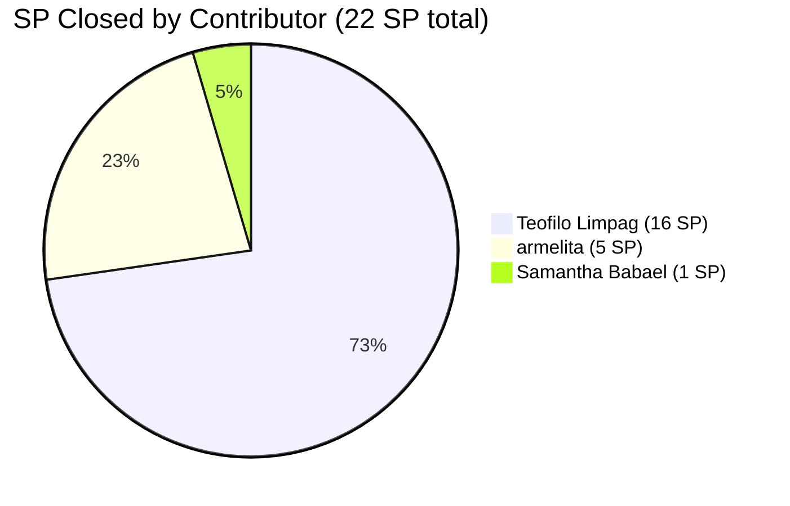
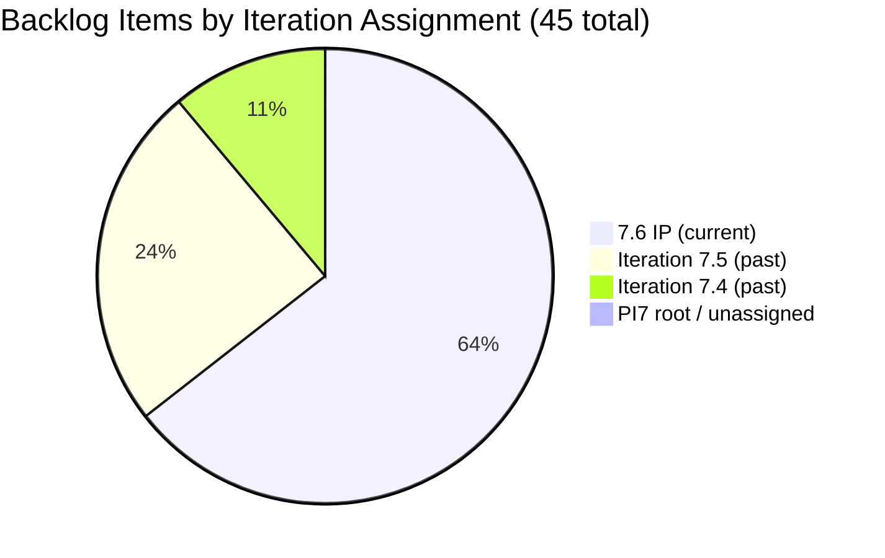
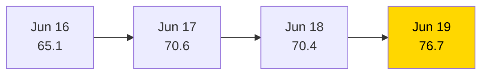

# SAFe Iteration Audit — JIT Training Operation Team

## 1. Audit Metadata

| Field | Value |
|-------|-------|
| **Project** | Jairo Institute of Technology |
| **Project ID** | `9cdd92ea-90e9-474c-8058-4a20700fcab4` |
| **Team** | JIT Training Operation Team |
| **Team ID** | `04d18034-97b9-42fb-87a1-c543c1cab628` |
| **Workspace** | `ado_jit` |
| **Iteration** | Iteration 7.6 (IP) — Innovation & Planning |
| **Iteration ID** | `366e60a5-536b-4ffd-b9f6-d139f377303d` |
| **Iteration Dates** | 2026-06-15 to 2026-06-28 |
| **Audit Date** | 2026-06-19 (Day 5 of 14) |
| **Prior Audit Reference** | `AUDIT_20260618_0204.md` — Score 70.4 / Moderate |
| **Overall Score** | **76.7 / 100** |
| **Risk Band** | MODERATE (Yellow) |

---

## 2. Executive Summary

The JIT Training Operation Team posts **76.7 (Moderate)** on Day 5 of Iteration 7.6 (IP) — a meaningful improvement of **+6.3** from yesterday's 70.4. The driving factor is a strong delivery burst: **22 SP have been closed** across 8 items, lifting Delivery Predictability from 0.0 to 26.2. Teofilo Limpag's COC 2 Practice Day series saw four Training items close (Practice Days 1, 2, 3, and 4 — 4 SP each = 16 SP), and armelita closed three User Stories (205330, 205403, 205411), while Samantha Babael closed 206187. The COC 2 practice training module is actively in execution.

The backlog reduced from 48 to 45 items. Item 205687 (Jairosoft 1st Graduation) moved to PI8 iteration path, indicating a re-commitment to the next PI — appropriate IP sprint triage behavior. Item 205692 (EBET Batch 2 ITP Preparation) remains in Iteration 7.5 with no state change.

Structural gaps persist: Jan Kenneth Gerona remains unconfigured (Team Capacity 83.3), item 206710 still fails DoR (description too short), and item 206147 remains unestimated. The 22 items stranded in older iteration paths (7.4, 7.5, unassigned) continue to depress Iteration Planning to 64.4.

---

## 3. Previous Audit Delta

| Dimension | Prior (2026-06-18) | Current (2026-06-19) | Delta | Note |
|-----------|---------------------|----------------------|-------|------|
| Iteration Planning | 47.9 | 64.4 | **+16.5** | 29/45 vs 23/48 — backlog shrank 3 items, more in-iteration |
| Team Capacity | 83.3 | 83.3 | 0.0 | Jan Kenneth still unconfigured |
| Estimation | 95.7 | 96.6 | +0.9 | 28/29 — count change due to PI8/7.5 item exclusions |
| DoR Compliance | 95.7 | 96.6 | +0.9 | 28/29 — 206710 still fails, same root item |
| Work Item Balance | 70.0 | 70.0 | 0.0 | US dominance 19/29 = 65.5% > 60% |
| Backlog Refinement | 100.0 | 100.0 | 0.0 | All 45 items fresh; no stale |
| Delivery Predictability | 0.0 | 26.2 | **+26.2** | 22/84 SP closed — 8 items closed today |
| **Overall** | **70.4** | **76.7** | **+6.3** | Moderate Risk — meaningful improvement |

**Key improvements today:**
- **Teofilo closes COC 2 Practice Days 1–4** (206700, 206701, 206702, 206703) — 16 SP of Training items delivered.
- **206703 (Practice Day 4 — Remote Desktop)** confirmed Closed as of 2026-06-19 (was Active yesterday).
- **armelita closes 3 User Stories**: 205330 CSS Batch 2 Terminal Report (2 SP), 205403 Bubble EBET TIP (2 SP), 205411 NEMSU Interview (1 SP).
- **Samantha closes 206187** (Assist in NEMSU Interns Onboarding, 1 SP).
- **205687 re-committed to PI8** — appropriate triage during IP sprint.

**Persistent gaps:**
- 206710 DoR failure (description = "eLMS Review" — still < 30 chars).
- 206147 unestimated (Shynnevie Fernandez, no SP).
- Jan Kenneth Gerona capacity not configured.
- No iteration goal defined.
- 22 items in older/unassigned iteration paths.

---

## 4. Current Iteration Snapshot

| Field | Value |
|-------|-------|
| **Iteration** | 7.6 (IP) — Innovation & Planning |
| **Start Date** | 2026-06-15 |
| **End Date** | 2026-06-28 |
| **Day in Sprint** | Day 5 of 14 |
| **Total Visible Root Backlog Items** | 45 |
| **Root Items in Iteration 7.6 (IP)** | 29 |
| **User Stories** | 19 |
| **Training Items** | 10 |
| **Story Points Committed** | 84 SP (28 estimated; 206147 = 0 SP) |
| **Story Points Closed** | 22 SP |
| **Team Capacity** | 24.3 pts/day total (5 configured members) |
| **Iteration Goal** | Not defined |
| **Items Closed Today** | 4 (206700, 206701, 206702, 206703 — COC 2 Practice Day series) |

### Contributor Summary — Current Iteration (29 items)

| Contributor | Items in 7.6 IP | SP Assigned | SP Closed | Configured Capacity |
|-------------|-----------------|-------------|-----------|---------------------|
| Teofilo Limpag | 10 | 40 SP | 16 SP | 4.8 pts/day |
| armelita | 7 | 13 SP | 5 SP | 6.0 pts/day |
| Shynnevie Fernandez | 7 | 16 SP | 0 SP | 6.0 pts/day |
| Samantha Babael | 2 | 6 SP | 1 SP | 6.0 pts/day |
| grace | 2 | 4 SP | 0 SP | 1.5 pts/day |
| Jan Kenneth Gerona | 1 | 2 SP | 0 SP | **Not configured** |
| **Total** | **29** | **81 SP** | **22 SP** | **24.3 pts/day** |

> Note: committed_SP for Delivery Predictability formula = 84 (includes 206147 at 0 SP excluded from estimated items count; sum of estimated items only).

---

## 5. Work Item Analysis

### 5.1 Closed Items (8 items, 22 SP)

| ID | Title | Type | State | SP | Assignee | Closed |
|----|-------|------|-------|----|----------|--------|
| 205330 | CSS Batch 2 Terminal Report | User Story | Closed | 2 | armelita | 2026-06-17 |
| 205403 | Bubble EBET Scholarship Batch 2 TIP | User Story | Closed | 2 | armelita | 2026-06-17 |
| 205411 | NEMSU Interview and Onboarding | User Story | Closed | 1 | armelita | 2026-06-16 |
| 206187 | Assist in NEMSU Interns Onboarding | User Story | Closed | 1 | Samantha | 2026-06-16 |
| 206700 | CSS COC 2 Practice Day 1 - Network Cabling | Training | Closed | 4 | Teofilo | 2026-06-17 |
| 206701 | COC 2 Practice Day 2 - Router and Access Points | Training | Closed | 4 | Teofilo | 2026-06-17 |
| 206702 | COC 2 Practice Day 3 - Network Sharing & Firewall | Training | Closed | 4 | Teofilo | 2026-06-18 |
| 206703 | COC 2 Practice Day 4 - Remote Desktop | Training | Closed | 4 | Teofilo | **2026-06-19** |

### 5.2 Open Items in Current Iteration (21 items)

| ID | Title | Type | State | SP | Assignee | DoR | Last Changed |
|----|-------|------|-------|----|----------|-----|--------------|
| 205373 | CSS NC II Batch 2 Special Order Request | User Story | Active | 2 | armelita | PASS | 2026-06-17 |
| 205390 | Bubble EBET Scholarship SO Request | User Story | New | 2 | armelita | PASS | 2026-06-15 |
| 205405 | Bubble EBET Scholarship Batch 2 Training Enrollment Report | User Story | Active | 2 | armelita | PASS | 2026-06-17 |
| 206374 | Payment Collection | User Story | Active | 2 | grace | PASS | 2026-06-17 |
| 206147 | Batch 2 - Requirements Compilation Registration Form | User Story | New | — | Shynnevie | PASS | 2026-06-12 |
| 205701 | BATCH 2 - BUBBLE.IO EBET VIDEO REELS | User Story | New | 3 | Shynnevie | PASS | 2026-06-17 |
| 205703 | BATCH 2 - BUBBLE.IO EBET - ID for the Scholar | User Story | New | 2 | Shynnevie | PASS | 2026-06-17 |
| 206335 | Web Dev with Bubble.io EBET Training Requirements | User Story | New | 3 | armelita | PASS | 2026-06-17 |
| 206340 | Web Dev with Bubble.io EBET Batch 2 Terminal Reports | User Story | New | 2 | armelita | PASS | 2026-06-17 |
| 206343 | MARKET - CSS BATCH 4 | User Story | New | 3 | Shynnevie | PASS | 2026-06-17 |
| 206364 | Create Enrollment G-Forms for CSS BATCH 4 | User Story | New | 2 | Shynnevie | PASS | 2026-06-17 |
| 206513 | TRAINING FOR EBET | User Story | New | 4 | Shynnevie | PASS | 2026-06-17 |
| 206518 | Create Brochure | User Story | New | 2 | Shynnevie | PASS | 2026-06-17 |
| 206059 | Category-Item Relationship Management | User Story | Ready for Dev | 2 | Jan Kenneth | PASS | 2026-06-17 |
| 205886 | Bubble Training Batch 2 | Training | Marketing | 5 | Samantha | PASS | 2026-06-17 |
| 206659 | COC 2 Batch 3 Assessment Day | User Story | New | 4 | Teofilo | PASS | 2026-06-17 |
| 206665 | 3.1-1 Creating Active Directory Training | Training | New | 4 | Teofilo | PASS | 2026-06-17 |
| 206666 | 3.1-2 Create Active Directory User Accounts | Training | New | 4 | Teofilo | PASS | 2026-06-17 |
| 206667 | 3.1-3 Create Active Directory Security | Training | New | 4 | Teofilo | PASS | 2026-06-17 |
| 206704 | COC 2 Practice Day 5 - Complete Network Setup | Training | **Active** | 4 | Teofilo | PASS | **2026-06-19** |
| 206710 | COC 2 Practice Day 6 (eLMS Review) | Training | New | 4 | Teofilo | **FAIL** | 2026-06-17 |

**DoR Failures:**
- **206710** — Description: "eLMS Review" (stripped: ~9 chars) — FAILS ≥ 30 char threshold. Acceptance Criteria: "COC 2 Elms Quizzes Completed" — passes ≥ 20. Overall: FAIL. This has been flagged for 2 consecutive audits without remediation.

---

## 6. SAFe Compliance Scorecard

| Dimension | Score | Evidence | Notes |
|-----------|-------|----------|-------|
| Iteration Planning | **64.4** | 29/45 visible root items in current iteration | 16 items in older/unassigned paths |
| Team Capacity | **83.3** | 5/6 contributors configured; Jan Kenneth missing | Jan Kenneth: 0 capacity in ADO |
| Estimation | **96.6** | 28/29 items have SP > 0 | 206147 (Shynnevie) has no SP — unresolved |
| DoR Compliance | **96.6** | 28/29 items pass desc ≥ 30 + AC ≥ 20 | 206710 fails on description (9 chars) — Day 2 |
| Work Item Balance | **70.0** | -30: US dominance 19/29 = 65.5% > 60% | Training items provide diversity; no Spike |
| Backlog Refinement | **100.0** | 45/45 items fresh; 0 stale; 206147 untouched < 10% | No penalties apply |
| Delivery Predictability | **26.2** | 22/84 SP closed (8 items) | Strong burst day; Teofilo 16 SP, armelita 5 SP |
| **Overall** | **76.7** | (64.4+83.3+96.6+96.6+70.0+100.0+26.2)/7 | Moderate Risk (Yellow) |

---

## 7. Dimension Findings

### 7.1 Iteration Planning — 64.4 (Moderate Risk — Improved)
29 of 45 visible items are in Iteration 7.6 (IP). The improvement from 47.9 to 64.4 is driven by two factors: the backlog shrank from 48 to 45 items (205687 moved to PI8 — correct IP sprint triage), and the numerator held at 29. Items in older paths (7.4, 7.5) represent the ongoing structural carry-over. The IP sprint is the right window to triage and close these. The team has begun this process (205687 to PI8), and if the remaining ~16 older items are triaged similarly, Iteration Planning could rise significantly before sprint end.

### 7.2 Team Capacity — 83.3 (Low-Moderate)
Jan Kenneth Gerona remains unconfigured for the fifth consecutive day. His single item (206059, 2 SP — Category-Item Relationship Management in Ready for Dev state) is the only inventory system story in the current sprint. Configure by end of Day 5.

### 7.3 Estimation — 96.6 (Strong)
Item 206147 (Batch 2 Requirements Compilation — Shynnevie) remains the sole unestimated item. The item was last changed June 12 and has not been updated since. This item requires an SP estimate today.

### 7.4 DoR Compliance — 96.6 (Strong)
Item 206710 (COC 2 Practice Day 6 — eLMS Review) has been flagged for 2 consecutive audits with the same failing description. The field contains only "eLMS Review" — a label, not a description. Teofilo should expand this to a full user-voice narrative describing the eLMS quiz review session objectives, scope, and expected outcome. This is a 2-minute fix.

### 7.5 Work Item Balance — 70.0 (Moderate)
User Stories constitute 19/29 = 65.5% of current items, triggering the -30 dominant-type penalty. Training items (10) provide meaningful type diversity — a strength compared to all-User-Story teams. No Spike items are committed to the current iteration. The -30 penalty applies but the context (training operations team) justifies the User Story concentration.

### 7.6 Backlog Refinement — 100.0 (Strong)
All 45 backlog items were updated within 45 days. No stale items at 90 or 180 days. Item 206147 was last changed June 12 (before sprint start June 15) — classified as untouched but at 1/29 = 3.4% of current items, below the 10% penalty threshold. Full score maintained.

### 7.7 Delivery Predictability — 26.2 (Active Delivery — Improving)
22 SP have been closed across 8 items. The COC 2 Practice Day series is executing — Practice Days 1–4 are complete (16 SP), Day 5 (Practice Day 5 — Network Setup) is now Active as of June 19. Teofilo's block of Training items is progressing at ~4 SP/day. armelita's TESDA compliance documentation is also moving (5 SP closed). The delivery engine is active.

With 84 committed SP and 9 days remaining, the team needs to close approximately 6.9 SP/day to achieve 100% delivery. Current trajectory (~4.4 SP/day based on 22 SP over 5 days) points to approximately 62 SP total — a 74% delivery rate. Acceptable for an IP sprint, but Shynnevie's 0 closures across 7 items (16 SP) is a risk concentration.

---

## 8. Risks and Bottlenecks

| Risk | Severity | Status |
|------|----------|--------|
| Shynnevie Fernandez — 7 items, 16 SP, 0 closures at Day 5 | High | New concentration risk |
| 16 items stranded in past/unassigned iterations (7.4, 7.5, root) | High | Partially triaged (205687 to PI8) |
| Iteration Planning at 64.4 — requires continued triage | Moderate | Improving |
| 206710 DoR failure (description) — Day 2 unfixed | Moderate | Escalate to Teofilo |
| 206147 unestimated (Shynnevie) — Day 3 unfixed | Moderate | Assign SP today |
| Jan Kenneth Gerona capacity not configured — Day 5 | Moderate | Persistent |
| No iteration goal defined | Moderate | Persistent |
| grace — 2 items (4 SP), 0 closures; Active items not progressing | Low | Monitor |
| COC 2 Assessment Day (206659) — depends on external assessor availability | Low | New risk |

---

## 9. Prioritized Recommendations

1. **[TODAY] Fix 206710 DoR failure** — Expand the description from "eLMS Review" to a proper narrative. This is now the second consecutive audit with this flag. Day 3 will require escalation to the team lead.

2. **[TODAY] Assign SP to 206147** — Shynnevie's Batch 2 Requirements Compilation item has no story points. Add an estimate before the next audit cycle to keep Estimation at full score.

3. **[TODAY] Configure Jan Kenneth Gerona's capacity** — Add capacity for Jan Kenneth in Iteration 7.6 (IP) settings. His item (206059) is in Ready for Dev — he should be executing. Configure capacity to unlock Team Capacity to 100.0.

4. **[THIS WEEK] Accelerate Shynnevie's delivery** — Shynnevie holds 7 items (16 SP) in New state with 0 closures. The CSS Batch 4 marketing items (206343, 206364) and TRAINING FOR EBET (206513) should be the priority. Target at least 2 closures from Shynnevie's workload by Day 7.

5. **[THIS WEEK] Continue IP sprint triage of older iteration items** — 205687 moving to PI8 is the right pattern. Apply the same to items in 7.4 (5 items) and 7.5 (11 items). For each: close if done, re-commit to 7.6 (IP) or PI8 if still active.

6. **[THIS WEEK] Define iteration goal** — Write a single-sentence IP goal capturing all three streams: TESDA compliance documentation, COC 2 assessment delivery, and inventory system development enablers.

---

## 10. Evidence Gaps and Limitations

- **Backlog count shift** — Yesterday: 48 items; today: 45 items. Identified changes: 205687 moved to PI8 (visible in today's data). Two additional items may have been closed or removed (not individually identified in today's batch fetch). Net scoring impact: minimal.
- **Non-current-iteration items** — The 16 items in 7.4, 7.5, and unassigned paths are counted in `visible_root_backlog_items` but their individual states and DoR were not fetched today (consistent with audit methodology — only current iteration items are individually evaluated).
- **PI Objectives** — Linkage not queryable via available MCP tools.
- **206187 and 205411 closure dates** — Both appear closed as of June 16 (before this audit window) but became visible in the iteration API today, suggesting state changes propagated in this audit's data window.

---

## Visualization

### Delivery Burndown — Day 5 of 14

### Work Item Closure by Contributor

### Backlog Distribution by Iteration Path (45 total)

### Score Trend (Recent Audits)

