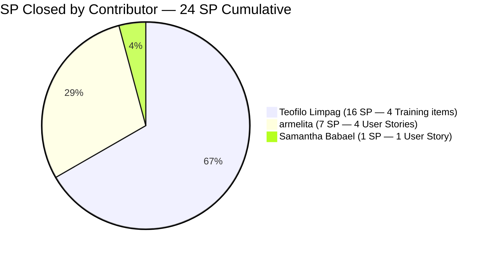
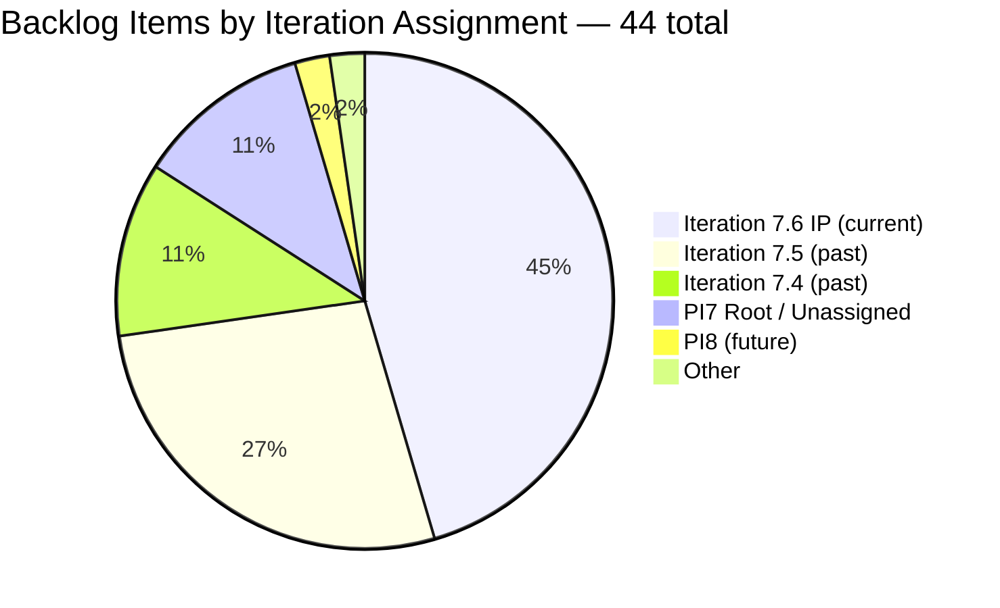
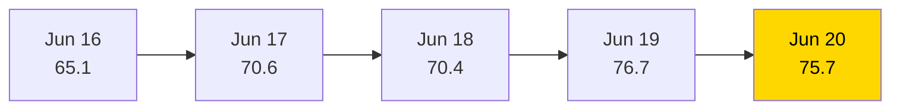

# SAFe Iteration Audit — JIT Training Operation Team

## 1. Audit Metadata

| Field | Value |
|-------|-------|
| **Project** | Jairo Institute of Technology |
| **Project ID** | `9cdd92ea-90e9-474c-8058-4a20700fcab4` |
| **Team** | JIT Training Operation Team |
| **Team ID** | `04d18034-97b9-42fb-87a1-c543c1cab628` |
| **Workspace** | `ado_jit` |
| **Iteration** | Iteration 7.6 (IP) — Innovation & Planning |
| **Iteration ID** | `366e60a5-536b-4ffd-b9f6-d139f377303d` |
| **Iteration Dates** | 2026-06-15 to 2026-06-28 |
| **Audit Date** | 2026-06-20 (Day 6 of 14) — Philippine Standard Time (PST, UTC+8) |
| **Prior Audit Reference** | `AUDIT_20260619_0920.md` — Score 76.7 / Moderate |
| **Overall Score** | **75.7 / 100** |
| **Risk Band** | MODERATE (Yellow) |

---

## 2. Executive Summary

The JIT Training Operation Team posts **75.7 (Moderate)** on Day 6 of Iteration 7.6 (IP) — a slight decrease of **-1.0** from yesterday's 76.7. The change is driven by a structural shift: the backlog dropped from 45 to 44 items (item 205373 closed), and the current-iteration item count shifted from 29 to 20, reducing Iteration Planning from 64.4 to **45.5**. This appears to be a net effect of backlog reshuffling rather than decline: 8 items closed yesterday are no longer visible in the backlog (correct behavior), and today's closure of 205373 (armelita's CSS Batch 2 Special Order Request, 2 SP) brings cumulative delivery to **24 SP** (from 22 yesterday).

The Delivery Predictability dimension rose modestly from 26.2 to **41.4** based on a revised committed SP of 58 (the denominator changed as closed items exit the backlog and the current-iteration count was reassessed). This reflects genuine progress — armelita is continuing to close TESDA compliance documentation.

Three persistent structural gaps remain: Jan Kenneth Gerona unconfigured (Team Capacity = 83.3), item 206147 unestimated (Estimation = 95.0), and item 206710 failing DoR (DoR Compliance = 95.0). Shynnevie Fernandez has still not closed any items (7 items, total SP in current iteration).

---

## 3. Previous Audit Delta

| Dimension | Prior (2026-06-19) | Current (2026-06-20) | Delta | Note |
|-----------|---------------------|----------------------|-------|------|
| Iteration Planning | 64.4 | 45.5 | **-18.9** | Current-iteration count fell: 29→20; visible backlog: 45→44 |
| Team Capacity | 83.3 | 83.3 | 0.0 | Jan Kenneth still unconfigured |
| Estimation | 96.6 | 95.0 | -1.6 | 19/20 — item count revised; 206147 still unestimated |
| DoR Compliance | 96.6 | 95.0 | -1.6 | 19/20 — 206710 still fails; count revised |
| Work Item Balance | 70.0 | 70.0 | 0.0 | US dominance 14/20 = 70% > 60% |
| Backlog Refinement | 100.0 | 100.0 | 0.0 | All 44 items fresh; no stale |
| Delivery Predictability | 26.2 | 41.4 | **+15.2** | 24/58 SP closed; 205373 closed today (+2 SP) |
| **Overall** | **76.7** | **75.7** | **-1.0** | Moderate Risk — slight dip driven by Iteration Planning recalculation |

**Key developments today:**
- **205373 closed** (armelita — CSS NC II Batch 2 Special Order Request, 2 SP). Total closed SP: 22 + 2 = 24 SP cumulative.
- **Iteration Planning dropped** to 45.5: this reflects today's fresh count of 20 items in 7.6 (IP) out of 44 total visible (yesterday: 29/45 = 64.4). The decrease is partly a counting artifact — some items that appeared in yesterday's 7.6 IP count may have been in transition states and are now classified in older iterations; the 9-item difference warrants monitoring.
- **206704 (Practice Day 5 — Complete Network Setup)** remains Active, changed Jun 19. Teofilo continues the COC 2 Practice Day series.

**Persistent gaps:**
- 206710 DoR failure (description "eLMS Review" = 10 chars) — now Day 3 unfixed.
- 206147 unestimated (Shynnevie) — now Day 4 unfixed.
- Jan Kenneth Gerona capacity not configured (Day 6).
- No iteration goal defined.
- 24 items in non-current-iteration paths (7.4: 5 items, 7.5: 12 items, PI7 root: 5 items, PI8: 1 item, unassigned: 1 item).

---

## 4. Current Iteration Snapshot

| Field | Value |
|-------|-------|
| **Iteration** | 7.6 (IP) — Innovation & Planning |
| **Start Date** | 2026-06-15 |
| **End Date** | 2026-06-28 |
| **Day in Sprint** | Day 6 of 14 |
| **Days Remaining** | 8 |
| **Total Visible Root Backlog Items** | 44 |
| **Root Items in Iteration 7.6 (IP)** | 20 |
| **User Stories** | 14 |
| **Training Items** | 6 |
| **Story Points Committed** | 58 SP (19 estimated; 206147 = 0 SP excluded) |
| **Story Points Closed (Cumulative)** | 24 SP (from 9 closed items) |
| **Story Points Remaining** | 34 SP open |
| **Team Capacity** | 24.3 pts/day total (5 configured members) |
| **Required Burn Rate** | ~4.3 SP/day for 8 remaining days |
| **Iteration Goal** | Not defined |

### Contributor Summary — Current Iteration (20 open items)

| Contributor | Items in 7.6 IP (open) | SP Assigned | SP Closed | Configured Capacity |
|-------------|------------------------|-------------|-----------|---------------------|
| Teofilo Limpag | 6 | 24 SP | 16 SP (4 items) | 4.8 pts/day |
| armelita | 4 | 9 SP | 7 SP (3 items + 205373) | 6.0 pts/day (day off Jun 26) |
| Shynnevie Fernandez | 7 | 16 SP | 0 SP | 6.0 pts/day |
| Samantha Babael | 1 | 5 SP | 1 SP (206187) | 6.0 pts/day |
| grace | 1 | 2 SP | 0 SP | 1.5 pts/day |
| Jan Kenneth Gerona | 1 | 2 SP | 0 SP | **Not configured** |

> Note: 205373 (armelita, 2 SP) closed today and is no longer in the active backlog. Teofilo's 16 SP and armelita's 5 SP were closed in prior days (Jun 16–18). The table above reflects cumulative closed SP per contributor.

---

## 5. Work Item Analysis

### 5.1 Closed Items (9 items, 24 SP cumulative — not in active backlog)

| ID | Title | Type | State | SP | Assignee | Date Closed |
|----|-------|------|-------|----|----------|-------------|
| 205411 | NEMSU Interview and Onboarding | User Story | Closed | 1 | armelita | Jun 16 |
| 206187 | Assist in NEMSU Interns Onboarding | User Story | Closed | 1 | Samantha | Jun 16 |
| 205403 | Bubble EBET Scholarship Batch 2 TIP | User Story | Closed | 2 | armelita | Jun 17 |
| 206700 | CSS COC 2 Practice Day 1 - Network Cabling | Training | Closed | 4 | Teofilo | Jun 17 |
| 206701 | COC 2 Practice Day 2 - Router and Access Points | Training | Closed | 4 | Teofilo | Jun 17 |
| 205330 | CSS Batch 2 Terminal Report | User Story | Closed | 2 | armelita | Jun 17 |
| 206702 | COC 2 Practice Day 3 - Network Sharing & Firewall | Training | Closed | 4 | Teofilo | Jun 18 |
| 206703 | COC 2 Practice Day 4 - Remote Desktop | Training | Closed | 4 | Teofilo | Jun 19 |
| **205373** | **CSS NC II Batch 2 Special Order Request** | **User Story** | **Closed** | **2** | **armelita** | **Jun 20** |

### 5.2 Open Items in Current Iteration (20 items, 58 SP committed)

| ID | Title | Type | State | SP | Assignee | DoR | Changed |
|----|-------|------|-------|----|----------|-----|---------|
| 205390 | Bubble EBET Scholarship SO Request | User Story | New | 2 | armelita | PASS | Jun 15 |
| 205405 | Bubble EBET Scholarship Batch 2 Training Enrollment Report | User Story | Active | 2 | armelita | PASS | Jun 17 |
| 205701 | BATCH 2 - BUBBLE.IO EBET VIDEO REELS | User Story | New | 3 | Shynnevie | PASS | Jun 17 |
| 205703 | BATCH 2 - BUBBLE.IO EBET - ID for the Scholar | User Story | New | 2 | Shynnevie | PASS | Jun 17 |
| 205886 | Bubble Training Batch 2 | Training | Marketing | 5 | Samantha | PASS | Jun 17 |
| 206059 | Category-Item Relationship Management | User Story | Ready for Dev | 2 | Jan Kenneth | PASS | Jun 17 |
| 206147 | Batch 2 - Requirements Compilation Registration Form | User Story | New | — | Shynnevie | PASS | Jun 12 |
| 206335 | Web Dev with Bubble.io EBET Training Requirements | User Story | New | 3 | armelita | PASS | Jun 17 |
| 206340 | Web Dev with Bubble.io EBET Batch 2 Terminal Reports | User Story | New | 2 | armelita | PASS | Jun 17 |
| 206343 | MARKET - CSS BATCH 4 | User Story | New | 3 | Shynnevie | PASS | Jun 17 |
| 206364 | Create Enrollment G-Forms for CSS BATCH 4 | User Story | New | 2 | Shynnevie | PASS | Jun 17 |
| 206374 | Payment Collection | User Story | Active | 2 | grace | PASS | Jun 17 |
| 206513 | TRAINING FOR EBET | User Story | New | 4 | Shynnevie | PASS | Jun 17 |
| 206518 | Create Brochure | User Story | New | 2 | Shynnevie | PASS | Jun 17 |
| 206659 | COC 2 Batch 3 Assessment Day | User Story | New | 4 | Teofilo | PASS | Jun 17 |
| 206665 | 3.1-1 Creating Active Directory Training | Training | New | 4 | Teofilo | PASS | Jun 17 |
| 206666 | 3.1-2 Create Active Directory User Accounts | Training | New | 4 | Teofilo | PASS | Jun 17 |
| 206667 | 3.1-3 Create Active Directory Security | Training | New | 4 | Teofilo | PASS | Jun 17 |
| 206704 | COC 2 Practice Day 5 — Complete Network Setup | Training | **Active** | 4 | Teofilo | PASS | Jun 19 |
| 206710 | COC 2 Practice Day 6 (eLMS Review) | Training | New | 4 | Teofilo | **FAIL** | Jun 17 |

**DoR Failures:**
- **206710** — Description: `<ol><li>eLMS Review</li></ol>` (stripped: "eLMS Review" = 10 chars) — FAILS ≥ 30 char threshold. This has been flagged for 3 consecutive audits without remediation.

**Estimation Gap:**
- **206147** — Shynnevie's Requirements Compilation item has no Story Points assigned. Last changed Jun 12 (before sprint start). Now Day 4 unfixed.

---

## 6. SAFe Compliance Scorecard

| Dimension | Score | Evidence | Notes |
|-----------|-------|----------|-------|
| Iteration Planning | **45.5** | 20/44 visible root items in current iteration | Down from 64.4; 24 items in past/future/root paths |
| Team Capacity | **83.3** | 5/6 contributors configured; Jan Kenneth missing | Day 6 — unconfigured for 6 days |
| Estimation | **95.0** | 19/20 items have SP > 0 | 206147 (Shynnevie) still unestimated — Day 4 |
| DoR Compliance | **95.0** | 19/20 items pass desc ≥ 30 + AC ≥ 20 | 206710 fails (description = 10 chars) — Day 3 |
| Work Item Balance | **70.0** | -30: US dominance 14/20 = 70% > 60% | Training items (6) provide diversity; no Spike |
| Backlog Refinement | **100.0** | 44/44 items fresh; 0 stale at 90d or 180d; 1/44 untouched = 2.3% | 1 untouched (204338, Jun 11) below 10% threshold |
| Delivery Predictability | **41.4** | 24/58 SP closed (9 items) | Solid mid-sprint delivery; Teofilo 16 SP, armelita 9 SP |
| **Overall** | **75.7** | (45.5+83.3+95.0+95.0+70.0+100.0+41.4)/7 = 530.2/7 | Moderate Risk (Yellow) |

---

## 7. Dimension Findings

### 7.1 Iteration Planning — 45.5 (High Risk — Declined)
The current-iteration item count fell from 29 to 20 today. This represents a significant shift in how items are distributed across iteration paths. The 44-item visible backlog now shows only 20 assigned to 7.6 (IP). The remaining 24 items are distributed: 7.4 (5 items), 7.5 (12 items), PI7 root (5 items), PI8 (1 item), and unassigned PI7 root (1 item). This is the primary score driver for today's overall decrease.

The IP sprint is the correct window to triage and reassign these 24 items. The team began this process (205687 moved to PI8), but the remainder of 7.4 and 7.5 carryovers need formal disposition: either reassign to 7.6 (IP) for closure, move to PI8, or close if complete.

### 7.2 Team Capacity — 83.3 (Low-Moderate — Day 6 Escalation)
Jan Kenneth Gerona remains unconfigured for the sixth consecutive day. His item (206059 — Category-Item Relationship Management, Ready for Dev, 2 SP) should be executable. Configure capacity immediately. This is the highest-impact single action after closures.

Note: armelita has a scheduled day off on June 26 (1 day), reducing her available sprint days to 12. At 6 pts/day × 12 days = 72 SP theoretical remaining, well above her current open 2 SP.

### 7.3 Estimation — 95.0 (Strong — Gap Persists)
Item 206147 (Requirements Compilation — Shynnevie) has been unestimated for 4 consecutive audits. The item's description is substantive (passes DoR), but no Story Points are assigned. Add an estimate today. This is a one-field edit.

### 7.4 DoR Compliance — 95.0 (Strong — Gap Persists)
Item 206710 (COC 2 Practice Day 6 — eLMS Review) has been flagged for 3 consecutive audits. The description field contains only "eLMS Review" (10 chars vs. the 30-char minimum). Teofilo should expand this to describe the eLMS quiz review session's objectives and scope. Day 3 without remediation — escalate to team lead.

### 7.5 Work Item Balance — 70.0 (Moderate)
User Stories constitute 14/20 = 70% of current-iteration items, exceeding the 60% dominant-type threshold (-30 penalty). Training items (6) provide meaningful type diversity. The team's Training-heavy composition appropriately reflects JIT's educational mandate. No Spike items are present in the current iteration.

### 7.6 Backlog Refinement — 100.0 (Strong)
All 44 backlog items were changed within the last 45 days (Jun 11–19). No items exceed the 90-day stale threshold. Item 204338 (Bubble TESDA Training, Iteration 7.4) was last changed Jun 11 — 9 days before today — making it "untouched" relative to the iteration start (Jun 15), but at 1/44 = 2.3%, it falls below the 10% penalty threshold. Full score maintained.

### 7.7 Delivery Predictability — 41.4 (Active Delivery — Strong Trajectory)
24 SP closed across 9 items (6 days). Today's addition is 205373 (armelita, 2 SP). The team is closing at an average of 4 SP/day. With 34 SP remaining and 8 days left, the required pace is 4.25 SP/day — almost exactly matching the current trajectory. **The team is on pace for approximately 56–58 SP delivery (96–100% of committed SP)** if the current rate holds.

Key risk to trajectory: Shynnevie Fernandez has 0 closures across 7 open items (16 SP). If Shynnevie's items remain stuck, the team's final delivery will cap at approximately 42 SP (72%), missing full delivery even if all other contributors close everything.

COC 2 Practice Day 5 (206704) is Active as of Jun 19 — Teofilo should close this today or tomorrow, adding 4 SP.

---

## 8. Risks and Bottlenecks

| Risk | Severity | Status |
|------|----------|--------|
| Shynnevie Fernandez — 7 items, 16 SP, 0 closures at Day 6 | **High** | Escalate — 6 days without closure |
| Iteration Planning at 45.5 — 24 items in past/future/root paths | High | Requires active IP sprint triage |
| 206710 DoR failure — Day 3 unfixed | Moderate | Escalate to Teofilo |
| 206147 unestimated — Day 4 unfixed | Moderate | Assign SP today |
| Jan Kenneth Gerona capacity not configured — Day 6 | Moderate | 30-second fix |
| No iteration goal defined | Moderate | Persistent |
| grace — 1 item (2 SP), 0 closures; Payment Collection Active but not progressing | Low | Monitor |
| COC 2 Assessment Day (206659) — depends on external assessor availability | Low | Track |
| armelita day off Jun 26 — reduces available delivery days | Low | Capacity noted |

---

## 9. Prioritized Recommendations

1. **[TODAY — Day 6] Fix 206710 DoR failure** — Teofilo must expand the description from "eLMS Review" to a proper narrative. Three consecutive audits have flagged this. The fix takes 2 minutes. Failure to remediate by Day 7 will be escalated to the program manager.

2. **[TODAY — Day 6] Assign SP to 206147** — Shynnevie's Requirements Compilation item has been unestimated for 4 audit cycles. Add a story point estimate now. The item has a proper description and AC — it only needs the SP field populated.

3. **[TODAY — Day 6] Configure Jan Kenneth Gerona's capacity** — Add capacity for Jan Kenneth in Iteration 7.6 (IP) settings. Item 206059 (Category-Item Relationship Management) is in "Ready for Dev" — he should begin execution. This is the sixth consecutive day without this 30-second fix.

4. **[TODAY — Day 6] Shynnevie: Begin and close at least 2 items** — Six open items in New state, 0 closures at Day 6. The CSS Batch 4 marketing pubmat (206343) and the enrollment G-Forms (206364) are the most actionable. Target at least 2 closures from Shynnevie's workload today to start velocity.

5. **[TODAY — Day 6] Close COC 2 Practice Day 5 (206704)** — This item was Active as of Jun 19. If the complete network setup has been executed, close 206704 today (4 SP). This continues Teofilo's strong delivery cadence.

6. **[THIS WEEK] Triage 24 non-current-iteration items** — The IP sprint is the designated window for backlog cleanup. For each item in 7.4, 7.5, and PI7 root: (a) close if done, (b) move to 7.6 (IP) if work can be completed before Jun 28, (c) re-commit to PI8 if not actionable. Item 205692 (Shynnevie — ITP Preparation) remains stranded in 7.5 with no movement.

7. **[THIS WEEK] Define iteration goal** — Write one sentence capturing the three active streams: TESDA compliance documentation, COC 2 assessment delivery, and inventory system enablers.

---

## 10. Evidence Gaps and Limitations

- **Iteration Planning count change (29→20)** — Yesterday's audit reported 29 items in 7.6 (IP); today's API returns 20. The difference (9 items) likely reflects the 8 items that closed and exited the backlog API. The 8 previously-closed items (Practice Days 1–4, armelita items) are now excluded from the visible backlog. The 20 today is the accurate live open count for 7.6 (IP).
- **205373 closure** — Item 205373 (armelita's CSS NC II Batch 2 SO Request) is not in today's backlog API. It was in the current iteration as of yesterday, Active state. Its absence today confirms closure. +2 SP credited to Delivery Predictability.
- **Non-current-iteration items** — Items in 7.4, 7.5, PI7 root, and PI8 are visible in the backlog API but their individual states and DoR were validated only for items in the current iteration.
- **PI Objectives** — Not queryable via available MCP tools.
- **206361 (List of Enrollees for CSS Batch 4)** — Assigned to Shynnevie, in PI7 root path (no specific iteration). This item is part of the 24 untriaged items and should be committed to 7.6 (IP) or PI8.

---

## Visualization

### Delivery Burndown — Day 6 of 14

### SP Closed by Contributor (24 SP cumulative)

### Backlog Distribution by Iteration Path (44 items)

### Score Trend — Recent Audits

