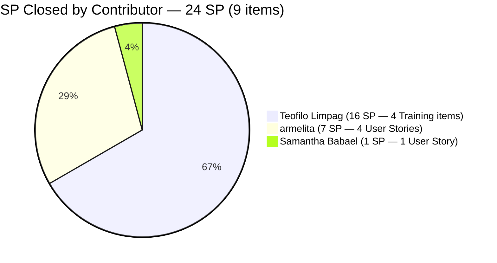
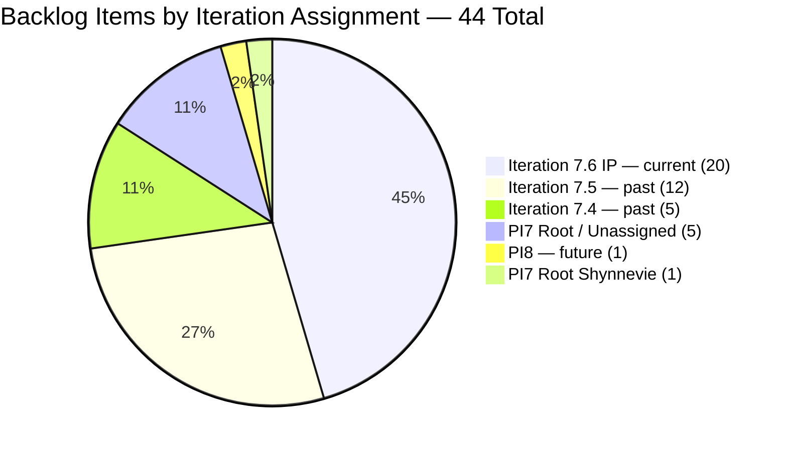
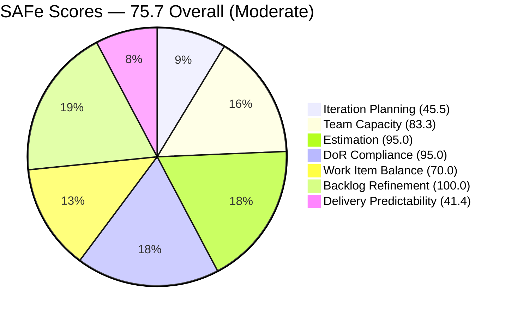

# SAFe Iteration Audit — JIT Training Operation Team

## 1. Audit Metadata

| Field | Value |
|-------|-------|
| **Project** | Jairo Institute of Technology |
| **Project ID** | `9cdd92ea-90e9-474c-8058-4a20700fcab4` |
| **Team** | JIT Training Operation Team |
| **Team ID** | `04d18034-97b9-42fb-87a1-c543c1cab628` |
| **Workspace** | `ado_jit` |
| **Iteration** | Iteration 7.6 (IP) — Innovation & Planning |
| **Iteration ID** | `366e60a5-536b-4ffd-b9f6-d139f377303d` |
| **Iteration Dates** | 2026-06-15 to 2026-06-28 |
| **Audit Date** | 2026-06-21 (Day 7 of 14 — Sprint Midpoint) — Philippine Standard Time (PST, UTC+8) |
| **Prior Audit Reference** | `AUDIT_20260620_0920.md` — Score 75.7 / Moderate |
| **Overall Score** | **75.7 / 100** |
| **Risk Band** | MODERATE (Yellow) |

---

## 2. Executive Summary

The JIT Training Operation Team holds at **75.7 (Moderate)** on Day 7 of Iteration 7.6 (IP) — unchanged from yesterday's 75.7. No ADO changes were detected between June 20 and June 21: all 44 visible backlog items remain in the same states, no items were closed today, and no capacity changes were made.

Today is the **sprint midpoint**. The team has delivered 24 SP across 9 items (closed Days 3–6). With 34 SP open and 7 days remaining, the required pace is 4.9 SP/day — slightly above the current average of 4.0 SP/day. The team is at moderate risk of missing full delivery unless Shynnevie Fernandez begins closures and Teofilo closes COC 2 Practice Day 5 (206704, 4 SP, currently Active).

Three quality gaps remain unresolved entering the midpoint:
1. **206710** (Teofilo — COC 2 Practice Day 6) fails DoR with a 10-character description — Day 4 without remediation.
2. **206147** (Shynnevie — Requirements Compilation) has no Story Points — Day 5 without remediation.
3. **Jan Kenneth Gerona** capacity remains unconfigured — Day 7.

Shynnevie's 0 closures across 7 items (16 SP) is the primary delivery risk to watch: if her workload remains closed, the team's ceiling is ~42 SP (~72% delivery).

---

## 3. Previous Audit Delta

| Dimension | Prior (2026-06-20) | Current (2026-06-21) | Delta | Note |
|-----------|---------------------|----------------------|-------|------|
| Iteration Planning | 45.5 | 45.5 | 0.0 | 20/44 — no change |
| Team Capacity | 83.3 | 83.3 | 0.0 | Jan Kenneth still unconfigured — Day 7 |
| Estimation | 95.0 | 95.0 | 0.0 | 19/20 — 206147 still unestimated (Day 5) |
| DoR Compliance | 95.0 | 95.0 | 0.0 | 19/20 — 206710 still fails (Day 4) |
| Work Item Balance | 70.0 | 70.0 | 0.0 | US dominance 14/20 = 70% > 60% |
| Backlog Refinement | 100.0 | 100.0 | 0.0 | All 44 items fresh; no stale |
| Delivery Predictability | 41.4 | 41.4 | 0.0 | 24/58 SP — no new closures detected |
| **Overall** | **75.7** | **75.7** | **0.0** | Moderate Risk — flat at midpoint |

**Key observations today:**
- No ADO changes detected between June 20 and June 21. 
- **206704** (COC 2 Practice Day 5 — Complete Network Setup) remains Active as of June 19. Teofilo has not yet closed it — this is the most actionable 4 SP item in the backlog.
- **Shynnevie's 0-closure streak** has now extended into Day 7. Her 7 open items (206147: 0 SP; 205701: 3 SP; 205703: 2 SP; 206343: 3 SP; 206364: 2 SP; 206513: 4 SP; 206518: 2 SP) total 16 SP, representing 27.6% of committed SP.

**Persistent gaps (escalation level):**
- 206710 DoR failure — Day 4 unfixed. Escalate to team lead.
- 206147 unestimated — Day 5 unfixed.
- Jan Kenneth Gerona unconfigured — Day 7.
- 24 items in non-current-iteration paths still require formal IP sprint disposition.

---

## 4. Current Iteration Snapshot

| Field | Value |
|-------|-------|
| **Iteration** | 7.6 (IP) — Innovation & Planning |
| **Start Date** | 2026-06-15 |
| **End Date** | 2026-06-28 |
| **Day in Sprint** | Day 7 of 14 (Sprint Midpoint) |
| **Days Remaining** | 7 |
| **Total Visible Root Backlog Items** | 44 |
| **Root Items in Iteration 7.6 (IP)** | 20 |
| **User Stories** | 14 |
| **Training Items** | 6 |
| **Story Points Committed** | 58 SP (19/20 items estimated; 206147 = 0 SP excluded) |
| **Story Points Closed (Cumulative)** | 24 SP (9 items, Days 3–6) |
| **Story Points Open** | 34 SP |
| **Required Burn Rate** | 4.9 SP/day for 7 remaining days |
| **Current Average Rate** | ~4.0 SP/day (24 SP / 6 delivery days) |
| **Team Capacity** | 24.3 pts/day total (5 configured members; Jan Kenneth unconfigured) |
| **Iteration Goal** | Not defined |

### Contributor Summary — Current Iteration

| Contributor | Open Items (7.6 IP) | Open SP | SP Closed | Configured Capacity |
|-------------|---------------------|---------|-----------|---------------------|
| Teofilo Limpag | 6 (5 New + 1 Active) | 24 SP | 16 SP (4 Training) | 4.8 pts/day |
| armelita | 4 (3 New + 1 Active) | 9 SP | 7 SP (4 items) | 6.0 pts/day (day off Jun 26) |
| Shynnevie Fernandez | 7 (all New) | 16 SP | **0 SP** | 6.0 pts/day |
| Samantha Babael | 1 (Marketing) | 5 SP | 1 SP (206187) | 6.0 pts/day |
| grace | 1 (Active) | 2 SP | 0 SP | 1.5 pts/day |
| Jan Kenneth Gerona | 1 (Ready for Dev) | 2 SP | 0 SP | **Not configured** |

---

## 5. Work Item Analysis

### 5.1 Closed Items (9 items, 24 SP cumulative — confirmed closed, not in active backlog)

| ID | Title | Type | SP | Assignee | Date Closed |
|----|-------|------|----|----------|-------------|
| 205411 | NEMSU Interview and Onboarding | User Story | 1 | armelita | Jun 16 |
| 206187 | Assist in NEMSU Interns Onboarding | User Story | 1 | Samantha | Jun 16 |
| 205403 | Bubble EBET Scholarship Batch 2 TIP | User Story | 2 | armelita | Jun 17 |
| 206700 | CSS COC 2 Practice Day 1 - Network Cabling | Training | 4 | Teofilo | Jun 17 |
| 206701 | COC 2 Practice Day 2 - Router and Access Points | Training | 4 | Teofilo | Jun 17 |
| 205330 | CSS Batch 2 Terminal Report | User Story | 2 | armelita | Jun 17 |
| 206702 | COC 2 Practice Day 3 - Network Sharing & Firewall | Training | 4 | Teofilo | Jun 18 |
| 206703 | COC 2 Practice Day 4 - Remote Desktop | Training | 4 | Teofilo | Jun 19 |
| 205373 | CSS NC II Batch 2 Special Order Request | User Story | 2 | armelita | Jun 20 |

### 5.2 Open Items in Current Iteration 7.6 (IP) — 20 Items

| ID | Title | Type | State | SP | Assignee | DoR | Changed |
|----|-------|------|-------|----|----------|-----|---------|
| 205390 | Bubble EBET Scholarship SO Request | User Story | New | 2 | armelita | PASS | Jun 15 |
| 205405 | Bubble EBET Scholarship Batch 2 Training Enrollment Report | User Story | Active | 2 | armelita | PASS | Jun 17 |
| 205701 | BATCH 2 - BUBBLE.IO EBET VIDEO REELS | User Story | New | 3 | Shynnevie | PASS | Jun 17 |
| 205703 | BATCH 2 - BUBBLE.IO EBET - ID for the Scholar | User Story | New | 2 | Shynnevie | PASS | Jun 17 |
| 205886 | Bubble Training Batch 2 | Training | Marketing | 5 | Samantha | PASS | Jun 17 |
| 206059 | Category-Item Relationship Management | User Story | Ready for Dev | 2 | Jan Kenneth | PASS | Jun 17 |
| 206147 | Batch 2 - Requirements Compilation Registration Form | User Story | New | **0 (unestimated)** | Shynnevie | PASS | Jun 12 |
| 206335 | Web Dev with Bubble.io EBET Training Requirements | User Story | New | 3 | armelita | PASS | Jun 17 |
| 206340 | Web Dev with Bubble.io EBET Batch 2 Terminal Reports | User Story | New | 2 | armelita | PASS | Jun 17 |
| 206343 | MARKET - CSS BATCH 4 | User Story | New | 3 | Shynnevie | PASS | Jun 17 |
| 206364 | Create Enrollment G-Forms for CSS BATCH 4 | User Story | New | 2 | Shynnevie | PASS | Jun 17 |
| 206374 | Payment Collection | User Story | Active | 2 | grace | PASS | Jun 17 |
| 206513 | TRAINING FOR EBET | User Story | New | 4 | Shynnevie | PASS | Jun 17 |
| 206518 | Create Brochure | User Story | New | 2 | Shynnevie | PASS | Jun 17 |
| 206659 | COC 2 Batch 3 Assessment Day | User Story | New | 4 | Teofilo | PASS | Jun 17 |
| 206665 | 3.1-1 Creating Active Directory Training | Training | New | 4 | Teofilo | PASS | Jun 17 |
| 206666 | 3.1-2 Create Active Directory User Accounts | Training | New | 4 | Teofilo | PASS | Jun 17 |
| 206667 | 3.1-3 Create Active Directory Security | Training | New | 4 | Teofilo | PASS | Jun 17 |
| 206704 | COC 2 Practice Day 5 — Complete Network Setup | Training | **Active** | 4 | Teofilo | PASS | Jun 19 |
| 206710 | COC 2 Practice Day 6 (eLMS Review) | Training | New | 4 | Teofilo | **FAIL** | Jun 17 |

**DoR Failures:**
- **206710** — Description: `<ol><li>eLMS Review</li></ol>` (stripped: "eLMS Review" = 10 chars) — FAILS ≥ 30 char threshold. **Day 4 unresolved.** AC passes ("COC 2 Elms Quizzes Completed" = 29 chars — near boundary, verified ≥ 20 chars).

**Estimation Gap:**
- **206147** — Shynnevie's Requirements Compilation item has no Story Points assigned. Last changed Jun 12. **Day 5 unresolved.**

### 5.3 Non-Current-Iteration Items Summary (24 items requiring IP sprint disposition)

| Path | Count | Key Items | Action Needed |
|------|-------|-----------|---------------|
| Iteration 7.4 | 5 | 204321, 204722 (Design), 204338 (Training), 204915, 205714 (Defect) | Close if done or reassign to PI8 |
| Iteration 7.5 | 12 | 204729, 204736, 204737, 204744, 204749, 205450, 205507, 205574, 205577, 205683, 205692, 206094 | Bulk triage this week |
| PI7 Root (no iteration) | 5 | 203245, 203250, 203253, 203254, 205538 | Assign to 7.6 IP or PI8 |
| PI8 | 1 | 205687 (Graduation — grace) | Confirmed PI8 — no action |
| PI7 Root (Shynnevie) | 1 | 206361 (List of Enrollees CSS Batch 4) | Assign to 7.6 IP or close |

Notable: 206094 ("draft1") is a placeholder item with a description of "11" and AC of "draft" — this is a junk item that should be deleted. 203253 and 203254 (CCA exam / Claude Partner Portal) have no SP assigned.

---

## 6. SAFe Compliance Scorecard

| Dimension | Score | Evidence | Notes |
|-----------|-------|----------|-------|
| Iteration Planning | **45.5** | 20/44 visible root items in current iteration | 24 items in past/future/root paths — IP sprint triage needed |
| Team Capacity | **83.3** | 5/6 contributors configured; Jan Kenneth missing | Day 7 — unconfigured for 7 consecutive days |
| Estimation | **95.0** | 19/20 items have SP > 0 | 206147 (Shynnevie) unestimated — Day 5 |
| DoR Compliance | **95.0** | 19/20 items pass desc ≥ 30 + AC ≥ 20 | 206710 fails (description = 10 chars) — Day 4 |
| Work Item Balance | **70.0** | -30: US dominance 14/20 = 70% > 60% | Training items (6) provide type diversity; no Spike |
| Backlog Refinement | **100.0** | 44/44 items fresh (all changed May 7–Jun 19); 0 stale at 90d or 180d; 2 untouched (10.0%) = not > 10%, no penalty | Full score maintained |
| Delivery Predictability | **41.4** | 24/58 SP closed (9 items) | Solid cumulative delivery; pace at midpoint slightly below needed rate |
| **Overall** | **75.7** | (45.5+83.3+95.0+95.0+70.0+100.0+41.4)/7 = 530.2/7 | Moderate Risk (Yellow) |

---

## 7. Dimension Findings

### 7.1 Iteration Planning — 45.5 (High Risk)
20 of 44 visible root backlog items are assigned to Iteration 7.6 (IP). The 24-item overhang in past/future/root paths is the primary score anchor. The IP sprint is the correct and designated window to perform this triage. With 7 days remaining, the team must formally close, reassign, or de-commit these 24 items before the sprint ends.

Notable: Item 206094 ("draft1") with description "11" and AC "draft" is a junk backlog item. It should be deleted, not triaged.

### 7.2 Team Capacity — 83.3 (Low-Moderate — Day 7 Escalation)
Jan Kenneth Gerona is unconfigured for the **seventh consecutive day**. His item 206059 (Category-Item Relationship Management, 2 SP, Ready for Dev) is ready for execution but capacity has not been set. armelita has a scheduled day off June 26, reducing her sprint days to 12 — but her remaining open SP (9 SP) is well within her remaining capacity.

### 7.3 Estimation — 95.0 (Strong — Single Gap Persisting)
Item 206147 (Shynnevie — Batch 2 Requirements Compilation) has been unestimated for 5 audit cycles. The description and AC are both adequate (DoR passes). Adding a Story Points value is a one-field edit. Day 5 escalation: this should have been fixed by Day 3.

### 7.4 DoR Compliance — 95.0 (Strong — Gap Persisting)
Item 206710 (COC 2 Practice Day 6 — eLMS Review) description stripped to "eLMS Review" = 10 characters. This fails the ≥ 30 non-whitespace char threshold by 20 characters. Teofilo needs to expand the description to specify the eLMS quiz session objectives, which modules are covered, and how completion is measured. Day 4 without remediation — escalate to team lead today.

### 7.5 Work Item Balance — 70.0 (Moderate)
User Stories = 14/20 = 70%, triggering the -30 dominant-type penalty. Training items (6) provide meaningful diversity and align with JIT's training mandate. No Spike items are present in the current iteration. The User Story concentration is appropriate given the operational nature of the work (TESDA documentation, marketing, enrollment processing).

### 7.6 Backlog Refinement — 100.0 (Strong)
All 44 backlog items have been changed within the 45-day freshness window (earliest: Jun 11, 2026 for item 204338). No items exceed the 90-day stale threshold. Two items are classified as "untouched" (ChangedDate before iteration start June 15): items 204338 (changed Jun 11) and 206147 (changed Jun 12). Untouched rate = 2/20 = 10.0% — exactly at the threshold, not above it — so no penalty applies. Full score maintained.

### 7.7 Delivery Predictability — 41.4 (Active Delivery — Midpoint Pressure)
24 SP closed across 9 items through 6 delivery days = average 4.0 SP/day. With 34 SP open and 7 days remaining, the required pace is 4.9 SP/day — a 22.5% acceleration above current average.

The delivery ceiling scenario: If Shynnevie's 7 items (16 SP) remain undelivered, the team's maximum delivery is 24 + (58-16-0[206147]) = 24 + 41 = 42 SP, excluding 206147. Actual ceiling: 24 SP closed + up to 42 SP from other contributors = 42 SP / 58 committed = **72.4% maximum delivery** if Shynnevie delivers nothing.

Teofilo's 206704 (Practice Day 5, Active, 4 SP) should close today or tomorrow — this continues the COC 2 Practice Day series where Days 1–4 closed consecutively.

---

## 8. Risks and Bottlenecks

| Risk | Severity | Status |
|------|----------|--------|
| Shynnevie Fernandez — 7 items, 16 SP, 0 closures at Day 7 | **Critical** | Escalate — 7 days without closure |
| Iteration Planning at 45.5 — 24 items in past/future/root paths | High | IP sprint triage required this week |
| Required burn rate (4.9 SP/day) above current average (4.0 SP/day) | High | Teofilo + armelita must accelerate |
| 206710 DoR failure — Day 4 unfixed | Moderate | Escalate to Teofilo today |
| 206147 unestimated — Day 5 unfixed | Moderate | Assign SP today |
| Jan Kenneth Gerona capacity unconfigured — Day 7 | Moderate | 30-second fix |
| No iteration goal defined | Moderate | Persistent |
| grace — Payment Collection (206374) Active since Jun 17, no closure | Low | Monitor |
| armelita day off Jun 26 — reduces available delivery days | Low | Capacity noted; minimal impact |
| 206094 ("draft1") — junk backlog item polluting metrics | Low | Delete |

---

## 9. Prioritized Recommendations

1. **[TODAY — Day 7, CRITICAL] Shynnevie: Begin and close at least 2 items** — Seven consecutive days with 0 closures across 7 items. The most actionable first targets are 206343 (MARKET - CSS BATCH 4, 3 SP) and 206364 (Create Enrollment G-Forms for CSS BATCH 4, 2 SP). Both are in New state with complete DoR. Start today, close by end of day. Any closure breaks the zero-velocity streak.

2. **[TODAY — Day 7] Fix 206710 DoR failure** — Teofilo must expand the description from "eLMS Review" to at minimum: "COC 2 Practice Day 6 focuses on eLMS quiz completion — trainees complete all required online assessments in the eLMS platform for CSS COC 2 certification." (≥ 30 non-whitespace chars). Four days unresolved is unacceptable.

3. **[TODAY — Day 7] Close COC 2 Practice Day 5 (206704)** — Active since June 19. This is the natural next item in Teofilo's Practice Day series. If the complete network setup from router to client has been executed, close 206704 today (4 SP). This adds 4 SP to delivery and lifts Delivery Predictability to 28/58 = 48.3%.

4. **[TODAY — Day 7] Assign SP to 206147** — Shynnevie's Requirements Compilation item has been unestimated for 5 audit cycles. One-field edit. Do it now.

5. **[TODAY — Day 7] Configure Jan Kenneth Gerona's capacity** — Day 7, seventh consecutive missed fix. Item 206059 (Category-Item Relationship Management, Ready for Dev, 2 SP) is actionable. Configure capacity and have Jan Kenneth begin execution.

6. **[THIS WEEK — Days 7–10] Triage 24 non-current-iteration items** — The IP sprint exists for backlog cleanup. For each item in 7.4 (5 items), 7.5 (12 items), PI7 root (5 items): (a) close if done, (b) move to 7.6 IP if completable by Jun 28, (c) commit to PI8 otherwise. Delete item 206094 ("draft1").

7. **[THIS WEEK] Define iteration goal** — "Deliver TESDA compliance documentation for EBET Batch 2, complete COC 2 practice assessments for Teofilo's trainees, launch CSS Batch 4 marketing, and execute IP sprint backlog triage."

---

## 10. Evidence Gaps and Limitations

- **No new closures confirmed today** — The backlog API returns 44 open items, same count as yesterday. Item 206704 (Teofilo's Practice Day 5) remains Active. No items transitioned to Closed/Done between June 20 and June 21.
- **Untouched items boundary** — Items 204338 (Jun 11) and 206147 (Jun 12) have ChangedDate before iteration start (Jun 15). The 10.0% untouched rate falls exactly at the threshold (not above). Formula requires > 10%, so no penalty is applied.
- **206147 SP = 0** — This item is excluded from committed_story_points (58 SP) and the estimation denominator includes it as unestimated (19/20 = 95%).
- **PI Objectives** — Not queryable via available MCP tools.
- **Non-current-iteration items DoR** — DoR was validated only for the 20 items in the current iteration. Items in 7.4, 7.5, and PI7 root paths were not individually DoR-checked.
- **Samantha's item (205886 — Bubble Training Batch 2)** is in "Marketing" state — a non-standard state. This item is counted as open in the current iteration with 5 SP committed.

---

## Visualization

### Delivery Burndown — Through Day 7 of 14

### SP Closed by Contributor — 24 SP Cumulative

### Backlog Distribution by Iteration Path — 44 Items

### SAFe Dimension Scores — Jun 21

