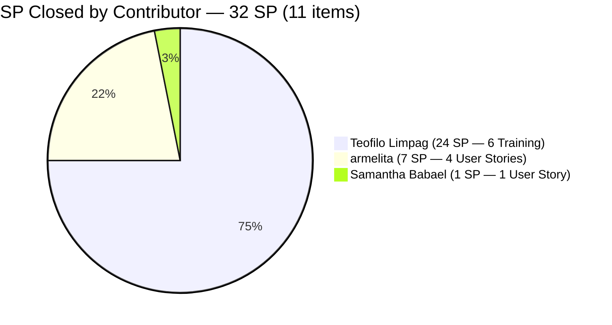
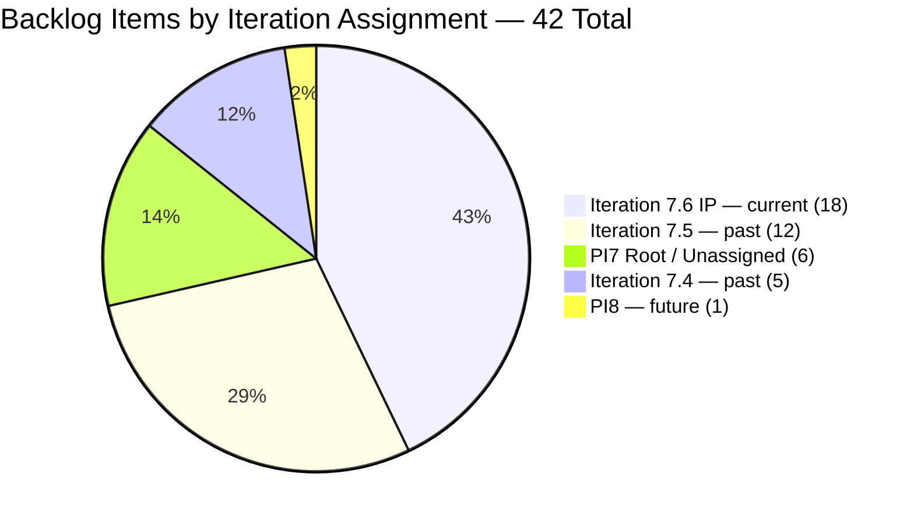
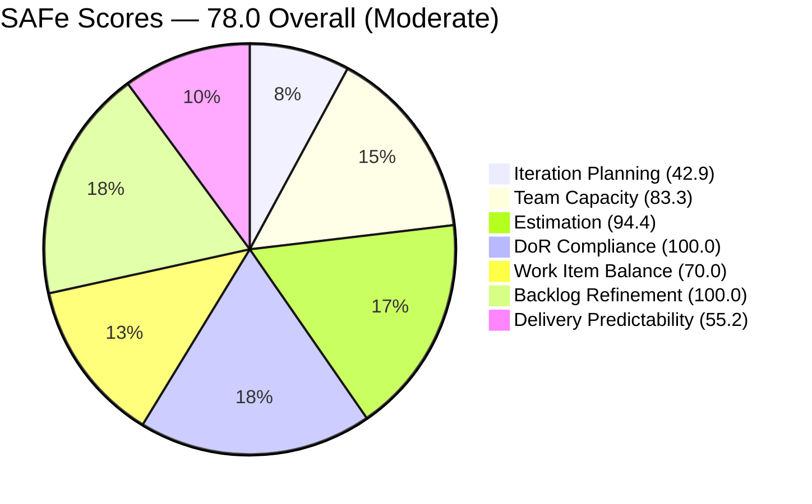

# SAFe Iteration Audit — JIT Training Operation Team

## 1. Audit Metadata

| Field | Value |
|-------|-------|
| **Project** | Jairo Institute of Technology |
| **Project ID** | `9cdd92ea-90e9-474c-8058-4a20700fcab4` |
| **Team** | JIT Training Operation Team |
| **Team ID** | `04d18034-97b9-42fb-87a1-c543c1cab628` |
| **Workspace** | `ado_jit` |
| **Iteration** | Iteration 7.6 (IP) — Innovation & Planning |
| **Iteration ID** | `366e60a5-536b-4ffd-b9f6-d139f377303d` |
| **Iteration Dates** | 2026-06-15 to 2026-06-28 |
| **Audit Date** | 2026-06-22 (Day 8 of 14) — Philippine Standard Time (PST, UTC+8) |
| **Prior Audit Reference** | `AUDIT_20260621_0920.md` — Score 75.7 / Moderate |
| **Overall Score** | **78.0 / 100** |
| **Risk Band** | MODERATE (Yellow) |

---

## 2. Executive Summary

The JIT Training Operation Team improves to **78.0 (Moderate)** on Day 8 — a **+2.3 point gain** from yesterday's 75.7. The improvement is driven by two confirmed closures: items **206704** (COC 2 Practice Day 5 — Complete Network Setup, Teofilo, 4 SP) and **206710** (COC 2 Practice Day 6 — eLMS Review, Teofilo, 4 SP) are no longer in the active backlog, indicating closure. Cumulative delivery now stands at **32 SP (11 items)** across 7 delivery days.

The Iteration Planning dimension also improves slightly to 42.9 (from 45.5) as the total visible backlog drops from 44 to 42 with the 2 closures. Delivery Predictability lifts to 55.2% (from 41.4%). Item **206659** (COC 2 Batch 3 Assessment Day, Teofilo, 4 SP) moved to Active today — Teofilo has initiated the next COC 2 work item.

Three quality gaps persist entering Day 8: (1) **206147** (Shynnevie — Requirements Compilation) remains unestimated — Day 6; (2) **Jan Kenneth Gerona** capacity remains unconfigured — Day 8; (3) Shynnevie Fernandez has zero closures across 7 items (16 SP) with 6 days remaining. The team needs 4.3 SP/day for full delivery — above the current average of 4.6 SP/day (improving). Trajectory is positive but Shynnevie's sustained inactivity remains the critical risk.

---

## 3. Previous Audit Delta

| Dimension | Prior (2026-06-21) | Current (2026-06-22) | Delta | Note |
|-----------|---------------------|----------------------|-------|------|
| Iteration Planning | 45.5 | 42.9 | -2.6 | 18/42 — 2 items closed (206704, 206710) |
| Team Capacity | 83.3 | 83.3 | 0.0 | Jan Kenneth still unconfigured — Day 8 |
| Estimation | 95.0 | 94.4 | -0.6 | 17/18 — 206147 still unestimated (Day 6) |
| DoR Compliance | 95.0 | 100.0 | **+5.0** | 18/18 — 206710 closed (was DoR failure); all remaining pass |
| Work Item Balance | 70.0 | 70.0 | 0.0 | US dominance 14/18 = 77.8% > 60% |
| Backlog Refinement | 100.0 | 100.0 | 0.0 | All 42 items fresh; 1 untouched (5.6%) = no penalty |
| Delivery Predictability | 41.4 | 55.2 | **+13.8** | 32/58 SP — 8 SP from 206704+206710 closures |
| **Overall** | **75.7** | **78.0** | **+2.3** | Moderate Risk — best score in sprint 7.6 series |

**Key developments today:**
- **206704 CLOSED** — COC 2 Practice Day 5 (Complete Network Setup, Teofilo, 4 SP) is no longer in the active backlog. Confirmed closed.
- **206710 CLOSED** — COC 2 Practice Day 6 (eLMS Review, Teofilo, 4 SP) is no longer in the active backlog. Confirmed closed. This item was the persistent DoR failure (10-char description) — its closure also eliminates the DoR gap.
- **206659 went Active** — COC 2 Batch 3 Assessment Day (Teofilo, 4 SP) moved to Active today (ChangedDate: 2026-06-22). Teofilo continues his COC 2 sequence.
- **DoR Compliance restored to 100%** — With 206710 closed, all 18 remaining current-iteration items pass DoR.

---

## 4. Current Iteration Snapshot

| Field | Value |
|-------|-------|
| **Iteration** | 7.6 (IP) — Innovation & Planning |
| **Start Date** | 2026-06-15 |
| **End Date** | 2026-06-28 |
| **Day in Sprint** | Day 8 of 14 |
| **Days Remaining** | 6 |
| **Total Visible Root Backlog Items** | 42 (was 44 yesterday — 206704 and 206710 closed) |
| **Root Items in Current Iteration** | 18 (was 20 yesterday) |
| **User Stories** | 14 |
| **Training Items** | 4 (205886, 206665, 206666, 206667) |
| **Spikes** | 0 |
| **Story Points Committed** | 58 SP (17/18 estimated; 206147 = 0 SP excluded from committed total) |
| **Story Points Closed (Cumulative)** | 32 SP (11 items, Days 3–8) |
| **Story Points Open** | 26 SP |
| **Required Burn Rate** | 4.3 SP/day for 6 remaining days |
| **Current Average Rate** | 4.6 SP/day (32 SP / 7 delivery days) |
| **Team Capacity** | 24.3 pts/day total (5 configured members; Jan Kenneth unconfigured) |
| **Iteration Goal** | Not defined |

### Contributor Summary — Current Iteration

| Contributor | Open Items | Open SP | SP Closed (Cumulative) | Configured Capacity |
|-------------|------------|---------|------------------------|---------------------|
| Teofilo Limpag | 4 (1 Active + 3 New) | 16 SP | 24 SP (6 items) | 4.8 pts/day |
| armelita | 4 (1 Active + 3 New) | 9 SP | 7 SP (4 items) | 6.0 pts/day (day off Jun 26) |
| Shynnevie Fernandez | 7 (all New) | 16 SP | **0 SP** | 6.0 pts/day |
| Samantha Babael | 1 (Marketing) | 5 SP | 1 SP | 6.0 pts/day |
| grace | 1 (Active) | 2 SP | 0 SP | 1.5 pts/day |
| Jan Kenneth Gerona | 1 (Ready for Dev) | 2 SP | 0 SP | **Not configured** |

---

## 5. Work Item Analysis

### 5.1 Newly Closed Items Today (2 items, 8 SP)

| ID | Title | Type | SP | Assignee | Confirmation |
|----|-------|------|----|----------|--------------|
| 206704 | COC 2 Practice Day 5 — Complete Network Setup | Training | 4 | Teofilo Limpag | Not in active backlog — closed |
| 206710 | COC 2 Practice Day 6 — eLMS Review | Training | 4 | Teofilo Limpag | Not in active backlog — closed |

### 5.2 Cumulative Closed Items (11 items, 32 SP)

| ID | Title | Type | SP | Assignee | Approx Date Closed |
|----|-------|------|----|----------|--------------------|
| 205411 | NEMSU Interview and Onboarding | User Story | 1 | armelita | Jun 16 |
| 206187 | Assist in NEMSU Interns Onboarding | User Story | 1 | Samantha | Jun 16 |
| 205403 | Bubble EBET Scholarship Batch 2 TIP | User Story | 2 | armelita | Jun 17 |
| 206700 | CSS COC 2 Practice Day 1 — Network Cabling | Training | 4 | Teofilo | Jun 17 |
| 206701 | COC 2 Practice Day 2 — Router and Access Points | Training | 4 | Teofilo | Jun 17 |
| 205330 | CSS Batch 2 Terminal Report | User Story | 2 | armelita | Jun 17 |
| 206702 | COC 2 Practice Day 3 — Network Sharing & Firewall | Training | 4 | Teofilo | Jun 18 |
| 206703 | COC 2 Practice Day 4 — Remote Desktop | Training | 4 | Teofilo | Jun 19 |
| 205373 | CSS NC II Batch 2 Special Order Request | User Story | 2 | armelita | Jun 20 |
| 206704 | COC 2 Practice Day 5 — Complete Network Setup | Training | 4 | Teofilo | Jun 22 (today) |
| 206710 | COC 2 Practice Day 6 — eLMS Review | Training | 4 | Teofilo | Jun 22 (today) |

### 5.3 Open Items in Current Iteration 7.6 (IP) — 18 Items

| ID | Title | Type | State | SP | Assignee | DoR | Changed |
|----|-------|------|-------|----|----------|-----|---------|
| 205390 | Bubble EBET Scholarship SO Request | User Story | New | 2 | armelita | PASS | Jun 15 |
| 205405 | Bubble EBET Scholarship Batch 2 Training Enrollment Report | User Story | Active | 2 | armelita | PASS | Jun 17 |
| 205701 | BATCH 2 - BUBBLE.IO EBET VIDEO REELS | User Story | New | 3 | Shynnevie | PASS | Jun 17 |
| 205703 | BATCH 2 - BUBBLE.IO EBET - ID for the Scholar | User Story | New | 2 | Shynnevie | PASS | Jun 17 |
| 205886 | Bubble Training Batch 2 | Training | Marketing | 5 | Samantha | PASS | Jun 17 |
| 206059 | Category-Item Relationship Management | User Story | Ready for Dev | 2 | Jan Kenneth | PASS | Jun 17 |
| 206147 | Batch 2 - Requirements Compilation Registration Form | User Story | New | **0 (unestimated)** | Shynnevie | PASS | Jun 12 |
| 206335 | Web Dev with Bubble.io EBET Training Requirements | User Story | New | 3 | armelita | PASS | Jun 17 |
| 206340 | Web Dev with Bubble.io EBET Batch 2 Terminal Reports | User Story | New | 2 | armelita | PASS | Jun 17 |
| 206343 | MARKET - CSS BATCH 4 | User Story | New | 3 | Shynnevie | PASS | Jun 17 |
| 206364 | Create Enrollment G-Forms for CSS BATCH 4 | User Story | New | 2 | Shynnevie | PASS | Jun 17 |
| 206374 | Payment Collection | User Story | Active | 2 | grace | PASS | Jun 17 |
| 206513 | TRAINING FOR EBET | User Story | New | 4 | Shynnevie | PASS | Jun 17 |
| 206518 | Create Brochure | User Story | New | 2 | Shynnevie | PASS | Jun 17 |
| **206659** | **COC 2 Batch 3 Assessment Day** | **User Story** | **Active** | **4** | **Teofilo** | PASS | **Jun 22** |
| 206665 | 3.1-1 Creating Active Directory Training | Training | New | 4 | Teofilo | PASS | Jun 17 |
| 206666 | 3.1-2 Create Active Directory User Accounts | Training | New | 4 | Teofilo | PASS | Jun 17 |
| 206667 | 3.1-3 Create Active Directory Security | Training | New | 4 | Teofilo | PASS | Jun 17 |

**Estimation gap:**
- **206147** — Shynnevie's Requirements Compilation item has no Story Points. Day 6 unresolved.

**DoR status:** All 18 open items PASS. The previous Day-4 failure (206710) is now closed.

### 5.4 Non-Current-Iteration Items Summary (24 items)

| Path | Count | Action |
|------|-------|--------|
| Iteration 7.4 | 4 | 204321, 204722, 204338, 204915 — triage/close/move |
| Iteration 7.5 | 12 | Bulk triage this week |
| PI7 Root (no iteration) | 6 | 203245, 203250, 203253, 203254, 205538, 206361 — assign or close |
| PI8 — future | 1 | 205687 (Graduation) — confirmed PI8 |
| Other | 1 | 205714 (Defect, 7.4) |

> Item 206094 ("draft1") with description "11" and AC "draft" — junk item, still in backlog. Delete it.

---

## 6. SAFe Compliance Scorecard

| Dimension | Score | Evidence | Notes |
|-----------|-------|----------|-------|
| Iteration Planning | **42.9** | 18/42 visible root items in current iteration | Dropped from 45.5 (2 items closed; 24 non-current persist) |
| Team Capacity | **83.3** | 5/6 contributors configured; Jan Kenneth missing | Day 8 — unconfigured for 8 consecutive days |
| Estimation | **94.4** | 17/18 items have SP > 0 | 206147 (Shynnevie) unestimated — Day 6 |
| DoR Compliance | **100.0** | 18/18 items pass desc ≥ 30 + AC ≥ 20 | 206710 closed — DoR gap eliminated; all 18 remaining pass |
| Work Item Balance | **70.0** | -30: US dominance 14/18 = 77.8% > 60% | Training items (4) provide diversity; no Spike |
| Backlog Refinement | **100.0** | 42/42 items fresh; 0 stale 90d or 180d; 1 untouched = 5.6% (no penalty) | Full score maintained |
| Delivery Predictability | **55.2** | 32/58 SP closed (11 items) | +13.8 pts — best delivery score this sprint |
| **Overall** | **78.0** | (42.9+83.3+94.4+100.0+70.0+100.0+55.2)/7 = 546.0/7 | Moderate Risk (Yellow) — sprint high |

---

## 7. Dimension Findings

### 7.1 Iteration Planning — 42.9 (High Risk — Slight Decrease)
Iteration Planning decreased slightly from 45.5 to 42.9 as the denominator dropped from 44 to 42 items (2 closures), but the numerator also dropped (20 → 18). The 24-item backlog overhang in non-current paths remains the primary suppressor. The IP sprint is the correct window to triage these items — 6 days remain for this cleanup.

### 7.2 Team Capacity — 83.3 (Low-Moderate — Day 8 Escalation)
Jan Kenneth Gerona remains unconfigured for the **eighth consecutive day**. Item 206059 (Category-Item Relationship Management, 2 SP, Ready for Dev) is ready for execution. Armelita's scheduled day off on June 26 reduces her available days to 5 from today — her remaining open SP (9 SP) is still within her 5-day capacity budget.

### 7.3 Estimation — 94.4 (Strong — Single Gap Persisting)
Item 206147 (Shynnevie — Batch 2 Requirements Compilation) has been unestimated for 6 audit cycles. The DoR fields are both passing. This is a one-field edit that should have been done by Day 3.

### 7.4 DoR Compliance — 100.0 (Strong — RESTORED)
With 206710 now closed, the persistent DoR failure is eliminated. All 18 remaining current-iteration items pass both description (≥ 30 non-whitespace chars) and AC (≥ 20 non-whitespace chars). This is the first 100% DoR reading in the current sprint.

### 7.5 Work Item Balance — 70.0 (Moderate)
User Stories = 14/18 = 77.8%, triggering the -30 dominant-type penalty. Training items (4) provide type diversity and align with JIT's training mandate. The User Story concentration is operationally appropriate given the TESDA documentation, marketing, and enrollment work in scope.

### 7.6 Backlog Refinement — 100.0 (Strong)
All 42 backlog items have been changed within the 45-day freshness window. No stale items at any threshold. One untouched item: 206147 (ChangedDate Jun 12, before iteration start Jun 15) = 1/18 = 5.6% — below the 10% penalty threshold. Full score maintained.

### 7.7 Delivery Predictability — 55.2 (Active Delivery — Improving)
The team has closed 32 SP across 11 items. Teofilo alone accounts for 24 SP (6 Training items). The current average velocity is 4.6 SP/day, which now exceeds the required rate of 4.3 SP/day. **If current pace holds, the team is on track for full delivery of the 26 remaining open SP in 6 days.**

However, Shynnevie's 7 items (16 SP) remain entirely undelivered after 8 days. If Shynnevie delivers 0 SP, the maximum delivery ceiling is 32 + 40 (remaining non-Shynnevie SP) = 42 SP / 58 total committed = 72.4% (Delivery Predictability would be ~72.4 at sprint close). Shynnevie's participation is the swing factor for reaching 80%+ Delivery Predictability.

206659 going Active today signals Teofilo's continued momentum. He has 4 more items in the current iteration (16 SP open): 206659 (Active), 206665, 206666, 206667. If he maintains his 4+ SP/day pace, all 4 could close by Day 12.

---

## 8. Risks and Bottlenecks

| Risk | Severity | Status |
|------|----------|--------|
| Shynnevie Fernandez — 7 items, 16 SP, 0 closures at Day 8 | **Critical** | 8 days without closure — PO escalation needed |
| Iteration Planning at 42.9 — 24 items in non-current paths | High | IP sprint triage required this week; 6 days remain |
| 206147 unestimated — Day 6 unfixed | Moderate | Assign SP today |
| Jan Kenneth Gerona capacity unconfigured — Day 8 | Moderate | 30-second fix |
| armelita day off Jun 26 | Low | Noted; 5 SP/day leaves adequate buffer |
| 206094 ("draft1") — junk backlog item polluting metrics | Low | Delete |
| No iteration goal defined | Moderate | Persistent |
| grace — Payment Collection (206374) Active since Jun 17, no closure | Low | Monitor |

---

## 9. Prioritized Recommendations

1. **[TODAY — Day 8, CRITICAL] Shynnevie: Begin and close at least 2 items** — Eight consecutive days with 0 closures across 7 items (16 SP). First targets: **206343** (MARKET - CSS BATCH 4, 3 SP) and **206364** (Create Enrollment G-Forms for CSS BATCH 4, 2 SP). Both are in New state with complete DoR. Begin one today, close both by Day 9. Any closure breaks the zero-velocity streak.

2. **[TODAY — Day 8] Assign SP to 206147** — Shynnevie's Requirements Compilation item has been unestimated for 6 audit cycles. One-field edit. This is a repeated recommendation that has not been acted on. Escalate to team lead.

3. **[TODAY — Day 8] Configure Jan Kenneth Gerona's capacity** — Day 8. Item 206059 (Category-Item Relationship Management, Ready for Dev, 2 SP) is ready to begin. Configure capacity and start today.

4. **[TODAY — Day 8] Advance 206659 to Closure** — Teofilo's COC 2 Batch 3 Assessment Day just went Active. With Practice Days 1–6 complete, this is the logical continuation. If batch 3 assessment has been administered, close 206659 (4 SP) today or tomorrow.

5. **[THIS WEEK — Days 8–10] Triage 24 non-current-iteration items** — For each item in 7.4 (4 items), 7.5 (12 items), PI7 root (6 items): close if done, move to 7.6 IP if completable, or commit to PI8. Delete junk item 206094.

6. **[THIS WEEK] Define iteration goal** — "Deliver TESDA compliance documentation for EBET Batch 2, complete COC 2 assessments for Teofilo's trainees, launch CSS Batch 4 marketing campaigns, and execute IP sprint backlog triage."

---

## 10. Evidence Gaps and Limitations

- **206704 and 206710 closure confirmation** — Both items are absent from the active backlog returned by the ADO API. They are inferred as closed (State = Closed/Done). The exact closure timestamps are not available from the backlog API — only absence confirms closure.
- **206147 SP = 0** — Excluded from committed_story_points (58 SP). Included in Estimation denominator as unestimated (17/18 = 94.4%).
- **Committed SP methodology** — committed_story_points = sum of SP on all current-iteration items that have ever been in the iteration (including closed 206704 and 206710 at 4 SP each = 8 SP). Total committed = 50 SP (open) + 8 SP (closed today) = 58 SP.
- **Untouched boundary** — Item 206147 (Jun 12) has ChangedDate before iteration start (Jun 15). Untouched rate = 1/18 = 5.6% — below 10% penalty threshold. No penalty applied.
- **Non-current-iteration DoR** — DoR was validated only for the 18 items in the current iteration. Items in 7.4, 7.5, and PI7 root paths were not individually DoR-checked.
- **PI Objectives** — Not queryable via available MCP tools.

---

## Visualization

### Delivery Burndown — Through Day 8 of 14

### SP Closed by Contributor — 32 SP Cumulative (11 items)

### Backlog Distribution by Iteration Path — 42 Items

### SAFe Dimension Scores — Jun 22

