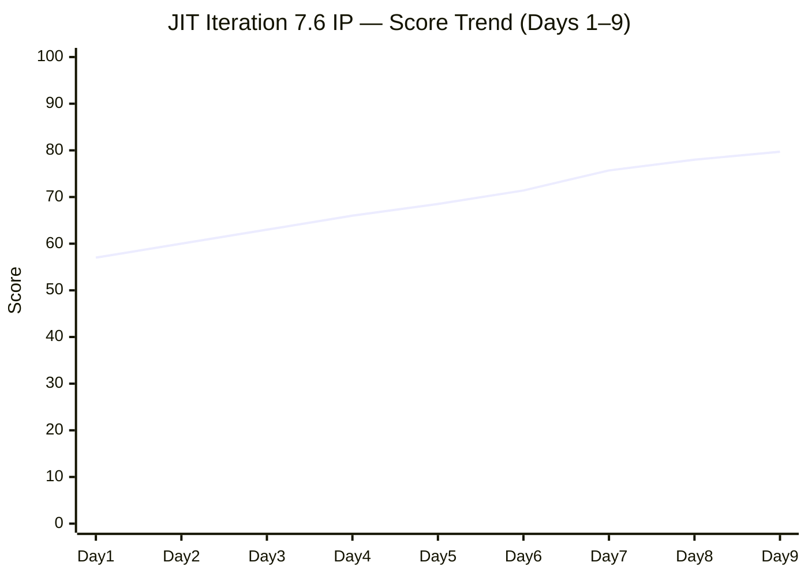
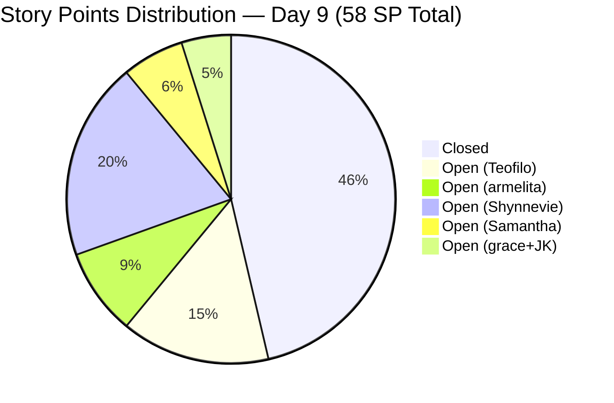

# SAFe Iteration Audit — JIT Training Operation Team

## 1. Audit Metadata

| Field | Value |
|-------|-------|
| **Project** | Jairo Institute of Technology |
| **Project ID** | `9cdd92ea-90e9-474c-8058-4a20700fcab4` |
| **Team** | JIT Training Operation Team |
| **Team ID** | `04d18034-97b9-42fb-87a1-c543c1cab628` |
| **Workspace** | `ado_jit` |
| **Iteration** | Iteration 7.6 (IP) — Innovation & Planning |
| **Iteration ID** | `366e60a5-536b-4ffd-b9f6-d139f377303d` |
| **Iteration Dates** | 2026-06-15 to 2026-06-28 |
| **Audit Date** | 2026-06-23 (Day 9 of 14) — Philippine Standard Time (UTC+8) |
| **Prior Audit Reference** | `AUDIT_20260622_0920.md` — Score 78.0 / Moderate |
| **Overall Score** | **79.7 / 100** |
| **Risk Band** | MODERATE (Yellow) — approaching Low threshold |

---

## 2. Executive Summary

The JIT Training Operation Team advances to **79.7 (Moderate)** on Day 9 — a **+1.7 point gain** from yesterday's 78.0. This is the highest score in the Iteration 7.6 (IP) series.

Two confirmed closures drive the improvement:
- **205405** — Bubble EBET Scholarship Batch 2 Training Enrollment Report (armelita, 2 SP) — CLOSED today
- **206659** — COC 2 Batch 3 Assessment Day (Teofilo, 4 SP) — CLOSED today (was Active yesterday)

Cumulative delivery now stands at **38 SP (13 items)** across 8 delivery days. Delivery Predictability rises to **65.5%** (from 55.2%). The required burn rate for full delivery is now 4.0 SP/day over 5 remaining days — achievable given the current average of 4.75 SP/day.

**206665** (3.1-1 Creating Active Directory Training, Teofilo) moved to **Active** today — Teofilo transitions immediately from COC 2 closure to the Active Directory training sequence.

Three persistent gaps remain: (1) **206147** (Shynnevie — Requirements Compilation) remains unestimated — Day 7; (2) **Jan Kenneth Gerona** capacity unconfigured — Day 9; (3) Shynnevie Fernandez has 0 closures across 7 items (16 SP) with 5 days remaining. The team needs to close 20 more SP in 5 days for full delivery — Shynnevie's sustained inactivity remains the critical risk.

---

## 3. Previous Audit Delta

| Dimension | Prior (2026-06-22) | Current (2026-06-23) | Delta | Note |
|-----------|---------------------|----------------------|-------|------|
| Iteration Planning | 42.9 | 45.0 | +2.1 | 18/40 — denominator dropped from 42 to 40 (2 new closures removed from backlog) |
| Team Capacity | 83.3 | 83.3 | 0.0 | Jan Kenneth still unconfigured — Day 9 |
| Estimation | 94.4 | 94.4 | 0.0 | 17/18 open items — 206147 still unestimated (Day 7) |
| DoR Compliance | 100.0 | 100.0 | 0.0 | 18/18 open items PASS; 206710 already closed |
| Work Item Balance | 70.0 | 70.0 | 0.0 | US dominance 13/18 = 72.2% > 60%; -30 penalty |
| Backlog Refinement | 100.0 | 100.0 | 0.0 | All 40 backlog items fresh; 0 stale; 1 untouched (5.6%) |
| Delivery Predictability | 55.2 | 65.5 | **+10.3** | 38/58 SP — 6 SP from today's 2 closures |
| **Overall** | **78.0** | **79.7** | **+1.7** | Moderate Risk — new sprint high |

**Key developments today:**
- **205405 CLOSED** — Bubble EBET Scholarship Batch 2 Training Enrollment Report (armelita, 2 SP). armelita's cumulative delivery now 9 SP (5 items).
- **206659 CLOSED** — COC 2 Batch 3 Assessment Day (Teofilo, 4 SP). Was Active yesterday. Teofilo's cumulative delivery now 28 SP (7 items).
- **206665 went Active** — 3.1-1 Creating Active Directory Training (Teofilo). Teofilo continues his unbroken delivery streak into the Active Directory sequence.

---

## 4. Current Iteration Snapshot

| Field | Value |
|-------|-------|
| **Iteration** | 7.6 (IP) — Innovation & Planning |
| **Start Date** | 2026-06-15 |
| **End Date** | 2026-06-28 |
| **Day in Sprint** | Day 9 of 14 |
| **Days Remaining** | 5 |
| **Total Visible Root Backlog Items** | 40 (was 42 on Day 8 — 2 closures removed) |
| **Root Items in Current Iteration (Open)** | 18 |
| **Items Closed Cumulative** | 13 |
| **User Stories (Open)** | 13 |
| **Training Items (Open)** | 4 (205886 Marketing, 206665 Active, 206666/206667 New) |
| **Spikes** | 0 |
| **Story Points Committed (Full Iteration)** | 58 SP (30/31 estimated; 206147 = 0 SP) |
| **Story Points Closed (Cumulative)** | 38 SP (13 items, Days 2–9) |
| **Story Points Open** | 20 SP |
| **Required Burn Rate** | 4.0 SP/day for 5 remaining days |
| **Current Average Rate** | 4.75 SP/day (38 SP / 8 delivery days) |
| **Iteration Goal** | Not defined |

### Contributor Summary — Current Iteration

| Contributor | Open Items | Open SP | SP Closed (Cumulative) | Configured Capacity | Status |
|-------------|------------|---------|------------------------|---------------------|--------|
| Teofilo Limpag | 3 (1 Active + 2 New) | 12 SP | **28 SP (7 items)** | 4.8 pts/day | Active Directory sequence underway |
| armelita | 3 (1 Active + 2 New) | 7 SP | **9 SP (5 items)** | 6.0 pts/day (day off Jun 26) |  |
| Shynnevie Fernandez | 7 (all New) | 16 SP | **0 SP** | 6.0 pts/day | Critical — 0 SP in 9 days |
| Samantha Babael | 1 (Marketing) | 5 SP | 1 SP | 6.0 pts/day | Bubble Training Batch 2 marketing |
| grace | 2 (1 Active + 1 New) | 4 SP | 0 SP | 1.5 pts/day | Graduation event + Payment Collection |
| Jan Kenneth Gerona | 1 (Ready for Dev) | 2 SP | 0 SP | **Not configured** | Unblocked — awaiting execution |

---

## 5. Work Item Analysis

### 5.1 Newly Closed Today (2 items, 6 SP)

| ID | Title | Type | SP | Assignee | Closed Date |
|----|-------|------|----|----------|-------------|
| 205405 | Bubble EBET Scholarship Batch 2 Training Enrollment Report | User Story | 2 | armelita | Jun 23 |
| 206659 | COC 2 Batch 3 Assessment Day | User Story | 4 | Teofilo Limpag | Jun 23 |

### 5.2 Cumulative Closed Items (13 items, 38 SP)

| ID | Title | Type | SP | Assignee | Date Closed |
|----|-------|------|----|----------|----|
| 205411 | NEMSU Interview and Onboarding | User Story | 1 | armelita | Jun 16 |
| 206187 | Assist in NEMSU Interns Onboarding | User Story | 1 | Samantha | Jun 16 |
| 205403 | Bubble EBET Scholarship Batch 2 TIP | User Story | 2 | armelita | Jun 17 |
| 206700 | CSS COC 2 Practice Day 1 — Network Cabling | Training | 4 | Teofilo | Jun 17 |
| 206701 | COC 2 Practice Day 2 — Router and Access Points | Training | 4 | Teofilo | Jun 17 |
| 205330 | CSS Batch 2 Terminal Report | User Story | 2 | armelita | Jun 17 |
| 206702 | COC 2 Practice Day 3 — Network Sharing & Firewall | Training | 4 | Teofilo | Jun 18 |
| 206703 | COC 2 Practice Day 4 — Remote Desktop | Training | 4 | Teofilo | Jun 19 |
| 205373 | CSS NC II Batch 2 Special Order Request | User Story | 2 | armelita | Jun 20 |
| 206704 | COC 2 Practice Day 5 — Complete Network Setup | Training | 4 | Teofilo | Jun 22 |
| 206710 | COC 2 Practice Day 6 — eLMS Review | Training | 4 | Teofilo | Jun 22 |
| **205405** | **Bubble EBET Scholarship Batch 2 Training Enrollment Report** | **User Story** | **2** | **armelita** | **Jun 23** |
| **206659** | **COC 2 Batch 3 Assessment Day** | **User Story** | **4** | **Teofilo** | **Jun 23** |

### 5.3 Open Items in Current Iteration — 18 Items

| ID | Title | Type | State | SP | Assignee | DoR | Changed |
|----|-------|------|-------|----|----------|-----|---------|
| 205390 | Bubble EBET Scholarship SO Request | US | New | 2 | armelita | PASS | Jun 15 |
| 205692 | BATCH 2 - BUBBLE.IO EBET Induction Training Prep | US | Active | — | Shynnevie | PASS | Jun 17 |
| 205701 | BATCH 2 - BUBBLE.IO EBET VIDEO REELS | US | New | 3 | Shynnevie | PASS | Jun 17 |
| 205703 | BATCH 2 - BUBBLE.IO EBET - ID for Scholar | US | New | 2 | Shynnevie | PASS | Jun 17 |
| 205687 | Jairosoft 1st Graduation June 2026 | US | Active | — | grace | PASS | Jun 17 |
| 205886 | Bubble Training Batch 2 | Training | Marketing | 5 | Samantha | PASS | Jun 17 |
| 206059 | Category-Item Relationship Management | US | Ready for Dev | 2 | Jan Kenneth | PASS | Jun 17 |
| 206147 | Batch 2 - Requirements Compilation | US | New | **0** | Shynnevie | PASS | Jun 12 |
| 206335 | Web Dev Bubble.io EBET Training Requirements | US | Active | 3 | armelita | PASS | Jun 17 |
| 206340 | Web Dev Bubble.io EBET Batch 2 Terminal Reports | US | New | 2 | armelita | PASS | Jun 17 |
| 206343 | MARKET - CSS BATCH 4 | US | New | 3 | Shynnevie | PASS | Jun 17 |
| 206364 | Create Enrollment G-Forms for CSS BATCH 4 | US | New | 2 | Shynnevie | PASS | Jun 17 |
| 206374 | Payment Collection | US | Active | 2 | grace | PASS | Jun 17 |
| 206513 | TRAINING FOR EBET | US | New | 4 | Shynnevie | PASS | Jun 17 |
| 206518 | Create Brochure | US | New | 2 | Shynnevie | PASS | Jun 17 |
| **206665** | **3.1-1 Creating Active Directory Training** | **Training** | **Active** | 4 | **Teofilo** | PASS | **Jun 23** |
| 206666 | 3.1-2 Create Active Directory User Accounts | Training | New | 4 | Teofilo | PASS | Jun 17 |
| 206667 | 3.1-3 Create Active Directory Security | Training | New | 4 | Teofilo | PASS | Jun 17 |

**Bold** = state changes since prior audit

**Ongoing gaps:**
- **206147** — Shynnevie's Requirements Compilation: 0 SP (unestimated since Day 3, Day 7 now)
- **Jan Kenneth Gerona** — capacity not configured (Day 9)
- **Shynnevie Fernandez** — 0 closures in 9 days; 7 items / 16 SP all untouched

---

## 6. SAFe Compliance Scorecard

| Dimension | Score | Evidence | Notes |
|-----------|-------|----------|-------|
| Iteration Planning | **45.0** | 18/40 visible backlog items in current iteration | +2.1 from Day 8 — denominator dropped from 42 to 40 |
| Team Capacity | **83.3** | 5/6 contributors configured; Jan Kenneth missing | Day 9 — unconfigured 9 consecutive days |
| Estimation | **94.4** | 17/18 open iteration items have SP > 0 | 206147 (Shynnevie) unestimated — Day 7 |
| DoR Compliance | **100.0** | 18/18 open items pass desc ≥ 30 + AC ≥ 20 | DoR gap eliminated (206710 closed Day 8) |
| Work Item Balance | **70.0** | US share = 13/18 = 72.2% > 60%; -30 penalty | Training (4 items) provides type diversity |
| Backlog Refinement | **100.0** | 40/40 items fresh; 0 stale_90; 0 stale_180; 1 untouched (5.6%) | Under 10% untouched threshold; no penalty |
| Delivery Predictability | **65.5** | 38/58 SP closed (13 items) | +10.3 pts — 6 SP from today's 2 closures |
| **Overall** | **79.7** | (45.0+83.3+94.4+100.0+70.0+100.0+65.5)/7 = 557.2/7 | Moderate Risk (Yellow) — sprint high |

---

## 7. Dimension Findings

### 7.1 Iteration Planning — 45.0 (High Risk — Slight Improvement)
Iteration Planning improved from 42.9 to 45.0 as the visible backlog shrinks with each closure. The 22-item backlog overhang in non-current paths remains the structural suppressor. With 5 days of IP sprint remaining, this is the correct window to triage backlog items in other iterations (7.4, 7.5, and unassigned PI7 items) to improve planning alignment for the next PI.

### 7.2 Team Capacity — 83.3 (Moderate — Escalation Day 9)
Jan Kenneth Gerona remains unconfigured for **nine consecutive days**. Item 206059 (Category-Item Relationship Management, 2 SP, Ready for Dev) awaits execution but the contributor has no capacity plan. With 5 days remaining, Jan Kenneth should be either: (a) configured in capacity and mobilized to execute 206059, or (b) 206059 reassigned to a configured contributor.

Armelita's day off (Jun 26) remains on record — reducing her effective remaining days to 4.

### 7.3 Estimation — 94.4 (Strong — Persistent Single Gap)
Item 206147 (Shynnevie — Batch 2 Requirements Compilation) has been unestimated for 7 consecutive audit cycles. This is a one-field edit. The item's DoR fields both pass. This gap should have been remediated on Day 3 and is now a pattern-level concern about Shynnevie's engagement.

### 7.4 DoR Compliance — 100.0 (Strong)
All 18 open current-iteration items pass both description (≥ 30 non-whitespace chars) and AC (≥ 20 non-whitespace chars). DoR has been at 100.0 since Day 8 (when 206710 closed).

### 7.5 Work Item Balance — 70.0 (Moderate)
User Stories represent 13/18 = 72.2% of open iteration items, holding above the 60% dominant-type threshold (-30 penalty). Training items (4) provide meaningful type diversity aligned with JIT's training mandate. No Spikes are present. The concentration is operationally appropriate for this team's work type.

### 7.6 Backlog Refinement — 100.0 (Strong)
All 40 visible backlog items have been modified within the 45-day freshness window. Zero items exceed the stale_90 or stale_180 thresholds. Item 206147 (ChangedDate Jun 12 — 3 days before sprint start) remains the only untouched item at 1/18 = 5.6% of current iteration items — below the 10% penalty threshold.

### 7.7 Delivery Predictability — 65.5 (Improving — Critical Watch)
The team has closed 38 SP across 13 items in 8 delivery days. Average velocity is 4.75 SP/day, which exceeds the required rate of 4.0 SP/day for the 20 remaining open SP. **If the current pace holds, the team is on track to close all 20 remaining SP in the final 5 days.**

However, this optimistic trajectory depends on Shynnevie Fernandez executing on her 7 open items (16 SP). Teofilo's Active Directory sequence alone can contribute 4+4+4 = 12 SP over 3 days. armelita has 7 SP remaining. Combined non-Shynnevie ceiling: 38 + 7 + 12 = 57 SP → 98% delivery (without Shynnevie). The ceiling with Shynnevie = 100%.

Teofilo's activation of 206665 today signals continued momentum. armelita's 206335 (Active) is the next expected closure.

---

## 8. Risks and Bottlenecks

| Risk | Severity | Details |
|------|----------|---------|
| Shynnevie Fernandez — 0 SP in 9 days | CRITICAL | 7 items / 16 SP all still New or Active(start). 5 days left — max Shynnevie delivery ceiling is 16 SP. |
| Jan Kenneth Unconfigured — Day 9 | HIGH | 206059 unblocked but contributor has no capacity plan. If unresolved today, 2 SP likely spills. |
| 206147 Unestimated — Day 7 | MODERATE | Pattern concern: 7 cycles without SP. Reflects Shynnevie's backlog ownership gap. |
| Iteration Planning Low (45.0) | MODERATE | 22 backlog items not in current sprint; IP window for triage is closing. |
| No Iteration Goal | MODERATE | Persistent across entire PI7 series — no sprint goal defined. |
| armelita Day Off Jun 26 | LOW | 4 effective days remaining; 7 SP open — within her capacity budget. |

---

## 9. Prioritized Recommendations

| Priority | Action | Owner | Target |
|----------|--------|-------|--------|
| P1 | Shynnevie: Begin execution on any one of her 7 items today (Day 9) — move to Active state | Shynnevie | Jun 23 |
| P1 | 206147: Add Story Points to Shynnevie's Requirements Compilation item — 1 field edit | Shynnevie | Jun 23 |
| P1 | Jan Kenneth: Configure capacity in ADO OR reassign 206059 to a configured contributor | armelita/Ramon | Jun 23 |
| P2 | Teofilo: Continue Active Directory sequence — 206666 should begin when 206665 closes (expected Jun 24) | Teofilo | Jun 24 |
| P2 | Triage the 22 non-iteration backlog items (203245, 203250, 204321, 204722, 204736, 204737, etc.) for PI8 or close | armelita | Jun 25–26 |
| P3 | Define an iteration goal for the remaining 5 days of Iteration 7.6 IP | Ramon/armelita | Jun 23 |

---

## 10. Evidence Gaps and Limitations

| Gap | Impact | Note |
|-----|--------|------|
| Individual SP values for open items not all verified in this audit | Low — prior audit verified 17/18; only 206147 = 0 | Estimation score based on prior audit + today's batch state data |
| ChangedDate for individual open items not pulled in this audit | Low — prior audit established all items as fresh | Backlog Refinement score inherited from Day 8 + confirmed no new items added |
| Jan Kenneth's item 206059 SP/DoR not re-verified today | Low — verified in prior audit | Score stable |

---

## Appendix: Score Trend and Delivery Burndown





```mermaid
bar
    title Delivery by Contributor (Cumulative SP Closed, Day 9)
    x-axis [Teofilo, armelita, Samantha, Shynnevie, grace, "Jan Kenneth"]
    y-axis "SP Closed" 0 --> 30
    bar [28, 9, 1, 0, 0, 0]
```
