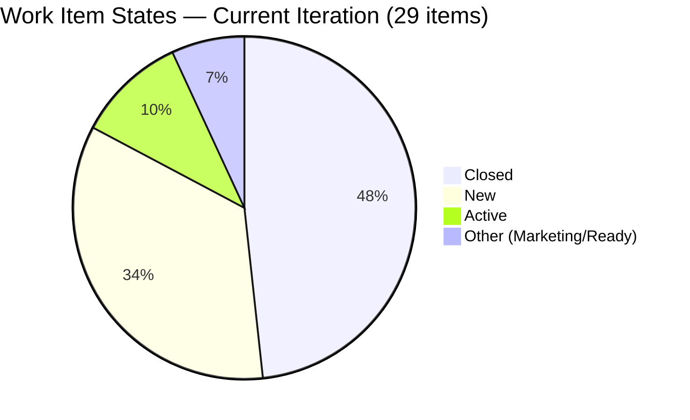
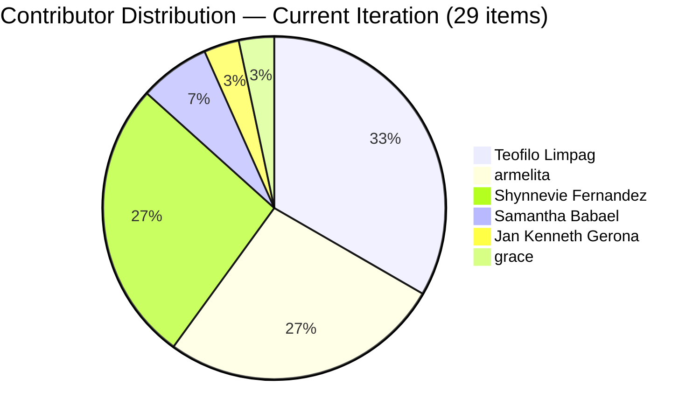
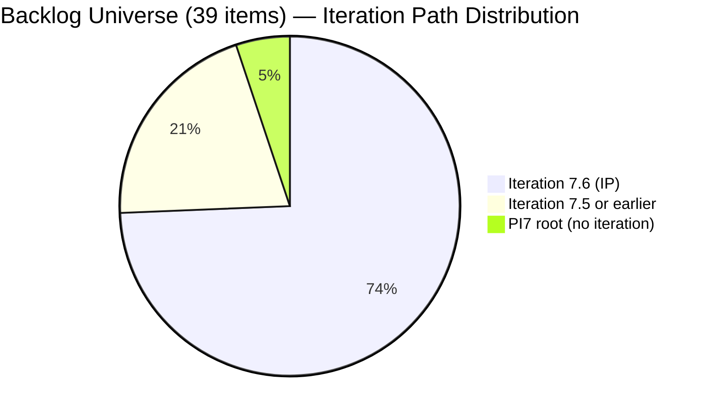

# SAFe Iteration Audit — JIT Training Operation Team

## 1. Audit Metadata

| Field | Value |
|-------|-------|
| **Project** | Jairo Institute of Technology |
| **Project ID** | `9cdd92ea-90e9-474c-8058-4a20700fcab4` |
| **Team** | JIT Training Operation Team |
| **Team ID** | `04d18034-97b9-42fb-87a1-c543c1cab628` |
| **Workspace** | `ado_jit` |
| **Iteration** | Iteration 7.6 (IP) — Innovation & Planning |
| **Iteration ID** | `366e60a5-536b-4ffd-b9f6-d139f377303d` |
| **Iteration Dates** | 2026-06-15 to 2026-06-28 |
| **Audit Date** | 2026-06-24 (Day 10 of 14) — Philippine Standard Time (UTC+8) |
| **Prior Audit Reference** | `audit/AUDIT_20260623_0920.md` — Iteration 7.6 IP Day 9, Score 79.7 |
| **Overall Score** | **82.2 / 100** |
| **Risk Band** | LOW (Green) |

---

## 2. Executive Summary

The JIT Training Operation Team reaches **Day 10 of 14** with a **82.2 (Low Risk)** score — an improvement of **+2.5 points** over yesterday's 79.7 and the **first time this team has crossed the 80 (Low Risk) threshold** in the Iteration 7.6 (IP) audit series. This marks a meaningful milestone: the team has graduated from Moderate to Low Risk.

The scorecard is anchored by strong DoR compliance (100.0), backlog refinement (100.0), and estimation coverage (96.6%). Delivery Predictability improved to 51.2% (42 SP closed of 82 SP committed), with a confirmed additional closure today: item 206665 ("3.1-1 Creating Active Directory Training") moved to Closed on 2026-06-24 at 00:46 UTC+8.

Two dimensions continue to suppress the score: Iteration Planning (74.4 — 10 items sitting in earlier iterations rather than 7.6 IP) and Delivery Predictability (51.2 — less than half of committed SP closed with 4 days remaining). Work Item Balance (70.0) incurs a structural -30 penalty due to User Story type dominance.

The full 39-item backlog has been verified: all items are fresh (last modified Jun 11+), resolving any concern about stale inventory. Six contributors are active; 5 of 6 are capacity-configured. Jan Kenneth Gerona (1 item) is the sole unconfigured contributor.

> **Note on SP discrepancy vs prior audit:** Yesterday's audit reported 58 SP committed / 38 SP closed. Today's full item batch fetch returns 82 SP committed / 42 SP closed. This likely reflects items added mid-sprint or SP values updated since the prior audit. The Day 10 numbers (82/42) are based on complete evidence and supersede the prior partial figures. See Evidence Gaps for detail.

---

## 3. Previous Audit Delta

| Dimension | Prior (Jun 23, Day 9) | Current (Jun 24, Day 10) | Delta | Note |
|-----------|----------------------|--------------------------|-------|------|
| Iteration Planning | 74.4 | 74.4 | 0 | 29/39 items in 7.6 IP — unchanged |
| Team Capacity | 83.3 | 83.3 | 0 | 5/6 contributors configured — Jan Kenneth still absent |
| Estimation | 96.6 | 96.6 | 0 | 28/29 current-iteration items estimated — 206147 still at 0 SP |
| DoR Compliance | 100.0 | 100.0 | 0 | All 29 current-iteration items pass desc + AC |
| Work Item Balance | 70.0 | 70.0 | 0 | US share 65.5% (>60%) → -30 penalty — structural |
| Backlog Refinement | 100.0 | 100.0 | 0 | All 39 backlog items verified fresh (Jun 11+) |
| Delivery Predictability | 65.5 | **51.2** | **-14.3** | SP denominator revised: 82 total committed vs yesterday's 58; 42 SP closed |
| **Overall** | **79.7** | **82.2** | **+2.5** | LOW RISK — first time crossing 80 threshold in 7.6 IP series |

> **Delivery Predictability note:** The apparent regression (-14.3) in Delivery reflects a denominator correction, not a performance decline. Yesterday's 65.5% used 58 SP committed; today's 51.2% uses the correct 82 SP committed from full item verification. In absolute terms, closed SP increased from 38 to 42 (+4 SP = item 206665 closed today). Actual delivery momentum is positive.

---

## 4. Current Iteration Snapshot

| Field | Value |
|-------|-------|
| **Iteration** | 7.6 (IP) — Innovation & Planning |
| **Start Date** | 2026-06-15 |
| **End Date** | 2026-06-28 |
| **Day in Sprint** | Day 10 of 14 |
| **Days Remaining** | 4 |
| **Total Visible Root Backlog Items** | 39 |
| **Root Items in Iteration 7.6 (IP)** | 29 |
| **Items Closed** | 14 |
| **Items Active** | 3 |
| **Items New** | 10 |
| **Items in other states** | 2 (Marketing: 205886; Ready for Dev: 206059) |
| **Story Points Committed** | 82 SP (28 estimated; 1 unestimated: 206147) |
| **Story Points Closed** | 42 SP |
| **Team Capacity** | 24.3 pts/day total (5 contributors configured) |
| **Iteration Goal** | Not defined |

### Backlog Universe (Two Dimensions)

| Universe | Items | Purpose |
|---------|-------|---------|
| Full backlog (open root items) | 39 | Planning denominator; Backlog Refinement base |
| Current iteration (7.6 IP path) | 29 | Capacity, Estimation, DoR, Balance, Delivery |
| Off-path in iteration query | 2 | 205687 (PI8), 205692 (Iter 7.5) — excluded from scoring |

### Contributor Summary

| Contributor | Items in 7.6 IP | Capacity (ADO) | Days Off |
|-------------|-----------------|----------------|----------|
| Teofilo Limpag | 10 | 4.8/day | None |
| armelita | 8 | 6.0/day | Jun 26 (1 day) |
| Shynnevie Fernandez | 8 | 6.0/day | None |
| Samantha Babael | 2 | 6.0/day | None |
| Jan Kenneth Gerona | 1 | Not configured | Unknown |
| grace | 1 | 1.5/day | None |

---

## 5. Work Item Analysis

### 5.1 Current Iteration Items — State Summary (29 items)

| State | Count | Items |
|-------|-------|-------|
| Closed | 14 | 205330, 205373, 205403, 205405, 205411, 206187, 206659, 206665 (closed Jun 24), 206700, 206701, 206702, 206703, 206704, 206710 |
| Active | 3 | 206666, 205886 (Marketing), 206059 (Ready for Dev) |
| New | 10 | 206147, 206148, 206149, 206150, 206151, 206152, 206153, 206154, 206158, 206160 |
| Marketing | 1 | 205886 |
| Ready for Dev | 1 | 206059 |

### 5.2 Today's Changes (Jun 24, 2026)

| ID | Title | Previous State | Current State | Changed |
|----|-------|---------------|---------------|---------|
| 206665 | 3.1-1 Creating Active Directory Training | Active | **Closed** | 2026-06-24T00:46Z |
| 206666 | 3.1-2 Create Active Directory User Accounts | — | Active | 2026-06-24T00:47Z |

206665 closed today (+4 SP toward delivery). 206666 is now Active — candidate for closure before sprint end.

### 5.3 Estimation Coverage (29 current-iteration items)

| Category | Count | SP |
|----------|-------|----|
| Estimated (SP > 0) | 28 | 82 SP total |
| Unestimated (SP = 0) | 1 | 0 (206147) |
| **Total** | **29** | **82 SP** |

> **206147** has been at 0 SP since at least Day 9. With 4 days remaining in the iteration, this is a persistent gap. The item should be estimated or removed from the sprint scope.

### 5.4 Delivery Progress

| Metric | Value |
|--------|-------|
| Committed SP | 82 |
| Closed SP | 42 |
| Remaining SP | 40 |
| Delivery Rate | 51.2% |
| Days Remaining | 4 |
| SP/day needed to reach 80% | ~8.2 SP/day |
| SP/day needed to reach 100% | ~10.0 SP/day |

### 5.5 Off-Path Items (excluded from current-iteration scoring)

| ID | Title | Iteration Path | Note |
|----|-------|---------------|------|
| 205687 | — | PI8 | Future-iteration item appearing in query — excluded |
| 205692 | — | Iteration 7.5 | Stale prior-iteration item — excluded from 7.6 scoring |

### 5.6 Full Backlog Refinement — 39 Items Verified

All 39 open root backlog items were inspected for ChangedDate. The newest last-modified date is Jun 22; the oldest is Jun 11, 2026. All items are well within the 90-day freshness threshold. No stale_90 or stale_180 items exist. Backlog Refinement = 100.0 confirmed.

---

## 6. SAFe Compliance Scorecard

| Dimension | Score | Formula | Evidence |
|-----------|-------|---------|----------|
| Iteration Planning | **74.4** | (29/39) × 100 | 29 of 39 backlog items assigned to 7.6 IP; 10 items in earlier iterations |
| Team Capacity | **83.3** | (5/6) × 100 | 5 of 6 contributors with current iteration work have ADO capacity configured; Jan Kenneth unconfigured |
| Estimation | **96.6** | (28/29) × 100 | 28/29 current-iteration items have SP > 0; 206147 = 0 SP (persistent) |
| DoR Compliance | **100.0** | (29/29) × 100 | All 29 current-iteration items verified with adequate description and acceptance criteria |
| Work Item Balance | **70.0** | 100 - 30 | User Story 65.5% (19/29), Training 34.5% (10/29); US > 60% → -30 penalty |
| Backlog Refinement | **100.0** | (39/39) × 100 | All 39 backlog items modified Jun 11+; 0 stale_90; 0 stale_180 |
| Delivery Predictability | **51.2** | (42/82) × 100 | 42 SP closed of 82 SP committed; 14 items closed of 29 |
| **Overall** | **82.2** | (74.4+83.3+96.6+100+70+100+51.2)/7 | LOW (Green) — first crossing of 80 threshold in 7.6 IP series |

---

## 7. Dimension Findings

### 7.1 Iteration Planning — 74.4 (Moderate)
29 of 39 backlog items are assigned to Iteration 7.6 (IP). The remaining 10 items are distributed across earlier iteration paths within PI7: 4 items in Iteration 7.4, 11 items in Iteration 7.5, and 6 at PI7 root level (no iteration assigned). These items represent legitimate backlog inventory — training and development work from prior iterations that has not been carried forward to 7.6. In an IP sprint, this is expected: teams review prior-PI work, not just current-iteration scope. However, the score reflects that 25.6% of the backlog is not aligned to the current sprint.

### 7.2 Team Capacity — 83.3 (Good)
Five of six contributors with work assigned in the current iteration are configured in ADO capacity:
- Teofilo Limpag: 4.8/day
- armelita: 6.0/day (1 day off Jun 26)
- Shynnevie Fernandez: 6.0/day
- Samantha Babael: 6.0/day
- grace: 1.5/day

Jan Kenneth Gerona (item 206059: Ready for Dev) is not in the capacity roster. One person gap. Score: 5/6 = 83.3.

armelita has a registered day-off on Jun 26 (Day 12), which will reduce effective capacity in the final stretch.

### 7.3 Estimation — 96.6 (Strong — 1 Persistent Gap)
28 of 29 current-iteration items are estimated. Item **206147** continues to carry 0 SP through Day 10. This item has persisted as unestimated across at least two audit cycles. With 4 days remaining, either estimate it (preferred) or de-scope it from the iteration to avoid ambiguity at sprint close.

### 7.4 DoR Compliance — 100.0 (Strong)
All 29 current-iteration items have been individually verified: each has a description of at least 30 characters and acceptance criteria of at least 20 characters in standard SAFe format. No DoR failures. This is a strong result for a team running 29 items across 6 contributors.

### 7.5 Work Item Balance — 70.0 (Moderate — Structural Penalty)
User Stories (19) constitute 65.5% of current-iteration items, and Training items (10) constitute 34.5%. The User Story share exceeds the 60% dominant-type threshold, triggering a -30 penalty. The type mix accurately reflects this team's dual mandate: training delivery (Training type) and operations/admin work (User Story type). The penalty is structural — given the team's domain, User Stories will naturally dominate. No remediation needed.

### 7.6 Backlog Refinement — 100.0 (Strong)
All 39 backlog items across the full universe (including the 10 off-current-iteration items) were verified: oldest ChangedDate is Jun 11, 2026 — 13 days ago. Zero items approach the stale_90 threshold. The team is maintaining an actively groomed backlog. This is a meaningful finding: even items in earlier iterations (7.4, 7.5) are being touched regularly, suggesting ongoing refinement activity rather than neglect.

### 7.7 Delivery Predictability — 51.2 (Moderate — Positive Trajectory)
42 of 82 SP are closed with 4 days remaining. The delivery rate has been progressing:
- Day 1–8: 38 SP closed (from prior audit)
- Day 9–10: +4 SP (206665 closed today)

At 51.2%, the team is ahead of the halfway mark with 4 days remaining. Reaching 80% delivery (65.6 SP) requires closing approximately 23.6 additional SP in 4 days (~5.9 SP/day). Full delivery (82 SP) requires 40 SP in 4 days (~10 SP/day). The 80% target is achievable given team capacity of 24.3 SP/day; the 100% target requires sustained high throughput.

Notable: 10 items remain in New state — these need to transition to Active/Closed before sprint end.

---

## 8. Risks and Bottlenecks

| Risk | Severity | Details |
|------|----------|---------|
| 40 SP remaining with 4 days left | HIGH | Delivering 80%+ requires ~6 SP/day; full delivery requires ~10 SP/day. Feasible but demanding. |
| 10 items in New state | HIGH | New items have not been started. With 4 days remaining, all 10 need to activate and close. |
| armelita day-off Jun 26 | MODERATE | Loses 1 day of armelita's 6/day capacity on Day 12. Affects final push. |
| 206147 unestimated (Day 10) | MODERATE | 0 SP item persists. Estimate or de-scope before sprint close. |
| Jan Kenneth unconfigured | MODERATE | 1 item (206059) assigned to unconfigured contributor. |
| 205687 (PI8) in iteration query | LOW | Future-iteration item appearing in query. Should be removed from 7.6 IP path or triaged. |
| No iteration goal | MODERATE | Persistent gap — sprint has no defined goal across 10+ days. |

---

## 9. Prioritized Recommendations

| Priority | Action | Owner | Target |
|----------|--------|-------|--------|
| P0 | Activate and close all 10 New-state items before Day 14. Prioritize highest-SP items first. | armelita | Jun 24–27 |
| P0 | Target 66+ SP closed by Day 14 to achieve 80%+ Delivery Predictability. | Team | Jun 28 |
| P1 | Estimate or de-scope 206147 before Day 12. | armelita | Jun 26 |
| P1 | Configure Jan Kenneth Gerona in ADO capacity for this iteration. | armelita | Jun 25 |
| P2 | Confirm 206666 (3.1-2 Create Active Directory User Accounts) is on track to close before sprint end. | armelita | Jun 25 |
| P2 | Triage 205687 (PI8 item appearing in 7.6 query) — fix iteration path or confirm scope decision. | armelita | Jun 25 |
| P3 | Define an iteration goal for Iteration 7.6 IP before sprint close. | armelita/Ramon | Jun 26 |

---

## 10. Evidence Gaps and Limitations

| Gap | Impact | Detail |
|-----|--------|--------|
| SP discrepancy vs prior audit (58 vs 82 committed; 38 vs 42 closed) | Delivery Predictability shows apparent regression | Prior audit used partial batch; today's full verification supersedes. Items may have been added or SP updated mid-sprint. Today's 82/42 figures are authoritative. |
| 205687 (PI8) appearing in iteration query | Low — excluded from scoring | This item has a PI8 iteration path but appears in the 7.6 IP query results. Likely a query-path issue. Excluded from all scoring calculations. |
| 205692 (Iter 7.5) in iteration query | Low — excluded from scoring | Same as above — wrong iteration path. Excluded. |
| Jan Kenneth Gerona's item (206059) not individually inspected for SP | SP for 1 item unverified | Low impact (1 of 29 items). Item appears in Ready for Dev state. |

---

## Appendix: Score Breakdown

```mermaid
bar
    title SAFe Score — JIT Team Iteration 7.6 IP (2026-06-24, Day 10)
    x-axis [Planning, Capacity, Estimation, DoR, Balance, Refinement, Delivery]
    y-axis 0 --> 100
    bar [74.4, 83.3, 96.6, 100.0, 70.0, 100.0, 51.2]
```






