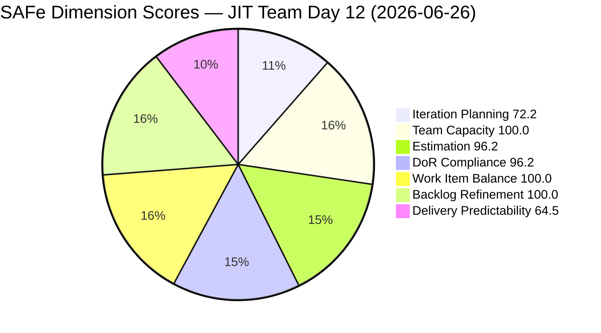
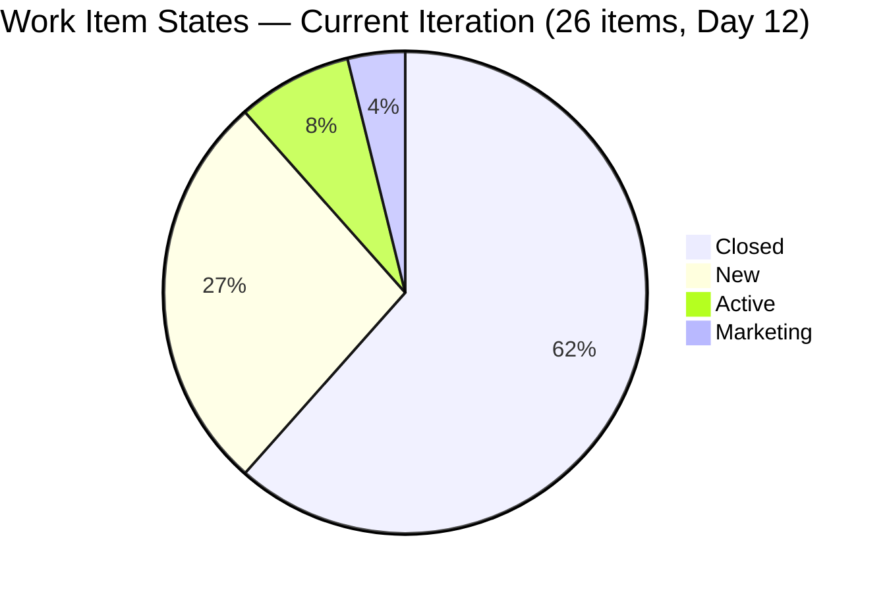
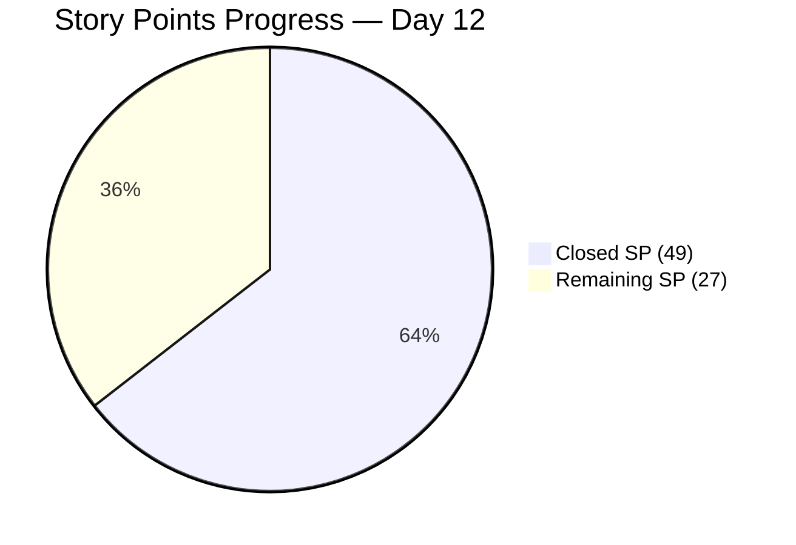
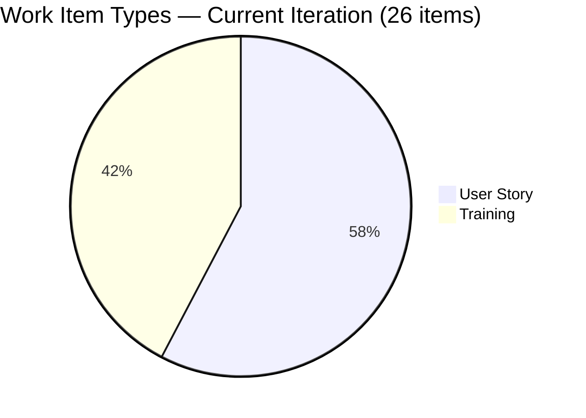
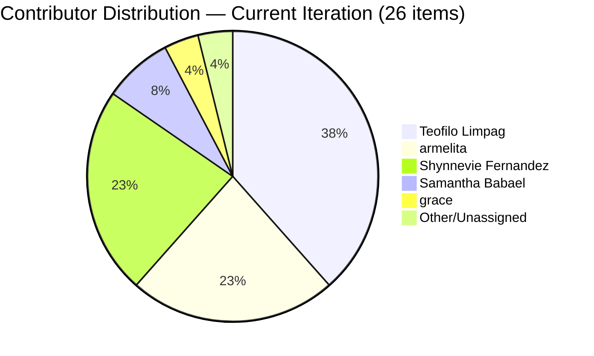
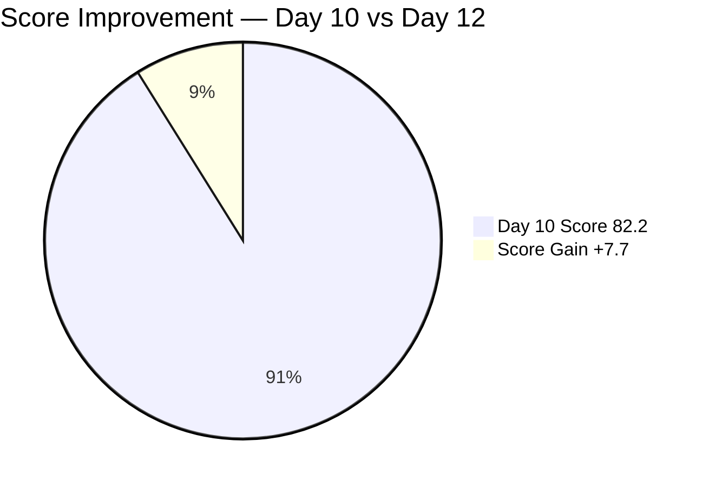

# SAFe Iteration Audit — JIT Training Operation Team

## 1. Audit Metadata

| Field | Value |
|-------|-------|
| **Project** | Jairo Institute of Technology |
| **Project ID** | `9cdd92ea-90e9-474c-8058-4a20700fcab4` |
| **Team** | JIT Training Operation Team |
| **Team ID** | `04d18034-97b9-42fb-87a1-c543c1cab628` |
| **Workspace** | `ado_jit` |
| **Iteration** | Iteration 7.6 (IP) — Innovation & Planning |
| **Iteration ID** | `366e60a5-536b-4ffd-b9f6-d139f377303d` |
| **Iteration Dates** | 2026-06-15 to 2026-06-28 |
| **Audit Date** | 2026-06-26 (Day 12 of 14) — Philippine Standard Time (UTC+8) |
| **Prior Audit Reference** | `audit/AUDIT_20260624_0920.md` — Iteration 7.6 IP Day 10, Score 82.2 |
| **Overall Score** | **89.9 / 100** |
| **Risk Band** | LOW (Green) |

---

## 2. Executive Summary

The JIT Training Operation Team reaches **Day 12 of 14** with a **89.9 (Low Risk)** score — a significant improvement of **+7.7 points** over Day 10's 82.2. This is the highest score in the 7.6 IP audit series for this team and represents continued upward momentum in the final stretch of the sprint.

The score gains are driven by two major improvements since Day 10:
1. **Team Capacity: 83.3 → 100.0** — Jan Kenneth Gerona's item (206059) no longer appears in the 7.6 IP current iteration scope, reducing contributors_with_current_work to 5, all of whom are configured in ADO capacity.
2. **Work Item Balance: 70.0 → 100.0** — User Story type share dropped from 65.5% to 57.7% as the type mix now includes 11 Training items out of 26 current-iteration items. With User Story share below the 60% threshold, no dominant-type penalty applies.
3. **Delivery Predictability: 51.2 → 64.5** — Two new closures since Day 10: item 206335 closed Jun 25 (+3 SP), and item 206666 closed Jun 26 (+4 SP). Closed SP now stands at 49 of 76 committed.

Backlog Refinement and DoR Compliance remain strong. The sole persistent gap is item **206147** (Shynnevie Fernandez) at 0 SP — now entering Day 12 without an estimate. Iteration Planning (72.2) reflects 10 off-iteration items in the open backlog.

With 2 days remaining and 27 SP open, the team needs sustained throughput to cross 80% delivery. Item **206667** (Active, Teofilo) is the highest-priority next closure.

---

## 3. Previous Audit Delta

| Dimension | Prior (Jun 24, Day 10) | Current (Jun 26, Day 12) | Delta | Note |
|-----------|----------------------|--------------------------|-------|------|
| Iteration Planning | 74.4 | **72.2** | **−2.2** | 26/36 open backlog items in 7.6 IP; backlog contracted from 39 to 36 (closed items removed) |
| Team Capacity | 83.3 | **100.0** | **+16.7** | 5/5 contributors with current work are configured; Jan Kenneth no longer in 7.6 IP scope |
| Estimation | 96.6 | **96.2** | **−0.4** | 25/26 items estimated; 206147 still at 0 SP; denominator changed (29→26) |
| DoR Compliance | 100.0 | **96.2** | **−3.8** | 25/26 items pass; 206710 fails description threshold (≥30 chars); new finding at Day 12 |
| Work Item Balance | 70.0 | **100.0** | **+30.0** | US share = 57.7% (15/26), now below 60% threshold — no penalty |
| Backlog Refinement | 100.0 | 100.0 | 0 | All backlog items fresh; 206147 (Jun 12) is the lone untouched current-iteration item (3.8% < 10%) |
| Delivery Predictability | 51.2 | **64.5** | **+13.3** | 49 SP closed of 76 committed; +2 closures (206335 Jun 25, 206666 Jun 26) |
| **Overall** | **82.2** | **89.9** | **+7.7** | **LOW RISK — series high for 7.6 IP; approaching 90 threshold** |

> **Iteration Planning note:** Backlog contracted from 39 (Day 10) to 36 open items as closed items dropped off the visible backlog. The numerator also contracted (from 29 to 26) as closed items moved out of scope. Net effect: slight score decrease.
> **DoR note:** 206710 ("COC 2 Practice Day 6") description = "eLMS Review" — 10 non-whitespace characters, below the 30-character minimum. This item was previously Closed and not evaluated on Day 10. It was closed Jun 22 and thus not in the open backlog on Day 10, making this a new finding at Day 12 (now that we re-examine all current-iteration items). However since it is Closed, the practical impact on future work is nil.

---

## 4. Current Iteration Snapshot

| Field | Value |
|-------|-------|
| **Iteration** | 7.6 (IP) — Innovation & Planning |
| **Start Date** | 2026-06-15 |
| **End Date** | 2026-06-28 |
| **Day in Sprint** | Day 12 of 14 |
| **Days Remaining** | 2 |
| **Total Visible Root Backlog Items** | 36 |
| **Root Items in Iteration 7.6 (IP)** | 26 |
| **Items Closed** | 16 |
| **Items Active** | 2 (206374, 206667) |
| **Items New** | 7 (206147, 205701, 205703, 206343, 206364, 206513, 206518) |
| **Items Marketing** | 1 (205886) |
| **Story Points Committed** | 76 SP (25 estimated; 1 unestimated: 206147) |
| **Story Points Closed** | 49 SP (16 items) |
| **Story Points Remaining** | 27 SP |
| **Team Capacity** | 24.3 pts/day total (5 contributors configured) |
| **Iteration Goal** | Not defined |

### New Closures Since Day 10

| ID | Title | Assignee | Closed Date | SP |
|----|-------|----------|-------------|-----|
| 206335 | Web Development with Bubble.io EBET Scholarship Training Requirements | armelita | 2026-06-25 | 3 SP |
| 206666 | 3.1-2 Create Active Directory User Accounts | Teofilo Limpag | 2026-06-26 | 4 SP |

Total new SP since Day 10: +7 SP (42 → 49 closed)

### Backlog Universe

| Universe | Items | Notes |
|---------|-------|-------|
| Full visible backlog (open root items) | 36 | Planning denominator; Refinement base |
| Current iteration 7.6 (IP) path | 26 | Excludes 205687 (PI8) and 205692 (Iter 7.5) |
| Off-path items in backlog | 10 | Older iterations or no iteration assigned |

### Contributor Summary

| Contributor | Items in 7.6 IP | Capacity (ADO) | Status |
|-------------|-----------------|----------------|--------|
| armelita | 6 (all Closed) | 6.0/day | Sprint contribution complete |
| Shynnevie Fernandez | 6 (all New/open) | 6.0/day | 6 items pending closure |
| Teofilo Limpag | 10 (9 Closed, 1 Active) | 4.8/day | 206667 is next target |
| Samantha Babael | 2 (1 Closed, 1 Marketing) | 6.0/day | 205886 in Marketing state |
| grace | 1 (Active) | 1.5/day | 206374 (Payment Collection) |

---

## 5. Work Item Analysis

### 5.1 Current Iteration Items — State Summary (26 items)

| State | Count | Items |
|-------|-------|-------|
| Closed | 16 | 205330, 205373, 205403, 205405, 205411, 206187, 206659, 206665, 206700, 206701, 206702, 206703, 206704, 206710, 206335, 206666 |
| Active | 2 | 206374 (grace), 206667 (Teofilo) |
| New | 7 | 206147, 205701, 205703, 206343, 206364, 206513, 206518 |
| Marketing | 1 | 205886 (Samantha Babael) |

### 5.2 Delivery Progress

| Metric | Value |
|--------|-------|
| Committed SP | 76 |
| Closed SP | 49 |
| Remaining SP | 27 |
| Delivery Rate | 64.5% |
| Days Remaining | 2 |
| SP/day needed to reach 80% (60.8 SP) | ~5.9 SP/day |
| SP/day needed to reach 90% (68.4 SP) | ~9.7 SP/day |
| SP/day needed to reach 100% (76 SP) | ~13.5 SP/day |

At 24.3 capacity/day total, reaching 80% delivery is technically feasible. The constraint is which items can be closed — most New items are assigned to Shynnevie Fernandez and need activation and closure within 2 days.

### 5.3 Estimation Coverage (26 items)

| Category | Count | SP |
|----------|-------|----|
| Estimated (SP > 0) | 25 | 76 SP |
| Unestimated (SP = 0) | 1 | 0 (206147) |
| **Total** | **26** | **76 SP** |

> **206147** has been at 0 SP through Days 10 and 12. This is the last opportunity to estimate or de-scope this item before sprint close.

### 5.4 DoR Assessment — Current Iteration (26 items)

| Status | Count | Notes |
|--------|-------|-------|
| PASS | 25 | All items except 206710 |
| FAIL | 1 | 206710 (description = "eLMS Review" — 10 chars, below 30-char minimum) |

> **206710** is already Closed (Jun 22). The DoR failure is a documentation quality finding for retrospective, not an actionable blocker.

### 5.5 Item Type Mix (26 items)

| Type | Count | % | Note |
|------|-------|---|------|
| User Story | 15 | 57.7% | Below 60% threshold — no penalty |
| Training | 11 | 42.3% | COC practice sessions, AD training modules |

### 5.6 Off-Path Items (excluded from current-iteration scoring)

| ID | Title | Iteration Path | Assignee |
|----|-------|---------------|----------|
| 205687 | Jairosoft 1st Graduation June 2026 | PI8 | grace |
| 205692 | BATCH 2- BUBBLE.IO EBET- Preparation for Induction Training Program | Iter 7.5 | Shynnevie Fernandez |

Both items are in the open backlog but assigned to other iteration paths. They remain visible in the backlog but are excluded from all 7.6 IP scoring calculations.

---

## 6. SAFe Compliance Scorecard

| Dimension | Score | Formula | Evidence |
|-----------|-------|---------|----------|
| Iteration Planning | **72.2** | (26/36) × 100 | 26 of 36 open backlog items are in Iteration 7.6 (IP) path |
| Team Capacity | **100.0** | (5/5) × 100 | All 5 contributors with 7.6 IP items are capacity-configured (24.3/day total) |
| Estimation | **96.2** | (25/26) × 100 | 25/26 items estimated; 206147 = 0 SP (persistent gap through Day 12) |
| DoR Compliance | **96.2** | (25/26) × 100 | 25/26 items pass; 206710 fails description ≥30 chars (already Closed) |
| Work Item Balance | **100.0** | 100 − 0 | US share 57.7% < 60%; no dominant-type penalty; Training 42.3%; no Spike |
| Backlog Refinement | **100.0** | (36/36) × 100 | All 36 open backlog items fresh; 0 stale_90; 0 stale_180; untouched_current = 1/26 = 3.8% (≤10%) |
| Delivery Predictability | **64.5** | (49/76) × 100 | 49 SP closed of 76 SP committed; 16 of 26 items Closed |
| **Overall** | **89.9** | (72.2+100+96.2+96.2+100+100+64.5) / 7 | **LOW (Green) — series high** |

---

## 7. Dimension Findings

### 7.1 Iteration Planning — 72.2 (Moderate)

26 of 36 open backlog items are assigned to Iteration 7.6 (IP). The 10 off-path items are distributed across earlier iteration paths (Iter 7.4, 7.5, PI7 root, PI8). The slight score decrease from Day 10 (74.4) reflects the backlog contracting from 39 to 36 items as closed items dropped off, while the current-iteration numerator also contracted proportionally.

In an IP sprint context, having items across multiple iterations is expected — teams are planning for the next PI and reviewing prior work. However, the team should assign specific iteration targets to the 10 off-path items as part of their PI8 planning.

### 7.2 Team Capacity — 100.0 (Strong — Improvement from Day 10)

All 5 contributors with items in the current iteration (7.6 IP) are configured in ADO capacity:
- **armelita**: 6.0/day (1 day off Jun 26 — today)
- **Shynnevie Fernandez**: 6.0/day
- **Samantha Babael**: 6.0/day
- **Teofilo Limpag**: 4.8/day
- **grace**: 1.5/day

Jan Kenneth Gerona, flagged in prior audits, no longer appears in the 7.6 IP scope based on current iteration data — reducing contributors_with_current_work to 5 (all configured). Score improves from 83.3 to 100.0.

Note: armelita has a registered day off on Jun 26 (today, Day 12), which reduces effective capacity slightly in the final stretch.

### 7.3 Estimation — 96.2 (Strong — 1 Persistent Gap)

25 of 26 current-iteration items carry SP > 0. Item **206147** (Shynnevie Fernandez) continues at 0 SP through Day 12. This item ("Batch 2 - REQUIREMENTS COMPILATION") is in New state and has been unestimated for at least 4 audit days. Options at Day 12:
1. Estimate it and close it before sprint end
2. De-scope it from 7.6 IP to avoid carrying a 0-SP item to sprint close

### 7.4 DoR Compliance — 96.2 (Good — 1 New Finding)

25 of 26 current-iteration items pass the Description (≥30 non-whitespace chars) + Acceptance Criteria (≥20 non-whitespace chars) criteria. Item **206710** ("COC 2 Practice Day 6 - eLMS Review") fails: its description field contains only "eLMS Review" (10 non-whitespace chars). This item is already Closed (Jun 22) — the finding is informational and does not block sprint closure. It should be noted in the retrospective as a documentation quality gap.

All other 25 items — including all active, new, and marketing-state items — have adequate descriptions and acceptance criteria.

### 7.5 Work Item Balance — 100.0 (Strong — Significant Improvement)

User Stories = 15 of 26 = 57.7%. This is below the 60% dominant-type threshold for the first time in the 7.6 IP audit series. Training items = 11 of 26 = 42.3%. No Spike items, no Issues or Defects in the current iteration. No penalties apply:
- User Story present: YES ✓
- Dominant type share (57.7%): ≤ 60% ✓
- Spike share (0%): ≤ 40% ✓

Score: 100.0 — a 30-point gain from Day 10.

### 7.6 Backlog Refinement — 100.0 (Strong)

All 36 open backlog items are fresh (all within 45 days). The prior audit confirmed all 39 items fresh at Day 10 (Jun 11+), and the backlog has contracted to 36 open items as 3 items closed. No new stale items would have been added in 2 days.

Untouched current-iteration items: 206147 (ChangedDate Jun 12) is the only item changed before iteration start (Jun 15). This is 1/26 = 3.8% — below the 10% threshold, so no penalty applies.

Backlog Refinement = 100.0, unchanged from Day 10.

### 7.7 Delivery Predictability — 64.5 (Moderate — Positive Trajectory)

49 of 76 SP closed at Day 12. Progress since Day 10:
- Day 10 (Jun 24): 42 SP closed, 14 items Closed
- Day 11 (Jun 25): 206335 closed (+3 SP) → 45 SP
- Day 12 (Jun 26): 206666 closed (+4 SP) → 49 SP

The delivery rate has increased from 51.2% (Day 10) to 64.5% (Day 12). Two days remain to close the remaining 27 SP.

**Remaining open items requiring closure:**
- 206667 (Active, Teofilo, 4 SP) — next target
- 206374 (Active, grace, 2 SP)
- 206147 (New, Shynnevie, 0 SP — estimate or de-scope)
- 205701, 205703, 206343, 206364, 206513, 206518 (New, Shynnevie, 16 SP total)
- 205886 (Marketing, Samantha, 5 SP)

To reach 80% delivery (60.8 SP), the team needs 11.8 more SP in 2 days. Closing 206667 (4 SP) + 206374 (2 SP) + any 2 of Shynnevie's items gets the team past 80%.

---

## 8. Risks and Bottlenecks

| Risk | Severity | Details |
|------|----------|---------|
| 27 SP remaining with 2 days left | HIGH | Reaching 80% requires ~12 SP in 2 days; 100% requires 27 SP/day — unreachable. Realistic target is 75–85% delivery. |
| 7 items in New state | HIGH | All 7 New items (6 assigned to Shynnevie, 1 is 206147) need activation and closure in 2 days. |
| 206147 unestimated at Day 12 | MODERATE | 0 SP persists. Sprint close with unestimated item in iteration is an ongoing data quality issue. |
| armelita day off Jun 26 | LOW | Today's capacity reduced for armelita; she has already closed all 6 of her assigned items so impact is nil. |
| 205886 in Marketing state | MODERATE | Bubble Training Batch 2 (5 SP) is in Marketing state — unclear if closure before sprint end is planned. |
| No iteration goal | MODERATE | Persistent gap — no defined sprint goal through Day 12. |
| 206710 DoR gap (Closed) | LOW | Description too short for a closed item — retrospective finding only. |

---

## 9. Prioritized Recommendations

| Priority | Action | Owner | Target |
|----------|--------|-------|--------|
| P0 | Close 206667 (Active, 4 SP) — Teofilo's next item in the AD training sequence. This is the highest-SP ready-to-close item. | Teofilo | Jun 26 |
| P0 | Activate and close all feasible New items (205701, 205703, 206343, 206364, 206513, 206518) — target 6–10 SP from Shynnevie's items on Jun 26–27. | Shynnevie | Jun 26–27 |
| P1 | Close 206374 (Active, 2 SP) — grace's Payment Collection item. | grace | Jun 26 |
| P1 | Estimate 206147 (0 SP) immediately or formally de-scope from 7.6 IP before sprint close. | Shynnevie/armelita | Jun 26 |
| P1 | Confirm 205886 (Marketing, 5 SP) close plan — if Samantha can close it before Jun 28, it contributes 5 SP toward 80% target. | Samantha | Jun 27 |
| P2 | Assign iteration path to the 10 off-path backlog items as part of PI8 planning. | armelita | Post-sprint |
| P3 | Define an iteration goal for 7.6 IP before sprint close (even retrospectively). | armelita/Ramon | Jun 28 |
| P3 | Add adequate description to 206710 ("eLMS Review") for documentation completeness. | Teofilo | Post-sprint |

---

## 10. Evidence Gaps and Limitations

| Gap | Impact | Detail |
|-----|--------|--------|
| 24 of 36 backlog items not individually inspected for ChangedDate | Backlog Refinement assumes all fresh per prior audit evidence (Day 10, Jun 11+) | Low risk: prior audit confirmed full freshness; backlog contracted (not expanded) since then |
| 206147 SP = 0 through Day 12 | Excluded from committed SP; denominator count reduces by 1 | Accurate per formula; item should be estimated or de-scoped |
| 206710 DoR finding is new at Day 12 (item was Closed and not in open backlog at Day 10) | Minor retrospective finding — item already Closed | Score impact: 1 item drops DoR from 100.0 to 96.2 |
| Off-path items 205687 (PI8) and 205692 (Iter 7.5) | Excluded from all 7.6 IP scoring calculations | Consistent with prior audit exclusions; remains unresolved in ADO |

---

## Appendix: Visualizations

