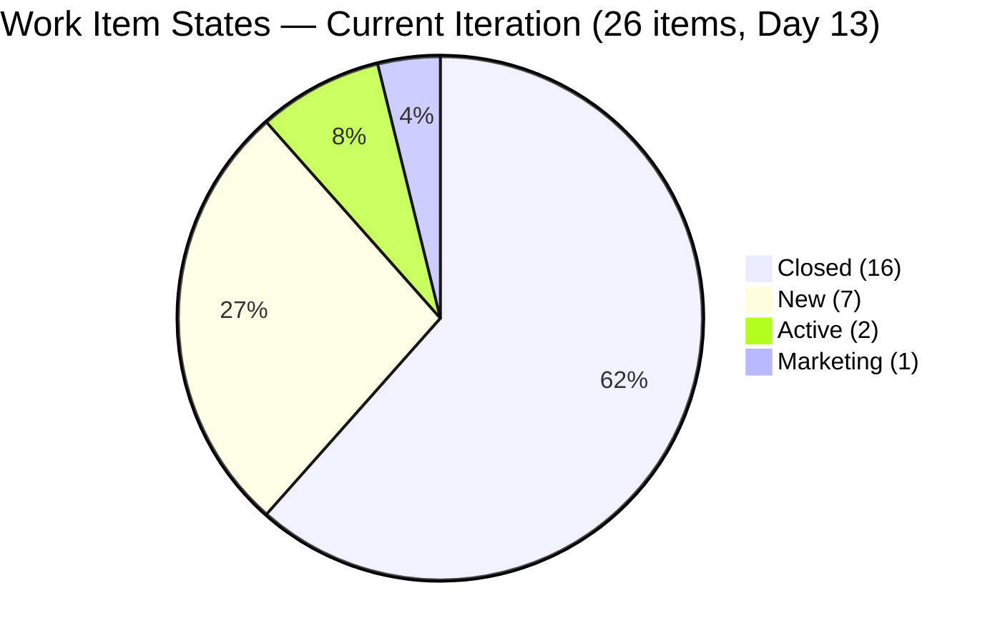
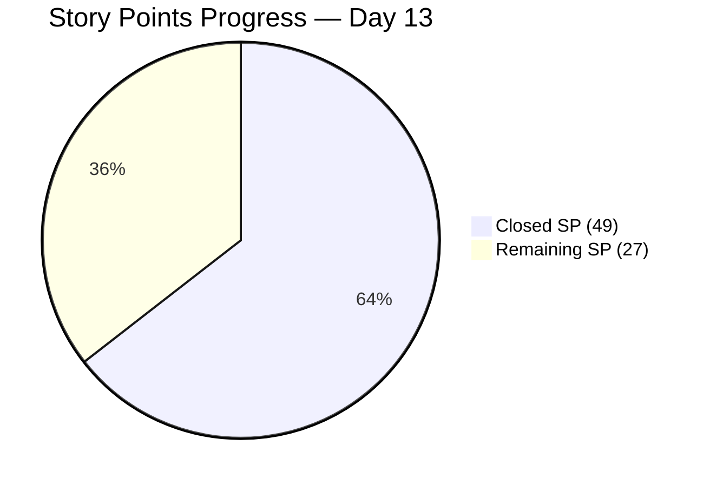
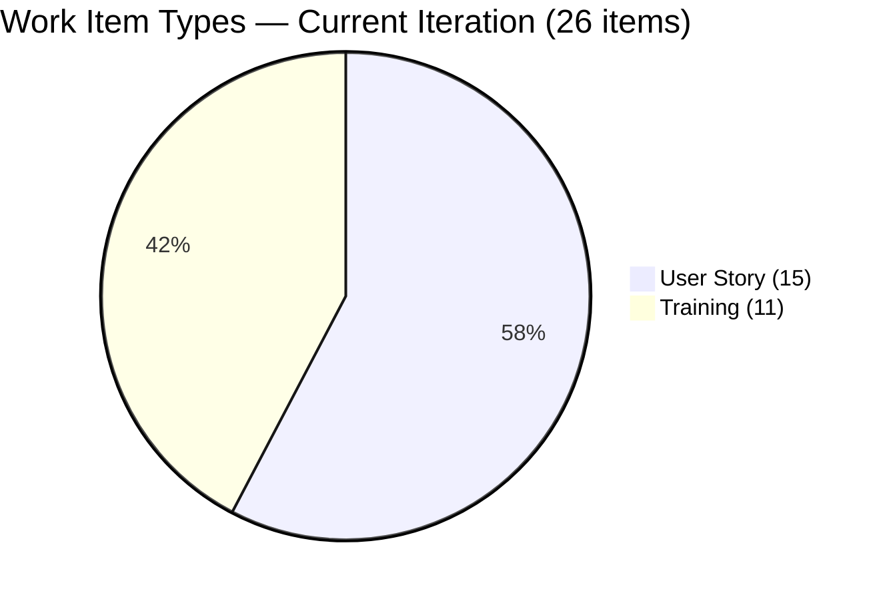
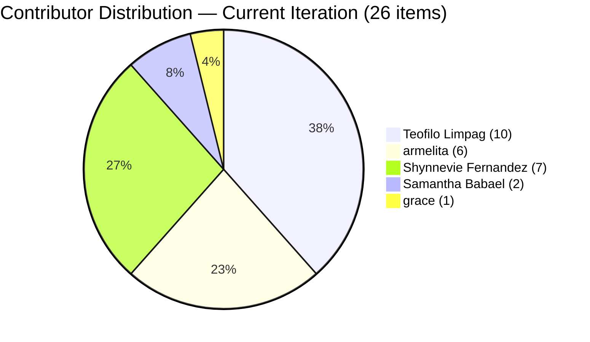
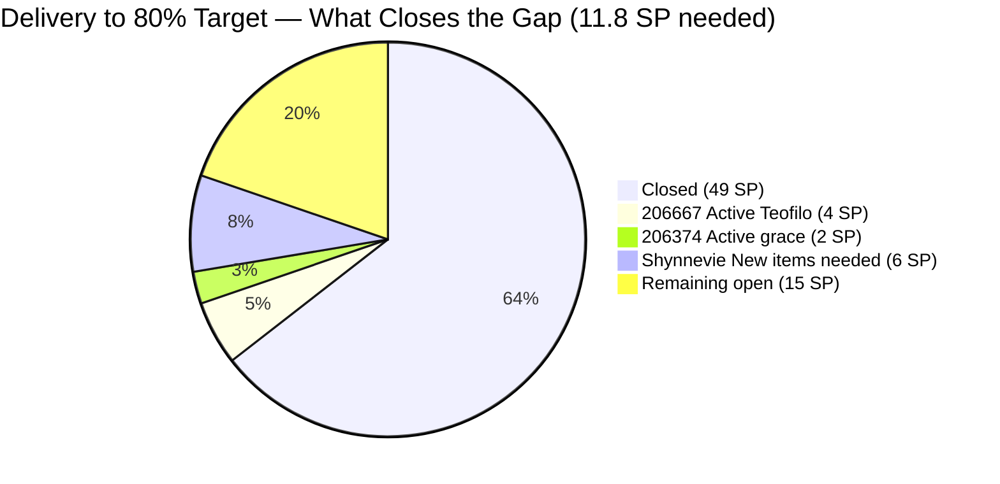

# SAFe Iteration Audit — JIT Training Operation Team

## 1. Audit Metadata

| Field | Value |
|-------|-------|
| **Project** | Jairo Institute of Technology |
| **Project ID** | `9cdd92ea-90e9-474c-8058-4a20700fcab4` |
| **Team** | JIT Training Operation Team |
| **Team ID** | `04d18034-97b9-42fb-87a1-c543c1cab628` |
| **Workspace** | `ado_jit` |
| **Iteration** | Iteration 7.6 (IP) — Innovation & Planning |
| **Iteration ID** | `366e60a5-536b-4ffd-b9f6-d139f377303d` |
| **Iteration Dates** | 2026-06-15 to 2026-06-28 |
| **Audit Date** | 2026-06-27 (Day 13 of 14) — Philippine Standard Time (UTC+8) |
| **Prior Audit Reference** | `audit/AUDIT_20260626_0920.md` — Iteration 7.6 IP Day 12, Score 89.9 |
| **Overall Score** | **89.9 / 100** |
| **Risk Band** | LOW (Green) |

---

## 2. Executive Summary

The JIT Training Operation Team holds at **89.9 (Low Risk)** through Day 13 of 14 — maintaining the series high set on Day 12. No new closures have been recorded since Jun 26, leaving the score unchanged across all seven dimensions.

The sprint closes tomorrow (Jun 28). With 49 of 76 committed SP closed (64.5%), the team needs **12 additional SP in 1 day** to cross the 80% delivery threshold. Item **206667** ("3.1-3 Create Active Directory Security", 4 SP, Teofilo Limpag) is Active and is the highest-priority next closure. Items 206374 (grace, 2 SP, Active) and the 7 New items assigned to Shynnevie Fernandez (16 SP total + 0 SP for 206147) represent the remaining open scope.

Critical gap: **206147** (Shynnevie Fernandez) remains at 0 SP through Day 13. Sprint close is tomorrow — this item must either receive an estimate and be closed, or be formally de-scoped from 7.6 IP before Jun 28.

Armelita completed all 6 of her assigned items earlier in the sprint. The final delivery push rests on Teofilo (206667 Active), grace (206374 Active), and Shynnevie (7 New items including 206147).

---

## 3. Previous Audit Delta

| Dimension | Prior (Jun 26, Day 12) | Current (Jun 27, Day 13) | Delta | Note |
|-----------|----------------------|--------------------------|-------|------|
| Iteration Planning | 72.2 | 72.2 | 0 | 26/36 open backlog items in 7.6 IP — unchanged |
| Team Capacity | 100.0 | 100.0 | 0 | 5/5 contributors with current work are configured |
| Estimation | 96.2 | 96.2 | 0 | 25/26 items estimated; 206147 still at 0 SP |
| DoR Compliance | 96.2 | 96.2 | 0 | 25/26 items pass; 206710 fails (already Closed) |
| Work Item Balance | 100.0 | 100.0 | 0 | US = 15/26 = 57.7% < 60%; no penalty |
| Backlog Refinement | 100.0 | 100.0 | 0 | All 36 backlog items fresh; 206147 untouched = 3.8% (≤10%) |
| Delivery Predictability | 64.5 | 64.5 | 0 | 49/76 SP closed; no new closures since Jun 26 |
| **Overall** | **89.9** | **89.9** | **0** | **LOW (Green) — series high maintained; final day closing push required** |

> **Day 13 note:** No state changes recorded since Day 12. The team closed 7 SP on Days 11–12 (206335 Jun 25, 206666 Jun 26). Day 13 shows no new closures in today's data. Teofilo's 206667 remains Active. Shynnevie's 7 New items remain in New state. Grace's 206374 remains Active. Final push must occur today and tomorrow.

---

## 4. Current Iteration Snapshot

| Field | Value |
|-------|-------|
| **Iteration** | 7.6 (IP) — Innovation & Planning |
| **Start Date** | 2026-06-15 |
| **End Date** | 2026-06-28 |
| **Day in Sprint** | Day 13 of 14 |
| **Days Remaining** | 1 |
| **Total Visible Root Backlog Items** | 36 |
| **Root Items in Iteration 7.6 (IP)** | 26 |
| **Items Closed** | 16 |
| **Items Active** | 2 (206374, 206667) |
| **Items New** | 7 (206147, 205701, 205703, 206343, 206364, 206513, 206518) |
| **Items Marketing** | 1 (205886) |
| **Story Points Committed** | 76 SP (25 estimated; 206147 = 0 SP) |
| **Story Points Closed** | 49 SP (16 items) |
| **Story Points Remaining** | 27 SP |
| **Team Capacity** | 24.3 pts/day total (5 contributors) |
| **Iteration Goal** | Not defined |

### Closed Items This Sprint (16 items)

| Closed Date | ID | Title | Assignee | SP |
|-------------|----|----|-------|-----|
| Jun 16 | 205411 | NEMSU Interview and Interview | armelita | 1 |
| Jun 17 | 205330 | CSS Batch 2 Terminal Report | armelita | 2 |
| Jun 17 | 205403 | Bubble EBET Scholarship Batch 2 TIP | armelita | 2 |
| Jun 17 | 206187 | Assist in NEMSU Interns Onboarding | Samantha Babael | 1 |
| Jun 17 | 206700 | CSS COC 2 Practice Day 1 - Network Cabling | Teofilo Limpag | 4 |
| Jun 17 | 206701 | COC 2 Practice Day 2 - Setting up Router and Access Points | Teofilo Limpag | 4 |
| Jun 18 | 206702 | COC 2 Practice Day 3 - Setting Up Network Sharing | Teofilo Limpag | 4 |
| Jun 19 | 205373 | CSS NC II Batch 2 Special Order (SO) Request | armelita | 2 |
| Jun 19 | 206703 | COC 2 Practice Day 4 - Setting Up Successful Remote Desktop | Teofilo Limpag | 4 |
| Jun 22 | 206704 | COC 2 Practice Day 5 Complete Network Setup | Teofilo Limpag | 4 |
| Jun 22 | 206710 | COC 2 Practice Day 6 | Teofilo Limpag | 4 |
| Jun 23 | 205405 | Bubble EBET Scholarship Batch 2 Training Enrollment Report | armelita | 2 |
| Jun 23 | 206659 | COC 2 Batch 3 Assessment Day | Teofilo Limpag | 4 |
| Jun 24 | 206665 | 3.1-1 Creating Active Directory Training | Teofilo Limpag | 4 |
| Jun 25 | 206335 | Web Development with Bubble.io EBET Scholarship Training Requirements | armelita | 3 |
| Jun 26 | 206666 | 3.1-2 Create Active Directory User Accounts | Teofilo Limpag | 4 |
| **Total** | | | | **49 SP** |

### Contributor Summary

| Contributor | Items in 7.6 IP | SP | Closed | Open | Capacity (ADO) |
|-------------|-----------------|-----|--------|------|----------------|
| armelita | 6 | 12 | 6 (all Closed) | 0 | 6.0/day |
| Samantha Babael | 2 | 6 | 1 Closed | 1 Marketing (205886) | 6.0/day |
| Teofilo Limpag | 10 | 40 | 9 Closed | 1 Active (206667) | 4.8/day |
| Shynnevie Fernandez | 7 | 16* | 0 | 7 New (incl. 206147 at 0 SP) | 6.0/day |
| grace | 1 | 2 | 0 | 1 Active (206374) | 1.5/day |

*Excluding 206147 at 0 SP: 16 SP across 6 items.

### Off-Path Backlog Items (excluded from current-iteration scoring)

| ID | Title | Iteration Path | Assignee | SP | Note |
|----|-------|---------------|----------|-----|------|
| 205687 | Jairosoft 1st Graduation June 2026 | PI8 | grace | 2 | Future PI — not scored |
| 205692 | BATCH 2- BUBBLE.IO EBET- Preparation for Induction Training Program | Iter 7.5 | Shynnevie | 3 | Prior iteration — not scored |
| (8 others) | Various older backlog items | Various older paths | Various | Various | Off-path — excluded |

---

## 5. Work Item Analysis

### 5.1 Current Iteration Items — State Summary (26 items)

| State | Count | Items |
|-------|-------|-------|
| Closed | 16 | 205330, 205373, 205403, 205405, 205411, 206187, 206335, 206659, 206665, 206666, 206700, 206701, 206702, 206703, 206704, 206710 |
| Active | 2 | 206374 (grace), 206667 (Teofilo) |
| New | 7 | 206147 (Shynnevie), 205701 (Shynnevie), 205703 (Shynnevie), 206343 (Shynnevie), 206364 (Shynnevie), 206513 (Shynnevie), 206518 (Shynnevie) |
| Marketing | 1 | 205886 (Samantha) |

### 5.2 Delivery Progress

| Metric | Value |
|--------|-------|
| Committed SP | 76 |
| Closed SP | 49 |
| Remaining SP | 27 |
| Delivery Rate | 64.5% |
| Days Remaining | 1 |
| SP needed to reach 80% (60.8 SP) | 11.8 SP |
| SP needed to reach 90% (68.4 SP) | 19.4 SP |
| SP/day needed to reach 80% | 11.8 SP in 1 day |
| SP/day needed to reach 100% | 27 SP in 1 day |

Reaching 80% requires closing ~12 SP on Jun 27–28 combined. Closing 206667 (4 SP, Active, Teofilo) + 206374 (2 SP, Active, grace) + 3 of Shynnevie's items (3+2+2 = 7 SP) = 13 SP → crosses 80% delivery.

### 5.3 Estimation Coverage (26 items)

| Category | Count | SP |
|----------|-------|----|
| Estimated (SP > 0) | 25 | 76 SP |
| Unestimated (SP = 0) | 1 (206147) | 0 SP |
| **Total** | **26** | **76 SP** |

> **206147** ("Batch 2 - REQUIREMENTS COMPILATION", Shynnevie Fernandez) at 0 SP through Day 13. This is the final opportunity — sprint closes tomorrow. If not estimated and closed today, it will carry as unestimated dead weight at sprint close.

### 5.4 DoR Assessment — Current Iteration (26 items)

| Status | Count | Notes |
|--------|-------|-------|
| PASS | 25 | All items except 206710 |
| FAIL | 1 | 206710 (description = "eLMS Review" in an ordered list — effective description content ≈ 10 non-whitespace chars, below 30-char minimum) |

> **206710** is already Closed (Jun 22). The DoR failure is a documentation quality finding for retrospective only.

### 5.5 Item Type Mix (26 items)

| Type | Count | % | Note |
|------|-------|---|------|
| User Story | 15 | 57.7% | Below 60% threshold — no dominant-type penalty |
| Training | 11 | 42.3% | COC 2 practice sessions, AD training modules |

---

## 6. SAFe Compliance Scorecard

| Dimension | Score | Formula | Evidence |
|-----------|-------|---------|----------|
| Iteration Planning | **72.2** | (26/36) × 100 | 26 of 36 open backlog items assigned to Iteration 7.6 (IP) path |
| Team Capacity | **100.0** | (5/5) × 100 | All 5 contributors with 7.6 IP items are capacity-configured (24.3/day total) |
| Estimation | **96.2** | (25/26) × 100 | 25/26 items estimated; 206147 = 0 SP (persistent gap through Day 13) |
| DoR Compliance | **96.2** | (25/26) × 100 | 25/26 items pass; 206710 fails description threshold (already Closed) |
| Work Item Balance | **100.0** | 100 − 0 | US = 15/26 = 57.7% < 60%; no dominant-type penalty; Training = 42.3%; no Spike |
| Backlog Refinement | **100.0** | (36/36) × 100 | All 36 open backlog items fresh (changed after 2026-05-13); 0 stale_90; 0 stale_180; 206147 untouched = 3.8% ≤10% threshold |
| Delivery Predictability | **64.5** | (49/76) × 100 | 49 SP closed of 76 SP committed; 16 of 26 current-iteration items Closed |
| **Overall** | **89.9** | (72.2+100+96.2+96.2+100+100+64.5) / 7 | **LOW (Green) — series high maintained** |

---

## 7. Dimension Findings

### 7.1 Iteration Planning — 72.2 (Moderate)

26 of 36 open backlog items are assigned to Iteration 7.6 (IP). The 10 off-path items include: 205687 (PI8, grace), 205692 (Iter 7.5, Shynnevie), and 8 older backlog items from prior iterations. The backlog has remained stable at 36 items since Day 12.

In an IP sprint, having some items spanning multiple iterations is expected — teams are planning for PI8 and reviewing residual PI7 work. The team should formally assign iteration paths to the 8 unassigned off-path items during PI8 planning.

### 7.2 Team Capacity — 100.0 (Strong)

All 5 contributors with items in the current iteration (7.6 IP) are configured in ADO capacity:
- **armelita**: 6.0/day
- **Shynnevie Fernandez**: 6.0/day
- **Samantha Babael**: 6.0/day
- **Teofilo Limpag**: 4.8/day
- **grace**: 1.5/day

Note: armelita had a registered day off on Jun 26, but has already completed all 6 of her assigned items, so her reduced availability on Day 12 had zero impact on remaining work.

### 7.3 Estimation — 96.2 (Strong — 1 Persistent Gap)

25 of 26 current-iteration items carry SP > 0. Item **206147** (Shynnevie Fernandez — "Batch 2 - REQUIREMENTS COMPILATION") continues at 0 SP through Day 13. This is now past the point where estimation alone improves the sprint close picture — the item should be estimated AND closed before sprint end, or formally removed from 7.6 IP.

### 7.4 DoR Compliance — 96.2 (Good — 1 Historical Finding)

25 of 26 current-iteration items pass the Description + Acceptance Criteria thresholds. Item **206710** ("COC 2 Practice Day 6") remains the only failure, with a description of "eLMS Review" in an ordered list — 10 effective non-whitespace characters, below the 30-character minimum. This item has been Closed since Jun 22; the finding is retrospective.

All other items — including all Active and New items — have adequate descriptions and acceptance criteria. DoR hygiene for open items is clean.

### 7.5 Work Item Balance — 100.0 (Strong)

User Stories = 15 of 26 = 57.7%. This is below the 60% dominant-type threshold, so no penalty applies. Training items = 11 of 26 = 42.3%. No Spike, Issue, or Defect items in the current iteration. All three balance checks pass:
- User Story present: YES
- Dominant type share ≤ 60%: YES (57.7%)
- Spike share ≤ 40%: YES (0%)

Score: 100.0 — maintained from Day 12.

### 7.6 Backlog Refinement — 100.0 (Strong)

All 36 open backlog items are fresh (changed after 2026-05-13). The only current-iteration item with a ChangedDate before the iteration start is **206147** (Jun 12, 2026 — 3 days before Jun 15 start). This is 1/26 = 3.8%, below the 10% threshold for a -10 penalty. No additional stale items have entered the backlog.

Base score = 36/36 × 100 = 100.0. No stale penalties apply. Score = **100.0**.

### 7.7 Delivery Predictability — 64.5 (Moderate — Positive Trajectory)

49 of 76 SP closed at Day 13 of 14. The delivery progression across the sprint:

| Date | SP Closed | Cumulative | Items Closed |
|------|-----------|-----------|--------------|
| Jun 16 | 1 | 1 | 205411 |
| Jun 17 | 13 | 14 | 205330, 205403, 206187, 206700, 206701 |
| Jun 18 | 4 | 18 | 206702 |
| Jun 19 | 6 | 24 | 205373, 206703 |
| Jun 22 | 8 | 32 | 206704, 206710 |
| Jun 23 | 6 | 38 | 205405, 206659 |
| Jun 24 | 4 | 42 | 206665 |
| Jun 25 | 3 | 45 | 206335 |
| Jun 26 | 4 | 49 | 206666 |
| Jun 27 | 0 | 49 | (no closures observed in today's data) |

**Remaining open items for sprint close:**
- 206667 (Active, Teofilo, 4 SP) — AD Security training module — next in Teofilo's training sequence
- 206374 (Active, grace, 2 SP) — Payment Collection — finance tracking feature
- 205886 (Marketing, Samantha, 5 SP) — Bubble Training Batch 2 — delivery unclear
- 206147 (New, Shynnevie, 0 SP) — Requirements compilation — must be estimated/closed or de-scoped
- 205701, 205703, 206343, 206364, 206513, 206518 (New, Shynnevie, 16 SP) — batch processing and marketing items

To reach 80% delivery (60.8 SP): need 11.8 SP from today + tomorrow. Closing 206667 + 206374 + 2 of Shynnevie's items (5–7 SP) = ~12–13 SP → crosses 80%.

---

## 8. Risks and Bottlenecks

| Risk | Severity | Details |
|------|----------|---------|
| 27 SP remaining with 1 day left | HIGH | Reaching 80% requires 12 SP on Jun 27–28; 100% = 27 SP in 1 day — unreachable. Realistic target is 75–80% delivery. |
| 7 New items, all Shynnevie | HIGH | 7 items (16+ SP) in New state — never activated in 14-day sprint. At sprint close, these will be carryover unless closed in the final 24 hours. |
| 206147 unestimated at Day 13 | MODERATE | 0 SP persists through Day 13. Sprint closes tomorrow — last chance for estimate+close or de-scope. |
| 205886 in Marketing state | MODERATE | Bubble Training Batch 2 (5 SP) — Samantha's item in non-standard state. No indication of imminent closure. |
| No iteration goal | MODERATE | Persistent gap through Day 13 of 14. No sprint goal defined for 7.6 IP. |
| 206710 DoR gap | LOW | Already Closed — retrospective finding only. |

---

## 9. Prioritized Recommendations

| Priority | Action | Owner | Target |
|----------|--------|-------|--------|
| P0 | Close 206667 (Active, 4 SP) — Teofilo's next in the AD training sequence and the highest-SP ready-to-close item. | Teofilo | Jun 27 (today) |
| P0 | Activate and close 205701, 205703, 206343, 206364, 206513, 206518 — Shynnevie should prioritize the simplest items (206364: G-Form enrollment, 2 SP; 206518: brochure, 2 SP) to maximize SP closed before sprint end. | Shynnevie | Jun 27 (today) |
| P1 | Close 206374 (Active, 2 SP, grace) — Payment Collection. | grace | Jun 27 |
| P1 | Estimate and close 206147 (0 SP, Shynnevie) OR formally de-scope it from 7.6 IP before Jun 28 23:59. A 0-SP carryover item distorts PI8 planning. | Shynnevie | Jun 27 |
| P1 | Confirm 205886 (Marketing, 5 SP, Samantha) closure plan for Jun 27–28. If closeable, it contributes 5 SP toward 80% target. | Samantha | Jun 27 |
| P2 | Assign iteration paths to the 8 remaining off-path backlog items during PI8 planning. | armelita | Post-sprint |
| P3 | Add adequate description to 206710 for documentation completeness (retrospective). | Teofilo | Post-sprint |
| P3 | Define iteration goal for 7.6 IP retrospectively and document in sprint notes before Jun 28. | armelita/Ramon | Jun 28 |

---

## 10. Evidence Gaps and Limitations

| Gap | Impact | Detail |
|-----|--------|--------|
| 8 off-path backlog items not individually inspected | Backlog Refinement assumes all fresh per Day 12 evidence (Jun 11+) | Low risk: Day 12 confirmed all 36 items fresh; backlog unchanged since then |
| 206147 SP = 0 through Day 13 | Excluded from committed SP denominator | Accurate per formula; item should be estimated or de-scoped before sprint close |
| 206710 DoR failure is for a Closed item | Minor retrospective finding — no sprint closure impact | Score impact: 1 item drops DoR from 100.0 to 96.2 |
| 205886 in Marketing state | Non-standard state — unclear if it contributes to closed SP formula (State ≠ Closed or Done) | If closed before sprint end, it would add 5 SP to closed_story_points |
| No Day 13 closures observed | Delivery Predictability cannot improve without items moving to Closed today | Requires active follow-up with Teofilo, grace, and Shynnevie today |

---

## Appendix: Visualizations

```mermaid
bar
    title SAFe Dimension Scores — JIT Team Day 13 (2026-06-27)
    x-axis [Iter Plan, Team Cap, Estimation, DoR, WI Balance, Backlog Ref, Delivery]
    y-axis "Score (0–100)" 0 --> 100
    bar [72.2, 100, 96.2, 96.2, 100, 100, 64.5]
```










