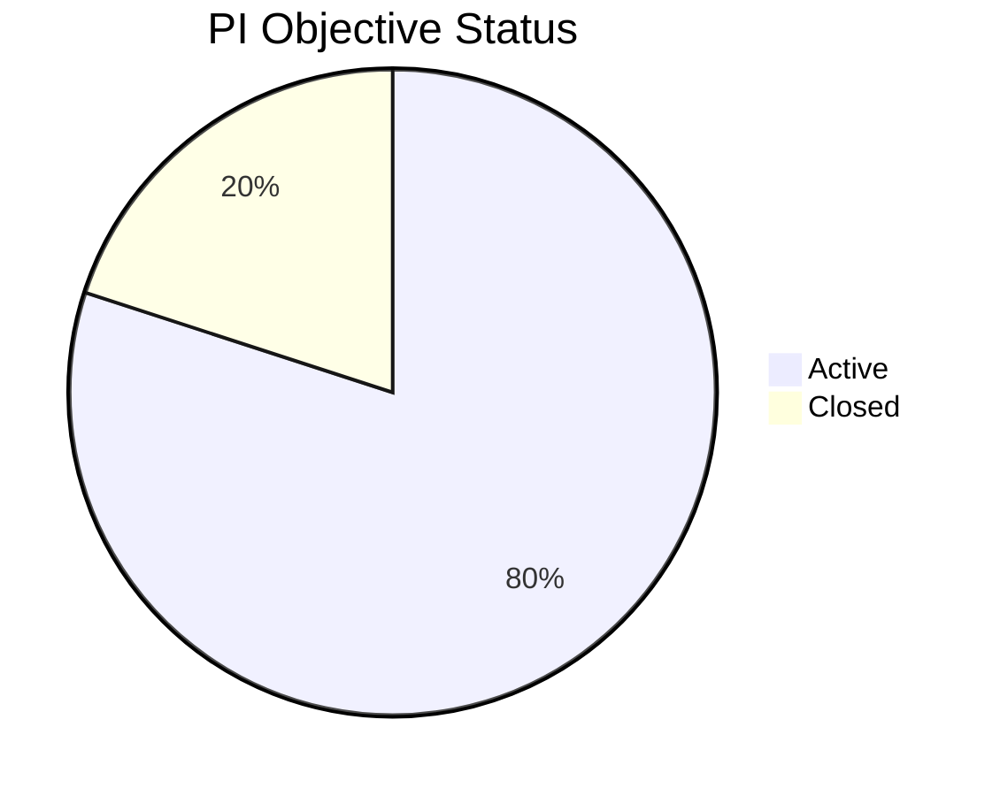
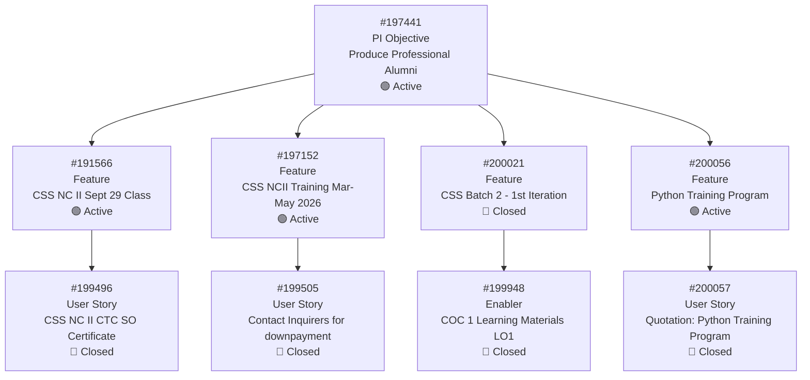
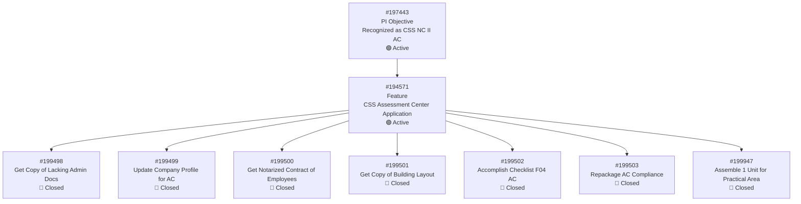
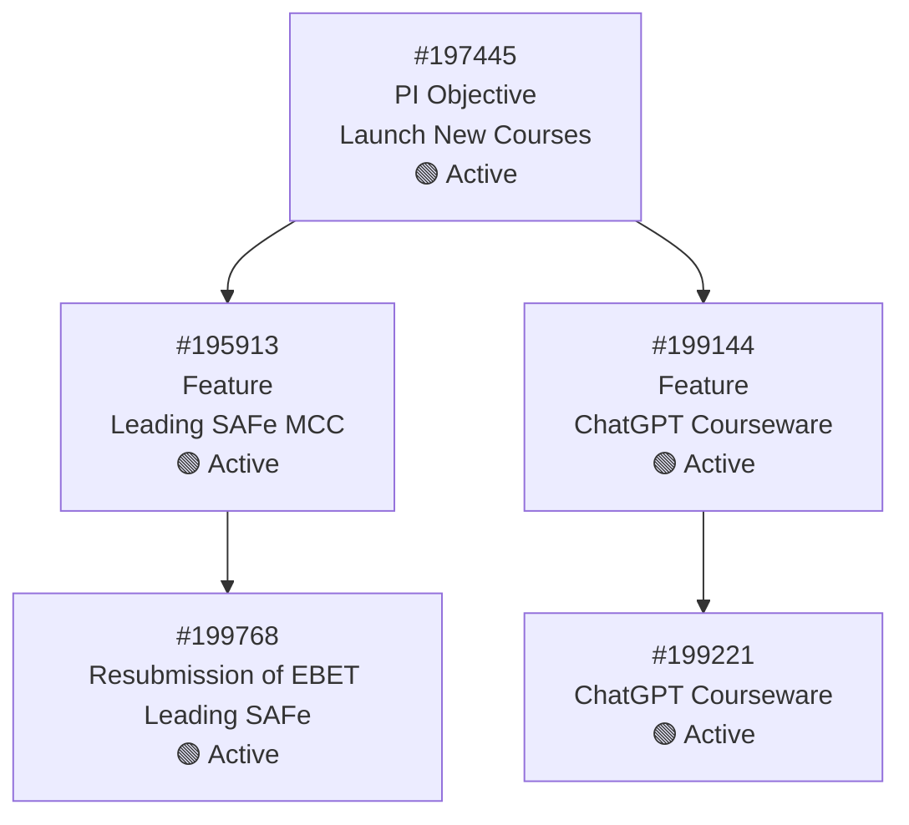
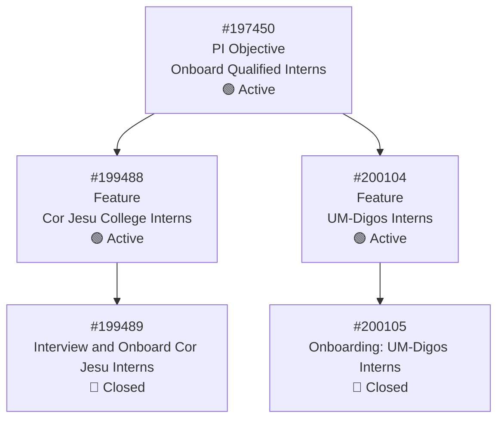
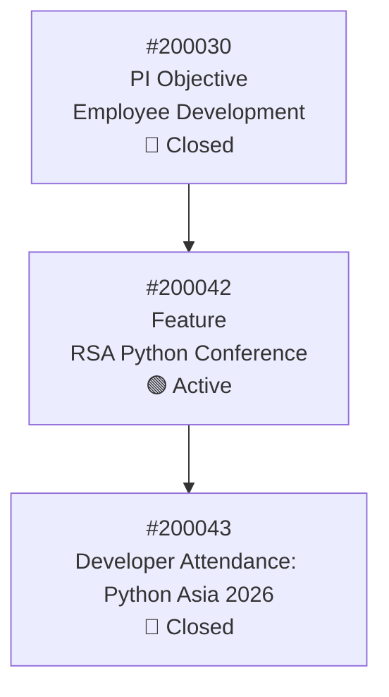
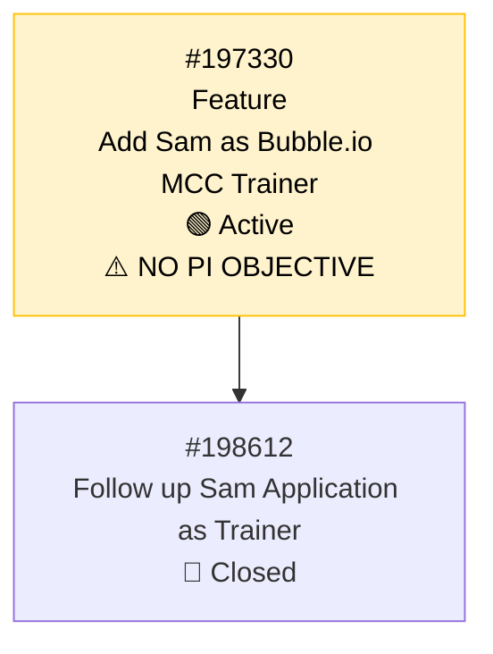
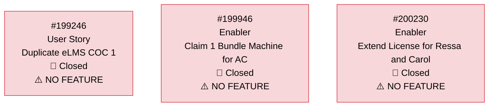
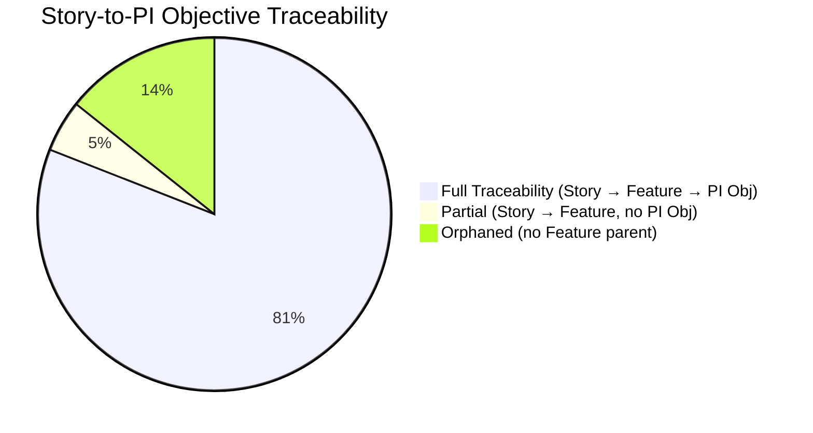
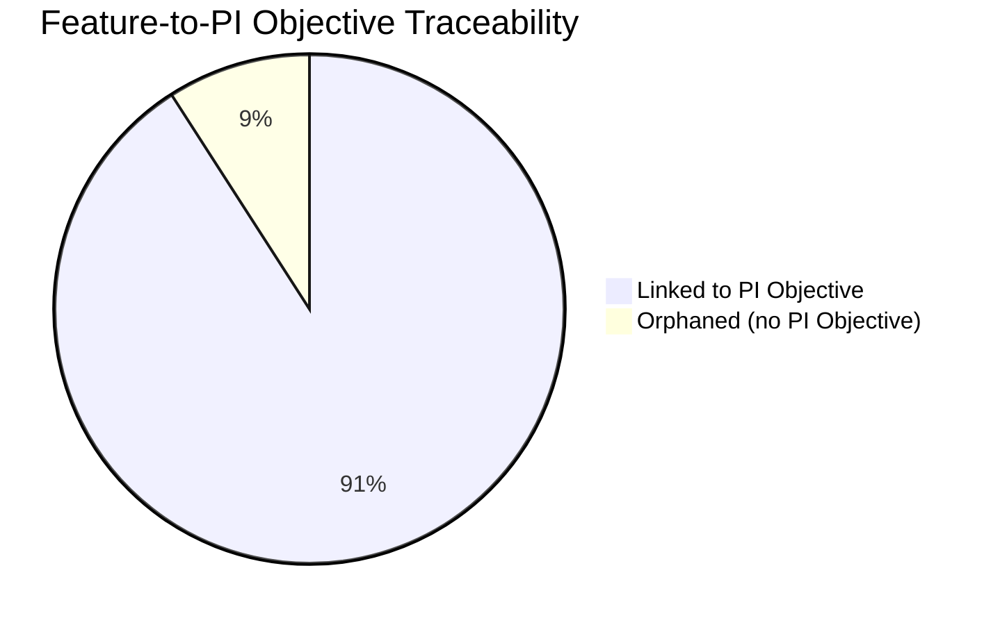

# SAFe Traceability Report — JIT Operation Team

**Report Date:** March 10, 2026
**Project:** Jairosoft Portfolio
**Team:** JIT Operation Team
**Iteration:** 6.4 (Feb 23 – Mar 8, 2026)
**PI:** 2026-PI6
**Auditor:** Claude (SAFe Consultant)
**Requested By:** Ramon, Project Owner

---

## Executive Summary

This report traces all Iteration 6.4 work items through the SAFe hierarchy: **Story/Enabler → Feature → PI Objective**. The goal is to verify strategic alignment and identify orphaned items that lack proper traceability.

**Key Findings:**

- **5 PI Objectives** exist in PI6 (4 Active, 1 Closed)
- **11 Features** parent the iteration's work items
- **10 of 11 Features** (91%) are properly linked to a PI Objective
- **1 Feature** is orphaned (no PI Objective parent)
- **3 Stories/Enablers** are orphaned (no Feature parent)
- **17 of 20 Stories/Enablers** (85%) have full traceability to a PI Objective

---

## PI Objectives — PI6

| ID | PI Objective | State | Features Count |
|----|-------------|-------|----------------|
| **#197441** | Produce Professional Alumni | Active | 4 |
| **#197443** | Recognized as CSS NC II Assessment Center | Active | 1 |
| **#197445** | Launch New Courses | Active | 2 |
| **#197450** | Onboard Qualified Interns for eLMS and jit.edu.ph | Active | 2 |
| **#200030** | Employee Development | Closed | 1 |

---

## Full Traceability Matrix

### PI Objective #197441 — Produce Professional Alumni

| Feature ID | Feature Title | State | Story ID | Story Title | Type | State |
|---|---|---|---|---|---|---|
| **#191566** | CSS NC II Sept 29, 2025 Class | Active | **#199496** | CSS NC II CTC SO Certificate | User Story | Closed |
| **#197152** | CSS NCII Training Mar-May 2026 | Active | **#199505** | Contact Inquirers for their downpayment | User Story | Closed |
| **#200021** | CSS Batch 2 - 1st Iteration | Closed | **#199948** | COC 1 Learning Materials LO1 | Enabler | Closed |
| **#200056** | Python Training Program | Active | **#200057** | [Quotation] Python Training Program | User Story | Closed |

---

### PI Objective #197443 — Recognized as CSS NC II Assessment Center

| Feature ID | Feature Title | State | Story ID | Story Title | Type | State |
|---|---|---|---|---|---|---|
| **#194571** | CSS Assessment Center Application | Active | **#199498** | Get Copy of Lacking Admin Docs from Ma'am Grace | User Story | Closed |
| | | | **#199499** | Update Company Profile for AC Compliance | User Story | Closed |
| | | | **#199500** | Get Notarized Contract of Employees for AC Compliance | User Story | Closed |
| | | | **#199501** | Get Copy of Building Layout, Shop Layout, and Floor Plan | User Story | Closed |
| | | | **#199502** | Accomplish Checklist F04 AC Compliance | User Story | Closed |
| | | | **#199503** | Repackage AC Compliance | User Story | Closed |
| | | | **#199947** | Assemble 1 Unit for Practical Area | Enabler | Closed |

> This is the most well-structured work stream — 7 items all properly traced through Feature #194571 to PI Objective #197443.

---

### PI Objective #197445 — Launch New Courses

| Feature ID | Feature Title | State | Story ID | Story Title | Type | State |
|---|---|---|---|---|---|---|
| **#195913** | Leading SAFe Micro-credentialing (MCC) | Active | **#199768** | Resubmission of EBET Leading SAFe | User Story | Active |
| **#199144** | ChatGPT Courseware | Active | **#199221** | ChatGPT Courseware | Courseware | Active |

---

### PI Objective #197450 — Onboard Qualified Interns for eLMS and jit.edu.ph

| Feature ID | Feature Title | State | Story ID | Story Title | Type | State |
|---|---|---|---|---|---|---|
| **#199488** | Cor Jesu College Interns | Active | **#199489** | Interview and Onboard Cor Jesu Interns | User Story | Closed |
| **#200104** | UM-Digos Interns | Active | **#200105** | [Onboarding] UM-Digos Interns | User Story | Closed |

---

### PI Objective #200030 — Employee Development (Closed)

| Feature ID | Feature Title | State | Story ID | Story Title | Type | State |
|---|---|---|---|---|---|---|
| **#200042** | Return Service Agreement Python Conference | Active | **#200043** | [RSA] Developer Attendance: Python Asia Conference 2026 | User Story | Closed |

---

## Orphaned Items — No Full Traceability

### Orphaned Feature (No PI Objective Parent)

| Feature ID | Feature Title | State | Story ID | Story Title | State | Issue |
|---|---|---|---|---|---|---|
| **#197330** | Add Sam as Bubble.io MCC Trainer | Active | **#198612** | Follow up Sam Application as Trainer | Closed | **No PI Objective parent** |

### Orphaned Stories/Enablers (No Feature Parent)

| Story ID | Title | Type | State | Issue |
|---|---|---|---|---|
| **#199246** | Duplicate eLMS COC 1 | User Story | Closed | **No Feature parent, no description** |
| **#199946** | Claim 1 Bundle Machine for AC | Enabler | Closed | **No Feature parent, no description** |
| **#200230** | Extend License for Ressa and Carol | Enabler | Closed | **No Feature parent** |

---

## Recommendations

### 1. Link Orphaned Feature #197330 to a PI Objective

**Suggested:** Parent under **PI Objective #197445 "Launch New Courses"**

| Rationale |
|-----------|
| Adding Samantha as a Bubble.io MCC trainer directly supports the launch of new course offerings. This aligns with the other MCC/courseware Features (#195913 Leading SAFe MCC, #199144 ChatGPT Courseware) already under this PI Objective. |

### 2. Link Orphaned Stories to Features

| Story | Suggested Feature | Rationale |
|---|---|---|
| **#199246** Duplicate eLMS COC 1 | **#191566** CSS NC II Sept 29 Class | eLMS COC duplication is part of CSS NC II training delivery operations |
| **#199946** Claim 1 Bundle Machine for AC | **#194571** CSS Assessment Center Application | The bundled machine is hardware needed for the AC practical assessment area |
| **#200230** Extend License for Ressa and Carol | Consider creating a new Feature "Licensing & Admin" under **#197441** Produce Professional Alumni, or link to **#197330** if training-related | License extensions are operational overhead that support training delivery |

### 3. Address PI Objective #200030 State Mismatch

PI Objective **#200030 "Employee Development"** is **Closed**, but its child Feature **#200042** is still **Active**. Either reopen the PI Objective or close the Feature if the work is considered done.

---

## Traceability Summary

| Metric | Count | Percentage |
|--------|-------|------------|
| Total Stories/Enablers in Iteration | 21 | 100% |
| With full traceability (Story → Feature → PI Obj) | 17 | 81% |
| Partial traceability (Story → Feature only) | 1 | 5% |
| Orphaned (no Feature parent) | 3 | 14% |
| Total Features | 11 | 100% |
| Features linked to PI Objective | 10 | 91% |
| Features orphaned | 1 | 9% |

---

## Conclusion

The JIT Operation Team has **strong strategic alignment at the Feature level**, with 91% of Features properly linked to PI Objectives. Armelita has established a solid SAFe hierarchy structure. The primary gaps are at the Story level, where 3 items lack Feature parents and 1 Feature lacks a PI Objective parent. Addressing these 4 orphaned items would bring traceability to near-100% compliance.

**Overall Traceability Score: 85%** (17 of 20 backlog items fully traced to PI Objectives)

---

*Report generated by Claude SAFe Consultant for Jairosoft Portfolio — JIT Operation Team*
*Requested by Ramon, Project Owner*
