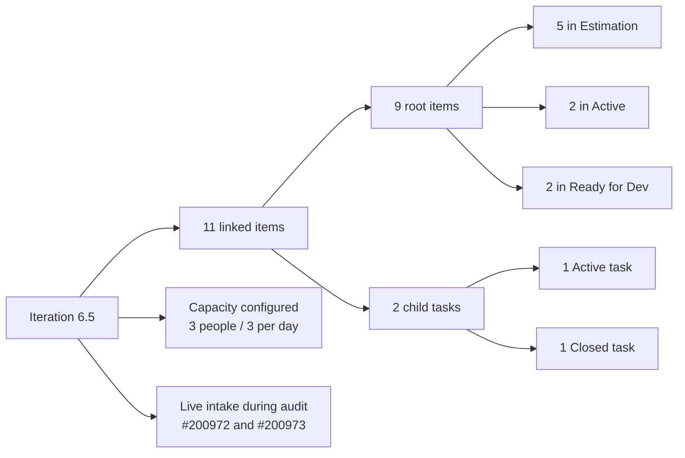
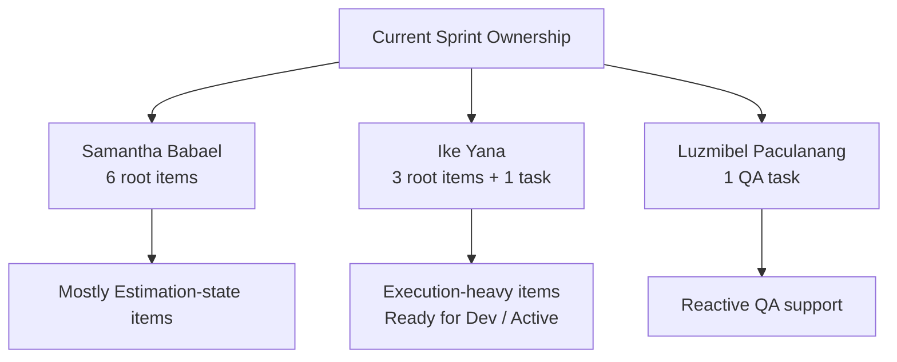

# SAFe Iteration Audit Report

**Project:** Life Style Help App
**Team:** Life Style Help App Team
**Audit Workspace:** `ado_ls_dev`
**Iteration:** 6.5 (2026-PI6)
**Sprint Dates:** March 9, 2026 to March 22, 2026
**Audit Date:** March 11, 2026
**Data Snapshot:** Azure DevOps reads captured on March 11, 2026 Pacific time, with some work item timestamps recorded in UTC on March 12, 2026
**Auditor:** Codex (AI SAFe consultant)

---

## 1. Executive Summary

This is the first local audit captured for `ado_ls_dev`. No prior report exists under `ado_ls_dev/audit/`, so the analysis is based on the current Azure DevOps board state, current iteration scope, and backlog signals visible on March 11, 2026.

The most important conclusion is that **Life Style Help App is an active team with a real Iteration 6.5 plan**, not a dormant or disconnected project. The team has a configured current sprint, **3 team members with explicit daily capacity**, and **11 iteration-linked items** already present in the sprint scope. There is also evidence of live work intake during the audit window, including **#200972** and its child task **#200973**, which were created on **March 12, 2026 UTC** (the evening of **March 11, 2026 Pacific**).

The main concern is not absence of work, but **weak iteration readiness and backlog discipline**. Of the **9 root sprint items**, **5 are still in `Estimation`** after sprint start, only **4 carry story point estimates** for a total of **7 story points**, and several committed items have incomplete specification quality based on the project's own DoR standard of **Description + Acceptance Criteria**. Outside the sprint, the requirement backlog contains **67 items**, including many old items still parked at the project root iteration path with last meaningful changes dating back to **2024** and **2025**.

---

## 2. Iteration 6.5 Snapshot

| Metric | Value | SAFe Interpretation |
|---|---:|---|
| Current iteration configured | Yes | Team is pointed to a valid active sprint |
| Sprint dates | Mar 9 to Mar 22, 2026 | Sprint is in its opening days |
| Team members with capacity | 3 | Basic planning setup exists |
| Total team capacity per day | 3 | Capacity is configured, unlike several other audited teams |
| Root sprint items | 9 | Sprint scope exists |
| Total iteration-linked items | 11 | Includes 2 child tasks |
| Root items in `Estimation` | 5 | Too many committed items are still not ready |
| Root items with story points | 4 | Estimation coverage is incomplete |
| Story points on root items | 7 | Forecast baseline is weak |
| Requirement backlog items returned | 67 | Backlog is large relative to active sprint scope |
| Feature backlog items returned | 16 | There is upstream feature inventory |

### Team Capacity Evidence

| Person | Activity | Capacity / Day |
|---|---|---:|
| Samantha Babael | Development | 1 |
| Luzmibel Paculanang | Testing | 1 |
| Ike Yana | Development | 1 |
| **Total** |  | **3** |

### Current Sprint Scope State

| State | Count | Notes |
|---|---:|---|
| Estimation | 5 | All are root items already committed to Iteration 6.5 |
| Active | 3 | Includes 2 defects and 1 task |
| Ready for Dev | 2 | Both are root items |
| Closed | 1 | Child task #200973 |

---

## 3. System View

**Interpretation:** the team is actively using the board, but too much of the sprint commitment is still sitting in pre-ready states.

---

## 4. Key Work Item Analysis

### 4.1 Current Iteration Root Items

| ID | Title | Type | State | Assigned To | Story Points | Last Changed |
|---|---|---|---|---|---:|---|
| 195727 | The meal time filter dont respond when there is text in the searchbar | Defect | Active | Samantha Babael | 2 | Mar 9, 2026 |
| 198770 | [Apple Pay] Payment Fails After Successful Authentication | Defect | Ready for Dev | Ike Yana | 2 | Mar 9, 2026 |
| 199119 | Remove Payment Confirmation Pop-up and Redirect Directly to Payment Page | User Story | Estimation | Samantha Babael | 0 | Mar 9, 2026 |
| 195735 | Adjust text on membership package subscription page | User Story | Estimation | Samantha Babael | 0 | Mar 9, 2026 |
| 195716 | Hide “preferanser”, “allergier” and “kan serveres til” inside recipe card | User Story | Estimation | Samantha Babael | 0 | Mar 9, 2026 |
| 195715 | Remove deadspace on Completed Sesssion section | Defect | Estimation | Samantha Babael | 0 | Mar 9, 2026 |
| 200972 | Activate and investigate <helga.presthus@gmail.com> account | Defect | Active | Ike Yana | 0 | Mar 12, 2026 UTC |
| 198775 | [Admin] Workout Plans - Search Not Working on First Attempt After Page Load | Defect | Estimation | Samantha Babael | 1 | Mar 9, 2026 |
| 196380 | Default Pinned Post for New Users | User Story | Ready for Dev | Ike Yana | 2 | Mar 9, 2026 |

### 4.2 Current Iteration Child Tasks

| ID | Parent | Title | State | Assigned To | Remaining Work | Last Changed |
|---|---:|---|---|---|---:|---|
| 197320 | 196380 | Implement Post Pinning Function | Active | Ike Yana | 10 | Mar 9, 2026 |
| 200973 | 200972 | QA - Defect Create - Bel | Closed | Luzmibel Paculanang | 0 | Mar 12, 2026 UTC |

### 4.3 Sprint Load Pattern

**Interpretation:** sprint execution is concentrated in a small set of individuals, and Samantha's portion of the sprint remains disproportionately early-stage.

---

## 5. Definition of Ready Assessment

The workspace memory defines DoR as **Description + Acceptance Criteria**.

Current sprint observations:

- **#196380** and **#199119** contain both narrative description and acceptance criteria.
- **#195735** also contains both and is the clearest example of a ready user story.
- **#195716** has a description and screenshot, but no acceptance criteria were returned.
- **#198775** returned with no description and no acceptance criteria.
- **#198770** and **#200972** rely largely on image-based or minimal description, which is weak for handoff and verification.

**Assessment:** the sprint contains committed work, but readiness quality is inconsistent. Several items appear to have been pulled into the sprint before meeting the team's own minimum standard for clarity and testability.

---

## 6. Backlog Hygiene

The requirement backlog returned **67 items**. This is materially larger than the current sprint scope of **9 root items** and includes many older items with:

- `IterationPath` still set to the project root (`Life Style Help App`)
- states such as `New`, `Grooming`, or `Ready for Dev`
- last changed dates from **April 2024** through **late 2025**

Representative examples:

| ID | Title | Type | State | Iteration Path | Last Changed |
|---|---|---|---|---|---|
| 160741 | [Client] Add Client | User Story | Grooming | Project root | Apr 4, 2024 |
| 161365 | Client Login Page | User Story | New | Project root | Apr 18, 2024 |
| 168814 | Workout Plan - Add filter | User Story | New | Project root | Nov 11, 2025 |
| 174427 | Investigate Bubble.io Mobile Responsiveness and PWA Capabilities | Enabler | New | Project root | Oct 9, 2025 |
| 191325 | POC Calorie Detection AI Integration | Enabler | Peer Testing | Project root | Oct 9, 2025 |

**Assessment:** backlog aging is a meaningful flow risk. The problem is not empty backlog, but **too much unresolved historical inventory** competing with current sprint work.

---

## 7. SAFe Compliance Findings

| # | Finding | Severity | SAFe Area |
|---|---|---|---|
| F1 | Iteration 6.5 has real scope and capacity, but **5 of 9 root items remain in `Estimation` after sprint start** | HIGH | Iteration Planning |
| F2 | Only **4 of 9 root items** have story point estimates, giving the team a weak forecast baseline | HIGH | Estimation / Predictability |
| F3 | Current sprint ownership is imbalanced: Samantha holds **6 root items**, most still early-stage | HIGH | Capacity Allocation / Flow |
| F4 | At least some committed items do not clearly satisfy the team's DoR of **Description + Acceptance Criteria** | HIGH | Definition of Ready |
| F5 | The requirement backlog contains a large volume of stale items dating back to **2024** and **2025** | HIGH | Backlog Management |
| F6 | Sprint execution appears partly reactive, with new defect work entering during the audit window | MEDIUM | Interrupt Handling |
| F7 | No prior local audit exists for this workspace, limiting trend and action tracking | MEDIUM | Inspect and Adapt |

---

## 8. Positive Observations

| # | Observation |
|---|---|
| P1 | The team has a valid active sprint and visible sprint scope |
| P2 | Team capacity is explicitly configured for 3 members |
| P3 | At least 2 root items are already in `Ready for Dev`, indicating some pre-groomed work exists |
| P4 | Active engineering and QA activity occurred during the audit window via #200972 and #200973 |
| P5 | The team is using hierarchy at least in part, with task decomposition present under #196380 and #200972 |

---

## 9. Risks

| Risk | Likelihood | Impact | Why |
|---|---|---|---|
| Sprint commitment slips because too much work is still in `Estimation` | High | High | Readiness work is bleeding into execution time |
| Forecasting remains unreliable | High | Medium | Most sprint items are unestimated |
| One engineer becomes a bottleneck | High | High | Samantha owns most root items and most are not yet execution-ready |
| Reactive support interrupts planned delivery | Medium | High | New production-style defects entered mid-audit |
| Historical backlog continues to accumulate without pruning | High | Medium | Old project-root items remain unresolved across years |

---

## 10. Recommendations

### 10.1 Immediate

| # | Action | Owner | Priority |
|---|---|---|---|
| R1 | Revisit Iteration 6.5 scope and move any item still lacking readiness back to backlog or Grooming | Ramon / PM / Team | CRITICAL |
| R2 | Estimate the 5 unestimated root sprint items or explicitly mark them as uncommitted support work | Team | CRITICAL |
| R3 | Rebalance ownership so one engineer is not carrying most of the still-unready sprint scope | PM / Team Lead | HIGH |
| R4 | Add missing acceptance criteria or reproducible defect detail to #195716, #198775, #198770, and #200972 | Item owners | HIGH |

### 10.2 This Sprint

| # | Action | Owner | Priority |
|---|---|---|---|
| R5 | Break large or ambiguous root items into executable tasks before further implementation starts | Team | HIGH |
| R6 | Separate planned sprint work from interrupt-driven support defects using tags or explicit class-of-service rules | PM / Team | HIGH |
| R7 | Review all project-root backlog items older than 90 days and either close, rehome, or re-estimate them | PM / Product Owner | HIGH |
| R8 | Define a lightweight DoR gate: no item enters a sprint without description, acceptance criteria, owner, and estimate | PMO / Team | MEDIUM |

---

## 11. Conclusion

`ado_ls_dev` shows a **functioning but weakly disciplined** SAFe iteration team. This is not a zero-activity or zero-capacity project. The team has a real sprint, real owners, and live work in motion. The audit concern is that **too much of the committed sprint scope is still not truly ready**, and the broader backlog has accumulated substantial stale inventory.

The most pragmatic next step is to tighten the commitment boundary: keep Iteration 6.5 focused on the few items that are actually ready, make interrupt work explicit, and stop carrying ambiguous backlog debt into sprint execution without enough preparation.
