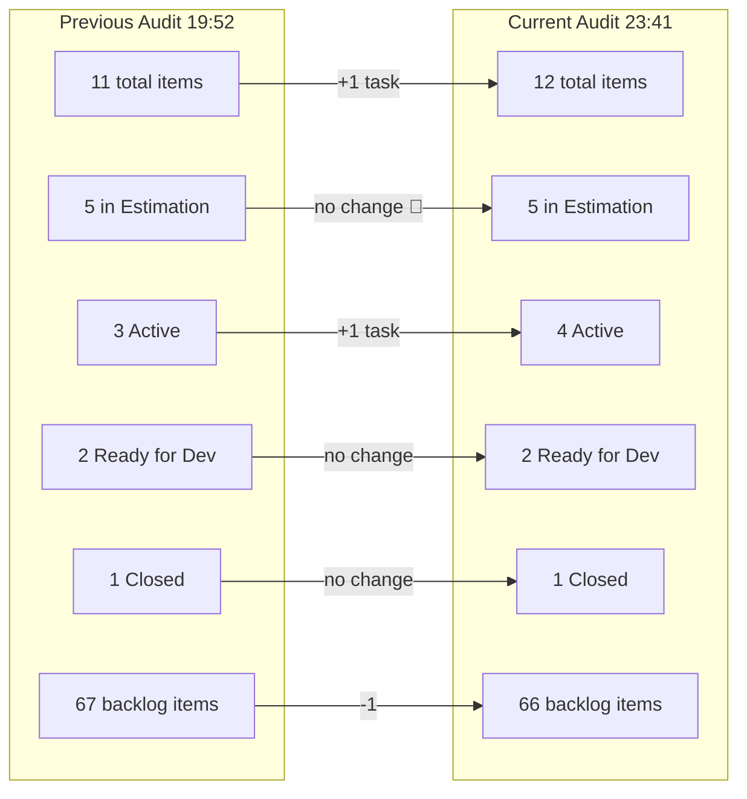
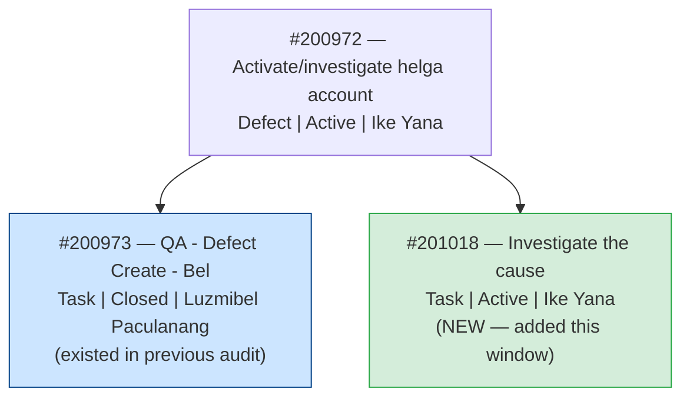
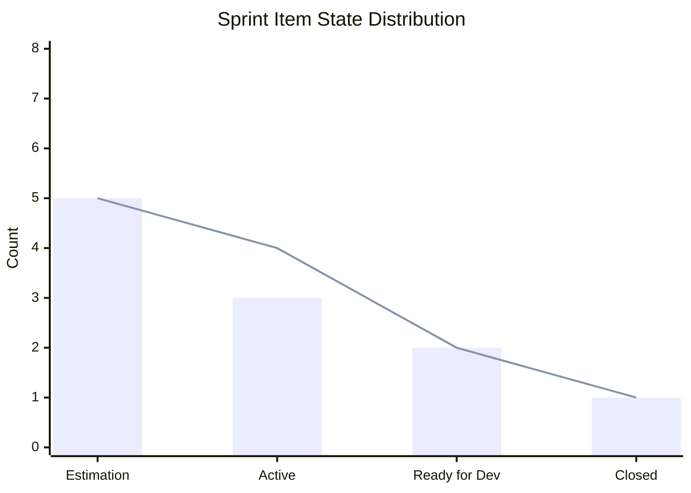
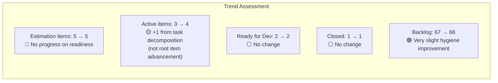
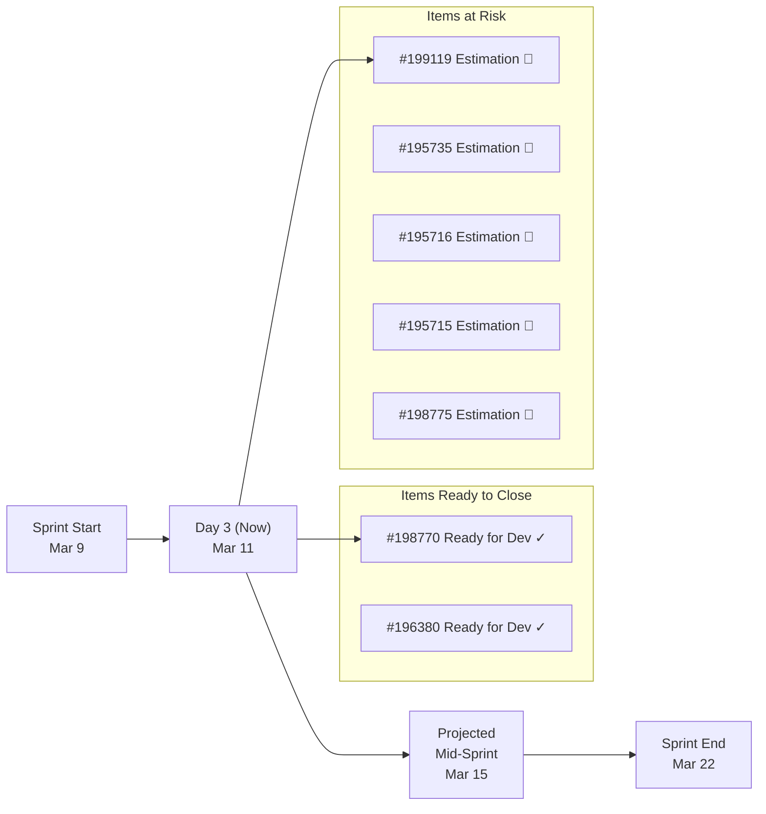
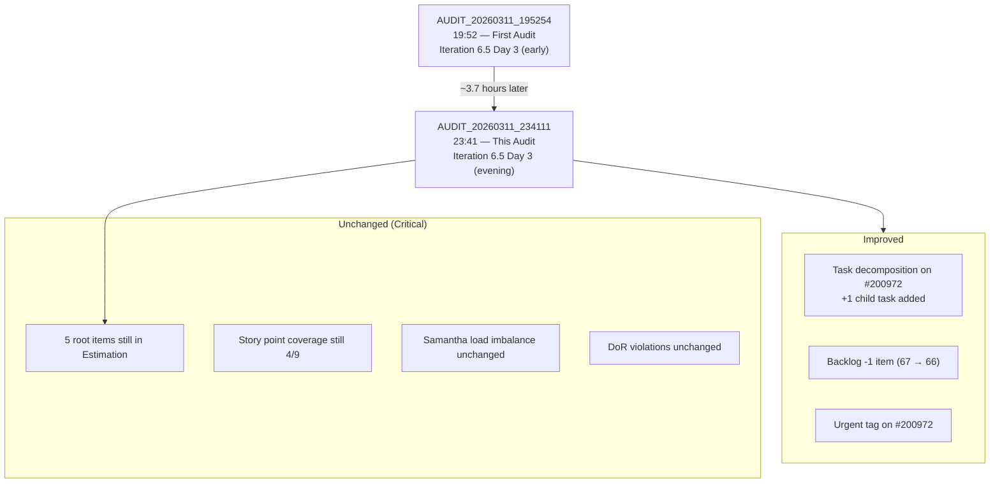

# SAFe Iteration Audit Report

**Project:** Life Style Help App
**Team:** Life Style Help App Team
**Audit Workspace:** `ado_ls_dev`
**Iteration:** 6.5 (2026-PI6)
**Sprint Dates:** March 9, 2026 – March 22, 2026
**Audit Date:** March 11, 2026
**Previous Audit:** AUDIT_20260311_195254.md (same day, ~3.7 hours earlier)
**Auditor:** Claude (AI SAFe Consultant)

---

## 1. Executive Summary

This is the **second audit** of Iteration 6.5 for the Life Style Help App team. The previous audit (AUDIT_20260311_195254.md) was conducted earlier the same day. This follow-up captures changes over a ~3.7-hour window and establishes the first iteration-to-iteration delta record for the `ado_ls_dev` workspace.

**Headline finding: The team made one meaningful positive move — decomposing the urgent defect #200972 into tasks — but no root item states advanced.** All five items still sitting in `Estimation` at sprint start remain there. The sprint commitment boundary is still undefined, estimation coverage is still weak, and backlog hygiene is unchanged. The most urgent risk identified in the previous audit has not been addressed.

The team is executing on interrupt work (#200972, tagged "Urgent") while carrying an over-committed sprint with insufficient readiness. If the pattern continues through the sprint end on March 22, delivery predictability will remain low.

---

## 2. Delta Summary: Previous vs. Current Audit

| Metric | Previous Audit (19:52) | Current Audit (23:41) | Change |
|---|---:|---:|---|
| Total iteration-linked items | 11 | 12 | +1 (new task #201018) |
| Root sprint items | 9 | 9 | No change |
| Child tasks | 2 | 3 | +1 |
| Items in `Estimation` | 5 | 5 | **No change** |
| Items in `Active` | 3 | 4 | +1 (new active task) |
| Items in `Ready for Dev` | 2 | 2 | No change |
| Items `Closed` | 1 | 1 | No change |
| Requirement backlog items | 67 | 66 | -1 (slight improvement) |
| Team capacity / day | 3 | 3 | No change |

---

## 3. Iteration 6.5 Current Snapshot

| Metric | Value | SAFe Interpretation |
|---|---:|---|
| Sprint dates | Mar 9 – Mar 22, 2026 | Day 3 of 14 |
| Team members with capacity | 3 | Stable |
| Total team capacity per day | 3 | Stable |
| Root sprint items | 9 | Unchanged |
| Total iteration-linked items | 12 | +1 child task added |
| Root items in `Estimation` | 5 | **Critical — no forward movement** |
| Root items with story points | 4 | Estimation coverage still incomplete |
| Story points on root items | 7 | Forecast baseline still weak |
| Requirement backlog items | 66 | Slight reduction from 67 |

### Team Capacity

| Person | Activity | Capacity / Day | Days Off |
|---|---|---:|---|
| Samantha Babael | Development | 1 | 0 |
| Luzmibel Paculanang | Testing | 1 | 0 |
| Ike Yana | Development | 1 | 0 |
| **Total** | | **3** | **0** |

---

## 4. Current Sprint Scope — Full Item Status

### 4.1 Root Items

| ID | Title | Type | State | Assigned To | Est. | Last Rev | Notes |
|---|---|---|---|---|---:|---|---|
| 195727 | The meal time filter dont respond when there is text in the searchbar | Defect | Active | Samantha Babael | 2 | Mar 9 | Unchanged |
| 198770 | [Apple Pay] Payment Fails After Successful Authentication | Defect | Ready for Dev | Ike Yana | 2 | Mar 9 | Unchanged |
| 199119 | [Subscription] Remove Payment Confirmation Pop-up | User Story | Estimation | Samantha Babael | 0 | Mar 9 | **Still in Estimation** |
| 195735 | Adjust text on membership package subscription page | User Story | Estimation | Samantha Babael | 0 | Mar 9 | **Still in Estimation** |
| 195716 | Hide "preferanser", "allergier" etc. inside recipe card | User Story | Estimation | Samantha Babael | 0 | Mar 9 | **Still in Estimation** |
| 195715 | Remove deadspace on Completed Session section | Defect | Estimation | Samantha Babael | 0 | Mar 9 | **Still in Estimation** |
| 200972 | Activate and investigate helga.presthus account | Defect | Active | Ike Yana | 0 | Mar 12 UTC | Tagged "Urgent"; 2 child tasks now |
| 198775 | [Admin] Workout Plans – Search Not Working on First Attempt | Defect | Estimation | Samantha Babael | 1 | Mar 9 | **Still in Estimation** |
| 196380 | Default Pinned Post for New Users | User Story | Ready for Dev | Ike Yana | 2 | Mar 9 | Unchanged |

### 4.2 Child Tasks

| ID | Parent | Title | Type | State | Assigned To | Notes |
|---|---:|---|---|---|---|---|
| 200973 | 200972 | QA - Defect Create - Bel | Task | Closed | Luzmibel Paculanang | Closed — no change |
| 201018 | 200972 | Investigate the cause | Task | Active | Ike Yana | **NEW since previous audit** |
| 197320 | 196380 | Implement Post Pinning Function | Task | Active | Ike Yana | Unchanged (10 hrs remaining) |

---

## 5. Change Analysis: What Happened Between Audits

**Key observations from this window:**

The only structural change is the addition of task **#201018 "Investigate the cause"** as a child of defect #200972. This signals the team is decomposing the urgent interrupt work into actionable sub-tasks, which is a positive practice. However, this is reactive decomposition on an unplanned interrupt item. The five planned sprint items in `Estimation` received no decomposition, no state advancement, and no estimation updates.

Defect #200972 has been tagged "Urgent," confirming this work is being treated as a priority interrupt. This is appropriate for customer-impacting issues but also means planned sprint capacity is being redirected away from committed iteration work.

---

## 6. Trend Analysis (Cross-Audit)

> Blue bar = Previous Audit | Orange line = Current Audit

**Pattern:** the team is not moving items forward in the workflow during normal working hours. Root items are stagnant across states. The only movement is at the task level for interrupt work.

---

## 7. SAFe Compliance Findings (Updated)

| # | Finding | Severity | Status vs. Previous Audit | SAFe Area |
|---|---|---|---|---|
| F1 | **5 of 9 root items remain in `Estimation` on Day 3 of sprint** | CRITICAL | 🔴 Unresolved — no change | Iteration Planning |
| F2 | **Only 4 of 9 root items have story point estimates** | HIGH | 🔴 Unresolved — no change | Estimation / Predictability |
| F3 | **Samantha carries 6 root items, most still early-stage** | HIGH | 🔴 Unresolved — no change | Capacity Allocation / Flow |
| F4 | **Committed items lack DoR compliance (Description + AC)** | HIGH | 🔴 Unresolved — no change | Definition of Ready |
| F5 | **66 requirement backlog items, many stale since 2024–2025** | HIGH | 🟡 Marginally improved (67 → 66) | Backlog Management |
| F6 | **Interrupt defect #200972 is consuming Ike Yana's capacity** | MEDIUM | 🟡 Now decomposed into tasks (positive) | Interrupt Handling |
| F7 | **No root items advanced state since audit cycle began** | NEW | 🔴 First cross-audit trend evidence | Flow / Throughput |

---

## 8. Positive Observations

| # | Observation |
|---|---|
| P1 | Task decomposition of #200972 into sub-tasks shows the team practices work breakdown on interrupt items |
| P2 | #200972 tagging as "Urgent" demonstrates the team has a class-of-service awareness |
| P3 | QA is actively engaged: Luzmibel closed #200973 during the audit window |
| P4 | Backlog count reduced by 1 — small but directionally correct |
| P5 | Zero days off for all team members — full capacity available |

---

## 9. Risks (Updated)

| Risk | Likelihood | Impact | Trend |
|---|---|---|---|
| Estimation items never reach Ready for Dev before sprint end | **High** | High | 🔴 Increasing — Day 3, still no movement |
| Sprint scope slips significantly (< 50% completion rate) | **High** | High | 🔴 Increasing — velocity signal is absent |
| Samantha bottleneck worsens as sprint progresses | **High** | High | 🔴 Stable risk, no mitigation taken |
| Interrupt work (#200972) consumes remaining sprint capacity | **Medium** | High | 🟡 Contained — now decomposed into tasks |
| Backlog aging continues with no grooming action | **High** | Medium | 🔴 Unchanged |

---

## 10. Velocity and Throughput Signal

Based on the sprint timeline (Day 3 of 14) and item state distribution, the projected throughput is concerning:

At the current pace, **only 2 root items** (#198770 and #196380, already in `Ready for Dev`) have a realistic path to `Closed` this sprint. The other 5 in `Estimation` have not moved and are at high risk of carrying over to Iteration 6.6.

Estimated completion rate if no state change occurs: **~22% of root items** (2 of 9).

---

## 11. Recommendations

### 11.1 Immediate (Today, March 11)

| # | Action | Owner | Priority |
|---|---|---|---|
| R1 | **Hold a mid-sprint recommitment session**: remove or defer any `Estimation` item that cannot reach `Ready for Dev` by March 14 | Ramon / PM | CRITICAL |
| R2 | **Estimate or defer**: the 5 unestimated root sprint items must get story points today or be explicitly moved to backlog | Team | CRITICAL |
| R3 | **Rebalance Samantha's load**: Samantha has 6 root items, far exceeding her daily capacity; some items must be reassigned or deferred | PM / Team Lead | HIGH |
| R4 | **Set an interrupt budget**: cap unplanned work at 20% of sprint capacity; explicitly track #200972 against this budget | PM | HIGH |

### 11.2 Before Sprint End (by March 22)

| # | Action | Owner | Priority |
|---|---|---|---|
| R5 | Break each `Estimation` item into at least one execution task before attempting to start work | Team | HIGH |
| R6 | Add missing Acceptance Criteria to #195716, #198775, and #200972 | Item Owners | HIGH |
| R7 | Move any item that misses Ready for Dev by Day 7 (March 15) back to backlog; do not carry un-ready work to sprint end | PM | HIGH |
| R8 | Review and close or re-estimate at least 10 backlog items older than 6 months | PM / PO | MEDIUM |

### 11.3 Process Improvements for Iteration 6.6

| # | Action | Owner | Priority |
|---|---|---|---|
| R9 | Implement a DoR gate: no item enters a sprint without Description, Acceptance Criteria, estimate, and owner | PMO / Team | HIGH |
| R10 | Establish a sprint interrupt policy with a defined capacity buffer (recommended: 1 person-day per sprint for unplanned defects) | PM | HIGH |
| R11 | Run a backlog refinement session before 6.6 sprint planning targeting items 161000–174000 (earliest stale IDs) | PM / PO | MEDIUM |
| R12 | Audit team workload distribution during sprint planning — cap any single team member to 3–4 sprint items | PM | MEDIUM |

---

## 12. Audit-to-Audit Comparison Summary

---

## 13. Conclusion

The second audit of Iteration 6.5 confirms that **the team is reacting well to urgent interrupt work** but has not yet applied the same discipline to its planned sprint commitment. In a ~4-hour window, the team added a task, completed a QA deliverable, and tagged urgent work appropriately — all green signals for responsiveness.

However, **not a single planned sprint item moved forward**. Five items remain in `Estimation` on Day 3. Without immediate recommitment or deferral, this sprint will likely close with only 2 of 9 root items completed — a forecasted velocity of ~7 story points against a sprint length that warrants at least 15–21.

The **most critical action is a recommitment conversation today**: narrow the sprint to items that are actually ready, defer the rest, and protect the team's capacity from further unplanned intake.
