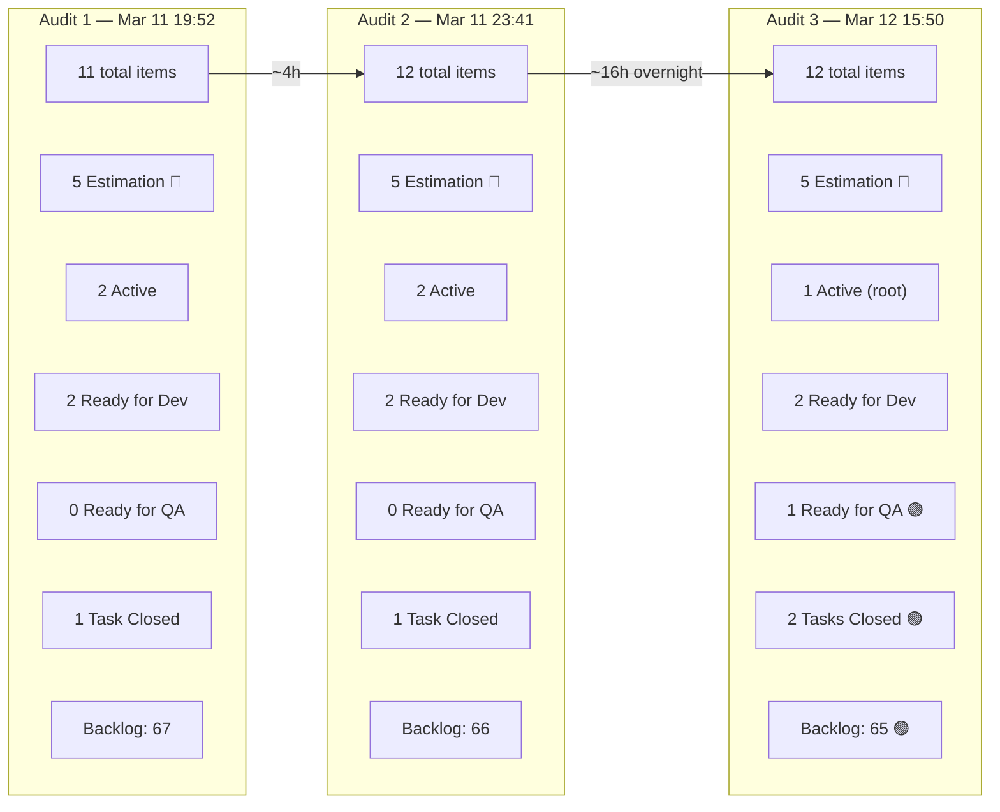
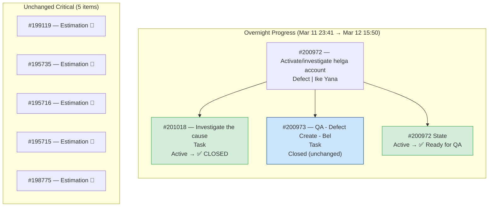
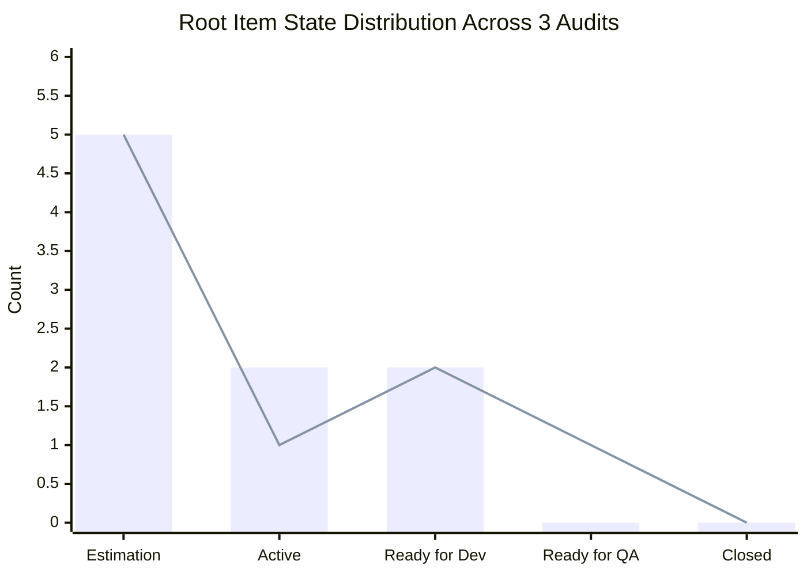
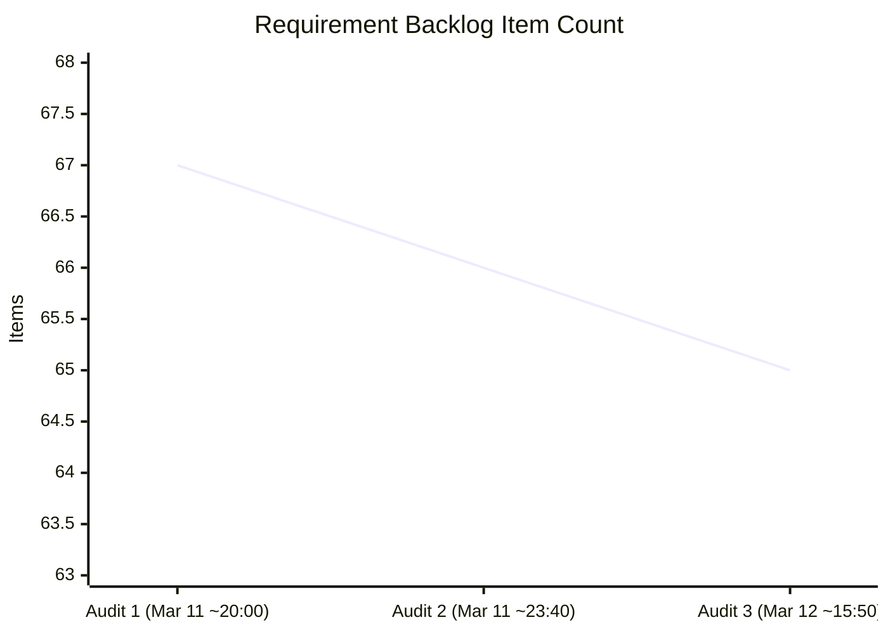
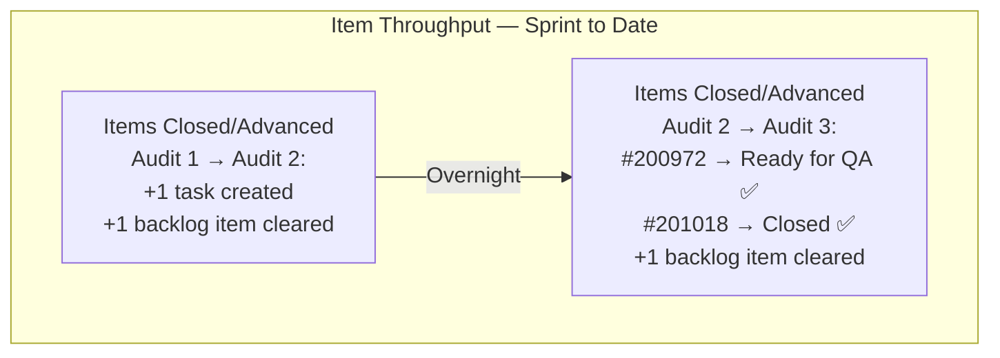
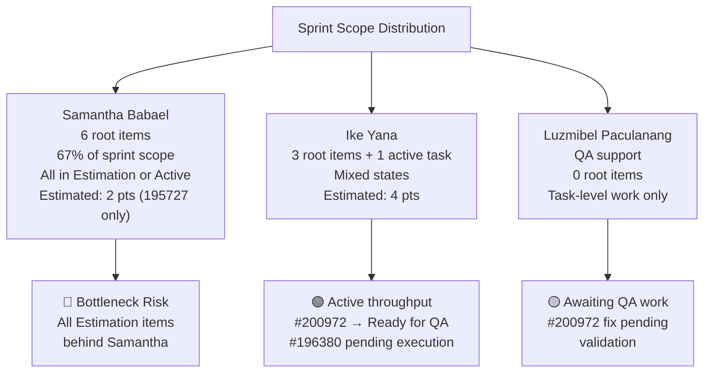
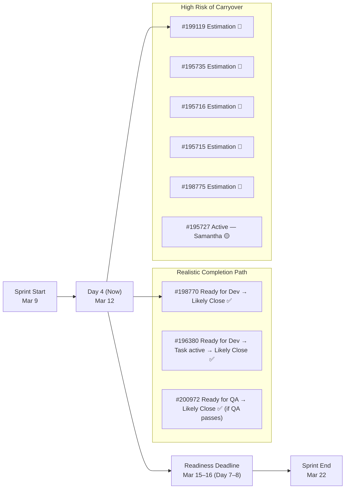

# SAFe Iteration Audit Report

**Project:** Life Style Help App
**Team:** Life Style Help App Team
**Audit Workspace:** `ado_ls_dev`
**Iteration:** 6.5 (2026-PI6)
**Sprint Dates:** March 9, 2026 – March 22, 2026
**Audit Date:** March 12, 2026 — 15:50 PT (Day 4 of 14)
**Previous Audits:**
- AUDIT_20260311_195254.md — Day 3 Early (1st audit)
- AUDIT_20260311_234111.md — Day 3 Evening (2nd audit)
**Auditor:** Claude (AI SAFe Consultant)

---

## 1. Executive Summary

This is the **third audit** of Iteration 6.5 for the Life Style Help App, spanning ~20 hours across three data snapshots (March 11 evening through March 12 mid-afternoon). This audit provides the first **full overnight delta** and the first cross-day trend view for this sprint.

**Headline finding: Overnight progress on interrupt work is positive, but the core sprint commitment remains stalled.** The urgent defect **#200972 advanced to `Ready for QA`** — the first root item to meaningfully progress in the workflow since the sprint started — and its investigation task **#201018 was closed**. The backlog also continued its slow decline (65 items, down from 67 at sprint start). These are encouraging signals of team throughput.

However, **all five Estimation-state root items remain completely unchanged** for the fourth consecutive day. No planning, estimation, acceptance criteria work, or state advancement occurred on the committed sprint scope. At Day 4 of 14, the window for recovery is narrowing. If the five `Estimation` items cannot reach `Ready for Dev` by mid-sprint (approximately March 15–16), they should be formally deferred to Iteration 6.6.

The forecasted sprint completion rate remains **~33% of root items** under current conditions.

---

## 2. Three-Audit Delta Summary

| Metric | Audit 1 (Mar 11 19:52) | Audit 2 (Mar 11 23:41) | **Audit 3 (Mar 12 15:50)** | Trend |
|---|---:|---:|---:|---|
| Total iteration-linked items | 11 | 12 | **12** | Stable |
| Root sprint items | 9 | 9 | **9** | Stable |
| Child tasks | 2 | 3 | **3** | Stable |
| Root items in `Estimation` | 5 | 5 | **5** | 🔴 No change |
| Root items `Active` | 2 | 2 | **1** | 🟡 -1 (200972 advanced) |
| Root items `Ready for Dev` | 2 | 2 | **2** | ⚪ Stable |
| Root items `Ready for QA` | 0 | 0 | **1** | 🟢 +1 NEW |
| Child tasks `Closed` | 1 | 1 | **2** | 🟢 +1 |
| Requirement backlog items | 67 | 66 | **65** | 🟢 Slow decline |
| Story points on root items | 7 | 7 | **7** | 🔴 No change |
| Items with story points | 4 | 4 | **4** | 🔴 No change |



---

## 3. Iteration 6.5 Current Snapshot

| Metric | Value | SAFe Interpretation |
|---|---|---|
| Sprint day | Day 4 of 14 | 29% through the sprint — critical readiness window |
| Team members with capacity | 3 | Stable |
| Total team capacity per day | 3 | Stable |
| Root sprint items | 9 | Unchanged |
| Total iteration-linked items | 12 | +1 child task vs. Audit 1 |
| Root items in `Estimation` | 5 | **Critical — stuck for 4 consecutive days** |
| Root items with story points | 4 | Estimation coverage still incomplete (44%) |
| Story points on root items | 7 | Unchanged; forecast baseline weak |
| Requirement backlog items | 65 | Gradual decline (67 → 65) |

### Team Capacity

| Person | Role | Capacity / Day | Days Off | Sprint Load |
|---|---|---:|---|---|
| Samantha Babael | Development | 1 | 0 | 6 root items (67% of sprint scope) |
| Ike Yana | Development | 1 | 0 | 3 root items + 1 active task |
| Luzmibel Paculanang | Testing | 1 | 0 | QA support role |
| **Total** | | **3** | **0** | Imbalanced |

---

## 4. Full Sprint Scope — Current Item Status

### 4.1 Root Items (9)

| ID | Title | Type | State | Assigned To | Pts | Change Since Audit 2 |
|---|---|---|---|---|---:|---|
| 195727 | Meal time filter doesn't respond with text in searchbar | Defect | Active | Samantha Babael | 2 | ⚪ Unchanged |
| 198770 | [Apple Pay] Payment Fails After Successful Authentication | Defect | Ready for Dev | Ike Yana | 2 | ⚪ Unchanged |
| 199119 | [Subscription] Remove Payment Confirmation Pop-up | User Story | Estimation | Samantha Babael | 0 | 🔴 **Unchanged — Day 4** |
| 195735 | Adjust text on membership package subscription page | User Story | Estimation | Samantha Babael | 0 | 🔴 **Unchanged — Day 4** |
| 195716 | Hide "preferanser", "allergier" etc. inside recipe card | User Story | Estimation | Samantha Babael | 0 | 🔴 **Unchanged — Day 4** |
| 195715 | Remove deadspace on Completed Session section | Defect | Estimation | Samantha Babael | 0 | 🔴 **Unchanged — Day 4** |
| 200972 | Activate and investigate helga.presthus@gmail.com | Defect | **Ready for QA** | Ike Yana | 0 | 🟢 **Advanced from Active** |
| 198775 | [Admin] Workout Plans – Search Not Working on First Attempt | Defect | Estimation | Samantha Babael | 1 | 🔴 **Unchanged — Day 4** |
| 196380 | Default Pinned Post for New Users | User Story | Ready for Dev | Ike Yana | 2 | ⚪ Unchanged |

### 4.2 Child Tasks (3)

| ID | Parent | Title | State | Assigned To | Change Since Audit 2 |
|---|---:|---|---|---|---|
| 200973 | 200972 | QA - Defect Create - Bel | Closed | Luzmibel Paculanang | ⚪ Unchanged |
| 201018 | 200972 | Investigate the cause | **Closed** | Ike Yana | 🟢 **Closed since Audit 2** |
| 197320 | 196380 | Implement Post Pinning Function | Active | Ike Yana | ⚪ Unchanged |

---

## 5. What Changed Overnight (Audit 2 → Audit 3)



**Interpretation:** Ike Yana completed the root cause investigation on the urgent account defect overnight. The item advanced from `Active` to `Ready for QA`, indicating a fix was implemented and is pending validation. This is a healthy workflow movement — interrupts are being resolved responsibly. Luzmibel Paculanang is next in line to validate the fix.

Meanwhile, Samantha Babael's six Estimation items received zero movement over the same ~16-hour window. This reinforces the two-track pattern: reactive interrupt work flows through the pipeline quickly, while planned sprint work stagnates.

---

## 6. Trend Analysis — Three-Audit Cross-View

### 6.1 Sprint State Distribution Over Time



> Bar = Audit 1 (Baseline) | Line = Audit 3 (Current)

### 6.2 Backlog Trend



### 6.3 Cumulative Progress Pattern



**Pattern Assessment:**

- The team is demonstrating consistent throughput on **interrupt-class** work (new issue → investigated → fixed → ready for QA in under 24 hours).
- **Planned sprint work has zero throughput** over 4 days. Not a single Estimation item has received a state change, estimation update, or task decomposition.
- Backlog is decreasing slowly, suggesting background pruning or natural attrition is occurring but no intentional grooming session.

---

## 7. Ownership Concentration Risk



**Samantha's load imbalance remains the single largest delivery risk this sprint.** With 6 root items (5 of which are in `Estimation`) and a daily capacity of 1, there is a mathematical impossibility: she cannot plan, estimate, develop, and test 5 items plus 1 active defect in the remaining 10 sprint days without selective deferral.

---

## 8. Velocity and Sprint Completion Forecast



| Scenario | Root Items Closed | Story Points | Completion Rate |
|---|---:|---:|---|
| **Optimistic** (Estimation items get unblocked by Day 7) | 7–8 | 7+ | 78–89% |
| **Baseline** (current pace continues) | 3 | 4 pts | **33%** |
| **Pessimistic** (further interrupt work enters) | 2 | 4 pts | 22% |

---

## 9. SAFe Compliance Findings (Updated — Audit 3)

| # | Finding | Severity | Status vs. Audit 2 | SAFe Area |
|---|---|---|---|---|
| F1 | **5 of 9 root items in `Estimation` on Day 4** | CRITICAL | 🔴 Unresolved — 4 days no movement | Iteration Planning |
| F2 | **Only 4 of 9 root items estimated; 7 pts total** | HIGH | 🔴 Unresolved — no change | Estimation / Predictability |
| F3 | **Samantha carries 67% of sprint scope; all Estimation** | HIGH | 🔴 Unresolved | Capacity Allocation / Flow |
| F4 | **DoR gaps: missing AC on #195716, #198775, #200972** | HIGH | 🔴 Unresolved | Definition of Ready |
| F5 | **65 backlog items, many stale since 2024–2025** | HIGH | 🟡 Slowly improving (67 → 65) | Backlog Management |
| F6 | **Interrupt work (#200972) consumed Ike's capacity** | MEDIUM | 🟢 Item now at Ready for QA — resolving | Interrupt Handling |
| F7 | **No planned items advanced state in 4 days** | CRITICAL | 🔴 Confirmed pattern across 3 audits | Flow / Throughput |
| F8 | **Sprint forecast: ~33% completion at current rate** | HIGH | NEW — Day 4 projection crystallizing | Predictability |

---

## 10. Positive Observations

| # | Observation |
|---|---|
| P1 | **#200972 advanced to `Ready for QA`** — first root item to move forward in workflow since sprint start |
| P2 | Overnight throughput on interrupt work demonstrates team is capable of rapid response and quality delivery |
| P3 | Ike Yana's workstream is healthy: both active items (#200972, #196380) are progressing |
| P4 | Luzmibel Paculanang is available and engaged for QA — #200973 was closed, #200972 fix awaiting validation |
| P5 | Backlog count is declining across all three audits (67 → 65), suggesting natural attrition or background pruning |
| P6 | Team capacity is stable and fully available — no days off declared by any team member |
| P7 | The team demonstrated sub-24-hour resolution on an urgent production-style customer issue |

---

## 11. Risks (Updated)

| Risk | Likelihood | Impact | Trend |
|---|---|---|---|
| 5 Estimation items never reach `Ready for Dev` before sprint end | **Very High** | High | 🔴 Increasing — Day 4 with zero movement |
| Sprint closes with < 35% completion (3 or fewer root items closed) | **High** | High | 🔴 Baseline now forecasts 33% |
| Samantha becomes critical bottleneck if not redistributed | **Very High** | High | 🔴 No mitigation observed |
| DoR violations persist into next sprint | **High** | Medium | 🔴 No AC work observed |
| QA bottleneck if #200972 requires rework | **Low** | Medium | 🟡 New — awaiting QA outcome |
| Backlog aging worsens without dedicated grooming session | **High** | Medium | 🔴 Background attrition only, no active grooming |

---

## 12. Recommendations

### 12.1 Immediate (Today, March 12)

| # | Action | Owner | Priority |
|---|---|---|---|
| R1 | **Formal recommitment session**: with 10 days left, hold a 30-min team sync to explicitly decide which Estimation items remain in the sprint and which are deferred | Ramon / PM | CRITICAL |
| R2 | **For each Estimation item staying in sprint**: assign story points and add missing Acceptance Criteria today — no more days in `Estimation` without readiness work | Item Owners | CRITICAL |
| R3 | **Rebalance Samantha's load**: defer at least 2–3 of Samantha's 5 Estimation items to 6.6 backlog to protect her capacity for the items that will stay | PM / Team | HIGH |
| R4 | **QA: validate #200972 fix** — Luzmibel should pick up the Ready for QA defect today to keep the interrupt workflow moving | Luzmibel | HIGH |

### 12.2 Before Sprint End (by March 22)

| # | Action | Owner | Priority |
|---|---|---|---|
| R5 | Set Day 7 (March 15) as the final gate: any item not in `Ready for Dev` by then is moved to 6.6 without exception | PM | HIGH |
| R6 | Break #195727 (Active, Samantha) into at least one task to make work visible and enable progress tracking | Samantha | HIGH |
| R7 | Document the interrupt budget rule: cap unplanned defects at 1 person-day per sprint; formally tag #200972 as interrupt spend | PM | MEDIUM |
| R8 | Review and close or re-estimate 5+ backlog items from the oldest cohort (IDs 160000–165000) | PM / PO | MEDIUM |

### 12.3 Process Improvements for Iteration 6.6 Planning

| # | Action | Owner | Priority |
|---|---|---|---|
| R9 | **Enforce DoR gate at sprint planning**: no item enters sprint without Description, Acceptance Criteria, estimate, and owner | PMO / Team | HIGH |
| R10 | **Cap single-person sprint load at 3 root items maximum**: distribute across all developers | PM | HIGH |
| R11 | **Run a dedicated backlog refinement session** before 6.6 sprint planning targeting the oldest stale IDs (160000–174000) | PM / PO | HIGH |
| R12 | **Establish a sprint interrupt buffer**: reserve 1 capacity unit per sprint for urgent defects; track separately from planned work | PM | HIGH |
| R13 | Introduce a sprint burn-down or cumulative flow diagram to make stagnation visible in real-time (not just in audits) | Scrum Master / PM | MEDIUM |

---

## 13. Cross-Audit Learning Summary

```mermaid
flowchart TD
    A["AUDIT 1\nMar 11 19:52\nBaseline established\nDay 3 of Sprint"]
    B["AUDIT 2\nMar 11 23:41\n+1 task added to #200972\nBacklog -1\nEstimation unchanged"]
    C["AUDIT 3\nMar 12 15:50\n#200972 → Ready for QA ✅\n#201018 → Closed ✅\nBacklog -1 again\nEstimation still 5 🔴"]

    A -->|"~4 hours"| B
    B -->|"~16 hours\novernight"| C

    subgraph "Consistently Improving"
        I1["Backlog: 67 → 66 → 65 ✅"]
        I2["Interrupt throughput: fast and improving ✅"]
        I3["Task decomposition on interrupt work ✅"]
    end

    subgraph "Consistently Stagnant"
        S1["Estimation items: 5 across all 3 audits 🔴"]
        S2["Story point coverage: 4/9 across all 3 audits 🔴"]
        S3["Samantha load: 6 items across all 3 audits 🔴"]
        S4["DoR compliance: no improvement 🔴"]
    end

    C --> Consistently Improving
    C --> S1
```

**Key learnings across three audits:**

The team exhibits a **dual-track pattern**: interrupt work flows efficiently with decomposition, tagging, and rapid QA handoff, while planned sprint work sits in `Estimation` without any state movement. This is a structural process issue, not a capacity or motivation issue. The team can and does deliver quickly when the urgency is clear. The problem is that planned Estimation items lack the same urgency signal and DoR readiness to enter execution.

The persistent ownership concentration on Samantha Babael across three consecutive audits confirms this is not an ad-hoc issue but a structural sprint planning habit that needs to be addressed at the next sprint planning ceremony with explicit ownership caps.

---

## 14. Conclusion

Day 4 of Iteration 6.5 brings the first genuinely positive workflow signal of the sprint: **#200972 has advanced to `Ready for QA`**, demonstrating that the team can complete root items when they are ready, urgent, and well-decomposed. This is important evidence that the team's throughput capability exists — it simply has not been applied to the planned sprint scope.

The core challenge going into the second half of the sprint is whether a recommitment conversation can be held before Day 7 (March 15). With five items stuck in `Estimation` for four days, the team needs to make an explicit binary choice for each one: **invest the readiness work today, or defer to 6.6**. Carrying them forward without action only erodes confidence in the sprint forecast without improving delivery outcomes.

The recommended path forward: narrow the sprint to the three items with a realistic path to closure (#198770, #196380, and #200972), defer the five `Estimation` items to a properly prepared 6.6, and use the remaining sprint capacity to close what is genuinely ready.

---

*Audit generated by Claude AI SAFe Consultant | Data source: Azure DevOps — jairo org | Iteration 6.5 snapshot as of March 12, 2026 15:50 PT*
