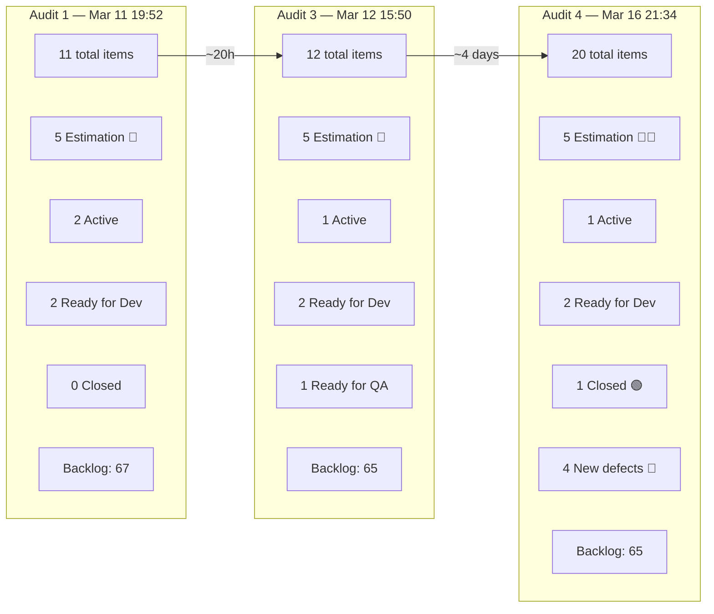
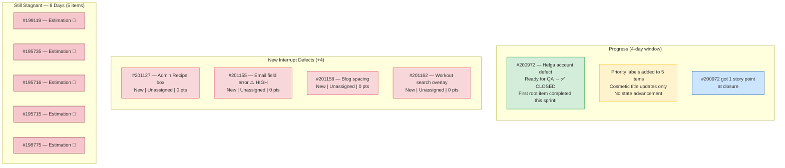
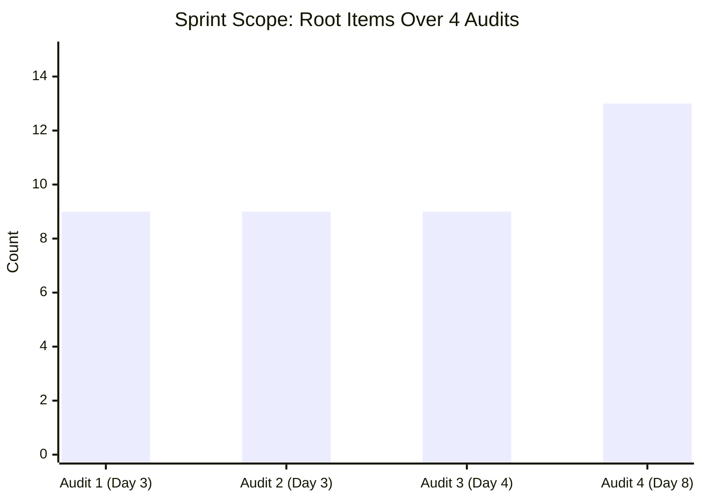
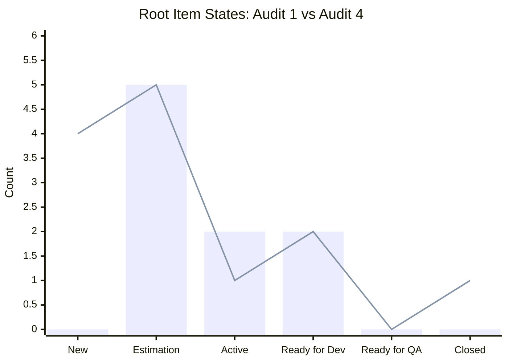
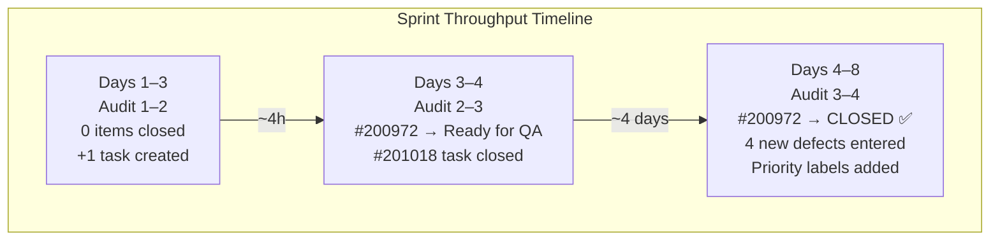
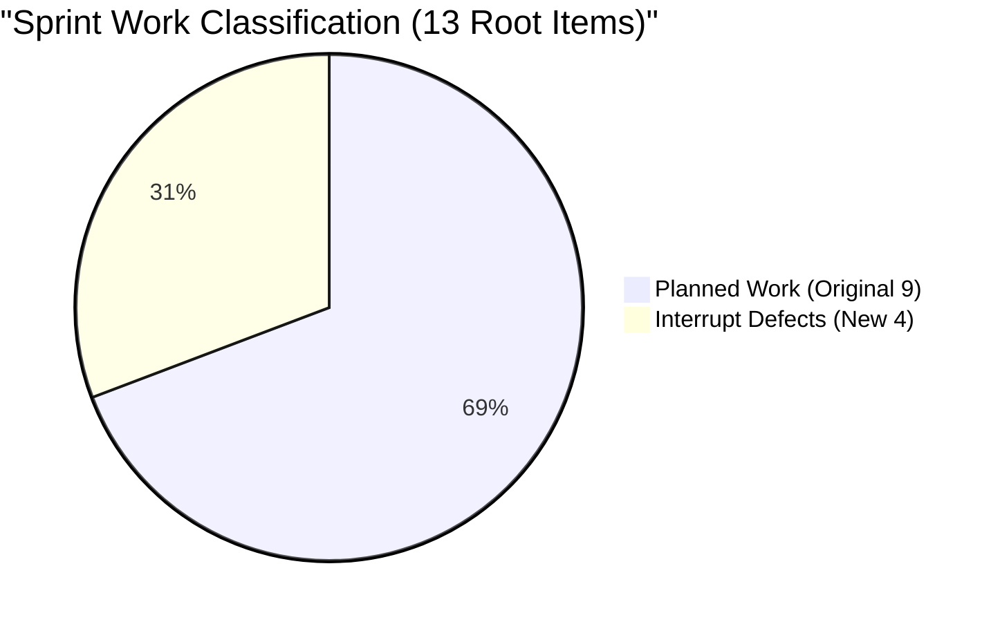
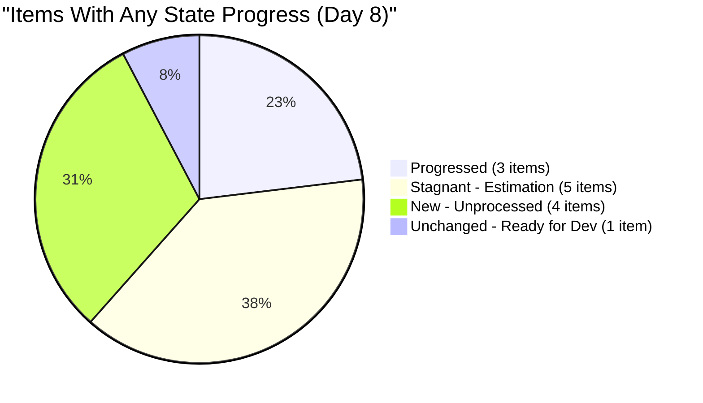
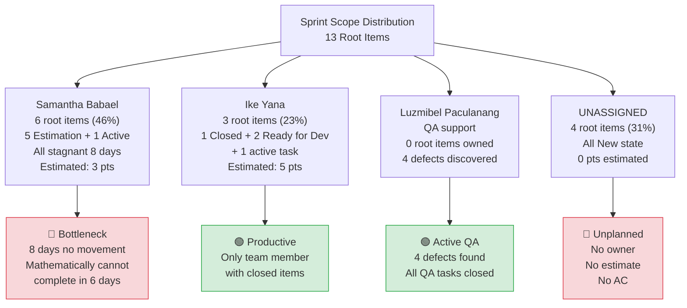
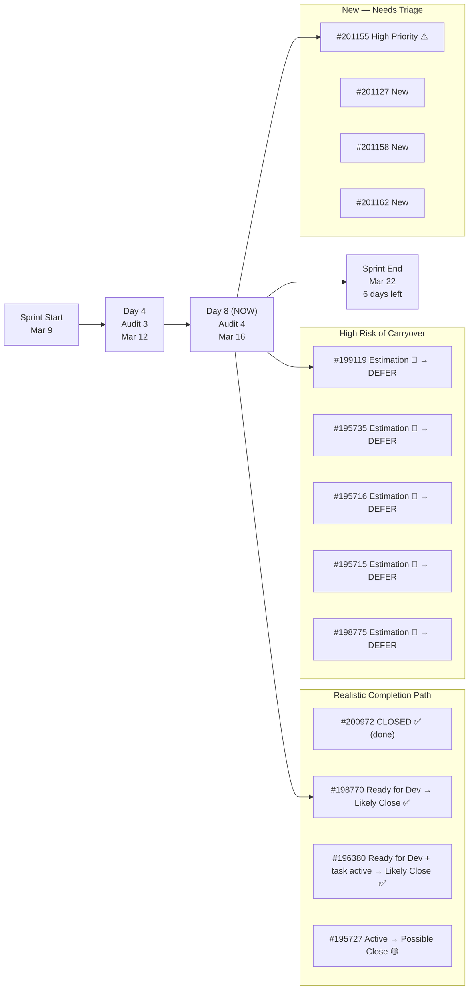
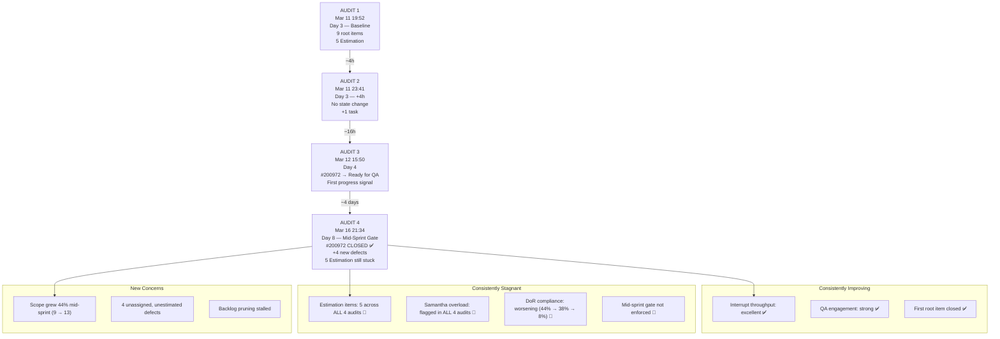

# SAFe Iteration Audit Report

**Project:** Life Style Help App
**Team:** Life Style Help App Team
**Audit Workspace:** `ado_ls_dev`
**Iteration:** 6.5 (2026-PI6)
**Sprint Dates:** March 9, 2026 – March 22, 2026
**Audit Date:** March 16, 2026 — 21:34 PT (Day 8 of 14)
**Previous Audits:**
- AUDIT_20260311_195254.md — Day 3 Early (1st audit)
- AUDIT_20260311_234111.md — Day 3 Evening (2nd audit)
- AUDIT_20260312_155024.md — Day 4 Mid-afternoon (3rd audit)
**Auditor:** Claude (AI SAFe Consultant)

---

## 1. Executive Summary

This is the **fourth audit** of Iteration 6.5, and critically, it falls exactly on the **Day 7–8 mid-sprint readiness deadline** recommended in Audit 3. This audit represents the most significant snapshot of the sprint to date because it determines whether the stalled Estimation items should be formally deferred.

**Headline: The sprint's first root item has closed, but interrupt volume has doubled the original scope — and the core sprint commitment remains frozen.**

The urgent defect **#200972 is now Closed** — the first and only root item to complete the full workflow this sprint. This is a meaningful milestone. However, **four brand-new defects** (#201127, #201155, #201158, #201162) entered the sprint since the last audit, all discovered by QA (Luzmibel Paculanang). These are currently unassigned, unestimated, and in `New` state.

Meanwhile, **all five Estimation-state items have not advanced a single state in 8 days**. Some received cosmetic title updates (priority labels added) and minor field changes, but no state progression, no story points added, and no task decomposition occurred. The mid-sprint readiness gate has now passed — these items should be formally deferred to Iteration 6.6 per the recommendation from Audit 3.

**Forecasted sprint completion: 3–4 root items (23–31%) under baseline conditions, or 5–6 (38–46%) if the team pivots to the actionable items immediately.**

---

## 2. Four-Audit Delta Summary

| Metric                       | Audit 1 (Mar 11) | Audit 2 (Mar 11) | Audit 3 (Mar 12) | **Audit 4 (Mar 16)** | Trend                                 |
| ---------------------------- | ---------------: | ---------------: | ---------------: | -------------------: | ------------------------------------- |
| Total iteration-linked items |               11 |               12 |               12 |               **20** | 🔴 +8 (scope creep)                   |
| Root sprint items            |                9 |                9 |                9 |               **13** | 🔴 +4 new defects                     |
| Child tasks                  |                2 |                3 |                3 |                **7** | +4 QA tasks                           |
| Root items in `New`          |                0 |                0 |                0 |                **4** | 🔴 NEW interrupt defects              |
| Root items in `Estimation`   |                5 |                5 |                5 |                **5** | 🔴 **No change — 8 consecutive days** |
| Root items `Active`          |                2 |                2 |                1 |                **1** | Stable                                |
| Root items `Ready for Dev`   |                2 |                2 |                2 |                **2** | Stable                                |
| Root items `Ready for QA`    |                0 |                0 |                1 |                **0** | Advanced to Closed                    |
| Root items `Closed`          |                0 |                0 |                0 |                **1** | 🟢 **First closure!**                 |
| Child tasks `Closed`         |                1 |                1 |                2 |                **6** | 🟢 +4 (QA defect creation tasks)      |
| Requirement backlog items    |               67 |               66 |               65 |               **65** | Stalled                               |
| Story points on root items   |                7 |                7 |                7 |                **8** | +1 (200972 estimated at close)        |
| Items with story points      |                4 |                4 |                4 |                **5** | +1                                    |

---

## 3. Iteration 6.5 Current Snapshot

| Metric | Value | SAFe Interpretation |
|---|---|---|
| Sprint day | Day 8 of 14 | **57% through — mid-sprint gate reached** |
| Team members with capacity | 3 | Stable |
| Total team capacity per day | 3 | Stable |
| Root sprint items | 13 | +4 since Audit 3 (scope increase) |
| Total iteration-linked items | 20 | +8 since Audit 3 |
| Root items in `Estimation` | 5 | **CRITICAL — stuck for 8 consecutive days** |
| Root items in `New` | 4 | New interrupt defects, unassigned |
| Root items with story points | 5 of 13 | Estimation coverage 38% (down from 44%) |
| Story points on root items | 8 | +1 since Audit 3 |
| Root items `Closed` | 1 | First closure this sprint |
| Requirement backlog items | 65 | Stalled (no change since Audit 3) |

### Team Capacity

| Person | Role | Capacity / Day | Days Off | Sprint Load |
|---|---|---:|---|---|
| Samantha Babael | Development | 1 | 0 | 6 root items (5 Estimation + 1 Active) — **46% of root scope** |
| Ike Yana | Development | 1 | 0 | 3 root items (1 Closed, 2 Ready for Dev) + 1 active task |
| Luzmibel Paculanang | Testing | 1 | 0 | QA support + 4 new defect discoveries |
| **Unassigned** | — | — | — | **4 new defects — no owner** |
| **Total** | | **3** | **0** | **Severely imbalanced** |

---

## 4. Full Sprint Scope — Current Item Status

### 4.1 Root Items (13)

| ID     | Title                                                       | Type       | State         | Assigned To     | Pts | Change Since Audit 3                    |
| ------ | ----------------------------------------------------------- | ---------- | ------------- | --------------- | --: | --------------------------------------- |
| 200972 | Activate and investigate helga.presthus@gmail.com           | Defect     | **Closed**    | Ike Yana        |   1 | 🟢 **Ready for QA → Closed**            |
| 195727 | Meal time filter doesn't respond with text in searchbar     | Defect     | Active        | Samantha Babael |   2 | 🟡 Title updated (priority label added) |
| 198770 | [Apple Pay] Payment Fails After Authentication              | Defect     | Ready for Dev | Ike Yana        |   2 | ⚪ Unchanged                             |
| 196380 | Default Pinned Post for New Users                           | User Story | Ready for Dev | Ike Yana        |   2 | 🟡 Title updated (priority label added) |
| 199119 | [Subscription] Remove Payment Confirmation Pop-up           | User Story | Estimation    | Samantha Babael |   0 | 🔴 **Unchanged — Day 8**                |
| 195735 | Adjust text on membership package subscription page         | User Story | Estimation    | Samantha Babael |   0 | 🔴 **Unchanged — Day 8**                |
| 195716 | Hide "preferanser", "allergier" inside recipe card          | User Story | Estimation    | Samantha Babael |   0 | 🔴 **Unchanged — Day 8**                |
| 195715 | Remove deadspace on Completed Session section               | Defect     | Estimation    | Samantha Babael |   0 | 🔴 **Unchanged — Day 8**                |
| 198775 | [Admin] Workout Plans – Search Not Working on First Attempt | Defect     | Estimation    | Samantha Babael |   1 | 🔴 **Unchanged — Day 8**                |
| 201127 | [Admin][Recipe] Unnecessary box at top of page              | Defect     | **New**       | **Unassigned**  |   0 | 🆕 **Created Mar 16**                   |
| 201155 | [High Priority] Email Field Error While Typing Before Login | Defect     | **New**       | **Unassigned**  |   0 | 🆕 **Created Mar 17**                   |
| 201158 | [Medium] Blog Posts Excessive Line Spacing                  | Defect     | **New**       | **Unassigned**  |   0 | 🆕 **Created Mar 17**                   |
| 201162 | [Low] Workout Search Suggestions Obstruct Exercise List     | Defect     | **New**       | **Unassigned**  |   0 | 🆕 **Created Mar 17**                   |

### 4.2 Child Tasks (7)

| ID | Parent | Title | State | Assigned To | Change Since Audit 3 |
|---|---:|---|---|---|---|
| 200973 | 200972 | QA - Defect Create - Bel | Closed | Luzmibel Paculanang | ⚪ Unchanged |
| 201018 | 200972 | Investigate the cause | Closed | Ike Yana | ⚪ Unchanged |
| 197320 | 196380 | Implement Post Pinning Function | Active | Ike Yana | ⚪ Unchanged |
| 201128 | 201127 | QA - Create defect - Bel | **Closed** | Luzmibel Paculanang | 🆕 **New task** |
| 201160 | 201155 | QA - Create and Replicate Defect - Bel | **Closed** | Luzmibel Paculanang | 🆕 **New task** |
| 201159 | 201158 | QA - Create and Replicate Defect - Bel | **Closed** | Luzmibel Paculanang | 🆕 **New task** |
| 201163 | 201162 | QA - Create and Replicate Defect - Bel | **Closed** | Luzmibel Paculanang | 🆕 **New task** |

### 4.3 Iteration Path Anomalies

Two new defects are assigned to the **PI-level iteration path** rather than the sprint-level path:

| ID | Current Iteration Path | Expected |
|---|---|---|
| 201158 | `Life Style Help App\2026-PI6` | `Life Style Help App\2026-PI6\Iteration 6.5` |
| 201162 | `Life Style Help App\2026-PI6` | `Life Style Help App\2026-PI6\Iteration 6.5` |

These items appear in the iteration work items but are not properly assigned to Iteration 6.5. This should be corrected for accurate sprint tracking.

---

## 5. What Changed Since Audit 3 (Mar 12 → Mar 16)

**Key observations:**

1. **#200972 completed the full lifecycle** (New → Active → Ready for QA → Closed) — demonstrating the team can close items when they are ready and decomposed. Story point was added at closure (1pt), giving the sprint its only earned velocity.

2. **Someone performed a priority-labeling pass** on 5 existing items (added `[Low priority]`, `[Medium priority]` tags to titles) between March 16–17. This is a positive grooming signal but no items actually advanced state.

3. **Luzmibel Paculanang discovered 4 new defects** during QA testing, each with a closed "QA - Create defect" task. This shows active QA engagement but also injects unplanned work into an already overloaded sprint.

4. **The 5 Estimation items have now been stagnant for 8 consecutive days** — the entire first half of the sprint. The mid-sprint gate (Day 7–8) recommended in Audit 3 has arrived with zero readiness progress on these items.

---

## 6. Trend Analysis — Four-Audit Cross-View

### 6.1 Sprint Scope Growth Over Time

### 6.2 Root Item State Distribution Over Time

> Bar = Audit 1 (Baseline) | Line = Audit 4 (Current)

### 6.3 Cumulative Sprint Throughput

### 6.4 Interrupt vs. Planned Work Pattern

---

## 7. DoR (Definition of Ready) Compliance

| ID | Title | Description | Acceptance Criteria | Story Points | Owner | DoR Status |
|---|---|---|---|---|---|---|
| 200972 | Helga account | ✅ | ❌ | ✅ 1 | ✅ | **Closed** (moot) |
| 195727 | Meal time filter | ✅ | ❌ Missing | ✅ 2 | ✅ | 🔴 **FAIL** |
| 198770 | Apple Pay | ✅ | ❌ Missing | ✅ 2 | ✅ | 🔴 **FAIL** |
| 199119 | Subscription pop-up | ✅ | ✅ | ❌ 0 | ✅ | 🟡 **Partial** |
| 195735 | Membership text | ✅ | ✅ | ❌ 0 | ✅ | 🟡 **Partial** |
| 195716 | Hide preferences | ✅ | ❌ Missing | ❌ 0 | ✅ | 🔴 **FAIL** |
| 195715 | Remove deadspace | ✅ | ❌ Missing | ❌ 0 | ✅ | 🔴 **FAIL** |
| 198775 | Workout search | ✅ | ❌ Missing | ✅ 1 | ✅ | 🔴 **FAIL** |
| 196380 | Default Pinned Post | ✅ | ✅ | ✅ 2 | ✅ | ✅ **PASS** |
| 201127 | Recipe box | ✅ | ❌ Missing | ❌ 0 | ❌ | 🔴 **FAIL** |
| 201155 | Email field error | ❌ Missing | ❌ Missing | ❌ 0 | ❌ | 🔴 **FAIL** |
| 201158 | Blog spacing | ✅ | ❌ Missing | ❌ 0 | ❌ | 🔴 **FAIL** |
| 201162 | Workout suggestions | ✅ | ❌ Missing | ❌ 0 | ❌ | 🔴 **FAIL** |

**DoR Summary:** Only **1 of 12 active root items passes DoR** (#196380). This is a 8% pass rate — the worst across all four audits due to the influx of raw, unrefined defects.

---

## 8. Ownership Concentration Risk

**Samantha's load remains the single largest delivery risk.** With 6 root items (5 in Estimation for 8 days) and only 6 sprint days remaining at 1 capacity/day, it is mathematically impossible for her to plan, develop, test, and close all of them. The priority-labeling activity suggests awareness of the backlog, but no items have entered execution.

**New risk: 31% of sprint scope is unassigned.** The 4 new defects have no owner, no estimates, and no acceptance criteria. If assigned to Samantha, her load becomes 10 items (77% of scope). If assigned to Ike, it disrupts his work on the Ready for Dev items.

---

## 9. Velocity and Sprint Completion Forecast

| Scenario | Root Items Closed | Story Points Earned | Completion Rate |
|---|---:|---:|---|
| **Optimistic** (new defects triaged quickly, Samantha unblocks 1–2 items) | 5–6 | 8–9 | 38–46% |
| **Baseline** (current pace, Ike closes Ready for Dev items) | 3–4 | 6–7 | **23–31%** |
| **Pessimistic** (more interrupts, rework on closed items) | 2 | 5 | 15% |

**Earned velocity to date:** 1 root item closed, 1 story point earned in 8 sprint days.

---

## 10. SAFe Compliance Findings (Updated — Audit 4)

| #   | Finding                                                                   | Severity | Status vs. Audit 3                                 | SAFe Area                   |
| --- | ------------------------------------------------------------------------- | -------- | -------------------------------------------------- | --------------------------- |
| F1  | **5 of 13 root items in `Estimation` on Day 8 — zero movement in 8 days** | CRITICAL | 🔴 Unresolved — doubled in duration                | Iteration Planning          |
| F2  | **Only 5 of 13 root items estimated (38%); 8 pts total**                  | HIGH     | 🔴 Worsened (was 44%) due to new unestimated items | Estimation / Predictability |
| F3  | **Samantha carries 46% of sprint scope; all stagnant**                    | HIGH     | 🔴 Unresolved — now 8 days stuck                   | Capacity Allocation / Flow  |
| F4  | **DoR: 1 of 12 active items passes (8%)**                                 | CRITICAL | 🔴 Worsened (was ~22%)                             | Definition of Ready         |
| F5  | **65 backlog items, stalled since Audit 3**                               | HIGH     | 🟡 No change — pruning stopped                     | Backlog Management          |
| F6  | **4 new defects entered mid-sprint, all unassigned**                      | HIGH     | 🆕 New finding                                     | Interrupt Handling / Flow   |
| F7  | **Sprint scope grew 44% mid-sprint (9 → 13 root items)**                  | HIGH     | 🆕 New finding                                     | Sprint Commitment Integrity |
| F8  | **2 items at PI-level iteration path instead of sprint**                  | MEDIUM   | 🆕 New finding                                     | Work Item Hygiene           |
| F9  | **Sprint forecast: 23–31% completion at current rate**                    | HIGH     | 🔴 Down from 33% (Audit 3)                         | Predictability              |
| F10 | **Mid-sprint readiness gate (R5 from Audit 3) not enforced**              | HIGH     | 🔴 Recommendation ignored                          | Process Discipline          |

---

## 11. Positive Observations

| # | Observation |
|---|---|
| P1 | **#200972 fully closed** — the first root item to complete the full lifecycle this sprint. Demonstrates team can close items that are well-decomposed and urgent. |
| P2 | **Luzmibel Paculanang is actively testing and discovering defects** — 4 new defects found with proper QA task documentation. Shows healthy QA engagement. |
| P3 | **Priority labeling pass occurred** — someone added `[Low priority]`, `[Medium priority]`, `[High Priority]` labels to 5+ items, suggesting grooming awareness. |
| P4 | **Ike Yana's throughput is consistent** — closed #200972, has two Ready for Dev items positioned for execution in the second half. |
| P5 | **Team capacity remains fully available** — no days off for any team member through sprint end. |
| P6 | **QA tasks are properly decomposed** — each new defect has a corresponding closed QA task for defect creation/replication. |
| P7 | **#201155 flagged as High Priority** — the team is distinguishing severity on new findings, enabling triage. |

---

## 12. Risks (Updated)

| Risk | Likelihood | Impact | Trend (vs. Audit 3) |
|---|---|---|---|
| 5 Estimation items never reach `Ready for Dev` before sprint end | **Very High** | High | 🔴 **Near certain — 8 days with zero movement** |
| Sprint closes with < 35% completion | **Very High** | High | 🔴 Increased — scope grew but throughput didn't |
| Samantha becomes irrecoverable bottleneck | **Very High** | High | 🔴 No mitigation — 8 days stagnant |
| New defects assigned to Samantha, worsening overload | **High** | High | 🆕 New risk |
| #201155 (High Priority email defect) disrupts planned work | **High** | Medium | 🆕 New risk — may require immediate attention |
| DoR violations carry into Iteration 6.6 without process change | **Very High** | Medium | 🔴 Worsened — rate dropped to 8% |
| Backlog aging worsens without dedicated grooming | **High** | Medium | 🔴 Pruning stalled at 65 |
| Sprint scope continues to grow as QA finds more defects | **Medium** | High | 🆕 New risk — 4 defects in 4 days |

---

## 13. Recommendations

### 13.1 Immediate (Today/Tomorrow, March 16–17)

| # | Action | Owner | Priority |
|---|---|---|---|
| R1 | **Formally defer all 5 Estimation items to Iteration 6.6** — the Day 7–8 readiness gate has passed with zero progress. Carrying them forward wastes sprint commitment credibility. | Ramon / PM | **CRITICAL** |
| R2 | **Triage the 4 new defects immediately**: assign owners, add acceptance criteria, and estimate. #201155 (High Priority — email field error) should be triaged first. | Ramon / PM | **CRITICAL** |
| R3 | **Fix iteration paths** on #201158 and #201162 — move from PI6 level to `Iteration 6.5` or explicitly defer to 6.6. | Ramon / PM | HIGH |
| R4 | **Assign new defects to Ike** (not Samantha) — Ike has demonstrated throughput and will free up after #198770 and #196380. | PM | HIGH |

### 13.2 Remaining Sprint (March 17–22, 6 days)

| # | Action | Owner | Priority |
|---|---|---|---|
| R5 | **Focus Ike on closing #198770 and #196380** — these are the highest-value achievable items with DoR compliance. | Ike | HIGH |
| R6 | **Focus Samantha on #195727** (Active, 2pts) — reduce her scope to one item and get it closed before sprint end. | Samantha | HIGH |
| R7 | **Luzmibel to validate any fixes** — keep QA pipeline flowing. Pause new defect discovery if it overwhelms dev capacity. | Luzmibel / PM | MEDIUM |
| R8 | **Document earned velocity**: 1 root item, 1 story point in 8 days. Use this data for 6.6 planning. | PM | MEDIUM |

### 13.3 Process Improvements for Iteration 6.6 Planning

| # | Action | Owner | Priority |
|---|---|---|---|
| R9 | **Enforce DoR gate at sprint planning**: no item enters sprint without Description, Acceptance Criteria, estimate, and owner. Current 8% pass rate is unacceptable. | PMO / Team | **CRITICAL** |
| R10 | **Cap single-person sprint load at 3 root items** — Samantha's 6-item load has been flagged in all 4 audits with zero improvement. | PM | HIGH |
| R11 | **Establish formal interrupt budget**: reserve 20% of sprint capacity (approximately 2 items) for unplanned defects. Track separately from committed work. | PM | HIGH |
| R12 | **Run a dedicated backlog refinement session** before 6.6 planning — target oldest stale IDs (160000–168000 range, likely from 2024–2025). | PM / PO | HIGH |
| R13 | **Separate defect discovery from sprint commitment** — QA-discovered defects should go to a triage queue, not directly into the active sprint. | PM / Process | HIGH |
| R14 | **Implement sprint burn-down chart** — 4 audits have been needed to make stagnation visible. A real-time burn-down would surface this on Day 2, not Day 8. | Scrum Master / PM | MEDIUM |

---

## 14. Cross-Audit Learning Summary

**The fundamental pattern across four audits is now undeniable:**

The team operates in **two completely separate tracks**. Track 1 (interrupt/reactive) works efficiently — items flow from discovery to closure in days with proper decomposition, QA handoff, and resolution. Track 2 (planned/committed) is frozen — the same 5 Estimation items have not moved a single state in 8 days across 4 audits.

This is not a capacity problem. Ike closed a root item. Luzmibel found and documented 4 defects. Samantha's items received priority labels. The team is active. The problem is **structural**: planned items lack urgency signals, DoR readiness, and the process discipline to either prepare them or defer them.

The mid-sprint readiness gate recommended in Audit 3 (R5: "any item not in Ready for Dev by Day 7 moves to 6.6 without exception") was not enforced. This is the most important process failure of this sprint — it means the same pattern will repeat in 6.6 unless the gate is formalized with accountability.

---

## 15. Conclusion

Day 8 of Iteration 6.5 delivers a bittersweet milestone. The sprint's **first and likely only root-item closure** (#200972) proves the team can deliver when items are ready and urgent. But the sprint's scope has silently grown 44% through interrupt defects while the planned commitment remains completely frozen.

With 6 days remaining, the pragmatic path is clear:

1. **Defer the 5 Estimation items to 6.6** — they are not going to close this sprint.
2. **Triage the 4 new defects** — assign, estimate, and decide which (if any) belong in this sprint vs. 6.6.
3. **Focus execution on the 3 achievable items**: #198770, #196380 (both Ready for Dev, Ike), and #195727 (Active, Samantha).
4. **Use the velocity data from this sprint** (1 item / 8 days) to right-size the 6.6 commitment.

The team's capability is not in question — their throughput on urgent work is strong. What's missing is the **planning discipline** to ensure committed items enter the sprint ready for execution. Iteration 6.6 planning must enforce DoR, cap individual load, and separate interrupt budgets from planned work. Without these structural changes, Audit 5 will tell the same story.

---

*Audit generated by Claude AI SAFe Consultant | Data source: Azure DevOps — jairo org | Iteration 6.5 snapshot as of March 16, 2026 21:34 PT*
