# SAFe Iteration Audit Report

**Project:** Life Style Help App
**Team:** Life Style Help App Team
**Audit Workspace:** `ado_ls_dev`
**Iteration:** 6.5 (2026-PI6)
**Sprint Dates:** March 9, 2026 – March 22, 2026
**Audit Date:** March 16, 2026 — 22:54 PT (Day 8 of 14)
**Previous Audits:**
- AUDIT_20260311_195254.md — Day 3 Early (1st audit)
- AUDIT_20260311_234111.md — Day 3 Evening (2nd audit)
- AUDIT_20260312_155024.md — Day 4 Mid-afternoon (3rd audit)
- AUDIT_20260316_213441.md — Day 8 Evening (4th audit)
**Auditor:** Claude (AI SAFe Consultant)

---

## 1. Executive Summary

This is the **fifth audit** of Iteration 6.5, conducted approximately 80 minutes after Audit 4. While the timeframe is short, meaningful changes have occurred that alter the sprint's risk profile.

**Headline: Scope grew again (+1 new User Story), one interrupt defect was triaged into Estimation and assigned to Samantha, and the first Estimation item finally received story points — but no items advanced toward closure.**

Key changes since Audit 4:

1. **#201174 — new User Story** ("Update Subscription - Client Profile") entered the sprint in `New` state, unassigned, at PI6-level iteration path. This is the **5th interrupt item** injected mid-sprint, pushing root scope to **15 items** (67% above the original 9-item commitment).
2. **#201127 was triaged** — moved from `New` → `Estimation` and assigned to Samantha Babael. This is the first evidence of Audit 4's R2 recommendation being acted upon, though the assignment went to Samantha (against R4's recommendation to assign to Ike).
3. **#199119 received 2 story points** — the first Estimation item to receive sizing in 8 days. Total sprint story points rose from 8 to 10.
4. **No items advanced state toward closure** — the sprint's only closed item remains #200972.

**Forecasted sprint completion: 3–4 root items (20–27%) under baseline conditions.**

---

## 2. Five-Audit Delta Summary

| Metric | Audit 1 (Mar 11) | Audit 2 (Mar 11) | Audit 3 (Mar 12) | Audit 4 (Mar 16) | **Audit 5 (Mar 16)** | Trend |
|---|---:|---:|---:|---:|---:|---|
| Total iteration-linked items | 11 | 12 | 12 | 20 | **23** | 🔴 +3 (scope creep continues) |
| Root sprint items | 9 | 9 | 9 | 13 | **15** | 🔴 +2 net (1 new + 1 triaged) |
| Child tasks | 2 | 3 | 3 | 7 | **8** | +1 QA task for new US |
| Root items in `New` | 0 | 0 | 0 | 4 | **4** | ⚪ Stable (1 out, 1 in) |
| Root items in `Estimation` | 5 | 5 | 5 | 5 | **6** | 🔴 **Grew — #201127 added** |
| Root items `Active` | 2 | 2 | 1 | 1 | **1** | Stable |
| Root items `Ready for Dev` | 2 | 2 | 2 | 2 | **2** | Stable |
| Root items `Ready for QA` | 0 | 0 | 1 | 0 | **0** | — |
| Root items `Closed` | 0 | 0 | 0 | 1 | **1** | ⚪ No new closures |
| Child tasks `Closed` | 1 | 1 | 2 | 6 | **7** | +1 |
| Requirement backlog items | 67 | 66 | 65 | 65 | **66** | 🟡 +1 (new US added to backlog) |
| Story points on root items | 7 | 7 | 7 | 8 | **10** | 🟢 +2 (#199119 estimated) |
| Items with story points | 4 | 4 | 4 | 5 | **6** | 🟢 +1 |

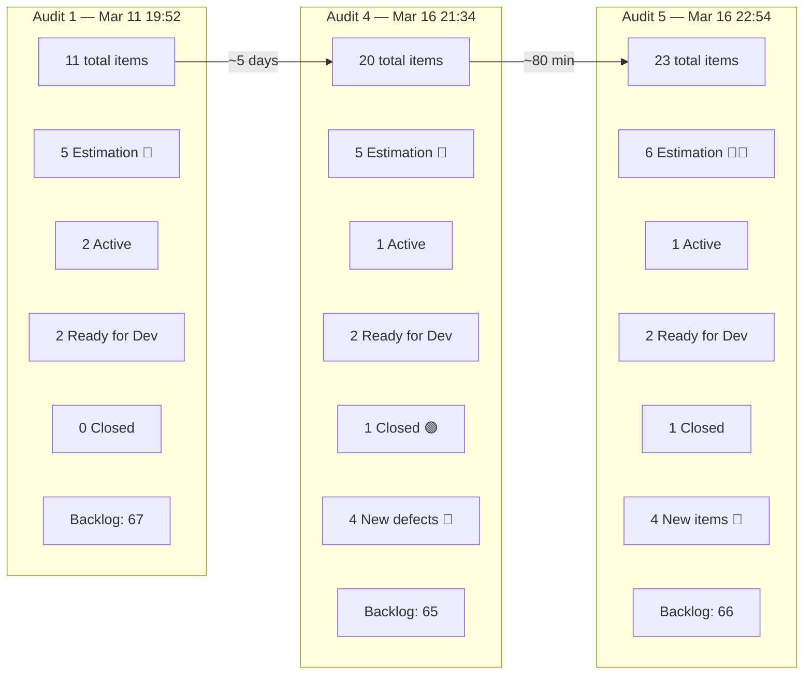

---

## 3. Iteration 6.5 Current Snapshot

| Metric | Value | SAFe Interpretation |
|---|---|---|
| Sprint day | Day 8 of 14 | **57% through — second half begins** |
| Team members with capacity | 3 | Stable |
| Total team capacity per day | 3 | Stable |
| Root sprint items | 15 | +2 since Audit 4 (67% above original 9) |
| Total iteration-linked items | 23 | +3 since Audit 4 |
| Root items in `Estimation` | 6 | **+1 — 201127 triaged in, still no forward motion** |
| Root items in `New` | 4 | Stable (201127 out, 201174 in) |
| Root items with story points | 6 of 15 | Estimation coverage 40% (up from 38%) |
| Story points on root items | 10 | +2 since Audit 4 (#199119 sized at 2) |
| Root items `Closed` | 1 | No new closures |
| Requirement backlog items | 66 | +1 since Audit 4 |

### Team Capacity

| Person | Role | Capacity / Day | Days Off | Sprint Load |
|---|---|---:|---|---|
| Samantha Babael | Development | 1 | 0 | **7 root items** (6 Estimation + 1 Active) — **47% of root scope** |
| Ike Yana | Development | 1 | 0 | 3 root items (1 Closed, 2 Ready for Dev) + 1 active task |
| Luzmibel Paculanang | Testing | 1 | 0 | QA support + 5 defect/US discoveries |
| **Unassigned** | — | — | — | **4 items — no owner** |
| **Total** | | **3** | **0** | **Critically imbalanced** |

---

## 4. Full Sprint Scope — Current Item Status

### 4.1 Root Items (15)

| ID | Title | Type | State | Assigned To | Pts | Change Since Audit 4 |
|---|---|---|---|---|---:|---|
| 200972 | Activate and investigate helga account | Defect | **Closed** | Ike Yana | 1 | ⚪ Unchanged |
| 195727 | Meal time filter doesn't respond with text in searchbar | Defect | Active | Samantha Babael | 2 | ⚪ Unchanged |
| 198770 | [Apple Pay] Payment Fails After Authentication | Defect | Ready for Dev | Ike Yana | 2 | ⚪ Unchanged |
| 196380 | Default Pinned Post for New Users | User Story | Ready for Dev | Ike Yana | 2 | ⚪ Unchanged |
| 199119 | [High priority] Remove Payment Confirmation Pop-up | User Story | Estimation | Samantha Babael | **2** | 🟢 **+2 story points added** |
| 195735 | Adjust text on membership package subscription page | User Story | Estimation | Samantha Babael | 0 | ⚪ Unchanged |
| 195716 | Hide "preferanser", "allergier" inside recipe card | User Story | Estimation | Samantha Babael | 0 | ⚪ Unchanged |
| 195715 | Remove deadspace on Completed Session section | Defect | Estimation | Samantha Babael | 0 | ⚪ Unchanged |
| 198775 | Workout Plans – Search Not Working on First Attempt | Defect | Estimation | Samantha Babael | 1 | ⚪ Unchanged |
| 201127 | [Admin][Recipe] Unnecessary box at top of page | Defect | **Estimation** | **Samantha Babael** | 0 | 🟡 **New → Estimation, assigned to Samantha** |
| 201155 | [High Priority] Email Field Error While Typing | Defect | New | Unassigned | 0 | ⚪ Unchanged |
| 201158 | [Medium] Blog Posts Excessive Line Spacing | Defect | New | Unassigned | 0 | ⚪ Unchanged |
| 201162 | [Low] Workout Search Suggestions Obstruct List | Defect | New | Unassigned | 0 | ⚪ Unchanged |
| **201174** | **[Low priority] Update Subscription (Client Profile)** | **User Story** | **New** | **Unassigned** | **0** | 🆕 **Brand new item** |

### 4.2 Child Tasks (8)

| ID | Parent | Title | State | Assigned To | Change Since Audit 4 |
|---|---:|---|---|---|---|
| 200973 | 200972 | QA - Defect Create - Bel | Closed | Luzmibel Paculanang | ⚪ Unchanged |
| 201018 | 200972 | Investigate the cause | Closed | Ike Yana | ⚪ Unchanged |
| 197320 | 196380 | Implement Post Pinning Function | Active | Ike Yana | ⚪ Unchanged |
| 201128 | 201127 | QA - Create defect - Bel | Closed | Luzmibel Paculanang | ⚪ Unchanged |
| 201160 | 201155 | QA - Create and Replicate Defect - Bel | Closed | Luzmibel Paculanang | ⚪ Unchanged |
| 201159 | 201158 | QA - Create and Replicate Defect - Bel | Closed | Luzmibel Paculanang | ⚪ Unchanged |
| 201163 | 201162 | QA - Create and Replicate Defect - Bel | Closed | Luzmibel Paculanang | ⚪ Unchanged |
| **201175** | **201174** | **QA - Create US - Bel** | **Closed** | **Luzmibel Paculanang** | 🆕 **New task** |

### 4.3 Iteration Path Anomalies

Three items remain assigned at the **PI-level iteration path** rather than sprint level:

| ID | Title | Current Iteration Path | Expected |
|---|---|---|---|
| 201158 | Blog Posts Line Spacing | `Life Style Help App\2026-PI6` | `...\Iteration 6.5` |
| 201162 | Workout Search Suggestions | `Life Style Help App\2026-PI6` | `...\Iteration 6.5` |
| **201174** | **Update Subscription** | `Life Style Help App\2026-PI6` | `...\Iteration 6.5` |

---

## 5. What Changed Since Audit 4 (80-Minute Window)

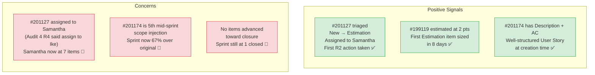

**Key observations:**

1. **The team is responding to audit recommendations — partially.** Triaging #201127 (R2) and estimating #199119 show the grooming pass is active. However, assigning #201127 to Samantha directly contradicts R4 ("assign new defects to Ike, not Samantha") and worsens her overload from 6 → 7 items.

2. **#201174 is a well-formed User Story** with a proper user story format ("As a Client, I want to...") and Gherkin-style acceptance criteria. This is the **highest-quality new item** to enter this sprint. However, it has no owner, no story points, and sits at the PI6 iteration path level.

3. **#199119 getting 2 story points is the first estimation activity on a stuck item in 8 days.** This also has Description + AC + Points now, making it **DoR-compliant** — a meaningful improvement. It should be the first Estimation item considered for advancement.

4. **Sprint scope has now grown 67% from 9 → 15 root items** across 5 audits. This level of mid-sprint injection fundamentally undermines sprint commitment integrity.

---

## 6. Trend Analysis — Five-Audit Cross-View

### 6.1 Sprint Scope Growth Over Time

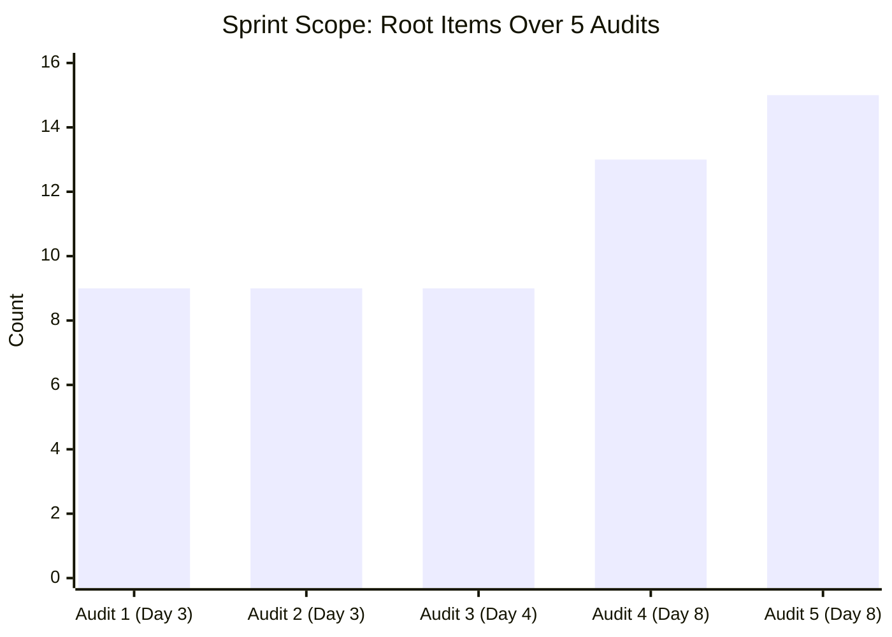

### 6.2 Root Item State Distribution — Audit 1 vs Audit 5

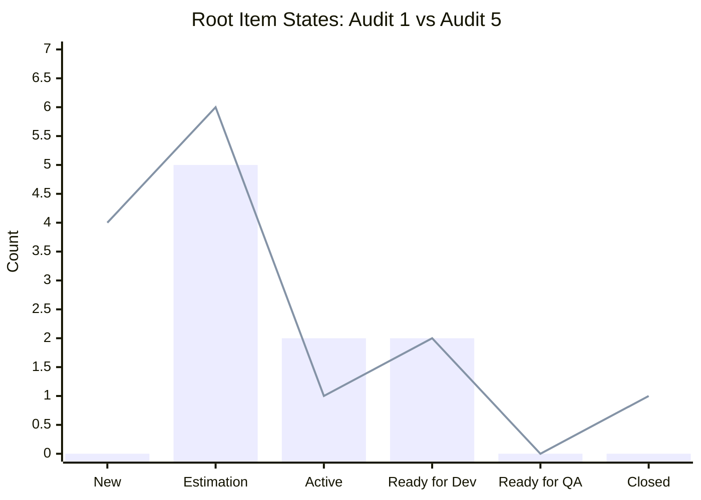

> Bar = Audit 1 (Baseline, 9 items) | Line = Audit 5 (Current, 15 items)

### 6.3 Estimation Item Accumulation

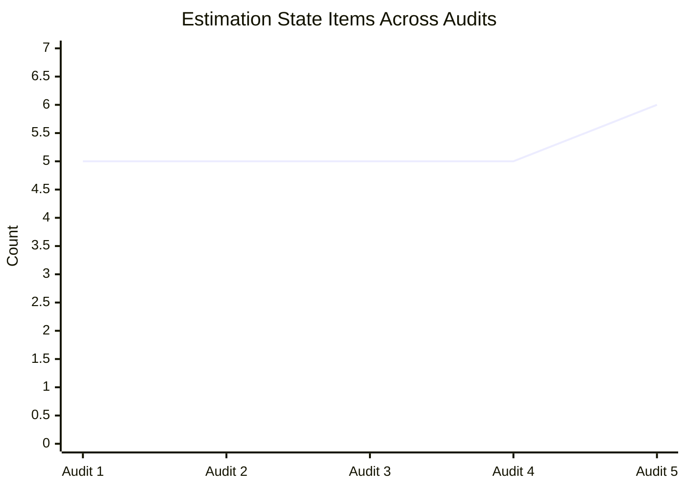

> The Estimation backlog is now **growing** rather than shrinking — the opposite of healthy sprint flow.

### 6.4 Story Points Trend

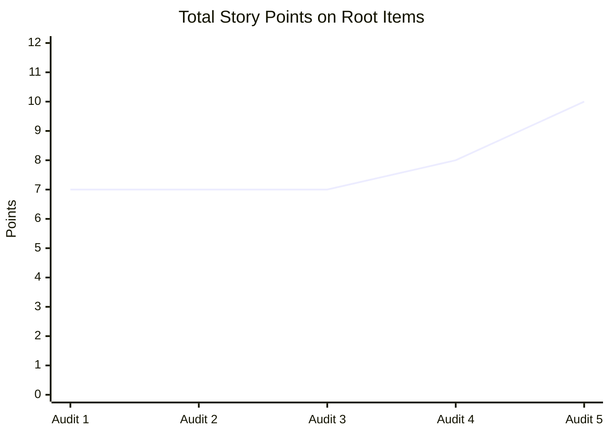

> First meaningful estimation activity in 8 days. Positive trend but far from complete coverage.

### 6.5 Interrupt vs. Planned Work Pattern

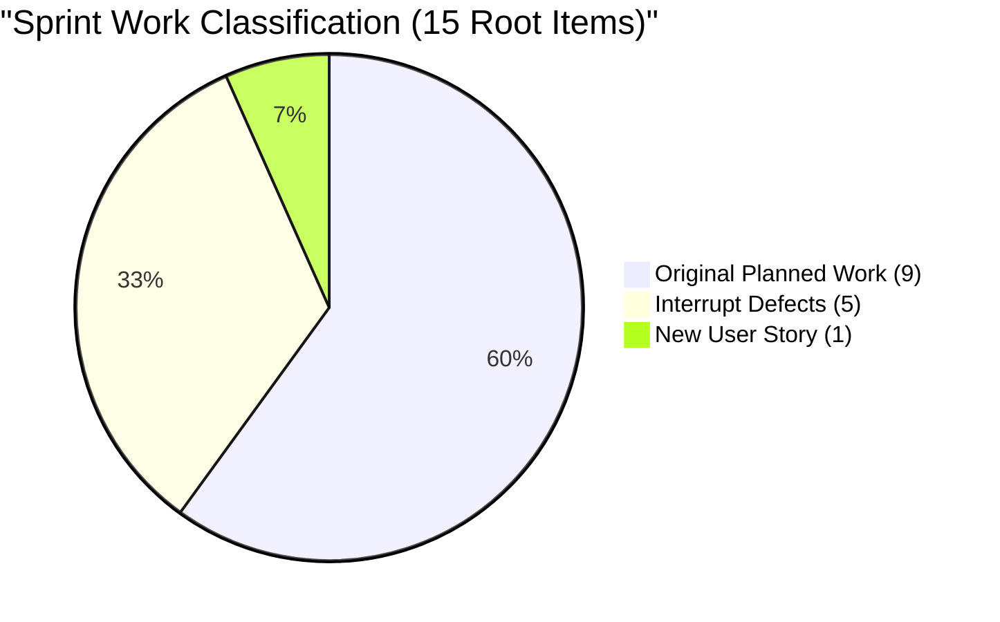

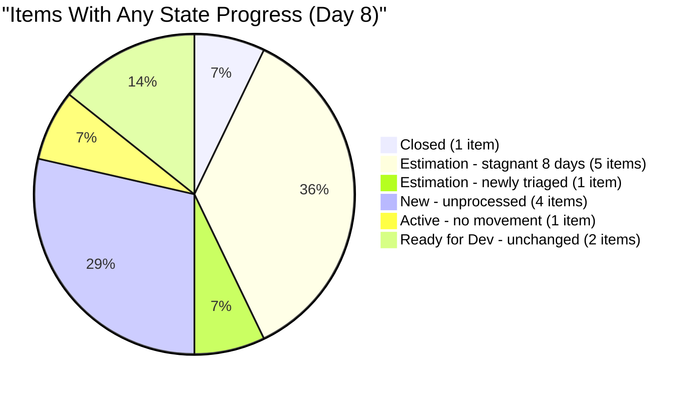

---

## 7. DoR (Definition of Ready) Compliance

| ID | Title | Description | Acceptance Criteria | Story Points | Owner | DoR Status |
|---|---|---|---|---|---|---|
| 200972 | Helga account | ✅ | ❌ | ✅ 1 | ✅ | **Closed** (moot) |
| 195727 | Meal time filter | ✅ | ❌ Missing | ✅ 2 | ✅ | 🔴 **FAIL** |
| 198770 | Apple Pay | ✅ | ❌ Missing | ✅ 2 | ✅ | 🔴 **FAIL** |
| **199119** | **Subscription pop-up** | ✅ | ✅ | **✅ 2** | ✅ | ✅ **PASS** (upgraded!) |
| 195735 | Membership text | ✅ | ✅ | ❌ 0 | ✅ | 🟡 **Partial** |
| 195716 | Hide preferences | ✅ | ❌ Missing | ❌ 0 | ✅ | 🔴 **FAIL** |
| 195715 | Remove deadspace | ✅ | ❌ Missing | ❌ 0 | ✅ | 🔴 **FAIL** |
| 198775 | Workout search | ❌ Missing | ❌ Missing | ✅ 1 | ✅ | 🔴 **FAIL** |
| 201127 | Recipe box | ✅ | ❌ Missing | ❌ 0 | ✅ | 🔴 **FAIL** |
| 201155 | Email field error | ❌ Missing | ❌ Missing | ❌ 0 | ❌ | 🔴 **FAIL** |
| 201158 | Blog spacing | ✅ | ❌ Missing | ❌ 0 | ❌ | 🔴 **FAIL** |
| 201162 | Workout suggestions | ✅ | ❌ Missing | ❌ 0 | ❌ | 🔴 **FAIL** |
| 201174 | Update Subscription | ✅ | ✅ | ❌ 0 | ❌ | 🟡 **Partial** |
| 196380 | Default Pinned Post | ✅ | ✅ | ✅ 2 | ✅ | ✅ **PASS** |

**DoR Summary:** **2 of 14 active root items pass DoR** (#196380, #199119). This is a **14% pass rate** — improved from 8% in Audit 4 due to #199119 reaching full compliance, but still critically low.

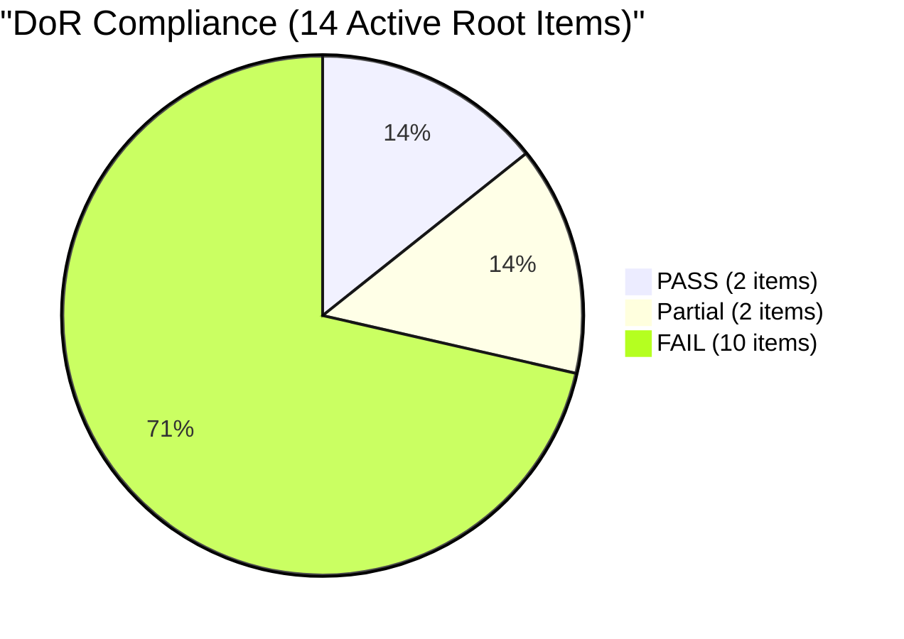

---

## 8. Ownership Concentration Risk

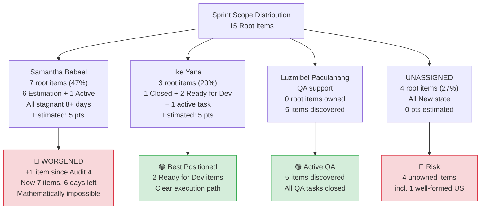

**Samantha's load has worsened despite explicit audit recommendations.** She now carries 7 root items (47%) — up from 6 in Audit 4. With 6 sprint days remaining at 1 capacity/day, she would need to plan, develop, test, and close more than 1 item per day to make meaningful progress. Only #195727 (Active, 2pts) has any realistic chance of closing.

**Critical concern:** The assignment of #201127 to Samantha suggests the team is defaulting to "assign to the person who knows the area" rather than balancing load. This pattern must be broken for 6.6 planning.

---

## 9. Velocity and Sprint Completion Forecast

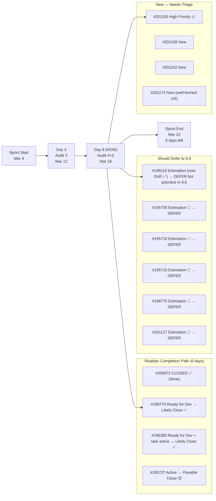

| Scenario | Root Items Closed | Story Points Earned | Completion Rate |
|---|---:|---:|---|
| **Optimistic** (Samantha closes #195727, Ike closes both Ready for Dev) | 4 | 7 | 27% |
| **Baseline** (Ike closes Ready for Dev items only) | 3 | 5 | **20%** |
| **Pessimistic** (more interrupts, rework) | 1–2 | 1–3 | 7–13% |

**Earned velocity to date:** 1 root item closed, 1 story point earned in 8 sprint days.
**Sprint velocity projection:** 2–4 root items, 3–7 story points total.

---

## 10. SAFe Compliance Findings (Updated — Audit 5)

| # | Finding | Severity | Status vs. Audit 4 | SAFe Area |
|---|---|---|---|---|
| F1 | **6 of 15 root items in `Estimation` — grew from 5 (not shrinking)** | CRITICAL | 🔴 Worsened (+1 item in Estimation) | Iteration Planning |
| F2 | **Only 6 of 15 root items estimated (40%); 10 pts total** | HIGH | 🟢 Slightly improved (was 38%) | Estimation / Predictability |
| F3 | **Samantha carries 47% of sprint scope (7 items); all stagnant** | CRITICAL | 🔴 Worsened (+1 item, contra R4) | Capacity Allocation / Flow |
| F4 | **DoR: 2 of 14 active items pass (14%)** | CRITICAL | 🟢 Improved (was 8%) | Definition of Ready |
| F5 | **66 backlog items, +1 from Audit 4** | HIGH | 🔴 Growing again | Backlog Management |
| F6 | **4 items still unassigned in sprint scope** | HIGH | ⚪ Unchanged | Interrupt Handling / Flow |
| F7 | **Sprint scope grew 67% mid-sprint (9 → 15 root items)** | CRITICAL | 🔴 Worsened (was 44%) | Sprint Commitment Integrity |
| F8 | **3 items at PI-level iteration path instead of sprint** | MEDIUM | 🔴 Worsened (+1 new) | Work Item Hygiene |
| F9 | **Sprint forecast: 20–27% completion at current rate** | HIGH | 🔴 Down from 23–31% (Audit 4) | Predictability |
| F10 | **#201127 assigned to Samantha despite R4 recommendation** | HIGH | 🆕 New — audit recommendation not followed | Process Discipline |

---

## 11. Positive Observations

| # | Observation |
|---|---|
| P1 | **#199119 received story points (2)** — first Estimation item sized in 8 days. This item is now DoR-compliant and should be top priority for 6.6. |
| P2 | **#201127 was triaged from New → Estimation** — first evidence of acting on Audit 4's R2 recommendation. Shows grooming is happening. |
| P3 | **#201174 entered with Description and Acceptance Criteria** — proper user story format with Gherkin AC. Best-formed new item this sprint. |
| P4 | **Priority labeling continues** — ongoing effort to classify items by severity shows awareness. |
| P5 | **Luzmibel discovered and documented a 5th item** (#201174 has a "QA - Create US" task) — QA throughput remains excellent. |
| P6 | **All team capacity remains available** — no days off through sprint end. |
| P7 | **Estimation activity is resuming** — the grooming pass visible in Audit 4 (priority labels) is now producing actionable results (story points, state changes). |

---

## 12. Risks (Updated)

| Risk | Likelihood | Impact | Trend (vs. Audit 4) |
|---|---|---|---|
| 6 Estimation items never reach `Ready for Dev` before sprint end | **Very High** | High | 🔴 **Worsened — now 6 items, not 5** |
| Sprint closes with < 30% completion | **Very High** | High | 🔴 Scope grew but throughput didn't |
| Samantha becomes irrecoverable bottleneck | **Very High** | High | 🔴 **Worsened — 7 items now** |
| More items injected mid-sprint before Day 14 | **High** | High | 🔴 5th injection in 8 days |
| #201155 (High Priority email defect) disrupts planned work | **High** | Medium | ⚪ Unchanged — still unaddressed |
| DoR violations carry into 6.6 without process change | **Very High** | Medium | 🟡 Slight improvement but still 86% fail |
| Audit recommendations ignored or partially followed | **High** | Medium | 🆕 R4 contradicted (assign to Ike → assigned to Samantha) |
| Backlog size grows rather than shrinks | **Medium** | Medium | 🟡 +1 item, pruning not occurring |

---

## 13. Recommendations

### 13.1 Immediate (Tonight/Tomorrow, March 16–17)

| # | Action | Owner | Priority |
|---|---|---|---|
| R1 | **Formally defer all 6 Estimation items to Iteration 6.6.** The Estimation backlog is growing, not shrinking. Even #199119 (now DoR-compliant) cannot realistically be developed, tested, and closed in 6 remaining days. Prioritize #199119 first in 6.6 planning. | Ramon / PM | **CRITICAL** |
| R2 | **Reassign #201127 from Samantha to Ike** — or move to 6.6. This assignment directly contradicts Audit 4 R4 and increases Samantha's load to 7 items. | Ramon / PM | **CRITICAL** |
| R3 | **Triage remaining 3 New defects + #201174**: assign owners, add AC, estimate. #201155 (High Priority) should be triaged first. Assign to Ike if kept in sprint. | Ramon / PM | HIGH |
| R4 | **Fix iteration paths** on #201158, #201162, and #201174 — move from PI6 level to `Iteration 6.5` or explicitly defer to 6.6. | Ramon / PM | HIGH |

### 13.2 Remaining Sprint (March 17–22, 6 days)

| # | Action | Owner | Priority |
|---|---|---|---|
| R5 | **Focus Ike on closing #198770 and #196380** — these are highest-value achievable items. Both Ready for Dev, both DoR-compliant. | Ike | HIGH |
| R6 | **Focus Samantha on #195727 only** (Active, 2pts) — reduce her scope to one item. All Estimation items should be deferred. | Samantha | HIGH |
| R7 | **Freeze scope** — no more items should enter this sprint. Any new QA discoveries go to a 6.6 triage queue. | PM / Team | HIGH |
| R8 | **Document earned velocity**: 1 item / 8 days (0.125/day). Use this for 6.6 capacity planning. | PM | MEDIUM |

### 13.3 Process Improvements for Iteration 6.6 Planning

| # | Action | Owner | Priority |
|---|---|---|---|
| R9 | **Enforce DoR gate at sprint planning**: no item enters sprint without Description + AC + estimate + owner. Current 14% pass rate is unacceptable. Model on #199119 and #196380 as positive examples. | PMO / Team | **CRITICAL** |
| R10 | **Cap single-person sprint load at 3 root items** — Samantha's 7-item load has been flagged in ALL 5 audits with continuous worsening. | PM | **CRITICAL** |
| R11 | **Establish formal interrupt budget**: reserve 20% of sprint capacity for unplanned defects. Track separately from committed work. | PM | HIGH |
| R12 | **Run backlog refinement** before 6.6 planning — target stale IDs in the 160000–168000 range and prune obsolete items. Backlog is growing (66) instead of shrinking. | PM / PO | HIGH |
| R13 | **Implement a "triage queue"** separate from the sprint — QA-discovered defects go to triage first, not directly into the active sprint. This would have prevented 5 mid-sprint injections. | PM / Process | HIGH |
| R14 | **Track audit recommendation compliance** — of the 14 recommendations from Audit 4, only R2 was partially acted upon (and R4 was contradicted). Without accountability, audits become documentation exercises. | PM | HIGH |

---

## 14. Cross-Audit Learning Summary

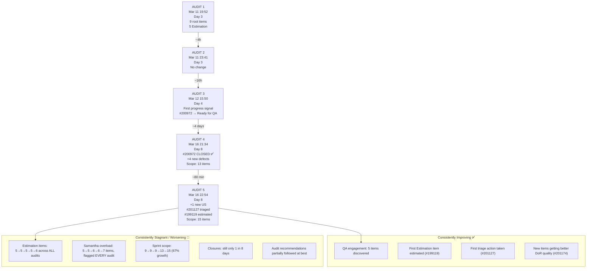

**The fundamental pattern identified in Audit 4 remains unchanged — and is worsening on key dimensions:**

The team operates in **two completely separate tracks**:

- **Track 1 (Reactive/QA)** continues to function efficiently. Luzmibel discovers and documents issues with proper QA tasks. Items that enter the pipeline as urgent flow to closure (e.g., #200972).

- **Track 2 (Planned/Committed)** is not just frozen — it's accumulating. The Estimation backlog grew from 5 to 6 items. Samantha's load grew from 6 to 7 items. The sprint scope grew from 13 to 15 items. All movement is inward (adding items) rather than outward (completing items).

**One encouraging signal: #199119 receiving story points and #201127 being triaged show the team is beginning to groom the Estimation backlog.** If this grooming momentum carries into 6.6 planning, it could break the frozen-commitment cycle. But within this sprint, no Estimation item will close.

**The single most important action for this team is implementing a sprint scope freeze and a deferral decision for all Estimation items.** Without this, the sprint will end with 13+ unclosed items carrying forward into 6.6, creating a compounding backlog problem.

---

## 15. Conclusion

Audit 5 captures a sprint in active grooming but no closer to execution. The positive signals — #199119 estimated, #201127 triaged, #201174 well-formed at creation — show a team that is learning to prepare items for work. But preparation is happening inside a sprint that is 57% complete, when it should have happened before sprint commitment.

With 6 days remaining, the achievable outcome is:

1. **Close 3 items** (#198770, #196380 via Ike, #195727 via Samantha) for a final velocity of ~4 items / 7 story points.
2. **Defer 6 Estimation items** to 6.6, with #199119 entering first (now DoR-compliant).
3. **Triage and defer 4 New items** to 6.6 unless #201155 (High Priority) requires immediate attention.
4. **Use this sprint's data** (1 closure in 8 days, 67% scope creep, 14% DoR compliance) as the factual baseline for right-sizing the 6.6 commitment.

The team has talent and QA discipline. What they need is **planning discipline at the sprint boundary** — enforcing DoR, capping individual load, separating interrupt work from commitments, and most critically, **acting on audit recommendations rather than acknowledging them.**

---

*Audit generated by Claude AI SAFe Consultant | Data source: Azure DevOps — jairo org | Iteration 6.5 snapshot as of March 16, 2026 22:54 PT*
