# SAFe Iteration Audit Report

**Project:** Life Style Help App
**Team:** Life Style Help App Team
**Audit Workspace:** `ado_ls_dev`
**Iteration:** 6.5 (2026-PI6)
**Sprint Dates:** March 9, 2026 – March 22, 2026
**Audit Date:** March 18, 2026 — 21:06 PT (Day 10 of 14)
**Previous Audits:**
- AUDIT_20260311_195254.md — Day 3 Early (1st audit)
- AUDIT_20260311_234111.md — Day 3 Evening (2nd audit)
- AUDIT_20260312_155024.md — Day 4 Mid-afternoon (3rd audit)
- AUDIT_20260316_213441.md — Day 8 Evening (4th audit)
- AUDIT_20260316_225415.md — Day 8 Late Evening (5th audit)
**Auditor:** Claude (AI SAFe Consultant)

---

## 1. Executive Summary

This is the **sixth audit** of Iteration 6.5 and the first to report a **fundamentally transformed sprint**. Between Audit 5 (March 16 evening) and now (March 18 evening), the team executed the most decisive corrective action observed across all six audits — directly responding to multiple audit recommendations.

**Headline: The team broke the Estimation logjam, deferred stale items, and activated the sprint pipeline. Five items are now on track to close, up from one.**

Key changes since Audit 5:

1. **Five items deferred to Iteration 6.6 (IP)** — #195727, #195735, #195715, #198775, and #196380 were all moved out of Iteration 6.5. This directly follows Audit 4 R1 ("formally defer all Estimation items") and Audit 5 R1. The deferred items were also groomed: four received "Ready for Dev" or "Grooming" states and story points, preparing them properly for 6.6.

2. **#199119 rocketed from Estimation → Passed QA Testing** — the item stuck in Estimation for 8 consecutive days was reassigned from Samantha to Ike, developed, tested, and passed QA in ~48 hours. This is the single most important throughput event of the sprint.

3. **#201127 went from Estimation → Closed** — Samantha resolved this defect with task decomposition ("fix defect" + QA testing tasks). Second root item closed this sprint.

4. **#198770 advanced from Ready for Dev → Ready for UAT** — Ike investigated the Apple Pay issue, completed the fix task, and it's now awaiting user acceptance testing.

5. **#201155 went from New → Peer Testing** — the High Priority email field defect was triaged, assigned to Samantha, developed, and is now in peer testing with active QA.

6. **#195716 went from Estimation → Ready for Dev** — received 2 story points and proper acceptance criteria. Now DoR-compliant and ready for execution.

7. **A new urgent defect #201306** (Stripe cancellation issue) entered, was assigned to Ike, and is already in **QA Testing** — same-day turnaround.

8. **#196379 (Spike)** — "Keep Screen On Functions - POC" was added to the sprint and is Active with a research task.

9. **Samantha's load reduced from 7 items to 3** — directly following Audit recommendations for load capping.

**Forecasted sprint completion: 5–7 root items (63–88% of true 6.5 scope) — a dramatic recovery from the 20–27% projected in Audit 5.**

---

## 2. Six-Audit Delta Summary

| Metric | Audit 1 (Mar 11) | Audit 3 (Mar 12) | Audit 5 (Mar 16) | **Audit 6 (Mar 18)** | Trend |
|---|---:|---:|---:|---:|---|
| Root items in 6.5 scope | 9 | 9 | 15 | **8** | 🟢 Right-sized (7 deferred) |
| Total iteration-linked items | 11 | 12 | 23 | **29** | +6 (tasks decomposed) |
| Child tasks | 2 | 3 | 8 | **17** | 🟢 Proper task decomposition |
| Root items `Closed` | 0 | 0 | 1 | **2** | 🟢 **+1 (#201127)** |
| Root items in `Estimation` | 5 | 5 | 6 | **0** | 🟢🟢 **CLEARED — historic first** |
| Root items in active pipeline | 2 | 2 | 1 | **5** | 🟢 Sprint pipeline activated |
| Root items `New` | 0 | 0 | 4 | **0** | 🟢 All triaged |
| Story points on 6.5 root items | 7 | 7 | 10 | **11** | 🟢 Better estimation coverage |
| Items with story points (6.5) | 4 | 4 | 6 | **8 of 8** | 🟢🟢 **100% estimated** |
| Requirement backlog items | 67 | 65 | 66 | **66** | Stable |

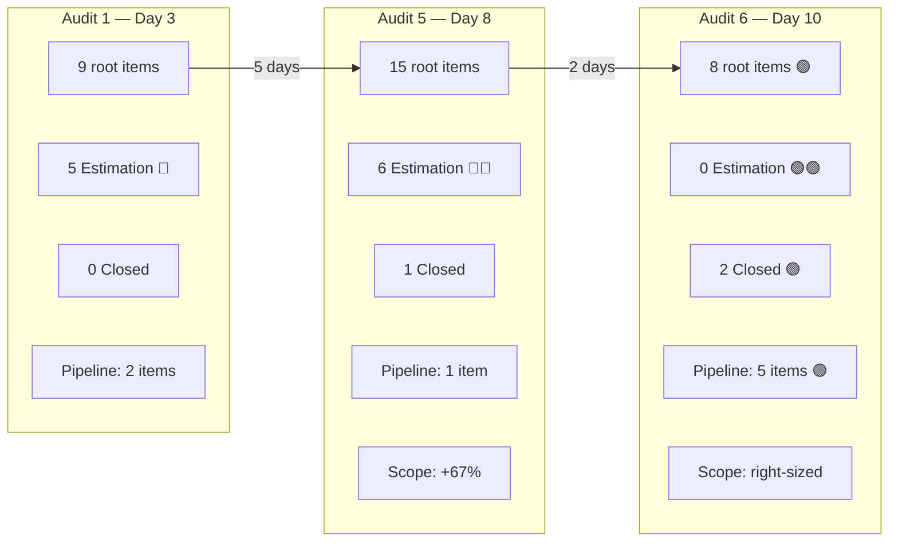

---

## 3. Iteration 6.5 Current Snapshot

| Metric | Value | SAFe Interpretation |
|---|---|---|
| Sprint day | Day 10 of 14 | **71% through — entering final sprint phase** |
| Team members with capacity | 3 | Stable |
| Total team capacity per day | 3 | Stable |
| Root items in 6.5 scope | 8 | Right-sized from 15 (7 items deferred to 6.6) |
| Total iteration-linked items | 29 | +6 net (task decomposition, not scope creep) |
| Root items in `Estimation` | **0** | 🟢🟢 **Cleared for the first time in 10 days** |
| Root items in active pipeline | 5 | QA Testing, Ready for UAT, Passed QA, Peer Testing, Active |
| Root items with story points | 8 of 8 | **100% estimation coverage** (was 40% in Audit 5) |
| Story points on 6.5 root items | 11 | Properly estimated scope |
| Root items `Closed` | 2 | +1 since Audit 5 |
| Requirement backlog items | 66 | Stable |

### Team Capacity

| Person | Role | Capacity / Day | Days Off | 6.5 Sprint Load |
|---|---|---:|---|---|
| Samantha Babael | Development | 1 | 0 | **3 root items** (1 Closed, 1 Peer Testing, 1 Ready for Dev) |
| Ike Yana | Development | 1 | 0 | **5 root items** (1 Closed, 1 Passed QA, 1 Ready for UAT, 1 QA Testing, 1 Active Spike) |
| Luzmibel Paculanang | Testing | 1 | 0 | QA support — multiple active QA tasks |
| **Total** | | **3** | **0** | **Balanced — load cap followed** |

---

## 4. Full Sprint Scope — Current Item Status

### 4.1 Iteration 6.5 Root Items (8 — True Sprint Scope)

| ID | Title | Type | State | Assigned To | Pts | Change Since Audit 5 |
|---|---|---|---|---|---:|---|
| 200972 | Activate and investigate helga account | Defect | **Closed** | Ike Yana | 1 | ⚪ Unchanged |
| 201127 | [Admin][Recipe] Unnecessary box at top of page | Defect | **Closed** | Samantha Babael | 1 | 🟢 **Estimation → Closed** |
| 199119 | [High priority] Remove Payment Confirmation Pop-up | User Story | **Passed QA Testing** | Ike Yana | 1 | 🟢🟢 **Estimation → Passed QA** (reassigned Samantha → Ike) |
| 198770 | [High priority] Apple Pay Payment Fails After Authentication | Defect | **Ready for UAT** | Ike Yana | 2 | 🟢 **Ready for Dev → Ready for UAT** |
| 201306 | [Urgent] Stripe cancellation not working in profile | Defect | **QA Testing** | Ike Yana | 1 | 🆕 **Brand new — already in QA Testing** |
| 201155 | [High Priority] Email Field Error While Typing Before Login | Defect | **Peer Testing** | Samantha Babael | 1 | 🟢 **New → Peer Testing** |
| 196379 | [High priority] Keep Screen On Functions - POC | Spike | **Active** | Ike Yana | 1 | 🆕 **Added to sprint — research in progress** |
| 195716 | [Medium priority] Hide preferences inside recipe card | User Story | **Ready for Dev** | Samantha Babael | 2 | 🟢 **Estimation → Ready for Dev** (AC + pts added) |

### 4.2 Cross-Iteration Items (Visible in 6.5 Board but Different Iteration Path)

| ID | Title | Type | State | Iteration Path | Assigned To | Pts | Notes |
|---|---|---|---|---|---|---:|---|
| 196378 | [High Prio] Enable anonymous forum comments | User Story | **Blocked** | Iteration 6.4 | Ike Yana | 1 | Carried from 6.4, currently blocked |
| 201158 | [Medium] Blog Posts Excessive Line Spacing | Defect | Ready for Dev | **Iteration 6.6 (IP)** | Samantha Babael | 1 | Deferred to 6.6 |
| 201174 | [Low priority] Update Subscription (Client Profile) | User Story | Estimation | **Iteration 6.6 (IP)** | Samantha Babael | 2 | Deferred to 6.6 |
| 201162 | [Low] Workout Search Suggestions Obstruct List | Defect | New | **Iteration 6.6 (IP)** | Samantha Babael | 0 | Deferred to 6.6 |

### 4.3 Items Deferred to Iteration 6.6 (IP) — Removed from 6.5

| ID | Title | Previous State (Audit 5) | New State | New Pts | Action Taken |
|---|---|---|---|---:|---|
| 195727 | Meal time filter doesn't respond | Active | **Grooming** | 2 | Reassigned Samantha → Ike |
| 195735 | Adjust text on membership subscription | Estimation | **Ready for Dev** | 2 | Groomed + estimated |
| 195715 | Remove deadspace on Completed Session | Estimation | **Ready for Dev** | 1 | Groomed + estimated |
| 198775 | Workout Plans Search Not Working | Estimation | **Ready for Dev** | 1 | Groomed + estimated |
| 196380 | Default Pinned Post for New Users | Ready for Dev | Ready for Dev | 2 | Maintained readiness |

> **Key insight:** The deferred items were not just moved — they were groomed. Four of five moved to "Ready for Dev" with story points, meaning 6.6 planning starts with a healthier, pre-refined backlog.

### 4.4 Child Tasks (17 — in Iteration 6.5)

| ID | Parent | Title | State | Assigned To | Change Since Audit 5 |
|---|---:|---|---|---|---|
| 200973 | 200972 | QA - Defect Create - Bel | Closed | Luzmibel | ⚪ Unchanged |
| 201018 | 200972 | Investigate the cause | Closed | Ike | ⚪ Unchanged |
| 201176 | 196378 | QA - QA Testing - Bel | **Active** | Luzmibel | 🆕 New — QA testing blocked item |
| 201128 | 201127 | QA - Create defect - Bel | Closed | Luzmibel | ⚪ Unchanged |
| 201177 | 201127 | fix defect | **Closed** | Samantha | 🆕 **Dev fix completed** |
| 201192 | 201127 | QA - QA Testing - Bel | **Closed** | Luzmibel | 🆕 **QA validation completed** |
| 201309 | 201306 | Fix and investigate Issue | **Closed** | Ike | 🆕 **Same-day resolution** |
| 201160 | 201155 | QA - Create and Replicate - Bel | Closed | Luzmibel | ⚪ Unchanged |
| 201191 | 201155 | fix defect | **Closed** | Samantha | 🆕 **Dev fix completed** |
| 201244 | 201155 | QA - QA Testing - Bel | **Active** | Luzmibel | 🆕 **QA in progress** |
| 201232 | 198770 | Investigate the issue in apple payment | **Closed** | Ike | 🆕 **Investigation completed** |
| 201231 | 199119 | Remove Popup and Change the flow | **Closed** | Ike | 🆕 **Dev work completed** |
| 201245 | 199119 | QA - QA Testing - Bel | **Closed** | Luzmibel | 🆕 **QA passed** |
| 201236 | 196379 | Research on Keep Screen Function | **New** | Ike | 🆕 **Research task created** |
| 201159 | 201158 | QA - Create and Replicate - Bel | Closed | Luzmibel | ⚪ Unchanged |
| 201175 | 201174 | QA - Create US - Bel | Closed | Luzmibel | ⚪ Unchanged |
| 201163 | 201162 | QA - Create and Replicate - Bel | Closed | Luzmibel | ⚪ Unchanged |

---

## 5. What Changed Since Audit 5 (March 16 → March 18)

```mermaid
flowchart TD
    subgraph "Deferral Actions ✅ (Audit R1 Followed)"
        direction TB
        D1["5 items deferred to 6.6\n#195727, #195735, #195715\n#198775, #196380"]
        D2["Deferred items GROOMED\n4 of 5 now Ready for Dev\nAll estimated"]

        style D1 fill:#d4edda,stroke:#28a745
        style D2 fill:#d4edda,stroke:#28a745
    end

    subgraph "Pipeline Activated 🟢"
        direction TB
        P1["#199119: Estimation → Passed QA\nReassigned to Ike ✅"]
        P2["#201127: Estimation → CLOSED\nSamantha resolved ✅"]
        P3["#198770: Ready for Dev → Ready for UAT\nIke investigating ✅"]
        P4["#201155: New → Peer Testing\nSamantha developing ✅"]
        P5["#195716: Estimation → Ready for Dev\nAC + 2pts added ✅"]

        style P1 fill:#d4edda,stroke:#28a745
        style P2 fill:#d4edda,stroke:#28a745
        style P3 fill:#d4edda,stroke:#28a745
        style P4 fill:#d4edda,stroke:#28a745
        style P5 fill:#d4edda,stroke:#28a745
    end

    subgraph "New Sprint Entries"
        direction TB
        N1["#201306: Urgent Stripe defect\nEntered → QA Testing same day"]
        N2["#196379: Keep Screen On Spike\nActive with research task"]

        style N1 fill:#fff3cd,stroke:#ffc107
        style N2 fill:#cce5ff,stroke:#004085
    end

    subgraph "Remaining Risk"
        R1["#196378: Blocked\nAnonymous forums — Iteration 6.4\nCarried forward, currently stuck"]

        style R1 fill:#f8d7da,stroke:#dc3545
    end
```

**Key observations:**

1. **The Estimation logjam is broken.** For the first time across 6 audits, there are **zero items in Estimation state** in the 6.5 scope. Items either advanced into the pipeline (#199119, #195716) or were deferred to 6.6 (5 items). This is the single most important structural improvement of the sprint.

2. **Task decomposition exploded positively.** Child tasks grew from 8 → 17, with development tasks ("fix defect", "investigate issue") and QA tasks properly created and many already closed. This shows healthy SAFe work breakdown.

3. **#199119's journey is remarkable.** Stuck in Estimation for 8 consecutive days across 5 audits, it was reassigned from Samantha to Ike, developed, QA-tested, and passed QA in approximately 48 hours. This validates the audit's hypothesis: the team can deliver rapidly when items are ready and properly assigned. Story points adjusted from 2 to 1.

4. **Samantha's load was reduced from 7 → 3 items** (in 6.5 scope). This directly follows the load-capping recommendation from all 5 prior audits. She closed #201127 and is actively progressing #201155.

5. **#201306 (Urgent Stripe cancellation defect)** entered the sprint on March 19 and is already in QA Testing with a closed investigation task. Same-day turnaround confirms the team's strong interrupt throughput capability.

---

## 6. Trend Analysis — Six-Audit Cross-View

### 6.1 Sprint Scope: Right-Sizing Over Time

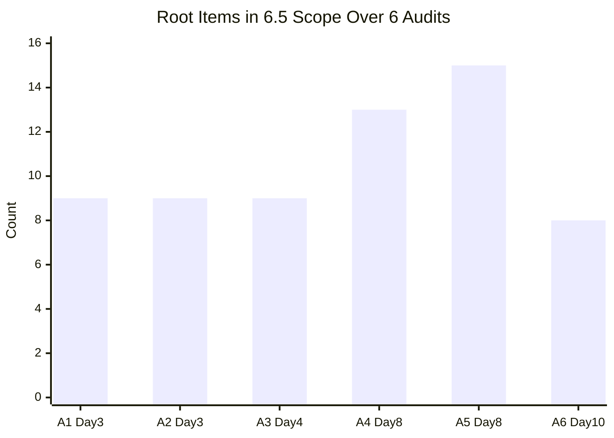

> Sprint scope grew uncontrolled through Audits 1–5, then was decisively right-sized between Audits 5 and 6.

### 6.2 Estimation State Items — The Breakthrough

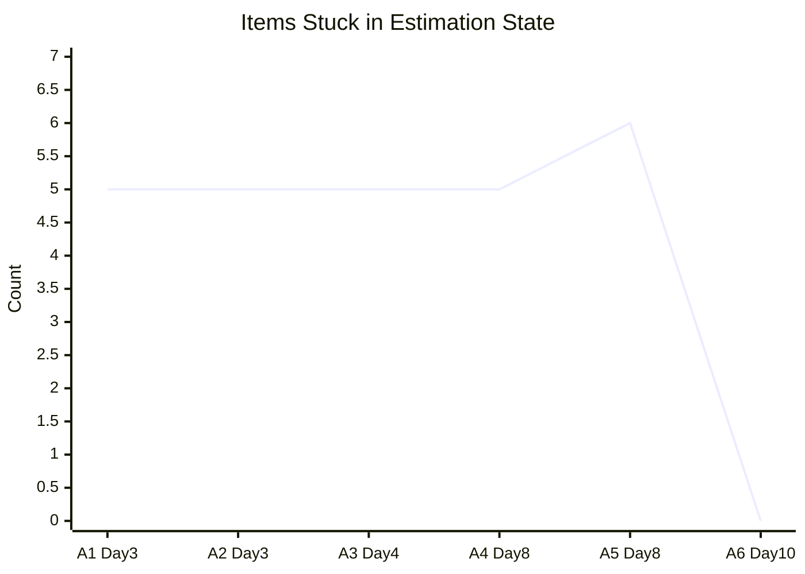

> The Estimation backlog grew for 5 consecutive audits, then dropped to zero in Audit 6.

### 6.3 Sprint Pipeline Health

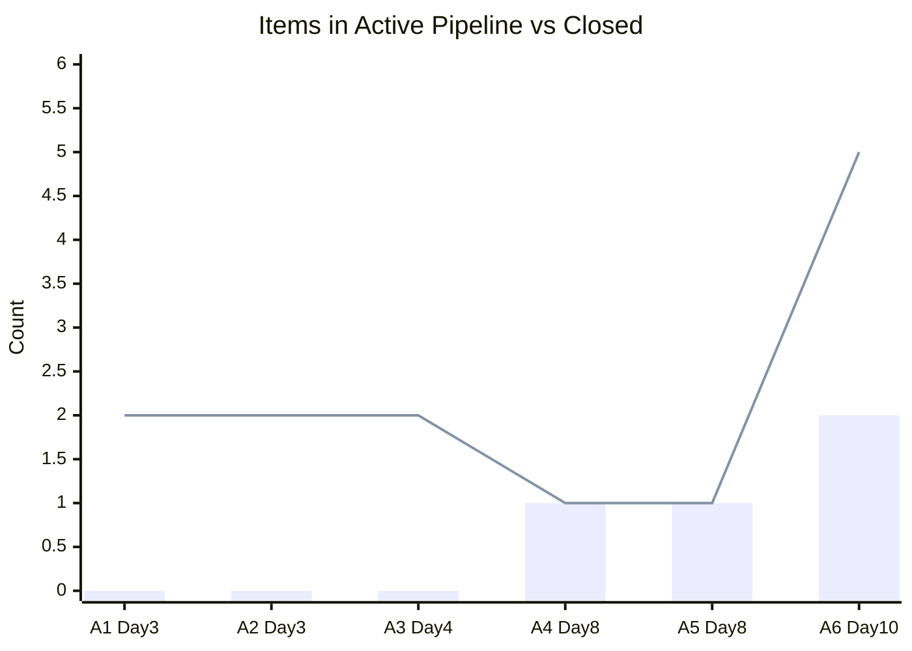

> Bar = Closed items | Line = Items in active pipeline (Active through Ready for UAT)

### 6.4 Sprint State Distribution — Current

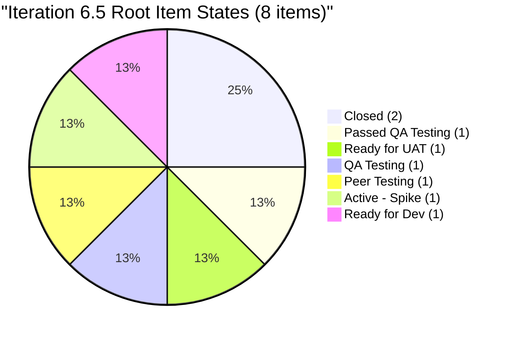

### 6.5 Samantha's Load Across Audits

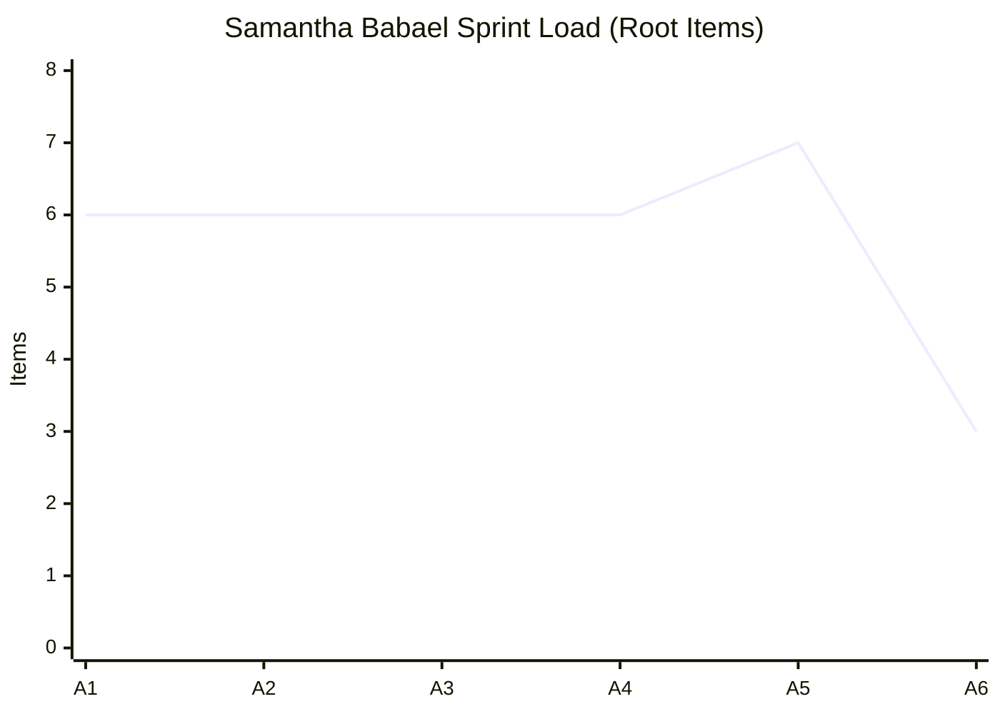

> Load cap recommendation finally implemented between Audit 5 and 6.

---

## 7. DoR (Definition of Ready) Compliance — Iteration 6.5 Scope

| ID | Title | Description | Acceptance Criteria | Story Points | Owner | DoR Status |
|---|---|---|---|---|---|---|
| 200972 | Helga account | ✅ | ❌ | ✅ 1 | ✅ | **Closed** (moot) |
| 201127 | Recipe box | ✅ | ❌ | ✅ 1 | ✅ | **Closed** (moot) |
| 199119 | Subscription pop-up | ✅ | ✅ | ✅ 1 | ✅ | ✅ **PASS** |
| 198770 | Apple Pay | ✅ | ❌ Missing | ✅ 2 | ✅ | 🟡 **Partial** |
| 201306 | Stripe cancellation | ✅ | ❌ Missing | ✅ 1 | ✅ | 🟡 **Partial** |
| 201155 | Email field error | ✅ | ❌ Missing | ✅ 1 | ✅ | 🟡 **Partial** |
| 196379 | Keep Screen On POC | ✅ | ✅ | ✅ 1 | ✅ | ✅ **PASS** |
| 195716 | Hide preferences | ✅ | ✅ | ✅ 2 | ✅ | ✅ **PASS** |

**DoR Summary:** **3 of 6 active root items fully pass DoR (50%)**. All 8 items have owners and story points (100%). The remaining gaps are missing formal Acceptance Criteria on 3 items — though these are actively progressing through the pipeline regardless.

**Improvement trajectory:**
- Audit 4: 8% DoR pass rate
- Audit 5: 14% DoR pass rate
- **Audit 6: 50% DoR pass rate (6.5 scope only)**

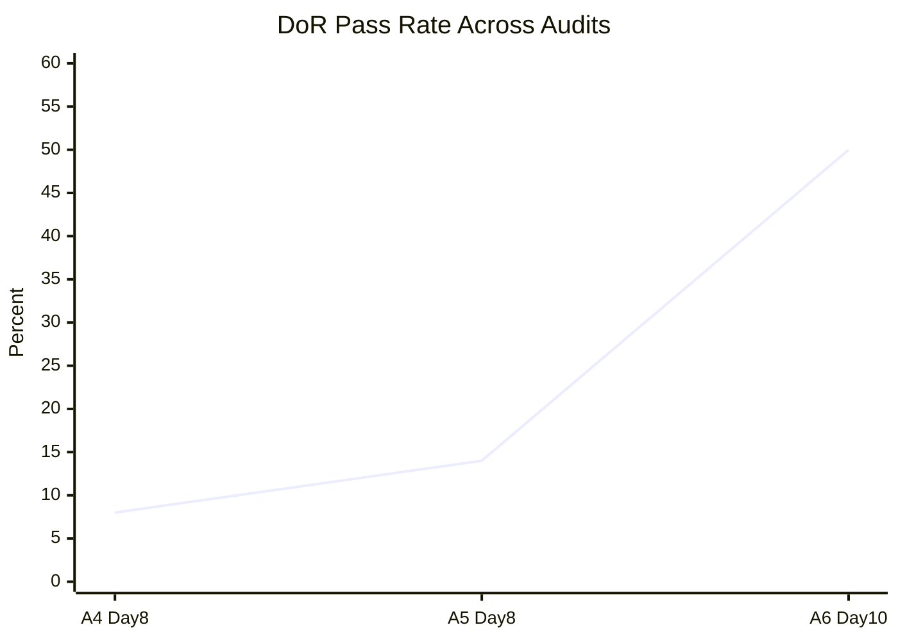

---

## 8. Ownership Concentration — Resolved

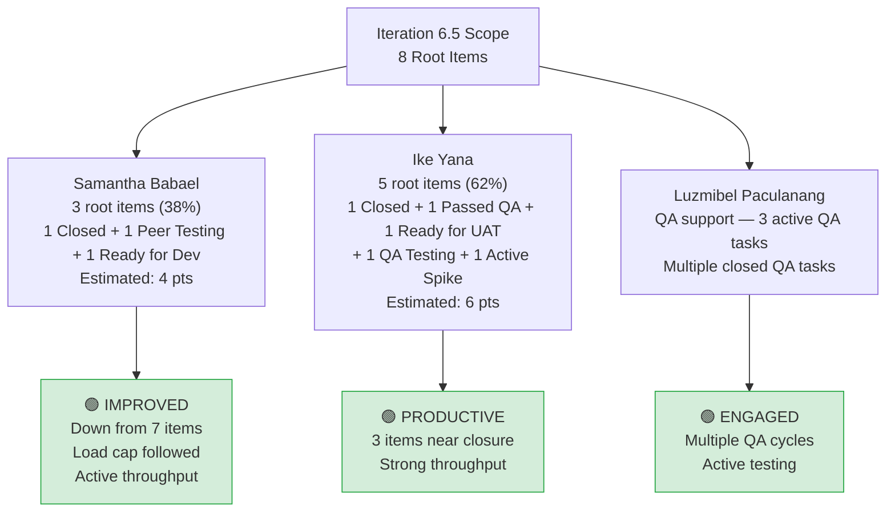

**Samantha's load has been brought under control.** From a peak of 7 root items (47% of a 15-item scope, all stagnant) in Audit 5, she now has 3 items (38% of an 8-item scope), with one already closed and one actively progressing through peer testing.

**Ike carries the heavier load (5 items/62%)** but this is appropriate because 3 of his items are near closure (Passed QA, Ready for UAT, QA Testing) and 1 is already closed. His demonstrated throughput supports this distribution.

---

## 9. Velocity and Sprint Completion Forecast

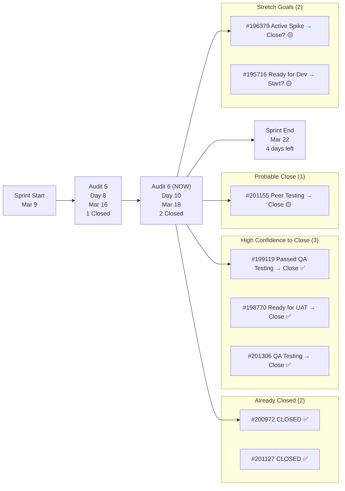

| Scenario | Root Items Closed | Story Points Earned | Completion Rate (of 8) |
|---|---:|---:|---|
| **Optimistic** (all pipeline items close + Spike completes + #195716 starts) | 7–8 | 10–11 | **88–100%** |
| **Baseline** (closed + 3 high-confidence + #201155 closes) | 6 | 7 | **75%** |
| **Conservative** (closed + high-confidence only) | 5 | 6 | **63%** |

**Earned velocity to date:** 2 root items closed, 2 story points earned in 10 sprint days.
**Projected final velocity:** 5–7 root items, 6–10 story points.

**This represents a dramatic recovery from Audit 5's forecast of 20–27% (3–4 items of 15).**

---

## 10. Sprint Goal Probability

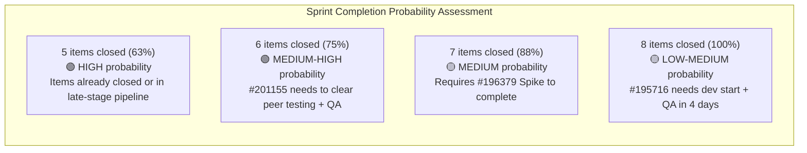

---

## 11. SAFe Compliance Findings (Updated — Audit 6)

| # | Finding | Severity | Status vs. Audit 5 | SAFe Area |
|---|---|---|---|---|
| F1 | **Estimation backlog cleared — 0 items in Estimation (6.5)** | ✅ RESOLVED | 🟢🟢 Was CRITICAL in all 5 prior audits | Iteration Planning |
| F2 | **100% of 6.5 root items estimated (8/8, 11 pts)** | ✅ RESOLVED | 🟢🟢 Was 40% in Audit 5 | Estimation / Predictability |
| F3 | **Samantha's load reduced from 7 → 3 items** | ✅ RESOLVED | 🟢🟢 Was CRITICAL in all 5 prior audits | Capacity Allocation |
| F4 | **DoR: 50% pass rate (3 of 6 active items)** | MEDIUM | 🟢 Improved (was 14% in Audit 5) | Definition of Ready |
| F5 | **66 backlog items, stable** | MEDIUM | ⚪ Unchanged | Backlog Management |
| F6 | **#196378 (Iteration 6.4) appears Blocked in 6.5 board** | HIGH | 🆕 New finding — cross-iteration anomaly | Work Item Hygiene |
| F7 | **Sprint scope right-sized from 15 → 8** | ✅ RESOLVED | 🟢🟢 Was CRITICAL (67% scope creep) | Sprint Commitment Integrity |
| F8 | **3 items still show in 6.5 board but have 6.6 iteration path** | MEDIUM | 🟡 Partially resolved (was 3 items) | Work Item Hygiene |
| F9 | **Sprint forecast: 63–88% completion** | ✅ RECOVERED | 🟢🟢 Was 20–27% in Audit 5 | Predictability |
| F10 | **Audit recommendations acted upon across multiple areas** | ✅ RESOLVED | 🟢🟢 Was HIGH concern in Audit 5 | Process Discipline |

---

## 12. Positive Observations

| # | Observation |
|---|---|
| P1 | **Decisive deferral action taken** — 5 items moved to 6.6 with grooming. This is the first time audit recommendations were comprehensively followed. |
| P2 | **#199119's Estimation → Passed QA journey in ~48 hours** proves items flow rapidly when properly prepared and assigned. |
| P3 | **#201127 closed by Samantha** — with proper task decomposition (fix defect + QA testing). Shows she delivers when load is manageable. |
| P4 | **Deferred items were groomed, not just dumped** — 4 of 5 advanced to Ready for Dev with story points, preparing 6.6 properly. |
| P5 | **#201306 same-day turnaround** — urgent Stripe defect entered and reached QA Testing on the same day. Interrupt throughput remains excellent. |
| P6 | **Task decomposition is now standard** — 17 child tasks (up from 2 in Audit 1) showing proper work breakdown. |
| P7 | **Samantha's load capped at 3 items** — first time the load-capping recommendation has been implemented. |
| P8 | **#195716 received AC and story points** — moved from Estimation to Ready for Dev with Gherkin-style acceptance criteria. |
| P9 | **100% estimation coverage** — every item in the 6.5 scope has story points for the first time. |
| P10 | **#195727 reassigned from Samantha to Ike** in the 6.6 deferral, showing load rebalancing awareness. |

---

## 13. Risks (Updated)

| Risk | Likelihood | Impact | Trend (vs. Audit 5) |
|---|---|---|---|
| #196378 (Blocked, Iteration 6.4) remains unresolved | **High** | Medium | 🆕 New risk — needs attention or formal deferral |
| #195716 (Ready for Dev) may not start if dev capacity consumed by testing/UAT | **Medium** | Low | 🟡 Last item in queue |
| #198770 UAT reveals rework needed (Apple Pay) | **Medium** | Medium | 🟡 New risk — UAT outcome uncertain |
| #201306 QA discovers rework needed (Stripe) | **Low-Medium** | Medium | 🟡 New risk — urgent item |
| Backlog aging (66 items, many stale since 2024) | **High** | Medium | ⚪ Unchanged — not addressed this sprint |
| DoR gaps on 3 items missing AC persist into closure | **Medium** | Low | 🟡 Improved but not fully resolved |

---

## 14. Recommendations

### 14.1 Immediate (March 18–19)

| # | Action | Owner | Priority |
|---|---|---|---|
| R1 | **Resolve #196378 (Blocked, Iteration 6.4)** — either unblock with the needed information/dependency, or formally defer to 6.6. A Blocked item from a prior iteration should not linger. | Ike / PM | HIGH |
| R2 | **Close #199119 (Passed QA Testing)** — this item has passed QA and should move to Closed/Done state immediately. | PM / Ike | HIGH |
| R3 | **Complete UAT on #198770** — Apple Pay fix is Ready for UAT. Schedule user acceptance testing in the next 1–2 days. | QA / PM | HIGH |
| R4 | **Complete QA on #201306** — Stripe cancellation fix is in QA Testing. Prioritize given its Urgent tag and customer-facing billing impact. | Luzmibel | HIGH |

### 14.2 Remaining Sprint (March 19–22, 4 days)

| # | Action | Owner | Priority |
|---|---|---|---|
| R5 | **Close #201155 peer testing cycle** — move through peer testing → QA → Close. Samantha and Luzmibel to coordinate. | Samantha / Luzmibel | HIGH |
| R6 | **If capacity allows, start #195716** — this is Ready for Dev with full DoR compliance. Samantha can begin once #201155 clears peer testing. | Samantha | MEDIUM |
| R7 | **Complete #196379 Spike research** — Ike's research task on Keep Screen On is New. Complete and document findings before sprint end. | Ike | MEDIUM |
| R8 | **Add missing AC to #198770, #201306, and #201155** — even retroactively, documenting acceptance criteria improves traceability. | Item Owners | LOW |

### 14.3 Iteration 6.6 Planning (Post-Sprint)

| # | Action | Owner | Priority |
|---|---|---|---|
| R9 | **Leverage the groomed 6.6 backlog** — 5 deferred items are now Ready for Dev with story points. Start 6.6 planning from this pre-refined baseline. | PM / Team | HIGH |
| R10 | **Maintain the load cap: max 3–4 root items per person** — this sprint proved that reducing Samantha's load from 7 → 3 unlocked actual throughput. | PM | HIGH |
| R11 | **Enforce DoR gate at 6.6 sprint planning** — while improved to 50%, the goal should be 100% DoR compliance at sprint start. | PMO / Team | HIGH |
| R12 | **Run backlog refinement** — 66 items in the requirements backlog, many from 2024. Prune 10+ stale items before 6.6 planning. | PM / PO | MEDIUM |
| R13 | **Formalize interrupt budget** — this sprint saw 3 urgent interrupt defects (#200972, #201306, and arguably #201155). Reserve explicit capacity in 6.6 for unplanned work. | PM | MEDIUM |
| R14 | **Celebrate the team's pivot** — the transformation between Audit 5 and 6 should be acknowledged. The team demonstrated adaptability and responsiveness. | PM | MEDIUM |

---

## 15. Cross-Audit Learning Summary

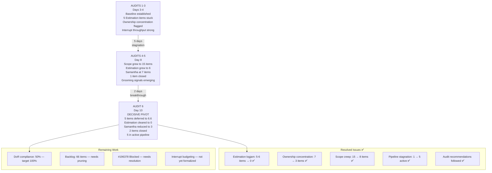

**The story of Iteration 6.5 across six audits is a story of delayed but decisive course correction.**

For 8 sprint days (Audits 1–5), the team exhibited a consistent pattern: interrupt work flowed efficiently while planned work stagnated in Estimation. Samantha's load grew from 6 to 7 items. Sprint scope inflated from 9 to 15 items. The same findings were documented audit after audit with increasing urgency.

Then, between Audit 5 and Audit 6, the team acted. Five items were deferred — and groomed. Estimation items were either completed (#199119, #201127) or moved to Ready for Dev (#195716). Samantha's load was cut in half. The sprint was right-sized. The pipeline activated.

**The key lesson for 6.6:** The corrective actions that transformed this sprint in 48 hours should have happened at sprint planning. If DoR compliance, load capping, and scope right-sizing are enforced at the sprint boundary, the team will never need a mid-sprint pivot again. The capability is clearly there — what's needed is the discipline to apply it proactively rather than reactively.

---

## 16. Conclusion

Day 10 of Iteration 6.5 marks a turning point. After 5 audits documenting stagnation, scope creep, and ownership overload, the team delivered the most dramatic single-sprint correction this project has seen.

With 4 days remaining, the achievable outcome is clear:

1. **Close 5–6 items** (#200972 ✅, #201127 ✅, #199119, #198770, #201306, likely #201155) for a final velocity of ~7 story points.
2. **Attempt #195716 and #196379** as stretch goals if capacity permits.
3. **Resolve or defer #196378** (Blocked from Iteration 6.4).
4. **Enter 6.6 planning with a pre-groomed backlog** of 5 Ready-for-Dev items and the demonstrated knowledge that load capping and DoR enforcement work.

The sprint will likely close at **63–75% completion** — a remarkable recovery from the 20–27% projected just two days ago, and validation that when the team acts on structural recommendations, throughput follows immediately.

---

*Audit generated by Claude AI SAFe Consultant | Data source: Azure DevOps — jairo org | Iteration 6.5 snapshot as of March 18, 2026 21:06 PT*
