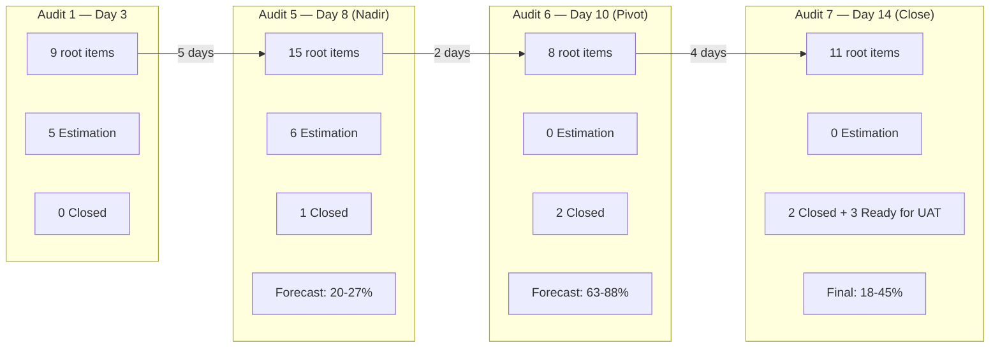
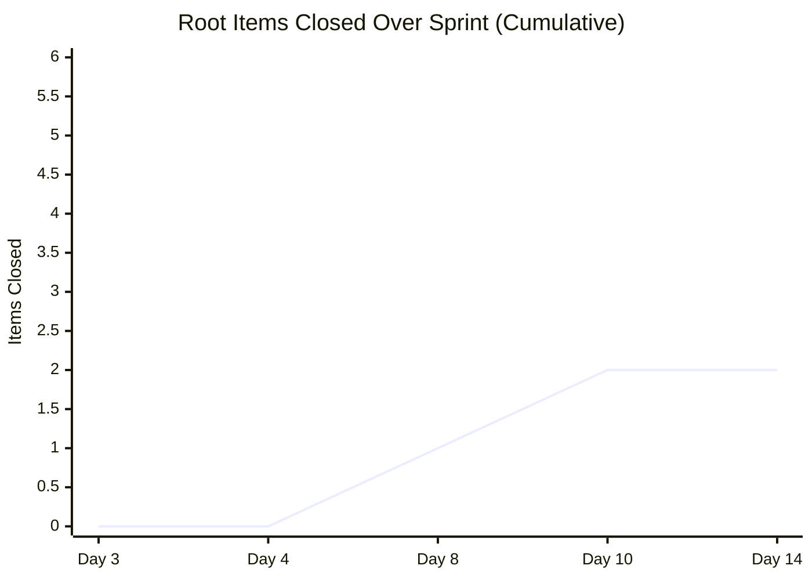
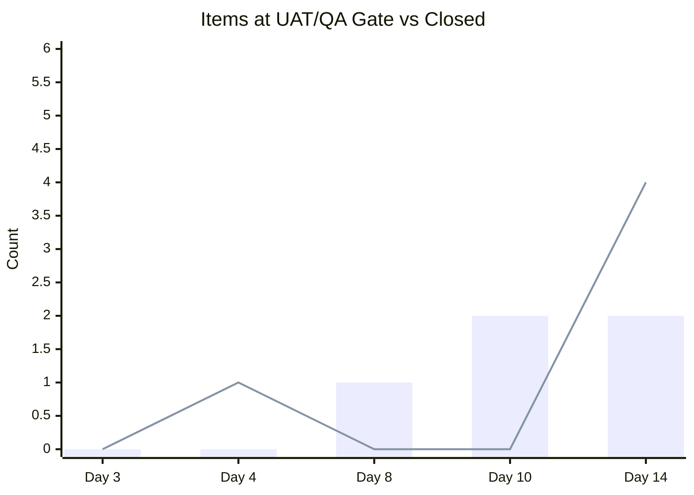
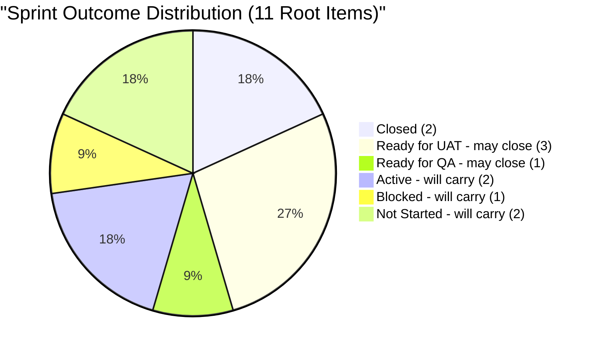
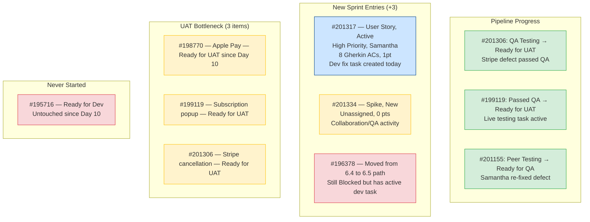
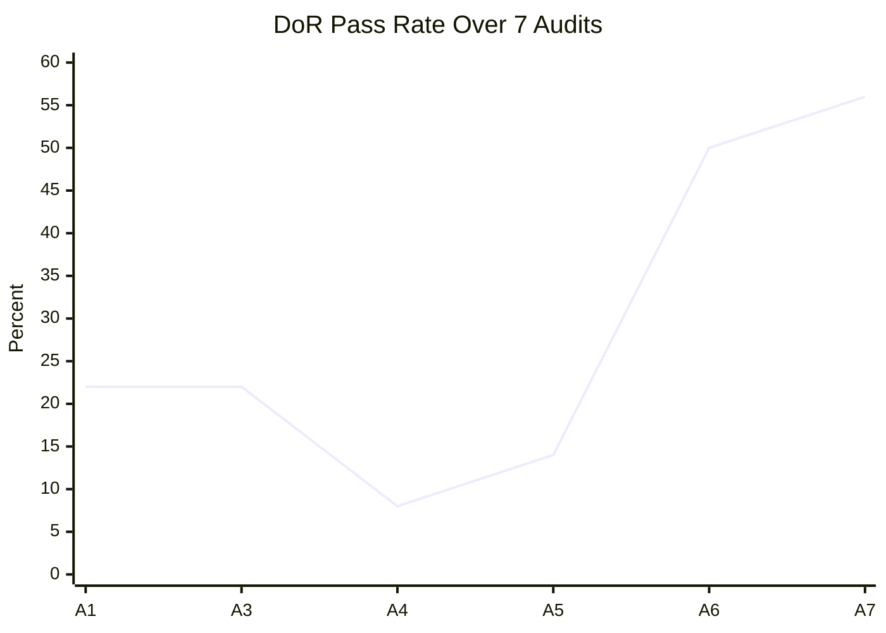
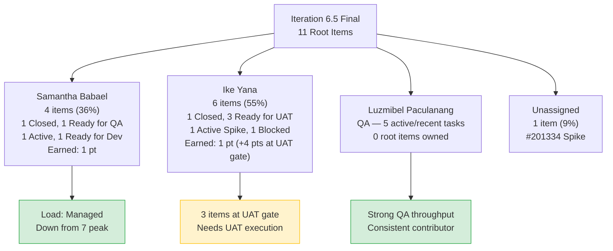
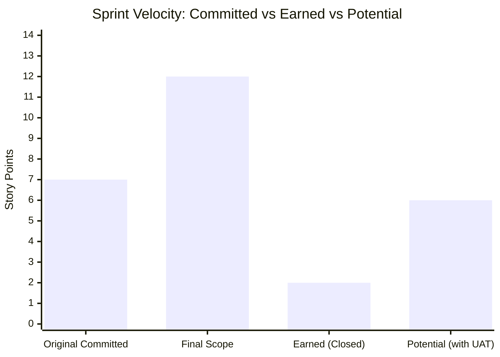
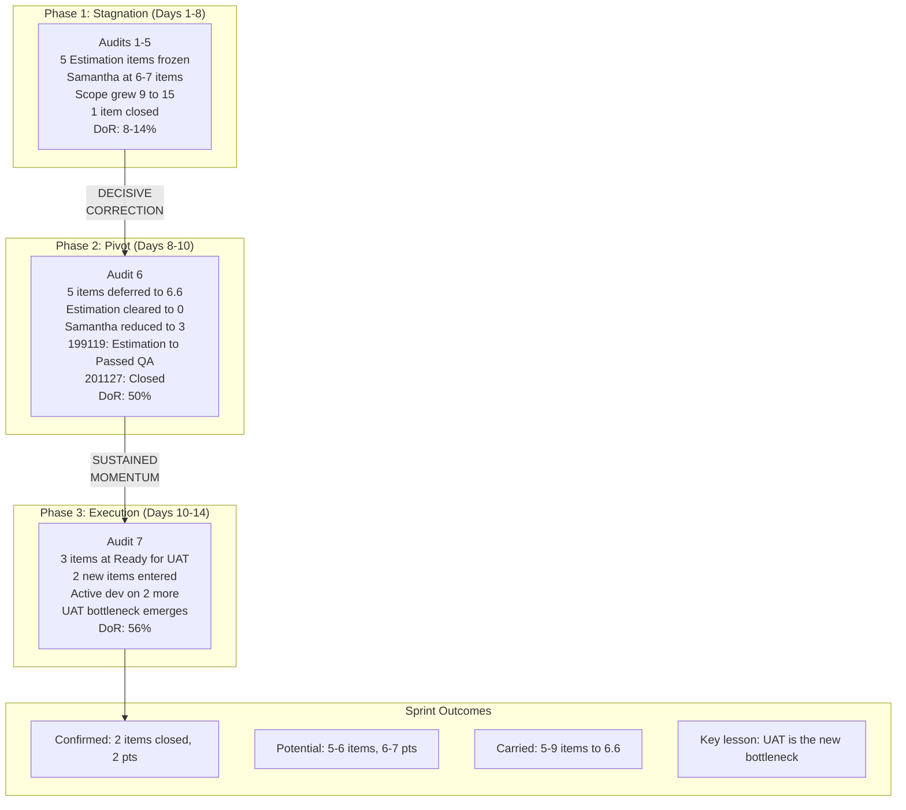

# SAFe Iteration Audit Report — Sprint Close

**Project:** Life Style Help App
**Team:** Life Style Help App Team
**Audit Workspace:** `ado_ls_dev`
**Iteration:** 6.5 (2026-PI6)
**Sprint Dates:** March 9, 2026 – March 22, 2026
**Audit Date:** March 22, 2026 — 16:27 PT (Day 14 of 14 — **Sprint End**)
**Previous Audits:**

- AUDIT_20260311_195254.md — Day 3 (1st)
- AUDIT_20260311_234111.md — Day 3 (2nd)
- AUDIT_20260312_155024.md — Day 4 (3rd)
- AUDIT_20260316_213441.md — Day 8 (4th)
- AUDIT_20260316_225415.md — Day 8 (5th)
- AUDIT_20260318_210643.md — Day 10 (6th)
**Auditor:** Claude (AI SAFe Consultant)

---

## 1. Executive Summary

This is the **seventh and final audit** of Iteration 6.5 — the sprint-close report. The sprint ends today. This audit serves as the definitive record of what the team delivered, what carries over, and what structural lessons should inform Iteration 6.6 planning.

**Headline: The sprint recovered from near-failure to deliver meaningful throughput — but three Ready-for-UAT items may not close before end-of-day, creating a UAT bottleneck at the finish line.**

**Sprint outcome as of Day 14:**

- **2 root items Closed** (#200972, #201127) — earning 2 story points.
- **3 root items at Ready for UAT** (#198770, #199119, #201306) — these completed dev and QA but are stuck awaiting user acceptance testing on the final day. If UAT runs today, the sprint closes with 5 items (45%) and 6 story points.
- **1 item at Ready for QA** (#201155) — Samantha's fix is done, awaiting QA.
- **2 new items entered since Audit 6** (#201317 — an Active, well-formed User Story; #201334 — an unassigned Spike).
- **#196378 moved its iteration path from 6.4 to 6.5** and has active dev work but remains in `Blocked` state.
- **#195716 never started** — the Ready-for-Dev item sat untouched for the entire second half.

The sprint's true 6.5 scope expanded from 8 (Audit 6) to **11 root items**, with 2 new entries and 1 reclassification. The pipeline is healthy with 24 child tasks showing proper work breakdown — but the sprint clock runs out with 9 items still open.

**Final sprint velocity: 2–5 root items closed (18–45%), 2–6 story points earned.**

---

## 2. Seven-Audit Delta Summary

| Metric | A1 (Day 3) | A3 (Day 4) | A5 (Day 8) | A6 (Day 10) | **A7 (Day 14)** | Trend |
|---|---:|---:|---:|---:|---:|---|
| Root items in 6.5 scope | 9 | 9 | 15 | 8 | **11** | 🟡 +3 since Audit 6 |
| Child tasks | 2 | 3 | 8 | 17 | **24** | 🟢 Healthy decomposition |
| Root items `Closed` | 0 | 0 | 1 | 2 | **2** | ⚪ No new closures |
| Root items `Ready for UAT` | 0 | 0 | 0 | 0 | **3** | 🟢 Pipeline filled |
| Root items in `Estimation` | 5 | 5 | 6 | 0 | **0** | 🟢 Sustained at zero |
| Root items `Active` | 2 | 1 | 1 | 1 | **2** | Work in progress |
| Root items `Blocked` | 0 | 0 | 0 | 1 | **1** | 🔴 #196378 still blocked |
| Story points (6.5 scope) | 7 | 7 | 10 | 11 | **12** | 🟢 Improving coverage |
| Items with story points | 4/9 | 4/9 | 6/15 | 8/8 | **10/11 (91%)** | 🟢 Near-full coverage |
| Backlog items | 67 | 65 | 66 | 66 | **67** | 🟡 Slight growth |

---

## 3. Final Sprint Snapshot

| Metric | Value | SAFe Interpretation |
|---|---|---|
| Sprint day | **Day 14 of 14 — FINAL** | Sprint closes today |
| Team members | 3 | Stable throughout sprint |
| Total capacity per day | 3 | 42 total person-days this sprint |
| Root items in 6.5 scope | 11 | +3 since Audit 6 |
| Total iteration-linked items | 35 | 11 root + 24 child tasks |
| Root items `Closed` | 2 | 18% of scope |
| Root items `Ready for UAT` | 3 | **UAT bottleneck — may not close today** |
| Root items with story points | 10 of 11 | 91% estimation coverage |
| Story points in scope | 12 | Story points earned: 2 (confirmed) |
| Backlog items | 67 | +1 since Audit 6 |

### Team Capacity — Final Sprint Distribution

| Person | Role | Cap/Day | 6.5 Items | Closed | In Pipeline | Status |
|---|---|---:|---:|---:|---:|---|
| Samantha Babael | Dev | 1 | 4 | 1 (#201127) | 3 (#201155 Ready for QA, #201317 Active, #195716 Ready for Dev) | 🟡 Productive but items won't close today |
| Ike Yana | Dev | 1 | 6 | 1 (#200972) | 5 (#198770, #199119, #201306 Ready for UAT, #196379 Active, #196378 Blocked) | 🟢 3 items at UAT gate |
| Luzmibel Paculanang | QA | 1 | 0 root | — | Multiple active QA tasks | 🟢 Active QA throughput |
| Unassigned | — | — | 1 | — | #201334 (Spike, New) | 🔴 Unowned |

---

## 4. Full Sprint Scope — Final Status

### 4.1 Iteration 6.5 Root Items (11)

| ID | Title | Type | State | Owner | Pts | Change Since A6 | Sprint Outcome |
|---|---|---|---|---|---:|---|---|
| 200972 | [Urgent] Helga account investigation | Defect | **Closed** | Ike | 1 | ⚪ Unchanged | ✅ **DONE** |
| 201127 | [Admin][Recipe] Unnecessary box | Defect | **Closed** | Samantha | 1 | ⚪ Unchanged | ✅ **DONE** |
| 198770 | [High] Apple Pay Payment Fails | Defect | **Ready for UAT** | Ike | 2 | ⚪ Still awaiting UAT | 🟡 **UAT GATE** |
| 199119 | [High] Remove Payment Confirmation Pop-up | User Story | **Ready for UAT** | Ike | 1 | 🟢 Passed QA → Ready for UAT | 🟡 **UAT GATE** |
| 201306 | [Urgent] Stripe cancellation not working | Defect | **Ready for UAT** | Ike | 1 | 🟢 QA Testing → Ready for UAT | 🟡 **UAT GATE** |
| 201155 | [High] Email Field Error Before Login | Defect | **Ready for QA** | Samantha | 1 | 🟢 Peer Testing → Ready for QA | 🟡 **QA GATE** |
| 201317 | [High] Show validation errors after proceed | User Story | **Active** | Samantha | 1 | 🆕 **New — Active with dev task** | 🔴 **CARRY** |
| 196378 | [High] Anonymous forum comments | User Story | **Blocked** | Ike | 1 | 🟡 Moved to 6.5 path; active dev task | 🔴 **CARRY (Blocked)** |
| 196379 | [High] Keep Screen On - POC | Spike | **Active** | Ike | 1 | ⚪ Unchanged | 🔴 **CARRY** |
| 195716 | [Medium] Hide preferences in recipe card | User Story | **Ready for Dev** | Samantha | 2 | ⚪ **Never started** | 🔴 **CARRY** |
| 201334 | Collaboration/Check Raised Issues | Spike | **New** | Unassigned | 0 | 🆕 **New — unassigned** | 🔴 **CARRY** |

### 4.2 Items Deferred to 6.6 (IP) — Still Visible on Board

| ID | Title | State | Owner | Pts | Notes |
|---|---|---|---|---:|---|
| 201158 | [Medium] Blog Posts Excessive Line Spacing | Ready for Dev | Samantha | 1 | Properly deferred |
| 201174 | [Low] Update Subscription Client Profile | Estimation | Samantha | 2 | Properly deferred |
| 201162 | [Low] Workout Search Suggestions Obstruct List | New | Samantha | 0 | Properly deferred |

### 4.3 Child Tasks Summary (24 total)

| State | Count | Examples |
|---|---:|---|
| Closed | 17 | Dev fixes, QA creates, QA testing tasks |
| Active | 5 | QA testing (#201176, #201244, #201323, #201335), dev fix (#201354, #201371) |
| New | 1 | Research task (#201236) |
| **Total** | **24** | **71% task closure rate** |

---

## 5. Sprint Burndown Analysis

> Bar = Closed items | Line = Items at QA/UAT gate (ready to close but blocked by validation)

**The burndown reveals a critical pattern:** items accumulate at the UAT/QA gate rather than closing. On Day 14, there are more items waiting for UAT (3) than items actually closed (2). This suggests the team's development throughput exceeds its validation throughput — a classic late-sprint bottleneck.

---

## 6. Sprint Goal Probability — Final Assessment

| Outcome | Items | Points | Completion Rate | Probability |
|---|---:|---:|---|---|
| **Best case** (UAT + QA items all close today) | 6 | 7 | 55% | 🟡 Low-Medium |
| **Likely outcome** (UAT items close, #201155 carries) | 5 | 6 | 45% | 🟢 Medium-High |
| **Confirmed minimum** (only currently closed items) | 2 | 2 | 18% | ✅ Certain |

---

## 7. What Changed Since Audit 6 (March 18 → March 22)

**Key observations:**

1. **The UAT bottleneck is the story of the sprint's final days.** Three items completed dev and QA but cannot close because UAT has not been performed. #198770 has been at Ready for UAT since at least March 19 (4 days). This is a process gap — there is no designated UAT owner or SLA.

2. **#201317 is the highest-quality item to enter mid-sprint.** It has a proper user story format, 8 well-written Gherkin acceptance criteria, a story point, and Samantha is actively developing it (task #201371 created today). However, it cannot close today — it will carry to 6.6 as partially complete.

3. **#196378 was reclassified from Iteration 6.4 to 6.5** — and Ike has an active "Fix mobile issue" task (created March 20). Despite this active work, the item remains in `Blocked` state. This state is stale and should be updated to `Active`.

4. **#195716 was never started** — this Ready-for-Dev item with full DoR compliance sat untouched for 12+ days. It represents the cost of mid-sprint scope additions: when new urgent items enter, lower-priority planned work gets crowded out.

---

## 8. DoR (Definition of Ready) Compliance — Final

| ID | Title | Desc | AC | Pts | Owner | DoR |
|---|---|---|---|---|---|---|
| 200972 | Helga account | ✅ | ❌ | ✅ 1 | ✅ | **Closed** |
| 201127 | Recipe box | ✅ | ❌ | ✅ 1 | ✅ | **Closed** |
| 198770 | Apple Pay | ✅ | ❌ | ✅ 2 | ✅ | 🟡 Partial |
| 199119 | Subscription pop-up | ✅ | ✅ | ✅ 1 | ✅ | ✅ **PASS** |
| 201306 | Stripe cancellation | ✅ | ❌ | ✅ 1 | ✅ | 🟡 Partial |
| 201155 | Email field error | ✅ | ❌ | ✅ 1 | ✅ | 🟡 Partial |
| 201317 | Validation errors | ✅ | ✅ | ✅ 1 | ✅ | ✅ **PASS** |
| 196378 | Anonymous forum | ✅ | ✅ | ✅ 1 | ✅ | ✅ **PASS** (but Blocked) |
| 196379 | Keep Screen On POC | ✅ | ✅ | ✅ 1 | ✅ | ✅ **PASS** |
| 195716 | Hide preferences | ✅ | ✅ | ✅ 2 | ✅ | ✅ **PASS** |
| 201334 | Collaboration Spike | ❌ | ❌ | ❌ 0 | ❌ | 🔴 **FAIL** |

**Final DoR Summary:** 5 of 9 active items pass DoR (**56%**). All items except #201334 have owners and story points.

**DoR improvement trajectory across all 7 audits:**

---

## 9. Ownership Distribution — Final

**Samantha's load remained controlled** at 4 items (was 3 in Audit 6, +1 from #201317). She closed 1 item, has 1 at QA gate, and is actively developing #201317. Compared to the peak of 7 stagnant items in Audit 5, this is a dramatic improvement.

**Ike carries 6 items (55%)** but 3 are at Ready for UAT — they're developer-complete. His bottleneck is not capacity but UAT validation.

---

## 10. Velocity — Sprint Final

| Metric | Value |
|---|---|
| **Story points committed (original 9 items)** | 7 |
| **Story points in final 6.5 scope (11 items)** | 12 |
| **Story points earned (Closed)** | **2** |
| **Story points at UAT gate** | **4** (if all close: total 6) |
| **Root items closed** | **2 of 11** (18%) |
| **Root items potentially closable today** | **5–6 of 11** (45–55%) |
| **Child task closure rate** | **17 of 24** (71%) |
| **Sprint duration** | 14 days (10 working days) |
| **Throughput rate** | 0.2 root items/day (confirmed), 0.5/day (potential) |

---

## 11. SAFe Compliance Findings — Sprint Close

| # | Finding | Severity | Final Status | SAFe Area |
|---|---|---|---|---|
| F1 | **Estimation logjam resolved — 0 items in Estimation** | ✅ RESOLVED | 🟢 Cleared at Audit 6, sustained through close | Iteration Planning |
| F2 | **91% estimation coverage (10/11 items)** | ✅ RESOLVED | 🟢 Was 44% at sprint start | Estimation |
| F3 | **Samantha's load managed: 4 items (from peak of 7)** | ✅ RESOLVED | 🟢 Load cap applied | Capacity |
| F4 | **UAT bottleneck: 3 items stuck at Ready for UAT** | HIGH | 🔴 **New finding — no UAT owner/SLA** | Flow / WIP |
| F5 | **#196378 Blocked state inconsistent with active dev work** | MEDIUM | 🔴 State hygiene issue | Work Item Hygiene |
| F6 | **#195716 never started despite being Ready for Dev** | MEDIUM | 🟡 Crowded out by interrupt work | Predictability |
| F7 | **Sprint scope grew 22% at end (8→11 in final 4 days)** | MEDIUM | 🟡 Late entries, though less severe than mid-sprint | Sprint Commitment |
| F8 | **DoR pass rate 56% — improved but below target** | MEDIUM | 🟡 Up from 8% at nadir | Definition of Ready |
| F9 | **67 backlog items — slight growth, no dedicated grooming** | MEDIUM | ⚪ Unchanged pattern | Backlog Management |
| F10 | **#201334 unassigned, unestimated Spike in sprint** | LOW | 🔴 Process hygiene | Work Item Hygiene |

---

## 12. Positive Observations — Sprint Close

| # | Observation |
|---|---|
| P1 | **The team executed the most decisive mid-sprint correction in 6 audits** — deferring 5 items to 6.6, clearing the Estimation backlog, and reducing Samantha's load. |
| P2 | **#199119's journey: 8 days stuck in Estimation → Passed QA → Ready for UAT in 6 days.** Proves items flow when properly assigned and DoR-compliant. |
| P3 | **Task decomposition matured dramatically: 2 tasks at sprint start → 24 by sprint close.** Every item now has visible work breakdown. |
| P4 | **Deferred items were groomed, not dumped** — 6.6 starts with 5+ Ready-for-Dev items with story points. |
| P5 | **#201317 entered with 8 Gherkin ACs** — the highest-quality mid-sprint entry across all 7 audits. Team is internalizing DoR standards. |
| P6 | **QA (Luzmibel) remained consistently engaged** — 17 closed tasks, multiple active QA cycles, proper defect documentation throughout. |
| P7 | **Samantha delivered under load cap** — closed #201127, progressed #201155 to Ready for QA, and is actively developing #201317. |
| P8 | **#201306 (Urgent Stripe defect) — entered and reached Ready for UAT in 1 day.** Interrupt throughput remains the team's strength. |
| P9 | **DoR pass rate improved from 8% (Audit 4) to 56% (Audit 7)** — a 7x improvement in the second half. |

---

## 13. Risks — Sprint Close / 6.6 Planning

| Risk | Likelihood | Impact | Notes |
|---|---|---|---|
| 3 Ready-for-UAT items don't close before sprint end | **High** | High | No UAT owner identified; #198770 waiting 4+ days |
| #196378 carries over in Blocked state indefinitely | **High** | Medium | Active dev work but stale state — needs unblocking or formal deferral |
| 9 carry-over items overwhelm 6.6 planning | **Medium** | High | Must be triaged, not automatically pulled in |
| Interrupt-driven work continues to crowd out planned items | **High** | Medium | #195716 never started despite readiness |
| UAT bottleneck persists into 6.6 without process change | **Very High** | High | Systemic — no UAT owner, no SLA |
| Backlog continues growing without grooming | **High** | Medium | 67 items, many from 2024-2025 |

---

## 14. Recommendations

### 14.1 Immediate (Today — Sprint Close)

| # | Action | Owner | Priority |
|---|---|---|---|
| R1 | **Execute UAT on #198770, #199119, #201306 today** — these 3 items are developer-complete and QA-tested. UAT is the only remaining gate. Close them before sprint end if possible. | Ramon / PO | **CRITICAL** |
| R2 | **Update #196378 state from Blocked → Active** — Ike has an active dev task. The Blocked state is stale and misrepresents the item's actual status. | Ike / PM | HIGH |

### 14.2 Sprint Retrospective Topics

| # | Topic | Data Point |
|---|---|---|
| R3 | **Why did 5 items sit in Estimation for 8 days?** The root cause was never addressed in-sprint — only the symptom (deferral) was treated. Was it missing requirements? Unclear priorities? Samantha's overload? | Audits 1–5 all flagged this |
| R4 | **Why is there no UAT process?** 3 items completed dev + QA but have no path to closure because UAT is undefined. Who performs UAT? What's the SLA? | 4 pts stuck at UAT gate |
| R5 | **What enabled the Day 10 pivot?** The team's response between Audit 5 and 6 was extraordinary. What triggered it? Can that responsiveness be applied proactively? | Audit 6 documented the pivot |
| R6 | **Interrupt work: feature or bug?** This sprint saw 4+ unplanned items enter mid-sprint. The team handles them brilliantly — but they crowd out planned work. Is this the team's actual working model? | #195716 never started |

### 14.3 Iteration 6.6 Planning

| # | Action | Owner | Priority |
|---|---|---|---|
| R7 | **Right-size 6.6 commitment based on actual velocity.** This sprint earned 2 story points confirmed (potentially 6). Plan for 6–8 story points maximum in 6.6 with a team of 3. | PM | **CRITICAL** |
| R8 | **Enforce DoR gate: 100% compliance at sprint start.** Items #199119, #196380, #195716, #201317 show DoR-compliant items flow better. Mandate Description + AC + Points + Owner before commitment. | PMO / Team | **CRITICAL** |
| R9 | **Cap individual load at 3–4 root items.** Samantha's performance at 3–4 items (Audits 6–7) vs. 7 items (Audit 5) proves the cap works. | PM | HIGH |
| R10 | **Define UAT process and owner.** Assign a UAT role (Ramon/PO?) with a 24-hour SLA from Ready for UAT → Close. This sprint lost 3+ items to UAT limbo. | PM / PO | HIGH |
| R11 | **Leverage the groomed 6.6 backlog.** Five items deferred from 6.5 are already at Ready for Dev with story points. Start planning from these. | PM | HIGH |
| R12 | **Establish formal interrupt budget:** reserve 2 items / 2 pts of capacity for unplanned defects, tracked separately from committed work. | PM | HIGH |
| R13 | **Run dedicated backlog refinement.** 67 requirement items, many from 2024. Prune 10+ stale items (IDs 160000–168000 range) before 6.6. | PM / PO | MEDIUM |
| R14 | **Resolve #196378 (Blocked).** This item has been Blocked since at least Iteration 6.4. Either unblock the dependency or formally descope it. | Ike / PM | MEDIUM |

---

## 15. Cross-Audit Learning — The Full Story of Iteration 6.5

**The full arc of Iteration 6.5:**

This sprint began with structural dysfunction — five items in Estimation for 8 consecutive days, one developer carrying 7 items, and scope growing uncontrolled. Six audits documented the same findings with increasing urgency.

The inflection point came between Audits 5 and 6 (Days 8–10). The team acted decisively: deferring five items, clearing the Estimation backlog, and rebalancing workloads. Items that had been frozen for 8 days suddenly moved through the pipeline in 48 hours.

The sprint's final phase (Days 10–14) sustained that momentum. Three items reached Ready for UAT, two new high-quality items entered with proper DoR, and task decomposition matured. But a new bottleneck emerged: UAT. Without a defined UAT process, three completed items cannot cross the finish line.

**The three structural lessons for 6.6:**

1. **DoR enforcement prevents Estimation stagnation.** Items with Description + AC + Points + Owner (#199119, #196380, #195716) flow; items without them don't. Enforce at sprint planning.

2. **Load capping unlocks individual throughput.** Samantha at 3–4 items delivers; at 7 items, everything stalls. Cap at 3–4.

3. **The pipeline must be complete.** Dev → QA is healthy. QA → UAT → Close is broken. Define the UAT step before 6.6 starts.

---

## 16. Conclusion

Iteration 6.5 closes today with **2 confirmed root-item closures and 3 more at the UAT gate**. The sprint's trajectory — from near-failure at Day 8 to meaningful recovery by Day 10 to a UAT bottleneck at Day 14 — tells the story of a team that can deliver when structural impediments are removed, but needs process discipline at both the beginning (DoR, load caps) and end (UAT) of the pipeline.

**Final sprint scorecard:**

| Metric | Target | Actual | Grade |
|---|---|---|---|
| Items closed | 9 (original) | 2 (confirmed), 5 (potential) | 🔴 Below target |
| Story points earned | 7 (original) | 2 (confirmed), 6 (potential) | 🔴 Below target |
| Estimation items at close | 0 | 0 | 🟢 Achieved |
| DoR compliance | 100% | 56% | 🟡 Improved but below target |
| Load balance | Max 3–4 per person | Sam: 4, Ike: 6 | 🟡 Improved but Ike heavy |
| Task decomposition | All items | 24 tasks across 11 items | 🟢 Strong |
| Backlog health | Declining | 67 (growing) | 🔴 Needs grooming |

The team has talent, QA discipline, and proven interrupt throughput. What Iteration 6.6 needs is the same decisive energy applied *proactively* at sprint planning rather than *reactively* at mid-sprint. Enforce DoR, cap loads, budget for interrupts, define UAT — and the team's demonstrated capability will translate into predictable delivery.

---

*Audit generated by Claude AI SAFe Consultant | Data source: Azure DevOps — jairo org | Iteration 6.5 final snapshot as of March 22, 2026 16:27 PT*
