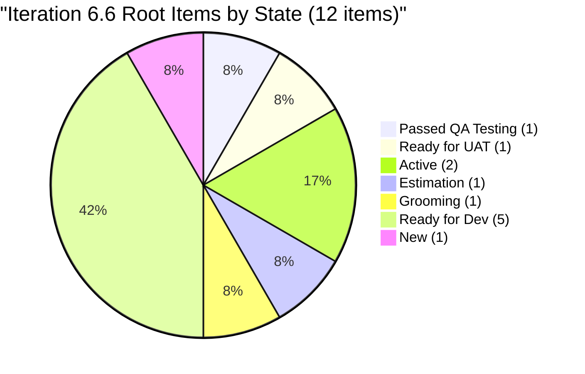
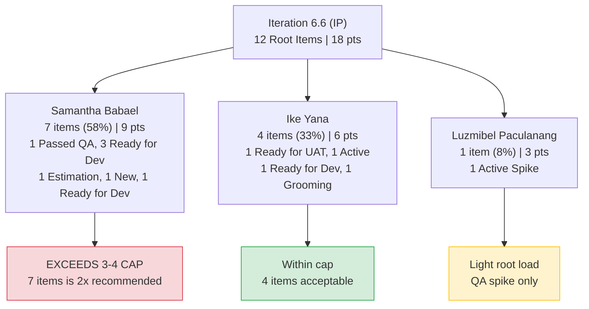
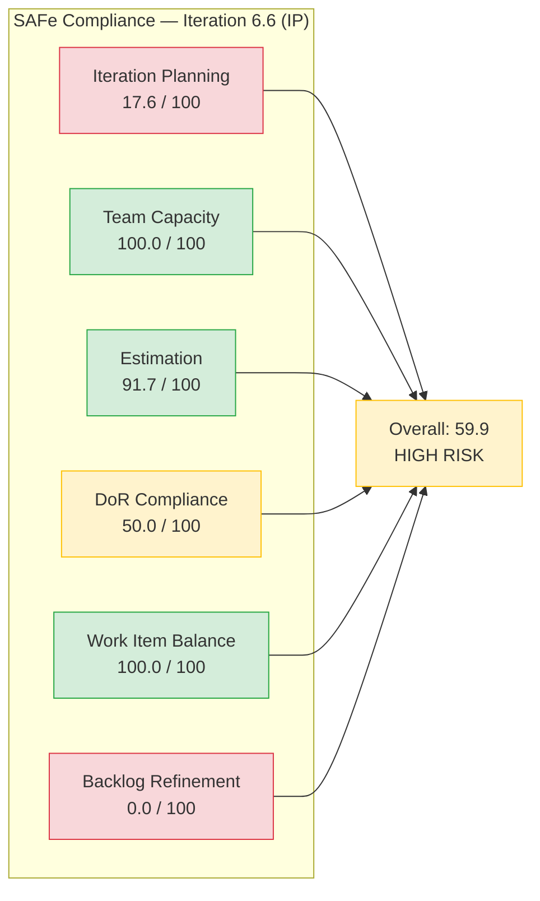

# SAFe Iteration Audit Report

**Project:** Life Style Help App
**Team:** Life Style Help App Team
**Audit Workspace:** `ado_ls_dev`
**Iteration:** 6.6 (IP) (2026-PI6)
**Sprint Dates:** March 23, 2026 -- April 5, 2026
**Audit Date:** March 25, 2026 -- 02:49 PT (Day 3 of 14)
**Previous Audit:** AUDIT_20260322_162742.md (Iteration 6.5 sprint-close, March 22, 2026)
**Auditor:** Claude (AI SAFe Consultant)

---

## 1. Audit Metadata

| Field | Value |
|-------|-------|
| ADO Organization | `jairo` (`dev.azure.com/jairo`) |
| ADO Project | Life Style Help App |
| ADO Project ID | `0f447778-7156-4451-ab21-27be3c4a5888` |
| ADO Team | Life Style Help App Team |
| ADO Team ID | `a2a805bc-0b30-4ef3-9a8a-b7f3081157a6` |
| ADO Team Board URL | `https://jairo.visualstudio.com/Life%20Style%20Help%20App/_boards/board/t/Life%20Style%20Help%20App%20Team/Stories%20and%20Deliverables` |
| Backlog ID | `Microsoft.RequirementCategory` |
| Backlog Focus | Stories and Deliverables |
| Iteration ID | `ce89e611-59c0-45b5-9943-41d41dfa1401` |
| Iteration Path | `Life Style Help App\2026-PI6\Iteration 6.6 (IP)` |
| Iteration Start | 2026-03-23 |
| Iteration Finish | 2026-04-05 |
| Audit Day | Day 3 of 14 |
| Data Sources | Azure DevOps (team settings, backlog, work items, capacity) |
| Scope Restriction | No other boards, teams, projects, or repositories were analyzed |

---

## 2. Executive Summary

This is the **first audit of Iteration 6.6 (IP)**, performed on Day 3 of a 14-day sprint. Iteration 6.6 is the Innovation and Planning (IP) sprint for Program Increment 6, following the team's seven-audit journey through Iteration 6.5.

**Headline: The sprint opens with strong capacity configuration and estimation discipline but carries forward the same structural weaknesses that plagued 6.5 -- a massive stale backlog, weak DoR compliance on defects, and low iteration planning ratio.**

**Key findings at Day 3:**

- **12 root items** are assigned to Iteration 6.6, across 3 contributors.
- **1 item (#201317) has already reached Passed QA Testing** -- a carry-over from 6.5 that continued progressing into the new sprint.
- **1 item (#196378) is at Ready for UAT** -- the same UAT bottleneck pattern from 6.5.
- **6 of 12 items (50%) pass DoR** -- significantly better than 6.5's opening rate (22%) but still below the 80% SAFe target.
- **The backlog carries 68 root items** with 30 items older than 180 days and 47 older than 90 days. Backlog refinement scores zero.
- **Overall SAFe Compliance Score: 59.9 (High Risk)** -- driven down by a massive stale backlog (0/100) and a low iteration planning ratio (17.6/100).

**Sprint risk profile: The team's per-item execution is strong, but the surrounding backlog inventory is critically unhealthy.**

---

## 3. Previous Audit Delta

The previous audit (AUDIT_20260322_162742.md) was the **sprint-close report for Iteration 6.5**. Key outcomes and how they carry into 6.6:

| 6.5 Finding | 6.5 Status | 6.6 Carry-Forward |
|-------------|------------|-------------------|
| UAT bottleneck: 3 items stuck at Ready for UAT | HIGH -- no UAT owner/SLA | #196378 still at Ready for UAT; #198770, #199119, #201306 remain on 6.5 path (not moved to 6.6) |
| #196378 Blocked state inconsistent with active dev | MEDIUM | Now at Ready for UAT in 6.6 -- state corrected |
| #195716 never started despite Ready for Dev | MEDIUM | Remains on 6.5 path, not pulled into 6.6 |
| Sprint scope grew 22% late (8 to 11) | MEDIUM | 6.6 starts with 12 items -- must monitor scope creep |
| DoR pass rate 56% at close | MEDIUM | 6.6 opens at 50% (different item mix) |
| 67 backlog items, no grooming | MEDIUM | Now 68 items -- grew by 1 |
| Recommendation R7: Right-size to 6-8 story points | CRITICAL | 6.6 committed 18 story points across 12 items -- **exceeds recommendation by 2x** |
| Recommendation R8: 100% DoR at sprint start | CRITICAL | 50% DoR at Day 3 -- **not met** |
| Recommendation R9: Cap load at 3-4 items | HIGH | Samantha: 7 items, Ike: 4 items -- **Samantha exceeds cap** |
| Recommendation R10: Define UAT process/owner | HIGH | No evidence of new UAT process -- #196378 still at UAT gate |

**Delta assessment:** Three of four critical recommendations from 6.5 were not implemented. The team overcommitted (18 pts vs recommended 6-8), did not enforce DoR, and did not resolve the UAT process gap. Samantha's load cap was not applied. The sole positive carry-forward is that #196378's Blocked state was corrected to reflect actual progress.

---

## 4. Current Iteration Snapshot

| Metric | Value | SAFe Interpretation |
|--------|-------|---------------------|
| Sprint day | Day 3 of 14 | Early sprint -- planning window |
| Team members with capacity | 3 | Samantha (Dev), Ike (Dev), Luzmibel (QA) |
| Total capacity per day | 3 | 42 total person-days this sprint |
| Root items in 6.6 scope | 12 | Across 3 contributors |
| Story points committed | 18 | Exceeds 6.5 recommendation of 6-8 pts |
| Items with story points | 11 of 12 (91.7%) | Strong estimation coverage |
| Items passing DoR | 6 of 12 (50.0%) | Below 80% SAFe target |
| Total backlog items | 68 | +1 since 6.5 close |
| Items > 90 days stale | 47 of 68 (69.1%) | Critical backlog health issue |
| Items > 180 days stale | 30 of 68 (44.1%) | Nearly half the backlog is abandoned |

### Team Capacity -- 6.6 Load Distribution

| Person | Role | Cap/Day | 6.6 Items | Points | States | Assessment |
|--------|------|--------:|----------:|-------:|--------|------------|
| Samantha Babael | Dev | 1 | 7 | 9 | 1 Passed QA, 3 Ready for Dev, 1 New, 1 Estimation, 1 Ready for Dev | Exceeds 3-4 cap |
| Ike Yana | Dev | 1 | 4 | 6 | 1 Ready for UAT, 1 Active, 1 Ready for Dev, 1 Grooming | Within cap |
| Luzmibel Paculanang | QA | 1 | 1 | 3 | 1 Active (Spike) | Light root-item load |

---

## 5. Work Item Analysis

### 5.1 Iteration 6.6 Root Items (12)

| ID | Title | Type | State | Owner | Pts | DoR | Notes |
|----|-------|------|-------|-------|----:|-----|-------|
| 201317 | Show validation errors after proceed | User Story | **Passed QA Testing** | Samantha | 2 | PASS | Carry from 6.5; progressed today |
| 196378 | Anonymous forum comments | User Story | **Ready for UAT** | Ike | 1 | PASS | Carry from 6.5; UAT bottleneck persists |
| 196379 | Keep Screen On - POC | Spike | **Active** | Ike | 1 | PASS | Carry from 6.5; research spike |
| 201596 | 6.6 Guide QA Interns/Collaborations | Spike | **Active** | Luzmibel | 3 | FAIL | New; no desc/AC |
| 201174 | Update Subscription (Client Profile) | User Story | **Estimation** | Samantha | 2 | PASS | Deferred from 6.5 |
| 195727 | Meal time filter search bar issue | User Story | **Grooming** | Ike | 2 | FAIL | No AC |
| 195735 | Adjust membership subscription text | User Story | **Ready for Dev** | Samantha | 2 | PASS | Deferred from 6.5 |
| 196380 | Default Pinned Post for New Users | User Story | **Ready for Dev** | Ike | 2 | PASS | Ready for development |
| 195715 | Remove deadspace on Completed Session | Defect | **Ready for Dev** | Samantha | 1 | FAIL | No AC |
| 198775 | Workout Plans search not working | Defect | **Ready for Dev** | Samantha | 1 | FAIL | No AC |
| 201158 | Blog posts excessive line spacing | Defect | **Ready for Dev** | Samantha | 1 | FAIL | No AC; deferred from 6.5 |
| 201162 | Workout search suggestions obstruct list | Defect | **New** | Samantha | 0 | FAIL | No points, no AC |
| | | | | **Total** | **18** | **6/12** | |

### 5.2 State Distribution

### 5.3 Work Item Type Distribution

| Type | Count | Share | Points |
|------|------:|------:|-------:|
| User Story | 6 | 50.0% | 11 |
| Defect | 4 | 33.3% | 3 |
| Spike | 2 | 16.7% | 4 |
| **Total** | **12** | **100%** | **18** |

### 5.4 Ownership Distribution

---

## 6. SAFe Compliance Scorecard

| # | Dimension | Score | Evidence | Notes |
|---|-----------|------:|----------|-------|
| 1 | **Iteration Planning** | **17.6** | 12 current / 68 visible root items | Only 17.6% of backlog is assigned to current iteration. The massive ungroomed backlog depresses this ratio. |
| 2 | **Team Capacity** | **100.0** | 3 contributors with work / 3 with capacity configured | All three team members (Samantha, Ike, Luzmibel) have capacity set at 1/day each. |
| 3 | **Estimation** | **91.7** | 11 estimated / 12 point-eligible items | Only #201162 (Defect, New) lacks story points. Strong estimation discipline sustained from 6.5. |
| 4 | **DoR Compliance** | **50.0** | 6 compliant / 12 current items | All 4 Defects fail DoR (no AC). #201596 Spike has no desc/AC. #195727 has no AC. |
| 5 | **Work Item Balance** | **100.0** | User Story 50%, Defect 33%, Spike 17% | Healthy mix with no single type exceeding 60%. User Stories present. Spike share (16.7%) is within bounds. |
| 6 | **Backlog Refinement** | **0.0** | Base 30.9 - 60 penalties = 0 | 47/68 items stale >90 days (-20), 30 items stale >180 days (-20), 8/12 current items untouched before sprint start (-20). |
| | **Overall Score** | **59.9** | Average of 6 dimensions | **High Risk** (40-59.9 band) |

### Score Visualization

---

## 7. Dimension Findings

### 7.1 Iteration Planning (17.6/100) -- Critical

The 17.6 score reflects a structural problem, not a planning failure. The team assigned 12 items to the current iteration, which is a reasonable sprint commitment. However, the denominator -- 68 visible root backlog items -- is vastly inflated by stale, ungroomed inventory from 2024 and early 2025.

**Root cause:** The backlog has never been systematically pruned. Items from April 2024 (IDs 160741-164359) remain on the board alongside current sprint work. This creates a false signal: the planning score looks catastrophic even though the team's actual sprint selection is reasonable.

**Impact:** Planning becomes harder when 56 ungroomed items compete for attention alongside 12 intentionally selected sprint items.

### 7.2 Team Capacity (100.0/100) -- Excellent

All three contributors with assigned work items have capacity configured in ADO:

- Samantha Babael: 1/day (Development)
- Ike Yana: 1/day (Development)
- Luzmibel Paculanang: 1/day (Testing)

This represents a sustained improvement from 6.5, where capacity was also configured for all members. The team maintains this discipline.

### 7.3 Estimation (91.7/100) -- Excellent

11 of 12 point-eligible items have story points assigned. The only gap is #201162 (a low-priority defect in `New` state). Total committed points: 18.

**Concern:** The 18-point commitment significantly exceeds the 6-8 point recommendation from the 6.5 close-out audit, which was based on the team's actual 6.5 velocity of 2-6 points earned. If the team cannot sustain 18 points, this represents overcommitment despite excellent estimation coverage.

### 7.4 DoR Compliance (50.0/100) -- Moderate Risk

6 of 12 items pass DoR (Description >= 30 non-whitespace chars AND Acceptance Criteria >= 20 non-whitespace chars).

**Pattern:** All 4 Defects (#195715, #198775, #201158, #201162) fail DoR because none have Acceptance Criteria. This is the same pattern observed throughout 6.5 -- Defects are filed with a description of the bug but no formal AC defining "done."

| DoR Status | Count | Items |
|------------|------:|-------|
| PASS | 6 | #195735, #196378, #196379, #196380, #201174, #201317 |
| FAIL (no AC) | 5 | #195715, #195727, #198775, #201158, #201162 |
| FAIL (no desc + no AC) | 1 | #201596 |

### 7.5 Work Item Balance (100.0/100) -- Excellent

The type distribution is healthy:

- User Story: 50% (6 items)
- Defect: 33% (4 items)
- Spike: 17% (2 items)

No single type dominates above 60%, User Stories are present, and Spike share is well within the 40% threshold. The IP sprint appropriately includes a mix of feature work, defect remediation, and research/collaboration spikes.

### 7.6 Backlog Refinement (0.0/100) -- Critical

This is the most severely impacted dimension. The base score of 30.9 (21 fresh items out of 68) is reduced to 0 by three compounding penalties:

| Penalty | Threshold | Actual | Deduction |
|---------|-----------|--------|----------:|
| Stale >90 days | >25% of visible | 69.1% (47/68) | -20 |
| Stale >180 days | >= 1 item | 30 items | -20 |
| Untouched current items | >30% of current | 66.7% (8/12) | -20 |

**The 30 items older than 180 days** span from April 2024 to September 2025. Many have no assignee, no story points, and minimal descriptions. They represent abandoned scope that was never formally closed, deferred, or removed.

**The 8 untouched current items** (ChangedDate before March 23) were groomed or assigned in earlier iterations but had no activity in the 6.6 sprint window. This is expected on Day 3 -- many items were pre-positioned during 6.5 -- but the formula penalizes the snapshot regardless.

---

## 8. Risks and Bottlenecks

| # | Risk | Severity | Likelihood | Evidence |
|---|------|----------|------------|----------|
| R1 | **Overcommitment: 18 pts vs 2-6 pts actual 6.5 velocity** | Critical | High | 6.5 earned 2 confirmed story points (6 potential). 18 pts is 3-9x the proven velocity. |
| R2 | **Samantha load exceeds cap: 7 items / 9 pts** | High | High | 6.5 close-out recommended 3-4 item cap. Samantha has 7 items -- identical to her overloaded state in 6.5 Audit 5. |
| R3 | **UAT bottleneck persists: #196378 at Ready for UAT** | High | Very High | Same pattern as 6.5: items complete dev+QA but stall at UAT. No evidence of UAT process/owner being defined. |
| R4 | **Backlog inventory critical: 68 items, 30 older than 180 days** | High | Certain | Backlog refinement score is 0. Items from April 2024 are still visible on the board. |
| R5 | **Defects enter sprint without AC: 4 of 4 Defects fail DoR** | Medium | Certain | Systemic gap: the team does not write AC for Defects. This creates ambiguity about when a fix is complete. |
| R6 | **#201162 has no points and no AC** | Medium | Certain | The only unestimated item. In `New` state with no readiness signals. |
| R7 | **IP sprint used for delivery rather than innovation/planning** | Low | Medium | 5 of 12 items are Ready for Dev (delivery work). Only 2 Spikes represent IP-appropriate research. |

---

## 9. Prioritized Recommendations

### 9.1 Critical (This Week)

| # | Action | Owner | Rationale |
|---|--------|-------|-----------|
| A1 | **Execute UAT on #196378 immediately.** This item has been at Ready for UAT since at least March 24. Close it or document what blocks UAT. | Ramon / PO | Same bottleneck from 6.5; 3 items were lost to UAT limbo last sprint. |
| A2 | **Rebalance Samantha's load to 4 items maximum.** Move #201162 (New, no DoR) and #198775 or #201158 (both low-priority Defects with no AC) out of 6.6 scope. | PM / Samantha | 6.5 proved Samantha delivers at 3-4 items but stalls at 7. Current load replicates the failure pattern. |
| A3 | **Right-size commitment to 10-12 points.** Defer 2-3 lower-priority items (e.g., #195715, #198775, #201162) to bring total commitment in line with realistic capacity. | PM / Team | 18 pts is 3x proven velocity. Overcommitment undermines predictability. |

### 9.2 High Priority (This Sprint)

| # | Action | Owner | Rationale |
|---|--------|-------|-----------|
| A4 | **Add Acceptance Criteria to all 4 Defects** (#195715, #198775, #201158, #201162). Even a simple "verify fix, no regression" AC prevents ambiguity. | PM / Samantha | 4/4 Defects fail DoR. Defects without AC cause rework when QA doesn't know what "fixed" means. |
| A5 | **Add Description and AC to #201596** (QA Interns/Collaborations Spike). Define what "done" means for this 3-point Spike. | PM / Luzmibel | 3 story points with zero documentation is a risk. |
| A6 | **Add AC to #195727** (Meal time filter). Description exists but no AC. | PM / Ike | Item is in Grooming state -- this is the right time to add AC before it moves to Ready for Dev. |
| A7 | **Define UAT process and owner with a 24-hour SLA.** Document who performs UAT, what triggers it, and the maximum time from Ready for UAT to Close. | PM / PO | This was Recommendation R10 from 6.5 close-out. It was not implemented. |

### 9.3 Medium Priority (Before Next Sprint)

| # | Action | Owner | Rationale |
|---|--------|-------|-----------|
| A8 | **Conduct backlog grooming session: close or archive items older than 180 days.** Target the 30 items from April 2024 - September 2025 that have no recent activity. | PM / PO | Backlog refinement score is 0. These items distort planning metrics and create noise. |
| A9 | **Establish a Defect DoR template** requiring at minimum: steps to reproduce, expected vs actual behavior, and a 1-line AC ("Verify fix and no regression"). | PM / Team | Systemic gap: Defects consistently enter sprints without AC across multiple iterations. |
| A10 | **Close or move 6.5-path items still on the board** (#198770, #199119, #201306, #195716, #201334). These remain on Iteration 6.5 path but the sprint is over. They should be closed (if UAT passed) or moved to 6.6/backlog. | PM | Stale iteration paths create confusion about what is current work. |

---

## 10. Evidence Gaps and Limitations

| # | Gap | Impact | Mitigation |
|---|-----|--------|------------|
| G1 | **No GitHub repository data analyzed.** This audit used ADO data only. No PR, commit, branch, or review activity was examined. | Cannot assess delivery evidence, code quality, or dev throughput. | This workspace (ado_ls_dev) does not specify GitHub repositories in its CLAUDE.md. GitHub analysis is out of scope for this audit. |
| G2 | **Day 3 snapshot bias.** Many items show ChangedDate before sprint start because they were pre-positioned during 6.5. The "untouched" penalty in Backlog Refinement may overstate staleness. | Backlog Refinement score of 0 is partially inflated by timing. | Re-audit at mid-sprint (Day 7) to see if items have been touched. |
| G3 | **No child task data collected.** This audit focused on root-level backlog items only. Task decomposition within items was not analyzed. | Cannot assess work breakdown structure or task-level progress. | Could be collected in a follow-up audit if needed. |
| G4 | **Iteration 6.5 carry-over items (#198770, #199119, #201306, #201155, #195716, #201334) remain on 6.5 path.** They appear on the board but are not assigned to 6.6. Their final disposition is unclear. | Sprint close for 6.5 may not have been formally completed. These items inflate the visible backlog without being part of 6.6 scope. | Recommend moving or closing these items (see A10). |
| G5 | **Individual capacity granularity.** The API returns 1/day per person but does not expose activity-level allocation (e.g., what share of Samantha's 1/day goes to Development vs. other activities). | Cannot assess whether capacity is balanced across dev and QA activities at a granular level. | Acceptable limitation for this audit scope. |

---

*Audit generated by Claude AI SAFe Consultant | Data source: Azure DevOps -- jairo org | Iteration 6.6 (IP) snapshot as of March 25, 2026 02:49 PT*
