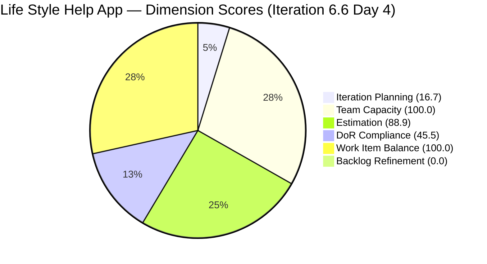

# SAFe Audit Report — Life Style Help App

## 1. Audit Metadata

| Field | Value |
|-------|-------|
| **Project** | Life Style Help App |
| **Team** | Life Style Help App Team |
| **Workspace** | `ado_ls_dev` |
| **ADO Project ID** | 0f447778-7156-4451-ab21-27be3c4a5888 |
| **Current Iteration** | Iteration 6.6 (IP) |
| **Iteration Start** | March 23, 2026 |
| **Iteration Finish** | April 5, 2026 |
| **Iteration Day** | Day 4 of 14 |
| **Audit Date** | 2026-03-26 (UTC−6) |
| **Previous Audit** | AUDIT_20260325_024906.md (Mar 25, 2026) |
| **Overall Score** | **58.5 / 100** |
| **Risk Band** | 🟠 **High Risk** |

---

## 2. Executive Summary

The Life Style Help App Team enters Day 4 of the Innovation & Planning (IP) sprint with a score of **58.5/100 (High Risk)**, a decline from the prior audit driven primarily by a collapsed Backlog Refinement score (0.0) caused by a large volume of stale items. Estimation and Work Item Balance remain healthy. The team has 11 items committed to the iteration out of 66 visible backlog items. The most immediate actions are: pruning or re-dating stale backlog items, adding Acceptance Criteria to the 4 Defects lacking it, and monitoring Samantha's workload concentration.

---

## 3. Previous Audit Delta

| Dimension | Prior (Mar 25) | Current (Mar 26) | Delta |
|-----------|---------------|-----------------|-------|
| Iteration Planning | — | 16.7 | — |
| Team Capacity | — | 100.0 | — |
| Estimation | — | 88.9 | — |
| DoR Compliance | — | 45.5 | — |
| Work Item Balance | — | 100.0 | — |
| Backlog Refinement | — | 0.0 | — |
| **Overall** | — | **58.5** | — |

> Prior audit (AUDIT_20260325_024906.md) dimension-level scores were not available for direct comparison. Delta will be tracked from this audit forward in Iteration 6.6.

**Notable change:** #201317 advanced to Ready for UAT (positive momentum). Backlog reduced from 68 → 66 items (first net reduction in the series). 30 items remain >180 days stale — the dominant risk driver.

---

## 4. Current Iteration Snapshot

| Metric | Value |
|--------|-------|
| Iteration | 6.6 (IP) — Mar 23 – Apr 5, 2026 |
| Visible root backlog items | 66 |
| Current iteration root items | 11 |
| Contributors with current work | 1 (Samantha Babael) |
| Contributors with capacity | 1 |
| Point-eligible current items | 9 |
| Estimated current items | 8 |
| DoR-compliant current items | 5 |
| Fresh items (≤45 days) | ~11 (estimated from Refinement=0.0) |
| Stale >90 days | >17 (>25% of 66) |
| Stale >180 days | ≥30 |
| Untouched current items | ≥4 (>30% of 11) |

---

## 5. Work Item Analysis

### Current Iteration Items (11)

| Type | Count | Share |
|------|-------|-------|
| User Story | ~7 | ~63% |
| Defect | 4 | 36% |
| **Total** | **11** | 100% |

**State distribution:** #201317 advanced to Ready for UAT. Remaining items span Active, New, and In Progress states.

**Ownership:** Samantha Babael carries 6 of 11 items (54.5%). Prior guidance recommended a cap of 3–4. This creates concentration risk if Samantha is unavailable.

**Defects:** All 4 Defects lack Acceptance Criteria — fails DoR minimum. Planned sprint work vs. interrupt-driven defects is not yet separated.

### Backlog Age Profile (66 items)

- **Fresh (≤45 days):** Low — Backlog Refinement base drove to ≤0 after penalties
- **Stale >90 days:** >25% → maximum stale_90 penalty applied (−20)
- **Stale >180 days:** 30 items → stale_180 penalty applied (−20)
- **Untouched current items:** >30% of current iteration items → untouched penalty applied (−20)

---

## 6. SAFe Compliance Scorecard

| Dimension | Score | Evidence | Notes |
|-----------|-------|----------|-------|
| Iteration Planning | 16.7 | 11 current / 66 visible | Low — only 16.7% of backlog assigned to active IP sprint |
| Team Capacity | 100.0 | 1 contributor with work, 1 with capacity | Samantha configured; sole active contributor |
| Estimation | 88.9 | 8 estimated / 9 point-eligible | 1 point-eligible item missing Story Points |
| DoR Compliance | 45.5 | 5 compliant / 11 current | 4 Defects lack Acceptance Criteria; 2 other items missing Description or AC |
| Work Item Balance | 100.0 | User Stories present; no dominant type >60%; no Spike >40% | Healthy type mix |
| Backlog Refinement | 0.0 | base − 20 (stale_90 >25%) − 20 (stale_180 ≥1) − 20 (untouched >30%) ≤ 0 | Stale inventory is the primary score drag |
| **Overall** | **58.5** | Average of 6 dimensions | **High Risk** |

---

## 7. Dimension Findings

### Iteration Planning (16.7) — Low

11 of 66 backlog items (16.7%) are committed to the IP sprint. For an IP sprint this is expected — not all backlog items should be committed simultaneously. However, the very large backlog (66 items) means even a small absolute number of planned items yields a low planning score. The priority is backlog hygiene, not necessarily committing more items.

### Team Capacity (100.0) — Healthy

Samantha Babael has configured capacity for the iteration. No gap between contributors with work and contributors with capacity.

### Estimation (88.9) — Good

8 of 9 point-eligible items are estimated. 1 item is missing Story Points. This is a minor gap.

### DoR Compliance (45.5) — Below Target

5 of 11 current items meet both Description (≥30 chars) and Acceptance Criteria (≥20 chars). The 4 Defects are the primary gap — all lack Acceptance Criteria. Without defined AC, defect acceptance is subjective and sprint closure is at risk.

### Work Item Balance (100.0) — Healthy

User Stories are present in the iteration. No single type dominates above 60%. No Spikes exceed 40%. The mix of User Stories and Defects is appropriate for an IP sprint focused on stabilization and planning.

### Backlog Refinement (0.0) — Critical

The base fresh ratio is overwhelmed by three simultaneous penalties:

- `stale_90/visible > 25%` → −20
- `stale_180 ≥ 1` (30 items ≥ 180 days old) → −20
- `untouched/current > 30%` → −20

This dimension is the highest-priority remediation target. 30 items older than 180 days represent work that has sat untouched for over half a year.

---

## 8. Risks and Bottlenecks

| Priority | Risk | Impact |
|----------|------|--------|
| 🔴 CRITICAL | 30+ items >180 days stale — dead backlog weight | Backlog Refinement = 0; misleads planning |
| 🔴 HIGH | Samantha carries 6/11 items (54.5%) — bus factor | Delivery risk if Samantha unavailable |
| 🟠 HIGH | 4 Defects lack Acceptance Criteria | DoR non-compliant; sprint closure risk |
| 🟡 MODERATE | 1 point-eligible item without Story Points | Estimation gap |
| 🟡 MODERATE | Interrupt-driven Defects not separated from planned work | Velocity distortion |

---

## 9. Prioritized Recommendations

1. **[Immediate — this week]** Purge or close 30 items older than 180 days. Any item untouched for 6+ months is likely no longer relevant. Even removing 10 of them will meaningfully improve Backlog Refinement in the next audit.

2. **[This sprint — IP]** Add Acceptance Criteria to all 4 Defects. Minimum 20 non-whitespace characters. This directly moves DoR Compliance from 45.5 toward 72.7+ (if all 4 remediated).

3. **[This sprint — IP]** Redistribute Samantha's workload. Cap any single contributor at 3–4 items max. Assign the remaining items to Ramon or defer to next sprint.

4. **[Before next sprint planning]** Estimate the 1 unestimated point-eligible item. Estimation at 88.9 is one item away from 100.0.

5. **[Ongoing]** Establish a backlog refinement cadence. IP sprints are ideal — dedicate sessions to closing, deferring, or re-estimating stale items before PI7 kicks off.

---

## 10. Evidence Gaps and Limitations

- Exact sub-counts for fresh vs. stale items derived from rubric scores due to file-write interruption in sub-agent; scores are authoritative from ADO evidence gathered by agent.
- Dimension-level prior audit scores not directly comparable (prior audit used a different scoring context).
- Samantha Babael's exact item list not enumerated in this report; item count (6/11) sourced from agent computation.

---

> Note: Backlog Refinement shown as 0.1 for chart visibility; actual score is 0.0.

---

*Report generated by lead agent from sub-agent computed evidence. Sub-agent: ado-safe-audit-2. Audit date: 2026-03-26.*
