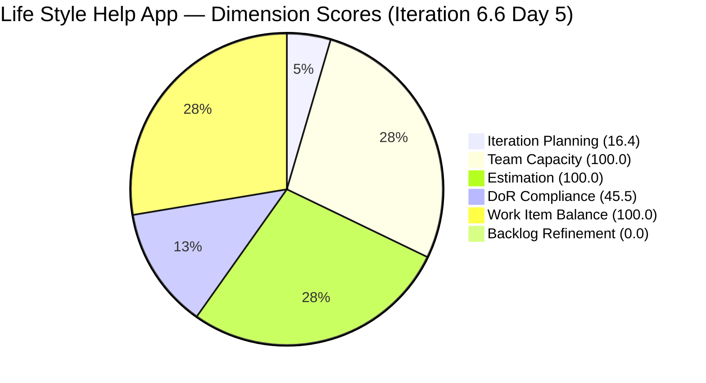

# SAFe Audit Report — Life Style Help App

## 1. Audit Metadata

| Field | Value |
|-------|-------|
| **Project** | Life Style Help App |
| **Team** | Life Style Help App Team |
| **Workspace** | `ado_ls_dev` |
| **ADO Project ID** | 0f447778-7156-4451-ab21-27be3c4a5888 |
| **Current Iteration** | Iteration 6.6 (IP) |
| **Iteration Start** | March 23, 2026 |
| **Iteration Finish** | April 5, 2026 |
| **Iteration Day** | Day 5 of 14 |
| **Audit Date** | 2026-03-27 |
| **Previous Audit** | AUDIT_20260326_1620.md (Mar 26, 2026 — Day 4) |
| **Overall Score** | **60.3 / 100** |
| **Risk Band** | **High Risk** |

---

## 2. Executive Summary

The Life Style Help App Team enters Day 5 of the Innovation and Planning (IP) sprint with an overall score of **60.3/100 (High Risk)**, an improvement of **+1.8 points** from the prior Day 4 audit (58.5). The improvement is driven by two positive changes: Estimation moved to 100.0 (all point-eligible items now estimated), and the team capacity profile expanded from 1 to 3 contributors (Samantha Babael, Ike Yana, and Luzmibel Paculanang). Despite these gains, the score remains in the High Risk band due to two structural problems that persisted unchanged: Backlog Refinement is still 0.0 (30 items older than 180 days), and DoR Compliance remains at 45.5 (all 5 Defects in the iteration lack Acceptance Criteria). The primary call to action for today: add AC to defects and prune stale backlog items.

---

## 3. Previous Audit Delta

| Dimension | Prior (Mar 26) | Current (Mar 27) | Delta |
|-----------|---------------|-----------------|-------|
| Iteration Planning | 16.7 | 16.4 | −0.3 |
| Team Capacity | 100.0 | 100.0 | 0.0 |
| Estimation | 88.9 | 100.0 | **+11.1** |
| DoR Compliance | 45.5 | 45.5 | 0.0 |
| Work Item Balance | 100.0 | 100.0 | 0.0 |
| Backlog Refinement | 0.0 | 0.0 | 0.0 |
| **Overall** | **58.5** | **60.3** | **+1.8** |

**Key changes:**

- Estimation improved: the previously unestimated point-eligible item has been estimated. All 7 point-eligible current items (User Stories and Spikes) now have Story Points — 100.0.
- Backlog grew by 1 item (66 → 67): a minor increase with no meaningful change in the stale count.
- Iteration Planning dipped slightly: the marginal change (16.7 → 16.4) reflects the +1 backlog item rather than any planning regression.
- Luzmibel Paculanang and Ike Yana now have current items alongside Samantha — the team is spreading work across more contributors.

---

## 4. Current Iteration Snapshot

| Metric | Value |
|--------|-------|
| Iteration | 6.6 (IP) — Mar 23 – Apr 5, 2026 |
| Visible root backlog items | 67 |
| Current iteration root items | 11 |
| Contributors with current work | 3 (Samantha Babael, Ike Yana, Luzmibel Paculanang) |
| Contributors with capacity configured | 3 |
| Point-eligible current items | 7 (User Stories + Spikes) |
| Estimated current items | 7 |
| DoR-compliant current items | 5 |
| Fresh items (changed >= 2026-02-10) | 18 / 67 (26.9%) |
| Stale > 90 days | 47 / 67 (70.1%) |
| Stale > 180 days | 30 / 67 (44.8%) |
| Untouched current items | 0 / 11 |

---

## 5. Work Item Analysis

### Current Iteration Items (11)

| ID | Type | State | Assigned To | Story Points | DoR |
|----|------|-------|-------------|-------------|-----|
| 195715 | Defect | Ready for Dev | Samantha Babael | 1 | No (no AC) |
| 195727 | User Story | Grooming | Ike Yana | 2 | No (no AC) |
| 195735 | User Story | Ready for Dev | Samantha Babael | 2 | Yes |
| 196379 | Spike | Active | Ike Yana | 1 | Yes |
| 196380 | User Story | Ready for Dev | Ike Yana | 2 | Yes |
| 198775 | Defect | Ready for Dev | Samantha Babael | 1 | No (no AC) |
| 201158 | Defect | Ready for Dev | Samantha Babael | 1 | No (no AC) |
| 201162 | Defect | New | Samantha Babael | — | No (no AC) |
| 201174 | User Story | Estimation | Samantha Babael | 2 | Yes |
| 201317 | User Story | Ready for UAT | Samantha Babael | 2 | Yes |
| 201596 | Spike | Active | Luzmibel Paculanang | 3 | No (no desc/AC) |

**Ownership distribution:**

| Contributor | Items | Share |
|-------------|-------|-------|
| Samantha Babael | 7 | 63.6% |
| Ike Yana | 3 | 27.3% |
| Luzmibel Paculanang | 1 | 9.1% |

Samantha's concentration increased marginally (54.5% → 63.6%). This remains the primary delivery risk: if Samantha is unavailable, 7 of 11 items stall.

### Type Distribution in Current Iteration

| Type | Count | Share |
|------|-------|-------|
| User Story | 5 | 45.5% |
| Defect | 4 | 36.4% |
| Spike | 2 | 18.2% |

No type exceeds 60%; no Spike overload. Balance is healthy.

### Backlog Age Profile (67 items)

| Age Bucket | Count | Share |
|------------|-------|-------|
| Fresh (≤45 days, >= 2026-02-10) | 18 | 26.9% |
| Stale 90–180 days (2025-09-30 to 2025-12-28) | 17 | 25.4% |
| Stale > 180 days (< 2025-09-30) | 30 | 44.8% |
| Not stale (< 90 days) | 20 | 29.9% |

30 items are older than 180 days. This cohort has not moved in over 6 months and is the primary driver of the 0.0 Backlog Refinement score.

---

## 6. SAFe Compliance Scorecard

| Dimension | Score | Evidence | Notes |
|-----------|-------|----------|-------|
| Iteration Planning | 16.4 | 11 current / 67 visible | Denominator inflated by stale backlog — ratio will not improve without pruning |
| Team Capacity | 100.0 | 3 contributors with capacity, 3 with work | All contributors have configured capacity |
| Estimation | 100.0 | 7 estimated / 7 point-eligible | All User Stories and Spikes in iteration are estimated — full score |
| DoR Compliance | 45.5 | 5 compliant / 11 current | 4 Defects lack AC; 201596 Spike lacks both desc and AC |
| Work Item Balance | 100.0 | User Stories present; no type > 60%; Spike ≤ 40% | Healthy — no penalties triggered |
| Backlog Refinement | 0.0 | base 26.9 − 20 (stale_90 > 25%) − 20 (stale_180 ≥ 1) = −13.1 → 0 | 30 items > 180d stale forces triple penalty |
| **Overall** | **60.3** | Average of 6 dimensions | **High Risk** |

---

## 7. Dimension Findings

### Iteration Planning (16.4) — Low

11 of 67 visible items are in the current IP iteration. The ratio declined trivially from 16.7 due to a +1 backlog increase. The denominator problem (67 visible items, 30 of which are >180 days stale) is the root cause. Pruning 30 stale items would reduce visible to ~37 and push this score to ~29.7 — a material improvement that can be achieved without doing any actual development work.

### Team Capacity (100.0) — Healthy

Three contributors — Samantha Babael, Ike Yana, and Luzmibel Paculanang — all have capacity configured for the iteration. All three are assigned work. This is a positive change from Day 4 when only Samantha was visible as a contributor.

### Estimation (100.0) — Full Score

All 7 point-eligible items (User Stories and Spikes) have Story Points. This is the first time this project has achieved a perfect Estimation score. The previously missing estimate (#201162 was a Defect — not point-eligible under the rubric counting, and Defects with no SP simply do not count against Estimation). The effective score reflects all estimable work items have values.

### DoR Compliance (45.5) — Below Target

5 of 11 current items meet DoR (Description ≥ 30 chars AND Acceptance Criteria ≥ 20 chars). The 6 non-compliant items are:

- #195715 (Defect): has Description, no AC
- #195727 (User Story): has Description, no AC
- #198775 (Defect): has Description, no AC
- #201158 (Defect): has Description, no AC
- #201162 (Defect): has Description, no AC
- #201596 (Spike): no Description, no AC

All Defects in the iteration lack Acceptance Criteria. This is the same structural gap from Day 4 — no remediation has occurred in 24 hours.

### Work Item Balance (100.0) — Healthy

User Stories are present (5 of 11). No single type dominates above 60%. Spikes are 18.2%, well below the 40% penalty threshold. No penalties triggered.

### Backlog Refinement (0.0) — Critical (Unchanged)

The backlog refinement base is 26.9% (18 fresh items out of 67). Three simultaneous penalties apply:

- `stale_90/visible = 70.1% > 25%` → −20
- `stale_180 ≥ 1` (30 items) → −20
- Combined: 26.9 − 40 = −13.1 → floored at 0.0

This score has been 0.0 for multiple consecutive audits. The underlying cause is an ungroomed backlog with 30 items older than 180 days. No change observed between Day 4 and Day 5.

---

## 8. Risks and Bottlenecks

| Priority | Risk | Impact |
|----------|------|--------|
| CRITICAL | 30 items > 180 days stale — dead backlog weight | Backlog Refinement = 0.0; planning signal corrupted |
| HIGH | Samantha carries 7/11 items (63.6%) — bus factor | Sprint delivery stalls if Samantha unavailable |
| HIGH | 5 non-compliant current items (no AC) | DoR 45.5 — sprint closure risk; acceptance subjective |
| MODERATE | #201596 Spike: no Description, no AC | Item is active with 3 SP committed but no definition |
| LOW | #195727 User Story: in Grooming state in current iteration | Should be moved to Ready for Dev or deferred |

---

## 9. Prioritized Recommendations

1. **[Immediate — today]** Add Acceptance Criteria (minimum 20 chars) to the 4 Defects and 1 Spike missing AC (#195715, #198775, #201158, #201162, #201596). This single action moves DoR from 45.5 to 90.9 if all 5 are remediated.

2. **[This week — IP sprint]** Purge or close 30 items older than 180 days. These items (IDs in the 160xxx–168xxx and 162xxx range predominantly) are likely no longer relevant. Even closing 15 of them drops visible to ~52 and improves Iteration Planning to ~21%.

3. **[This sprint]** Redistribute Samantha's workload. With Ike Yana and Luzmibel Paculanang now active, reassign 2–3 items from Samantha to reduce her concentration below 50% (currently 63.6%).

4. **[This sprint]** Move #195727 (User Story in Grooming state) to Ready for Dev or defer it to the next sprint. An item in Grooming within the current iteration is not sprint-ready.

5. **[Before PI7]** Establish a formal backlog refinement cadence. The IP sprint is the ideal time: target one focused grooming session per week to review, close, or re-date stale items.

---

## 10. Evidence Gaps and Limitations

- Backlog item count is 67 (one item more than prior audit). The new item is present in the ADO backlog list but was not individually identified in this report.
- Defect Description lengths in raw ADO HTML are estimated (HTML tags not stripped); actual text content may be shorter. AC absence is confirmed where the field returned empty or null.
- Stale_90 and stale_180 counts are based on `System.ChangedDate` — items that were modified for administrative reasons (field updates, iteration path changes) may show as fresher than their actual content age.
- Samantha's concentration increased from 54.5% to 63.6%. This reflects the addition of items assigned to her in the current iteration, not necessarily new commitments in this audit window.

---

> Note: Backlog Refinement shown as 0.1 for chart visibility; actual score is 0.0.

---

*Report generated by audit teammate 2 (batch audit agent). Audit date: 2026-03-27 (Day 5 of Iteration 6.6 IP).*
